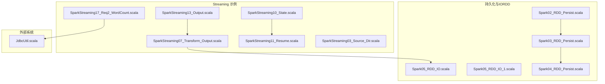
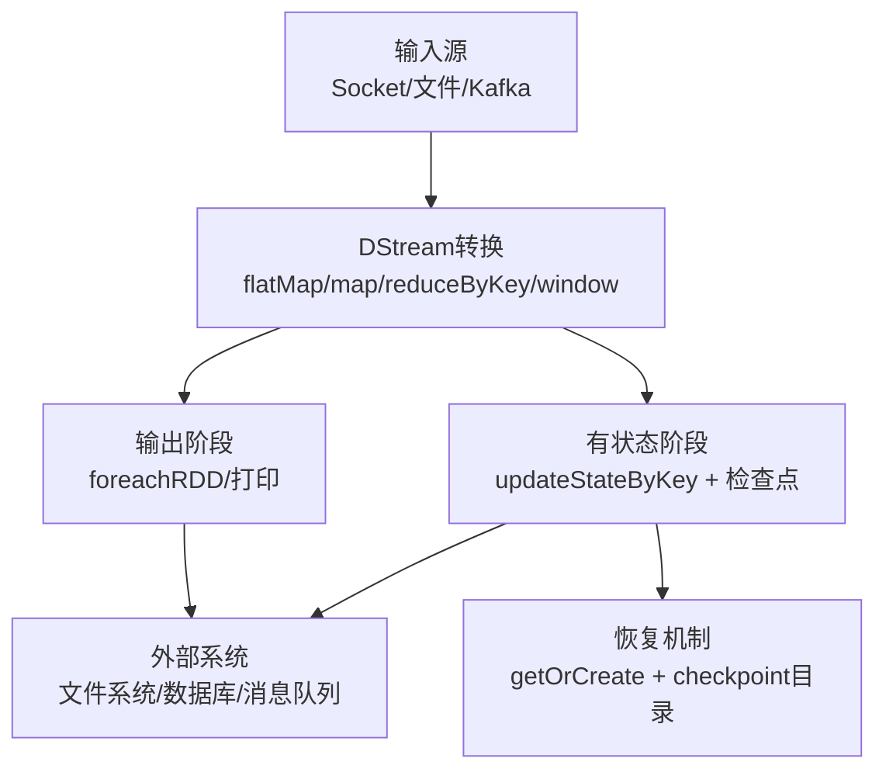
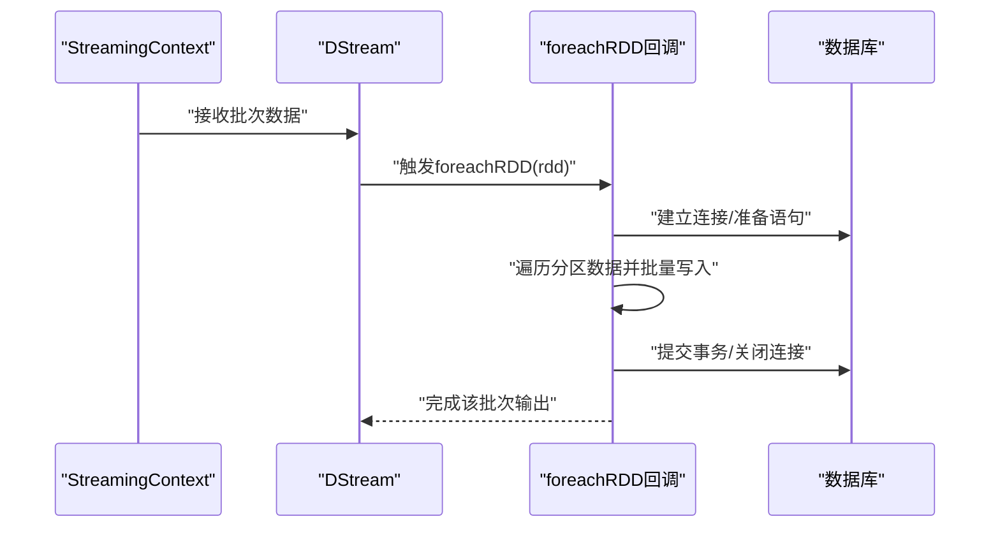
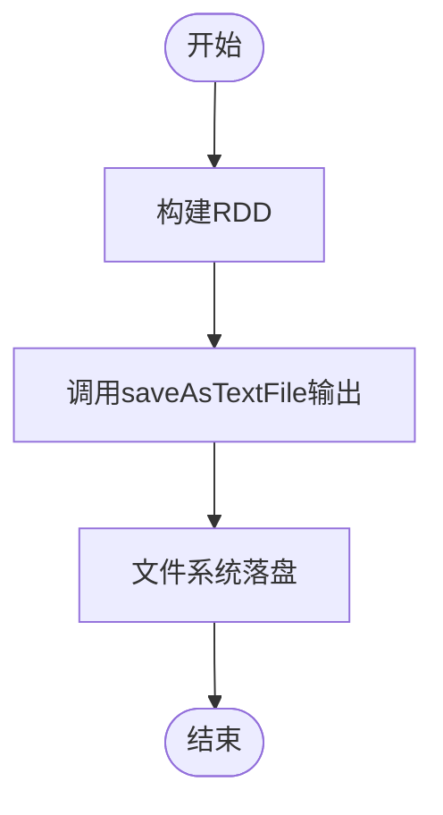
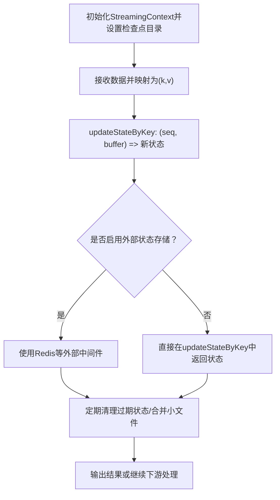
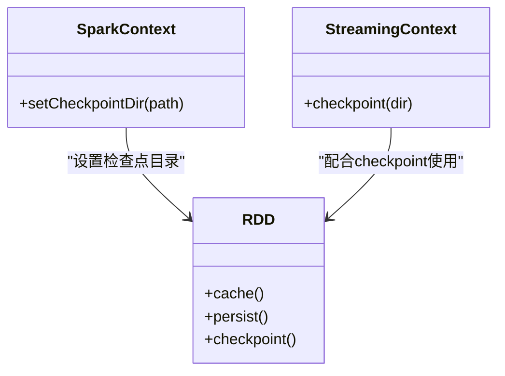
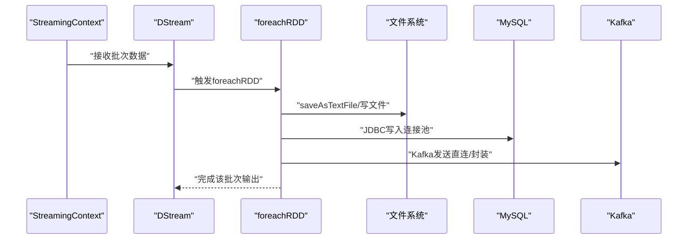
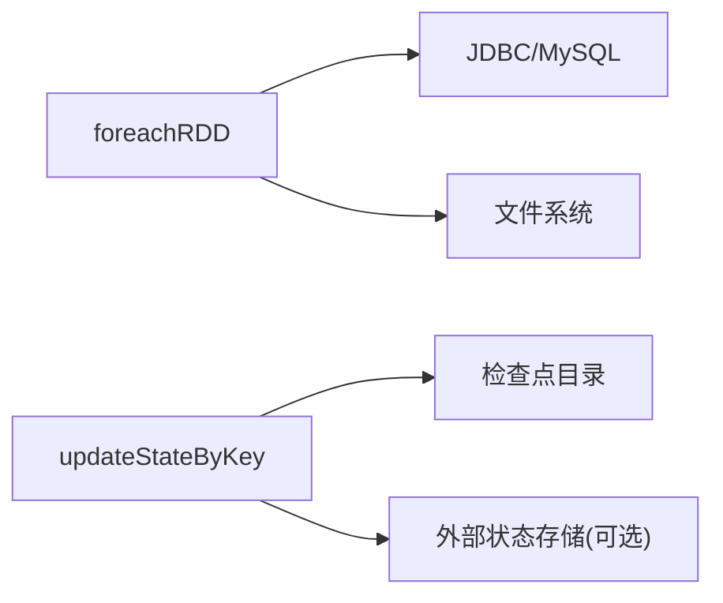

# 输出操作与数据持久化

<cite>
**本文引用的文件**
- [SparkStreaming13_Output.scala](file://_04_sparkTest/src/main/java/com/atguigu/bigdata/spark/streaming/SparkStreaming13_Output.scala)
- [SparkStreaming07_Transform_Output.scala](file://_04_sparkTest/src/main/java/com/atguigu/bigdata/spark/streaming/SparkStreaming07_Transform_Output.scala)
- [SparkStreaming10_State.scala](file://_04_sparkTest/src/main/java/com/atguigu/bigdata/spark/streaming/SparkStreaming10_State.scala)
- [SparkStreaming11_Resume.scala](file://_04_sparkTest/src/main/java/com/atguigu/bigdata/spark/streaming/SparkStreaming11_Resume.scala)
- [SparkStreaming17_Req2_WordCount.scala](file://_04_sparkTest/src/main/java/com/atguigu/bigdata/spark/streaming/SparkStreaming17_Req2_WordCount.scala)
- [JdbcUtil.scala](file://_04_sparkTest/src/main/java/com/atguigu/bigdata/spark/streaming/JdbcUtil.scala)
- [Spark05_RDD_IO.scala](file://_04_sparkTest/src/main/java/com/atguigu/bigdata/spark/core/rdd/persist/Spark05_RDD_IO.scala)
- [Spark05_RDD_IO_1.scala](file://_04_sparkTest/src/main/java/com/atguigu/bigdata/spark/core/rdd/persist/Spark05_RDD_IO_1.scala)
- [Spark02_RDD_Persist.scala](file://_04_sparkTest/src/main/java/com/atguigu/bigdata/spark/core/rdd/persist/Spark02_RDD_Persist.scala)
- [Spark03_RDD_Persist.scala](file://_04_sparkTest/src/main/java/com/atguigu/bigdata/spark/core/rdd/persist/Spark03_RDD_Persist.scala)
- [Spark04_RDD_Persist.scala](file://_04_sparkTest/src/main/java/com/atguigu/bigdata/spark/core/rdd/persist/Spark04_RDD_Persist.scala)
- [SparkStreaming03_Source_Dir.scala](file://_04_sparkTest/src/main/java/com/atguigu/bigdata/spark/streaming/SparkStreaming03_Source_Dir.scala)
</cite>

## 目录
1. [引言](#引言)
2. [项目结构](#项目结构)
3. [核心组件](#核心组件)
4. [架构总览](#架构总览)
5. [详细组件分析](#详细组件分析)
6. [依赖分析](#依赖分析)
7. [性能考虑](#性能考虑)
8. [故障排查指南](#故障排查指南)
9. [结论](#结论)
10. [附录](#附录)

## 引言
本技术文档聚焦于Spark Streaming的输出操作与数据持久化实践，围绕以下主题展开：
- 输出操作：foreachRDD、saveAsTextFile（通过RDD持久化）、updateStateByKey（有状态计算）
- 可靠性保障：至少一次（At-least-once）与恰好一次（Exactly-once）语义的实现思路与适用场景
- 数据持久化策略：内存缓存、磁盘持久化、检查点、以及与数据库等外部系统的集成
- 实战示例：将流处理结果输出到文件系统、数据库、消息队列等不同介质
- 性能优化与故障恢复策略

## 项目结构
本仓库中与Spark Streaming输出与持久化直接相关的示例集中在“_04_sparkTest/src/main/java/com/atguigu/bigdata/spark/streaming”目录下，涵盖：
- 环境搭建与基础WordCount
- 文件系统与Socket作为输入源
- 输出到控制台、自定义foreachRDD输出
- 有状态更新updateStateByKey与检查点恢复
- 将结果写入MySQL数据库
- 与数据库连接工具类

图表来源
- [SparkStreaming13_Output.scala](file://_04_sparkTest/src/main/java/com/atguigu/bigdata/spark/streaming/SparkStreaming13_Output.scala#L1-L35)
- [SparkStreaming07_Transform_Output.scala](file://_04_sparkTest/src/main/java/com/atguigu/bigdata/spark/streaming/SparkStreaming07_Transform_Output.scala#L1-L37)
- [SparkStreaming10_State.scala](file://_04_sparkTest/src/main/java/com/atguigu/bigdata/spark/streaming/SparkStreaming10_State.scala#L1-L40)
- [SparkStreaming11_Resume.scala](file://_04_sparkTest/src/main/java/com/atguigu/bigdata/spark/streaming/SparkStreaming11_Resume.scala#L1-L35)
- [SparkStreaming17_Req2_WordCount.scala](file://_04_sparkTest/src/main/java/com/atguigu/bigdata/spark/streaming/SparkStreaming17_Req2_WordCount.scala#L1-L89)
- [SparkStreaming03_Source_Dir.scala](file://_04_sparkTest/src/main/java/com/atguigu/bigdata/spark/streaming/SparkStreaming03_Source_Dir.scala#L1-L28)
- [Spark05_RDD_IO.scala](file://_04_sparkTest/src/main/java/com/atguigu/bigdata/spark/core/rdd/persist/Spark05_RDD_IO.scala#L1-L27)
- [Spark05_RDD_IO_1.scala](file://_04_sparkTest/src/main/java/com/atguigu/bigdata/spark/core/rdd/persist/Spark05_RDD_IO_1.scala#L1-L21)
- [Spark02_RDD_Persist.scala](file://_04_sparkTest/src/main/java/com/atguigu/bigdata/spark/core/rdd/persist/Spark02_RDD_Persist.scala#L1-L38)
- [Spark03_RDD_Persist.scala](file://_04_sparkTest/src/main/java/com/atguigu/bigdata/spark/core/rdd/persist/Spark03_RDD_Persist.scala#L1-L38)
- [Spark04_RDD_Persist.scala](file://_04_sparkTest/src/main/java/com/atguigu/bigdata/spark/core/rdd/persist/Spark04_RDD_Persist.scala#L1-L35)
- [JdbcUtil.scala](file://_04_sparkTest/src/main/java/com/atguigu/bigdata/spark/streaming/JdbcUtil.scala#L1-L31)

章节来源
- [SparkStreaming13_Output.scala](file://_04_sparkTest/src/main/java/com/atguigu/bigdata/spark/streaming/SparkStreaming13_Output.scala#L1-L35)
- [SparkStreaming07_Transform_Output.scala](file://_04_sparkTest/src/main/java/com/atguigu/bigdata/spark/streaming/SparkStreaming07_Transform_Output.scala#L1-L37)
- [SparkStreaming10_State.scala](file://_04_sparkTest/src/main/java/com/atguigu/bigdata/spark/streaming/SparkStreaming10_State.scala#L1-L40)
- [SparkStreaming11_Resume.scala](file://_04_sparkTest/src/main/java/com/atguigu/bigdata/spark/streaming/SparkStreaming11_Resume.scala#L1-L35)
- [SparkStreaming17_Req2_WordCount.scala](file://_04_sparkTest/src/main/java/com/atguigu/bigdata/spark/streaming/SparkStreaming17_Req2_WordCount.scala#L1-L89)
- [SparkStreaming03_Source_Dir.scala](file://_04_sparkTest/src/main/java/com/atguigu/bigdata/spark/streaming/SparkStreaming03_Source_Dir.scala#L1-L28)
- [Spark05_RDD_IO.scala](file://_04_sparkTest/src/main/java/com/atguigu/bigdata/spark/core/rdd/persist/Spark05_RDD_IO.scala#L1-L27)
- [Spark05_RDD_IO_1.scala](file://_04_sparkTest/src/main/java/com/atguigu/bigdata/spark/core/rdd/persist/Spark05_RDD_IO_1.scala#L1-L21)
- [Spark02_RDD_Persist.scala](file://_04_sparkTest/src/main/java/com/atguigu/bigdata/spark/core/rdd/persist/Spark02_RDD_Persist.scala#L1-L38)
- [Spark03_RDD_Persist.scala](file://_04_sparkTest/src/main/java/com/atguigu/bigdata/spark/core/rdd/persist/Spark03_RDD_Persist.scala#L1-L38)
- [Spark04_RDD_Persist.scala](file://_04_sparkTest/src/main/java/com/atguigu/bigdata/spark/core/rdd/persist/Spark04_RDD_Persist.scala#L1-L35)
- [JdbcUtil.scala](file://_04_sparkTest/src/main/java/com/atguigu/bigdata/spark/streaming/JdbcUtil.scala#L1-L31)

## 核心组件
- 输出操作
  - foreachRDD：在每个批次的RDD上执行自定义输出逻辑，适合写入数据库、消息队列等外部系统
  - saveAsTextFile：通过底层RDD的持久化能力将结果写出到文件系统
- 有状态计算
  - updateStateByKey：基于键的状态累加，需配合检查点目录以实现容错与恢复
- 数据持久化
  - 内存缓存：cache/persist（仅当前应用生命周期内有效）
  - 磁盘持久化：checkpoint（可切断血缘并跨应用恢复）
  - 外部存储集成：JDBC写入MySQL、Kafka直连写入（示例中体现）

章节来源
- [SparkStreaming13_Output.scala](file://_04_sparkTest/src/main/java/com/atguigu/bigdata/spark/streaming/SparkStreaming13_Output.scala#L1-L35)
- [SparkStreaming10_State.scala](file://_04_sparkTest/src/main/java/com/atguigu/bigdata/spark/streaming/SparkStreaming10_State.scala#L1-L40)
- [Spark02_RDD_Persist.scala](file://_04_sparkTest/src/main/java/com/atguigu/bigdata/spark/core/rdd/persist/Spark02_RDD_Persist.scala#L1-L38)
- [Spark03_RDD_Persist.scala](file://_04_sparkTest/src/main/java/com/atguigu/bigdata/spark/core/rdd/persist/Spark03_RDD_Persist.scala#L1-L38)
- [Spark04_RDD_Persist.scala](file://_04_sparkTest/src/main/java/com/atguigu/bigdata/spark/core/rdd/persist/Spark04_RDD_Persist.scala#L1-L35)
- [Spark05_RDD_IO.scala](file://_04_sparkTest/src/main/java/com/atguigu/bigdata/spark/core/rdd/persist/Spark05_RDD_IO.scala#L1-L27)
- [SparkStreaming17_Req2_WordCount.scala](file://_04_sparkTest/src/main/java/com/atguigu/bigdata/spark/streaming/SparkStreaming17_Req2_WordCount.scala#L1-L89)
- [JdbcUtil.scala](file://_04_sparkTest/src/main/java/com/atguigu/bigdata/spark/streaming/JdbcUtil.scala#L1-L31)

## 架构总览
下图展示了从输入源到输出目标的整体数据流路径，以及状态管理与持久化策略的位置。

图表来源
- [SparkStreaming07_Transform_Output.scala](file://_04_sparkTest/src/main/java/com/atguigu/bigdata/spark/streaming/SparkStreaming07_Transform_Output.scala#L1-L37)
- [SparkStreaming13_Output.scala](file://_04_sparkTest/src/main/java/com/atguigu/bigdata/spark/streaming/SparkStreaming13_Output.scala#L1-L35)
- [SparkStreaming10_State.scala](file://_04_sparkTest/src/main/java/com/atguigu/bigdata/spark/streaming/SparkStreaming10_State.scala#L1-L40)
- [SparkStreaming11_Resume.scala](file://_04_sparkTest/src/main/java/com/atguigu/bigdata/spark/streaming/SparkStreaming11_Resume.scala#L1-L35)
- [SparkStreaming17_Req2_WordCount.scala](file://_04_sparkTest/src/main/java/com/atguigu/bigdata/spark/streaming/SparkStreaming17_Req2_WordCount.scala#L1-L89)

## 详细组件分析

### 组件A：输出操作之 foreachRDD
- 作用：对每个批次的RDD执行自定义输出逻辑，常用于写入数据库、消息队列或文件系统
- 关键点：
  - 在foreachRDD中进行资源获取与释放（连接池、预编译语句等）
  - 注意幂等性与去重策略，避免重复写入
  - 对于高吞吐场景，建议批量写入与异步提交

图表来源
- [SparkStreaming13_Output.scala](file://_04_sparkTest/src/main/java/com/atguigu/bigdata/spark/streaming/SparkStreaming13_Output.scala#L1-L35)
- [SparkStreaming17_Req2_WordCount.scala](file://_04_sparkTest/src/main/java/com/atguigu/bigdata/spark/streaming/SparkStreaming17_Req2_WordCount.scala#L1-L89)
- [JdbcUtil.scala](file://_04_sparkTest/src/main/java/com/atguigu/bigdata/spark/streaming/JdbcUtil.scala#L1-L31)

章节来源
- [SparkStreaming13_Output.scala](file://_04_sparkTest/src/main/java/com/atguigu/bigdata/spark/streaming/SparkStreaming13_Output.scala#L1-L35)
- [SparkStreaming17_Req2_WordCount.scala](file://_04_sparkTest/src/main/java/com/atguigu/bigdata/spark/streaming/SparkStreaming17_Req2_WordCount.scala#L1-L89)
- [JdbcUtil.scala](file://_04_sparkTest/src/main/java/com/atguigu/bigdata/spark/streaming/JdbcUtil.scala#L1-L31)

### 组件B：输出操作之 saveAsTextFile（通过RDD持久化）
- 作用：将RDD序列化并写出到文件系统，适合离线归档或后续批处理
- 关键点：
  - 适用于无状态批处理结果的落盘
  - 与foreachRDD相比，更适合非事务性、幂等性强的场景

图表来源
- [Spark05_RDD_IO.scala](file://_04_sparkTest/src/main/java/com/atguigu/bigdata/spark/core/rdd/persist/Spark05_RDD_IO.scala#L1-L27)
- [Spark05_RDD_IO_1.scala](file://_04_sparkTest/src/main/java/com/atguigu/bigdata/spark/core/rdd/persist/Spark05_RDD_IO_1.scala#L1-L21)

章节来源
- [Spark05_RDD_IO.scala](file://_04_sparkTest/src/main/java/com/atguigu/bigdata/spark/core/rdd/persist/Spark05_RDD_IO.scala#L1-L27)
- [Spark05_RDD_IO_1.scala](file://_04_sparkTest/src/main/java/com/atguigu/bigdata/spark/core/rdd/persist/Spark05_RDD_IO_1.scala#L1-L21)

### 组件C：有状态计算 updateStateByKey
- 作用：对每个键维护一个长期状态，并在新批次到达时增量更新
- 关键点：
  - 需要设置检查点目录以支持状态恢复
  - 若状态过大，建议结合外部存储（如Redis）做状态外置
  - 小文件问题：频繁小文件会影响读取效率，应避免直接将状态持久化为小文件

图表来源
- [SparkStreaming10_State.scala](file://_04_sparkTest/src/main/java/com/atguigu/bigdata/spark/streaming/SparkStreaming10_State.scala#L1-L40)
- [SparkStreaming11_Resume.scala](file://_04_sparkTest/src/main/java/com/atguigu/bigdata/spark/streaming/SparkStreaming11_Resume.scala#L1-L35)

章节来源
- [SparkStreaming10_State.scala](file://_04_sparkTest/src/main/java/com/atguigu/bigdata/spark/streaming/SparkStreaming10_State.scala#L1-L40)
- [SparkStreaming11_Resume.scala](file://_04_sparkTest/src/main/java/com/atguigu/bigdata/spark/streaming/SparkStreaming11_Resume.scala#L1-L35)

### 组件D：数据持久化策略（内存/磁盘/检查点）
- 内存持久化（cache/persist）：提升重复计算的复用率，但仅限当前应用生命周期
- 磁盘持久化（checkpoint）：切断血缘关系，支持跨应用恢复；适合长作业与状态恢复
- 结合使用：先cache再checkpoint，既能减少重复计算，又能确保恢复安全

图表来源
- [Spark02_RDD_Persist.scala](file://_04_sparkTest/src/main/java/com/atguigu/bigdata/spark/core/rdd/persist/Spark02_RDD_Persist.scala#L1-L38)
- [Spark03_RDD_Persist.scala](file://_04_sparkTest/src/main/java/com/atguigu/bigdata/spark/core/rdd/persist/Spark03_RDD_Persist.scala#L1-L38)
- [Spark04_RDD_Persist.scala](file://_04_sparkTest/src/main/java/com/atguigu/bigdata/spark/core/rdd/persist/Spark04_RDD_Persist.scala#L1-L35)

章节来源
- [Spark02_RDD_Persist.scala](file://_04_sparkTest/src/main/java/com/atguigu/bigdata/spark/core/rdd/persist/Spark02_RDD_Persist.scala#L1-L38)
- [Spark03_RDD_Persist.scala](file://_04_sparkTest/src/main/java/com/atguigu/bigdata/spark/core/rdd/persist/Spark03_RDD_Persist.scala#L1-L38)
- [Spark04_RDD_Persist.scala](file://_04_sparkTest/src/main/java/com/atguigu/bigdata/spark/core/rdd/persist/Spark04_RDD_Persist.scala#L1-L35)

### 组件E：外部系统集成（文件系统/数据库/消息队列）
- 文件系统：通过saveAsTextFile等将结果写出到HDFS或本地文件系统
- 数据库：使用JDBC连接池将结果写入MySQL，注意幂等与事务控制
- 消息队列：可通过Kafka直连写入，或在foreachRDD中封装发送逻辑

图表来源
- [SparkStreaming03_Source_Dir.scala](file://_04_sparkTest/src/main/java/com/atguigu/bigdata/spark/streaming/SparkStreaming03_Source_Dir.scala#L1-L28)
- [SparkStreaming17_Req2_WordCount.scala](file://_04_sparkTest/src/main/java/com/atguigu/bigdata/spark/streaming/SparkStreaming17_Req2_WordCount.scala#L1-L89)
- [JdbcUtil.scala](file://_04_sparkTest/src/main/java/com/atguigu/bigdata/spark/streaming/JdbcUtil.scala#L1-L31)

章节来源
- [SparkStreaming03_Source_Dir.scala](file://_04_sparkTest/src/main/java/com/atguigu/bigdata/spark/streaming/SparkStreaming03_Source_Dir.scala#L1-L28)
- [SparkStreaming17_Req2_WordCount.scala](file://_04_sparkTest/src/main/java/com/atguigu/bigdata/spark/streaming/SparkStreaming17_Req2_WordCount.scala#L1-L89)
- [JdbcUtil.scala](file://_04_sparkTest/src/main/java/com/atguigu/bigdata/spark/streaming/JdbcUtil.scala#L1-L31)

## 依赖分析
- 组件耦合
  - foreachRDD与外部系统（数据库、消息队列）存在强耦合，需关注连接管理与异常处理
  - updateStateByKey与检查点目录存在强依赖，未配置检查点会导致运行时异常
- 外部依赖
  - MySQL驱动与连接池（Druid）用于数据库写入
  - 文件系统（HDFS/本地）用于持久化输出

图表来源
- [SparkStreaming13_Output.scala](file://_04_sparkTest/src/main/java/com/atguigu/bigdata/spark/streaming/SparkStreaming13_Output.scala#L1-L35)
- [SparkStreaming10_State.scala](file://_04_sparkTest/src/main/java/com/atguigu/bigdata/spark/streaming/SparkStreaming10_State.scala#L1-L40)
- [SparkStreaming17_Req2_WordCount.scala](file://_04_sparkTest/src/main/java/com/atguigu/bigdata/spark/streaming/SparkStreaming17_Req2_WordCount.scala#L1-L89)
- [JdbcUtil.scala](file://_04_sparkTest/src/main/java/com/atguigu/bigdata/spark/streaming/JdbcUtil.scala#L1-L31)

章节来源
- [SparkStreaming13_Output.scala](file://_04_sparkTest/src/main/java/com/atguigu/bigdata/spark/streaming/SparkStreaming13_Output.scala#L1-L35)
- [SparkStreaming10_State.scala](file://_04_sparkTest/src/main/java/com/atguigu/bigdata/spark/streaming/SparkStreaming10_State.scala#L1-L40)
- [SparkStreaming17_Req2_WordCount.scala](file://_04_sparkTest/src/main/java/com/atguigu/bigdata/spark/streaming/SparkStreaming17_Req2_WordCount.scala#L1-L89)
- [JdbcUtil.scala](file://_04_sparkTest/src/main/java/com/atguigu/bigdata/spark/streaming/JdbcUtil.scala#L1-L31)

## 性能考虑
- 输出性能
  - foreachRDD中批量写入与连接池复用，避免频繁创建/销毁连接
  - 控制批次大小与并行度，平衡延迟与吞吐
- 状态管理
  - updateStateByKey避免产生过多小文件，必要时合并或转存至外部存储
  - 使用检查点定期截断血缘，降低恢复时间
- 存储层
  - 文件系统：合理设置分区数量，避免小文件风暴
  - 数据库：使用批量插入、事务控制与索引优化

## 故障排查指南
- updateStateByKey报错“未设置检查点目录”
  - 解决：在StreamingContext上调用checkpoint并指定目录
- 恢复失败或状态丢失
  - 检查检查点目录权限与可用性
  - 使用getOrCreate从检查点恢复上下文
- 数据重复写入
  - 在数据库侧采用去重策略（如唯一键/幂等更新）
  - 在输出端引入去重逻辑（如基于批次ID或时间窗口的去重）
- 性能瓶颈
  - 分析foreachRDD中的I/O热点，优化批量大小与并发
  - 对大状态键进行拆分或降维，减少单键状态规模

章节来源
- [SparkStreaming10_State.scala](file://_04_sparkTest/src/main/java/com/atguigu/bigdata/spark/streaming/SparkStreaming10_State.scala#L1-L40)
- [SparkStreaming11_Resume.scala](file://_04_sparkTest/src/main/java/com/atguigu/bigdata/spark/streaming/SparkStreaming11_Resume.scala#L1-L35)
- [SparkStreaming17_Req2_WordCount.scala](file://_04_sparkTest/src/main/java/com/atguigu/bigdata/spark/streaming/SparkStreaming17_Req2_WordCount.scala#L1-L89)

## 结论
- foreachRDD提供了灵活的输出扩展能力，适合对接数据库、消息队列等外部系统
- saveAsTextFile适用于离线归档与后续批处理
- updateStateByKey与检查点配合可实现有状态计算与容错恢复
- 持久化策略应结合业务需求选择内存缓存、磁盘检查点与外部存储
- 性能与可靠性需在输出策略、状态管理与存储层协同优化

## 附录
- 示例参考路径
  - foreachRDD输出示例：[SparkStreaming13_Output.scala](file://_04_sparkTest/src/main/java/com/atguigu/bigdata/spark/streaming/SparkStreaming13_Output.scala#L1-L35)
  - saveAsTextFile示例：[Spark05_RDD_IO.scala](file://_04_sparkTest/src/main/java/com/atguigu/bigdata/spark/core/rdd/persist/Spark05_RDD_IO.scala#L1-L27)
  - updateStateByKey示例：[SparkStreaming10_State.scala](file://_04_sparkTest/src/main/java/com/atguigu/bigdata/spark/streaming/SparkStreaming10_State.scala#L1-L40)
  - 恢复示例：[SparkStreaming11_Resume.scala](file://_04_sparkTest/src/main/java/com/atguigu/bigdata/spark/streaming/SparkStreaming11_Resume.scala#L1-L35)
  - 数据库写入示例：[SparkStreaming17_Req2_WordCount.scala](file://_04_sparkTest/src/main/java/com/atguigu/bigdata/spark/streaming/SparkStreaming17_Req2_WordCount.scala#L1-L89)
  - 数据库连接工具：[JdbcUtil.scala](file://_04_sparkTest/src/main/java/com/atguigu/bigdata/spark/streaming/JdbcUtil.scala#L1-L31)
  - 持久化与检查点：[Spark02_RDD_Persist.scala](file://_04_sparkTest/src/main/java/com/atguigu/bigdata/spark/core/rdd/persist/Spark02_RDD_Persist.scala#L1-L38)、[Spark03_RDD_Persist.scala](file://_04_sparkTest/src/main/java/com/atguigu/bigdata/spark/core/rdd/persist/Spark03_RDD_Persist.scala#L1-L38)、[Spark04_RDD_Persist.scala](file://_04_sparkTest/src/main/java/com/atguigu/bigdata/spark/core/rdd/persist/Spark04_RDD_Persist.scala#L1-L35)