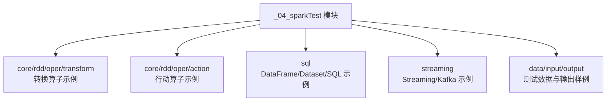
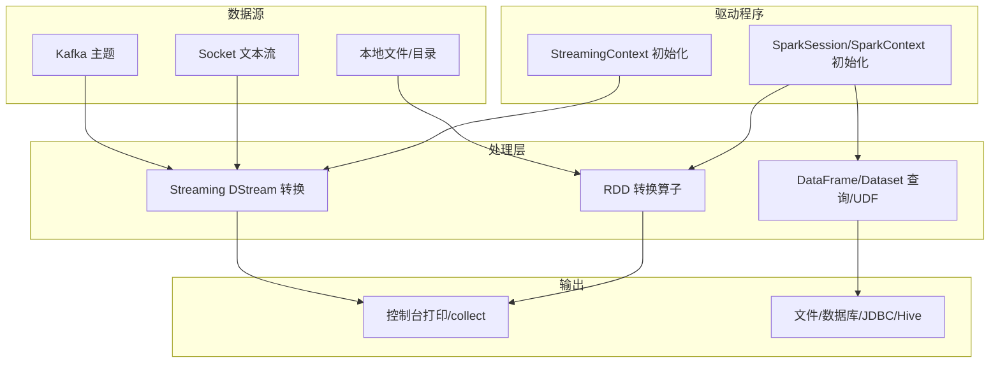
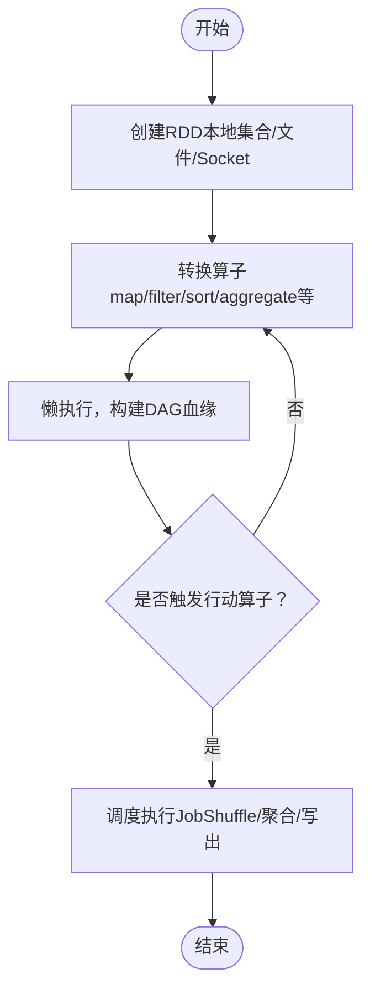
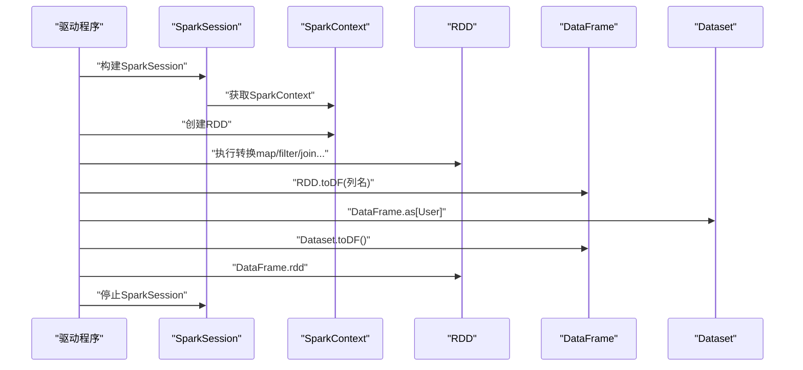
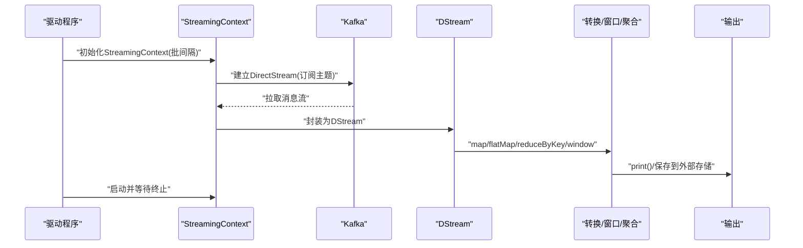
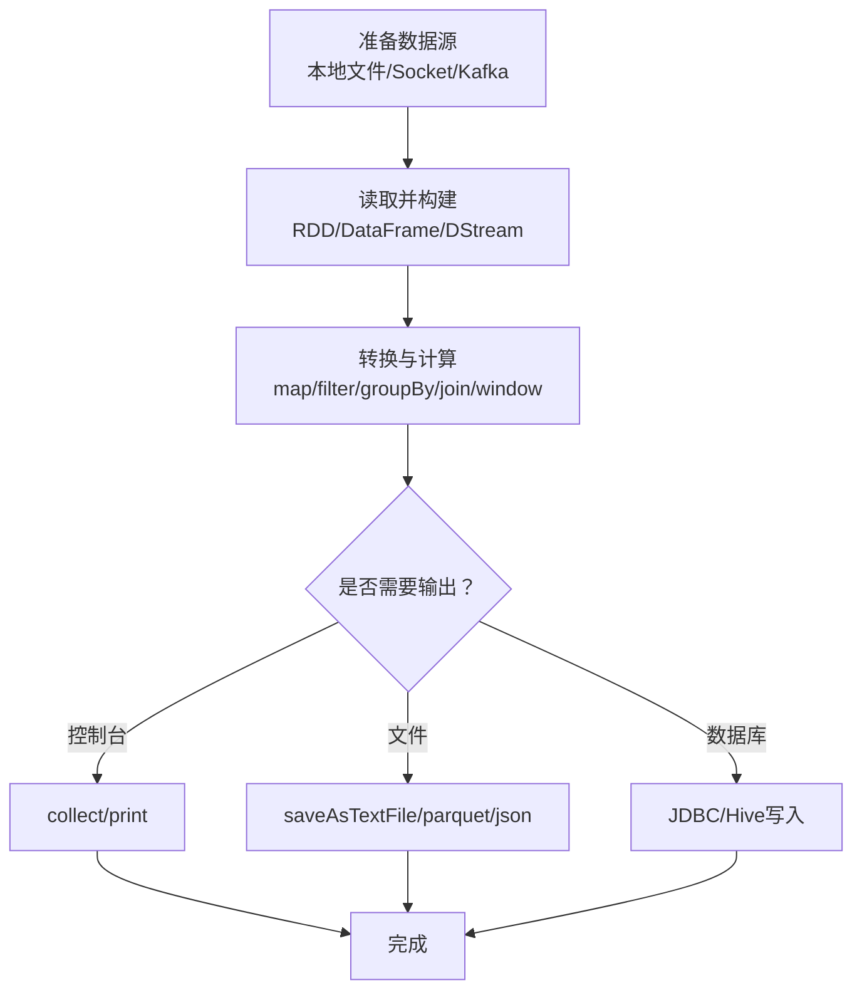
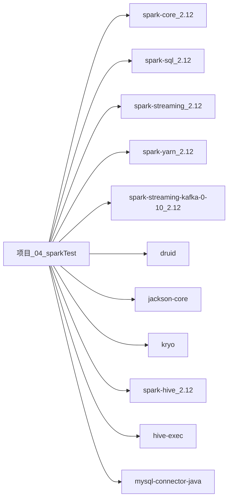

# Spark计算框架

<cite>
**本文引用的文件**
- [_04_sparkTest/pom.xml](file://_04_sparkTest/pom.xml)
- [_04_sparkTest/src/main/java/com/atguigu/bigdata/spark/core/rdd/oper/action/Spark01_RDD_Oper_Action.scala](file://_04_sparkTest/src/main/java/com/atguigu/bigdata/spark/core/rdd/oper/action/Spark01_RDD_Oper_Action.scala)
- [_04_sparkTest/src/main/java/com/atguigu/bigdata/spark/core/rdd/oper/action/Spark02_RDD_Oper_Action.scala](file://_04_sparkTest/src/main/java/com/atguigu/bigdata/spark/core/rdd/oper/action/Spark02_RDD_Oper_Action.scala)
- [_04_sparkTest/src/main/java/com/atguigu/bigdata/spark/core/rdd/oper/action/Spark09_RDD_Oper_Action.scala](file://_04_sparkTest/src/main/java/com/atguigu/bigdata/spark/core/rdd/oper/action/Spark09_RDD_Oper_Action.scala)
- [_04_sparkTest/src/main/java/com/atguigu/bigdata/spark/core/rdd/oper/action/Spark09_RDD_Oper_Action_2.scala](file://_04_sparkTest/src/main/java/com/atguigu/bigdata/spark/core/rdd/oper/action/Spark09_RDD_Oper_Action_2.scala)
- [_04_sparkTest/src/main/java/com/atguigu/bigdata/spark/core/rdd/oper/transform/Spark08_RDD_Oper_Transform.scala](file://_04_sparkTest/src/main/java/com/atguigu/bigdata/spark/core/rdd/oper/transform/Spark08_RDD_Oper_Transform.scala)
- [_04_sparkTest/src/main/java/com/atguigu/bigdata/spark/sql/Spark04_SQL_RDD_DataFrame_Dataset.scala](file://_04_sparkTest/src/main/java/com/atguigu/bigdata/spark/sql/Spark04_SQL_RDD_DataFrame_Dataset.scala)
- [_04_sparkTest/src/main/java/com/atguigu/bigdata/spark/sql/Spark05_SQL_RDD_Dataset.scala](file://_04_sparkTest/src/main/java/com/atguigu/bigdata/spark/sql/Spark05_SQL_RDD_Dataset.scala)
- [_04_sparkTest/src/main/java/com/atguigu/bigdata/spark/sql/Spark06_SQL_DataFrame_Dataset.scala](file://_04_sparkTest/src/main/java/com/atguigu/bigdata/spark/sql/Spark06_SQL_DataFrame_Dataset.scala)
- [_04_sparkTest/src/main/java/com/atguigu/bigdata/spark/streaming/SparkStreaming06_Source_Kafka.scala](file://_04_sparkTest/src/main/java/com/atguigu/bigdata/spark/streaming/SparkStreaming06_Source_Kafka.scala)
- [_04_sparkTest/src/main/java/com/atguigu/bigdata/spark/streaming/SparkStreaming06_Source_Kafka_fixing.scala](file://_04_sparkTest/src/main/java/com/atguigu/bigdata/spark/streaming/SparkStreaming06_Source_Kafka_fixing.scala)
- [_04_sparkTest/src/main/java/com/atguigu/bigdata/spark/streaming/SparkStreaming08_NoState.scala](file://_04_sparkTest/src/main/java/com/atguigu/bigdata/spark/streaming/SparkStreaming08_NoState.scala)
- [_04_sparkTest/src/main/java/com/atguigu/bigdata/spark/streaming/SparkStreaming16_Req3_LastHourAnalysis_1.scala](file://_04_sparkTest/src/main/java/com/atguigu/bigdata/spark/streaming/SparkStreaming16_Req3_LastHourAnalysis_1.scala)
- [_04_sparkTest/data/word.txt](file://_04_sparkTest/data/word.txt)
- [_04_sparkTest/data/word1.txt](file://_04_sparkTest/data/word1.txt)
- [_04_sparkTest/input/word.txt](file://_04_sparkTest/input/word.txt)
- [_04_sparkTest/output1/part-00000](file://_04_sparkTest/output1/part-00000)
</cite>

## 目录
1. [引言](#引言)
2. [项目结构](#项目结构)
3. [核心组件](#核心组件)
4. [架构总览](#架构总览)
5. [详细组件分析](#详细组件分析)
6. [依赖分析](#依赖分析)
7. [性能考虑](#性能考虑)
8. [故障排查指南](#故障排查指南)
9. [结论](#结论)
10. [附录](#附录)

## 引言
本技术文档围绕Spark计算框架展开，系统讲解RDD编程模型、DataFrame与Dataset API、Spark SQL查询引擎、内存计算优势及与传统MapReduce的改进点，并结合仓库中的Scala示例，给出从数据读取、转换到结果输出的完整作业开发流程。同时覆盖Spark Streaming流处理、窗口与状态管理、以及与Kafka集成的典型场景；最后总结性能优化技巧与最佳实践，帮助开发者构建高效的大规模数据处理应用。

## 项目结构
该仓库包含多个模块，其中与Spark直接相关的是“_04_sparkTest”模块，内含大量基于Scala的Spark示例，涵盖RDD算子、DataFrame/Dataset互转、Spark SQL、Spark Streaming（含Kafka源）等主题。示例通过本地模式运行，便于理解核心概念与API使用方式。

章节来源
- [pom.xml](file://_04_sparkTest/pom.xml#L1-L73)

## 核心组件
- SparkSession/SparkContext：统一入口，负责创建Spark上下文、配置集群连接与应用程序信息。
- RDD：弹性分布式数据集，提供丰富的转换与行动算子，是Spark最基础的抽象。
- DataFrame/Dataset：结构化数据抽象，DataFrame是特定泛型的Dataset，具备强类型与编译期安全。
- StreamingContext：流处理入口，按采集周期切分数据，支持多种数据源（如Socket、Kafka）。
- Spark SQL：基于DataFrame/Dataset的声明式查询引擎，可与Hive、JDBC等外部存储集成。

章节来源
- [Spark01_RDD_Oper_Action.scala](file://_04_sparkTest/src/main/java/com/atguigu/bigdata/spark/core/rdd/oper/action/Spark01_RDD_Oper_Action.scala#L1-L27)
- [Spark04_SQL_RDD_DataFrame_Dataset.scala](file://_04_sparkTest/src/main/java/com/atguigu/bigdata/spark/sql/Spark04_SQL_RDD_DataFrame_Dataset.scala#L1-L52)
- [SparkStreaming06_Source_Kafka.scala](file://_04_sparkTest/src/main/java/com/atguigu/bigdata/spark/streaming/SparkStreaming06_Source_Kafka.scala#L1-L72)

## 架构总览
下图展示了Spark在本地单机模式下的典型工作流：从SparkSession/StreamingContext初始化，到数据源接入（文件、Socket、Kafka），再到转换与行动阶段，最终输出或持久化。

## 详细组件分析

### RDD编程模型与算子
- 转换算子（懒执行）：如采样、映射、过滤等，构成血缘关系链。
- 行动算子（触发执行）：如collect、reduce、count等，会真正执行Job。
- 分区与序列化：分区数量影响并行度；闭包与序列化问题可能导致任务无法传输到Executor。

图表来源
- [Spark01_RDD_Oper_Action.scala](file://_04_sparkTest/src/main/java/com/atguigu/bigdata/spark/core/rdd/oper/action/Spark01_RDD_Oper_Action.scala#L1-L27)
- [Spark02_RDD_Oper_Action.scala](file://_04_sparkTest/src/main/java/com/atguigu/bigdata/spark/core/rdd/oper/action/Spark02_RDD_Oper_Action.scala#L1-L28)
- [Spark08_RDD_Oper_Transform.scala](file://_04_sparkTest/src/main/java/com/atguigu/bigdata/spark/core/rdd/oper/transform/Spark08_RDD_Oper_Transform.scala#L1-L36)

章节来源
- [Spark01_RDD_Oper_Action.scala](file://_04_sparkTest/src/main/java/com/atguigu/bigdata/spark/core/rdd/oper/action/Spark01_RDD_Oper_Action.scala#L1-L27)
- [Spark02_RDD_Oper_Action.scala](file://_04_sparkTest/src/main/java/com/atguigu/bigdata/spark/core/rdd/oper/action/Spark02_RDD_Oper_Action.scala#L1-L28)
- [Spark08_RDD_Oper_Transform.scala](file://_04_sparkTest/src/main/java/com/atguigu/bigdata/spark/core/rdd/oper/transform/Spark08_RDD_Oper_Transform.scala#L1-L36)
- [Spark09_RDD_Oper_Action.scala](file://_04_sparkTest/src/main/java/com/atguigu/bigdata/spark/core/rdd/oper/action/Spark09_RDD_Oper_Action.scala#L1-L25)
- [Spark09_RDD_Oper_Action_2.scala](file://_04_sparkTest/src/main/java/com/atguigu/bigdata/spark/core/rdd/oper/action/Spark09_RDD_Oper_Action_2.scala#L1-L34)

### DataFrame与Dataset API
- RDD ↔ DataFrame/Dataset：通过隐式转换实现，DataFrame是弱类型，Dataset是强类型。
- 结构化查询：可使用DSL或SQL风格API，支持UDF、窗口、聚合、连接等。
- 内存与缓存：DataFrame/Dataset可缓存至内存/磁盘，提升迭代与复用效率。

图表来源
- [Spark04_SQL_RDD_DataFrame_Dataset.scala](file://_04_sparkTest/src/main/java/com/atguigu/bigdata/spark/sql/Spark04_SQL_RDD_DataFrame_Dataset.scala#L1-L52)
- [Spark05_SQL_RDD_Dataset.scala](file://_04_sparkTest/src/main/java/com/atguigu/bigdata/spark/sql/Spark05_SQL_RDD_Dataset.scala#L1-L43)
- [Spark06_SQL_DataFrame_Dataset.scala](file://_04_sparkTest/src/main/java/com/atguigu/bigdata/spark/sql/Spark06_SQL_DataFrame_Dataset.scala#L1-L49)

章节来源
- [Spark04_SQL_RDD_DataFrame_Dataset.scala](file://_04_sparkTest/src/main/java/com/atguigu/bigdata/spark/sql/Spark04_SQL_RDD_DataFrame_Dataset.scala#L1-L52)
- [Spark05_SQL_RDD_Dataset.scala](file://_04_sparkTest/src/main/java/com/atguigu/bigdata/spark/sql/Spark05_SQL_RDD_Dataset.scala#L1-L43)
- [Spark06_SQL_DataFrame_Dataset.scala](file://_04_sparkTest/src/main/java/com/atguigu/bigdata/spark/sql/Spark06_SQL_DataFrame_Dataset.scala#L1-L49)

### Spark SQL查询引擎
- 声明式API：支持结构化数据的过滤、投影、分组、排序、连接等。
- 与外部系统集成：可对接Hive、JDBC、文件系统等，实现ETL与即席查询。
- 性能优化：Catalyst优化器、Tungsten执行器、列式存储与向量化执行。

（本节为概念性说明，不直接分析具体文件）

### Spark Streaming流处理与Kafka集成
- 数据源：Socket、Kafka等，按采集周期切分为DStream。
- 处理模型：在DStream上进行map/flatMap/reduceByKey等转换，必要时使用transform桥接RDD。
- 窗口与状态：窗口操作用于滑动统计，无状态/有状态更新视需求而定。
- Kafka直连：使用KafkaUtils创建DirectStream，避免Receiver的反压与二次复制。

图表来源
- [SparkStreaming06_Source_Kafka.scala](file://_04_sparkTest/src/main/java/com/atguigu/bigdata/spark/streaming/SparkStreaming06_Source_Kafka.scala#L1-L72)
- [SparkStreaming06_Source_Kafka_fixing.scala](file://_04_sparkTest/src/main/java/com/atguigu/bigdata/spark/streaming/SparkStreaming06_Source_Kafka_fixing.scala#L30-L48)
- [SparkStreaming08_NoState.scala](file://_04_sparkTest/src/main/java/com/atguigu/bigdata/spark/streaming/SparkStreaming08_NoState.scala#L1-L39)
- [SparkStreaming16_Req3_LastHourAnalysis_1.scala](file://_04_sparkTest/src/main/java/com/atguigu/bigdata/spark/streaming/SparkStreaming16_Req3_LastHourAnalysis_1.scala#L28-L62)

章节来源
- [SparkStreaming06_Source_Kafka.scala](file://_04_sparkTest/src/main/java/com/atguigu/bigdata/spark/streaming/SparkStreaming06_Source_Kafka.scala#L1-L72)
- [SparkStreaming06_Source_Kafka_fixing.scala](file://_04_sparkTest/src/main/java/com/atguigu/bigdata/spark/streaming/SparkStreaming06_Source_Kafka_fixing.scala#L30-L48)
- [SparkStreaming08_NoState.scala](file://_04_sparkTest/src/main/java/com/atguigu/bigdata/spark/streaming/SparkStreaming08_NoState.scala#L1-L39)
- [SparkStreaming16_Req3_LastHourAnalysis_1.scala](file://_04_sparkTest/src/main/java/com/atguigu/bigdata/spark/streaming/SparkStreaming16_Req3_LastHourAnalysis_1.scala#L28-L62)

### 作业开发流程（从数据读取到结果输出）
- 本地文件读取：使用SparkContext.textFile读取文本，进行flatMap/word count等处理。
- DataFrame/Dataset处理：通过toDF/as[CaseClass]/select/filter/groupBy等完成结构化分析。
- 流处理：socket/kafka接入，map/flatMap/reduceByKey或窗口聚合，print/saveAsTextFile输出。
- 输出落库/文件：根据场景选择JDBC、Hive、Parquet、JSON或直接输出到控制台。

章节来源
- [Spark01_RDD_Oper_Action.scala](file://_04_sparkTest/src/main/java/com/atguigu/bigdata/spark/core/rdd/oper/action/Spark01_RDD_Oper_Action.scala#L1-L27)
- [Spark04_SQL_RDD_DataFrame_Dataset.scala](file://_04_sparkTest/src/main/java/com/atguigu/bigdata/spark/sql/Spark04_SQL_RDD_DataFrame_Dataset.scala#L1-L52)
- [SparkStreaming06_Source_Kafka.scala](file://_04_sparkTest/src/main/java/com/atguigu/bigdata/spark/streaming/SparkStreaming06_Source_Kafka.scala#L1-L72)

### Scala在Spark开发中的重要性与语法特点
- 强类型与编译期安全：Dataset基于强类型，减少运行时错误。
- 函数式编程：高阶函数、不可变数据结构、惰性求值等特性契合大数据处理。
- 模式匹配与样例类：简洁表达数据结构，便于UDF与结构化处理。
- 隐式转换：简化RDD与DataFrame/Dataset之间的互转。
- 闭包与序列化：注意在Executor端访问的外部变量需可序列化，避免Task not serializable。

章节来源
- [Spark04_SQL_RDD_DataFrame_Dataset.scala](file://_04_sparkTest/src/main/java/com/atguigu/bigdata/spark/sql/Spark04_SQL_RDD_DataFrame_Dataset.scala#L1-L52)
- [Spark09_RDD_Oper_Action_2.scala](file://_04_sparkTest/src/main/java/com/atguigu/bigdata/spark/core/rdd/oper/action/Spark09_RDD_Oper_Action_2.scala#L1-L34)

## 依赖分析
- Spark核心依赖：spark-core、spark-sql、spark-streaming、spark-yarn、spark-streaming-kafka-0-10。
- 其他工具：Druid连接池、Jackson JSON、Kryo序列化、Hive执行、MySQL驱动等。

图表来源
- [pom.xml](file://_04_sparkTest/pom.xml#L1-L73)

章节来源
- [pom.xml](file://_04_sparkTest/pom.xml#L1-L73)

## 性能考虑
- 并行度与分区：合理设置分区数，避免数据倾斜；使用repartition/coalesce调整分区。
- 序列化与闭包：优先使用可序列化的闭包变量，避免大对象跨节点传输；必要时使用广播变量。
- 缓存策略：对热数据使用cache/persist，选择合适的存储级别（内存/磁盘/混合）。
- Shuffle与聚合：尽量减少shuffle，使用combineByKey/aggregateByKey降低网络开销。
- 窗口与状态：窗口大小与步长权衡吞吐与延迟；无状态计算优先于有状态更新。
- I/O优化：批量读写、压缩编码（snappy/lzo/zstd）、列式存储（Parquet/ORC）。

（本节提供通用指导，不直接分析具体文件）

## 故障排查指南
- 闭包与序列化错误（Task not serializable）：确保在Executor端使用的外部变量可序列化，或通过广播变量共享只读数据。
- 数据倾斜：检查key分布，使用随机前缀打散、宽依赖合并、自定义分区器等方式缓解。
- 内存溢出：适当增大executor内存，启用YARN内存监控；减少中间结果缓存，及时unpersist。
- Kafka消费异常：确认Bootstrap Servers、Group ID、序列化器配置正确；检查Topic是否存在与权限。
- 窗口统计不准：核对窗口范围与步长，确保时间字段解析正确；必要时使用EventTime与Watermark。

章节来源
- [Spark09_RDD_Oper_Action_2.scala](file://_04_sparkTest/src/main/java/com/atguigu/bigdata/spark/core/rdd/oper/action/Spark09_RDD_Oper_Action_2.scala#L1-L34)
- [SparkStreaming06_Source_Kafka.scala](file://_04_sparkTest/src/main/java/com/atguigu/bigdata/spark/streaming/SparkStreaming06_Source_Kafka.scala#L1-L72)
- [SparkStreaming16_Req3_LastHourAnalysis_1.scala](file://_04_sparkTest/src/main/java/com/atguigu/bigdata/spark/streaming/SparkStreaming16_Req3_LastHourAnalysis_1.scala#L28-L62)

## 结论
通过仓库中的Scala示例，可以系统掌握Spark的核心能力：RDD的转换与行动、DataFrame/Dataset的结构化处理、Spark SQL的查询能力，以及Spark Streaming与Kafka的实时处理。结合合理的分区、缓存与序列化策略，可在本地或集群环境中构建高性能的大规模数据处理应用。

## 附录
- 示例数据文件路径参考：
  - [word.txt](file://_04_sparkTest/data/word.txt)
  - [word1.txt](file://_04_sparkTest/data/word1.txt)
  - [input/word.txt](file://_04_sparkTest/input/word.txt)
- 示例输出样例参考：
  - [part-00000](file://_04_sparkTest/output1/part-00000)