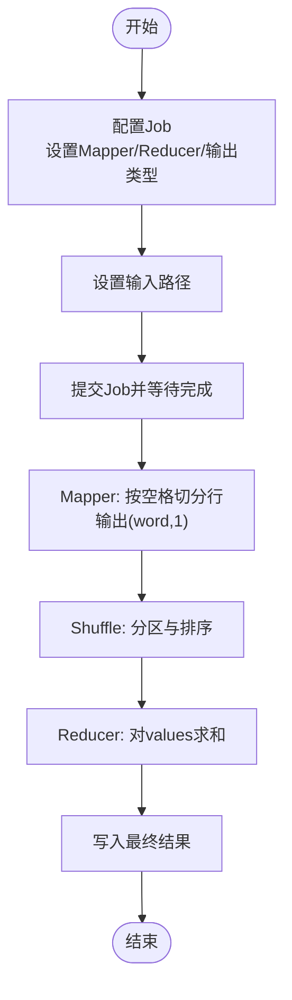

# WordCount经典示例

<cite>
**本文引用的文件**
- [WordCountDriver.java](file://_02_hadoop/MapReduceDemo/src/main/java/com/atguigu/mapreduce/wordcount/WordCountDriver.java)
- [WordCountMapper.java](file://_02_hadoop/MapReduceDemo/src/main/java/com/atguigu/mapreduce/wordcount/WordCountMapper.java)
- [WordCountReducer.java](file://_02_hadoop/MapReduceDemo/src/main/java/com/atguigu/mapreduce/wordcount/WordCountReducer.java)
- [WordCount.java](file://_02_hadoop/YarnDemo/src/main/java/com/atguigu/yarn/WordCount.java)
- [WordCountDriver.java](file://_02_hadoop/YarnDemo/src/main/java/com/atguigu/yarn/WordCountDriver.java)
- [Spark01_Env.scala](file://_04_sparkTest/src/main/java/com/atguigu/bigdata/spark/core/wc/Spark01_Env.scala)
- [Spark02_WordCount.scala](file://_04_sparkTest/src/main/java/com/atguigu/bigdata/spark/core/wc/Spark02_WordCount.scala)
- [Spark03_WordCount.scala](file://_04_sparkTest/src/main/java/com/atguigu/bigdata/spark/core/wc/Spark03_WordCount.scala)
- [Spark04_WordCount.scala](file://_04_sparkTest/src/main/java/com/atguigu/bigdata/spark/core/wc/Spark04_WordCount.scala)
- [Spark05_WordCount.scala](file://_04_sparkTest/src/main/java/com/atguigu/bigdata/spark/core/wc/Spark05_WordCount.scala)
</cite>

## 目录
1. [引言](#引言)
2. [项目结构](#项目结构)
3. [核心组件](#核心组件)
4. [架构总览](#架构总览)
5. [详细组件分析](#详细组件分析)
6. [依赖关系分析](#依赖关系分析)
7. [性能考虑](#性能考虑)
8. [故障排查指南](#故障排查指南)
9. [结论](#结论)
10. [附录](#附录)

## 引言
本实践文档围绕“WordCount”这一经典大数据处理范式，系统梳理从环境搭建到数据读取、文本分割、词频统计、结果输出的完整流程，并通过多版本实现对比，帮助读者理解不同编程模型（MapReduce、Spark RDD）在任务分解、数据流转与性能优化上的差异。文档同时提供常见问题定位与调试技巧，帮助初学者快速掌握作业执行原理与调试方法。

## 项目结构
该仓库包含多套WordCount实现，涵盖传统MapReduce与Spark RDD两代计算范式。其中：
- MapReduce实现位于“_02_hadoop/MapReduceDemo”与“_02_hadoop/YarnDemo”，分别展示了标准Job配置与ToolRunner封装两种运行方式。
- Spark RDD实现位于“_04_sparkTest/src/main/java/com/atguigu/bigdata/spark/core/wc”，包含环境初始化与多条链式调用的WordCount实现。

图示来源
- [WordCountDriver.java](file://_02_hadoop/MapReduceDemo/src/main/java/com/atguigu/mapreduce/wordcount/WordCountDriver.java#L1-L48)
- [WordCount.java](file://_02_hadoop/YarnDemo/src/main/java/com/atguigu/yarn/WordCount.java#L1-L100)
- [Spark01_Env.scala](file://_04_sparkTest/src/main/java/com/atguigu/bigdata/spark/core/wc/Spark01_Env.scala#L1-L21)
- [Spark02_WordCount.scala](file://_04_sparkTest/src/main/java/com/atguigu/bigdata/spark/core/wc/Spark02_WordCount.scala#L1-L23)

章节来源
- [WordCountDriver.java](file://_02_hadoop/MapReduceDemo/src/main/java/com/atguigu/mapreduce/wordcount/WordCountDriver.java#L1-L48)
- [WordCount.java](file://_02_hadoop/YarnDemo/src/main/java/com/atguigu/yarn/WordCount.java#L1-L100)
- [Spark01_Env.scala](file://_04_sparkTest/src/main/java/com/atguigu/bigdata/spark/core/wc/Spark01_Env.scala#L1-L21)

## 核心组件
- MapReduce三段式
  - Mapper：按空格切分行，逐词输出键值对。
  - Reducer：对相同key的计数进行累加。
  - Driver：配置Job、设置输入输出路径并提交作业。
- Spark RDD链式处理
  - 初始化Spark环境。
  - 读取文本文件，扁平化为单词，按单词分组并统计数量。
  - 收集结果并在驱动端打印。

章节来源
- [WordCountMapper.java](file://_02_hadoop/MapReduceDemo/src/main/java/com/atguigu/mapreduce/wordcount/WordCountMapper.java#L1-L41)
- [WordCountReducer.java](file://_02_hadoop/MapReduceDemo/src/main/java/com/atguigu/mapreduce/wordcount/WordCountReducer.java#L1-L36)
- [WordCountDriver.java](file://_02_hadoop/MapReduceDemo/src/main/java/com/atguigu/mapreduce/wordcount/WordCountDriver.java#L1-L48)
- [Spark02_WordCount.scala](file://_04_sparkTest/src/main/java/com/atguigu/bigdata/spark/core/wc/Spark02_WordCount.scala#L1-L23)

## 架构总览
下图展示从输入到输出的整体流程，映射到具体代码文件：

图示来源
- [WordCountDriver.java](file://_02_hadoop/MapReduceDemo/src/main/java/com/atguigu/mapreduce/wordcount/WordCountDriver.java#L1-L48)
- [WordCountMapper.java](file://_02_hadoop/MapReduceDemo/src/main/java/com/atguigu/mapreduce/wordcount/WordCountMapper.java#L1-L41)
- [WordCountReducer.java](file://_02_hadoop/MapReduceDemo/src/main/java/com/atguigu/mapreduce/wordcount/WordCountReducer.java#L1-L36)

## 详细组件分析

### MapReduce 版本（标准Job）
- 组件职责
  - Mapper：将每行文本按空格拆分为单词，输出(word, 1)。
  - Reducer：对同一单词的所有计数项求和，输出(word, count)。
  - Driver：配置Job、指定Mapper/Reducer、设置输入输出路径并提交。
- 数据流
  - 输入文件被切分为多个split，每个split由独立Mapper处理。
  - Shuffle阶段按key分区并排序，Reducer接收同key的数据集合进行聚合。
- 关键点
  - 输出类型选择Text/IntWritable，保证序列化与比较语义正确。
  - 路径参数需与集群或本地文件系统一致。

图示来源
- [WordCountDriver.java](file://_02_hadoop/MapReduceDemo/src/main/java/com/atguigu/mapreduce/wordcount/WordCountDriver.java#L1-L48)
- [WordCountMapper.java](file://_02_hadoop/MapReduceDemo/src/main/java/com/atguigu/mapreduce/wordcount/WordCountMapper.java#L1-L41)
- [WordCountReducer.java](file://_02_hadoop/MapReduceDemo/src/main/java/com/atguigu/mapreduce/wordcount/WordCountReducer.java#L1-L36)

章节来源
- [WordCountDriver.java](file://_02_hadoop/MapReduceDemo/src/main/java/com/atguigu/mapreduce/wordcount/WordCountDriver.java#L1-L48)
- [WordCountMapper.java](file://_02_hadoop/MapReduceDemo/src/main/java/com/atguigu/mapreduce/wordcount/WordCountMapper.java#L1-L41)
- [WordCountReducer.java](file://_02_hadoop/MapReduceDemo/src/main/java/com/atguigu/mapreduce/wordcount/WordCountReducer.java#L1-L36)

### MapReduce 版本（ToolRunner 封装）
- 组件职责
  - Tool实现run方法，集中配置Job；Driver通过ToolRunner统一入口执行。
  - Mapper/Reducer内嵌于Tool类中，便于复用与扩展。
- 优势
  - 将配置与执行解耦，支持命令行参数传递输入输出路径。
  - 适合多工具场景下的统一调度。

图示来源
- [WordCountDriver.java](file://_02_hadoop/YarnDemo/src/main/java/com/atguigu/yarn/WordCountDriver.java#L1-L32)
- [WordCount.java](file://_02_hadoop/YarnDemo/src/main/java/com/atguigu/yarn/WordCount.java#L1-L100)

章节来源
- [WordCountDriver.java](file://_02_hadoop/YarnDemo/src/main/java/com/atguigu/yarn/WordCountDriver.java#L1-L32)
- [WordCount.java](file://_02_hadoop/YarnDemo/src/main/java/com/atguigu/yarn/WordCount.java#L1-L100)

### Spark RDD 版本
- 组件职责
  - 环境初始化：创建SparkConf与SparkContext。
  - 数据处理：textFile读取文本，flatMap切分单词，groupBy按单词分组，mapValues统计长度，collect收集结果。
- 数据流
  - RDD链式转换，惰性求值，只有触发Action（如collect）才真正执行。
  - 分区策略影响shuffle与聚合性能。

图示来源
- [Spark01_Env.scala](file://_04_sparkTest/src/main/java/com/atguigu/bigdata/spark/core/wc/Spark01_Env.scala#L1-L21)
- [Spark02_WordCount.scala](file://_04_sparkTest/src/main/java/com/atguigu/bigdata/spark/core/wc/Spark02_WordCount.scala#L1-L23)
- [Spark03_WordCount.scala](file://_04_sparkTest/src/main/java/com/atguigu/bigdata/spark/core/wc/Spark03_WordCount.scala#L1-L30)
- [Spark04_WordCount.scala](file://_04_sparkTest/src/main/java/com/atguigu/bigdata/spark/core/wc/Spark04_WordCount.scala#L1-L24)
- [Spark05_WordCount.scala](file://_04_sparkTest/src/main/java/com/atguigu/bigdata/spark/core/wc/Spark05_WordCount.scala#L1-L25)

章节来源
- [Spark01_Env.scala](file://_04_sparkTest/src/main/java/com/atguigu/bigdata/spark/core/wc/Spark01_Env.scala#L1-L21)
- [Spark02_WordCount.scala](file://_04_sparkTest/src/main/java/com/atguigu/bigdata/spark/core/wc/Spark02_WordCount.scala#L1-L23)
- [Spark03_WordCount.scala](file://_04_sparkTest/src/main/java/com/atguigu/bigdata/spark/core/wc/Spark03_WordCount.scala#L1-L30)
- [Spark04_WordCount.scala](file://_04_sparkTest/src/main/java/com/atguigu/bigdata/spark/core/wc/Spark04_WordCount.scala#L1-L24)
- [Spark05_WordCount.scala](file://_04_sparkTest/src/main/java/com/atguigu/bigdata/spark/core/wc/Spark05_WordCount.scala#L1-L25)

### Spark DataFrame API（概念性说明）
- 适用场景
  - 当需要结构化查询、谓词下推、列式存储优化时，DataFrame/Dataset更合适。
- 典型流程
  - 读取文本文件为DataFrame，解析字段，使用groupby/agg统计词频，再写回或直接collect。
- 与RDD对比
  - RDD强调函数式转换与宽依赖shuffle；DataFrame强调逻辑计划优化与执行器优化。
- 注意事项
  - 字段命名与类型一致性，避免隐式转换带来的性能损耗。

（本节为概念性说明，不直接分析具体文件）

## 依赖关系分析
- MapReduce
  - Driver依赖Mapper与Reducer；Mapper/Reducer依赖Hadoop I/O类型（Text/IntWritable）。
  - 输入输出路径依赖文件系统配置。
- Spark
  - 环境初始化依赖SparkConf/SparkContext；后续操作依赖RDD管线。
  - collect触发实际执行，涉及序列化与网络传输成本。

图示来源
- [WordCountDriver.java](file://_02_hadoop/MapReduceDemo/src/main/java/com/atguigu/mapreduce/wordcount/WordCountDriver.java#L1-L48)
- [WordCountMapper.java](file://_02_hadoop/MapReduceDemo/src/main/java/com/atguigu/mapreduce/wordcount/WordCountMapper.java#L1-L41)
- [WordCountReducer.java](file://_02_hadoop/MapReduceDemo/src/main/java/com/atguigu/mapreduce/wordcount/WordCountReducer.java#L1-L36)
- [Spark01_Env.scala](file://_04_sparkTest/src/main/java/com/atguigu/bigdata/spark/core/wc/Spark01_Env.scala#L1-L21)

章节来源
- [WordCountDriver.java](file://_02_hadoop/MapReduceDemo/src/main/java/com/atguigu/mapreduce/wordcount/WordCountDriver.java#L1-L48)
- [Spark01_Env.scala](file://_04_sparkTest/src/main/java/com/atguigu/bigdata/spark/core/wc/Spark01_Env.scala#L1-L21)

## 性能考虑
- 分区策略
  - MapReduce：合理设置reduce端并行度，避免数据倾斜；必要时引入Combiner减少网络传输。
  - Spark：根据数据规模设置分区数，groupByKey前尽量使用aggregateByKey或combineByKey降低shuffle数据量。
- 数据本地性
  - MapReduce：输入分片尽量靠近计算节点，减少跨网络传输。
  - Spark：优先使用本地化读取策略，避免不必要的序列化与网络拷贝。
- 序列化与缓存
  - 使用Kryo等高效序列化器；对热点中间结果进行持久化（如persist/checkpoint）。
- 任务粒度
  - 避免过小的任务导致调度开销过大；避免单任务过大导致尾部任务延迟。

（本节为通用指导，不直接分析具体文件）

## 故障排查指南
- 路径与权限
  - MapReduce：确认输入输出路径存在且具备读写权限；Driver中路径需与集群配置一致。
  - Spark：确认相对/绝对路径与工作目录一致，避免找不到文件。
- 类型与序列化
  - MapReduce：确保Mapper/Reducer输出类型与Job配置一致（Text/IntWritable）。
  - Spark：确保中间与最终类型可序列化，避免collect时异常。
- 依赖与打包
  - MapReduce：Driver需能通过反射定位到对应jar包；ToolRunner模式下注意参数传递顺序。
- 调试建议
  - 逐步缩小问题范围：先验证读取是否成功，再检查切分与聚合逻辑。
  - 使用最小样例数据快速复现；打印关键中间结果（如每行切分后的单词列表）辅助定位。

章节来源
- [WordCountDriver.java](file://_02_hadoop/MapReduceDemo/src/main/java/com/atguigu/mapreduce/wordcount/WordCountDriver.java#L1-L48)
- [WordCount.java](file://_02_hadoop/YarnDemo/src/main/java/com/atguigu/yarn/WordCount.java#L1-L100)
- [Spark02_WordCount.scala](file://_04_sparkTest/src/main/java/com/atguigu/bigdata/spark/core/wc/Spark02_WordCount.scala#L1-L23)

## 结论
通过对比MapReduce与Spark RDD的多版本实现，可以清晰看到两类范式的差异：前者强调分治与shuffle，后者强调函数式转换与优化器。在实际工程中，应结合数据规模、查询复杂度与运维成本选择合适的实现方式，并遵循分区、本地性与序列化等最佳实践，持续优化性能与稳定性。

## 附录
- 运行步骤建议
  - MapReduce：准备输入文件，配置Driver中的输入输出路径，编译打包后提交Job。
  - Spark：准备输入文件，确保路径可访问，运行相应Scala脚本，观察collect输出。
- 进一步学习
  - 尝试引入DataFrame/Dataset进行词频统计，对比执行计划与性能表现。
  - 探索Spark SQL与Hive集成，实现更复杂的文本分析任务。