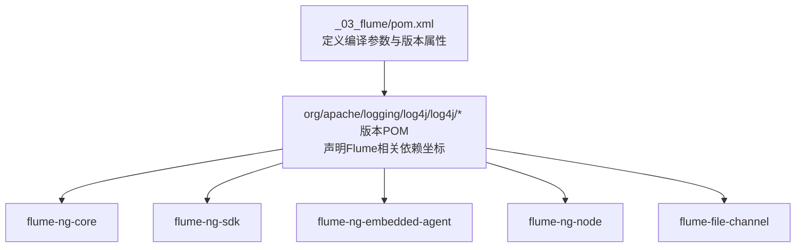
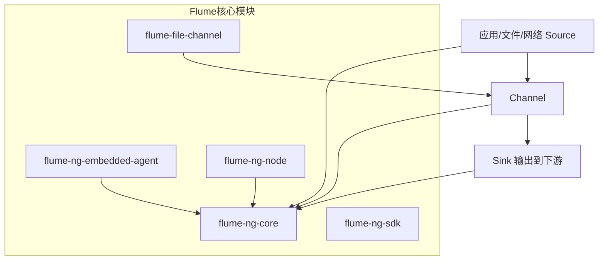
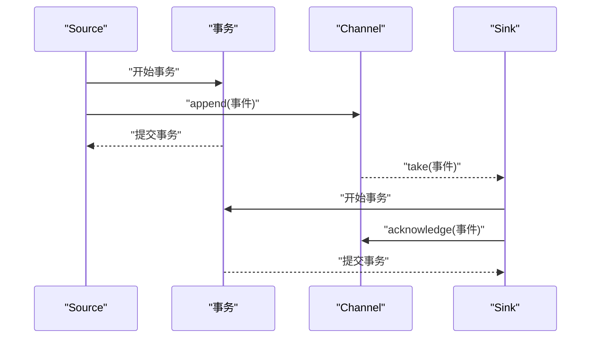
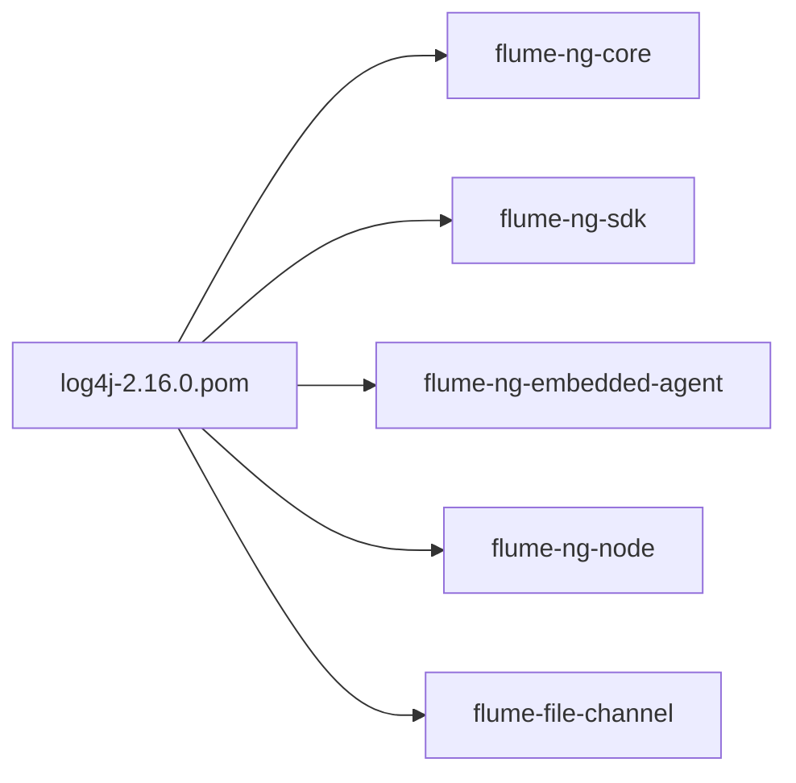

# Flume数据采集

<cite>
**本文引用的文件**
- [_03_flume/pom.xml](file://_03_flume/pom.xml)
- [org/apache/logging/log4j/log4j/2.16.0/log4j-2.16.0.pom](file://org/apache/logging/log4j/log4j/2.16.0/log4j-2.16.0.pom)
- [org/apache/logging/log4j/log4j/2.13.3/log4j-2.13.3.pom](file://org/apache/logging/log4j/log4j/2.13.3/log4j-2.13.3.pom)
- [org/apache/logging/log4j/log4j/2.14.0/log4j-2.14.0.pom](file://org/apache/logging/log4j/log4j/2.14.0/log4j-2.14.0.pom)
- [org/apache/logging/log4j/log4j/2.17.1/log4j-2.17.1.pom](file://org/apache/logging/log4j/log4j/2.17.1/log4j-2.17.1.pom)
</cite>

## 目录
1. [简介](#简介)
2. [项目结构](#项目结构)
3. [核心组件](#核心组件)
4. [架构总览](#架构总览)
5. [组件详解](#组件详解)
6. [依赖关系分析](#依赖关系分析)
7. [性能考量](#性能考量)
8. [故障排查指南](#故障排查指南)
9. [结论](#结论)
10. [附录](#附录)

## 简介
本文件面向需要构建数据采集系统的开发者，系统性梳理Flume分布式日志收集管道的关键知识：Agent、Source、Channel、Sink的协作机制；事件模型与事务机制；可靠性保障；以及在仓库中可见的依赖管理与版本控制实践。同时给出SpoolingDirectorySource、NetCatSource等常见Source的配置要点与适用场景，对比MemoryChannel与FileChannel的性能与适用边界，并总结Sink配置与输出选项、集群部署、性能调优与故障排查的实用建议。

## 项目结构
仓库中与Flume相关的模块位于“_03_flume”目录，当前仅包含一个最小化Maven工程的pom.xml，用于统一编译参数与版本属性。Flume核心依赖在上层日志库依赖文件中以坐标形式出现，体现了对Flume各子模块的版本化管理。

图表来源
- [_03_flume/pom.xml](file://_03_flume/pom.xml#L1-L16)
- [org/apache/logging/log4j/log4j/2.16.0/log4j-2.16.0.pom](file://org/apache/logging/log4j/log4j/2.16.0/log4j-2.16.0.pom#L469-L585)

章节来源
- file://_03_flume/pom.xml#L1-L16
- file://org/apache/logging/log4j/log4j/2.16.0/log4j-2.16.0.pom#L469-L585

## 核心组件
- Agent：Flume进程内的数据采集代理，负责协调Source、Channel、Sink三者之间的数据流转。
- Source：事件来源，从外部系统或文件系统读取数据并封装为事件，写入Channel。
- Channel：事件中转存储，作为Source与Sink之间的缓冲区，支持内存或磁盘两种实现。
- Sink：从Channel取出事件并发送到下游系统（如HDFS、Kafka、Elasticsearch等）。

工作原理与协作机制
- Source将事件写入Channel，采用事务确保写入成功或回滚。
- Channel作为缓冲，提升Source与Sink之间的解耦与吞吐弹性。
- Sink从Channel消费事件并提交事务，完成一次可靠传递。

章节来源
- file://org/apache/logging/log4j/log4j/2.16.0/log4j-2.16.0.pom#L469-L585

## 架构总览
下图展示了Flume在本仓库中体现的模块化依赖关系，以及典型的数据采集路径：Source写入Channel，Sink从Channel消费并输出到目标系统。

图表来源
- [org/apache/logging/log4j/log4j/2.16.0/log4j-2.16.0.pom](file://org/apache/logging/log4j/log4j/2.16.0/log4j-2.16.0.pom#L469-L585)

## 组件详解

### 事件模型与事务机制
- 事件模型：Source将原始数据封装为事件，事件包含头部与体部，携带元数据与负载。
- 事务机制：Source与Sink均以事务方式操作Channel，写入或消费必须成对提交，失败则回滚，从而保证端到端的可靠性。

图表来源
- [org/apache/logging/log4j/log4j/2.16.0/log4j-2.16.0.pom](file://org/apache/logging/log4j/log4j/2.16.0/log4j-2.16.0.pom#L469-L585)

章节来源
- file://org/apache/logging/log4j/log4j/2.16.0/log4j-2.16.0.pom#L469-L585

### Source类型与配置要点
- SpoolingDirectorySource：监控指定目录，将新增文件内容作为事件流入Channel。适用于批量日志落地后的采集。
- NetCatSource：监听TCP端口，按行读取文本作为事件。适用于快速接入测试或轻量级日志上报。

配置要点（基于通用Flume配置语义）
- 指定Source类型与监听地址/端口、目录路径等关键参数。
- 设置批次大小、背压策略与拦截器链，平衡吞吐与延迟。
- 结合Channel容量与Sink并发，避免阻塞。

章节来源
- file://org/apache/logging/log4j/log4j/2.16.0/log4j-2.16.0.pom#L469-L585

### Channel类型与性能对比
- MemoryChannel：基于内存的Channel，读写速度快、延迟低，但不具备持久化能力，Agent重启会丢失未消费事件。
- FileChannel：基于磁盘的Channel，具备持久化能力，可靠性更高，但I/O开销更大，吞吐略低于MemoryChannel。

适用场景
- MemoryChannel：高吞吐、低延迟、可接受短暂重启丢失的场景。
- FileChannel：强可靠性、容错性要求高的生产环境。

章节来源
- file://org/apache/logging/log4j/log4j/2.16.0/log4j-2.16.0.pom#L551-L585

### Sink配置与输出选项
- 常见Sink包括HDFS、Kafka、Elasticsearch、Null等，分别对应不同的输出目的地与协议。
- 配置要点：目标连接信息、序列化格式、批处理大小、重试策略、超时设置等。
- 可结合拦截器进行字段抽取、过滤与转换，提升下游可用性。

章节来源
- file://org/apache/logging/log4j/log4j/2.16.0/log4j-2.16.0.pom#L469-L585

### 典型应用案例
- 日志收集：从应用服务器目录采集日志，经SpoolingDirectorySource进入Channel，再由HDFS/Sink落盘。
- 实时数据管道：从网络Source接入流式数据，经内存/文件Channel缓冲，由Kafka Sink转发至消息队列。
- 数据传输：NetCatSource用于快速接入测试数据，验证端到端链路与Sink输出格式。

章节来源
- file://org/apache/logging/log4j/log4j/2.16.0/log4j-2.16.0.pom#L469-L585

## 依赖关系分析
本仓库通过上层日志库POM对Flume各模块进行版本化声明，形成清晰的依赖树。下图展示Flume核心模块与其在POM中的依赖关系。

图表来源
- [org/apache/logging/log4j/log4j/2.16.0/log4j-2.16.0.pom](file://org/apache/logging/log4j/log4j/2.16.0/log4j-2.16.0.pom#L469-L585)

章节来源
- file://org/apache/logging/log4j/log4j/2.16.0/log4j-2.16.0.pom#L469-L585

## 性能考量
- Source侧：合理设置批次大小与背压策略，避免瞬时洪峰导致Channel积压。
- Channel侧：根据可靠性需求选择MemoryChannel或FileChannel；FileChannel需关注磁盘I/O与磁盘空间。
- Sink侧：调整批处理大小与并发度，结合下游系统限流策略，避免过载。
- 调优建议：通过监控指标（Channel填满率、Source写入速率、Sink消费速率、事务提交耗时）定位瓶颈，逐步迭代参数。

[本节为通用指导，不直接分析具体文件]

## 故障排查指南
- 事件丢失：检查Source到Channel的事务是否成功提交，确认Channel类型与容量是否满足峰值。
- 吞吐不足：评估Source与Sink的并发配置，核对拦截器链开销与序列化成本。
- 写入阻塞：观察Channel填满率与Sink消费速率，必要时扩容Channel或优化Sink。
- 连接异常：核对Sink目标地址、认证与网络连通性，查看重试与超时配置。

[本节为通用指导，不直接分析具体文件]

## 结论
Flume通过Agent、Source、Channel、Sink的分层协作，提供了高可靠、可扩展的日志与数据采集能力。在本仓库中，上层日志库POM对Flume核心模块进行了版本化声明，便于统一管理与升级。结合MemoryChannel与FileChannel的特性，以及合理的Source、Channel、Sink配置，可在不同业务场景下实现稳定高效的采集与传输。

[本节为总结性内容，不直接分析具体文件]

## 附录

### 依赖管理与版本控制（基于仓库可见文件）
- Maven工程属性：统一Java编译版本，便于跨模块一致性。
- Flume依赖坐标：在日志库POM中声明了多个Flume子模块坐标，体现对核心、SDK、嵌入式Agent、节点与文件通道等模块的版本化管理。

章节来源
- file://_03_flume/pom.xml#L1-L16
- file://org/apache/logging/log4j/log4j/2.16.0/log4j-2.16.0.pom#L469-L585
- file://org/apache/logging/log4j/log4j/2.13.3/log4j-2.13.3.pom#L431-L509
- file://org/apache/logging/log4j/log4j/2.14.0/log4j-2.14.0.pom#L431-L472
- file://org/apache/logging/log4j/log4j/2.17.1/log4j-2.17.1.pom#L465-L582