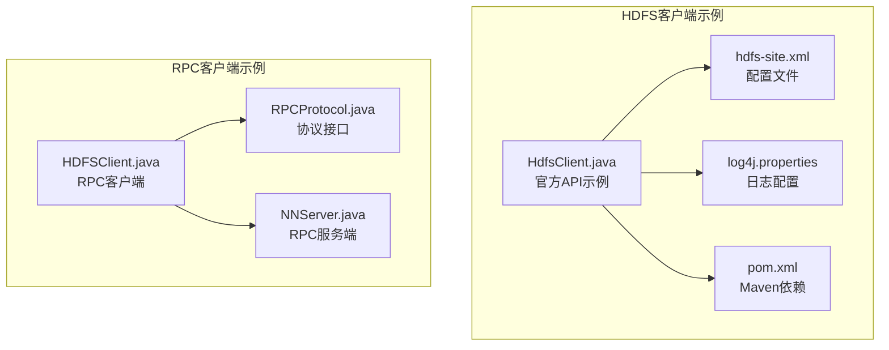
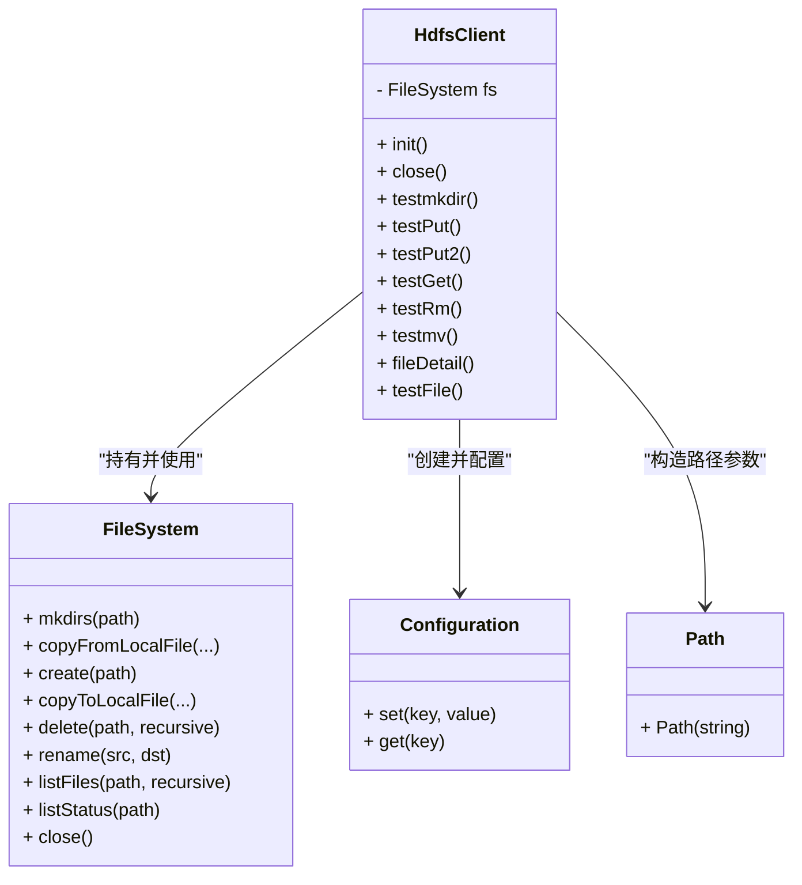
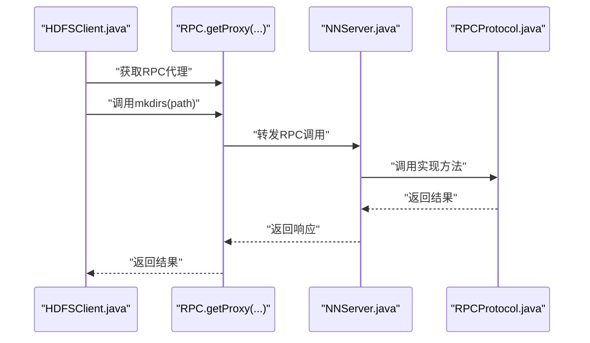
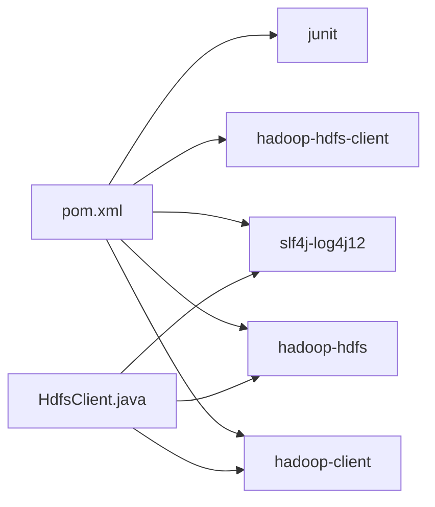

# HDFS客户端API

<cite>
**本文引用的文件**
- [HdfsClient.java](file://_02_hadoop/HDFSClient/src/main/java/com/atguigu/hdfs/HdfsClient.java)
- [HDFSClient.java](file://_02_hadoop/HDFSClient/src/main/java/com/atguigu/rpc/HDFSClient.java)
- [RPCProtocol.java](file://_02_hadoop/HDFSClient/src/main/java/com/atguigu/rpc/RPCProtocol.java)
- [NNServer.java](file://_02_hadoop/HDFSClient/src/main/java/com/atguigu/rpc/NNServer.java)
- [hdfs-site.xml](file://_02_hadoop/HDFSClient/src/main/resources/hdfs-site.xml)
- [pom.xml](file://_02_hadoop/HDFSClient/pom.xml)
- [log4j.properties](file://_02_hadoop/HDFSClient/src/main/resources/log4j.properties)
</cite>

## 目录
1. [简介](#简介)
2. [项目结构](#项目结构)
3. [核心组件](#核心组件)
4. [架构总览](#架构总览)
5. [详细组件分析](#详细组件分析)
6. [依赖关系分析](#依赖关系分析)
7. [性能考虑](#性能考虑)
8. [故障排查指南](#故障排查指南)
9. [结论](#结论)
10. [附录](#附录)

## 简介
本文件围绕HDFS客户端API进行系统化技术文档整理，重点覆盖以下方面：
- FileSystem对象的创建、配置与生命周期管理
- 常用文件系统操作：目录创建、文件上传、文件下载、文件删除、文件重命名/移动
- Configuration配置对象的作用与关键参数（如副本数、URI连接、用户认证）
- 文件状态查询、块信息获取与权限管理
- 异常处理最佳实践、资源关闭策略与性能优化建议
- 面向初学者的操作步骤与面向资深开发者的高级用法

本仓库提供了基于Hadoop官方客户端的完整示例，涵盖从初始化到具体操作再到资源释放的全流程。

## 项目结构
该模块包含两类HDFS客户端示例：
- 官方HDFS客户端API示例：通过FileSystem直接访问HDFS，演示常见文件系统操作
- 自定义RPC客户端示例：通过RPC协议与NameNode交互，演示远程过程调用的基本用法

图表来源
- [HdfsClient.java](file://_02_hadoop/HDFSClient/src/main/java/com/atguigu/hdfs/HdfsClient.java#L1-L162)
- [hdfs-site.xml](file://_02_hadoop/HDFSClient/src/main/resources/hdfs-site.xml#L1-L10)
- [log4j.properties](file://_02_hadoop/HDFSClient/src/main/resources/log4j.properties#L1-L9)
- [pom.xml](file://_02_hadoop/HDFSClient/pom.xml#L1-L49)
- [HDFSClient.java](file://_02_hadoop/HDFSClient/src/main/java/com/atguigu/rpc/HDFSClient.java#L1-L22)
- [RPCProtocol.java](file://_02_hadoop/HDFSClient/src/main/java/com/atguigu/rpc/RPCProtocol.java#L1-L9)
- [NNServer.java](file://_02_hadoop/HDFSClient/src/main/java/com/atguigu/rpc/NNServer.java#L1-L29)

章节来源
- [HdfsClient.java](file://_02_hadoop/HDFSClient/src/main/java/com/atguigu/hdfs/HdfsClient.java#L1-L162)
- [pom.xml](file://_02_hadoop/HDFSClient/pom.xml#L1-L49)

## 核心组件
- FileSystem对象：HDFS客户端的核心入口，负责与NameNode交互并执行文件系统操作
- Configuration对象：用于设置HDFS连接参数、副本数、用户等
- Path对象：封装HDFS路径，作为API参数传递
- FSDataOutputStream/FSDataInputStream：用于流式写入/读取文件内容
- FileStatus/LocatedFileStatus：用于查询文件或目录的状态与块位置信息
- RemoteIterator：用于遍历HDFS上的文件列表

章节来源
- [HdfsClient.java](file://_02_hadoop/HDFSClient/src/main/java/com/atguigu/hdfs/HdfsClient.java#L1-L162)

## 架构总览
下图展示了官方HDFS客户端API的典型调用链路与关键对象之间的关系。

图表来源
- [HdfsClient.java](file://_02_hadoop/HDFSClient/src/main/java/com/atguigu/hdfs/HdfsClient.java#L1-L162)

## 详细组件分析

### FileSystem对象的创建、配置与生命周期
- 创建方式：通过URI、Configuration与用户名获取FileSystem实例
- 生命周期：在@Before中初始化，在@After中关闭，确保资源及时释放
- 关键点：
  - URI指向NameNode地址与端口
  - Configuration可设置副本数等参数
  - 用户名用于认证上下文

章节来源
- [HdfsClient.java](file://_02_hadoop/HDFSClient/src/main/java/com/atguigu/hdfs/HdfsClient.java#L30-L49)

### Configuration配置对象
- 作用：集中管理HDFS客户端行为参数
- 关键参数：
  - dfs.replication：副本数，可通过代码覆盖配置文件
  - 用户名：通过FileSystem.get传入，决定操作的认证主体
- 配置优先级：代码设置 > 项目资源配置文件 > 默认配置

章节来源
- [HdfsClient.java](file://_02_hadoop/HDFSClient/src/main/java/com/atguigu/hdfs/HdfsClient.java#L33-L43)
- [hdfs-site.xml](file://_02_hadoop/HDFSClient/src/main/resources/hdfs-site.xml#L1-L10)

### 目录创建（mkdirs）
- 方法：FileSystem.mkdirs(Path)
- 使用场景：在指定路径创建目录，支持多级创建
- 注意事项：路径必须为目录，避免与已有文件冲突

章节来源
- [HdfsClient.java](file://_02_hadoop/HDFSClient/src/main/java/com/atguigu/hdfs/HdfsClient.java#L52-L56)

### 文件上传（copyFromLocalFile）
- 方法：FileSystem.copyFromLocalFile(deleteSource, overwrite, src, dst)
- 参数语义：
  - deleteSource：是否删除本地源文件
  - overwrite：是否覆盖目标文件
  - src：本地文件路径
  - dst：HDFS目标路径
- 使用场景：将本地文件批量上传至HDFS

章节来源
- [HdfsClient.java](file://_02_hadoop/HDFSClient/src/main/java/com/atguigu/hdfs/HdfsClient.java#L66-L69)

### 流式写入（create）
- 方法：FileSystem.create(Path)
- 返回：FSDataOutputStream
- 使用场景：以流的方式写入小文件或动态内容
- 注意：写入完成后需关闭输出流

章节来源
- [HdfsClient.java](file://_02_hadoop/HDFSClient/src/main/java/com/atguigu/hdfs/HdfsClient.java#L71-L76)

### 文件下载（copyToLocalFile）
- 方法：FileSystem.copyToLocalFile(deleteSource, src, dst, useRawLocalFileSystem)
- 参数语义：
  - deleteSource：是否删除HDFS源文件
  - src：HDFS源路径
  - dst：本地目标路径
  - useRawLocalFileSystem：是否使用原始本地文件系统
- 使用场景：将HDFS文件下载到本地

章节来源
- [HdfsClient.java](file://_02_hadoop/HDFSClient/src/main/java/com/atguigu/hdfs/HdfsClient.java#L80-L84)

### 文件删除（delete）
- 方法：FileSystem.delete(Path, recursive)
- 参数语义：
  - recursive：是否递归删除目录
- 使用场景：删除文件或空/非空目录

章节来源
- [HdfsClient.java](file://_02_hadoop/HDFSClient/src/main/java/com/atguigu/hdfs/HdfsClient.java#L86-L99)

### 文件重命名与移动（rename）
- 方法：FileSystem.rename(src, dst)
- 使用场景：对文件或目录进行改名或移动
- 注意：跨分区或跨卷可能失败，应确保在同一文件系统内

章节来源
- [HdfsClient.java](file://_02_hadoop/HDFSClient/src/main/java/com/atguigu/hdfs/HdfsClient.java#L101-L114)

### 文件状态查询与类型判断
- 列出文件：FileSystem.listFiles(Path, recursive)
- 列出状态：FileSystem.listStatus(Path)
- 类型判断：FileStatus.isFile()/isDirectory()
- 典型用途：遍历目录树、统计文件数量、区分文件与目录

章节来源
- [HdfsClient.java](file://_02_hadoop/HDFSClient/src/main/java/com/atguigu/hdfs/HdfsClient.java#L145-L159)

### 文件详细信息与块信息
- 获取文件详情：RemoteIterator<LocatedFileStatus> listFiles(...)
- 字段示例：权限、所有者、组、长度、修改时间、副本数、块大小、路径名
- 块信息：LocatedFileStatus.getBlockLocations()
- 典型用途：监控文件分布、容量规划、故障定位

章节来源
- [HdfsClient.java](file://_02_hadoop/HDFSClient/src/main/java/com/atguigu/hdfs/HdfsClient.java#L116-L143)

### 资源关闭策略
- 在@After中调用FileSystem.close()，确保连接与句柄被释放
- 对于流式写入，务必在写入完成后关闭输出流
- 建议使用try-with-resources或finally保证关闭

章节来源
- [HdfsClient.java](file://_02_hadoop/HDFSClient/src/main/java/com/atguigu/hdfs/HdfsClient.java#L45-L49)

### 异常处理最佳实践
- 常见异常：IOException、URISyntaxException
- 处理建议：
  - 明确捕获范围，记录异常堆栈
  - 对可恢复错误进行重试
  - 对不可恢复错误进行降级与告警
- 日志：通过log4j配置输出运行日志，便于问题定位

章节来源
- [HdfsClient.java](file://_02_hadoop/HDFSClient/src/main/java/com/atguigu/hdfs/HdfsClient.java#L1-L24)
- [log4j.properties](file://_02_hadoop/HDFSClient/src/main/resources/log4j.properties#L1-L9)

### 性能优化建议
- 批量操作：合并多次小文件上传为单次大文件，减少元数据开销
- 副本数：根据可靠性需求与存储成本调整dfs.replication
- 传输优化：合理设置块大小与网络带宽，避免频繁小块传输
- 并发控制：在多线程环境下谨慎共享FileSystem实例，必要时按线程隔离

章节来源
- [HdfsClient.java](file://_02_hadoop/HDFSClient/src/main/java/com/atguigu/hdfs/HdfsClient.java#L33-L43)
- [hdfs-site.xml](file://_02_hadoop/HDFSClient/src/main/resources/hdfs-site.xml#L1-L10)

### RPC客户端示例（扩展理解）
- 协议接口：定义版本号与方法签名
- 客户端：通过RPC.getProxy获取代理对象
- 服务端：通过RPC.Builder绑定地址、端口与实现类
- 适用场景：自定义RPC协议与NameNode交互

图表来源
- [HDFSClient.java](file://_02_hadoop/HDFSClient/src/main/java/com/atguigu/rpc/HDFSClient.java#L1-L22)
- [RPCProtocol.java](file://_02_hadoop/HDFSClient/src/main/java/com/atguigu/rpc/RPCProtocol.java#L1-L9)
- [NNServer.java](file://_02_hadoop/HDFSClient/src/main/java/com/atguigu/rpc/NNServer.java#L1-L29)

## 依赖关系分析
- Maven依赖：hadoop-client、hadoop-hdfs、hadoop-hdfs-client、junit、slf4j-log4j12
- 运行环境：Java 8，Hadoop 3.1.3
- 配置文件：hdfs-site.xml提供副本数默认值，可在代码中覆盖

图表来源
- [pom.xml](file://_02_hadoop/HDFSClient/pom.xml#L1-L49)
- [HdfsClient.java](file://_02_hadoop/HDFSClient/src/main/java/com/atguigu/hdfs/HdfsClient.java#L1-L162)

章节来源
- [pom.xml](file://_02_hadoop/HDFSClient/pom.xml#L1-L49)

## 性能考虑
- 副本数与可用性：副本数越高，容错能力越强但存储成本越高
- 传输效率：合理设置块大小，避免过多小文件导致NameNode压力
- 并发与连接：避免频繁创建/销毁FileSystem实例，复用连接可降低开销
- I/O模式：大文件优先使用流式写入/读取，避免一次性加载到内存

## 故障排查指南
- 连接失败：检查URI格式与端口，确认NameNode可达
- 权限问题：确认用户身份与HDFS权限策略
- 文件不存在：核对Path路径，确认上传/创建流程是否成功
- 资源未释放：确保在@After或finally中调用close()

章节来源
- [HdfsClient.java](file://_02_hadoop/HDFSClient/src/main/java/com/atguigu/hdfs/HdfsClient.java#L30-L49)

## 结论
本仓库提供了HDFS客户端API的完整示例，涵盖了从初始化、配置、常用操作到资源管理与异常处理的全流程。通过这些示例，读者可以快速掌握HDFS客户端的核心用法，并在此基础上进行扩展与优化。对于需要自定义协议的场景，RPC示例也为理解HDFS通信机制提供了参考。

## 附录
- 操作清单（基于示例方法）
  - 创建目录：参考方法路径
  - 上传文件：参考方法路径
  - 流式写入：参考方法路径
  - 下载文件：参考方法路径
  - 删除文件/目录：参考方法路径
  - 重命名/移动：参考方法路径
  - 查询文件状态：参考方法路径
  - 获取块信息：参考方法路径
- 配置要点
  - 副本数：通过代码覆盖配置文件
  - 用户名：通过FileSystem.get传入
  - 日志：通过log4j配置输出

章节来源
- [HdfsClient.java](file://_02_hadoop/HDFSClient/src/main/java/com/atguigu/hdfs/HdfsClient.java#L52-L159)
- [hdfs-site.xml](file://_02_hadoop/HDFSClient/src/main/resources/hdfs-site.xml#L1-L10)
- [log4j.properties](file://_02_hadoop/HDFSClient/src/main/resources/log4j.properties#L1-L9)