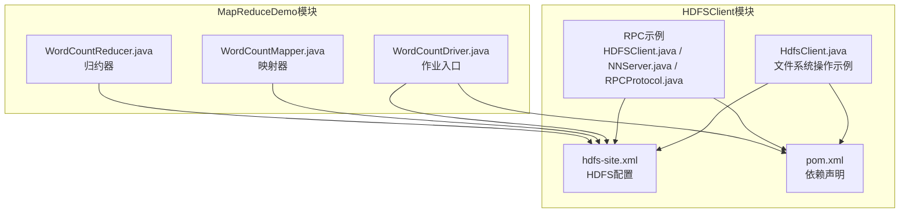
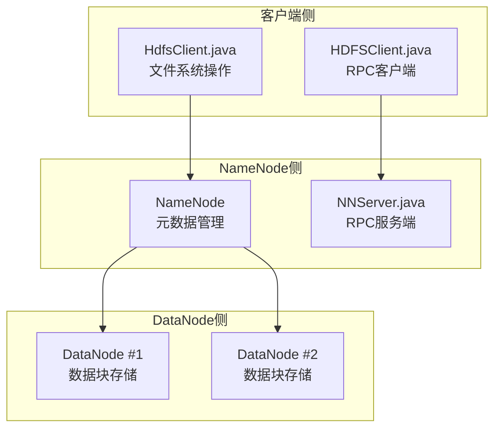
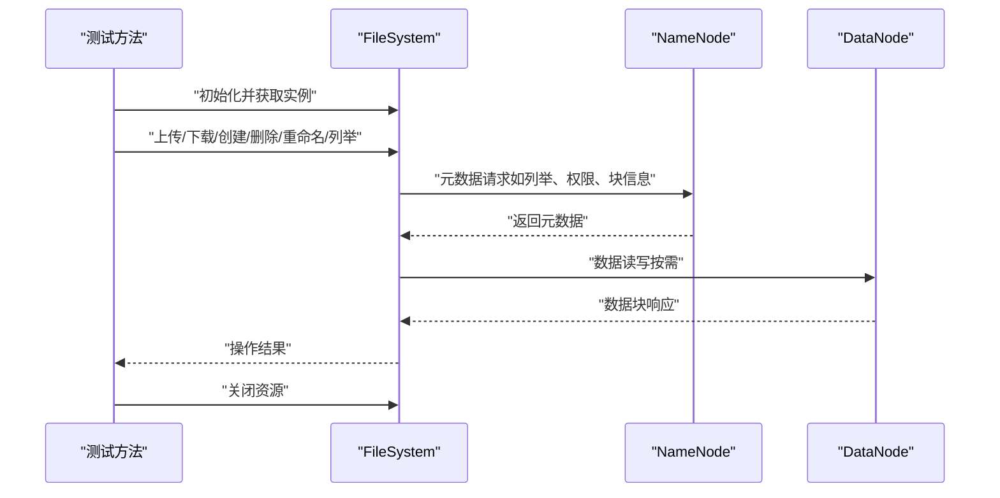
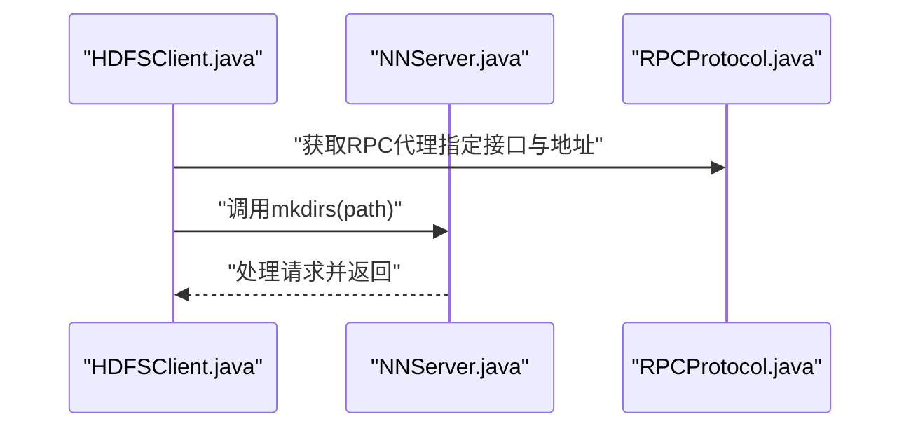
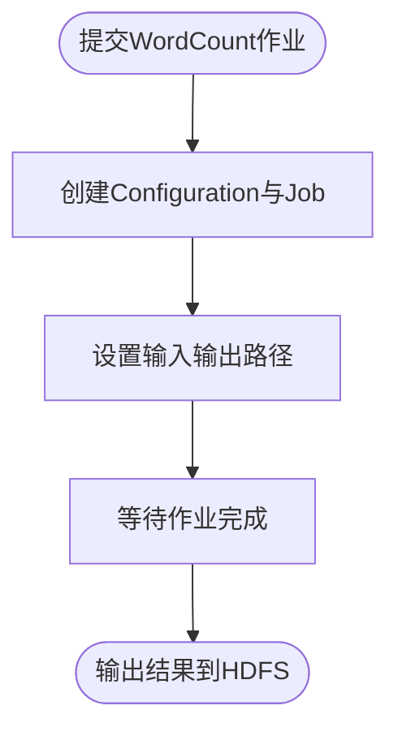
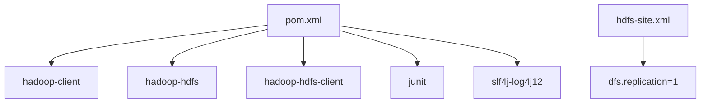

# Hadoop基础

<cite>
**本文引用的文件**
- [HdfsClient.java](file://_02_hadoop/HDFSClient/src/main/java/com/atguigu/hdfs/HdfsClient.java)
- [HDFSClient.java](file://_02_hadoop/HDFSClient/src/main/java/com/atguigu/rpc/HDFSClient.java)
- [NNServer.java](file://_02_hadoop/HDFSClient/src/main/java/com/atguigu/rpc/NNServer.java)
- [RPCProtocol.java](file://_02_hadoop/HDFSClient/src/main/java/com/atguigu/rpc/RPCProtocol.java)
- [hdfs-site.xml](file://_02_hadoop/HDFSClient/src/main/resources/hdfs-site.xml)
- [pom.xml](file://_02_hadoop/HDFSClient/pom.xml)
- [WordCountDriver.java](file://_02_hadoop/MapReduceDemo/src/main/java/com/ atguigu/mapreduce/wordcount/WordCountDriver.java)
- [WordCountMapper.java](file://_02_hadoop/MapReduceDemo/src/main/java/com/ atguigu/mapreduce/wordcount/WordCountMapper.java)
- [WordCountReducer.java](file://_02_hadoop/MapReduceDemo/src/main/java/com/ atguigu/mapreduce/wordcount/WordCountReducer.java)
</cite>

## 目录
1. [引言](#引言)
2. [项目结构](#项目结构)
3. [核心组件](#核心组件)
4. [架构总览](#架构总览)
5. [详细组件分析](#详细组件分析)
6. [依赖分析](#依赖分析)
7. [性能考虑](#性能考虑)
8. [故障排查指南](#故障排查指南)
9. [结论](#结论)
10. [附录](#附录)

## 引言
本文件围绕Hadoop基础组件，聚焦HDFS（Hadoop分布式文件系统）的核心概念、架构与工作机制，结合仓库中的HdfsClient与RPC示例，系统讲解NameNode与DataNode的角色分工、数据块存储策略、副本机制与容错原理，并通过HdfsClient与RPC客户端的实际代码示例，演示文件上传下载、目录管理、权限控制与元数据查询等常用操作。同时，解释Configuration配置文件的作用与参数设置，给出集群部署的基本要求、网络配置与安全设置建议，并提供故障排查与性能优化指南。

## 项目结构
该仓库中与HDFS直接相关的模块位于“_02_hadoop/HDFSClient”，包含两套示例：
- HdfsClient：基于Hadoop FileSystem API的常用操作示例（上传、下载、目录管理、文件详情与类型判断等）
- RPC示例：基于Hadoop IPC协议的简易NameNode风格服务（NNServer）与客户端（HDFSClient），用于演示RPC交互

此外，MapReduceDemo展示了在MapReduce任务中如何通过Configuration与FileSystem进行输入输出路径配置与访问。

图表来源
- [HdfsClient.java](file://_02_hadoop/HDFSClient/src/main/java/com/atguigu/hdfs/HdfsClient.java#L1-L162)
- [hdfs-site.xml](file://_02_hadoop/HDFSClient/src/main/resources/hdfs-site.xml#L1-L10)
- [pom.xml](file://_02_hadoop/HDFSClient/pom.xml#L1-L49)
- [HDFSClient.java](file://_02_hadoop/HDFSClient/src/main/java/com/atguigu/rpc/HDFSClient.java#L1-L22)
- [NNServer.java](file://_02_hadoop/HDFSClient/src/main/java/com/atguigu/rpc/NNServer.java#L1-L29)
- [RPCProtocol.java](file://_02_hadoop/HDFSClient/src/main/java/com/atguigu/rpc/RPCProtocol.java#L1-L9)
- [WordCountDriver.java](file://_02_hadoop/MapReduceDemo/src/main/java/com/atguigu/mapreduce/wordcount/WordCountDriver.java#L1-L48)
- [WordCountMapper.java](file://_02_hadoop/MapReduceDemo/src/main/java/com/atguigu/mapreduce/wordcount/WordCountMapper.java#L1-L41)
- [WordCountReducer.java](file://_02_hadoop/MapReduceDemo/src/main/java/com/atguigu/mapreduce/wordcount/WordCountReducer.java#L1-L36)

章节来源
- [HdfsClient.java](file://_02_hadoop/HDFSClient/src/main/java/com/atguigu/hdfs/HdfsClient.java#L1-L162)
- [pom.xml](file://_02_hadoop/HDFSClient/pom.xml#L1-L49)

## 核心组件
- HdfsClient（文件系统操作示例）
  - 负责演示HDFS常用操作：创建目录、上传本地文件到HDFS、以流方式写入、从HDFS下载文件、删除、重命名/移动、遍历列出文件并打印权限、属主、组、长度、修改时间、副本数、块大小与块位置等元数据，以及判断路径是文件还是目录。
  - 使用Configuration与FileSystem.get建立连接，支持通过URI指定NameNode地址与用户身份。
- RPC示例（NameNode风格服务）
  - RPCProtocol定义了服务接口（如mkdirs），NNServer作为服务端实现并在本地端口启动RPC服务，HDFSClient作为客户端通过RPC代理调用服务端方法。
- MapReduce集成
  - WordCountDriver通过Configuration与Job设置输入输出路径，Mapper与Reducer处理文本分词与计数逻辑，体现HDFS作为底层存储对上层计算框架的支持。

章节来源
- [HdfsClient.java](file://_02_hadoop/HDFSClient/src/main/java/com/atguigu/hdfs/HdfsClient.java#L1-L162)
- [HDFSClient.java](file://_02_hadoop/HDFSClient/src/main/java/com/atguigu/rpc/HDFSClient.java#L1-L22)
- [NNServer.java](file://_02_hadoop/HDFSClient/src/main/java/com/atguigu/rpc/NNServer.java#L1-L29)
- [RPCProtocol.java](file://_02_hadoop/HDFSClient/src/main/java/com/atguigu/rpc/RPCProtocol.java#L1-L9)
- [WordCountDriver.java](file://_02_hadoop/MapReduceDemo/src/main/java/com/atguigu/mapreduce/wordcount/WordCountDriver.java#L1-L48)

## 架构总览
下图展示了HDFS客户端与NameNode/DataNode之间的典型交互，以及RPC示例中客户端与NameNode风格服务端的交互。

图表来源
- [HdfsClient.java](file://_02_hadoop/HDFSClient/src/main/java/com/atguigu/hdfs/HdfsClient.java#L1-L162)
- [HDFSClient.java](file://_02_hadoop/HDFSClient/src/main/java/com/atguigu/rpc/HDFSClient.java#L1-L22)
- [NNServer.java](file://_02_hadoop/HDFSClient/src/main/java/com/atguigu/rpc/NNServer.java#L1-L29)

## 详细组件分析

### HdfsClient（文件系统操作）
- 初始化与连接
  - 通过URI指定NameNode地址与端口，使用Configuration与用户身份获取FileSystem实例。
- 常用操作
  - 创建目录：fs.mkdirs
  - 上传文件：copyFromLocalFile（支持删除原文件、覆盖、本地路径与HDFS路径）
  - 写入流：创建输出流并写入字节
  - 下载文件：copyToLocalFile（支持删除源文件、本地路径与覆盖）
  - 删除：delete（支持递归删除目录）
  - 重命名/移动：rename（可同时完成改名与移动）
  - 列表与元数据：listFiles与listStatus，打印权限、属主、组、长度、修改时间、副本数、块大小、块位置等
  - 类型判断：根据FileStatus.isDir/isFile判断路径类型
- 资源管理
  - 每个测试方法前初始化，结束后统一关闭FileSystem

图表来源
- [HdfsClient.java](file://_02_hadoop/HDFSClient/src/main/java/com/atguigu/hdfs/HdfsClient.java#L1-L162)

章节来源
- [HdfsClient.java](file://_02_hadoop/HDFSClient/src/main/java/com/atguigu/hdfs/HdfsClient.java#L1-L162)

### RPC示例（NameNode风格服务）
- 接口定义
  - RPCProtocol定义版本号与mkdirs方法
- 服务端
  - NNServer实现RPCProtocol，在本地端口启动RPC服务，接收客户端请求
- 客户端
  - HDFSClient通过RPC.getProxy获取服务代理，调用mkdirs

图表来源
- [HDFSClient.java](file://_02_hadoop/HDFSClient/src/main/java/com/atguigu/rpc/HDFSClient.java#L1-L22)
- [NNServer.java](file://_02_hadoop/HDFSClient/src/main/java/com/atguigu/rpc/NNServer.java#L1-L29)
- [RPCProtocol.java](file://_02_hadoop/HDFSClient/src/main/java/com/atguigu/rpc/RPCProtocol.java#L1-L9)

章节来源
- [HDFSClient.java](file://_02_hadoop/HDFSClient/src/main/java/com/atguigu/rpc/HDFSClient.java#L1-L22)
- [NNServer.java](file://_02_hadoop/HDFSClient/src/main/java/com/atguigu/rpc/NNServer.java#L1-L29)
- [RPCProtocol.java](file://_02_hadoop/HDFSClient/src/main/java/com/atguigu/rpc/RPCProtocol.java#L1-L9)

### MapReduce与HDFS（输入输出路径）
- 作业入口
  - WordCountDriver通过Configuration与Job设置Mapper/Reducer类、输出键值类型、输入输出路径
- 计算过程
  - Mapper负责按行切分单词并输出中间键值
  - Reducer对相同键的值求和得到最终统计结果
- 存储访问
  - 通过HDFS作为输入源与输出落点，体现分布式文件系统对批处理框架的支持

图表来源
- [WordCountDriver.java](file://_02_hadoop/MapReduceDemo/src/main/java/com/atguigu/mapreduce/wordcount/WordCountDriver.java#L1-L48)
- [WordCountMapper.java](file://_02_hadoop/MapReduceDemo/src/main/java/com/atguigu/mapreduce/wordcount/WordCountMapper.java#L1-L41)
- [WordCountReducer.java](file://_02_hadoop/MapReduceDemo/src/main/java/com/atguigu/mapreduce/wordcount/WordCountReducer.java#L1-L36)

章节来源
- [WordCountDriver.java](file://_02_hadoop/MapReduceDemo/src/main/java/com/atguigu/mapreduce/wordcount/WordCountDriver.java#L1-L48)
- [WordCountMapper.java](file://_02_hadoop/MapReduceDemo/src/main/java/com/atguigu/mapreduce/wordcount/WordCountMapper.java#L1-L41)
- [WordCountReducer.java](file://_02_hadoop/MapReduceDemo/src/main/java/com/atguigu/mapreduce/wordcount/WordCountReducer.java#L1-L36)

## 依赖分析
- HDFSClient模块依赖
  - hadoop-client、hadoop-hdfs、hadoop-hdfs-client、junit、slf4j-log4j12
- HDFS配置
  - hdfs-site.xml中设置副本数dfs.replication，影响新写入文件的默认副本数量

图表来源
- [pom.xml](file://_02_hadoop/HDFSClient/pom.xml#L1-L49)
- [hdfs-site.xml](file://_02_hadoop/HDFSClient/src/main/resources/hdfs-site.xml#L1-L10)

章节来源
- [pom.xml](file://_02_hadoop/HDFSClient/pom.xml#L1-L49)
- [hdfs-site.xml](file://_02_hadoop/HDFSClient/src/main/resources/hdfs-site.xml#L1-L10)

## 性能考虑
- 副本数与可靠性权衡
  - 副本数越高，容错能力越强但占用空间越大。可通过Configuration或hdfs-site.xml调整dfs.replication。
- 数据块大小
  - 大块减少元数据开销，适合大文件；小块提升并行度，适合交互式查询。应结合业务特征选择。
- 上传/下载策略
  - 批量上传与合并小文件可降低NameNode压力；合理设置copyFromLocalFile/copyToLocalFile的覆盖与删除策略。
- 网络与带宽
  - 本地与远程混合部署时，尽量让计算节点靠近数据节点，减少跨机架传输。
- 日志与监控
  - 使用SLF4J与Log4j记录操作日志，便于定位性能瓶颈与异常。

## 故障排查指南
- 连接失败
  - 检查NameNode地址与端口是否可达；确认URI格式正确。
- 权限问题
  - 确认用户身份与HDFS权限策略一致；必要时切换用户或调整ACL。
- 副本不足
  - 检查DataNode状态与磁盘空间；确认dfs.replication配置与实际副本数一致。
- 元数据异常
  - 使用listFiles/listStatus查看文件权限、属主、副本数与块信息，定位异常文件。
- RPC调用失败
  - 确认RPC服务端已启动且端口可用；检查接口版本号与代理创建参数。

## 结论
本仓库提供了HDFS文件系统操作与RPC交互的入门示例，涵盖常用文件操作、目录管理、权限与元数据查询，以及NameNode风格RPC服务的搭建与调用。结合MapReduce示例可见，HDFS作为底层存储为上层计算框架提供稳定的数据通道。通过合理配置副本数、块大小与网络拓扑，可有效提升可靠性与性能。

## 附录
- 常用操作清单（基于示例）
  - 创建目录：参考路径[file://_02_hadoop/HDFSClient/src/main/java/com/atguigu/hdfs/HdfsClient.java#L52-L56]
  - 上传文件：参考路径[file://_02_hadoop/HDFSClient/src/main/java/com/atguigu/hdfs/HdfsClient.java#L66-L69]
  - 写入流：参考路径[file://_02_hadoop/HDFSClient/src/main/java/com/atguigu/hdfs/HdfsClient.java#L71-L77]
  - 下载文件：参考路径[file://_02_hadoop/HDFSClient/src/main/java/com/atguigu/hdfs/HdfsClient.java#L78-L84]
  - 删除：参考路径[file://_02_hadoop/HDFSClient/src/main/java/com/atguigu/hdfs/HdfsClient.java#L86-L99]
  - 重命名/移动：参考路径[file://_02_hadoop/HDFSClient/src/main/java/com/atguigu/hdfs/HdfsClient.java#L101-L114]
  - 列举与元数据：参考路径[file://_02_hadoop/HDFSClient/src/main/java/com/atguigu/hdfs/HdfsClient.java#L116-L143]
  - 类型判断：参考路径[file://_02_hadoop/HDFSClient/src/main/java/com/atguigu/hdfs/HdfsClient.java#L145-L159]
- RPC调用示例
  - 客户端代理与调用：参考路径[file://_02_hadoop/HDFSClient/src/main/java/com/atguigu/rpc/HDFSClient.java#L1-L22]
  - 服务端实现与启动：参考路径[file://_02_hadoop/HDFSClient/src/main/java/com/atguigu/rpc/NNServer.java#L1-L29]
  - 接口定义：参考路径[file://_02_hadoop/HDFSClient/src/main/java/com/atguigu/rpc/RPCProtocol.java#L1-L9]
- 配置文件
  - 副本数设置：参考路径[file://_02_hadoop/HDFSClient/src/main/resources/hdfs-site.xml#L1-L10]
  - 依赖声明：参考路径[file://_02_hadoop/HDFSClient/pom.xml#L1-L49]
- MapReduce集成
  - 作业入口与路径设置：参考路径[file://_02_hadoop/MapReduceDemo/src/main/java/com/atguigu/mapreduce/wordcount/WordCountDriver.java#L1-L48]
  - Mapper与Reducer实现：参考路径[file://_02_hadoop/MapReduceDemo/src/main/java/com/atguigu/mapreduce/wordcount/WordCountMapper.java#L1-L41], [file://_02_hadoop/MapReduceDemo/src/main/java/com/atguigu/mapreduce/wordcount/WordCountReducer.java#L1-L36]