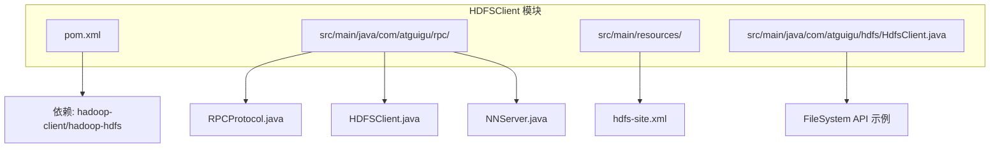
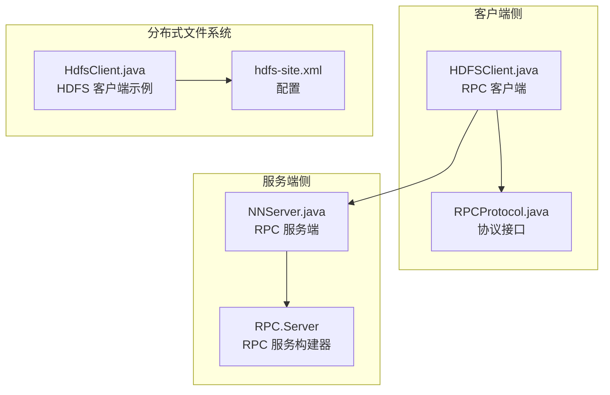
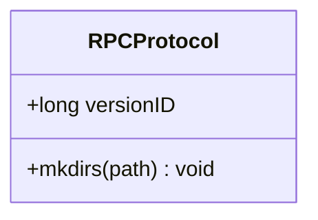
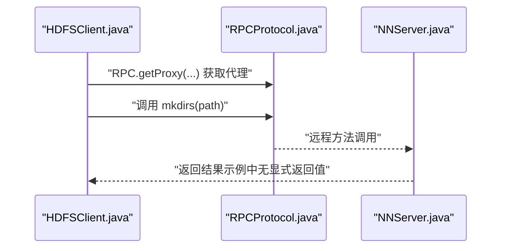
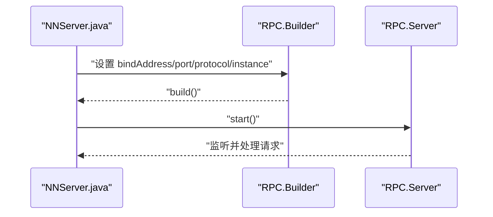
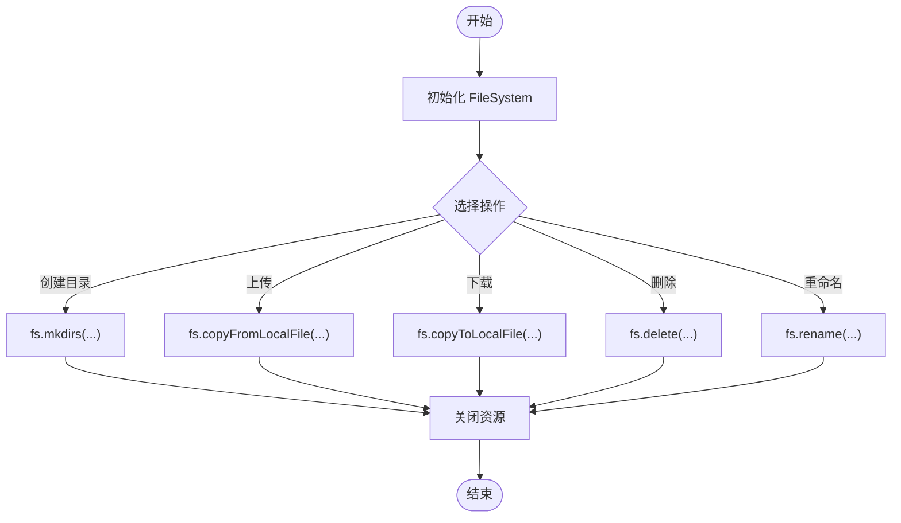
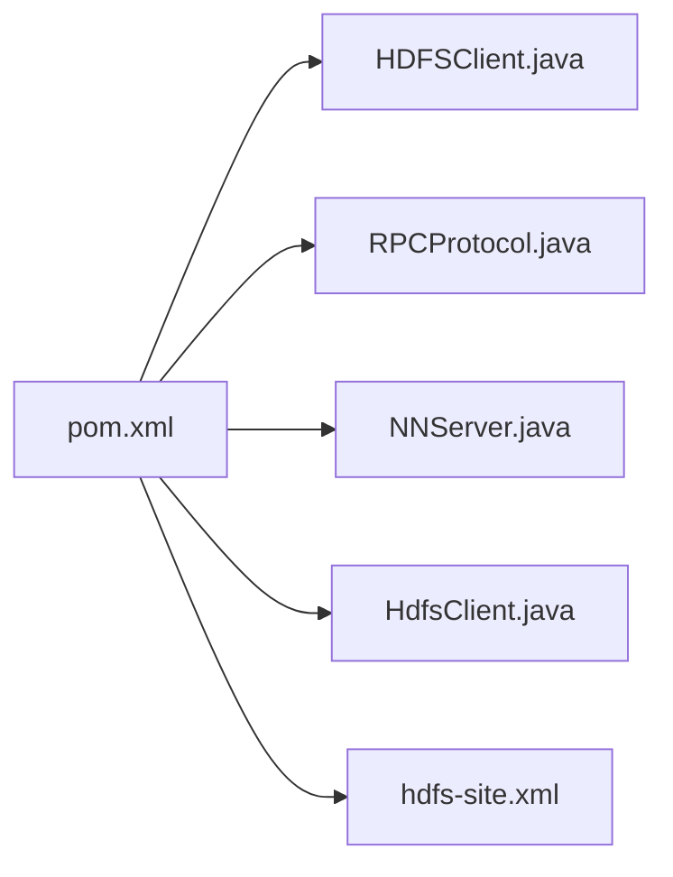

# RPC客户端通信

<cite>
**本文引用的文件**
- [RPCProtocol.java](file://_02_hadoop/HDFSClient/src/main/java/com/atguigu/rpc/RPCProtocol.java)
- [HDFSClient.java](file://_02_hadoop/HDFSClient/src/main/java/com/atguigu/rpc/HDFSClient.java)
- [NNServer.java](file://_02_hadoop/HDFSClient/src/main/java/com/atguigu/rpc/NNServer.java)
- [HdfsClient.java](file://_02_hadoop/HDFSClient/src/main/java/com/atguigu/hdfs/HdfsClient.java)
- [hdfs-site.xml](file://_02_hadoop/HDFSClient/src/main/resources/hdfs-site.xml)
- [pom.xml](file://_02_hadoop/HDFSClient/pom.xml)
</cite>

## 目录
1. [简介](#简介)
2. [项目结构](#项目结构)
3. [核心组件](#核心组件)
4. [架构总览](#架构总览)
5. [组件详解](#组件详解)
6. [依赖关系分析](#依赖关系分析)
7. [性能与优化](#性能与优化)
8. [故障排查指南](#故障排查指南)
9. [结论](#结论)
10. [附录](#附录)

## 简介
本文件围绕“RPC客户端通信”主题，结合仓库中的Hadoop RPC示例（RPCProtocol接口、HDFSClient客户端、NNServer服务端）进行系统性技术说明。内容涵盖：
- Hadoop RPC框架的客户端-服务器架构与通信机制
- 协议接口设计与远程过程调用流程
- 序列化与反序列化、网络传输优化
- 错误处理、超时与重试最佳实践
- 安全认证、权限验证与加密传输
- 性能监控、连接池管理与故障恢复策略
- 面向初学者的基础概念与面向进阶开发者的实现细节

## 项目结构
该示例位于“_02_hadoop/HDFSClient”模块中，包含RPC协议接口、客户端与服务端实现，以及HDFS客户端示例与配置文件。

图表来源
- [pom.xml](file://_02_hadoop/HDFSClient/pom.xml#L1-L49)
- [RPCProtocol.java](file://_02_hadoop/HDFSClient/src/main/java/com/atguigu/rpc/RPCProtocol.java#L1-L9)
- [HDFSClient.java](file://_02_hadoop/HDFSClient/src/main/java/com/atguigu/rpc/HDFSClient.java#L1-L22)
- [NNServer.java](file://_02_hadoop/HDFSClient/src/main/java/com/atguigu/rpc/NNServer.java#L1-L29)
- [HdfsClient.java](file://_02_hadoop/HDFSClient/src/main/java/com/atguigu/hdfs/HdfsClient.java#L1-L162)
- [hdfs-site.xml](file://_02_hadoop/HDFSClient/src/main/resources/hdfs-site.xml#L1-L10)

章节来源
- [pom.xml](file://_02_hadoop/HDFSClient/pom.xml#L1-L49)
- [hdfs-site.xml](file://_02_hadoop/HDFSClient/src/main/resources/hdfs-site.xml#L1-L10)

## 核心组件
- RPCProtocol 接口：定义远程调用契约（版本号与方法签名），作为客户端代理与服务端实现的共同协议。
- HDFSClient 客户端：通过RPC.getProxy获取远程代理，发起远程调用。
- NNServer 服务端：通过RPC.Builder构建RPC Server，绑定地址与端口，启动监听。
- HdfsClient 示例：展示HDFS客户端常用操作，体现RPC在分布式文件系统中的应用。

章节来源
- [RPCProtocol.java](file://_02_hadoop/HDFSClient/src/main/java/com/atguigu/rpc/RPCProtocol.java#L1-L9)
- [HDFSClient.java](file://_02_hadoop/HDFSClient/src/main/java/com/atguigu/rpc/HDFSClient.java#L1-L22)
- [NNServer.java](file://_02_hadoop/HDFSClient/src/main/java/com/atguigu/rpc/NNServer.java#L1-L29)
- [HdfsClient.java](file://_02_hadoop/HDFSClient/src/main/java/com/atguigu/hdfs/HdfsClient.java#L1-L162)

## 架构总览
下图展示了基于Hadoop RPC的客户端-服务端交互模型，以及与HDFS客户端示例的关系。

图表来源
- [HDFSClient.java](file://_02_hadoop/HDFSClient/src/main/java/com/atguigu/rpc/HDFSClient.java#L1-L22)
- [RPCProtocol.java](file://_02_hadoop/HDFSClient/src/main/java/com/atguigu/rpc/RPCProtocol.java#L1-L9)
- [NNServer.java](file://_02_hadoop/HDFSClient/src/main/java/com/atguigu/rpc/NNServer.java#L1-L29)
- [HdfsClient.java](file://_02_hadoop/HDFSClient/src/main/java/com/atguigu/hdfs/HdfsClient.java#L1-L162)
- [hdfs-site.xml](file://_02_hadoop/HDFSClient/src/main/resources/hdfs-site.xml#L1-L10)

## 组件详解

### RPCProtocol 接口
- 设计要点
  - 版本标识：通过静态常量versionID确保客户端与服务端协议兼容。
  - 方法定义：以mkdirs为例，定义远程可调用的方法签名。
- 使用方式
  - 客户端通过RPC.getProxy获取协议接口的动态代理。
  - 服务端实现该接口，并由RPC.Server暴露给客户端。

图表来源
- [RPCProtocol.java](file://_02_hadoop/HDFSClient/src/main/java/com/atguigu/rpc/RPCProtocol.java#L1-L9)

章节来源
- [RPCProtocol.java](file://_02_hadoop/HDFSClient/src/main/java/com/atguigu/rpc/RPCProtocol.java#L1-L9)

### HDFSClient 客户端
- 关键步骤
  - 获取代理：通过RPC.getProxy(RPCProtocol.class, versionID, InetSocketAddress, Configuration)获取远程代理。
  - 发起调用：直接调用代理上的方法（如mkdirs），底层自动完成序列化、网络传输与反序列化。
- 注意事项
  - 地址与端口需与服务端一致。
  - 配置对象用于传递RPC相关参数（如序列化、线程池等）。

图表来源
- [HDFSClient.java](file://_02_hadoop/HDFSClient/src/main/java/com/atguigu/rpc/HDFSClient.java#L1-L22)
- [RPCProtocol.java](file://_02_hadoop/HDFSClient/src/main/java/com/atguigu/rpc/RPCProtocol.java#L1-L9)
- [NNServer.java](file://_02_hadoop/HDFSClient/src/main/java/com/atguigu/rpc/NNServer.java#L1-L29)

章节来源
- [HDFSClient.java](file://_02_hadoop/HDFSClient/src/main/java/com/atguigu/rpc/HDFSClient.java#L1-L22)

### NNServer 服务端
- 关键步骤
  - 构建RPC Server：使用RPC.Builder设置绑定地址、端口、协议类型与实例。
  - 启动服务：调用server.start()进入监听状态。
  - 处理请求：实现RPCProtocol接口的方法（如mkdirs），接收来自客户端的调用。
- 扩展点
  - 可替换协议实现或增加更多方法。
  - 可配置线程池大小、队列长度等参数以适配负载。

图表来源
- [NNServer.java](file://_02_hadoop/HDFSClient/src/main/java/com/atguigu/rpc/NNServer.java#L1-L29)

章节来源
- [NNServer.java](file://_02_hadoop/HDFSClient/src/main/java/com/atguigu/rpc/NNServer.java#L1-L29)

### HDFS 客户端示例
- 功能概述
  - 展示了HDFS客户端的典型使用流程：初始化、执行操作、关闭资源。
  - 包含创建目录、上传/下载、删除、重命名、列出文件等常用操作。
- 与RPC的关系
  - HDFS客户端内部同样依赖RPC机制与NameNode交互，本示例侧重于用户API层面的操作演示。

图表来源
- [HdfsClient.java](file://_02_hadoop/HDFSClient/src/main/java/com/atguigu/hdfs/HdfsClient.java#L1-L162)

章节来源
- [HdfsClient.java](file://_02_hadoop/HDFSClient/src/main/java/com/atguigu/hdfs/HdfsClient.java#L1-L162)
- [hdfs-site.xml](file://_02_hadoop/HDFSClient/src/main/resources/hdfs-site.xml#L1-L10)

## 依赖关系分析
- 模块依赖
  - HDFSClient 模块依赖 hadoop-client 与 hadoop-hdfs，用于RPC与HDFS客户端能力。
- 运行时依赖
  - RPC 客户端与服务端均依赖 Hadoop IPC 框架（通过RPC.getProxy与RPC.Builder）。
- 配置依赖
  - hdfs-site.xml 提供HDFS相关配置项（如副本数），影响HDFS客户端行为。

图表来源
- [pom.xml](file://_02_hadoop/HDFSClient/pom.xml#L1-L49)

章节来源
- [pom.xml](file://_02_hadoop/HDFSClient/pom.xml#L1-L49)

## 性能与优化
- 序列化与网络传输
  - Hadoop RPC默认采用高性能序列化机制，减少序列化开销与网络带宽占用。
  - 建议：尽量使用简单、稳定的POJO作为参数与返回值，避免复杂嵌套结构。
- 超时与重试
  - 客户端侧可通过配置超时时间与重试策略提升稳定性；服务端侧合理设置线程池与队列上限，防止过载。
- 连接池管理
  - 对于高频调用场景，建议复用RPC代理实例，避免频繁创建销毁带来的开销。
- 监控与告警
  - 结合RPC统计指标（请求耗时、失败率、队列长度）进行监控，及时发现异常。
- 故障恢复
  - 服务端优雅关闭与重启，客户端侧实现幂等调用与重试逻辑，避免重复副作用。

## 故障排查指南
- 常见问题
  - 地址与端口不匹配：检查客户端与服务端绑定地址与端口一致。
  - 协议不兼容：确认versionID一致，避免版本差异导致的调用失败。
  - 未启动服务：确保服务端已调用start()并处于监听状态。
  - 权限不足：HDFS场景下检查用户与权限配置。
- 排查步骤
  - 启动服务端后，观察控制台输出确认启动成功。
  - 客户端发起调用前，打印关键参数（如URI、用户、路径）辅助定位。
  - 若出现异常，开启更详细的日志级别，捕获异常栈信息。
- 重试与超时
  - 在业务层实现指数退避重试，避免雪崩效应。
  - 设置合理的超时阈值，超过阈值主动放弃并记录告警。

## 结论
本示例以最小实现展示了Hadoop RPC的核心要素：协议接口、客户端代理、服务端构建与启动。在此基础上，可进一步扩展协议方法、完善序列化策略、引入安全认证与加密传输、优化性能与可靠性，并结合监控与运维体系实现生产级部署。

## 附录
- 术语表
  - RPC：远程过程调用，使客户端像调用本地方法一样调用远端服务。
  - 序列化：将对象转换为字节流以便在网络上传输。
  - 反序列化：将字节流还原为对象。
  - 版本ID：用于保证客户端与服务端协议兼容性的标识。
- 最佳实践清单
  - 明确协议接口与版本管理，避免破坏性变更。
  - 控制序列化对象大小，减少网络传输压力。
  - 合理设置超时与重试策略，提升鲁棒性。
  - 引入安全认证与加密传输，保障数据安全。
  - 建立完善的监控与告警体系，快速定位问题。