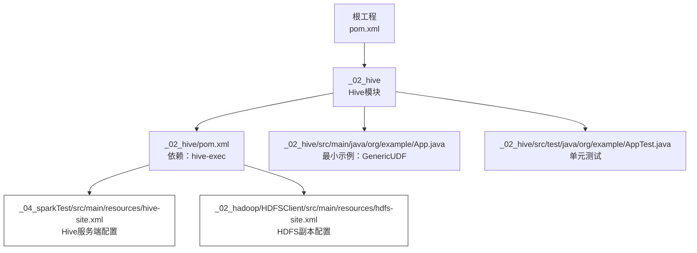
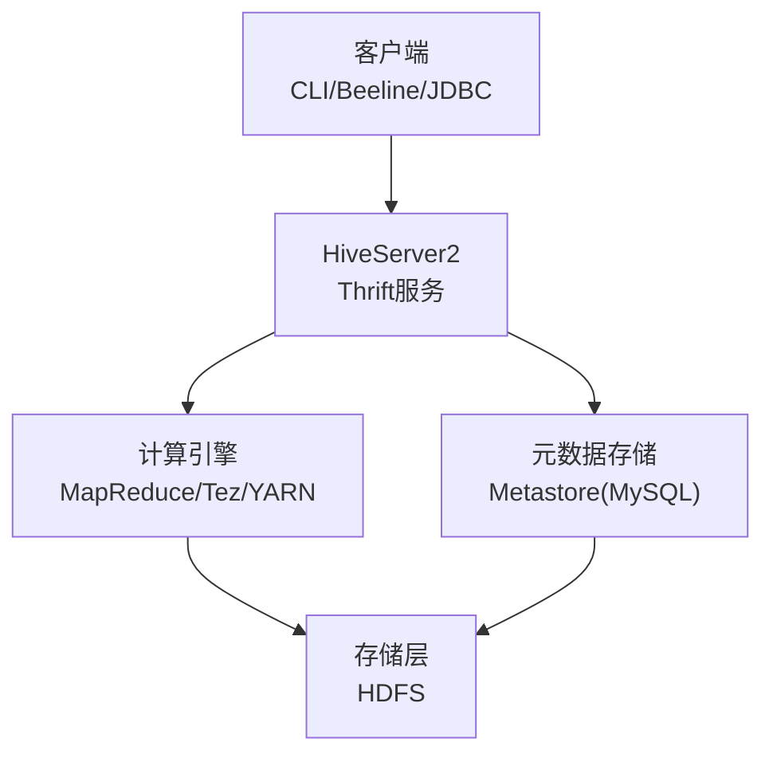
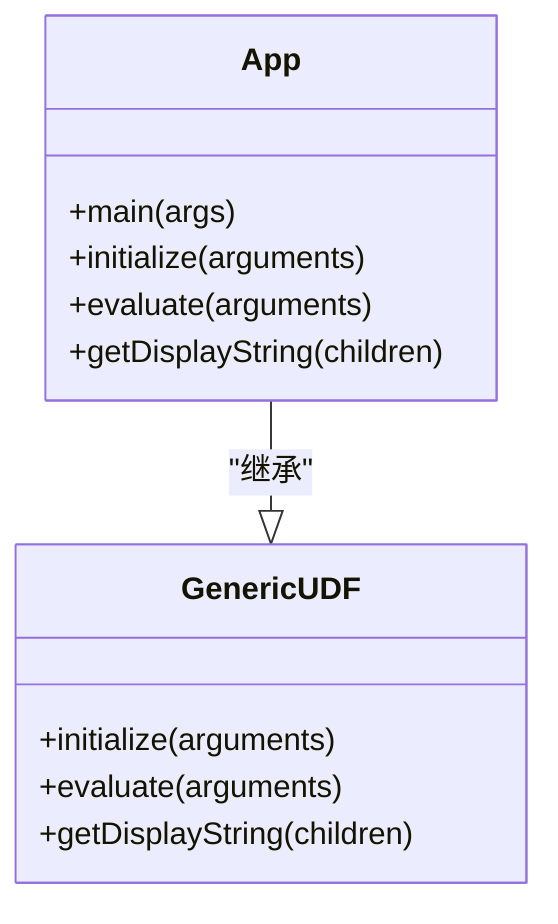
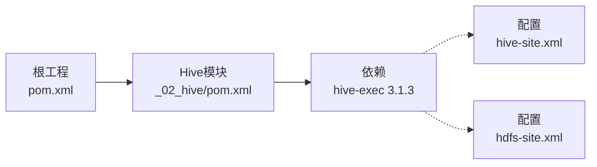
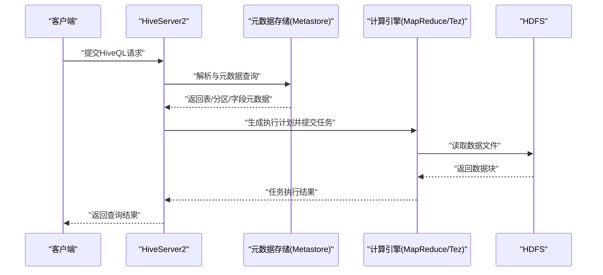

# Hive数据仓库

<cite>
**本文引用的文件**
- [pom.xml](file://pom.xml)
- [_02_hive/pom.xml](file://_02_hive/pom.xml)
- [_02_hive/src/main/java/org/example/App.java](file://_02_hive/src/main/java/org/example/App.java)
- [_02_hive/src/test/java/org/example/AppTest.java](file://_02_hive/src/test/java/org/example/AppTest.java)
- [_04_sparkTest/src/main/resources/hive-site.xml](file://_04_sparkTest/src/main/resources/hive-site.xml)
- [_02_hadoop/HDFSClient/src/main/resources/hdfs-site.xml](file://_02_hadoop/HDFSClient/src/main/resources/hdfs-site.xml)
</cite>

## 目录
1. [引言](#引言)
2. [项目结构](#项目结构)
3. [核心组件](#核心组件)
4. [架构总览](#架构总览)
5. [详细组件分析](#详细组件分析)
6. [依赖分析](#依赖分析)
7. [性能考虑](#性能考虑)
8. [故障排查指南](#故障排查指南)
9. [结论](#结论)
10. [附录](#附录)

## 引言
本文件面向数据分析师与工程师，系统化梳理Hive在大数据生态中的定位与使用方法，结合仓库中的示例与配置，说明Hive作为数据仓库工具的设计理念、架构组成与关键能力。文档重点覆盖：
- Hive如何将SQL查询转换为MapReduce（或Tez/MRv2）任务的执行链路
- 在数据湖与数据仓库场景中的典型应用
- 基于App.java的最小可运行示例，展示UDF扩展与Hive服务端交互入口
- Hive数据模型：表、分区表、桶表、外部表的概念与适用场景
- HiveQL语法要点：DDL、DML与查询优化思路
- 与HDFS的集成方式、元数据管理与服务端架构
- 性能调优、查询优化与集群配置最佳实践

## 项目结构
该仓库为多模块聚合工程，Hive模块位于“_02_hive”，并包含与Hive密切相关的配置文件与依赖。下图给出与Hive相关的关键文件与其在工程中的位置。

图表来源
- [pom.xml](file://pom.xml#L1-L143)
- [_02_hive/pom.xml](file://_02_hive/pom.xml#L1-L35)
- [_02_hive/src/main/java/org/example/App.java](file://_02_hive/src/main/java/org/example/App.java#L1-L34)
- [_02_hive/src/test/java/org/example/AppTest.java](file://_02_hive/src/test/java/org/example/AppTest.java#L1-L39)
- [_04_sparkTest/src/main/resources/hive-site.xml](file://_04_sparkTest/src/main/resources/hive-site.xml#L1-L96)
- [_02_hadoop/HDFSClient/src/main/resources/hdfs-site.xml](file://_02_hadoop/HDFSClient/src/main/resources/hdfs-site.xml#L1-L10)

章节来源
- [pom.xml](file://pom.xml#L1-L143)
- [_02_hive/pom.xml](file://_02_hive/pom.xml#L1-L35)

## 核心组件
- Hive执行引擎依赖：通过“_02_hive/pom.xml”引入“hive-exec”，用于解析与执行HiveQL，支持词法/语法解析与执行计划生成。
- 最小示例程序：App.java继承GenericUDF，演示了UDF开发的基本骨架（initialize、evaluate、getDisplayString），可用于自定义函数扩展。
- 单元测试：AppTest.java提供基础测试套件，便于后续扩展功能测试。
- 服务端配置：hive-site.xml定义了元数据存储、工作目录、服务端监听等关键参数，是Hive服务端运行的基础。
- HDFS集成：hdfs-site.xml提供HDFS副本策略等基础配置，Hive默认仓库路径常指向HDFS上的目录。

章节来源
- [_02_hive/pom.xml](file://_02_hive/pom.xml#L20-L31)
- [_02_hive/src/main/java/org/example/App.java](file://_02_hive/src/main/java/org/example/App.java#L12-L33)
- [_02_hive/src/test/java/org/example/AppTest.java](file://_02_hive/src/test/java/org/example/AppTest.java#L1-L39)
- [_04_sparkTest/src/main/resources/hive-site.xml](file://_04_sparkTest/src/main/resources/hive-site.xml#L1-L96)
- [_02_hadoop/HDFSClient/src/main/resources/hdfs-site.xml](file://_02_hadoop/HDFSClient/src/main/resources/hdfs-site.xml#L1-L10)

## 架构总览
下图展示了Hive在大数据生态中的角色与关键组件：客户端（CLI/Beeline/JDBC）、Hive服务端（HiveServer2）、元数据存储（Metastore，如MySQL）、计算引擎（MapReduce/Tez/YARN）与存储层（HDFS）之间的交互。

图表来源
- [_04_sparkTest/src/main/resources/hive-site.xml](file://_04_sparkTest/src/main/resources/hive-site.xml#L1-L96)

## 详细组件分析

### 组件A：App.java（最小示例与UDF扩展）
App.java展示了如何基于GenericUDF进行自定义函数开发，包含初始化、求值与显示字符串等关键方法。该类本身不直接执行SQL，但体现了Hive对用户自定义函数的支持。

图表来源
- [_02_hive/src/main/java/org/example/App.java](file://_02_hive/src/main/java/org/example/App.java#L12-L33)

章节来源
- [_02_hive/src/main/java/org/example/App.java](file://_02_hive/src/main/java/org/example/App.java#L12-L33)

### 组件B：Hive服务端配置（hive-site.xml）
hive-site.xml定义了Hive运行所需的关键参数，包括：
- 元数据存储连接（JDBC URL、驱动、用户名、密码）
- 默认仓库目录（HDFS路径）
- 元数据存储校验与事件通知
- 元数据服务地址（Thrift URI）
- HiveServer2监听主机与端口
- CLI打印当前库与表头
- 本地模式开关与阈值（输入字节数、文件数）

这些参数直接影响Hive元数据管理、仓库路径与服务端行为。

章节来源
- [_04_sparkTest/src/main/resources/hive-site.xml](file://_04_sparkTest/src/main/resources/hive-site.xml#L1-L96)

### 组件C：HDFS集成（hdfs-site.xml）
hdfs-site.xml提供了HDFS副本策略等基础配置，Hive默认仓库目录通常位于HDFS上，因此HDFS的副本数、安全与网络配置会影响Hive的可用性与性能。

章节来源
- [_02_hadoop/HDFSClient/src/main/resources/hdfs-site.xml](file://_02_hadoop/HDFSClient/src/main/resources/hdfs-site.xml#L1-L10)

### 组件D：Hive执行引擎依赖（hive-exec）
Hive模块通过依赖“hive-exec”获得解析与执行HiveQL的能力，该依赖由父工程统一版本管理，确保与Hadoop与Spark等生态组件的兼容性。

章节来源
- [_02_hive/pom.xml](file://_02_hive/pom.xml#L20-L31)
- [pom.xml](file://pom.xml#L52-L71)

## 依赖分析
- 模块依赖：根工程聚合多个子模块，Hive模块独立存在，并通过依赖“hive-exec”引入执行引擎。
- 版本管理：父工程统一管理Hive版本（3.1.3），保证与Hadoop等组件的兼容。
- 配置耦合：Hive服务端配置（hive-site.xml）与HDFS配置（hdfs-site.xml）分别影响元数据与存储层，二者共同决定Hive的部署形态。

图表来源
- [pom.xml](file://pom.xml#L1-L143)
- [_02_hive/pom.xml](file://_02_hive/pom.xml#L20-L31)
- [_04_sparkTest/src/main/resources/hive-site.xml](file://_04_sparkTest/src/main/resources/hive-site.xml#L1-L96)
- [_02_hadoop/HDFSClient/src/main/resources/hdfs-site.xml](file://_02_hadoop/HDFSClient/src/main/resources/hdfs-site.xml#L1-L10)

章节来源
- [pom.xml](file://pom.xml#L52-L71)
- [_02_hive/pom.xml](file://_02_hive/pom.xml#L20-L31)

## 性能考虑
以下为通用性能优化建议，适用于Hive在数据仓库与数据湖场景中的实践：
- 本地模式与小数据集：合理设置本地模式阈值（输入字节数与文件数），避免不必要的MR开销。
- 分区表设计：按查询热点字段建立分区，减少扫描范围；优先选择高基数且过滤频繁的列。
- 桶表设计：在分区内部按某个列进行分桶，提升JOIN与聚合效率，降低数据倾斜风险。
- 文件格式与压缩：优先采用列式存储（如ORC/Parquet）与高效压缩（如Snappy/LZO），降低I/O与CPU消耗。
- 统计信息：定期收集表统计信息，辅助执行计划优化。
- 并行度与资源：根据集群资源与数据规模调整Map/Reduce任务数与容器资源，避免资源争用。
- 查询重写：尽量使用向量化执行、谓词下推与裁剪，减少中间数据量。
- 元数据与仓库：确保元数据存储稳定（如MySQL高可用），仓库路径位于高性能HDFS上。

[本节为通用指导，无需列出具体文件来源]

## 故障排查指南
- 元数据连接失败：检查hive-site.xml中的JDBC URL、驱动、用户名与密码是否正确，确认Metastore服务可达。
- 仓库目录权限：确认Hive默认仓库目录在HDFS上的权限与配额，避免写入失败。
- 本地模式异常：核对本地模式阈值配置，确保输入数据满足本地执行条件。
- 服务端监听问题：检查HiveServer2绑定主机与端口配置，确认防火墙与网络连通性。
- UDF开发问题：若自定义UDF未生效，检查initialize与evaluate方法签名与返回类型，确保编译与部署正确。

章节来源
- [_04_sparkTest/src/main/resources/hive-site.xml](file://_04_sparkTest/src/main/resources/hive-site.xml#L1-L96)
- [_02_hive/src/main/java/org/example/App.java](file://_02_hive/src/main/java/org/example/App.java#L12-L33)

## 结论
本仓库以最小示例展示了Hive在大数据生态中的关键位置：通过“hive-exec”提供SQL解析与执行能力，配合“hive-site.xml”完成元数据与服务端配置，借助HDFS实现大规模数据存储。结合分区、桶与列式格式等技术手段，Hive能够有效支撑数据仓库与数据湖的查询与分析需求。建议在实际生产中完善元数据高可用、仓库路径规划与查询优化策略，持续提升稳定性与性能。

[本节为总结性内容，无需列出具体文件来源]

## 附录

### 附录A：Hive数据模型与表类型
- 普通表：适合常规结构化数据存储与查询。
- 分区表：按分区键拆分数据，显著降低扫描成本，适用于时间序列或维度过滤频繁的场景。
- 桶表：在分区内部进一步分桶，提升JOIN与聚合效率，缓解数据倾斜。
- 外部表：指向HDFS上已有数据，不移动数据即可查询，适合数据共享与迁移过渡期。

[本节为概念性说明，无需列出具体文件来源]

### 附录B：HiveQL语法要点（概述）
- DDL：建表、分区、桶、外部表、视图等。
- DML：插入、更新、删除（ACID表支持）、CTAS等。
- 查询：SELECT、JOIN、GROUP BY、窗口函数、子查询等；结合分区裁剪与谓词下推提升性能。
- 优化：向量化执行、采样、广播JOIN、Map端聚合、结果缓存等。

[本节为概念性说明，无需列出具体文件来源]

### 附录C：从App.java到Hive服务端的调用链（示意）
下图展示从客户端发起SQL到HiveServer2处理、元数据解析、任务提交与执行的大致流程。

图表来源
- [_04_sparkTest/src/main/resources/hive-site.xml](file://_04_sparkTest/src/main/resources/hive-site.xml#L1-L96)