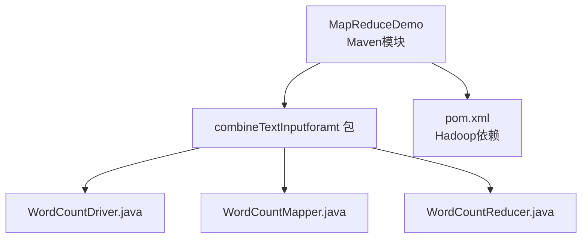
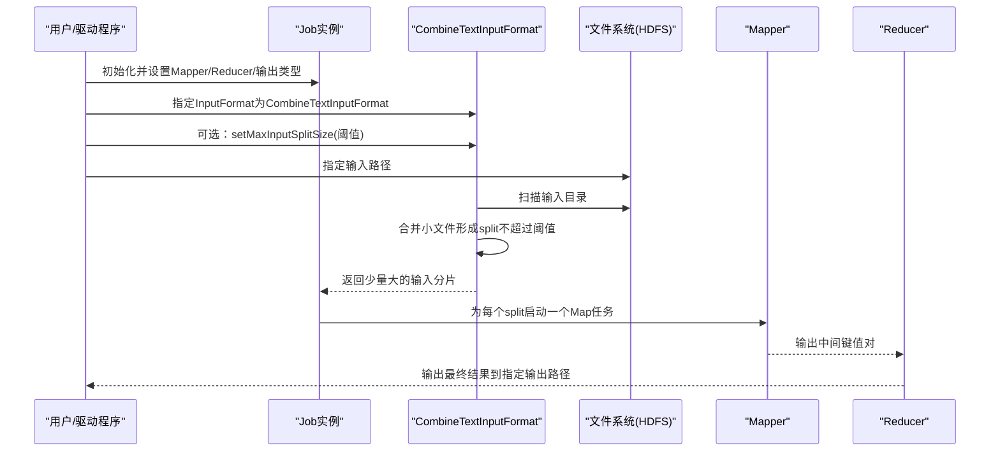
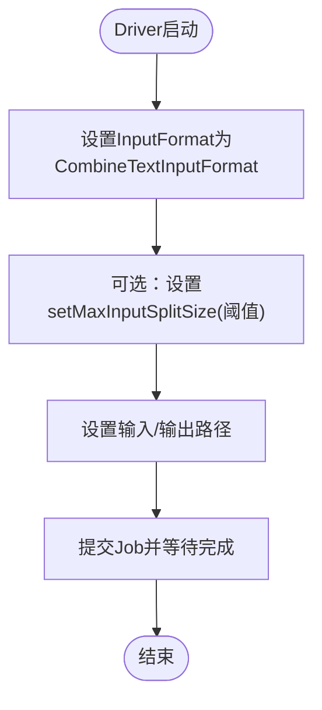
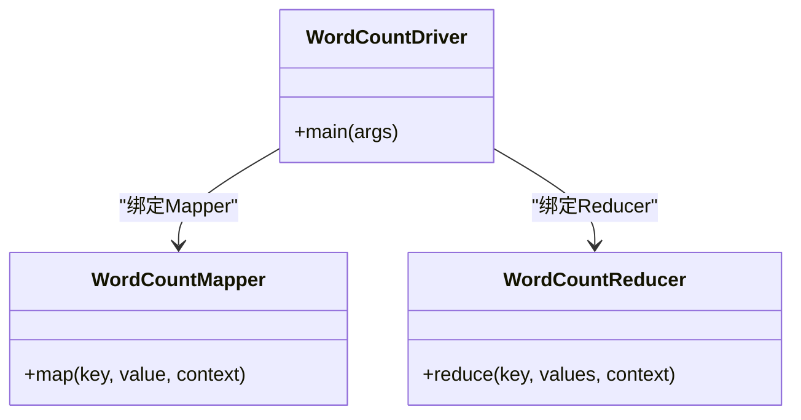
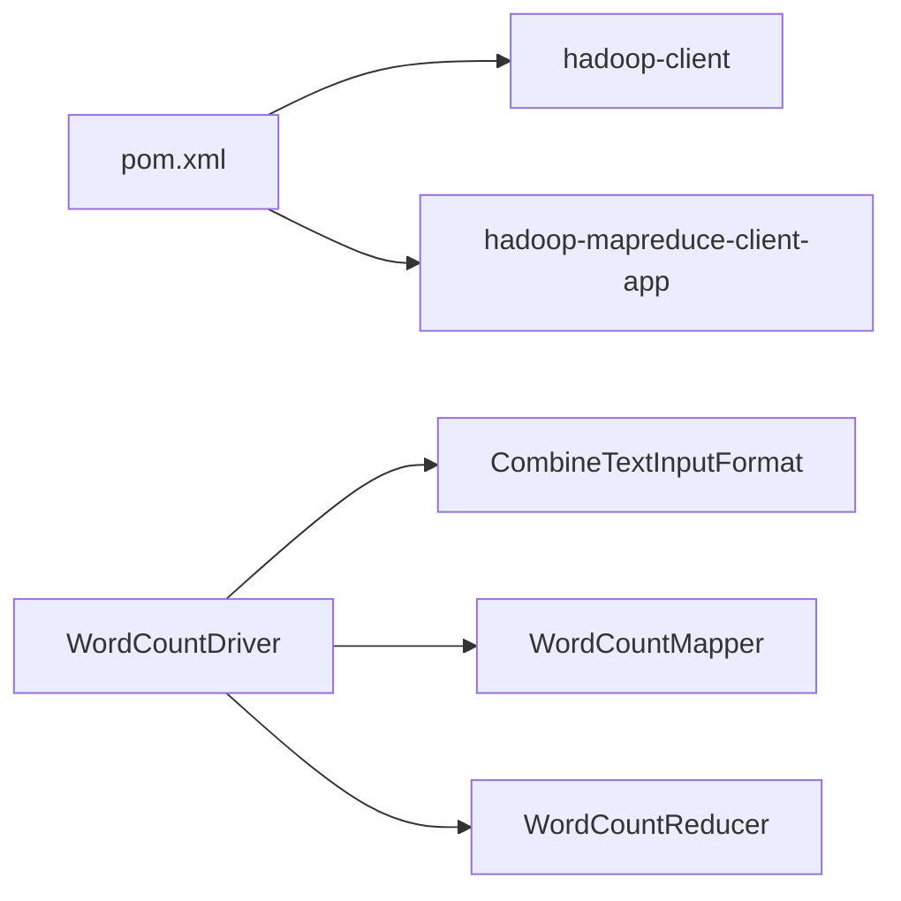

# CombineTextInputFormat优化

<cite>
**本文引用的文件**
- [WordCountDriver.java](file://_02_hadoop/MapReduceDemo/src/main/java/com/atguigu/mapreduce/combineTextInputforamt/WordCountDriver.java)
- [WordCountMapper.java](file://_02_hadoop/MapReduceDemo/src/main/java/com/atguigu/mapreduce/combineTextInputforamt/WordCountMapper.java)
- [WordCountReducer.java](file://_02_hadoop/MapReduceDemo/src/main/java/com/atguigu/mapreduce/combineTextInputforamt/WordCountReducer.java)
- [pom.xml](file://_02_hadoop/pom.xml)
</cite>

## 目录
1. [引言](#引言)
2. [项目结构](#项目结构)
3. [核心组件](#核心组件)
4. [架构总览](#架构总览)
5. [详细组件分析](#详细组件分析)
6. [依赖关系分析](#依赖关系分析)
7. [性能考量](#性能考量)
8. [故障排查指南](#故障排查指南)
9. [结论](#结论)
10. [附录](#附录)

## 引言
本技术文档围绕 CombineTextInputFormat 在 Hadoop MapReduce 中的优化实践展开，目标是帮助开发者理解其工作原理、优势与适用场景，并提供可直接参考的配置方法与使用范式。结合仓库中的示例，我们将说明如何通过将大量小文件合并为输入分片来减少 Map 任务数量，从而降低任务启动开销、提升资源利用率并缩短整体执行时间。

## 项目结构
该示例位于 Hadoop MapReduceDemo 模块下，采用标准 Maven 结构组织，核心优化点集中在 Driver 层对 InputFormat 的切换与参数设置上：
- Driver 负责作业初始化、输入输出路径设置、Mapper/Reducer 绑定、以及 CombineTextInputFormat 的启用与切片大小上限配置
- Mapper/Reducer 实现 WordCount 基本逻辑，便于聚焦 InputFormat 对任务规模的影响
- 顶层 pom.xml 提供 Hadoop 客户端与 MapReduce 相关依赖

图示来源
- [WordCountDriver.java](file://_02_hadoop/MapReduceDemo/src/main/java/com/atguigu/mapreduce/combineTextInputforamt/WordCountDriver.java#L1-L55)
- [WordCountMapper.java](file://_02_hadoop/MapReduceDemo/src/main/java/com/atguigu/mapreduce/combineTextInputforamt/WordCountMapper.java#L1-L42)
- [WordCountReducer.java](file://_02_hadoop/MapReduceDemo/src/main/java/com/atguigu/mapreduce/combineTextInputforamt/WordCountReducer.java#L1-L34)
- [pom.xml](file://_02_hadoop/pom.xml#L1-L84)

章节来源
- [WordCountDriver.java](file://_02_hadoop/MapReduceDemo/src/main/java/com/atguigu/mapreduce/combineTextInputforamt/WordCountDriver.java#L1-L55)
- [pom.xml](file://_02_hadoop/pom.xml#L1-L84)

## 核心组件
- WordCountDriver：作业入口，负责设置 InputFormat 为 CombineTextInputFormat，并通过 setMaxInputSplitSize 控制单个 split 的上限；同时配置输入输出路径并提交作业
- WordCountMapper：按行读取文本，拆分为单词并输出键值对
- WordCountReducer：对相同键的计数进行累加并输出结果
- Hadoop 依赖：通过 Maven 引入 hadoop-client 与 mapreduce 相关组件，确保运行时可用 CombineTextInputFormat

章节来源
- [WordCountDriver.java](file://_02_hadoop/MapReduceDemo/src/main/java/com/atguigu/mapreduce/combineTextInputforamt/WordCountDriver.java#L1-L55)
- [WordCountMapper.java](file://_02_hadoop/MapReduceDemo/src/main/java/com/atguigu/mapreduce/combineTextInputforamt/WordCountMapper.java#L1-L42)
- [WordCountReducer.java](file://_02_hadoop/MapReduceDemo/src/main/java/com/atguigu/mapreduce/combineTextInputforamt/WordCountReducer.java#L1-L34)
- [pom.xml](file://_02_hadoop/pom.xml#L1-L84)

## 架构总览
下图展示了使用 CombineTextInputFormat 时的典型作业执行流程，重点体现“合并小文件为大分片”的优化路径。

图示来源
- [WordCountDriver.java](file://_02_hadoop/MapReduceDemo/src/main/java/com/atguigu/mapreduce/combineTextInputforamt/WordCountDriver.java#L35-L54)
- [WordCountMapper.java](file://_02_hadoop/MapReduceDemo/src/main/java/com/atguigu/mapreduce/combineTextInputforamt/WordCountMapper.java#L1-L42)
- [WordCountReducer.java](file://_02_hadoop/MapReduceDemo/src/main/java/com/atguigu/mapreduce/combineTextInputforamt/WordCountReducer.java#L1-L34)

## 详细组件分析

### CombineTextInputFormat 工作原理与优势
- 合并策略：CombineTextInputFormat 会扫描输入目录下的所有文件，将多个小文件按容量合并为较大的输入分片（split），避免每个小文件都对应一个 Map 任务
- 阈值控制：通过 setMaxInputSplitSize 设定单个 split 的最大字节数，防止单个分片过大导致数据倾斜或内存压力
- 优势体现：
  - 减少 Map 任务数量，显著降低任务启动与调度开销
  - 提升磁盘顺序读取效率，减少小文件带来的元数据压力
  - 改善资源利用率，降低 YARN 资源碎片化

章节来源
- [WordCountDriver.java](file://_02_hadoop/MapReduceDemo/src/main/java/com/atguigu/mapreduce/combineTextInputforamt/WordCountDriver.java#L35-L54)

### Driver 中的启用与配置
- 设置 InputFormat：通过 setInputFormatClass 指定为 CombineTextInputFormat
- 设置分片上限：通过 setMaxInputSplitSize 指定单个 split 的最大字节，示例中设置为约 20MB
- 输入输出路径：使用 FileInputFormat/FileOutputFormat 指定输入目录与输出目录

图示来源
- [WordCountDriver.java](file://_02_hadoop/MapReduceDemo/src/main/java/com/atguigu/mapreduce/combineTextInputforamt/WordCountDriver.java#L35-L54)

章节来源
- [WordCountDriver.java](file://_02_hadoop/MapReduceDemo/src/main/java/com/atguigu/mapreduce/combineTextInputforamt/WordCountDriver.java#L1-L55)

### Mapper/Reducer 的职责边界
- Mapper：按行解析文本，拆分单词并输出键值对
- Reducer：对相同键的计数进行汇总，输出最终统计结果
- 与 InputFormat 的关系：Mapper/Reducer 不感知分片来源，仅依赖 InputFormat 提供的记录迭代器

图示来源
- [WordCountDriver.java](file://_02_hadoop/MapReduceDemo/src/main/java/com/atguigu/mapreduce/combineTextInputforamt/WordCountDriver.java#L1-L55)
- [WordCountMapper.java](file://_02_hadoop/MapReduceDemo/src/main/java/com/atguigu/mapreduce/combineTextInputforamt/WordCountMapper.java#L1-L42)
- [WordCountReducer.java](file://_02_hadoop/MapReduceDemo/src/main/java/com/atguigu/mapreduce/combineTextInputforamt/WordCountReducer.java#L1-L34)

章节来源
- [WordCountMapper.java](file://_02_hadoop/MapReduceDemo/src/main/java/com/atguigu/mapreduce/combineTextInputforamt/WordCountMapper.java#L1-L42)
- [WordCountReducer.java](file://_02_hadoop/MapReduceDemo/src/main/java/com/atguigu/mapreduce/combineTextInputforamt/WordCountReducer.java#L1-L34)

### 与 TextInputFormat 的对比
- 传统 TextInputFormat：每个输入文件通常对应一个 split，小文件过多会导致 Map 任务数量剧增，任务启动与调度开销上升
- CombineTextInputFormat：合并小文件形成较大 split，减少 Map 数量，降低启动开销，提升吞吐

章节来源
- [WordCountDriver.java](file://_02_hadoop/MapReduceDemo/src/main/java/com/atguigu/mapreduce/combineTextInputforamt/WordCountDriver.java#L35-L43)

### 配置方法与使用场景
- 配置要点
  - 在 Driver 中设置 InputFormat 为 CombineTextInputFormat
  - 使用 setMaxInputSplitSize 设置单个 split 的上限，建议根据数据特征与集群资源评估
  - 指定输入输出路径
- 典型使用场景
  - 日志/事件数据：大量小文件按天/小时切分
  - 数据采集：传感器/埋点上报产生的细粒度文件
  - ETL 清洗：中间产物常为大量小文件

章节来源
- [WordCountDriver.java](file://_02_hadoop/MapReduceDemo/src/main/java/com/atguigu/mapreduce/combineTextInputforamt/WordCountDriver.java#L35-L54)

### 优化效果分析
- 任务启动开销：减少 Map 数量，降低 TaskTracker/YARN 的任务创建与销毁频率
- 资源利用率：合并后顺序读取更高效，减少小文件带来的元数据与索引开销
- 整体执行时间：在 I/O 密集场景下，通常能明显缩短端到端耗时

章节来源
- [WordCountDriver.java](file://_02_hadoop/MapReduceDemo/src/main/java/com/atguigu/mapreduce/combineTextInputforamt/WordCountDriver.java#L35-L54)

### 适用场景与注意事项
- 适用场景
  - 大量小文件输入且单文件不大于 split 上限
  - 计算密集型或 CPU 密集型任务，I/O 成本为主要瓶颈
- 注意事项
  - split 上限不宜过大，避免单 Map 任务处理过多数据导致内存压力
  - 若存在超大文件，需结合业务与集群能力调整阈值
  - 对于严格行级语义的任务，需确认合并后的记录边界不会影响业务逻辑（例如换行符处理）

章节来源
- [WordCountDriver.java](file://_02_hadoop/MapReduceDemo/src/main/java/com/atguigu/mapreduce/combineTextInputforamt/WordCountDriver.java#L35-L54)

## 依赖关系分析
- 依赖来源：顶层 pom.xml 引入 hadoop-client 与 mapreduce 相关依赖，确保运行时可用 CombineTextInputFormat
- 运行时关系：Driver 通过 Hadoop API 设置 InputFormat 并提交作业，Mapper/Reducer 作为标准 MapReduce 组件参与执行

图示来源
- [pom.xml](file://_02_hadoop/pom.xml#L1-L84)
- [WordCountDriver.java](file://_02_hadoop/MapReduceDemo/src/main/java/com/atguigu/mapreduce/combineTextInputforamt/WordCountDriver.java#L1-L55)

章节来源
- [pom.xml](file://_02_hadoop/pom.xml#L1-L84)
- [WordCountDriver.java](file://_02_hadoop/MapReduceDemo/src/main/java/com/atguigu/mapreduce/combineTextInputforamt/WordCountDriver.java#L1-L55)

## 性能考量
- 分片大小阈值的选择应基于以下因素：
  - 集群节点数量与容器资源
  - 单 Map 任务的内存与 CPU 配额
  - 输入数据的压缩比与编码方式
- 建议先以中等阈值进行压测，观察任务分布与资源占用后再微调

## 故障排查指南
- 问题：任务数量异常增多
  - 排查：确认是否错误地未设置 InputFormat 或未调用 setMaxInputSplitSize
  - 参考：Driver 中 setInputFormatClass 与 setMaxInputSplitSize 的调用位置
- 问题：单任务执行时间过长
  - 排查：检查阈值是否过大，导致单 Map 处理数据过多
  - 参考：Driver 中 setMaxInputSplitSize 的设置
- 问题：输出结果为空或异常
  - 排查：确认 Mapper/Reducer 的输出类型与键值处理逻辑
  - 参考：Mapper/Reducer 的键值类型与写出逻辑

章节来源
- [WordCountDriver.java](file://_02_hadoop/MapReduceDemo/src/main/java/com/atguigu/mapreduce/combineTextInputforamt/WordCountDriver.java#L35-L54)
- [WordCountMapper.java](file://_02_hadoop/MapReduceDemo/src/main/java/com/atguigu/mapreduce/combineTextInputforamt/WordCountMapper.java#L1-L42)
- [WordCountReducer.java](file://_02_hadoop/MapReduceDemo/src/main/java/com/atguigu/mapreduce/combineTextInputforamt/WordCountReducer.java#L1-L34)

## 结论
CombineTextInputFormat 通过“合并小文件为大分片”的策略，在 MapReduce 场景中有效减少了 Map 任务数量，降低了任务启动开销，提升了资源利用率与整体执行效率。结合合理的分片阈值设置与压测验证，可在多数日志与数据采集类场景中获得显著收益。实际使用中需关注阈值设定、资源配额与业务语义，确保在性能与稳定性之间取得平衡。

## 附录
- 示例代码片段路径（不含具体代码内容）：
  - Driver 启用与配置：[WordCountDriver.java](file://_02_hadoop/MapReduceDemo/src/main/java/com/atguigu/mapreduce/combineTextInputforamt/WordCountDriver.java#L35-L54)
  - Mapper 键值处理：[WordCountMapper.java](file://_02_hadoop/MapReduceDemo/src/main/java/com/atguigu/mapreduce/combineTextInputforamt/WordCountMapper.java#L1-L42)
  - Reducer 聚合逻辑：[WordCountReducer.java](file://_02_hadoop/MapReduceDemo/src/main/java/com/atguigu/mapreduce/combineTextInputforamt/WordCountReducer.java#L1-L34)
  - Hadoop 依赖声明：[pom.xml](file://_02_hadoop/pom.xml#L1-L84)