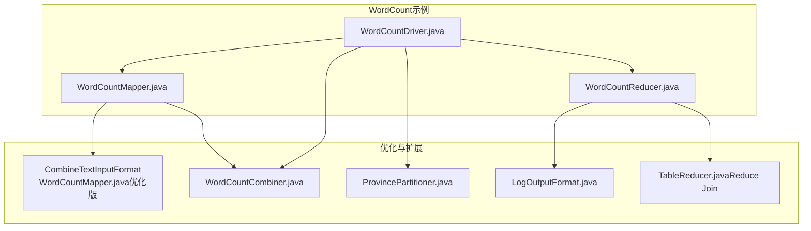
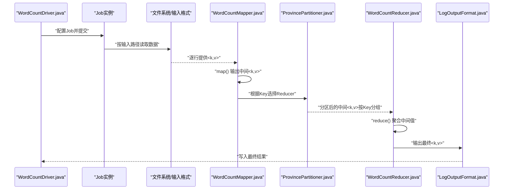
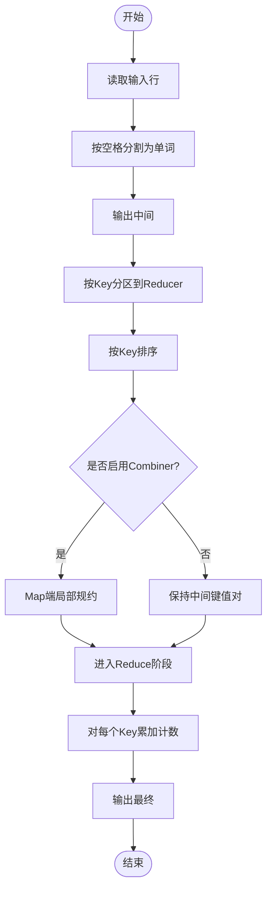
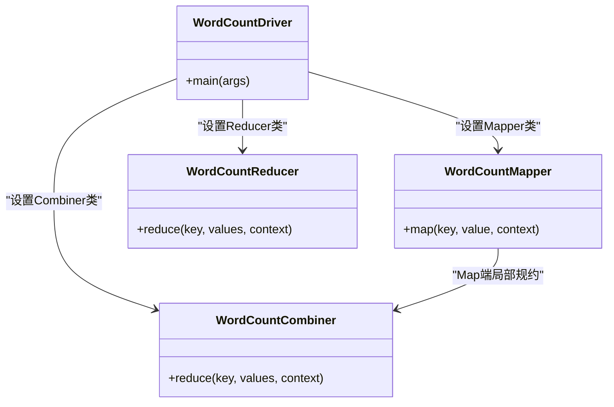
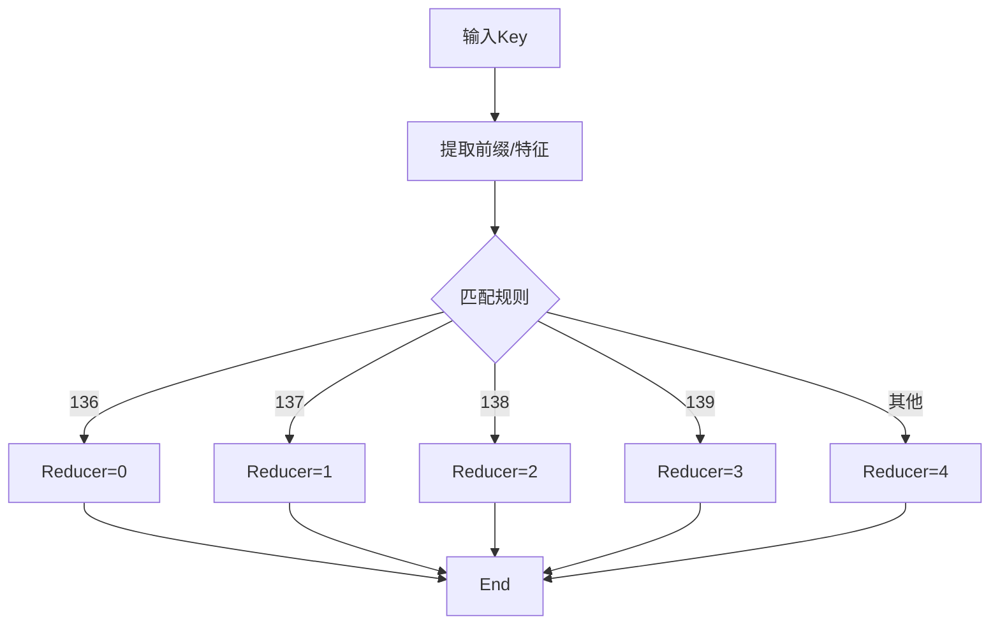
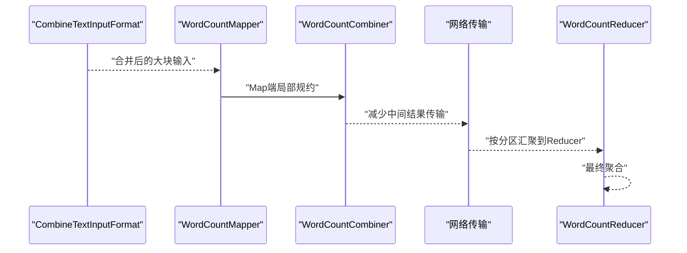
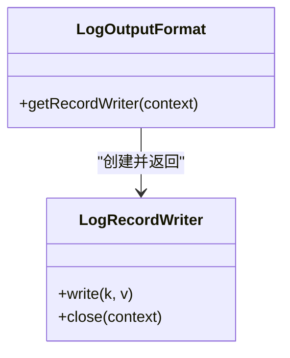
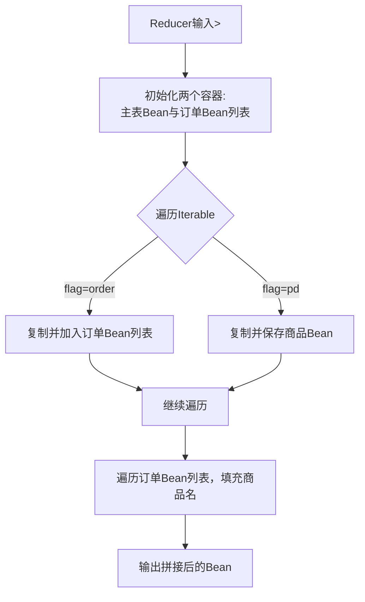
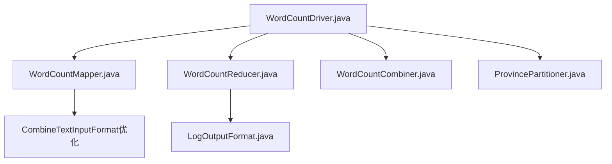

# MapReduce编程模型

<cite>
**本文引用的文件**
- [WordCountMapper.java](file://_02_hadoop/MapReduceDemo/src/main/java/com/atguigu/mapreduce/wordcount/WordCountMapper.java)
- [WordCountReducer.java](file://_02_hadoop/MapReduceDemo/src/main/java/com/atguigu/mapreduce/wordcount/WordCountReducer.java)
- [WordCountDriver.java](file://_02_hadoop/MapReduceDemo/src/main/java/com/atguigu/mapreduce/wordcount/WordCountDriver.java)
- [WordCountMapper.java（CombineTextInputFormat示例）](file://_02_hadoop/MapReduceDemo/src/main/java/com/atguigu/mapreduce/combineTextInputforamt/WordCountMapper.java)
- [WordCountCombiner.java](file://_02_hadoop/MapReduceDemo/src/main/java/com/atguigu/mapreduce/combiner/WordCountCombiner.java)
- [WordCountDriver.java（分区器示例）](file://_02_hadoop/MapReduceDemo/src/main/java/com/atguigu/mapreduce/partitioner/WordCountDriver.java)
- [ProvincePartitioner.java](file://_02_hadoop/MapReduceDemo/src/main/java/com/atguigu/mapreduce/partitioner2/ProvincePartitioner.java)
- [FlowDriver.java](file://_02_hadoop/MapReduceDemo/src/main/java/com/atguigu/mapreduce/writable/FlowDriver.java)
- [LogOutputFormat.java](file://_02_hadoop/MapReduceDemo/src/main/java/com/atguigu/mapreduce/outputformat/LogOutputFormat.java)
- [TableReducer.java](file://_02_hadoop/MapReduceDemo/src/main/java/com/atguigu/mapreduce/reduceJoin/TableReducer.java)
</cite>

## 目录
1. [引言](#引言)
2. [项目结构](#项目结构)
3. [核心组件](#核心组件)
4. [架构总览](#架构总览)
5. [详细组件分析](#详细组件分析)
6. [依赖关系分析](#依赖关系分析)
7. [性能考虑](#性能考虑)
8. [故障排查指南](#故障排查指南)
9. [结论](#结论)
10. [附录](#附录)

## 引言
本技术文档围绕MapReduce编程模型展开，系统阐述其核心思想、两阶段处理流程与分布式计算原理，并以WordCount经典示例为主线，深入解析Mapper与Reducer的实现模式，涵盖输入输出格式、键值对处理、中间结果传递、分区器、排序、规约、序列化、自定义OutputFormat以及Join等扩展场景。同时提供作业配置、提交与监控方法，结合CombineTextInputFormat优化、Combiner规约、数据本地性与错误处理策略，帮助开发者掌握大规模数据处理的编程技能。

## 项目结构
该仓库中与MapReduce直接相关的内容集中在以下模块：
- wordcount：标准WordCount实现，包含Mapper、Reducer与Driver
- combineTextInputforamt：基于CombineTextInputFormat的数据分片合并优化
- combiner：在Map端进行局部规约的Combiner示例
- partitioner / partitioner2：自定义分区器示例
- writable / writableComparable：自定义Writable与可比较Writable示例
- outputformat：自定义OutputFormat与RecordWriter示例
- reduceJoin：基于Reducer的宽连接Join示例
- etl：数据清洗与ETL示例（概念性说明）

下图给出与MapReduce核心流程相关的文件组织关系：

图表来源
- [WordCountDriver.java](file://_02_hadoop/MapReduceDemo/src/main/java/com/atguigu/mapreduce/wordcount/WordCountDriver.java#L1-L48)
- [WordCountMapper.java](file://_02_hadoop/MapReduceDemo/src/main/java/com/atguigu/mapreduce/wordcount/WordCountMapper.java#L1-L41)
- [WordCountReducer.java](file://_02_hadoop/MapReduceDemo/src/main/java/com/atguigu/mapreduce/wordcount/WordCountReducer.java#L1-L36)
- [WordCountMapper.java（CombineTextInputFormat示例）](file://_02_hadoop/MapReduceDemo/src/main/java/com/atguigu/mapreduce/combineTextInputforamt/WordCountMapper.java#L1-L42)
- [WordCountCombiner.java](file://_02_hadoop/MapReduceDemo/src/main/java/com/atguigu/mapreduce/combiner/WordCountCombiner.java#L1-L25)
- [ProvincePartitioner.java](file://_02_hadoop/MapReduceDemo/src/main/java/com/atguigu/mapreduce/partitioner2/ProvincePartitioner.java#L1-L32)
- [LogOutputFormat.java](file://_02_hadoop/MapReduceDemo/src/main/java/com/atguigu/mapreduce/outputformat/LogOutputFormat.java#L1-L20)
- [TableReducer.java](file://_02_hadoop/MapReduceDemo/src/main/java/com/atguigu/mapreduce/reduceJoin/TableReducer.java#L1-L60)

章节来源
- [WordCountDriver.java](file://_02_hadoop/MapReduceDemo/src/main/java/com/atguigu/mapreduce/wordcount/WordCountDriver.java#L1-L48)

## 核心组件
- Mapper：负责将输入切分为键值对，通常输出临时中间键值对供Shuffle阶段使用
- Reducer：接收同一Key的所有中间值，执行聚合或连接等操作，输出最终结果
- Driver：封装Job配置、输入输出路径设置、Mapper/Reducer绑定、序列化类型声明与提交
- Combiner：在Map端进行局部规约，减少网络传输
- Partitioner：决定Key被路由到哪个Reducer
- 自定义Writable/WritableComparable：用于复杂业务实体的序列化与排序
- 自定义OutputFormat/RecordWriter：控制最终输出格式与写入行为
- Reduce Join：在Reducer中完成宽连接，避免Map端跨节点数据搬运

章节来源
- [WordCountMapper.java](file://_02_hadoop/MapReduceDemo/src/main/java/com/atguigu/mapreduce/wordcount/WordCountMapper.java#L1-L41)
- [WordCountReducer.java](file://_02_hadoop/MapReduceDemo/src/main/java/com/atguigu/mapreduce/wordcount/WordCountReducer.java#L1-L36)
- [WordCountDriver.java](file://_02_hadoop/MapReduceDemo/src/main/java/com/atguigu/mapreduce/wordcount/WordCountDriver.java#L1-L48)
- [WordCountCombiner.java](file://_02_hadoop/MapReduceDemo/src/main/java/com/atguigu/mapreduce/combiner/WordCountCombiner.java#L1-L25)
- [ProvincePartitioner.java](file://_02_hadoop/MapReduceDemo/src/main/java/com/atguigu/mapreduce/partitioner2/ProvincePartitioner.java#L1-L32)
- [LogOutputFormat.java](file://_02_hadoop/MapReduceDemo/src/main/java/com/atguigu/mapreduce/outputformat/LogOutputFormat.java#L1-L20)
- [TableReducer.java](file://_02_hadoop/MapReduceDemo/src/main/java/com/atguigu/mapreduce/reduceJoin/TableReducer.java#L1-L60)

## 架构总览
下图展示了从Driver到Mapper、Shuffle、Partition、Sort/Combine、Reduce到Output的整体流程，映射到具体源码文件中的职责分工。

图表来源
- [WordCountDriver.java](file://_02_hadoop/MapReduceDemo/src/main/java/com/atguigu/mapreduce/wordcount/WordCountDriver.java#L1-L48)
- [WordCountMapper.java](file://_02_hadoop/MapReduceDemo/src/main/java/com/atguigu/mapreduce/wordcount/WordCountMapper.java#L1-L41)
- [ProvincePartitioner.java](file://_02_hadoop/MapReduceDemo/src/main/java/com/atguigu/mapreduce/partitioner2/ProvincePartitioner.java#L1-L32)
- [WordCountReducer.java](file://_02_hadoop/MapReduceDemo/src/main/java/com/atguigu/mapreduce/wordcount/WordCountReducer.java#L1-L36)
- [LogOutputFormat.java](file://_02_hadoop/MapReduceDemo/src/main/java/com/atguigu/mapreduce/outputformat/LogOutputFormat.java#L1-L20)

## 详细组件分析

### 组件A：WordCount两阶段处理流程
- 输入阶段：Mapper接收每行文本，按空格拆分为单词，输出中间键值对
- Shuffle/Sort/Combine阶段：按Key分区、排序；可在Map端用Combiner做局部规约
- Reduce阶段：对每个Key的计数进行汇总，输出最终结果
- 输出阶段：使用自定义OutputFormat控制最终写入

图表来源
- [WordCountMapper.java](file://_02_hadoop/MapReduceDemo/src/main/java/com/atguigu/mapreduce/wordcount/WordCountMapper.java#L1-L41)
- [WordCountReducer.java](file://_02_hadoop/MapReduceDemo/src/main/java/com/atguigu/mapreduce/wordcount/WordCountReducer.java#L1-L36)
- [WordCountCombiner.java](file://_02_hadoop/MapReduceDemo/src/main/java/com/atguigu/mapreduce/combiner/WordCountCombiner.java#L1-L25)

章节来源
- [WordCountMapper.java](file://_02_hadoop/MapReduceDemo/src/main/java/com/atguigu/mapreduce/wordcount/WordCountMapper.java#L1-L41)
- [WordCountReducer.java](file://_02_hadoop/MapReduceDemo/src/main/java/com/atguigu/mapreduce/wordcount/WordCountReducer.java#L1-L36)
- [WordCountDriver.java](file://_02_hadoop/MapReduceDemo/src/main/java/com/atguigu/mapreduce/wordcount/WordCountDriver.java#L1-L48)

### 组件B：Mapper与Reducer实现模式
- Mapper模式：逐行读取、切分、发射中间键值对；键为单词，值为计数初始值
- Reducer模式：对同Key的多个计数值求和，输出最终计数
- 类型约束：Map输出类型与最终输出类型需在Driver中显式声明

图表来源
- [WordCountMapper.java](file://_02_hadoop/MapReduceDemo/src/main/java/com/atguigu/mapreduce/wordcount/WordCountMapper.java#L1-L41)
- [WordCountReducer.java](file://_02_hadoop/MapReduceDemo/src/main/java/com/atguigu/mapreduce/wordcount/WordCountReducer.java#L1-L36)
- [WordCountDriver.java](file://_02_hadoop/MapReduceDemo/src/main/java/com/atguigu/mapreduce/wordcount/WordCountDriver.java#L1-L48)
- [WordCountCombiner.java](file://_02_hadoop/MapReduceDemo/src/main/java/com/atguigu/mapreduce/combiner/WordCountCombiner.java#L1-L25)

章节来源
- [WordCountMapper.java](file://_02_hadoop/MapReduceDemo/src/main/java/com/atguigu/mapreduce/wordcount/WordCountMapper.java#L1-L41)
- [WordCountReducer.java](file://_02_hadoop/MapReduceDemo/src/main/java/com/atguigu/mapreduce/wordcount/WordCountReducer.java#L1-L36)
- [WordCountDriver.java](file://_02_hadoop/MapReduceDemo/src/main/java/com/atguigu/mapreduce/wordcount/WordCountDriver.java#L1-L48)

### 组件C：分区器与排序
- 分区器：根据Key决定Reducer编号，确保相同Key落到同一分区
- 排序：默认按Key字典序排序，保证Reducer侧聚合的确定性
- 示例：手机号前缀分区，将不同号段路由至不同Reducer

图表来源
- [ProvincePartitioner.java](file://_02_hadoop/MapReduceDemo/src/main/java/com/atguigu/mapreduce/partitioner2/ProvincePartitioner.java#L1-L32)

章节来源
- [ProvincePartitioner.java](file://_02_hadoop/MapReduceDemo/src/main/java/com/atguigu/mapreduce/partitioner2/ProvincePartitioner.java#L1-L32)
- [WordCountDriver.java（分区器示例）](file://_02_hadoop/MapReduceDemo/src/main/java/com/atguigu/mapreduce/partitioner/WordCountDriver.java#L1-L48)

### 组件D：Combiner与CombineTextInputFormat
- Combiner：在Map端进行局部规约，减少网络传输，提升整体吞吐
- CombineTextInputFormat：将多个小文件合并为单个InputSplit，降低Task数量，提高资源利用率

图表来源
- [WordCountMapper.java（CombineTextInputFormat示例）](file://_02_hadoop/MapReduceDemo/src/main/java/com/atguigu/mapreduce/combineTextInputforamt/WordCountMapper.java#L1-L42)
- [WordCountCombiner.java](file://_02_hadoop/MapReduceDemo/src/main/java/com/atguigu/mapreduce/combiner/WordCountCombiner.java#L1-L25)

章节来源
- [WordCountMapper.java（CombineTextInputFormat示例）](file://_02_hadoop/MapReduceDemo/src/main/java/com/atguigu/mapreduce/combineTextInputforamt/WordCountMapper.java#L1-L42)
- [WordCountCombiner.java](file://_02_hadoop/MapReduceDemo/src/main/java/com/atguigu/mapreduce/combiner/WordCountCombiner.java#L1-L25)

### 组件E：自定义Writable与可比较Writable
- 自定义Writable：承载复杂业务实体（如流量统计），需实现序列化接口
- 可比较Writable：支持排序与二次排序（如按主键+副键排序）
- 示例：以手机号为Key，业务实体为Value，参与分区与排序

章节来源
- [FlowDriver.java](file://_02_hadoop/MapReduceDemo/src/main/java/com/atguigu/mapreduce/writable/FlowDriver.java#L1-L40)

### 组件F：自定义OutputFormat与RecordWriter
- OutputFormat：定义最终输出格式与RecordWriter
- RecordWriter：控制如何将<k,v>写入目标存储（如文件、数据库等）
- 示例：自定义日志输出格式，控制分隔符与字段顺序

图表来源
- [LogOutputFormat.java](file://_02_hadoop/MapReduceDemo/src/main/java/com/atguigu/mapreduce/outputformat/LogOutputFormat.java#L1-L20)

章节来源
- [LogOutputFormat.java](file://_02_hadoop/MapReduceDemo/src/main/java/com/atguigu/mapreduce/outputformat/LogOutputFormat.java#L1-L20)

### 组件G：Reduce Join
- 思路：在Reducer中聚合来自多个数据源的记录，完成宽连接
- 实现要点：区分不同数据源标识，缓存主表记录，遍历订单表记录进行拼接

图表来源
- [TableReducer.java](file://_02_hadoop/MapReduceDemo/src/main/java/com/atguigu/mapreduce/reduceJoin/TableReducer.java#L1-L60)

章节来源
- [TableReducer.java](file://_02_hadoop/MapReduceDemo/src/main/java/com/atguigu/mapreduce/reduceJoin/TableReducer.java#L1-L60)

## 依赖关系分析
- Driver依赖Mapper、Reducer、Combiner、Partitioner、OutputFormat等组件
- Mapper依赖输入格式（如CombineTextInputFormat）与序列化类型
- Partitioner影响数据分布与Reducer负载均衡
- Combiner减少网络带宽，提升整体性能
- 自定义OutputFormat控制最终输出格式

图表来源
- [WordCountDriver.java](file://_02_hadoop/MapReduceDemo/src/main/java/com/atguigu/mapreduce/wordcount/WordCountDriver.java#L1-L48)
- [WordCountMapper.java](file://_02_hadoop/MapReduceDemo/src/main/java/com/atguigu/mapreduce/wordcount/WordCountMapper.java#L1-L41)
- [WordCountReducer.java](file://_02_hadoop/MapReduceDemo/src/main/java/com/atguigu/mapreduce/wordcount/WordCountReducer.java#L1-L36)
- [WordCountCombiner.java](file://_02_hadoop/MapReduceDemo/src/main/java/com/atguigu/mapreduce/combiner/WordCountCombiner.java#L1-L25)
- [ProvincePartitioner.java](file://_02_hadoop/MapReduceDemo/src/main/java/com/atguigu/mapreduce/partitioner2/ProvincePartitioner.java#L1-L32)
- [LogOutputFormat.java](file://_02_hadoop/MapReduceDemo/src/main/java/com/atguigu/mapreduce/outputformat/LogOutputFormat.java#L1-L20)

章节来源
- [WordCountDriver.java](file://_02_hadoop/MapReduceDemo/src/main/java/com/atguigu/mapreduce/wordcount/WordCountDriver.java#L1-L48)

## 性能考虑
- 数据本地性：尽量让计算节点靠近数据存储，减少网络传输
- CombineTextInputFormat：合并小文件，降低Task数量与元数据开销
- Combiner：在Map端做局部规约，显著减少shuffle数据量
- 分区策略：合理设计Partitioner，避免热点Key与数据倾斜
- 序列化优化：使用轻量级Writable类型，减少序列化/反序列化成本
- Reduce并行度：根据数据规模与集群资源调整Reducer数量
- 增量与压缩：对中间结果与最终输出启用合适的压缩策略

## 故障排查指南
- 作业提交失败：检查Driver中Jar包路径、输入输出路径、类型声明是否一致
- 结果为空：确认Mapper是否正确emit中间键值对，Reducer是否正确聚合
- 数据倾斜：检查Partitioner是否均匀分布Key，必要时引入随机前缀或采样重分区
- 内存溢出：检查自定义Writable大小与对象复用，避免频繁创建大对象
- 输出格式异常：核对OutputFormat与RecordWriter实现，确保字段顺序与分隔符正确

章节来源
- [WordCountDriver.java](file://_02_hadoop/MapReduceDemo/src/main/java/com/atguigu/mapreduce/wordcount/WordCountDriver.java#L1-L48)
- [LogOutputFormat.java](file://_02_hadoop/MapReduceDemo/src/main/java/com/atguigu/mapreduce/outputformat/LogOutputFormat.java#L1-L20)

## 结论
通过上述示例与分析，可以系统掌握MapReduce的两阶段处理流程、类型体系、分区与排序机制、Combiner优化、自定义序列化与输出格式，以及Reduce Join等高级模式。结合数据本地性与合理的分区策略，能够在大规模数据处理任务中获得稳定且高效的性能表现。

## 附录
- 作业配置清单（Driver侧）
  - 设置Jar包路径
  - 绑定Mapper/Reducer/Combiner/Partitioner
  - 声明Map输出与最终输出的Key/Value类型
  - 指定输入输出路径
  - 提交作业并等待完成状态
- 常见问题
  - 类型不匹配导致的运行时异常
  - 分区不均引发的性能瓶颈
  - 输出格式与字段顺序不一致

章节来源
- [WordCountDriver.java](file://_02_hadoop/MapReduceDemo/src/main/java/com/atguigu/mapreduce/wordcount/WordCountDriver.java#L1-L48)
- [WordCountDriver.java（分区器示例）](file://_02_hadoop/MapReduceDemo/src/main/java/com/atguigu/mapreduce/partitioner/WordCountDriver.java#L1-L48)