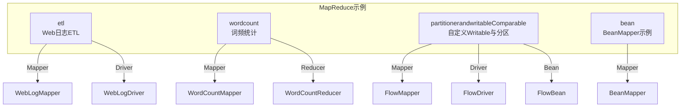
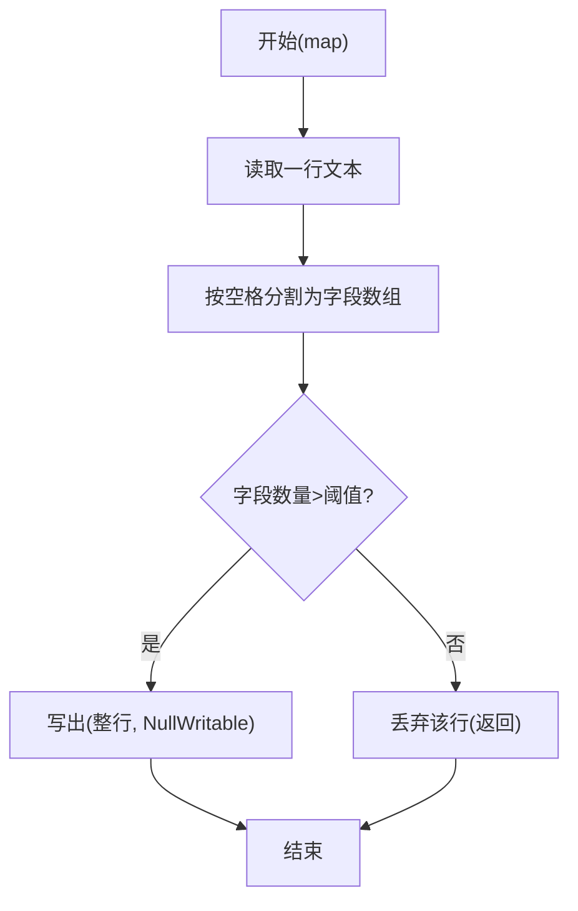
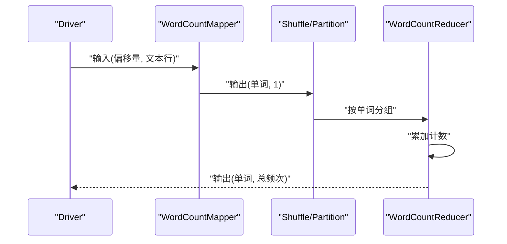
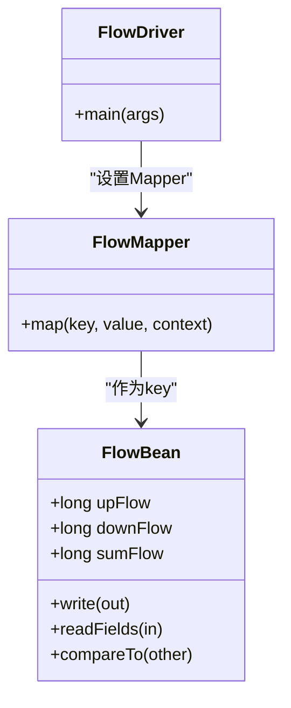
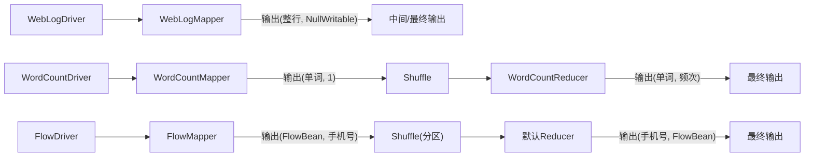

# 数据处理模式

<cite>
**本文引用的文件**
- [WebLogMapper.java](file://_02_hadoop/MapReduceDemo/src/main/java/com/atguigu/mapreduce/etl/WebLogMapper.java)
- [WebLogDriver.java](file://_02_hadoop/MapReduceDemo/src/main/java/com/atguigu/mapreduce/etl/WebLogDriver.java)
- [WordCountMapper.java](file://_02_hadoop/MapReduceDemo/src/main/java/com/atguigu/mapreduce/wordcount/WordCountMapper.java)
- [WordCountReducer.java](file://_02_hadoop/MapReduceDemo/src/main/java/com/atguigu/mapreduce/wordcount/WordCountReducer.java)
- [FlowMapper.java](file://_02_hadoop/MapReduceDemo/src/main/java/com/atguigu/mapreduce/partitionerandwritableComparable/FlowMapper.java)
- [FlowDriver.java](file://_02_hadoop/MapReduceDemo/src/main/java/com/atguigu/mapreduce/partitionerandwritableComparable/FlowDriver.java)
- [FlowBean.java](file://_02_hadoop/MapReduceDemo/src/main/java/com/atguigu/mapreduce/partitionerandwritableComparable/FlowBean.java)
- [BeanMapper.java](file://_02_hadoop/src/main/java/com/hanzhong/bean/BeanMapper.java)
</cite>

## 目录
1. [引言](#引言)
2. [项目结构](#项目结构)
3. [核心组件](#核心组件)
4. [架构总览](#架构总览)
5. [详细组件分析](#详细组件分析)
6. [依赖关系分析](#依赖关系分析)
7. [性能考虑](#性能考虑)
8. [故障排查指南](#故障排查指南)
9. [结论](#结论)
10. [附录](#附录)

## 引言
本文件围绕MapReduce数据处理模式，系统性梳理ETL（Extract, Transform, Load）在MapReduce中的实现方式，结合Web日志处理示例，深入讲解数据抽取、转换与加载的完整流程。文档重点覆盖：
- Mapper中的数据解析逻辑：字段提取、数据类型转换、异常处理与数据清洗
- Reducer中的数据聚合与格式化方法
- 多种数据处理场景的实现模式：数据过滤、字段映射、数据校验与格式标准化
- 错误数据处理策略、数据质量保证与性能优化技巧
- 通过实际案例演示复杂数据处理任务的分解与实现

## 项目结构
本仓库中与MapReduce直接相关的示例主要集中在以下模块：
- etl：Web日志ETL示例，包含Mapper与驱动类
- wordcount：经典词频统计示例，包含Mapper与Reducer
- partitionerandwritableComparable：带自定义Writable与分区器的示例
- bean：基于自定义Bean的Mapper示例

图表来源
- [WebLogMapper.java](file://_02_hadoop/MapReduceDemo/src/main/java/com/atguigu/mapreduce/etl/WebLogMapper.java#L1-L42)
- [WebLogDriver.java](file://_02_hadoop/MapReduceDemo/src/main/java/com/atguigu/mapreduce/etl/WebLogDriver.java#L1-L46)
- [WordCountMapper.java](file://_02_hadoop/MapReduceDemo/src/main/java/com/atguigu/mapreduce/wordcount/WordCountMapper.java#L1-L41)
- [WordCountReducer.java](file://_02_hadoop/MapReduceDemo/src/main/java/com/atguigu/mapreduce/wordcount/WordCountReducer.java#L1-L36)
- [FlowMapper.java](file://_02_hadoop/MapReduceDemo/src/main/java/com/atguigu/mapreduce/partitionerandwritableComparable/FlowMapper.java#L1-L32)
- [FlowDriver.java](file://_02_hadoop/MapReduceDemo/src/main/java/com/atguigu/mapreduce/partitionerandwritableComparable/FlowDriver.java#L1-L46)
- [FlowBean.java](file://_02_hadoop/MapReduceDemo/src/main/java/com/atguigu/mapreduce/partitionerandwritableComparable/FlowBean.java#L1-L60)
- [BeanMapper.java](file://_02_hadoop/src/main/java/com/hanzhong/bean/BeanMapper.java#L1-L34)

章节来源
- [WebLogMapper.java](file://_02_hadoop/MapReduceDemo/src/main/java/com/atguigu/mapreduce/etl/WebLogMapper.java#L1-L42)
- [WebLogDriver.java](file://_02_hadoop/MapReduceDemo/src/main/java/com/atguigu/mapreduce/etl/WebLogDriver.java#L1-L46)
- [WordCountMapper.java](file://_02_hadoop/MapReduceDemo/src/main/java/com/atguigu/mapreduce/wordcount/WordCountMapper.java#L1-L41)
- [WordCountReducer.java](file://_02_hadoop/MapReduceDemo/src/main/java/com/atguigu/mapreduce/wordcount/WordCountReducer.java#L1-L36)
- [FlowMapper.java](file://_02_hadoop/MapReduceDemo/src/main/java/com/atguigu/mapreduce/partitionerandwritableComparable/FlowMapper.java#L1-L32)
- [FlowDriver.java](file://_02_hadoop/MapReduceDemo/src/main/java/com/atguigu/mapreduce/partitionerandwritableComparable/FlowDriver.java#L1-L46)
- [FlowBean.java](file://_02_hadoop/MapReduceDemo/src/main/java/com/atguigu/mapreduce/partitionerandwritableComparable/FlowBean.java#L1-L60)
- [BeanMapper.java](file://_02_hadoop/src/main/java/com/hanzhong/bean/BeanMapper.java#L1-L34)

## 核心组件
- Web日志ETL（Mapper）
  - 负责逐行读取文本，执行ETL校验（字段数量判定），通过后将整行作为键写出，值为NullWritable
  - 该实现体现了“抽取+清洗”的典型流程：按行抽取，按规则过滤无效日志，输出干净数据
- 词频统计（Mapper/Reducer）
  - Mapper将每行按空格切分为单词，并输出(单词, 1)
  - Reducer对相同单词的计数进行累加，输出(单词, 总频次)
- 自定义Writable与分区（FlowBean/FlowMapper/FlowDriver）
  - FlowBean实现可比较的序列化接口，承载上行/下行/总流量
  - FlowMapper将原始记录解析为FlowBean作为key，手机号等作为value
  - FlowDriver配置分区器与Reduce任务数，实现按省份分区聚合
- BeanMapper（自定义Bean）
  - 将制表符分隔的原始记录解析为Bean，作为Mapper输出的值，体现字段映射与数据建模

章节来源
- [WebLogMapper.java](file://_02_hadoop/MapReduceDemo/src/main/java/com/atguigu/mapreduce/etl/WebLogMapper.java#L1-L42)
- [WordCountMapper.java](file://_02_hadoop/MapReduceDemo/src/main/java/com/atguigu/mapreduce/wordcount/WordCountMapper.java#L1-L41)
- [WordCountReducer.java](file://_02_hadoop/MapReduceDemo/src/main/java/com/atguigu/mapreduce/wordcount/WordCountReducer.java#L1-L36)
- [FlowBean.java](file://_02_hadoop/MapReduceDemo/src/main/java/com/atguigu/mapreduce/partitionerandwritableComparable/FlowBean.java#L1-L60)
- [FlowMapper.java](file://_02_hadoop/MapReduceDemo/src/main/java/com/atguigu/mapreduce/partitionerandwritableComparable/FlowMapper.java#L1-L32)
- [FlowDriver.java](file://_02_hadoop/MapReduceDemo/src/main/java/com/atguigu/mapreduce/partitionerandwritableComparable/FlowDriver.java#L1-L46)
- [BeanMapper.java](file://_02_hadoop/src/main/java/com/hanzhong/bean/BeanMapper.java#L1-L34)

## 架构总览
下图展示了ETL与词频统计两类典型MapReduce作业的运行时交互：

```mermaid
graph TB
subgraph "ETL作业"
D1["WebLogDriver"] --> M1["WebLogMapper"]
M1 --> O1["输出(整行, NullWritable)"]
end
subgraph "词频统计作业"
D2["WordCountDriver"] --> M2["WordCountMapper"]
M2 --> G2["Shuffle/Partition"]
G2 --> R2["WordCountReducer"]
R2 --> O2["输出(单词, 频次)"]
end
subgraph "自定义Writable作业"
D3["FlowDriver"] --> M3["FlowMapper"]
M3 --> G3["Shuffle/Partition(按省份)"]
G3 --> R3["默认Reducer(仅透传)"]
R3 --> O3["输出(手机号, 流量Bean)"]
end
```

图表来源
- [WebLogDriver.java](file://_02_hadoop/MapReduceDemo/src/main/java/com/atguigu/mapreduce/etl/WebLogDriver.java#L1-L46)
- [WebLogMapper.java](file://_02_hadoop/MapReduceDemo/src/main/java/com/atguigu/mapreduce/etl/WebLogMapper.java#L1-L42)
- [WordCountMapper.java](file://_02_hadoop/MapReduceDemo/src/main/java/com/atguigu/mapreduce/wordcount/WordCountMapper.java#L1-L41)
- [WordCountReducer.java](file://_02_hadoop/MapReduceDemo/src/main/java/com/atguigu/mapreduce/wordcount/WordCountReducer.java#L1-L36)
- [FlowDriver.java](file://_02_hadoop/MapReduceDemo/src/main/java/com/atguigu/mapreduce/partitionerandwritableComparable/FlowDriver.java#L1-L46)
- [FlowMapper.java](file://_02_hadoop/MapReduceDemo/src/main/java/com/atguigu/mapreduce/partitionerandwritableComparable/FlowMapper.java#L1-L32)

## 详细组件分析

### Web日志ETL（Mapper）
- 抽取（Extract）
  - 逐行读取文本输入，将每一行作为字符串处理
- 转换（Transform）
  - 解析逻辑：按空格分割为字段数组；若字段数量超过阈值，则认为该行有效
  - 该规则可视为一种“格式校验”：剔除字段不完整的异常日志
- 加载（Load）
  - 将有效行作为键写出，值为NullWritable，供后续阶段或直接落盘

图表来源
- [WebLogMapper.java](file://_02_hadoop/MapReduceDemo/src/main/java/com/atguigu/mapreduce/etl/WebLogMapper.java#L1-L42)

章节来源
- [WebLogMapper.java](file://_02_hadoop/MapReduceDemo/src/main/java/com/atguigu/mapreduce/etl/WebLogMapper.java#L1-L42)

### 词频统计（Mapper/Reducer）
- Mapper
  - 输入：(偏移量, 文本行)
  - 处理：按空格切分单词，输出(单词, 1)
- Reducer
  - 输入：(单词, 多个计数)
  - 处理：累加得到总频次，输出(单词, 总频次)

图表来源
- [WordCountMapper.java](file://_02_hadoop/MapReduceDemo/src/main/java/com/atguigu/mapreduce/wordcount/WordCountMapper.java#L1-L41)
- [WordCountReducer.java](file://_02_hadoop/MapReduceDemo/src/main/java/com/atguigu/mapreduce/wordcount/WordCountReducer.java#L1-L36)

章节来源
- [WordCountMapper.java](file://_02_hadoop/MapReduceDemo/src/main/java/com/atguigu/mapreduce/wordcount/WordCountMapper.java#L1-L41)
- [WordCountReducer.java](file://_02_hadoop/MapReduceDemo/src/main/java/com/atguigu/mapreduce/wordcount/WordCountReducer.java#L1-L36)

### 自定义Writable与分区（FlowBean/FlowMapper/FlowDriver）
- FlowBean
  - 实现可比较的序列化接口，包含上行/下行/总流量字段
  - 提供序列化与反序列化方法，支持跨节点传输
- FlowMapper
  - 将原始记录解析为FlowBean作为key，手机号等作为value
- FlowDriver
  - 配置分区器与Reduce任务数，实现按省份分区的聚合输出

图表来源
- [FlowBean.java](file://_02_hadoop/MapReduceDemo/src/main/java/com/atguigu/mapreduce/partitionerandwritableComparable/FlowBean.java#L1-L60)
- [FlowMapper.java](file://_02_hadoop/MapReduceDemo/src/main/java/com/atguigu/mapreduce/partitionerandwritableComparable/FlowMapper.java#L1-L32)
- [FlowDriver.java](file://_02_hadoop/MapReduceDemo/src/main/java/com/atguigu/mapreduce/partitionerandwritableComparable/FlowDriver.java#L1-L46)

章节来源
- [FlowBean.java](file://_02_hadoop/MapReduceDemo/src/main/java/com/atguigu/mapreduce/partitionerandwritableComparable/FlowBean.java#L1-L60)
- [FlowMapper.java](file://_02_hadoop/MapReduceDemo/src/main/java/com/atguigu/mapreduce/partitionerandwritableComparable/FlowMapper.java#L1-L32)
- [FlowDriver.java](file://_02_hadoop/MapReduceDemo/src/main/java/com/atguigu/mapreduce/partitionerandwritableComparable/FlowDriver.java#L1-L46)

### BeanMapper（自定义Bean）
- 将制表符分隔的原始记录解析为Bean，作为Mapper输出的值
- 体现字段映射与数据建模：按索引提取字段，封装为强类型对象

章节来源
- [BeanMapper.java](file://_02_hadoop/src/main/java/com/hanzhong/bean/BeanMapper.java#L1-L34)

## 依赖关系分析
- Web日志ETL作业
  - Driver负责设置Job参数、Mapper类、输出类型与Reduce任务数（此处为0，相当于仅做ETL清洗）
- 词频统计作业
  - Mapper输出键值类型与Reducer输入一致，经Shuffle后由Reducer汇总
- 自定义Writable作业
  - Mapper输出FlowBean作为key，需确保其可比较与可序列化；Driver配置分区器与Reduce任务数

图表来源
- [WebLogDriver.java](file://_02_hadoop/MapReduceDemo/src/main/java/com/atguigu/mapreduce/etl/WebLogDriver.java#L1-L46)
- [WebLogMapper.java](file://_02_hadoop/MapReduceDemo/src/main/java/com/atguigu/mapreduce/etl/WebLogMapper.java#L1-L42)
- [WordCountMapper.java](file://_02_hadoop/MapReduceDemo/src/main/java/com/atguigu/mapreduce/wordcount/WordCountMapper.java#L1-L41)
- [WordCountReducer.java](file://_02_hadoop/MapReduceDemo/src/main/java/com/atguigu/mapreduce/wordcount/WordCountReducer.java#L1-L36)
- [FlowDriver.java](file://_02_hadoop/MapReduceDemo/src/main/java/com/atguigu/mapreduce/partitionerandwritableComparable/FlowDriver.java#L1-L46)
- [FlowMapper.java](file://_02_hadoop/MapReduceDemo/src/main/java/com/atguigu/mapreduce/partitionerandwritableComparable/FlowMapper.java#L1-L32)

章节来源
- [WebLogDriver.java](file://_02_hadoop/MapReduceDemo/src/main/java/com/atguigu/mapreduce/etl/WebLogDriver.java#L1-L46)
- [WordCountMapper.java](file://_02_hadoop/MapReduceDemo/src/main/java/com/atguigu/mapreduce/wordcount/WordCountMapper.java#L1-L41)
- [WordCountReducer.java](file://_02_hadoop/MapReduceDemo/src/main/java/com/atguigu/mapreduce/wordcount/WordCountReducer.java#L1-L36)
- [FlowDriver.java](file://_02_hadoop/MapReduceDemo/src/main/java/com/atguigu/mapreduce/partitionerandwritableComparable/FlowDriver.java#L1-L46)
- [FlowMapper.java](file://_02_hadoop/MapReduceDemo/src/main/java/com/atguigu/mapreduce/partitionerandwritableComparable/FlowMapper.java#L1-L32)

## 性能考虑
- 减少不必要的对象创建
  - 在Mapper中复用Text/IntWritable/Bean等对象，避免在循环内频繁分配
- 控制Shuffle数据量
  - 使用合适的分区策略（如按省份分区）降低跨节点数据传输
- 合理设置Reduce任务数
  - 根据数据规模与集群资源调整Reduce任务数，避免过小导致单点瓶颈或过大导致调度开销
- 序列化开销
  - 自定义Writable应尽量精简字段与序列化逻辑，减少网络与磁盘IO
- 输入分片大小
  - 合理设置HDFS块大小与输入格式，提升并行度与负载均衡

## 故障排查指南
- 日志清洗失败
  - 现象：ETL阶段无输出或输出异常
  - 排查：确认字段数量阈值设置是否合理；检查输入数据格式一致性
  - 参考实现位置：[WebLogMapper.java](file://_02_hadoop/MapReduceDemo/src/main/java/com/atguigu/mapreduce/etl/WebLogMapper.java#L1-L42)
- 计数结果异常
  - 现象：单词计数不正确
  - 排查：确认Mapper是否正确切分单词；Reducer是否对相同key进行了完整聚合
  - 参考实现位置：[WordCountMapper.java](file://_02_hadoop/MapReduceDemo/src/main/java/com/atguigu/mapreduce/wordcount/WordCountMapper.java#L1-L41)，[WordCountReducer.java](file://_02_hadoop/MapReduceDemo/src/main/java/com/atguigu/mapreduce/wordcount/WordCountReducer.java#L1-L36)
- 自定义Bean序列化问题
  - 现象：跨节点传输失败或排序异常
  - 排查：确认write/readFields实现是否一一对应；compareTo实现是否稳定
  - 参考实现位置：[FlowBean.java](file://_02_hadoop/MapReduceDemo/src/main/java/com/atguigu/mapreduce/partitionerandwritableComparable/FlowBean.java#L1-L60)
- 分区不均
  - 现象：部分Reduce任务负载远高于其他任务
  - 排查：确认分区器逻辑与Reduce任务数；必要时调整分区策略
  - 参考实现位置：[FlowDriver.java](file://_02_hadoop/MapReduceDemo/src/main/java/com/atguigu/mapreduce/partitionerandwritableComparable/FlowDriver.java#L1-L46)

章节来源
- [WebLogMapper.java](file://_02_hadoop/MapReduceDemo/src/main/java/com/atguigu/mapreduce/etl/WebLogMapper.java#L1-L42)
- [WordCountMapper.java](file://_02_hadoop/MapReduceDemo/src/main/java/com/atguigu/mapreduce/wordcount/WordCountMapper.java#L1-L41)
- [WordCountReducer.java](file://_02_hadoop/MapReduceDemo/src/main/java/com/atguigu/mapreduce/wordcount/WordCountReducer.java#L1-L36)
- [FlowBean.java](file://_02_hadoop/MapReduceDemo/src/main/java/com/atguigu/mapreduce/partitionerandwritableComparable/FlowBean.java#L1-L60)
- [FlowDriver.java](file://_02_hadoop/MapReduceDemo/src/main/java/com/atguigu/mapreduce/partitionerandwritableComparable/FlowDriver.java#L1-L46)

## 结论
通过上述示例可以看出，MapReduce在ETL与批处理场景中具备清晰的职责划分：
- Mapper专注于抽取与清洗，确保数据质量
- Reducer专注于聚合与格式化，输出稳定结构化结果
- 自定义Writable与分区器为复杂业务提供了灵活的数据建模与负载均衡能力
结合合理的参数配置与性能优化策略，可在大规模数据处理中获得稳定高效的执行效果。

## 附录
- 数据处理场景模式建议
  - 数据过滤：在Mapper中基于规则快速筛除无效记录
  - 字段映射：将原始字段映射为强类型对象或结构化键值
  - 数据校验：在Mapper中进行格式与长度校验，异常数据可单独输出或丢弃
  - 格式标准化：统一输出键值类型与序列化格式，便于下游消费
- 错误数据处理策略
  - 分流输出：将异常日志写入侧输出流，避免污染主流程
  - 标记与追踪：为异常记录添加标记字段，便于后续修复与重跑
- 数据质量保证
  - 单元测试：针对Mapper关键解析逻辑编写测试用例
  - 监控指标：统计清洗率、异常比例与处理延迟，持续优化