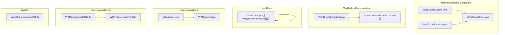
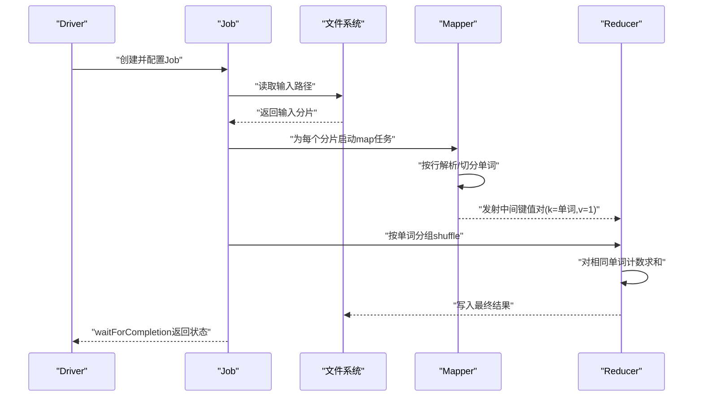
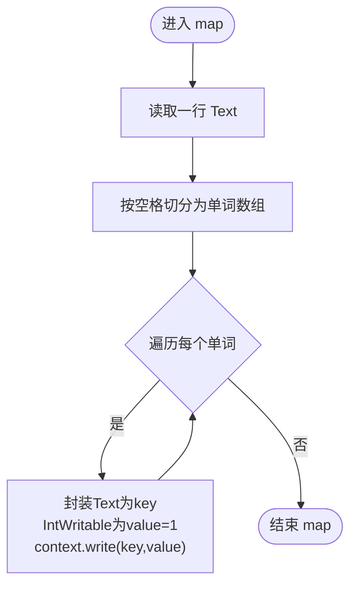
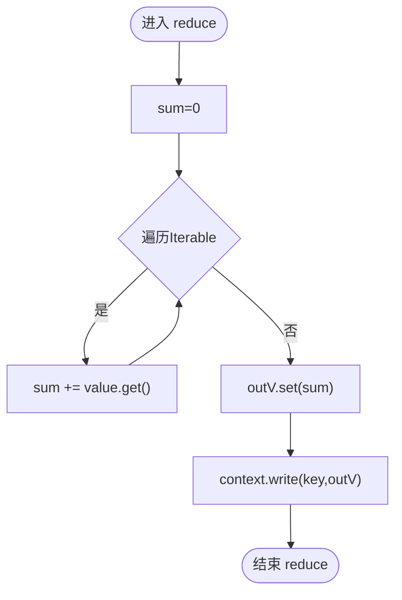
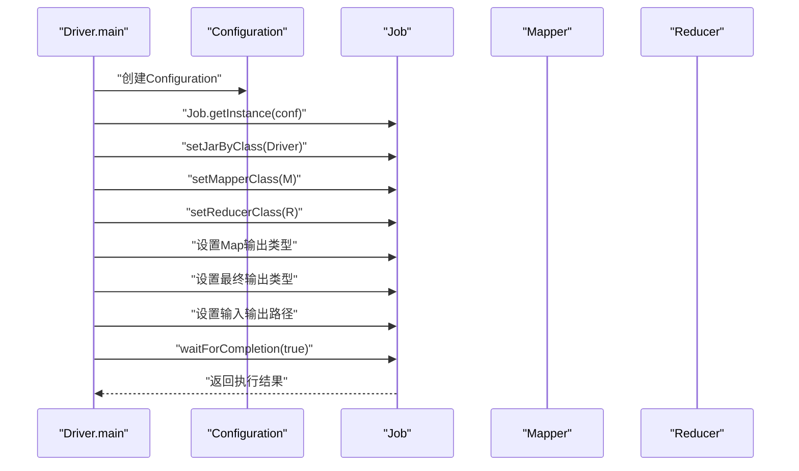
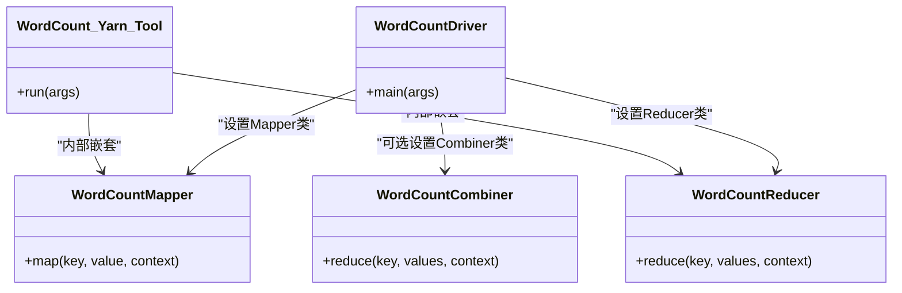

# 词频统计基础

<cite>
**本文引用的文件**
- [WordCountMapper.java](file://_02_hadoop/MapReduceDemo/src/main/java/com/atguigu/mapreduce/wordcount/WordCountMapper.java)
- [WordCountReducer.java](file://_02_hadoop/MapReduceDemo/src/main/java/com/atguigu/mapreduce/wordcount/WordCountReducer.java)
- [WordCountDriver.java](file://_02_hadoop/MapReduceDemo/src/main/java/com/atguigu/mapreduce/wordcount/WordCountDriver.java)
- [WordCount.java](file://_02_hadoop/YarnDemo/src/main/java/com/atguigu/yarn/WordCount.java)
- [WordCountCombiner.java](file://_02_hadoop/MapReduceDemo/src/main/java/com/atguigu/mapreduce/combiner/WordCountCombiner.java)
- [WordCountDriver.java（Combiner版）](file://_02_hadoop/MapReduceDemo/src/main/java/com/atguigu/mapreduce/combiner/WordCountDriver.java)
- [WCMapper.java（本地/服务器示例）](file://_02_hadoop/src/main/java/com/hanzhong/mrLocal/WCMapper.java)
- [WCReducer.java（本地/服务器示例）](file://_02_hadoop/src/main/java/com/hanzhong/mrLocal/WCReducer.java)
- [WCMapper.java（服务器版）](file://_02_hadoop/src/main/java/com/hanzhong/mrServer/WCMapper.java)
- [WCReducer.java（服务器版）](file://_02_hadoop/src/main/java/com/hanzhong/mrServer/WCReducer.java)
- [WordCount.java（Java基础版）](file://_01_javaEE/src/main/java/_01_基础语法/WordCount.java)
- [word.txt（测试输入）](file://_04_sparkTest/data/word.txt)
</cite>

## 目录
1. [简介](#简介)
2. [项目结构](#项目结构)
3. [核心组件](#核心组件)
4. [架构总览](#架构总览)
5. [详细组件分析](#详细组件分析)
6. [依赖关系分析](#依赖关系分析)
7. [性能考虑](#性能考虑)
8. [故障排查指南](#故障排查指南)
9. [结论](#结论)
10. [附录](#附录)

## 简介
本文件围绕词频统计的基础实现，系统梳理 MapReduce 的经典模式：Mapper 与 Reducer 的职责划分、输入数据格式、文本分割策略、单词过滤规则、计数算法、以及 Driver 的作业配置与执行流程。文档同时给出键值对类型选择（Text、IntWritable）的原因与最佳实践，并提供可直接定位到源码的路径指引，便于快速对照实现细节。

## 项目结构
本仓库中与词频统计相关的核心实现分布在多个模块中：
- MapReduceDemo 的 wordcount 与 combiner 子模块提供了标准的 Mapper/Reducer/Driver 实现与 Combiner 使用示例
- YarnDemo 展示了基于 Tool 接口的封装式驱动
- hanzhong 的 mrLocal 与 mrServer 示例展示了本地与服务器环境下的最小化实现
- javaEE 的 WordCount 提供了单机 Java 版本的思路参考

图示来源
- [WordCountMapper.java](file://_02_hadoop/MapReduceDemo/src/main/java/com/atguigu/mapreduce/wordcount/WordCountMapper.java#L1-L41)
- [WordCountReducer.java](file://_02_hadoop/MapReduceDemo/src/main/java/com/atguigu/mapreduce/wordcount/WordCountReducer.java#L1-L36)
- [WordCountDriver.java](file://_02_hadoop/MapReduceDemo/src/main/java/com/atguigu/mapreduce/wordcount/WordCountDriver.java#L1-L48)
- [WordCountCombiner.java](file://_02_hadoop/MapReduceDemo/src/main/java/com/atguigu/mapreduce/combiner/WordCountCombiner.java#L1-L25)
- [WordCountDriver.java（Combiner版）](file://_02_hadoop/MapReduceDemo/src/main/java/com/atguigu/mapreduce/combiner/WordCountDriver.java#L1-L51)
- [WordCount.java（YarnDemo）](file://_02_hadoop/YarnDemo/src/main/java/com/atguigu/yarn/WordCount.java#L1-L100)
- [WCMapper.java（本地/服务器示例）](file://_02_hadoop/src/main/java/com/hanzhong/mrLocal/WCMapper.java#L1-L33)
- [WCReducer.java（本地/服务器示例）](file://_02_hadoop/src/main/java/com/hanzhong/mrLocal/WCReducer.java#L1-L22)
- [WCMapper.java（服务器版）](file://_02_hadoop/src/main/java/com/hanzhong/mrServer/WCMapper.java#L1-L33)
- [WCReducer.java（服务器版）](file://_02_hadoop/src/main/java/com/hanzhong/mrServer/WCReducer.java#L1-L22)
- [WordCount.java（Java基础版）](file://_01_javaEE/src/main/java/_01_基础语法/WordCount.java#L1-L33)

章节来源
- [WordCountMapper.java](file://_02_hadoop/MapReduceDemo/src/main/java/com/atguigu/mapreduce/wordcount/WordCountMapper.java#L1-L41)
- [WordCountReducer.java](file://_02_hadoop/MapReduceDemo/src/main/java/com/atguigu/mapreduce/wordcount/WordCountReducer.java#L1-L36)
- [WordCountDriver.java](file://_02_hadoop/MapReduceDemo/src/main/java/com/atguigu/mapreduce/wordcount/WordCountDriver.java#L1-L48)

## 核心组件
- Mapper（映射器）
  - 职责：读取输入行，按空格切分为单词，为每个单词发射键值对（单词，1）
  - 输入键值对类型：LongWritable（偏移量）、Text（行内容）
  - 输出键值对类型：Text（单词）、IntWritable（计数1）
- Reducer（归约器）
  - 职责：对同一单词的所有中间计数进行累加，输出（单词，总频次）
  - 输入键值对类型：Text（单词）、Iterable<IntWritable>（该单词的计数序列）
  - 输出键值对类型：Text（单词）、IntWritable（总频次）
- Driver（作业驱动）
  - 职责：配置作业、设置 Mapper/Reducer 类型、设置输入输出路径、提交并等待完成
  - 关键配置：Job、Mapper/Reducer 类、Map 输出类型、最终输出类型、输入输出路径

章节来源
- [WordCountMapper.java](file://_02_hadoop/MapReduceDemo/src/main/java/com/atguigu/mapreduce/wordcount/WordCountMapper.java#L10-L41)
- [WordCountReducer.java](file://_02_hadoop/MapReduceDemo/src/main/java/com/atguigu/mapreduce/wordcount/WordCountReducer.java#L9-L36)
- [WordCountDriver.java](file://_02_hadoop/MapReduceDemo/src/main/java/com/atguigu/mapreduce/wordcount/WordCountDriver.java#L13-L48)

## 架构总览
下图展示了从 Driver 启动作业到 Mapper/Reducer 执行的端到端流程。

图示来源
- [WordCountDriver.java](file://_02_hadoop/MapReduceDemo/src/main/java/com/atguigu/mapreduce/wordcount/WordCountDriver.java#L15-L46)
- [WordCountMapper.java](file://_02_hadoop/MapReduceDemo/src/main/java/com/atguigu/mapreduce/wordcount/WordCountMapper.java#L23-L39)
- [WordCountReducer.java](file://_02_hadoop/MapReduceDemo/src/main/java/com/atguigu/mapreduce/wordcount/WordCountReducer.java#L19-L35)

## 详细组件分析

### Mapper 组件分析
- 输入数据格式
  - 默认 TextInputFormat 会将文件按行读取，产生键值对：LongWritable（行偏移量）/ Text（整行内容）
- 文本分割策略
  - 使用空格作为分隔符将行拆分为单词数组
- 单词过滤规则
  - 当前实现未做额外过滤；如需过滤空串或标点，可在 split 后增加条件判断
- 计数算法
  - 对每个有效单词发射（单词，1），由下游 Reducer 负责累加
- 性能要点
  - 复用 Text/IntWritable 实例，避免在循环内重复创建
  - 使用 split(" ") 仅处理简单空白分隔；复杂场景可采用正则或 Tokenizer

图示来源
- [WordCountMapper.java](file://_02_hadoop/MapReduceDemo/src/main/java/com/atguigu/mapreduce/wordcount/WordCountMapper.java#L23-L39)

章节来源
- [WordCountMapper.java](file://_02_hadoop/MapReduceDemo/src/main/java/com/atguigu/mapreduce/wordcount/WordCountMapper.java#L10-L41)
- [WCMapper.java（本地/服务器示例）](file://_02_hadoop/src/main/java/com/hanzhong/mrLocal/WCMapper.java#L11-L33)
- [WCMapper.java（服务器版）](file://_02_hadoop/src/main/java/com/hanzhong/mrServer/WCMapper.java#L11-L33)

### Reducer 组件分析
- 输入键值对类型
  - KEYIN: Text（单词）
  - VALUEIN: Iterable<IntWritable>（该单词在各 map 任务中的计数序列）
- 计数合并逻辑
  - 遍历 Iterable，将所有 IntWritable 的值相加得到总频次
  - 输出（单词，总频次）
- 性能要点
  - 复用 IntWritable 实例，减少对象分配
  - 若存在 Combiner，可先在本地聚合，降低网络传输

图示来源
- [WordCountReducer.java](file://_02_hadoop/MapReduceDemo/src/main/java/com/atguigu/mapreduce/wordcount/WordCountReducer.java#L19-L35)

章节来源
- [WordCountReducer.java](file://_02_hadoop/MapReduceDemo/src/main/java/com/atguigu/mapreduce/wordcount/WordCountReducer.java#L9-L36)
- [WCReducer.java（本地/服务器示例）](file://_02_hadoop/src/main/java/com/hanzhong/mrLocal/WCReducer.java#L9-L22)
- [WCReducer.java（服务器版）](file://_02_hadoop/src/main/java/com/hanzhong/mrServer/WCReducer.java#L9-L22)

### Driver 类与作业配置
- 作业配置
  - 获取 Configuration 与 Job 实例
  - 通过 setJarByClass 指定 jar 包来源
  - setMapperClass / setReducerClass 指定 Mapper/Reducer 类
  - setMapOutputKeyClass / setMapOutputValueClass 设置中间输出类型
  - setOutputKeyClass / setOutputValueClass 设置最终输出类型
  - FileInputFormat.setInputPaths / FileOutputFormat.setOutputPath 设置输入输出路径
- 执行流程
  - job.waitForCompletion(true) 提交并阻塞等待完成
  - 根据返回状态退出进程

图示来源
- [WordCountDriver.java](file://_02_hadoop/MapReduceDemo/src/main/java/com/atguigu/mapreduce/wordcount/WordCountDriver.java#L15-L46)

章节来源
- [WordCountDriver.java](file://_02_hadoop/MapReduceDemo/src/main/java/com/atguigu/mapreduce/wordcount/WordCountDriver.java#L13-L48)
- [WordCountDriver.java（Combiner版）](file://_02_hadoop/MapReduceDemo/src/main/java/com/atguigu/mapreduce/combiner/WordCountDriver.java#L13-L51)

### Combiner 使用（可选优化）
- Combiner 的作用
  - 在 Map 端对相同 key 的中间结果进行本地聚合，减少 shuffle 数据量
- 使用方式
  - 在 Driver 中设置 job.setCombinerClass(...)，可使用自定义 Combiner 类或复用 Reducer
- 注意事项
  - Combiner 必须满足交换律与结合律；词频统计天然满足
  - 若设置 numReduceTasks 为 0，则 Combiner 可替代 Reduce

章节来源
- [WordCountCombiner.java](file://_02_hadoop/MapReduceDemo/src/main/java/com/atguigu/mapreduce/combiner/WordCountCombiner.java#L1-L25)
- [WordCountDriver.java（Combiner版）](file://_02_hadoop/MapReduceDemo/src/main/java/com/atguigu/mapreduce/combiner/WordCountDriver.java#L36-L40)

### Yarn/Tool 封装示例
- 通过实现 Tool 接口，将 Driver 抽象为可注入 Configuration 的组件
- 优点：便于在不同运行环境中复用配置与参数传递
- 参数来源：args[0]/args[1] 分别对应输入路径与输出路径

章节来源
- [WordCount.java（YarnDemo）](file://_02_hadoop/YarnDemo/src/main/java/com/atguigu/yarn/WordCount.java#L24-L43)
- [WordCount.java（YarnDemo）](file://_02_hadoop/YarnDemo/src/main/java/com/atguigu/yarn/WordCount.java#L56-L77)
- [WordCount.java（YarnDemo）](file://_02_hadoop/YarnDemo/src/main/java/com/atguigu/yarn/WordCount.java#L82-L98)

### 单机 Java 版本对比
- 采用 HashMap 统计单词频次，适合小规模数据与学习理解
- 与 MapReduce 的差异：无分布式、无 Shuffle/Sort、无并发任务划分

章节来源
- [WordCount.java（Java基础版）](file://_01_javaEE/src/main/java/_01_基础语法/WordCount.java#L1-L33)

## 依赖关系分析
- 组件耦合
  - Mapper/Reducer 与 Driver 之间通过接口契约解耦（类名注入）
  - Combiner 与 Reducer 具有相同的签名，可互换使用
- 外部依赖
  - Hadoop MapReduce API（Mapper、Reducer、Job、FileInputFormat、FileOutputFormat）
  - Hadoop IO 类型（Text、IntWritable、LongWritable）

图示来源
- [WordCountMapper.java](file://_02_hadoop/MapReduceDemo/src/main/java/com/atguigu/mapreduce/wordcount/WordCountMapper.java#L19-L41)
- [WordCountReducer.java](file://_02_hadoop/MapReduceDemo/src/main/java/com/atguigu/mapreduce/wordcount/WordCountReducer.java#L15-L36)
- [WordCountDriver.java](file://_02_hadoop/MapReduceDemo/src/main/java/com/atguigu/mapreduce/wordcount/WordCountDriver.java#L27-L41)
- [WordCountCombiner.java](file://_02_hadoop/MapReduceDemo/src/main/java/com/atguigu/mapreduce/combiner/WordCountCombiner.java#L9-L25)
- [WordCount.java（YarnDemo）](file://_02_hadoop/YarnDemo/src/main/java/com/atguigu/yarn/WordCount.java#L56-L98)

## 性能考虑
- 对象复用
  - 在 Mapper/Reducer 中复用 Text/IntWritable 实例，避免频繁 GC
- 分割策略
  - 使用 split(" ") 仅适用于简单空白分隔；复杂文本建议使用正则或 Tokenizer
- Combiner
  - 在大规模数据中启用 Combiner 可显著减少网络传输
- 并发与分区
  - 合理设置 reduce 任务数量，确保负载均衡
- 输入格式
  - 使用 SequenceFile/Snappy 等高效格式可提升 I/O 性能（视业务而定）

## 故障排查指南
- 无法找到 Mapper/Reducer 类
  - 检查 Driver 是否正确设置 setMapperClass/setReducerClass
  - 确认类名与包路径一致
- 输出目录已存在
  - 删除已有输出目录后再运行（Hadoop 不允许覆盖）
- 输入路径错误
  - 确认 FileInputFormat.setInputPaths 指向正确的输入路径
- 类型不匹配
  - 确保 setMapOutputKeyClass/setMapOutputValueClass 与 Mapper 输出一致
  - 确保 setOutputKeyClass/setOutputValueClass 与 Reducer 输出一致
- Combiner 导致结果异常
  - 确认 Combiner 逻辑满足交换律与结合律；必要时关闭 Combiner 排查

章节来源
- [WordCountDriver.java](file://_02_hadoop/MapReduceDemo/src/main/java/com/atguigu/mapreduce/wordcount/WordCountDriver.java#L27-L41)
- [WordCountDriver.java（Combiner版）](file://_02_hadoop/MapReduceDemo/src/main/java/com/atguigu/mapreduce/combiner/WordCountDriver.java#L36-L40)

## 结论
词频统计是 MapReduce 的入门范式：Mapper 负责切分与发射，Reducer 负责聚合。通过 Driver 统一配置作业参数并提交执行，即可完成分布式词频统计。实践中应重视类型一致性、对象复用、Combiner 使用与输入输出路径管理，以获得稳定且高性能的结果。

## 附录

### 键值对类型选择与最佳实践
- Text
  - 用于表示字符串键（如单词），具备高效的序列化与比较能力
- IntWritable
  - 用于表示整型值（如计数），相比 Integer 更省内存且序列化更快
- 最佳实践
  - Mapper 输出键值对：Text（单词）、IntWritable（1）
  - Map 输出类型：与 Mapper 输出一致
  - 最终输出类型：Text（单词）、IntWritable（总频次）
  - 若启用 Combiner，其输入输出类型与 Reducer 保持一致

章节来源
- [WordCountMapper.java](file://_02_hadoop/MapReduceDemo/src/main/java/com/atguigu/mapreduce/wordcount/WordCountMapper.java#L19-L41)
- [WordCountReducer.java](file://_02_hadoop/MapReduceDemo/src/main/java/com/atguigu/mapreduce/wordcount/WordCountReducer.java#L15-L36)
- [WordCountDriver.java](file://_02_hadoop/MapReduceDemo/src/main/java/com/atguigu/mapreduce/wordcount/WordCountDriver.java#L30-L37)

### 运行步骤（基于现有实现）
- 准备输入文件
  - 使用仓库中的测试输入文件作为样例
  - 参考路径：[word.txt（测试输入）](file://_04_sparkTest/data/word.txt#L1-L2)
- 本地运行（以 MapReduceDemo 为例）
  - 在 Driver 中设置输入路径与输出路径
  - 运行 Driver.main 提交作业
  - 查看输出目录中的结果文件
- Yarn 运行（Tool 封装）
  - 通过 Tool 接口运行，参数传入输入路径与输出路径
- Combiner 运行（可选）
  - 在 Driver 中启用 Combiner，观察网络传输与性能变化

章节来源
- [WordCountDriver.java](file://_02_hadoop/MapReduceDemo/src/main/java/com/atguigu/mapreduce/wordcount/WordCountDriver.java#L38-L41)
- [WordCount.java（YarnDemo）](file://_02_hadoop/YarnDemo/src/main/java/com/atguigu/yarn/WordCount.java#L39-L41)
- [WordCountDriver.java（Combiner版）](file://_02_hadoop/MapReduceDemo/src/main/java/com/atguigu/mapreduce/combiner/WordCountDriver.java#L36-L40)