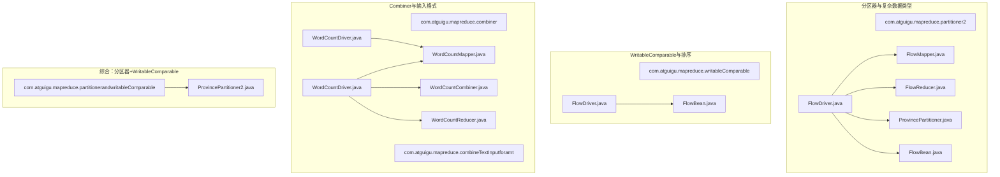
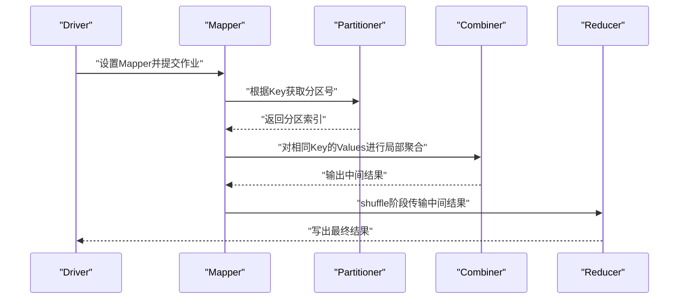
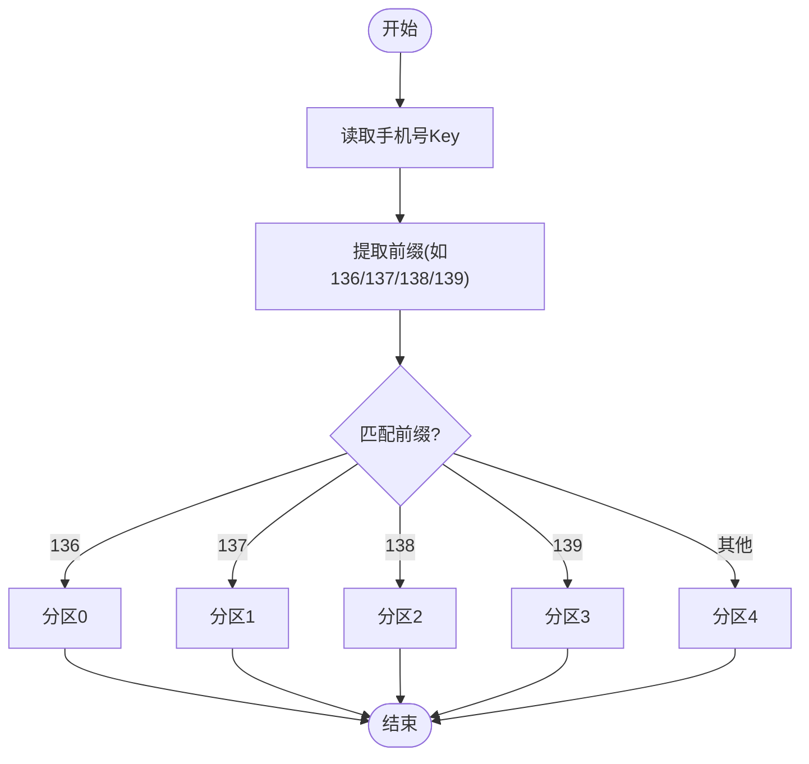
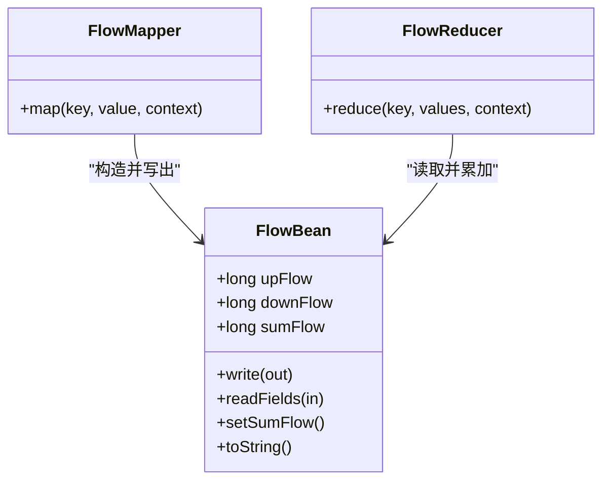
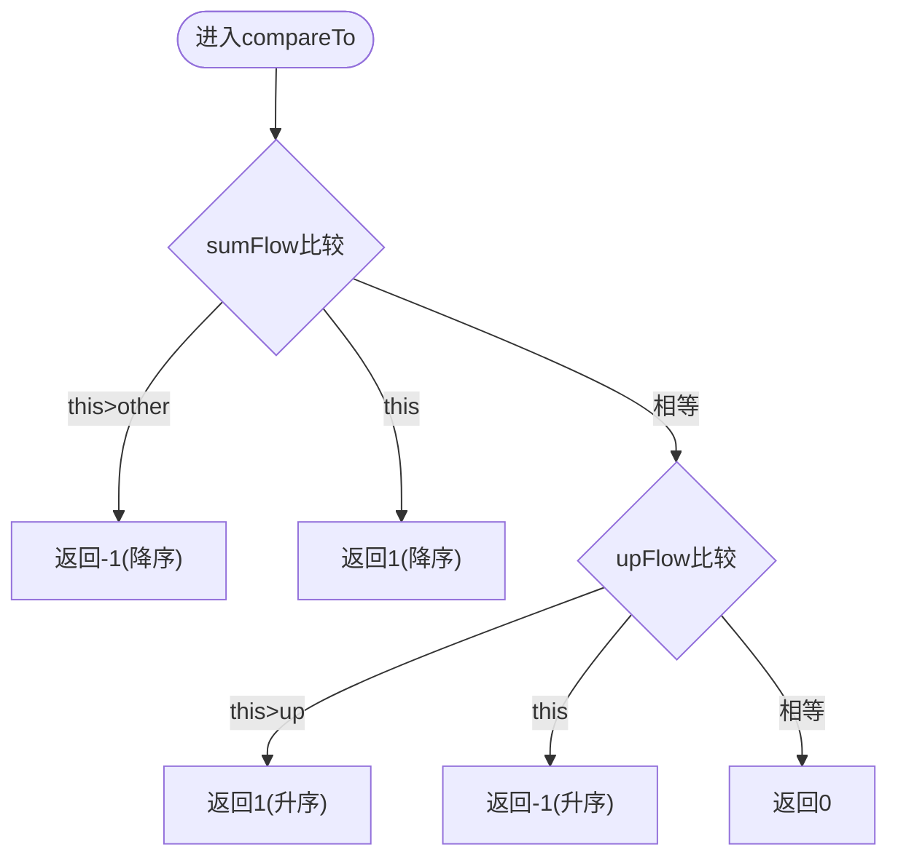
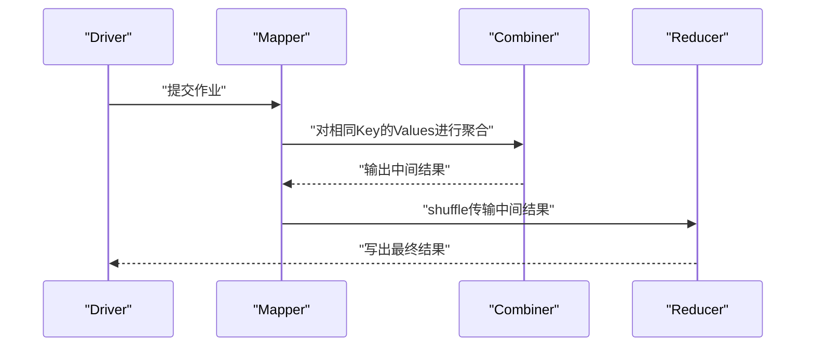
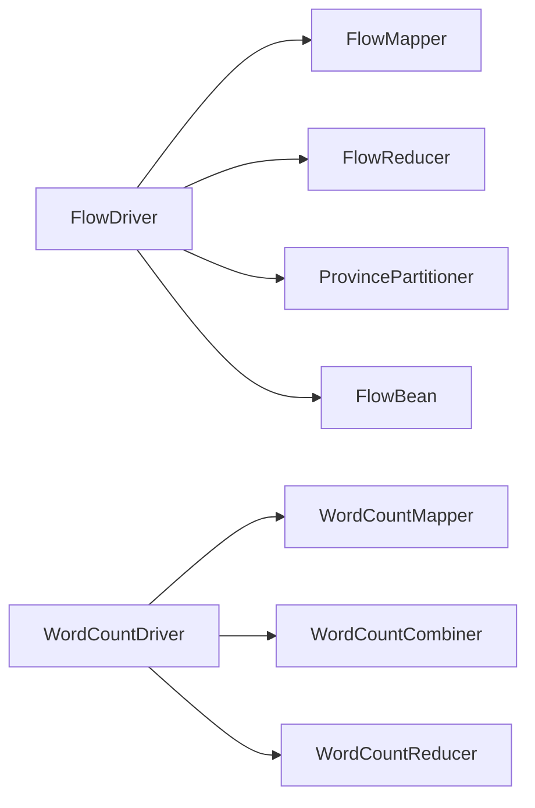

# 高级MapReduce特性

<cite>
**本文引用的文件**
- [FlowDriver.java](file://_02_hadoop/MapReduceDemo/src/main/java/com/atguigu/mapreduce/partitioner2/FlowDriver.java)
- [ProvincePartitioner.java](file://_02_hadoop/MapReduceDemo/src/main/java/com/atguigu/mapreduce/partitioner2/ProvincePartitioner.java)
- [FlowMapper.java](file://_02_hadoop/MapReduceDemo/src/main/java/com/atguigu/mapreduce/partitioner2/FlowMapper.java)
- [FlowReducer.java](file://_02_hadoop/MapReduceDemo/src/main/java/com/atguigu/mapreduce/partitioner2/FlowReducer.java)
- [FlowBean.java](file://_02_hadoop/MapReduceDemo/src/main/java/com/atguigu/mapreduce/partitioner2/FlowBean.java)
- [FlowDriver.java](file://_02_hadoop/MapReduceDemo/src/main/java/com/atguigu/mapreduce/writableComparable/FlowDriver.java)
- [FlowBean.java](file://_02_hadoop/MapReduceDemo/src/main/java/com/atguigu/mapreduce/writableComparable/FlowBean.java)
- [WordCountDriver.java](file://_02_hadoop/MapReduceDemo/src/main/java/com/atguigu/mapreduce/combiner/WordCountDriver.java)
- [WordCountMapper.java](file://_02_hadoop/MapReduceDemo/src/main/java/com/atguigu/mapreduce/combiner/WordCountMapper.java)
- [WordCountCombiner.java](file://_02_hadoop/MapReduceDemo/src/main/java/com/atguigu/mapreduce/combiner/WordCountCombiner.java)
- [WordCountReducer.java](file://_02_hadoop/MapReduceDemo/src/main/java/com/atguigu/mapreduce/combiner/WordCountReducer.java)
- [WordCountDriver.java](file://_02_hadoop/MapReduceDemo/src/main/java/com/atguigu/mapreduce/combineTextInputforamt/WordCountDriver.java)
- [ProvincePartitioner2.java](file://_02_hadoop/MapReduceDemo/src/main/java/com/atguigu/mapreduce/partitionerandwritableComparable/ProvincePartitioner2.java)
</cite>

## 目录
1. [引言](#引言)
2. [项目结构](#项目结构)
3. [核心组件](#核心组件)
4. [架构总览](#架构总览)
5. [详细组件分析](#详细组件分析)
6. [依赖关系分析](#依赖关系分析)
7. [性能考量与调优](#性能考量与调优)
8. [故障排查指南](#故障排查指南)
9. [结论](#结论)
10. [附录](#附录)

## 引言
本技术文档聚焦于MapReduce的高级特性，围绕“自定义分区器”“自定义Writable数据类型与序列化”“WritableComparable排序”“Combiner使用场景与效果”“数据本地性优化”以及“性能调优与资源分配最佳实践”展开。文档以仓库中的多个示例为依据，系统梳理实现思路、关键流程与注意事项，并通过图示帮助读者建立从概念到落地的完整认知。

## 项目结构
本仓库中与MapReduce高级特性直接相关的核心示例位于以下模块与包中：
- 分区器与复杂数据类型：com.atguigu.mapreduce.partitioner2
- 自定义WritableComparable与排序：com.atguigu.mapreduce.writableComparable
- Combiner与CombineTextInputFormat：com.atguigu.mapreduce.combiner 与 com.atguigu.mapreduce.combineTextInputforamt
- 综合分区器与WritableComparable：com.atguigu.mapreduce.partitionerandwritableComparable

图表来源
- [FlowDriver.java](file://_02_hadoop/MapReduceDemo/src/main/java/com/atguigu/mapreduce/partitioner2/FlowDriver.java#L1-L47)
- [FlowMapper.java](file://_02_hadoop/MapReduceDemo/src/main/java/com/atguigu/mapreduce/partitioner2/FlowMapper.java#L1-L43)
- [FlowReducer.java](file://_02_hadoop/MapReduceDemo/src/main/java/com/atguigu/mapreduce/partitioner2/FlowReducer.java#L1-L32)
- [ProvincePartitioner.java](file://_02_hadoop/MapReduceDemo/src/main/java/com/atguigu/mapreduce/partitioner2/ProvincePartitioner.java#L1-L32)
- [FlowBean.java](file://_02_hadoop/MapReduceDemo/src/main/java/com/atguigu/mapreduce/partitioner2/FlowBean.java#L1-L70)
- [FlowDriver.java](file://_02_hadoop/MapReduceDemo/src/main/java/com/atguigu/mapreduce/writableComparable/FlowDriver.java#L1-L30)
- [FlowBean.java](file://_02_hadoop/MapReduceDemo/src/main/java/com/atguigu/mapreduce/writableComparable/FlowBean.java#L1-L94)
- [WordCountDriver.java](file://_02_hadoop/MapReduceDemo/src/main/java/com/atguigu/mapreduce/combiner/WordCountDriver.java#L1-L41)
- [WordCountMapper.java](file://_02_hadoop/MapReduceDemo/src/main/java/com/atguigu/mapreduce/combiner/WordCountMapper.java#L1-L41)
- [WordCountCombiner.java](file://_02_hadoop/MapReduceDemo/src/main/java/com/atguigu/mapreduce/combiner/WordCountCombiner.java#L1-L24)
- [WordCountReducer.java](file://_02_hadoop/MapReduceDemo/src/main/java/com/atguigu/mapreduce/combiner/WordCountReducer.java#L1-L33)
- [WordCountDriver.java](file://_02_hadoop/MapReduceDemo/src/main/java/com/atguigu/mapreduce/combineTextInputforamt/WordCountDriver.java#L1-L54)
- [ProvincePartitioner2.java](file://_02_hadoop/MapReduceDemo/src/main/java/com/atguigu/mapreduce/partitionerandwritableComparable/ProvincePartitioner2.java#L1-L31)

章节来源
- [FlowDriver.java](file://_02_hadoop/MapReduceDemo/src/main/java/com/atguigu/mapreduce/partitioner2/FlowDriver.java#L1-L47)
- [WordCountDriver.java](file://_02_hadoop/MapReduceDemo/src/main/java/com/atguigu/mapreduce/combiner/WordCountDriver.java#L1-L41)
- [WordCountDriver.java](file://_02_hadoop/MapReduceDemo/src/main/java/com/atguigu/mapreduce/combineTextInputforamt/WordCountDriver.java#L1-L54)

## 核心组件
- 自定义分区器：根据手机号前缀将数据路由至不同Reduce任务，实现按区域/运营商的负载均衡与局部性优化。
- 复杂Writable数据类型：FlowBean承载上行/下行/总流量，提供完整的序列化与反序列化实现。
- WritableComparable排序：在FlowBean中实现compareTo，支持按总流量降序、上行流量升序的复合排序。
- Combiner：在Map端进行局部聚合，减少网络传输与Reducer压力；CombineTextInputFormat用于合并小文件切片。
- 数据本地性优化：通过合理的分区策略与输入格式配置，提升数据本地读取概率，降低网络拷贝。

章节来源
- [ProvincePartitioner.java](file://_02_hadoop/MapReduceDemo/src/main/java/com/atguigu/mapreduce/partitioner2/ProvincePartitioner.java#L1-L32)
- [FlowBean.java](file://_02_hadoop/MapReduceDemo/src/main/java/com/atguigu/mapreduce/partitioner2/FlowBean.java#L1-L70)
- [FlowBean.java](file://_02_hadoop/MapReduceDemo/src/main/java/com/atguigu/mapreduce/writableComparable/FlowBean.java#L1-L94)
- [WordCountCombiner.java](file://_02_hadoop/MapReduceDemo/src/main/java/com/atguigu/mapreduce/combiner/WordCountCombiner.java#L1-L24)
- [WordCountDriver.java](file://_02_hadoop/MapReduceDemo/src/main/java/com/atguigu/mapreduce/combineTextInputforamt/WordCountDriver.java#L1-L54)

## 架构总览
下图展示了“分区器+复杂数据类型+Combiner”的典型执行链路：Driver配置Job，Mapper产出键值对，分区器决定目标Reduce，Combiner在Map端做局部聚合，Reducer完成最终汇总。

图表来源
- [FlowDriver.java](file://_02_hadoop/MapReduceDemo/src/main/java/com/atguigu/mapreduce/partitioner2/FlowDriver.java#L1-L47)
- [FlowMapper.java](file://_02_hadoop/MapReduceDemo/src/main/java/com/atguigu/mapreduce/partitioner2/FlowMapper.java#L1-L43)
- [ProvincePartitioner.java](file://_02_hadoop/MapReduceDemo/src/main/java/com/atguigu/mapreduce/partitioner2/ProvincePartitioner.java#L1-L32)
- [WordCountCombiner.java](file://_02_hadoop/MapReduceDemo/src/main/java/com/atguigu/mapreduce/combiner/WordCountCombiner.java#L1-L24)
- [FlowReducer.java](file://_02_hadoop/MapReduceDemo/src/main/java/com/atguigu/mapreduce/partitioner2/FlowReducer.java#L1-L32)

## 详细组件分析

### 自定义分区器：按手机号前缀分区
- 设计要点
  - 输入Key为手机号Text，提取前缀作为分区依据。
  - 不同前缀映射到不同分区，确保同一区域/运营商的数据落到同一Reduce。
  - 通过设置numReduceTasks与setPartitionerClass，控制分区数量与策略。
- 负载均衡考虑
  - 若某些前缀数据量远超其他前缀，可引入二次哈希或动态调整分区策略，避免热点。
  - 可结合业务特征（如高峰时段流量分布）进行分桶与调度优化。
- 代码定位
  - 分区器实现与驱动配置分别见：[ProvincePartitioner.java](file://_02_hadoop/MapReduceDemo/src/main/java/com/atguigu/mapreduce/partitioner2/ProvincePartitioner.java#L1-L32)、[FlowDriver.java](file://_02_hadoop/MapReduceDemo/src/main/java/com/atguigu/mapreduce/partitioner2/FlowDriver.java#L1-L47)

图表来源
- [ProvincePartitioner.java](file://_02_hadoop/MapReduceDemo/src/main/java/com/atguigu/mapreduce/partitioner2/ProvincePartitioner.java#L1-L32)

章节来源
- [ProvincePartitioner.java](file://_02_hadoop/MapReduceDemo/src/main/java/com/atguigu/mapreduce/partitioner2/ProvincePartitioner.java#L1-L32)
- [FlowDriver.java](file://_02_hadoop/MapReduceDemo/src/main/java/com/atguigu/mapreduce/partitioner2/FlowDriver.java#L1-L47)

### 复杂Writable数据类型：FlowBean的序列化与字段管理
- 实现要点
  - 实现Writable接口，覆盖write/readFields，保证二进制序列化一致性。
  - 提供空参构造、toString与业务字段访问器，便于调试与日志输出。
  - 在Mapper中填充up/down/sum字段，在Reducer中累加并重新计算sum。
- 复杂度与性能
  - 序列化/反序列化为O(1)，整体开销低；适合大流量场景。
  - 建议保持字段顺序与类型一致，避免跨版本兼容问题。
- 代码定位
  - 数据模型与Mapper/Reducer见：[FlowBean.java](file://_02_hadoop/MapReduceDemo/src/main/java/com/atguigu/mapreduce/partitioner2/FlowBean.java#L1-L70)、[FlowMapper.java](file://_02_hadoop/MapReduceDemo/src/main/java/com/atguigu/mapreduce/partitioner2/FlowMapper.java#L1-L43)、[FlowReducer.java](file://_02_hadoop/MapReduceDemo/src/main/java/com/atguigu/mapreduce/partitioner2/FlowReducer.java#L1-L32)

图表来源
- [FlowBean.java](file://_02_hadoop/MapReduceDemo/src/main/java/com/atguigu/mapreduce/partitioner2/FlowBean.java#L1-L70)
- [FlowMapper.java](file://_02_hadoop/MapReduceDemo/src/main/java/com/atguigu/mapreduce/partitioner2/FlowMapper.java#L1-L43)
- [FlowReducer.java](file://_02_hadoop/MapReduceDemo/src/main/java/com/atguigu/mapreduce/partitioner2/FlowReducer.java#L1-L32)

章节来源
- [FlowBean.java](file://_02_hadoop/MapReduceDemo/src/main/java/com/atguigu/mapreduce/partitioner2/FlowBean.java#L1-L70)
- [FlowMapper.java](file://_02_hadoop/MapReduceDemo/src/main/java/com/atguigu/mapreduce/partitioner2/FlowMapper.java#L1-L43)
- [FlowReducer.java](file://_02_hadoop/MapReduceDemo/src/main/java/com/atguigu/mapreduce/partitioner2/FlowReducer.java#L1-L32)

### WritableComparable排序：复合排序规则
- 排序逻辑
  - 优先按总流量降序；若总流量相等，则按上行流量升序。
  - 该规则可应用于需要“总量优先、细粒度次之”的排序场景。
- 使用场景
  - TopN统计、报表排序、可视化排序等。
- 代码定位
  - 排序实现与驱动见：[FlowBean.java](file://_02_hadoop/MapReduceDemo/src/main/java/com/atguigu/mapreduce/writableComparable/FlowBean.java#L1-L94)、[FlowDriver.java](file://_02_hadoop/MapReduceDemo/src/main/java/com/atguigu/mapreduce/writableComparable/FlowDriver.java#L1-L30)

图表来源
- [FlowBean.java](file://_02_hadoop/MapReduceDemo/src/main/java/com/atguigu/mapreduce/writableComparable/FlowBean.java#L73-L94)

章节来源
- [FlowBean.java](file://_02_hadoop/MapReduceDemo/src/main/java/com/atguigu/mapreduce/writableComparable/FlowBean.java#L1-L94)
- [FlowDriver.java](file://_02_hadoop/MapReduceDemo/src/main/java/com/atguigu/mapreduce/writableComparable/FlowDriver.java#L1-L30)

### 综合示例：分区器与WritableComparable协同
- 场景说明
  - 当Mapper输出键值为<FlowBean, Text>时，可通过自定义分区器将相同手机号归属的数据路由到同一分区，从而提升后续聚合效率。
- 代码定位
  - 分区器实现见：[ProvincePartitioner2.java](file://_02_hadoop/MapReduceDemo/src/main/java/com/atguigu/mapreduce/partitionerandwritableComparable/ProvincePartitioner2.java#L1-L31)

章节来源
- [ProvincePartitioner2.java](file://_02_hadoop/MapReduceDemo/src/main/java/com/atguigu/mapreduce/partitionerandwritableComparable/ProvincePartitioner2.java#L1-L31)

### Combiner使用：Map端局部聚合
- 使用场景
  - 当Mapper输出的Key存在大量重复时，可在Map端先聚合，显著减少shuffle数据量与Reducer压力。
- 示例要点
  - WordCountCombiner与WordCountReducer逻辑一致，可直接复用Reducer作为Combiner，但需注意副作用与幂等性。
  - CombineTextInputFormat用于合并小文件切片，降低Split数量，提高Map任务利用率。
- 代码定位
  - Combiner与Driver见：[WordCountCombiner.java](file://_02_hadoop/MapReduceDemo/src/main/java/com/atguigu/mapreduce/combiner/WordCountCombiner.java#L1-L24)、[WordCountDriver.java](file://_02_hadoop/MapReduceDemo/src/main/java/com/atguigu/mapreduce/combiner/WordCountDriver.java#L1-L41)
  - CombineTextInputFormat见：[WordCountDriver.java](file://_02_hadoop/MapReduceDemo/src/main/java/com/atguigu/mapreduce/combineTextInputforamt/WordCountDriver.java#L1-L54)

图表来源
- [WordCountDriver.java](file://_02_hadoop/MapReduceDemo/src/main/java/com/atguigu/mapreduce/combiner/WordCountDriver.java#L1-L41)
- [WordCountCombiner.java](file://_02_hadoop/MapReduceDemo/src/main/java/com/atguigu/mapreduce/combiner/WordCountCombiner.java#L1-L24)
- [WordCountReducer.java](file://_02_hadoop/MapReduceDemo/src/main/java/com/atguigu/mapreduce/combiner/WordCountReducer.java#L1-L33)

章节来源
- [WordCountDriver.java](file://_02_hadoop/MapReduceDemo/src/main/java/com/atguigu/mapreduce/combiner/WordCountDriver.java#L1-L41)
- [WordCountCombiner.java](file://_02_hadoop/MapReduceDemo/src/main/java/com/atguigu/mapreduce/combiner/WordCountCombiner.java#L1-L24)
- [WordCountReducer.java](file://_02_hadoop/MapReduceDemo/src/main/java/com/atguigu/mapreduce/combiner/WordCountReducer.java#L1-L33)
- [WordCountDriver.java](file://_02_hadoop/MapReduceDemo/src/main/java/com/atguigu/mapreduce/combineTextInputforamt/WordCountDriver.java#L1-L54)

## 依赖关系分析
- 组件耦合
  - Driver负责装配Mapper/Reducer/Partitioner/Combiner与输出类型，是控制流中枢。
  - Mapper/Reducer依赖FlowBean进行数据建模；分区器依赖手机号前缀进行路由。
  - Combiner与Reducer在语义上可复用，但需确保无副作用且满足交换律/结合律。
- 外部依赖
  - Hadoop MapReduce运行时、输入输出格式、序列化框架等。

图表来源
- [FlowDriver.java](file://_02_hadoop/MapReduceDemo/src/main/java/com/atguigu/mapreduce/partitioner2/FlowDriver.java#L1-L47)
- [FlowMapper.java](file://_02_hadoop/MapReduceDemo/src/main/java/com/atguigu/mapreduce/partitioner2/FlowMapper.java#L1-L43)
- [FlowReducer.java](file://_02_hadoop/MapReduceDemo/src/main/java/com/atguigu/mapreduce/partitioner2/FlowReducer.java#L1-L32)
- [ProvincePartitioner.java](file://_02_hadoop/MapReduceDemo/src/main/java/com/atguigu/mapreduce/partitioner2/ProvincePartitioner.java#L1-L32)
- [FlowBean.java](file://_02_hadoop/MapReduceDemo/src/main/java/com/atguigu/mapreduce/partitioner2/FlowBean.java#L1-L70)
- [WordCountDriver.java](file://_02_hadoop/MapReduceDemo/src/main/java/com/atguigu/mapreduce/combiner/WordCountDriver.java#L1-L41)
- [WordCountMapper.java](file://_02_hadoop/MapReduceDemo/src/main/java/com/atguigu/mapreduce/combiner/WordCountMapper.java#L1-L41)
- [WordCountCombiner.java](file://_02_hadoop/MapReduceDemo/src/main/java/com/atguigu/mapreduce/combiner/WordCountCombiner.java#L1-L24)
- [WordCountReducer.java](file://_02_hadoop/MapReduceDemo/src/main/java/com/atguigu/mapreduce/combiner/WordCountReducer.java#L1-L33)

章节来源
- [FlowDriver.java](file://_02_hadoop/MapReduceDemo/src/main/java/com/atguigu/mapreduce/partitioner2/FlowDriver.java#L1-L47)
- [WordCountDriver.java](file://_02_hadoop/MapReduceDemo/src/main/java/com/atguigu/mapreduce/combiner/WordCountDriver.java#L1-L41)

## 性能考量与调优
- 分区策略与哈希算法
  - 前缀分区简单直观，适合强地域/运营商特征；若需更均匀分布，可引入二次哈希或一致性哈希。
  - 注意避免热点分区，必要时拆分热点Key或增加分区数。
- Combiner与Shuffle优化
  - 在Mapper端聚合可显著减少网络带宽；但需确保聚合函数满足交换律/结合律。
  - CombineTextInputFormat合并小文件切片，降低Split数量，提升Map利用率。
- 数据本地性
  - 合理的分区与输入格式配置可提升本地读取概率，减少跨节点传输。
- 内存与资源分配
  - 控制Map/Reduce内存上限，合理设置堆外存储与压缩编码，避免GC抖动。
  - 通过调节Map/Reduce并行度与容器资源，平衡吞吐与延迟。
- 复杂数据类型序列化
  - 保持字段顺序与类型稳定，避免跨版本兼容问题；尽量减少序列化体积。

[本节为通用指导，无需列出具体文件来源]

## 故障排查指南
- 常见问题
  - 分区数与Reduce任务不一致导致数据丢失或溢出。
  - Writable序列化字段顺序/类型不一致引发反序列化异常。
  - Combiner与Reducer逻辑不一致导致最终结果偏差。
  - CombineTextInputFormat参数设置不当导致切片过大或过小。
- 排查步骤
  - 检查Driver中setPartitionerClass与setNumReduceTasks是否匹配。
  - 对比Mapper/Reducer/Combiner的输出Key/Value类型与序列化实现。
  - 使用小数据集验证分区与排序逻辑，逐步扩大规模。
  - 关注日志中的Split数量、分区分布与网络传输量指标。

章节来源
- [FlowDriver.java](file://_02_hadoop/MapReduceDemo/src/main/java/com/atguigu/mapreduce/partitioner2/FlowDriver.java#L1-L47)
- [WordCountDriver.java](file://_02_hadoop/MapReduceDemo/src/main/java/com/atguigu/mapreduce/combiner/WordCountDriver.java#L1-L41)
- [WordCountDriver.java](file://_02_hadoop/MapReduceDemo/src/main/java/com/atguigu/mapreduce/combineTextInputforamt/WordCountDriver.java#L1-L54)

## 结论
通过以上示例与分析可见，MapReduce的高级特性能够有效提升数据处理的可控性与性能。自定义分区器与复杂数据类型配合使用，可实现更强的业务适配能力；WritableComparable为排序与TopN提供了灵活手段；Combiner与输入格式优化则直接降低了网络与存储开销。在实践中应结合业务特征与数据分布，制定合理的分区策略、序列化规范与资源分配方案，持续监控与迭代。

[本节为总结性内容，无需列出具体文件来源]

## 附录
- 关键实现路径参考
  - 分区器与驱动：[ProvincePartitioner.java](file://_02_hadoop/MapReduceDemo/src/main/java/com/atguigu/mapreduce/partitioner2/ProvincePartitioner.java#L1-L32)、[FlowDriver.java](file://_02_hadoop/MapReduceDemo/src/main/java/com/atguigu/mapreduce/partitioner2/FlowDriver.java#L1-L47)
  - 复杂数据类型与处理：[FlowBean.java](file://_02_hadoop/MapReduceDemo/src/main/java/com/atguigu/mapreduce/partitioner2/FlowBean.java#L1-L70)、[FlowMapper.java](file://_02_hadoop/MapReduceDemo/src/main/java/com/atguigu/mapreduce/partitioner2/FlowMapper.java#L1-L43)、[FlowReducer.java](file://_02_hadoop/MapReduceDemo/src/main/java/com/atguigu/mapreduce/partitioner2/FlowReducer.java#L1-L32)
  - 排序与驱动：[FlowBean.java](file://_02_hadoop/MapReduceDemo/src/main/java/com/atguigu/mapreduce/writableComparable/FlowBean.java#L1-L94)、[FlowDriver.java](file://_02_hadoop/MapReduceDemo/src/main/java/com/atguigu/mapreduce/writableComparable/FlowDriver.java#L1-L30)
  - Combiner与输入格式：[WordCountCombiner.java](file://_02_hadoop/MapReduceDemo/src/main/java/com/atguigu/mapreduce/combiner/WordCountCombiner.java#L1-L24)、[WordCountDriver.java](file://_02_hadoop/MapReduceDemo/src/main/java/com/atguigu/mapreduce/combiner/WordCountDriver.java#L1-L41)、[WordCountDriver.java](file://_02_hadoop/MapReduceDemo/src/main/java/com/atguigu/mapreduce/combineTextInputforamt/WordCountDriver.java#L1-L54)
  - 综合分区器与WritableComparable：[ProvincePartitioner2.java](file://_02_hadoop/MapReduceDemo/src/main/java/com/atguigu/mapreduce/partitionerandwritableComparable/ProvincePartitioner2.java#L1-L31)

[本节为补充参考，无需列出具体文件来源]