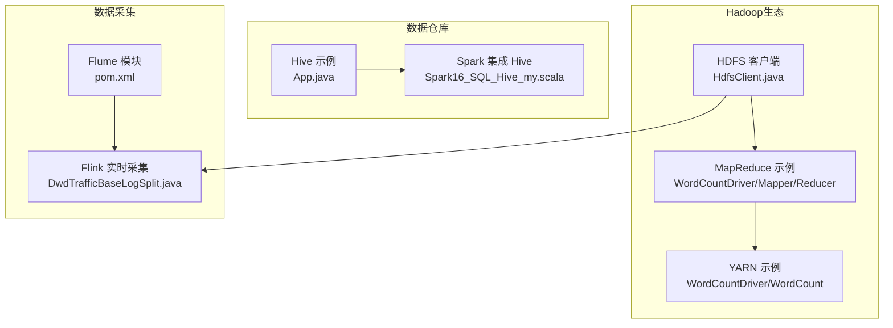
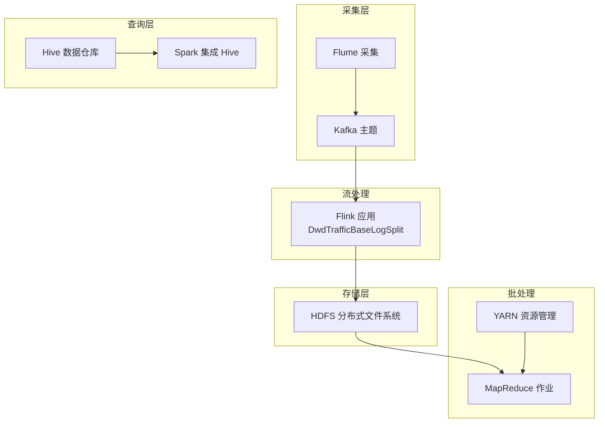
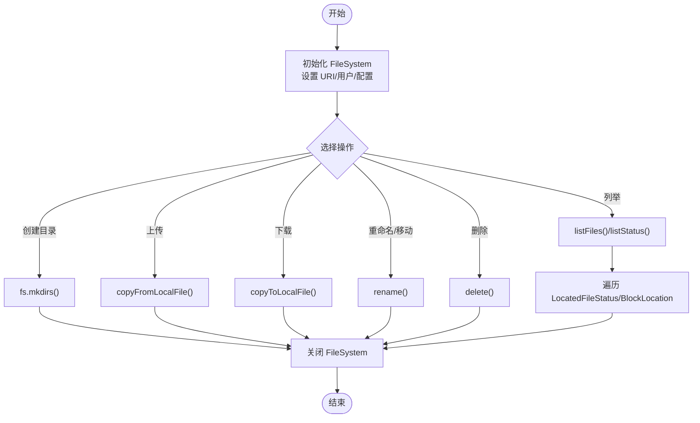
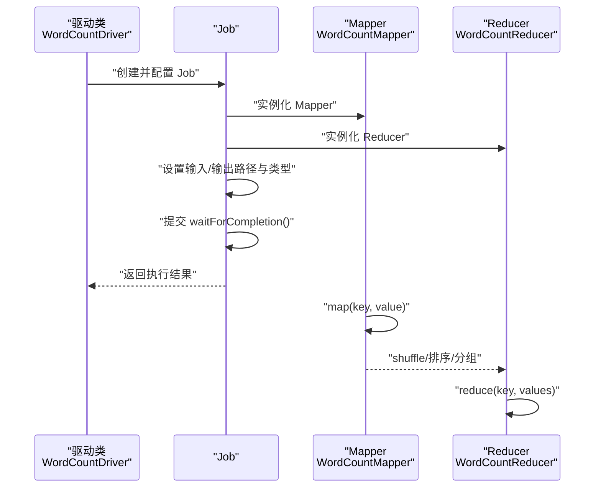
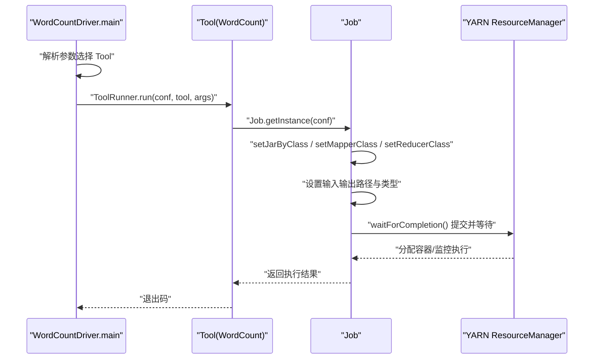
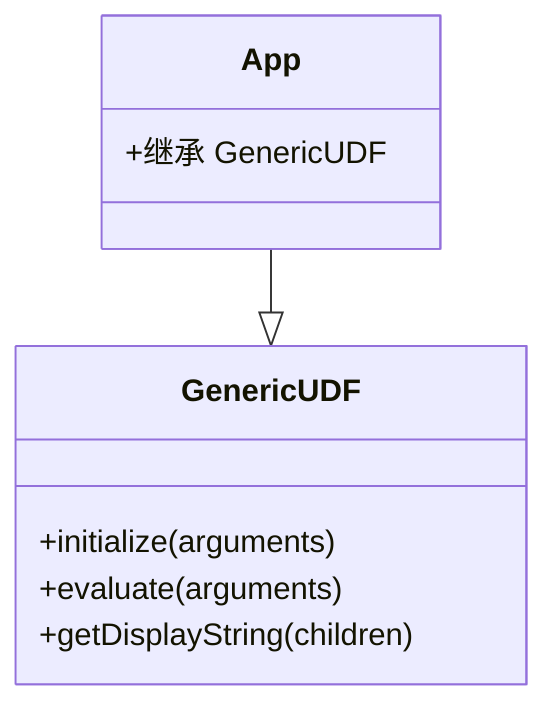
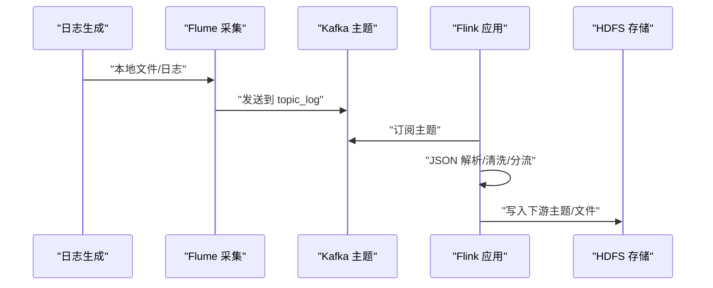
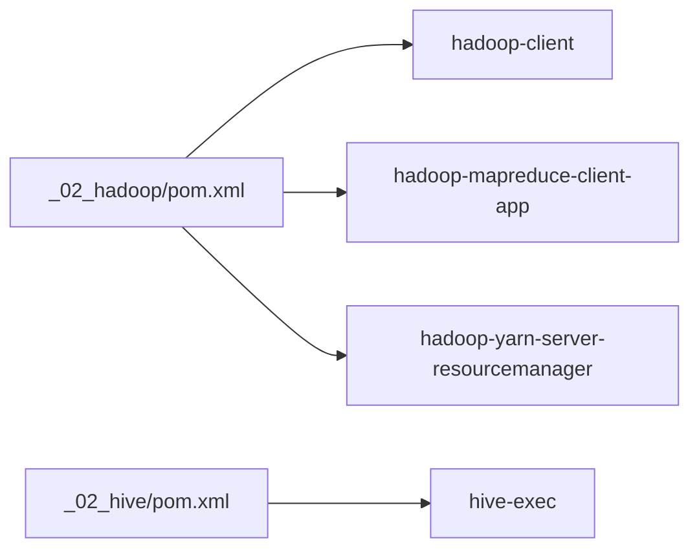

# 大数据生态

<cite>
**本文引用的文件**
- [_02_hadoop/pom.xml](file://_02_hadoop/pom.xml)
- [HDFSClient/src/main/java/com/atguigu/hdfs/HdfsClient.java](file://_02_hadoop/HDFSClient/src/main/java/com/atguigu/hdfs/HdfsClient.java)
- [HDFSClient/src/main/resources/hdfs-site.xml](file://_02_hadoop/HDFSClient/src/main/resources/hdfs-site.xml)
- [MapReduceDemo/src/main/java/com/atguigu/mapreduce/wordcount/WordCountDriver.java](file://_02_hadoop/MapReduceDemo/src/main/java/com/atguigu/mapreduce/wordcount/WordCountDriver.java)
- [MapReduceDemo/src/main/java/com/atguigu/mapreduce/wordcount/WordCountMapper.java](file://_02_hadoop/MapReduceDemo/src/main/java/com/atguigu/mapreduce/wordcount/WordCountMapper.java)
- [MapReduceDemo/src/main/java/com/atguigu/mapreduce/wordcount/WordCountReducer.java](file://_02_hadoop/MapReduceDemo/src/main/java/com/atguigu/mapreduce/wordcount/WordCountReducer.java)
- [YarnDemo/src/main/java/com/atguigu/yarn/WordCountDriver.java](file://_02_hadoop/YarnDemo/src/main/java/com/atguigu/yarn/WordCountDriver.java)
- [YarnDemo/src/main/java/com/atguigu/yarn/WordCount.java](file://_02_hadoop/YarnDemo/src/main/java/com/atguigu/yarn/WordCount.java)
- [YarnDemo/pom.xml](file://_02_hadoop/YarnDemo/pom.xml)
- [_02_hive/pom.xml](file://_02_hive/pom.xml)
- [_02_hive/src/main/java/org/example/App.java](file://_02_hive/src/main/java/org/example/App.java)
- [_04_sparkTest/src/main/resources/hive-site.xml](file://_04_sparkTest/src/main/resources/hive-site.xml)
- [_04_sparkTest/src/main/java/com/atguigu/bigdata/spark/sql/Spark16_SQL_Hive_my.scala](file://_04_sparkTest/src/main/java/com/atguigu/bigdata/spark/sql/Spark16_SQL_Hive_my.scala)
- [_03_flume/pom.xml](file://_03_flume/pom.xml)
- [_200_flinkRealtime/src/main/java/com/atguigu/gmall/realtime/app/dwd/log/DwdTrafficBaseLogSplit.java](file://_200_flinkRealtime/src/main/java/com/atguigu/gmall/realtime/app/dwd/log/DwdTrafficBaseLogSplit.java)
- [_06_flink/src/main/java/_12_unionWaterMark/_02_keyedPartWaterMark_teacher.java](file://_06_flink/src/main/java/_12_unionWaterMark/_02_keyedPartWaterMark_teacher.java)
</cite>

## 目录
1. [引言](#引言)
2. [项目结构](#项目结构)
3. [核心组件](#核心组件)
4. [架构总览](#架构总览)
5. [组件详解](#组件详解)
6. [依赖分析](#依赖分析)
7. [性能考虑](#性能考虑)
8. [故障排查指南](#故障排查指南)
9. [结论](#结论)
10. [附录](#附录)

## 引言
本技术文档围绕大数据生态模块，系统梳理Hadoop生态关键组件：HDFS分布式文件系统、MapReduce编程模型、YARN资源管理、Hive数据仓库与Flume数据采集。文档结合仓库中的示例工程，给出组件协作关系、部署要点、性能优化与故障排查建议，帮助初学者从理论到实践全面掌握。

## 项目结构
该仓库以模块化组织，Hadoop生态相关示例集中在“_02_hadoop”、“_02_hive”、“_03_flume”等子模块中，分别演示HDFS客户端操作、MapReduce词频统计、YARN作业提交、Hive UDF与Spark集成Hive等能力。同时，实时计算与采集链路在“_06_flink”、“_200_flinkRealtime”等模块中体现，展示了与HDFS、Kafka、Flume的协同。

图示来源
- [HDFSClient/src/main/java/com/atguigu/hdfs/HdfsClient.java](file://_02_hadoop/HDFSClient/src/main/java/com/atguigu/hdfs/HdfsClient.java#L1-L162)
- [MapReduceDemo/src/main/java/com/atguigu/mapreduce/wordcount/WordCountDriver.java](file://_02_hadoop/MapReduceDemo/src/main/java/com/atguigu/mapreduce/wordcount/WordCountDriver.java#L1-L48)
- [MapReduceDemo/src/main/java/com/atguigu/mapreduce/wordcount/WordCountMapper.java](file://_02_hadoop/MapReduceDemo/src/main/java/com/atguigu/mapreduce/wordcount/WordCountMapper.java#L1-L41)
- [MapReduceDemo/src/main/java/com/atguigu/mapreduce/wordcount/WordCountReducer.java](file://_02_hadoop/MapReduceDemo/src/main/java/com/atguigu/mapreduce/wordcount/WordCountReducer.java#L1-L36)
- [YarnDemo/src/main/java/com/atguigu/yarn/WordCountDriver.java](file://_02_hadoop/YarnDemo/src/main/java/com/atguigu/yarn/WordCountDriver.java#L1-L32)
- [YarnDemo/src/main/java/com/atguigu/yarn/WordCount.java](file://_02_hadoop/YarnDemo/src/main/java/com/atguigu/yarn/WordCount.java#L1-L45)
- [_02_hive/src/main/java/org/example/App.java](file://_02_hive/src/main/java/org/example/App.java#L1-L34)
- [_04_sparkTest/src/main/java/com/atguigu/bigdata/spark/sql/Spark16_SQL_Hive_my.scala](file://_04_sparkTest/src/main/java/com/atguigu/bigdata/spark/sql/Spark16_SQL_Hive_my.scala#L1-L28)
- [_03_flume/pom.xml](file://_03_flume/pom.xml#L1-L16)
- [_200_flinkRealtime/src/main/java/com/atguigu/gmall/realtime/app/dwd/log/DwdTrafficBaseLogSplit.java](file://_200_flinkRealtime/src/main/java/com/atguigu/gmall/realtime/app/dwd/log/DwdTrafficBaseLogSplit.java#L28-L53)

章节来源
- [HDFSClient/src/main/java/com/atguigu/hdfs/HdfsClient.java](file://_02_hadoop/HDFSClient/src/main/java/com/atguigu/hdfs/HdfsClient.java#L1-L162)
- [MapReduceDemo/src/main/java/com/atguigu/mapreduce/wordcount/WordCountDriver.java](file://_02_hadoop/MapReduceDemo/src/main/java/com/atguigu/mapreduce/wordcount/WordCountDriver.java#L1-L48)
- [YarnDemo/src/main/java/com/atguigu/yarn/WordCountDriver.java](file://_02_hadoop/YarnDemo/src/main/java/com/atguigu/yarn/WordCountDriver.java#L1-L32)
- [_02_hive/src/main/java/org/example/App.java](file://_02_hive/src/main/java/org/example/App.java#L1-L34)
- [_04_sparkTest/src/main/java/com/atguigu/bigdata/spark/sql/Spark16_SQL_Hive_my.scala](file://_04_sparkTest/src/main/java/com/atguigu/bigdata/spark/sql/Spark16_SQL_Hive_my.scala#L1-L28)
- [_03_flume/pom.xml](file://_03_flume/pom.xml#L1-L16)
- [_200_flinkRealtime/src/main/java/com/atguigu/gmall/realtime/app/dwd/log/DwdTrafficBaseLogSplit.java](file://_200_flinkRealtime/src/main/java/com/atguigu/gmall/realtime/app/dwd/log/DwdTrafficBaseLogSplit.java#L28-L53)

## 核心组件
- HDFS 分布式文件系统：提供高吞吐、可扩展的存储，支持客户端操作（创建目录、上传下载、重命名、删除、列举文件等）。
- MapReduce 编程模型：提供Map与Reduce两阶段处理，示例展示词频统计的驱动类、Mapper与Reducer实现。
- YARN 资源管理：作为统一资源调度平台，示例通过ToolRunner方式提交作业，封装Job配置与生命周期。
- Hive 数据仓库：提供UDF开发骨架与Spark集成Hive的能力，便于SQL化查询与二次开发。
- Flume 数据采集：作为日志采集管道，配合Kafka与Flink完成端到端实时数据链路。

章节来源
- [HDFSClient/src/main/java/com/atguigu/hdfs/HdfsClient.java](file://_02_hadoop/HDFSClient/src/main/java/com/atguigu/hdfs/HdfsClient.java#L1-L162)
- [MapReduceDemo/src/main/java/com/atguigu/mapreduce/wordcount/WordCountDriver.java](file://_02_hadoop/MapReduceDemo/src/main/java/com/atguigu/mapreduce/wordcount/WordCountDriver.java#L1-L48)
- [MapReduceDemo/src/main/java/com/atguigu/mapreduce/wordcount/WordCountMapper.java](file://_02_hadoop/MapReduceDemo/src/main/java/com/atguigu/mapreduce/wordcount/WordCountMapper.java#L1-L41)
- [MapReduceDemo/src/main/java/com/atguigu/mapreduce/wordcount/WordCountReducer.java](file://_02_hadoop/MapReduceDemo/src/main/java/com/atguigu/mapreduce/wordcount/WordCountReducer.java#L1-L36)
- [YarnDemo/src/main/java/com/atguigu/yarn/WordCountDriver.java](file://_02_hadoop/YarnDemo/src/main/java/com/atguigu/yarn/WordCountDriver.java#L1-L32)
- [YarnDemo/src/main/java/com/atguigu/yarn/WordCount.java](file://_02_hadoop/YarnDemo/src/main/java/com/atguigu/yarn/WordCount.java#L1-L45)
- [_02_hive/src/main/java/org/example/App.java](file://_02_hive/src/main/java/org/example/App.java#L1-L34)
- [_04_sparkTest/src/main/java/com/atguigu/bigdata/spark/sql/Spark16_SQL_Hive_my.scala](file://_04_sparkTest/src/main/java/com/atguigu/bigdata/spark/sql/Spark16_SQL_Hive_my.scala#L1-L28)
- [_03_flume/pom.xml](file://_03_flume/pom.xml#L1-L16)

## 架构总览
下图展示从数据采集到存储与处理的整体协作关系：Flume采集日志至Kafka，Flink从Kafka消费并分流写入不同主题；HDFS作为底层存储，MapReduce在YARN上调度执行批处理任务；Hive提供SQL查询与与Spark集成。

图示来源
- [_200_flinkRealtime/src/main/java/com/atguigu/gmall/realtime/app/dwd/log/DwdTrafficBaseLogSplit.java](file://_200_flinkRealtime/src/main/java/com/atguigu/gmall/realtime/app/dwd/log/DwdTrafficBaseLogSplit.java#L28-L53)
- [HDFSClient/src/main/java/com/atguigu/hdfs/HdfsClient.java](file://_02_hadoop/HDFSClient/src/main/java/com/atguigu/hdfs/HdfsClient.java#L1-L162)
- [MapReduceDemo/src/main/java/com/atguigu/mapreduce/wordcount/WordCountDriver.java](file://_02_hadoop/MapReduceDemo/src/main/java/com/atguigu/mapreduce/wordcount/WordCountDriver.java#L1-L48)
- [YarnDemo/src/main/java/com/atguigu/yarn/WordCount.java](file://_02_hadoop/YarnDemo/src/main/java/com/atguigu/yarn/WordCount.java#L1-L45)
- [_04_sparkTest/src/main/java/com/atguigu/bigdata/spark/sql/Spark16_SQL_Hive_my.scala](file://_04_sparkTest/src/main/java/com/atguigu/bigdata/spark/sql/Spark16_SQL_Hive_my.scala#L1-L28)

## 组件详解

### HDFS 客户端操作
- 基本流程：初始化FileSystem → 执行操作（创建目录、上传、下载、重命名、删除、列举）→ 关闭资源。
- 关键点：URI指向NameNode地址，用户身份与副本数配置可通过配置文件或代码设置。
- 配置参考：副本数属性位于hdfs-site.xml。

图示来源
- [HDFSClient/src/main/java/com/atguigu/hdfs/HdfsClient.java](file://_02_hadoop/HDFSClient/src/main/java/com/atguigu/hdfs/HdfsClient.java#L1-L162)
- [HDFSClient/src/main/resources/hdfs-site.xml](file://_02_hadoop/HDFSClient/src/main/resources/hdfs-site.xml#L1-L10)

章节来源
- [HDFSClient/src/main/java/com/atguigu/hdfs/HdfsClient.java](file://_02_hadoop/HDFSClient/src/main/java/com/atguigu/hdfs/HdfsClient.java#L1-L162)
- [HDFSClient/src/main/resources/hdfs-site.xml](file://_02_hadoop/HDFSClient/src/main/resources/hdfs-site.xml#L1-L10)

### MapReduce 词频统计
- 驱动类负责配置Job、设置Mapper/Reducer、输入输出路径与类型。
- Mapper将输入文本切分为单词并输出(单词, 1)，Reducer对相同单词计数求和。
- 适合入门理解Map-Reduce两阶段处理与数据类型约束。

图示来源
- [MapReduceDemo/src/main/java/com/atguigu/mapreduce/wordcount/WordCountDriver.java](file://_02_hadoop/MapReduceDemo/src/main/java/com/atguigu/mapreduce/wordcount/WordCountDriver.java#L1-L48)
- [MapReduceDemo/src/main/java/com/atguigu/mapreduce/wordcount/WordCountMapper.java](file://_02_hadoop/MapReduceDemo/src/main/java/com/atguigu/mapreduce/wordcount/WordCountMapper.java#L1-L41)
- [MapReduceDemo/src/main/java/com/atguigu/mapreduce/wordcount/WordCountReducer.java](file://_02_hadoop/MapReduceDemo/src/main/java/com/atguigu/mapreduce/wordcount/WordCountReducer.java#L1-L36)

章节来源
- [MapReduceDemo/src/main/java/com/atguigu/mapreduce/wordcount/WordCountDriver.java](file://_02_hadoop/MapReduceDemo/src/main/java/com/atguigu/mapreduce/wordcount/WordCountDriver.java#L1-L48)
- [MapReduceDemo/src/main/java/com/atguigu/mapreduce/wordcount/WordCountMapper.java](file://_02_hadoop/MapReduceDemo/src/main/java/com/atguigu/mapreduce/wordcount/WordCountMapper.java#L1-L41)
- [MapReduceDemo/src/main/java/com/atguigu/mapreduce/wordcount/WordCountReducer.java](file://_02_hadoop/MapReduceDemo/src/main/java/com/atguigu/mapreduce/wordcount/WordCountReducer.java#L1-L36)

### YARN 作业提交
- 使用ToolRunner按参数选择具体Tool（如WordCount），Tool内部构建Job并设置Mapper/Reducer与输入输出路径。
- 通过YARN完成资源申请与容器调度，实现作业在集群上的弹性执行。

图示来源
- [YarnDemo/src/main/java/com/atguigu/yarn/WordCountDriver.java](file://_02_hadoop/YarnDemo/src/main/java/com/atguigu/yarn/WordCountDriver.java#L1-L32)
- [YarnDemo/src/main/java/com/atguigu/yarn/WordCount.java](file://_02_hadoop/YarnDemo/src/main/java/com/atguigu/yarn/WordCount.java#L1-L45)

章节来源
- [YarnDemo/src/main/java/com/atguigu/yarn/WordCountDriver.java](file://_02_hadoop/YarnDemo/src/main/java/com/atguigu/yarn/WordCountDriver.java#L1-L32)
- [YarnDemo/src/main/java/com/atguigu/yarn/WordCount.java](file://_02_hadoop/YarnDemo/src/main/java/com/atguigu/yarn/WordCount.java#L1-L45)

### Hive 数据仓库与 Spark 集成
- Hive UDF骨架：继承GenericUDF，实现initialize、evaluate、getDisplayString等方法，便于自定义函数开发。
- Spark 集成 Hive：启用HiveSupport后可直接使用Spark SQL访问Hive元数据与表。

图示来源
- [_02_hive/src/main/java/org/example/App.java](file://_02_hive/src/main/java/org/example/App.java#L1-L34)

章节来源
- [_02_hive/src/main/java/org/example/App.java](file://_02_hive/src/main/java/org/example/App.java#L1-L34)
- [_04_sparkTest/src/main/java/com/atguigu/bigdata/spark/sql/Spark16_SQL_Hive_my.scala](file://_04_sparkTest/src/main/java/com/atguigu/bigdata/spark/sql/Spark16_SQL_Hive_my.scala#L1-L28)
- [_04_sparkTest/src/main/resources/hive-site.xml](file://_04_sparkTest/src/main/resources/hive-site.xml#L1-L47)

### Flume 数据采集与 Flink 实时链路
- Flume 模块：提供采集能力的基础依赖与工程结构。
- 实时链路：Flink应用从Kafka读取日志，进行类型转换、清洗与分流，写入不同主题；流程中涉及水位线与事件时间窗口处理。

图示来源
- [_03_flume/pom.xml](file://_03_flume/pom.xml#L1-L16)
- [_200_flinkRealtime/src/main/java/com/atguigu/gmall/realtime/app/dwd/log/DwdTrafficBaseLogSplit.java](file://_200_flinkRealtime/src/main/java/com/atguigu/gmall/realtime/app/dwd/log/DwdTrafficBaseLogSplit.java#L28-L53)
- [_06_flink/src/main/java/_12_unionWaterMark/_02_keyedPartWaterMark_teacher.java](file://_06_flink/src/main/java/_12_unionWaterMark/_02_keyedPartWaterMark_teacher.java#L29-L57)

章节来源
- [_03_flume/pom.xml](file://_03_flume/pom.xml#L1-L16)
- [_200_flinkRealtime/src/main/java/com/atguigu/gmall/realtime/app/dwd/log/DwdTrafficBaseLogSplit.java](file://_200_flinkRealtime/src/main/java/com/atguigu/gmall/realtime/app/dwd/log/DwdTrafficBaseLogSplit.java#L28-L53)
- [_06_flink/src/main/java/_12_unionWaterMark/_02_keyedPartWaterMark_teacher.java](file://_06_flink/src/main/java/_12_unionWaterMark/_02_keyedPartWaterMark_teacher.java#L29-L57)

## 依赖分析
- Hadoop 生态依赖：hadoop-client、hadoop-mapreduce-client-app、hadoop-yarn-server-resourcemanager等。
- Hive 依赖：hive-exec。
- Flume 模块：当前仅提供Maven工程结构，用于后续引入Flume依赖与配置。

图示来源
- [_02_hadoop/pom.xml](file://_02_hadoop/pom.xml#L1-L84)
- [_02_hive/pom.xml](file://_02_hive/pom.xml#L1-L34)

章节来源
- [_02_hadoop/pom.xml](file://_02_hadoop/pom.xml#L1-L84)
- [_02_hive/pom.xml](file://_02_hive/pom.xml#L1-L34)

## 性能考虑
- HDFS
  - 副本数与块大小：根据数据规模与可靠性需求调整副本数，合理设置块大小以提升顺序读写性能。
  - 上传策略：批量合并小文件，减少NameNode压力。
- MapReduce
  - Combiner：在本地聚合中间结果，减少网络传输。
  - 输入分片：合理设置split大小，避免过度切分导致调度开销。
  - 类型选择：使用Writable类型减少序列化成本。
- YARN
  - 资源分配：为不同队列/作业设置合理的内存/CPU配额，避免资源争用。
  - 应用亲和性：尽量让计算靠近数据，减少跨节点数据传输。
- Hive
  - 分桶与分区：按热点字段分桶/分区，加速查询。
  - 向量化执行：开启向量化以提升扫描与计算效率。
- Flume
  - 采集并发：根据磁盘IO与网络带宽设置合适的batch-size与事务超时。
  - Sink 并行：Kafka sink并行度与分区数匹配，避免单点瓶颈。

## 故障排查指南
- HDFS
  - 权限与用户：确认用户身份与权限，避免因权限不足导致操作失败。
  - 副本数与健康：检查副本数与DataNode状态，确保数据可用性。
- MapReduce
  - 日志定位：通过YARN界面查看Container日志，定位Mapper/Reducer异常。
  - 类型不匹配：核对Map/Reduce输出类型与Job配置，避免序列化异常。
- YARN
  - 资源不足：检查集群资源使用率与队列配额，必要时扩容或调整调度策略。
  - 作业长时间卡住：排查Shuffle阶段网络与磁盘IO瓶颈。
- Hive
  - 元数据库连接：校验hive-site.xml中JDBC连接参数与元数据库连通性。
  - UDF异常：在UDF中增加日志与边界条件判断，快速定位输入异常。
- Flume
  - 采集停滞：检查Flume Agent配置、Kafka连接状态与磁盘空间。
  - Flink 水位线：确认事件时间与水位线设置，避免窗口过早触发或数据积压。

## 结论
本仓库提供了Hadoop生态关键组件的入门级示例：HDFS客户端操作、MapReduce词频统计、YARN作业提交、Hive UDF与Spark集成、以及Flume+Flink的实时采集链路。结合本文档的架构视图、依赖关系与最佳实践，读者可快速搭建并优化端到端的大数据处理流水线。

## 附录
- 配置文件位置
  - HDFS：hdfs-site.xml
  - Hive：hive-site.xml
- 关键类与路径
  - HDFS：HdfsClient.java
  - MapReduce：WordCountDriver.java、WordCountMapper.java、WordCountReducer.java
  - YARN：WordCountDriver.java、WordCount.java
  - Hive：App.java
  - Spark 集成 Hive：Spark16_SQL_Hive_my.scala
  - Flume：_03_flume/pom.xml
  - 实时链路：DwdTrafficBaseLogSplit.java
  - 水位线示例：_06_flink/src/main/java/_12_unionWaterMark/_02_keyedPartWaterMark_teacher.java