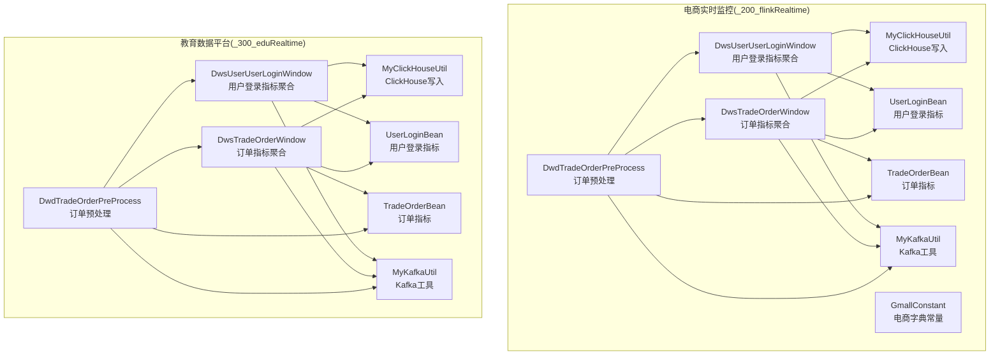
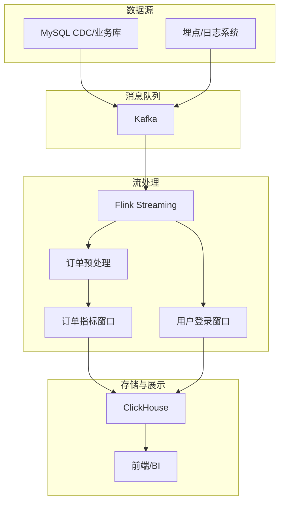
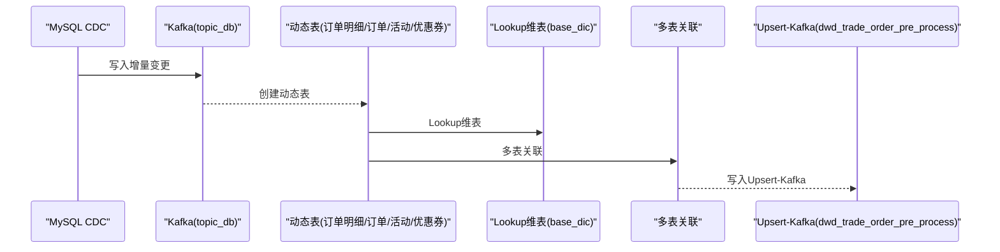
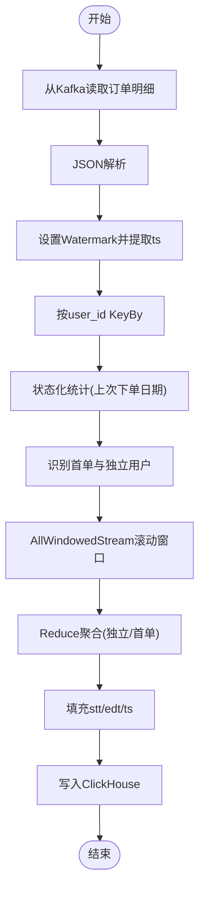
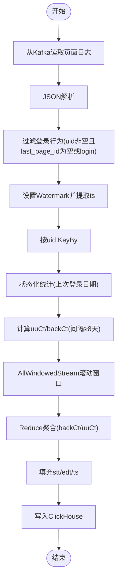
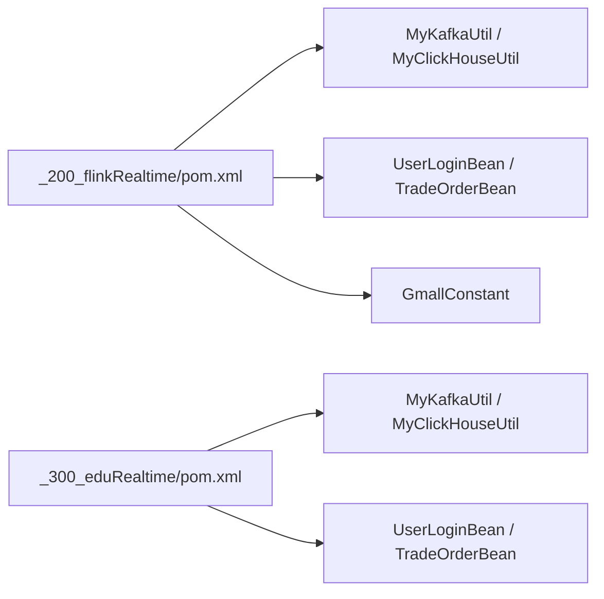

# 实时项目实战

<cite>
**本文引用的文件**
- [readMe.md](file://readMe.md)
- [_200_flinkRealtime/pom.xml](file://_200_flinkRealtime/pom.xml)
- [_300_eduRealtime/pom.xml](file://_300_eduRealtime/pom.xml)
- [_200_flinkRealtime/src/main/java/com/atguigu/gmall/realtime/app/dwd/db/DwdTradeOrderPreProcess.java](file://_200_flinkRealtime/src/main/java/com/atguigu/gmall/realtime/app/dwd/db/DwdTradeOrderPreProcess.java)
- [_300_eduRealtime/src/main/java/com/atguigu/gmall/realtime/app/dwd/DwdTradeOrderPreProcess.java](file://_300_eduRealtime/src/main/java/com/atguigu/gmall/realtime/app/dwd/DwdTradeOrderPreProcess.java)
- [_200_flinkRealtime/src/main/java/com/atguigu/gmall/realtime/app/dws/DwsTradeOrderWindow.java](file://_200_flinkRealtime/src/main/java/com/atguigu/gmall/realtime/app/dws/DwsTradeOrderWindow.java)
- [_300_eduRealtime/src/main/java/com/atguigu/gmall/realtime/app/dws/DwsTradeOrderWindow.java](file://_300_eduRealtime/src/main/java/com/atguigu/gmall/realtime/app/dws/DwsTradeOrderWindow.java)
- [_200_flinkRealtime/src/main/java/com/atguigu/gmall/realtime/app/dws/DwsUserUserLoginWindow.java](file://_200_flinkRealtime/src/main/java/com/atguigu/gmall/realtime/app/dws/DwsUserUserLoginWindow.java)
- [_300_eduRealtime/src/main/java/com/atguigu/gmall/realtime/app/dws/DwsUserUserLoginWindow.java](file://_300_eduRealtime/src/main/java/com/atguigu/gmall/realtime/app/dws/DwsUserUserLoginWindow.java)
- [_200_flinkRealtime/src/main/java/com/atguigu/gmall/realtime/bean/UserLoginBean.java](file://_200_flinkRealtime/src/main/java/com/atguigu/gmall/realtime/bean/UserLoginBean.java)
- [_300_eduRealtime/src/main/java/com/atguigu/gmall/realtime/bean/UserLoginBean.java](file://_300_eduRealtime/src/main/java/com/atguigu/gmall/realtime/bean/UserLoginBean.java)
- [_200_flinkRealtime/src/main/java/com/atguigu/gmall/realtime/bean/TradeOrderBean.java](file://_200_flinkRealtime/src/main/java/com/atguigu/gmall/realtime/bean/TradeOrderBean.java)
- [_300_eduRealtime/src/main/java/com/atguigu/gmall/realtime/bean/TradeOrderBean.java](file://_300_eduRealtime/src/main/java/com/atguigu/gmall/realtime/bean/TradeOrderBean.java)
- [_200_flinkRealtime/src/main/java/com/atguigu/gmall/realtime/util/MyKafkaUtil.java](file://_200_flinkRealtime/src/main/java/com/atguigu/gmall/realtime/util/MyKafkaUtil.java)
- [_300_eduRealtime/src/main/java/com/atguigu/gmall/realtime/util/MyKafkaUtil.java](file://_300_eduRealtime/src/main/java/com/atguigu/gmall/realtime/util/MyKafkaUtil.java)
- [_200_flinkRealtime/src/main/java/com/atguigu/gmall/realtime/util/MyClickHouseUtil.java](file://_200_flinkRealtime/src/main/java/com/atguigu/gmall/realtime/util/MyClickHouseUtil.java)
- [_200_flinkRealtime/src/main/java/com/atguigu/gmall/realtime/common/GmallConstant.java](file://_200_flinkRealtime/src/main/java/com/atguigu/gmall/realtime/common/GmallConstant.java)
</cite>

## 目录
1. [引言](#引言)
2. [项目结构](#项目结构)
3. [核心组件](#核心组件)
4. [架构总览](#架构总览)
5. [详细组件分析](#详细组件分析)
6. [依赖分析](#依赖分析)
7. [性能考虑](#性能考虑)
8. [故障排查指南](#故障排查指南)
9. [结论](#结论)
10. [附录](#附录)

## 引言
本指导文档围绕“实时项目实战”主题，聚焦于电商实时监控与教育数据平台两大实战场景，系统梳理从需求分析到生产上线的完整流程。内容涵盖整体架构设计、数据流设计与关键技术选型，深入讲解实时指标计算、数据清洗、状态管理等核心技术实现，并提供部署与运维建议。文档以电商订单监控、用户行为分析、实时报表展示等业务场景为线索，帮助开发者快速落地可扩展、可观测、高性能的实时数据系统。

## 项目结构
仓库包含多个模块，其中与实时项目实战直接相关的核心模块如下：
- 电商实时监控模块（_200_flinkRealtime）：提供电商链路的ODS/DWD/DWS层示例，覆盖订单预处理、订单聚合、用户登录聚合等典型场景。
- 教育数据平台模块（_300_eduRealtime）：提供教育领域的ODS/DWD/DWS层示例，包含订单与用户登录等窗口聚合逻辑，便于迁移至教育业务。
- 通用依赖与工具：Kafka工具、ClickHouse JDBC写入工具、常量配置等。

图表来源
- [_200_flinkRealtime/src/main/java/com/atguigu/gmall/realtime/app/dwd/db/DwdTradeOrderPreProcess.java](file://_200_flinkRealtime/src/main/java/com/atguigu/gmall/realtime/app/dwd/db/DwdTradeOrderPreProcess.java#L1-L194)
- [_200_flinkRealtime/src/main/java/com/atguigu/gmall/realtime/app/dws/DwsTradeOrderWindow.java](file://_200_flinkRealtime/src/main/java/com/atguigu/gmall/realtime/app/dws/DwsTradeOrderWindow.java#L1-L156)
- [_200_flinkRealtime/src/main/java/com/atguigu/gmall/realtime/app/dws/DwsUserUserLoginWindow.java](file://_200_flinkRealtime/src/main/java/com/atguigu/gmall/realtime/app/dws/DwsUserUserLoginWindow.java#L1-L183)
- [_200_flinkRealtime/src/main/java/com/atguigu/gmall/realtime/util/MyKafkaUtil.java](file://_200_flinkRealtime/src/main/java/com/atguigu/gmall/realtime/util/MyKafkaUtil.java#L1-L111)
- [_200_flinkRealtime/src/main/java/com/atguigu/gmall/realtime/util/MyClickHouseUtil.java](file://_200_flinkRealtime/src/main/java/com/atguigu/gmall/realtime/util/MyClickHouseUtil.java#L1-L70)
- [_200_flinkRealtime/src/main/java/com/atguigu/gmall/realtime/bean/UserLoginBean.java](file://_200_flinkRealtime/src/main/java/com/atguigu/gmall/realtime/bean/UserLoginBean.java#L1-L25)
- [_200_flinkRealtime/src/main/java/com/atguigu/gmall/realtime/bean/TradeOrderBean.java](file://_200_flinkRealtime/src/main/java/com/atguigu/gmall/realtime/bean/TradeOrderBean.java#L1-L26)
- [_200_flinkRealtime/src/main/java/com/atguigu/gmall/realtime/common/GmallConstant.java](file://_200_flinkRealtime/src/main/java/com/atguigu/gmall/realtime/common/GmallConstant.java#L1-L72)

章节来源
- [_200_flinkRealtime/pom.xml](file://_200_flinkRealtime/pom.xml)
- [_300_eduRealtime/pom.xml](file://_300_eduRealtime/pom.xml)

## 核心组件
- 订单预处理（DwdTradeOrderPreProcess）
  - 从MySQL CDC主题读取增量数据，抽取订单明细、订单信息、活动与优惠券关联维度，构建订单预处理宽表，并写入Upsert-Kafka。
  - 关键点：动态表建模、多表关联、Lookup维表、Upsert-Kafka Sink。
- 订单指标聚合（DwsTradeOrderWindow）
  - 从订单明细主题读取数据，基于用户维度进行状态化去重与首单识别，按滚动窗口聚合独立下单用户与新增下单用户，写入ClickHouse。
  - 关键点：KeyBy + KeyedProcessFunction状态管理、Watermark策略、AllWindowedStream聚合。
- 用户登录指标聚合（DwsUserUserLoginWindow）
  - 从页面日志主题读取登录行为，过滤有效登录事件，基于用户维度识别独立用户与回流用户（间隔≥8天），按窗口聚合写入ClickHouse。
  - 关键点：事件过滤、状态化去重、窗口聚合。
- 工具与配置
  - Kafka工具：统一消费者/生产者与DDL封装。
  - ClickHouse工具：通用JDBC Sink与批量写入配置。
  - 常量配置：电商领域字典常量，便于跨模块复用。

章节来源
- [_200_flinkRealtime/src/main/java/com/atguigu/gmall/realtime/app/dwd/db/DwdTradeOrderPreProcess.java](file://_200_flinkRealtime/src/main/java/com/atguigu/gmall/realtime/app/dwd/db/DwdTradeOrderPreProcess.java#L1-L194)
- [_200_flinkRealtime/src/main/java/com/atguigu/gmall/realtime/app/dws/DwsTradeOrderWindow.java](file://_200_flinkRealtime/src/main/java/com/atguigu/gmall/realtime/app/dws/DwsTradeOrderWindow.java#L1-L156)
- [_200_flinkRealtime/src/main/java/com/atguigu/gmall/realtime/app/dws/DwsUserUserLoginWindow.java](file://_200_flinkRealtime/src/main/java/com/atguigu/gmall/realtime/app/dws/DwsUserUserLoginWindow.java#L1-L183)
- [_200_flinkRealtime/src/main/java/com/atguigu/gmall/realtime/util/MyKafkaUtil.java](file://_200_flinkRealtime/src/main/java/com/atguigu/gmall/realtime/util/MyKafkaUtil.java#L1-L111)
- [_200_flinkRealtime/src/main/java/com/atguigu/gmall/realtime/util/MyClickHouseUtil.java](file://_200_flinkRealtime/src/main/java/com/atguigu/gmall/realtime/util/MyClickHouseUtil.java#L1-L70)
- [_200_flinkRealtime/src/main/java/com/atguigu/gmall/realtime/common/GmallConstant.java](file://_200_flinkRealtime/src/main/java/com/atguigu/gmall/realtime/common/GmallConstant.java#L1-L72)

## 架构总览
整体采用“CDC/埋点 → Kafka → Flink流处理 → OLAP/存储”的实时架构。电商与教育模块共享同一套工具与流程范式，差异主要体现在业务主题与指标口径。

图表来源
- [_200_flinkRealtime/src/main/java/com/atguigu/gmall/realtime/app/dwd/db/DwdTradeOrderPreProcess.java](file://_200_flinkRealtime/src/main/java/com/atguigu/gmall/realtime/app/dwd/db/DwdTradeOrderPreProcess.java#L1-L194)
- [_200_flinkRealtime/src/main/java/com/atguigu/gmall/realtime/app/dws/DwsTradeOrderWindow.java](file://_200_flinkRealtime/src/main/java/com/atguigu/gmall/realtime/app/dws/DwsTradeOrderWindow.java#L1-L156)
- [_200_flinkRealtime/src/main/java/com/atguigu/gmall/realtime/app/dws/DwsUserUserLoginWindow.java](file://_200_flinkRealtime/src/main/java/com/atguigu/gmall/realtime/app/dws/DwsUserUserLoginWindow.java#L1-L183)
- [_200_flinkRealtime/src/main/java/com/atguigu/gmall/realtime/util/MyClickHouseUtil.java](file://_200_flinkRealtime/src/main/java/com/atguigu/gmall/realtime/util/MyClickHouseUtil.java#L1-L70)

## 详细组件分析

### 订单预处理（电商）
该组件负责将多表CDC增量数据汇聚为订单宽表，供后续指标计算使用。核心流程包括：
- 从CDC主题读取订单明细、订单信息、活动与优惠券关联表；
- 通过Lookup连接维表（如字典表）；
- 关联后形成宽表并写入Upsert-Kafka，供下游窗口聚合消费。

图表来源
- [_200_flinkRealtime/src/main/java/com/atguigu/gmall/realtime/app/dwd/db/DwdTradeOrderPreProcess.java](file://_200_flinkRealtime/src/main/java/com/atguigu/gmall/realtime/app/dwd/db/DwdTradeOrderPreProcess.java#L1-L194)
- [_200_flinkRealtime/src/main/java/com/atguigu/gmall/realtime/util/MyKafkaUtil.java](file://_200_flinkRealtime/src/main/java/com/atguigu/gmall/realtime/util/MyKafkaUtil.java#L1-L111)

章节来源
- [_200_flinkRealtime/src/main/java/com/atguigu/gmall/realtime/app/dwd/db/DwdTradeOrderPreProcess.java](file://_200_flinkRealtime/src/main/java/com/atguigu/gmall/realtime/app/dwd/db/DwdTradeOrderPreProcess.java#L1-L194)

### 订单指标聚合（电商）
该组件从订单明细主题读取数据，基于用户维度进行状态化统计，计算独立下单用户与新增下单用户，并按窗口聚合写入ClickHouse。

图表来源
- [_200_flinkRealtime/src/main/java/com/atguigu/gmall/realtime/app/dws/DwsTradeOrderWindow.java](file://_200_flinkRealtime/src/main/java/com/atguigu/gmall/realtime/app/dws/DwsTradeOrderWindow.java#L1-L156)
- [_200_flinkRealtime/src/main/java/com/atguigu/gmall/realtime/bean/TradeOrderBean.java](file://_200_flinkRealtime/src/main/java/com/atguigu/gmall/realtime/bean/TradeOrderBean.java#L1-L26)
- [_200_flinkRealtime/src/main/java/com/atguigu/gmall/realtime/util/MyClickHouseUtil.java](file://_200_flinkRealtime/src/main/java/com/atguigu/gmall/realtime/util/MyClickHouseUtil.java#L1-L70)

章节来源
- [_200_flinkRealtime/src/main/java/com/atguigu/gmall/realtime/app/dws/DwsTradeOrderWindow.java](file://_200_flinkRealtime/src/main/java/com/atguigu/gmall/realtime/app/dws/DwsTradeOrderWindow.java#L1-L156)
- [_200_flinkRealtime/src/main/java/com/atguigu/gmall/realtime/bean/TradeOrderBean.java](file://_200_flinkRealtime/src/main/java/com/atguigu/gmall/realtime/bean/TradeOrderBean.java#L1-L26)

### 用户登录指标聚合（电商/教育）
该组件从页面日志主题读取登录行为，过滤有效登录事件，基于用户维度识别独立用户与回流用户（间隔≥8天），按窗口聚合写入ClickHouse。

图表来源
- [_200_flinkRealtime/src/main/java/com/atguigu/gmall/realtime/app/dws/DwsUserUserLoginWindow.java](file://_200_flinkRealtime/src/main/java/com/atguigu/gmall/realtime/app/dws/DwsUserUserLoginWindow.java#L1-L183)
- [_200_flinkRealtime/src/main/java/com/atguigu/gmall/realtime/bean/UserLoginBean.java](file://_200_flinkRealtime/src/main/java/com/atguigu/gmall/realtime/bean/UserLoginBean.java#L1-L25)
- [_200_flinkRealtime/src/main/java/com/atguigu/gmall/realtime/util/MyClickHouseUtil.java](file://_200_flinkRealtime/src/main/java/com/atguigu/gmall/realtime/util/MyClickHouseUtil.java#L1-L70)

章节来源
- [_200_flinkRealtime/src/main/java/com/atguigu/gmall/realtime/app/dws/DwsUserUserLoginWindow.java](file://_200_flinkRealtime/src/main/java/com/atguigu/gmall/realtime/app/dws/DwsUserUserLoginWindow.java#L1-L183)
- [_200_flinkRealtime/src/main/java/com/atguigu/gmall/realtime/bean/UserLoginBean.java](file://_200_flinkRealtime/src/main/java/com/atguigu/gmall/realtime/bean/UserLoginBean.java#L1-L25)

### 教育数据平台（迁移参考）
教育模块在电商模块基础上，针对教育业务主题与指标口径进行适配，核心流程一致：
- 订单预处理：从教育业务主题读取，构建订单宽表；
- 订单与用户登录指标：按窗口聚合并写入ClickHouse。

章节来源
- [_300_eduRealtime/src/main/java/com/atguigu/gmall/realtime/app/dwd/DwdTradeOrderPreProcess.java](file://_300_eduRealtime/src/main/java/com/atguigu/gmall/realtime/app/dwd/DwdTradeOrderPreProcess.java)
- [_300_eduRealtime/src/main/java/com/atguigu/gmall/realtime/app/dws/DwsTradeOrderWindow.java](file://_300_eduRealtime/src/main/java/com/atguigu/gmall/realtime/app/dws/DwsTradeOrderWindow.java#L1-L167)
- [_300_eduRealtime/src/main/java/com/atguigu/gmall/realtime/app/dws/DwsUserUserLoginWindow.java](file://_300_eduRealtime/src/main/java/com/atguigu/gmall/realtime/app/dws/DwsUserUserLoginWindow.java#L1-L167)

## 依赖分析
- 模块依赖
  - 电商模块与教育模块均依赖公共工具类（Kafka、ClickHouse、Bean、常量）。
  - 电商模块提供更完整的电商领域常量与实体类，便于指标口径统一。
- 组件耦合
  - 订单预处理与指标聚合之间通过Kafka主题解耦，便于横向扩展与独立演进。
  - 指标聚合组件对上游宽表格式约定强，需保持Schema一致性。

图表来源
- [_200_flinkRealtime/pom.xml](file://_200_flinkRealtime/pom.xml)
- [_300_eduRealtime/pom.xml](file://_300_eduRealtime/pom.xml)

章节来源
- [_200_flinkRealtime/pom.xml](file://_200_flinkRealtime/pom.xml)
- [_300_eduRealtime/pom.xml](file://_300_eduRealtime/pom.xml)

## 性能考虑
- 并行度与分区
  - 合理设置env.setParallelism，确保KeyBy后的分区与下游窗口并行度匹配，避免热点倾斜。
- 状态与检查点
  - 为长尾/大状态任务配置合理的idle state retention与检查点周期，平衡内存占用与恢复速度。
- 写入优化
  - ClickHouse写入采用批量提交与批间隔配置，减少网络往返；Upsert-Kafka写入启用EXACTLY_ONCE语义保障一致性。
- 窗口与Watermark
  - 根据数据乱序程度设置bounded out-of-orderness，避免过长延迟导致窗口提前触发或积压。
- 资源与压测
  - 在预生产环境进行容量评估与压测，验证端到端延迟与吞吐目标。

## 故障排查指南
- 数据延迟/积压
  - 检查Kafka消费者组位移与分区分配，确认Watermark推进情况；核对KeyBy分区与并行度是否匹配。
- 状态异常
  - 核对状态键（user_id）是否稳定；检查状态TTL与清理策略，避免状态膨胀。
- 写入失败
  - 检查ClickHouse连接参数与表结构；关注JDBC批大小与超时配置；必要时开启重试与死信队列。
- 指标不一致
  - 对比上游宽表Schema与下游聚合逻辑，确保字段映射一致；核对窗口边界与时间格式。
- 代码定位
  - 参考以下路径快速定位关键实现：
    - 订单预处理：[_200_flinkRealtime/src/main/java/com/atguigu/gmall/realtime/app/dwd/db/DwdTradeOrderPreProcess.java](file://_200_flinkRealtime/src/main/java/com/atguigu/gmall/realtime/app/dwd/db/DwdTradeOrderPreProcess.java#L1-L194)
    - 订单指标聚合：[_200_flinkRealtime/src/main/java/com/atguigu/gmall/realtime/app/dws/DwsTradeOrderWindow.java](file://_200_flinkRealtime/src/main/java/com/atguigu/gmall/realtime/app/dws/DwsTradeOrderWindow.java#L1-L156)
    - 用户登录指标聚合：[_200_flinkRealtime/src/main/java/com/atguigu/gmall/realtime/app/dws/DwsUserUserLoginWindow.java](file://_200_flinkRealtime/src/main/java/com/atguigu/gmall/realtime/app/dws/DwsUserUserLoginWindow.java#L1-L183)
    - Kafka工具：[_200_flinkRealtime/src/main/java/com/atguigu/gmall/realtime/util/MyKafkaUtil.java](file://_200_flinkRealtime/src/main/java/com/atguigu/gmall/realtime/util/MyKafkaUtil.java#L1-L111)
    - ClickHouse工具：[_200_flinkRealtime/src/main/java/com/atguigu/gmall/realtime/util/MyClickHouseUtil.java](file://_200_flinkRealtime/src/main/java/com/atguigu/gmall/realtime/util/MyClickHouseUtil.java#L1-L70)

章节来源
- [_200_flinkRealtime/src/main/java/com/atguigu/gmall/realtime/app/dwd/db/DwdTradeOrderPreProcess.java](file://_200_flinkRealtime/src/main/java/com/atguigu/gmall/realtime/app/dwd/db/DwdTradeOrderPreProcess.java#L1-L194)
- [_200_flinkRealtime/src/main/java/com/atguigu/gmall/realtime/app/dws/DwsTradeOrderWindow.java](file://_200_flinkRealtime/src/main/java/com/atguigu/gmall/realtime/app/dws/DwsTradeOrderWindow.java#L1-L156)
- [_200_flinkRealtime/src/main/java/com/atguigu/gmall/realtime/app/dws/DwsUserUserLoginWindow.java](file://_200_flinkRealtime/src/main/java/com/atguigu/gmall/realtime/app/dws/DwsUserUserLoginWindow.java#L1-L183)
- [_200_flinkRealtime/src/main/java/com/atguigu/gmall/realtime/util/MyKafkaUtil.java](file://_200_flinkRealtime/src/main/java/com/atguigu/gmall/realtime/util/MyKafkaUtil.java#L1-L111)
- [_200_flinkRealtime/src/main/java/com/atguigu/gmall/realtime/util/MyClickHouseUtil.java](file://_200_flinkRealtime/src/main/java/com/atguigu/gmall/realtime/util/MyClickHouseUtil.java#L1-L70)

## 结论
本实战文档以电商与教育两大场景为主线，给出了从数据接入、清洗、关联、窗口聚合到存储展示的完整路径。通过模块化的组件设计与通用工具抽象，既满足了业务快速迭代的需求，也兼顾了稳定性与可运维性。建议在生产环境中持续完善监控告警、压测与容量规划，并根据业务发展逐步引入更多复杂窗口与事件检测能力。

## 附录
- 术语说明
  - ODS：操作数据存储，承接原始日志/CDC；
  - DWD：明细宽表，统一字段口径；
  - DWS：轻度汇总宽表，面向指标计算；
  - Upsert-Kafka：支持主键更新的Kafka格式；
  - EXACTLY_ONCE：端到端精准一次语义。
- 参考路径
  - 电商模块入口与工具：[_200_flinkRealtime/src/main/java/com/atguigu/gmall/realtime/app/dwd/db/DwdTradeOrderPreProcess.java](file://_200_flinkRealtime/src/main/java/com/atguigu/gmall/realtime/app/dwd/db/DwdTradeOrderPreProcess.java#L1-L194)、[_200_flinkRealtime/src/main/java/com/atguigu/gmall/realtime/util/MyKafkaUtil.java](file://_200_flinkRealtime/src/main/java/com/atguigu/gmall/realtime/util/MyKafkaUtil.java#L1-L111)、[_200_flinkRealtime/src/main/java/com/atguigu/gmall/realtime/util/MyClickHouseUtil.java](file://_200_flinkRealtime/src/main/java/com/atguigu/gmall/realtime/util/MyClickHouseUtil.java#L1-L70)
  - 教育模块入口与工具：[_300_eduRealtime/src/main/java/com/atguigu/gmall/realtime/app/dwd/DwdTradeOrderPreProcess.java](file://_300_eduRealtime/src/main/java/com/atguigu/gmall/realtime/app/dwd/DwdTradeOrderPreProcess.java)、[_300_eduRealtime/src/main/java/com/atguigu/gmall/realtime/util/MyKafkaUtil.java](file://_300_eduRealtime/src/main/java/com/atguigu/gmall/realtime/util/MyKafkaUtil.java#L1-L102)、[_300_eduRealtime/src/main/java/com/atguigu/gmall/realtime/util/MyClickHouseUtil.java](file://_300_eduRealtime/src/main/java/com/atguigu/gmall/realtime/util/MyClickHouseUtil.java)

章节来源
- [readMe.md](file://readMe.md#L1-L15)