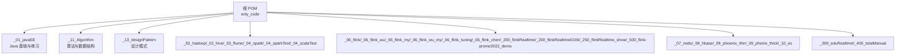
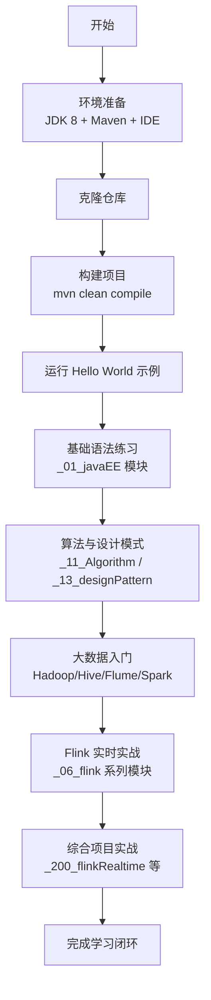
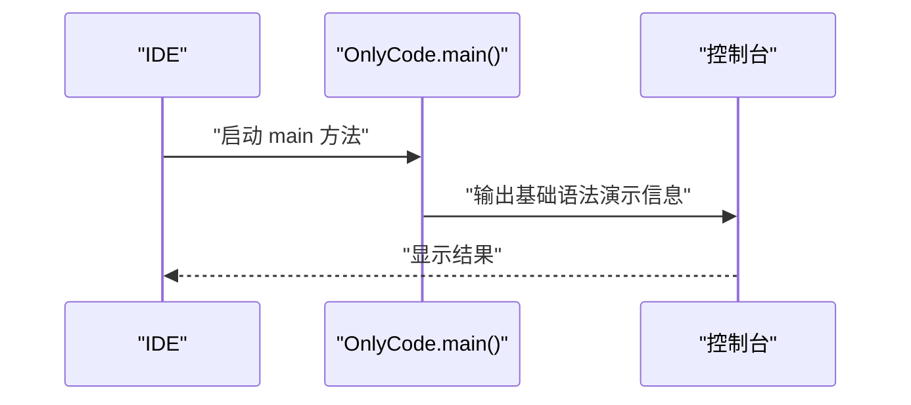
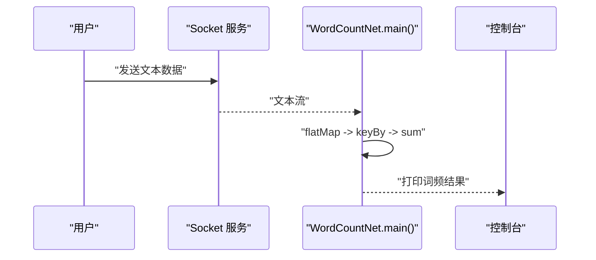
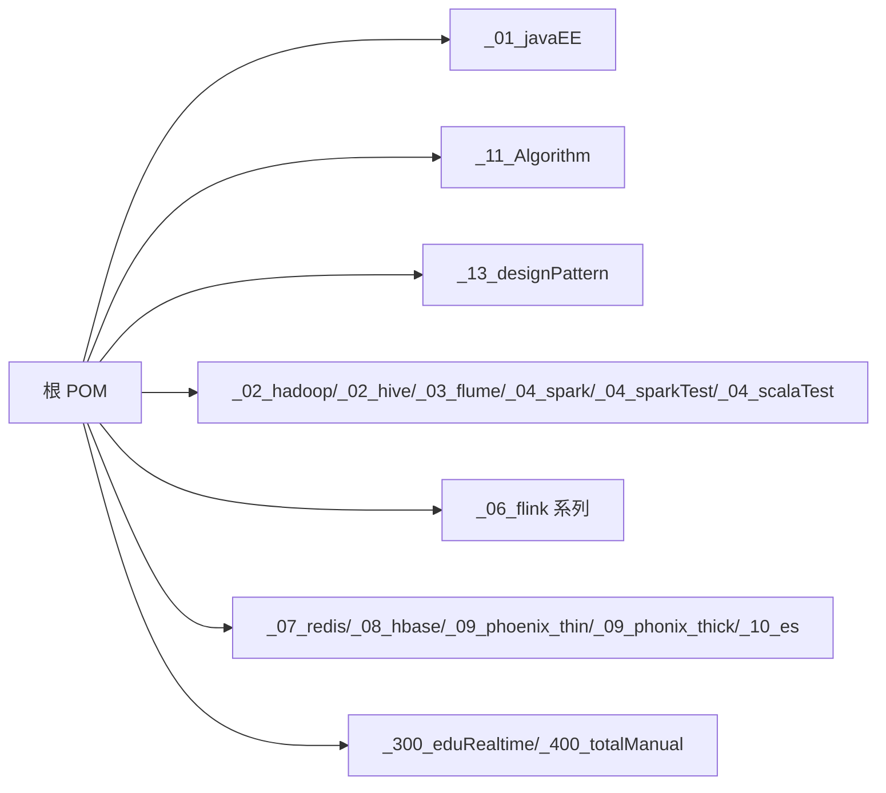

# 快速开始

<cite>
**本文引用的文件**
- [根 POM 文件](file://pom.xml)
- [Java 基础示例：OnlyCode.java](file://_01_javaEE/src/main/java/_01_基础语法/OnlyCode.java)
- [Java 基础示例：Array.java](file://_01_javaEE/src/main/java/_01_基础语法/Array.java)
- [Java 基础模块 POM](file://_01_javaEE/pom.xml)
- [Scala 示例：Java01_HelloWorld.java](file://_04_scalaTest/src/main/java/com/atguigu/java/chapter01/Java01_HelloWorld.java)
- [通用示例：App.java](file://_400_totalManual/src/main/java/org/example/App.java)
- [Flink 示例：WordCountNet.java](file://_06_flink/src/main/java/_01_HelloWorld/_01_WordCountNet.java)
- [算法示例：feibo.java](file://_11_Algorithm/src/main/java/_11_递归/feibo.java)
- [设计模式示例：Singleton.java](file://_13_designPattern/src/main/java/Singleton.java)
- [Flink 日志配置示例：log4j.properties](file://_06_flink_wu/src/main/resources/log4j.properties)
- [仓库忽略规则：.gitignore](file://.gitignore)
</cite>

## 目录
1. [简介](#简介)
2. [项目结构](#项目结构)
3. [核心组件](#核心组件)
4. [架构总览](#架构总览)
5. [详细组件分析](#详细组件分析)
6. [依赖分析](#依赖分析)
7. [性能注意事项](#性能注意事项)
8. [故障排查指南](#故障排查指南)
9. [结论](#结论)
10. [附录](#附录)

## 简介
本指南面向首次接触该大型 Java 学习项目的同学，目标是帮助你在最短时间内完成环境准备、项目克隆与构建，并成功运行第一个 Java 程序（包括 Hello World 与基础语法示例）。同时，我们提供循序渐进的学习路径建议，从 Hello World 到复杂实战项目（如 Flink 实时计算），并给出常见问题的排查与调试技巧。

## 项目结构
该仓库采用多模块聚合工程组织，顶层 POM 管理多个子模块，涵盖 Java 基础、算法与设计模式、大数据生态（Hadoop/Hive/Flume/Spark）以及实时流处理（Flink）等方向。你可以按需选择模块进行学习与实践。

图表来源
- [根 POM 文件](file://pom.xml#L1-L60)

章节来源
- [根 POM 文件](file://pom.xml#L1-L60)

## 核心组件
- Java 基础与练习模块：提供大量入门示例，适合零基础起步。
- 算法与设计模式模块：覆盖递归、排序、单例等经典主题。
- 大数据与实时流处理模块：包含 Hadoop、Hive、Flume、Spark、Flink 等实战示例。
- 通用示例与工具：便于快速验证编译与运行环境。

章节来源
- [Java 基础模块 POM](file://_01_javaEE/pom.xml#L1-L60)
- [根 POM 文件](file://pom.xml#L1-L60)

## 架构总览
从“入门到实战”的学习路径建议如下：

## 详细组件分析

### 环境准备与 IDE 设置
- JDK 安装
  - 推荐使用 Java 8（与项目属性一致）。
  - 在系统 PATH 中正确配置 JAVA_HOME 与 java/javac。
- Maven 配置
  - 使用 Maven 3.6+，确保网络可访问中央仓库。
  - 若国内网络较慢，建议配置镜像源。
- IDE 设置
  - 推荐使用 IntelliJ IDEA 或 Eclipse。
  - 导入项目为 Maven 工程，自动下载依赖。
  - 统一编码为 UTF-8，Java 版本设为 1.8。
- 仓库忽略规则
  - 仓库已内置 .gitignore，避免提交编译产物与 IDE 临时文件。

章节来源
- [仓库忽略规则：.gitignore](file://.gitignore#L1-L36)
- [根 POM 文件](file://pom.xml#L52-L71)

### 克隆与构建流程
- 克隆仓库后，在根目录执行构建命令：
  - mvn clean compile
  - 若仅需构建特定模块，可在对应模块目录执行 mvn clean compile。
- 构建完成后，IDE 应能识别所有模块与依赖；若出现依赖缺失，尝试刷新 Maven 依赖或重新导入工程。

章节来源
- [根 POM 文件](file://pom.xml#L115-L141)

### 第一个 Java 程序：Hello World
- 示例位置
  - 通用示例：org.example.App.java
  - Scala 测试中的 Java 示例：com.atguigu.java.chapter01.Java01_HelloWorld.java
- 运行方式
  - 在 IDE 中右键运行 main 方法。
  - 或在模块根目录使用命令行运行（需先编译并打包）。
- 预期结果
  - 控制台输出“Hello World!”或“Hello Java”。

章节来源
- [通用示例：App.java](file://_400_totalManual/src/main/java/org/example/App.java#L1-L14)
- [Scala 示例：Java01_HelloWorld.java](file://_04_scalaTest/src/main/java/com/atguigu/java/chapter01/Java01_HelloWorld.java#L1-L7)

### 基础语法示例与运行
- 示例位置
  - _01_javaEE/src/main/java/_01_基础语法/OnlyCode.java
  - _01_javaEE/src/main/java/_01_基础语法/Array.java
- 运行方式
  - 在 IDE 中直接运行 main 方法。
  - 若需执行 JUnit 测试，可运行对应的 @Test 方法。
- 预期结果
  - 控制台输出基本数据类型、运算符、字符串拼接等信息。

图表来源
- [Java 基础示例：OnlyCode.java](file://_01_javaEE/src/main/java/_01_基础语法/OnlyCode.java#L1-L49)

章节来源
- [Java 基础示例：OnlyCode.java](file://_01_javaEE/src/main/java/_01_基础语法/OnlyCode.java#L1-L116)
- [Java 基础示例：Array.java](file://_01_javaEE/src/main/java/_01_基础语法/Array.java#L1-L23)
- [Java 基础模块 POM](file://_01_javaEE/pom.xml#L1-L60)

### 算法与设计模式入门
- 递归示例：feibo.java（斐波那契递归实现与数组实现）
- 设计模式示例：Singleton.java（单例打印）
- 运行方式
  - 直接运行 main 方法查看输出。
  - 运行 @Test 方法验证算法逻辑。

章节来源
- [算法示例：feibo.java](file://_11_Algorithm/src/main/java/_11_递归/feibo.java#L1-L61)
- [设计模式示例：Singleton.java](file://_13_designPattern/src/main/java/Singleton.java#L1-L10)

### Flink 实时计算入门
- 示例位置
  - _06_flink/src/main/java/_01_HelloWorld/_01_WordCountNet.java
- 运行方式
  - 启动本地 Socket 服务（nc -l 9999）模拟数据输入。
  - 在 IDE 中运行 main 方法，观察控制台输出的词频统计结果。
- 日志配置
  - 可参考各模块的 log4j.properties 调整日志级别与输出格式。

图表来源
- [Flink 示例：WordCountNet.java](file://_06_flink/src/main/java/_01_HelloWorld/_01_WordCountNet.java#L1-L57)

章节来源
- [Flink 示例：WordCountNet.java](file://_06_flink/src/main/java/_01_HelloWorld/_01_WordCountNet.java#L1-L57)
- [Flink 日志配置示例：log4j.properties](file://_06_flink_wu/src/main/resources/log4j.properties#L1-L4)

### 学习路径建议
- 阶段一：Hello World 与基础语法
  - 从通用示例与 Java 基础模块入手，熟悉 main 方法、输出语句与基本数据类型。
- 阶段二：算法与设计模式
  - 通过递归与单例等示例，掌握常见算法思想与设计模式。
- 阶段三：大数据入门
  - 选择 Hadoop/Hive/Flume/Spark 中的一个方向，结合官方文档与示例理解生态组件。
- 阶段四：Flink 实时实战
  - 从 WordCountNet 开始，逐步深入窗口、状态、检查点等特性。
- 阶段五：综合项目实战
  - 结合 _200_flinkRealtime 等模块，完成端到端的实时项目练习。

## 依赖分析
- 语言与工具
  - Java 8（源与目标版本统一）
  - Maven 插件：maven-compiler-plugin、maven-resources-plugin
- 日志与测试
  - slf4j + logback（日志）
  - junit（单元测试）
- 模块间关系
  - 根 POM 聚合多模块，子模块按功能分层，彼此独立又共享公共依赖与属性。

图表来源
- [根 POM 文件](file://pom.xml#L1-L60)

章节来源
- [根 POM 文件](file://pom.xml#L52-L113)
- [Java 基础模块 POM](file://_01_javaEE/pom.xml#L1-L60)

## 性能注意事项
- 编译与资源处理
  - 使用 maven-compiler-plugin 统一编码与版本，避免兼容性问题。
  - 使用 maven-resources-plugin 统一资源编码，防止中文乱码。
- 运行时优化
  - Flink 示例中可通过调整并行度与状态后端参数提升吞吐。
  - 日志级别建议在开发阶段为 info，生产阶段为 warn/error。

章节来源
- [根 POM 文件](file://pom.xml#L115-L141)

## 故障排查指南
- 构建失败（找不到符号/编译错误）
  - 确认 JDK 版本为 1.8，且 Maven 使用的 Java 与之匹配。
  - 在 IDE 中刷新 Maven 依赖，清理并重新编译。
- 控制台无输出或输出异常
  - 检查 log4j.properties 日志级别是否过高导致未打印。
  - 对于 Flink 示例，确认 Socket 服务已启动且端口正确。
- 字符乱码
  - 统一项目编码为 UTF-8，检查 IDE 与 Maven 的 encoding 配置。
- 依赖缺失
  - 确认网络可访问 Maven 仓库，必要时配置镜像源并重试。

章节来源
- [Flink 日志配置示例：log4j.properties](file://_06_flink_wu/src/main/resources/log4j.properties#L1-L4)
- [根 POM 文件](file://pom.xml#L115-L141)
- [仓库忽略规则：.gitignore](file://.gitignore#L1-L36)

## 结论
通过本指南，你可以在本地快速完成环境搭建、项目构建与首个 Java 程序运行，并沿着“基础语法 → 算法与设计模式 → 大数据入门 → Flink 实时实战 → 综合项目实战”的路径稳步提升。遇到问题时，优先检查 JDK/Maven/IDE 配置与日志输出，结合本指南的排障建议即可高效解决。

## 附录
- 快速命令清单
  - 克隆：git clone <仓库地址>
  - 构建：mvn clean compile
  - 运行示例：在 IDE 中运行 main 方法
- 常用示例定位
  - Hello World：org.example.App.java
  - 基础语法：_01_javaEE/src/main/java/_01_基础语法/*.java
  - 算法与设计模式：_11_Algorithm/src/main/java/_11_递归/*.java，_13_designPattern/src/main/java/*.java
  - Flink 实时：_06_flink/src/main/java/_01_HelloWorld/*.java