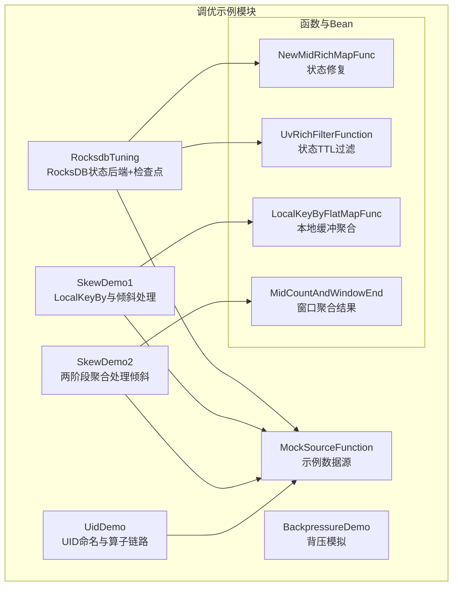
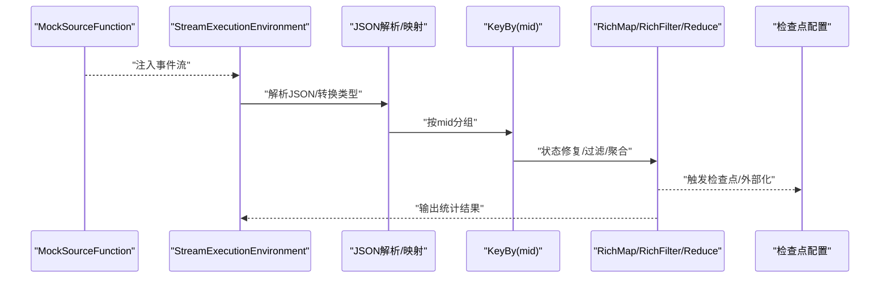
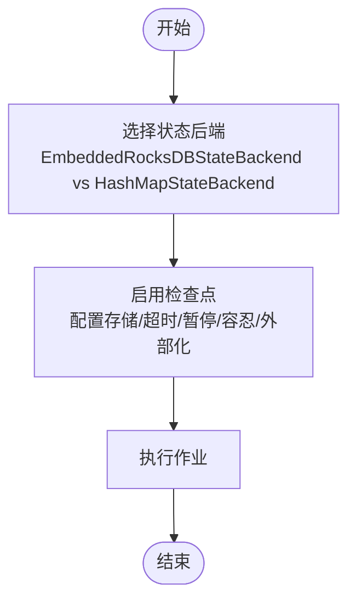
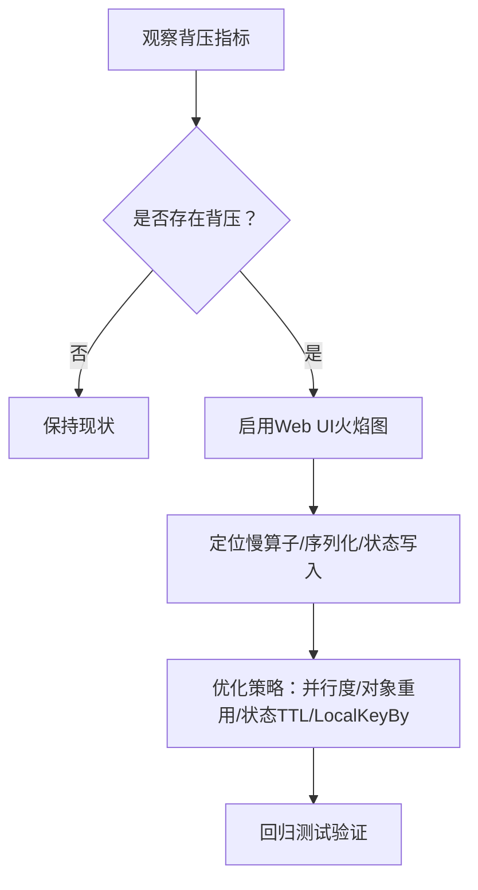
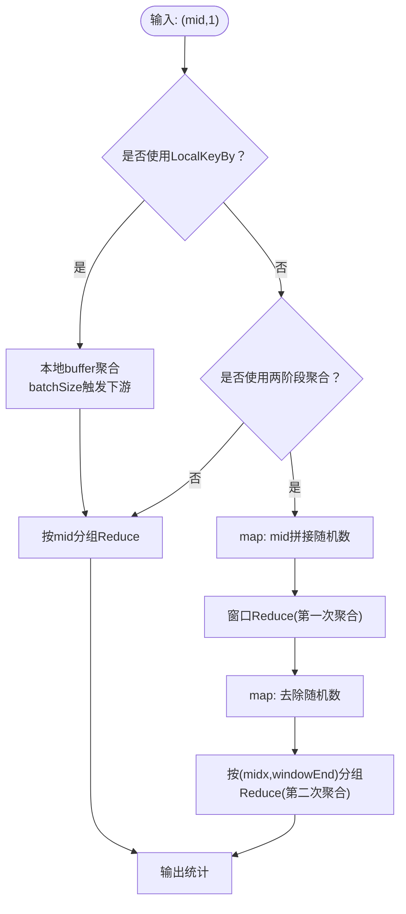
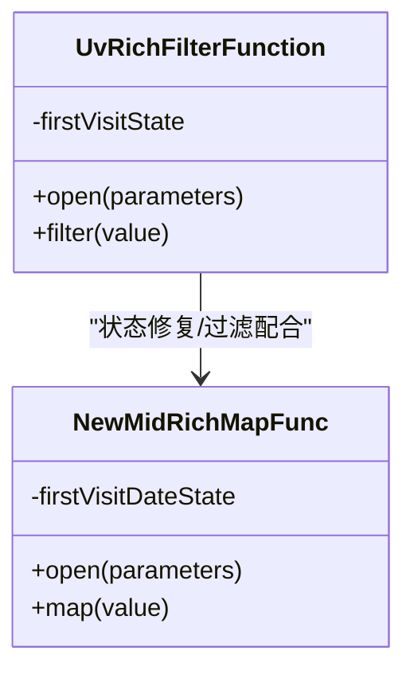
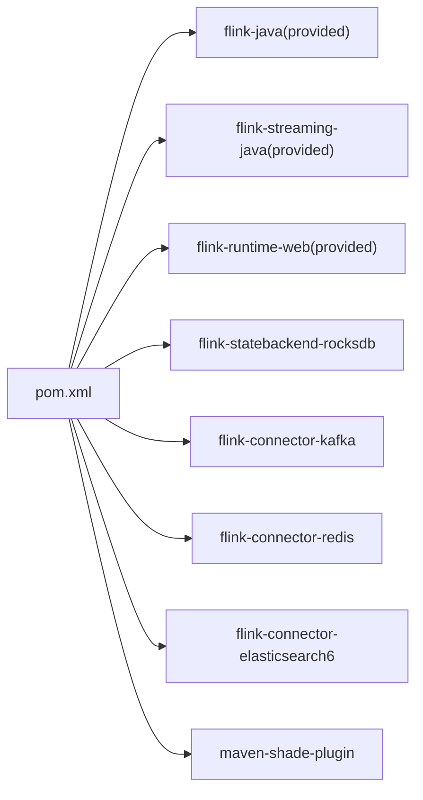

# Flink性能调优

<cite>
**本文引用的文件**
- [RocksdbTuning.java](file://_06_flink_tuning/src/main/java/com/atguigu/flink/tuning/RocksdbTuning.java)
- [BackpressureDemo.java](file://_06_flink_tuning/src/main/java/com/atguigu/flink/tuning/BackpressureDemo.java)
- [SkewDemo1.java](file://_06_flink_tuning/src/main/java/com/atguigu/flink/tuning/SkewDemo1.java)
- [SkewDemo2.java](file://_06_flink_tuning/src/main/java/com/atguigu/flink/tuning/SkewDemo2.java)
- [UidDemo.java](file://_06_flink_tuning/src/main/java/com/atguigu/flink/tuning/UidDemo.java)
- [NewMidRichMapFunc.java](file://_06_flink_tuning/src/main/java/com/atguigu/flink/tuning/function/NewMidRichMapFunc.java)
- [UvRichFilterFunction.java](file://_06_flink_tuning/src/main/java/com/atguigu/flink/tuning/function/UvRichFilterFunction.java)
- [LocalKeyByFlatMapFunc.java](file://_06_flink_tuning/src/main/java/com/atguigu/flink/tuning/function/LocalKeyByFlatMapFunc.java)
- [MidCountAndWindowEnd.java](file://_06_flink_tuning/src/main/java/com/atguigu/flink/tuning/bean/MidCountAndWindowEnd.java)
- [MockSourceFunction.java](file://_06_flink_tuning/src/main/java/com/atguigu/flink/source/MockSourceFunction.java)
- [flink调优.md](file://_06_flink_tuning/flink调优.md)
- [pom.xml](file://_06_flink_tuning/pom.xml)
</cite>

## 目录
1. [引言](#引言)
2. [项目结构](#项目结构)
3. [核心组件](#核心组件)
4. [架构总览](#架构总览)
5. [详细组件分析](#详细组件分析)
6. [依赖关系分析](#依赖关系分析)
7. [性能考虑](#性能考虑)
8. [故障排查指南](#故障排查指南)
9. [结论](#结论)
10. [附录](#附录)

## 引言
本技术文档围绕Flink流处理系统的性能调优展开，聚焦于内存管理、网络优化、状态后端配置、检查点优化、RocksDB调优、数据倾斜处理、背压监控与诊断，并结合仓库中的示例工程给出可操作的参数调整、并行度优化与资源分配建议。文档同时提供性能监控指标解读、性能测试方法与工具使用建议，并通过具体调优点与实践路径帮助开发者快速落地。

## 项目结构
该调优示例工程位于 _06_flink_tuning 目录，包含若干演示类与函数，分别覆盖以下主题：
- RocksDB状态后端与检查点配置
- 背压模拟与诊断
- 数据倾斜处理（LocalKeyBy与两阶段聚合）
- UID命名与算子链路可视化
- 状态TTL与对象重用
- 示例数据源

图示来源
- [RocksdbTuning.java](file://_06_flink_tuning/src/main/java/com/atguigu/flink/tuning/RocksdbTuning.java#L1-L76)
- [BackpressureDemo.java](file://_06_flink_tuning/src/main/java/com/atguigu/flink/tuning/BackpressureDemo.java#L1-L66)
- [SkewDemo1.java](file://_06_flink_tuning/src/main/java/com/atguigu/flink/tuning/SkewDemo1.java#L1-L74)
- [SkewDemo2.java](file://_06_flink_tuning/src/main/java/com/atguigu/flink/tuning/SkewDemo2.java#L1-L124)
- [UidDemo.java](file://_06_flink_tuning/src/main/java/com/atguigu/flink/tuning/UidDemo.java#L1-L74)
- [NewMidRichMapFunc.java](file://_06_flink_tuning/src/main/java/com/atguigu/flink/tuning/function/NewMidRichMapFunc.java#L1-L49)
- [UvRichFilterFunction.java](file://_06_flink_tuning/src/main/java/com/atguigu/flink/tuning/function/UvRichFilterFunction.java#L1-L60)
- [LocalKeyByFlatMapFunc.java](file://_06_flink_tuning/src/main/java/com/atguigu/flink/tuning/function/LocalKeyByFlatMapFunc.java#L1-L95)
- [MidCountAndWindowEnd.java](file://_06_flink_tuning/src/main/java/com/atguigu/flink/tuning/bean/MidCountAndWindowEnd.java#L1-L17)
- [MockSourceFunction.java](file://_06_flink_tuning/src/main/java/com/atguigu/flink/source/MockSourceFunction.java)

章节来源
- [pom.xml](file://_06_flink_tuning/pom.xml#L1-L182)

## 核心组件
- 状态后端与检查点配置：通过EmbeddedRocksDBStateBackend与HashMapStateBackend对比，演示检查点存储、超时、最小暂停间隔与外部化检查点清理策略。
- 背压诊断：通过人为制造计算瓶颈，验证背压监控与定位方法。
- 数据倾斜处理：LocalKeyBy与两阶段聚合两种策略，降低单分区热点。
- 状态TTL与对象重用：通过状态TTL避免无限增长，启用对象重用减少GC压力。
- UID命名与算子链路：为关键算子设置UID与名称，便于Web UI与指标观测。
- 示例数据源：MockSourceFunction提供结构化事件流，便于复现实战场景。

章节来源
- [RocksdbTuning.java](file://_06_flink_tuning/src/main/java/com/atguigu/flink/tuning/RocksdbTuning.java#L1-L76)
- [BackpressureDemo.java](file://_06_flink_tuning/src/main/java/com/atguigu/flink/tuning/BackpressureDemo.java#L1-L66)
- [SkewDemo1.java](file://_06_flink_tuning/src/main/java/com/atguigu/flink/tuning/SkewDemo1.java#L1-L74)
- [SkewDemo2.java](file://_06_flink_tuning/src/main/java/com/atguigu/flink/tuning/SkewDemo2.java#L1-L124)
- [UidDemo.java](file://_06_flink_tuning/src/main/java/com/atguigu/flink/tuning/UidDemo.java#L1-L74)
- [NewMidRichMapFunc.java](file://_06_flink_tuning/src/main/java/com/atguigu/flink/tuning/function/NewMidRichMapFunc.java#L1-L49)
- [UvRichFilterFunction.java](file://_06_flink_tuning/src/main/java/com/atguigu/flink/tuning/function/UvRichFilterFunction.java#L1-L60)
- [LocalKeyByFlatMapFunc.java](file://_06_flink_tuning/src/main/java/com/atguigu/flink/tuning/function/LocalKeyByFlatMapFunc.java#L1-L95)
- [MockSourceFunction.java](file://_06_flink_tuning/src/main/java/com/atguigu/flink/source/MockSourceFunction.java)

## 架构总览
下图展示了调优示例的整体数据流：数据源产生事件，经解析与过滤，按用户维度进行状态化处理或窗口聚合，最终输出统计结果。

图示来源
- [RocksdbTuning.java](file://_06_flink_tuning/src/main/java/com/atguigu/flink/tuning/RocksdbTuning.java#L33-L71)
- [UidDemo.java](file://_06_flink_tuning/src/main/java/com/atguigu/flink/tuning/UidDemo.java#L36-L67)
- [MockSourceFunction.java](file://_06_flink_tuning/src/main/java/com/atguigu/flink/source/MockSourceFunction.java)

## 详细组件分析

### RocksDB状态后端与检查点优化
- 状态后端选择：EmbeddedRocksDBStateBackend适合大状态场景；HashMapStateBackend适合小状态或快速验证。
- 检查点配置要点：存储位置、超时、最小暂停间隔、失败容忍数、外部化清理策略。
- 适用场景：高吞吐、长窗口、大状态键空间、需要精确一致性保障。

图示来源
- [RocksdbTuning.java](file://_06_flink_tuning/src/main/java/com/atguigu/flink/tuning/RocksdbTuning.java#L33-L44)

章节来源
- [RocksdbTuning.java](file://_06_flink_tuning/src/main/java/com/atguigu/flink/tuning/RocksdbTuning.java#L1-L76)

### 背压监控与诊断
- 背压原理：下游缓冲区阻塞导致上游背压，表现为下游处理延迟增大。
- 诊断步骤：开启Web UI火焰图、观察算子链路、定位慢算子、分析序列化/反序列化与状态写入。
- 工程实践：在示例中通过人为增加CPU密集计算，复现背压现象，便于训练诊断能力。

图示来源
- [BackpressureDemo.java](file://_06_flink_tuning/src/main/java/com/atguigu/flink/tuning/BackpressureDemo.java#L1-L66)

章节来源
- [BackpressureDemo.java](file://_06_flink_tuning/src/main/java/com/atguigu/flink/tuning/BackpressureDemo.java#L1-L66)

### 数据倾斜处理：LocalKeyBy与两阶段聚合
- LocalKeyBy思路：在分区前做本地聚合，减少跨分区数据量，再进行全局聚合。
- 两阶段聚合思路：对键附加随机后缀打散，先窗口内聚合，再还原键并二次聚合汇总。
- 适用场景：少数键占比极高、窗口聚合存在热点。

图示来源
- [SkewDemo1.java](file://_06_flink_tuning/src/main/java/com/atguigu/flink/tuning/SkewDemo1.java#L56-L70)
- [SkewDemo2.java](file://_06_flink_tuning/src/main/java/com/atguigu/flink/tuning/SkewDemo2.java#L72-L119)
- [LocalKeyByFlatMapFunc.java](file://_06_flink_tuning/src/main/java/com/atguigu/flink/tuning/function/LocalKeyByFlatMapFunc.java#L1-L95)

章节来源
- [SkewDemo1.java](file://_06_flink_tuning/src/main/java/com/atguigu/flink/tuning/SkewDemo1.java#L1-L74)
- [SkewDemo2.java](file://_06_flink_tuning/src/main/java/com/atguigu/flink/tuning/SkewDemo2.java#L1-L124)
- [LocalKeyByFlatMapFunc.java](file://_06_flink_tuning/src/main/java/com/atguigu/flink/tuning/function/LocalKeyByFlatMapFunc.java#L1-L95)

### 状态TTL与对象重用
- 状态TTL：为ValueState设置TTL，避免长期累积导致状态膨胀。
- 对象重用：启用对象重用减少频繁GC，提升吞吐。
- 实践：在Rich函数中声明状态并在open中初始化，配合TTL配置。

图示来源
- [UvRichFilterFunction.java](file://_06_flink_tuning/src/main/java/com/atguigu/flink/tuning/function/UvRichFilterFunction.java#L1-L60)
- [NewMidRichMapFunc.java](file://_06_flink_tuning/src/main/java/com/atguigu/flink/tuning/function/NewMidRichMapFunc.java#L1-L49)

章节来源
- [UidDemo.java](file://_06_flink_tuning/src/main/java/com/atguigu/flink/tuning/UidDemo.java#L1-L74)
- [UvRichFilterFunction.java](file://_06_flink_tuning/src/main/java/com/atguigu/flink/tuning/function/UvRichFilterFunction.java#L1-L60)
- [NewMidRichMapFunc.java](file://_06_flink_tuning/src/main/java/com/atguigu/flink/tuning/function/NewMidRichMapFunc.java#L1-L49)

### UID命名与算子链路可视化
- 为关键算子设置UID与名称，有助于在Web UI中识别链路、定位问题。
- 在调试与生产排障中，清晰的链路标识能显著提升效率。

章节来源
- [UidDemo.java](file://_06_flink_tuning/src/main/java/com/atguigu/flink/tuning/UidDemo.java#L36-L67)

### 示例数据源与状态模型
- MockSourceFunction：提供结构化事件流，便于复现实战场景。
- MidCountAndWindowEnd：承载窗口聚合后的中间结果，支持两阶段聚合的二次汇总。

章节来源
- [MockSourceFunction.java](file://_06_flink_tuning/src/main/java/com/atguigu/flink/source/MockSourceFunction.java)
- [MidCountAndWindowEnd.java](file://_06_flink_tuning/src/main/java/com/atguigu/flink/tuning/bean/MidCountAndWindowEnd.java#L1-L17)

## 依赖关系分析
- Flink版本与Scala二进制版本：1.13.1，Scala 2.11。
- 关键依赖：flink-streaming-java、flink-runtime-web、flink-statebackend-rocksdb、flink-connector-kafka、flink-connector-redis、flink-connector-elasticsearch6。
- 打包插件：maven-shade-plugin，排除签名与日志相关依赖，避免冲突。

图示来源
- [pom.xml](file://_06_flink_tuning/pom.xml#L1-L182)

章节来源
- [pom.xml](file://_06_flink_tuning/pom.xml#L1-L182)

## 性能考虑
- 内存管理
  - 启用对象重用，减少GC停顿与内存抖动。
  - 使用状态TTL限制状态规模，避免无限增长。
  - 控制算子缓冲与批大小，平衡延迟与吞吐。
- 网络优化
  - 适当提高网络缓冲与序列化器性能，减少序列化开销。
  - 合理设置并行度，避免过度分区导致调度与网络放大。
- 状态后端与检查点
  - 大状态优先使用RocksDB，结合外部存储与外部化检查点。
  - 调整检查点超时、最小暂停间隔与失败容忍，确保稳定性。
- 数据倾斜
  - LocalKeyBy与两阶段聚合是通用解法，需权衡延迟与一致性。
- 背压监控
  - 通过Web UI火焰图与背压指标定位瓶颈，优先优化慢算子与状态写入。
- 并行度与资源
  - 以任务槽为核心单位分配CPU与堆内存，避免单槽超配导致竞争。
  - 通过压测确定最优并行度，结合水位线与窗口策略评估延迟目标。

## 故障排查指南
- 背压高
  - 步骤：启用火焰图、查看算子链路、定位慢算子、检查序列化/状态写入。
  - 建议：提升并行度、启用对象重用、采用LocalKeyBy或两阶段聚合。
- 状态膨胀
  - 步骤：检查状态TTL配置、确认键空间是否收敛、评估RocksDB配置。
  - 建议：引入TTL、拆分状态、使用RocksDB优化参数。
- 检查点失败
  - 步骤：查看检查点超时、存储可用性、失败容忍阈值。
  - 建议：延长超时、切换外部存储、降低检查点频率或优化RocksDB刷盘策略。
- 窗口聚合倾斜
  - 步骤：观察热点键分布、评估LocalKeyBy或两阶段聚合参数。
  - 建议：调整随机后缀数量、窗口长度与批触发策略。

章节来源
- [BackpressureDemo.java](file://_06_flink_tuning/src/main/java/com/atguigu/flink/tuning/BackpressureDemo.java#L1-L66)
- [SkewDemo1.java](file://_06_flink_tuning/src/main/java/com/atguigu/flink/tuning/SkewDemo1.java#L1-L74)
- [SkewDemo2.java](file://_06_flink_tuning/src/main/java/com/atguigu/flink/tuning/SkewDemo2.java#L1-L124)
- [RocksdbTuning.java](file://_06_flink_tuning/src/main/java/com/atguigu/flink/tuning/RocksdbTuning.java#L33-L44)

## 结论
通过对状态后端、检查点、数据倾斜、背压与资源分配的系统性调优，可显著提升Flink作业的吞吐与稳定性。建议在开发环境先行验证参数组合，在预生产逐步放量，最终在生产以监控指标为依据持续迭代。结合本仓库中的示例，开发者可快速搭建可复现的调优实验，形成可落地的优化方案。

## 附录
- 参考文档：资源配置调优（见flink调优.md）
- 版本与依赖：见pom.xml

章节来源
- [flink调优.md](file://_06_flink_tuning/flink调优.md#L1-L10)
- [pom.xml](file://_06_flink_tuning/pom.xml#L1-L182)