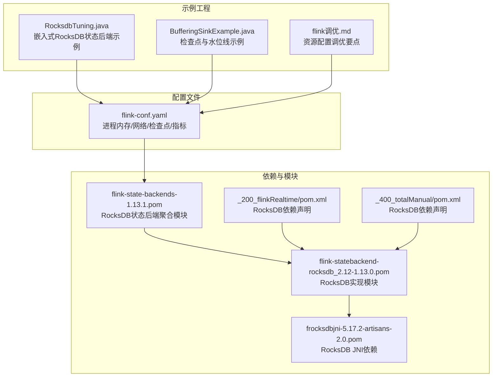
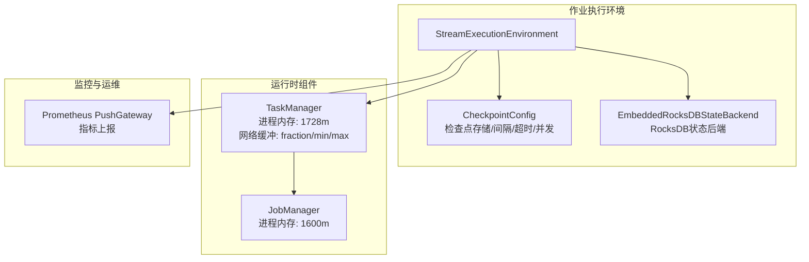
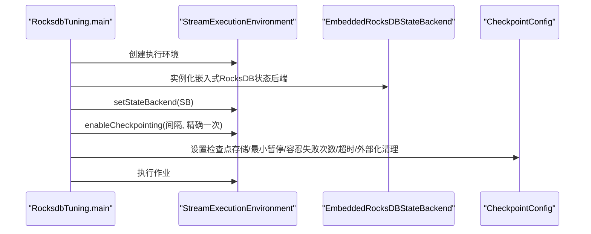
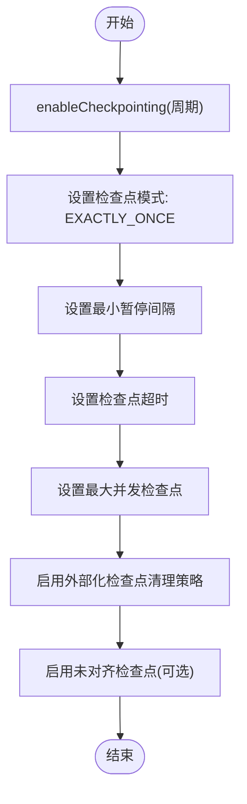
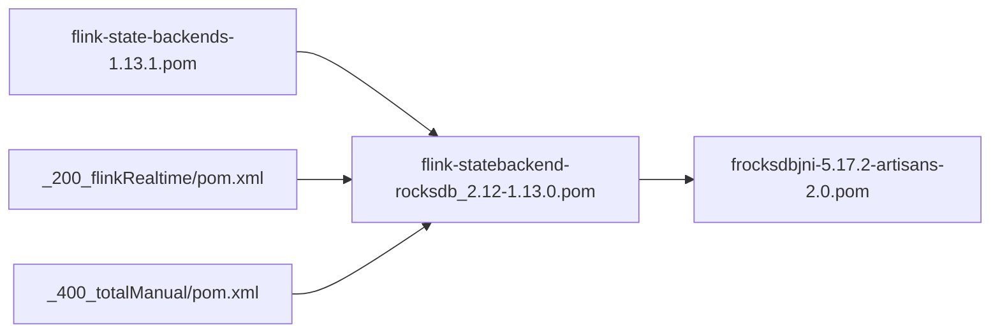

# 内存管理优化

<cite>
**本文引用的文件**
- [RocksdbTuning.java](file://_06_flink_tuning/src/main/java/com/atguigu/flink/tuning/RocksdbTuning.java)
- [flink-conf.yaml](file://_500_flink-prome2022_demo/src/main/resources/flink-conf.yaml)
- [BufferingSinkExample.java](file://_06_flink_wu/src/main/java/com/atguigu/chatper09/BufferingSinkExample.java)
- [flink调优.md](file://_06_flink_tuning/flink调优.md)
- [flink-state-backends-1.13.1.pom](file://org/apache/flink/flink-state-backends/1.13.1/flink-state-backends-1.13.1.pom)
- [flink-statebackend-rocksdb_2.12-1.13.0.pom](file://org/apache/flink/flink-statebackend-rocksdb_2.12/1.13.0/flink-statebackend-rocksdb_2.12-1.13.0.pom)
- [frocksdbjni-5.17.2-artisans-2.0.pom](file://com/data-artisans/frocksdbjni/5.17.2-artisans-2.0/frocksdbjni-5.17.2-artisans-2.0.pom)
- [_200_flinkRealtime/pom.xml](file://_200_flinkRealtime/pom.xml)
- [_400_totalManual/pom.xml](file://_400_totalManual/pom.xml)
</cite>

## 目录
1. [引言](#引言)
2. [项目结构](#项目结构)
3. [核心组件](#核心组件)
4. [架构总览](#架构总览)
5. [详细组件分析](#详细组件分析)
6. [依赖关系分析](#依赖关系分析)
7. [性能考量](#性能考量)
8. [故障排查指南](#故障排查指南)
9. [结论](#结论)
10. [附录](#附录)

## 引言
本技术文档聚焦于Flink作业的内存管理优化，围绕以下主题展开：JVM堆内存与堆外内存的配置策略、垃圾回收器选择建议、RocksDB状态后端的内存优化（含内存池、压缩策略、缓存配置）、监控指标解读、内存泄漏诊断与预防，以及结合仓库中的示例工程给出可落地的调优步骤与实践路径。读者无需深入源码即可理解并应用这些优化策略。

## 项目结构
该仓库包含多个与Flink相关的模块，其中与内存管理直接相关的关键文件如下：
- 示例工程：RocksDB内存优化示例、检查点配置示例、Prometheus指标推送配置
- 配置文件：Flink集群内存参数、网络缓冲、检查点与状态后端等
- 依赖声明：RocksDB状态后端及JNI依赖的版本信息

**图表来源**
- [RocksdbTuning.java](file://_06_flink_tuning/src/main/java/com/atguigu/flink/tuning/RocksdbTuning.java#L1-L76)
- [BufferingSinkExample.java](file://_06_flink_wu/src/main/java/com/atguigu/chatper09/BufferingSinkExample.java#L29-L56)
- [flink调优.md](file://_06_flink_tuning/flink调优.md#L1-L10)
- [flink-conf.yaml](file://_500_flink-prome2022_demo/src/main/resources/flink-conf.yaml#L26-L216)
- [flink-state-backends-1.13.1.pom](file://org/apache/flink/flink-state-backends/1.13.1/flink-state-backends-1.13.1.pom#L1-L44)
- [flink-statebackend-rocksdb_2.12-1.13.0.pom](file://org/apache/flink/flink-statebackend-rocksdb_2.12/1.13.0/flink-statebackend-rocksdb_2.12-1.13.0.pom#L1-L33)
- [frocksdbjni-5.17.2-artisans-2.0.pom](file://com/data-artisans/frocksdbjni/5.17.2-artisans-2.0/frocksdbjni-5.17.2-artisans-2.0.pom#L1-L45)
- [_200_flinkRealtime/pom.xml](file://_200_flinkRealtime/pom.xml#L177-L210)
- [_400_totalManual/pom.xml](file://_400_totalManual/pom.xml#L175-L210)

**章节来源**
- [RocksdbTuning.java](file://_06_flink_tuning/src/main/java/com/atguigu/flink/tuning/RocksdbTuning.java#L1-L76)
- [flink-conf.yaml](file://_500_flink-prome2022_demo/src/main/resources/flink-conf.yaml#L26-L216)
- [flink-state-backends-1.13.1.pom](file://org/apache/flink/flink-state-backends/1.13.1/flink-state-backends-1.13.1.pom#L1-L44)
- [flink-statebackend-rocksdb_2.12-1.13.0.pom](file://org/apache/flink/flink-statebackend-rocksdb_2.12/1.13.0/flink-statebackend-rocksdb_2.12-1.13.0.pom#L1-L33)
- [frocksdbjni-5.17.2-artisans-2.0.pom](file://com/data-artisans/frocksdbjni/5.17.2-artisans-2.0/frocksdbjni-5.17.2-artisans-2.0.pom#L1-L45)
- [_200_flinkRealtime/pom.xml](file://_200_flinkRealtime/pom.xml#L177-L210)
- [_400_totalManual/pom.xml](file://_400_totalManual/pom.xml#L175-L210)

## 核心组件
- 嵌入式RocksDB状态后端示例：演示如何启用RocksDB作为状态后端，并进行检查点配置与外部化检查点清理策略设置。
- 检查点与水位线示例：展示检查点间隔、超时、并发数、未对齐检查点等配置，有助于降低内存峰值与GC压力。
- 集群内存与网络配置：通过Flink配置文件设置JobManager/TaskManager进程内存、网络缓冲比例与最小/最大值，为整体内存规划提供依据。
- Prometheus指标推送：配置PushGateway以采集Flink运行指标，便于监控内存相关指标。

**章节来源**
- [RocksdbTuning.java](file://_06_flink_tuning/src/main/java/com/atguigu/flink/tuning/RocksdbTuning.java#L1-L76)
- [BufferingSinkExample.java](file://_06_flink_wu/src/main/java/com/atguigu/chatper09/BufferingSinkExample.java#L29-L56)
- [flink-conf.yaml](file://_500_flink-prome2022_demo/src/main/resources/flink-conf.yaml#L26-L216)
- [flink-conf.yaml](file://_500_flink-prome2022_demo/src/main/resources/flink-conf.yaml#L258-L269)

## 架构总览
下图展示了基于嵌入式RocksDB的状态后端在Flink作业中的位置与交互关系，以及与检查点、网络缓冲、指标系统的关系。

**图表来源**
- [RocksdbTuning.java](file://_06_flink_tuning/src/main/java/com/atguigu/flink/tuning/RocksdbTuning.java#L22-L44)
- [flink-conf.yaml](file://_500_flink-prome2022_demo/src/main/resources/flink-conf.yaml#L26-L216)
- [flink-conf.yaml](file://_500_flink-prome2022_demo/src/main/resources/flink-conf.yaml#L258-L269)

## 详细组件分析

### 组件A：RocksDB状态后端与检查点配置
该组件通过嵌入式RocksDB状态后端实现大状态的持久化与高效读写，同时配合检查点策略降低内存峰值与恢复时间。

**图表来源**
- [RocksdbTuning.java](file://_06_flink_tuning/src/main/java/com/atguigu/flink/tuning/RocksdbTuning.java#L22-L44)

**章节来源**
- [RocksdbTuning.java](file://_06_flink_tuning/src/main/java/com/atguigu/flink/tuning/RocksdbTuning.java#L1-L76)

### 组件B：检查点与背压示例（BufferingSinkExample）
该示例展示了检查点模式、最小暂停、超时、并发限制与未对齐检查点的配置，有助于在高吞吐场景下平衡内存占用与稳定性。

**图表来源**
- [BufferingSinkExample.java](file://_06_flink_wu/src/main/java/com/atguigu/chatper09/BufferingSinkExample.java#L29-L56)

**章节来源**
- [BufferingSinkExample.java](file://_06_flink_wu/src/main/java/com/atguigu/chatper09/BufferingSinkExample.java#L29-L56)

### 组件C：RocksDB内存池与压缩策略（概念性说明）
- 内存池：RocksDB内部维护写缓存、块缓存与合并操作的内存池。合理设置写缓存大小可减少磁盘写放大；块缓存大小影响读放大。
- 压缩策略：根据数据特征选择合适的压缩算法（如ZSTD/LZ4），在CPU与I/O之间权衡。
- 缓存配置：结合作业的键空间分布与热点数据比例，调整块缓存与索引/过滤器缓存占比，降低冷数据带来的内存占用。

[本节为概念性说明，不直接分析具体文件，故无“章节来源”]

### 组件D：JVM堆内存与堆外内存（概念性说明）
- 堆内存：通过Flink配置文件设置TaskManager进程内存总量，避免因堆过小导致频繁GC或OOM。
- 堆外内存：RocksDB状态后端会使用堆外内存存储状态数据，需确保操作系统允许的内存限额与容器资源配额满足需求。
- GC策略：在高延迟敏感场景优先选择低停顿GC（如G1/Generational-Zero），并结合堆外内存监控避免突发抖动。

[本节为概念性说明，不直接分析具体文件，故无“章节来源”]

### 组件E：监控指标与内存泄漏诊断（概念性说明）
- 关键指标：堆内存使用率、GC时延/频率、RocksDB写入队列长度、检查点完成时延、背压比例。
- 诊断方法：对比不同配置下的GC日志与指标曲线，定位异常增长的阶段；结合外部化检查点与快照目录清理策略，避免状态膨胀引发的内存压力。
- 预防措施：定期评估状态键数量与单键状态大小，采用合适的状态后端与序列化格式；控制窗口/状态生命周期，及时清理过期状态。

[本节为概念性说明，不直接分析具体文件，故无“章节来源”]

## 依赖关系分析
RocksDB状态后端的依赖链路如下：

**图表来源**
- [flink-state-backends-1.13.1.pom](file://org/apache/flink/flink-state-backends/1.13.1/flink-state-backends-1.13.1.pom#L1-L44)
- [flink-statebackend-rocksdb_2.12-1.13.0.pom](file://org/apache/flink/flink-statebackend-rocksdb_2.12/1.13.0/flink-statebackend-rocksdb_2.12-1.13.0.pom#L1-L33)
- [frocksdbjni-5.17.2-artisans-2.0.pom](file://com/data-artisans/frocksdbjni/5.17.2-artisans-2.0/frocksdbjni-5.17.2-artisans-2.0.pom#L1-L45)
- [_200_flinkRealtime/pom.xml](file://_200_flinkRealtime/pom.xml#L177-L210)
- [_400_totalManual/pom.xml](file://_400_totalManual/pom.xml#L175-L210)

**章节来源**
- [flink-state-backends-1.13.1.pom](file://org/apache/flink/flink-state-backends/1.13.1/flink-state-backends-1.13.1.pom#L1-L44)
- [flink-statebackend-rocksdb_2.12-1.13.0.pom](file://org/apache/flink/flink-statebackend-rocksdb_2.12/1.13.0/flink-statebackend-rocksdb_2.12-1.13.0.pom#L1-L33)
- [frocksdbjni-5.17.2-artisans-2.0.pom](file://com/data-artisans/frocksdbjni/5.17.2-artisans-2.0/frocksdbjni-5.17.2-artisans-2.0.pom#L1-L45)
- [_200_flinkRealtime/pom.xml](file://_200_flinkRealtime/pom.xml#L177-L210)
- [_400_totalManual/pom.xml](file://_400_totalManual/pom.xml#L175-L210)

## 性能考量
- 检查点周期与超时：缩短周期可降低状态增长速度，但会增加IO与GC压力；适当提高超时与最小暂停间隔可缓解瞬时峰值。
- 并发检查点：限制并发数可避免多检查点竞争资源；未对齐检查点在高吞吐场景下可降低等待时间。
- 网络缓冲：在网络带宽受限时，适度调整网络缓冲比例与上下限，避免缓冲不足导致的阻塞。
- RocksDB写缓存与块缓存：根据键分布与热点比例调整，减少磁盘写放大与读放大。
- GC策略：在低延迟场景优先选择低停顿GC；结合堆外内存监控，避免突发抖动。

[本节提供通用指导，不直接分析具体文件，故无“章节来源”]

## 故障排查指南
- 检查点失败与超时：检查最小暂停间隔、超时配置与外部化清理策略是否匹配当前IO能力。
- 背压与内存峰值：通过指标观察背压比例与GC时延，必要时降低检查点并发或延长周期。
- 状态膨胀：确认状态键数量与单键大小，必要时优化状态结构或采用增量检查点。
- 外部化检查点清理：确保清理策略与运维流程一致，避免历史快照占用过多磁盘与内存元数据。

**章节来源**
- [BufferingSinkExample.java](file://_06_flink_wu/src/main/java/com/atguigu/chatper09/BufferingSinkExample.java#L29-L56)
- [RocksdbTuning.java](file://_06_flink_tuning/src/main/java/com/atguigu/flink/tuning/RocksdbTuning.java#L33-L44)

## 结论
通过在示例工程中启用嵌入式RocksDB状态后端，并结合合理的检查点配置、网络缓冲与指标监控，可以在保证稳定性的同时显著降低内存峰值与GC压力。针对不同业务特征（键分布、窗口大小、吞吐量）进一步微调RocksDB缓存与压缩策略，可获得更优的性能表现。

## 附录
- 资源配置调优要点（来自仓库文档片段）：请参考资源配置调优相关条目，结合实际业务规模与硬件条件制定初始参数，再通过压测与监控迭代优化。

**章节来源**
- [flink调优.md](file://_06_flink_tuning/flink调优.md#L1-L10)