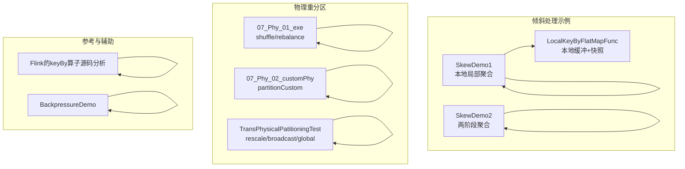
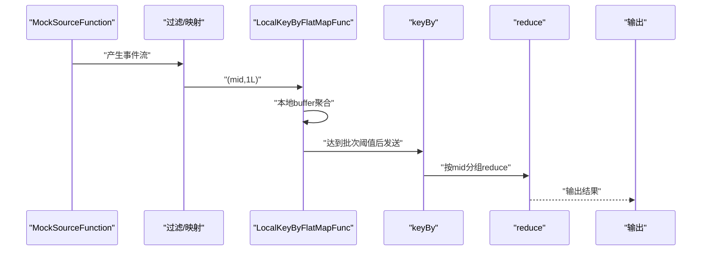
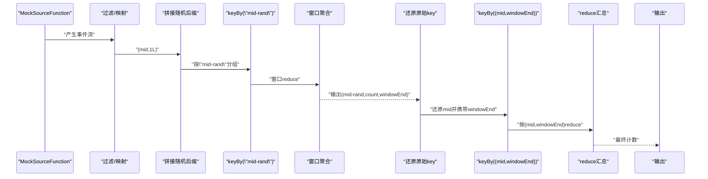
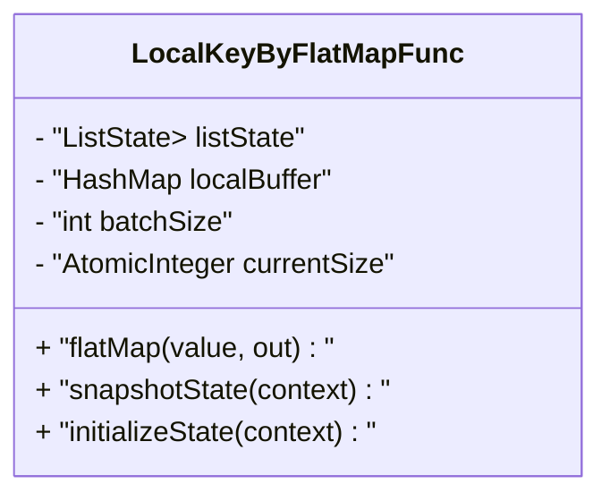
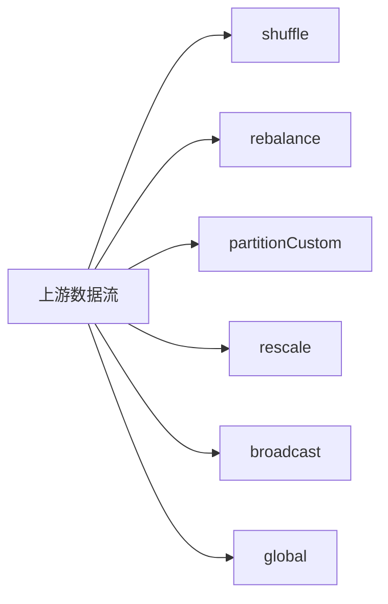
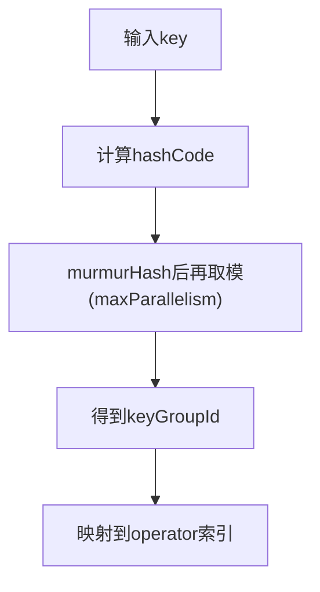
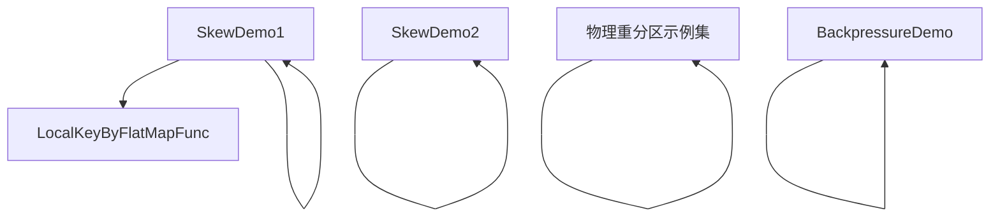

# 数据倾斜处理

<cite>
**本文引用的文件**
- [SkewDemo1.java](file://_06_flink_tuning/src/main/java/com/atguigu/flink/tuning/SkewDemo1.java)
- [SkewDemo2.java](file://_06_flink_tuning/src/main/java/com/atguigu/flink/tuning/SkewDemo2.java)
- [LocalKeyByFlatMapFunc.java](file://_06_flink_tuning/src/main/java/com/atguigu/flink/tuning/function/LocalKeyByFlatMapFunc.java)
- [MidCountAndWindowEnd.java](file://_06_flink_tuning/src/main/java/com/atguigu/flink/tuning/bean/MidCountAndWindowEnd.java)
- [_07_Phy_01_exe.java](file://_06_flink/src/main/java/_07_Phy/_01_exe.java)
- [_07_Phy_02_customPhy.java](file://_06_flink/src/main/java/_07_Phy/_02_customPhy.java)
- [TransPhysicalPatitioningTest.java](file://_06_flink_wu/src/main/java/com/atguigu/chapter05/TransPhysicalPatitioningTest.java)
- [BackpressureDemo.java](file://_06_flink_tuning/src/main/java/com/atguigu/flink/tuning/BackpressureDemo.java)
- [Flink的keyBy算子源码分析.txt](file://_06_flink/Flink的keyBy算子源码分析.txt)
</cite>

## 目录
1. [简介](#简介)
2. [项目结构](#项目结构)
3. [核心组件](#核心组件)
4. [架构总览](#架构总览)
5. [组件详解](#组件详解)
6. [依赖关系分析](#依赖关系分析)
7. [性能考量](#性能考量)
8. [故障排查指南](#故障排查指南)
9. [结论](#结论)
10. [附录](#附录)

## 简介
本技术文档聚焦于Flink作业中的“数据倾斜”问题，系统阐述倾斜的识别、诊断与处理策略。内容涵盖热点Key、分区不均衡等典型场景，结合仓库中的示例工程，给出通过重分区、两阶段聚合（采样预处理）、自定义分区器等手段缓解倾斜的具体实现路径；并提供监控指标建议、倾斜程度评估方法与处理效果验证思路，帮助开发者在实践中快速定位与解决倾斜问题。

## 项目结构
围绕数据倾斜主题，相关代码主要分布在以下模块：
- 调优示例：SkewDemo1、SkewDemo2 展示了两种典型倾斜处理模式（本地局部聚合 + 外部聚合、两阶段聚合）。
- 自定义算子：LocalKeyByFlatMapFunc 提供本地缓冲与快照能力，支撑局部聚合。
- 物理重分区：_07_Phy_* 与 TransPhysicalPatitioningTest 展示 shuffle/rebalance/partitionCustom/rescale/broadcast/global 等分区策略。
- 关键源码参考：Flink的keyBy算子源码分析，解释key分组与operator索引映射机制。
- 背压演示：BackpressureDemo 用于观察背压与瓶颈节点。



图表来源
- [SkewDemo1.java](file://_06_flink_tuning/src/main/java/com/atguigu/flink/tuning/SkewDemo1.java#L1-L74)
- [SkewDemo2.java](file://_06_flink_tuning/src/main/java/com/atguigu/flink/tuning/SkewDemo2.java#L1-L124)
- [LocalKeyByFlatMapFunc.java](file://_06_flink_tuning/src/main/java/com/atguigu/flink/tuning/function/LocalKeyByFlatMapFunc.java#L1-L95)
- [_07_Phy_01_exe.java](file://_06_flink/src/main/java/_07_Phy/_01_exe.java#L1-L29)
- [_07_Phy_02_customPhy.java](file://_06_flink/src/main/java/_07_Phy/_02_customPhy.java#L1-L44)
- [TransPhysicalPatitioningTest.java](file://_06_flink_wu/src/main/java/com/atguigu/chapter05/TransPhysicalPatitioningTest.java#L31-L66)
- [BackpressureDemo.java](file://_06_flink_tuning/src/main/java/com/atguigu/flink/tuning/BackpressureDemo.java#L1-L66)
- [Flink的keyBy算子源码分析.txt](file://_06_flink/Flink的keyBy算子源码分析.txt#L22-L35)

章节来源
- [SkewDemo1.java](file://_06_flink_tuning/src/main/java/com/atguigu/flink/tuning/SkewDemo1.java#L1-L74)
- [SkewDemo2.java](file://_06_flink_tuning/src/main/java/com/atguigu/flink/tuning/SkewDemo2.java#L1-L124)
- [LocalKeyByFlatMapFunc.java](file://_06_flink_tuning/src/main/java/com/atguigu/flink/tuning/function/LocalKeyByFlatMapFunc.java#L1-L95)
- [_07_Phy_01_exe.java](file://_06_flink/src/main/java/_07_Phy/_01_exe.java#L1-L29)
- [_07_Phy_02_customPhy.java](file://_06_flink/src/main/java/_07_Phy/_02_customPhy.java#L1-L44)
- [TransPhysicalPatitioningTest.java](file://_06_flink_wu/src/main/java/com/atguigu/chapter05/TransPhysicalPatitioningTest.java#L31-L66)
- [BackpressureDemo.java](file://_06_flink_tuning/src/main/java/com/atguigu/flink/tuning/BackpressureDemo.java#L1-L66)
- [Flink的keyBy算子源码分析.txt](file://_06_flink/Flink的keyBy算子源码分析.txt#L22-L35)

## 核心组件
- SkewDemo1：演示“本地局部聚合 + 外部聚合”的倾斜缓解方案。通过 LocalKeyByFlatMapFunc 在算子内部做本地缓冲与聚合，降低keyBy后的数据压力，再进行外部reduce。
- SkewDemo2：演示“两阶段聚合”（采样预处理）。在窗口内对key拼接随机后缀进行第一阶段聚合，再还原原始key与窗口结束时间进行第二阶段聚合，从而打散热点。
- LocalKeyByFlatMapFunc：基于RichFlatMapFunction与CheckpointedFunction，维护本地buffer与状态，支持Exactly-once语义下的快照与恢复。
- 物理重分区：提供shuffle、rebalance、partitionCustom、rescale、broadcast、global等多种分区策略，用于改变数据分布，缓解热点。
- BackpressureDemo：通过人为制造计算瓶颈，演示背压现象，便于定位倾斜导致的瓶颈节点。

章节来源
- [SkewDemo1.java](file://_06_flink_tuning/src/main/java/com/atguigu/flink/tuning/SkewDemo1.java#L44-L71)
- [SkewDemo2.java](file://_06_flink_tuning/src/main/java/com/atguigu/flink/tuning/SkewDemo2.java#L67-L119)
- [LocalKeyByFlatMapFunc.java](file://_06_flink_tuning/src/main/java/com/atguigu/flink/tuning/function/LocalKeyByFlatMapFunc.java#L1-L95)
- [_07_Phy_01_exe.java](file://_06_flink/src/main/java/_07_Phy/_01_exe.java#L1-L29)
- [_07_Phy_02_customPhy.java](file://_06_flink/src/main/java/_07_Phy/_02_customPhy.java#L1-L44)
- [BackpressureDemo.java](file://_06_flink_tuning/src/main/java/com/atguigu/flink/tuning/BackpressureDemo.java#L1-L66)

## 架构总览
下图展示了两条典型倾斜处理链路：本地局部聚合与两阶段聚合，并标注了关键步骤与数据流向。



图表来源
- [SkewDemo1.java](file://_06_flink_tuning/src/main/java/com/atguigu/flink/tuning/SkewDemo1.java#L44-L71)
- [LocalKeyByFlatMapFunc.java](file://_06_flink_tuning/src/main/java/com/atguigu/flink/tuning/function/LocalKeyByFlatMapFunc.java#L38-L56)



图表来源
- [SkewDemo2.java](file://_06_flink_tuning/src/main/java/com/atguigu/flink/tuning/SkewDemo2.java#L72-L119)

## 组件详解

### 组件A：本地局部聚合（LocalKeyBy）
- 设计要点
  - 使用RichFlatMapFunction在算子内部维护HashMap本地buffer，按key聚合计数。
  - 通过CheckpointedFunction在检查点时将buffer持久化，保证Exactly-once。
  - 当累计条数达到batchSize时批量下发，减少下游keyBy压力。
- 关键行为
  - flatMap：更新本地计数，计数器达到阈值时清空buffer并重置计数。
  - snapshotState：将buffer内容写入ListState。
  - initializeState：从状态恢复时合并重复key，维持一致性。
- 适用场景
  - 热点key导致单并行子任务压力过大，需在上游做本地聚合。



图表来源
- [LocalKeyByFlatMapFunc.java](file://_06_flink_tuning/src/main/java/com/atguigu/flink/tuning/function/LocalKeyByFlatMapFunc.java#L1-L95)

章节来源
- [LocalKeyByFlatMapFunc.java](file://_06_flink_tuning/src/main/java/com/atguigu/flink/tuning/function/LocalKeyByFlatMapFunc.java#L1-L95)
- [SkewDemo1.java](file://_06_flink_tuning/src/main/java/com/atguigu/flink/tuning/SkewDemo1.java#L55-L71)

### 组件B：两阶段聚合（采样预处理）
- 设计要点
  - 第一阶段：对key拼接随机后缀，按新key分组并在窗口内reduce，记录窗口结束时间。
  - 第二阶段：还原原始key并按(mid, windowEnd)再次分组reduce，得到最终计数。
- 关键行为
  - 第一阶段：map拼接随机数，keyBy后窗口reduce，processWindowFunction输出(mid-rand,count,windowEnd)。
  - 第二阶段：map去除随机后缀，keyBy((mid,windowEnd))，reduce汇总。
- 适用场景
  - 热点key在窗口维度集中，通过随机后缀打散，再在下游汇聚。

```mermaid
flowchart TD
Start(["开始"]) --> Filter["过滤页面事件并映射为(mid,1L)"]
Filter --> Phase1["阶段1: 拼接随机后缀<br/>keyBy(\"mid-rand\") + 窗口reduce"]
Phase1 --> Stage1Out["输出(mid-rand,count,windowEnd)"]
Stage1Out --> Phase2["阶段2: 去除随机后缀<br/>keyBy((mid,windowEnd))"]
Phase2 --> Reduce2["reduce汇总得到最终计数"]
Reduce2 --> End(["结束"])
```

图表来源
- [SkewDemo2.java](file://_06_flink_tuning/src/main/java/com/atguigu/flink/tuning/SkewDemo2.java#L72-L119)

章节来源
- [SkewDemo2.java](file://_06_flink_tuning/src/main/java/com/atguigu/flink/tuning/SkewDemo2.java#L67-L119)

### 组件C：物理重分区策略
- shuffle：随机重分区，打散热点。
- rebalance：轮询重分区，均衡负载。
- partitionCustom：自定义分区逻辑，将特定key路由到固定下游subtask。
- rescale：连接端重缩放，仅在下游并行度扩大时均衡分配。
- broadcast：广播到所有下游subtask。
- global：全部路由到全局唯一subtask。
- 适用场景
  - 热点key导致某下游subtask过载，可采用shuffle或partitionCustom定向分流。



图表来源
- [_07_Phy_01_exe.java](file://_06_flink/src/main/java/_07_Phy/_01_exe.java#L1-L29)
- [_07_Phy_02_customPhy.java](file://_06_flink/src/main/java/_07_Phy/_02_customPhy.java#L1-L44)
- [TransPhysicalPatitioningTest.java](file://_06_flink_wu/src/main/java/com/atguigu/chapter05/TransPhysicalPatitioningTest.java#L31-L66)

章节来源
- [_07_Phy_01_exe.java](file://_06_flink/src/main/java/_07_Phy/_01_exe.java#L1-L29)
- [_07_Phy_02_customPhy.java](file://_06_flink/src/main/java/_07_Phy/_02_customPhy.java#L1-L44)
- [TransPhysicalPatitioningTest.java](file://_06_flink_wu/src/main/java/com/atguigu/chapter05/TransPhysicalPatitioningTest.java#L31-L66)

### 组件D：KeyBy分组与operator索引映射
- 关键机制
  - 对key进行hash计算，再经murmurHash并与maxParallelism取模，得到keyGroupId。
  - operator索引由keyGroupId映射到operator并行度，确保相同key落在同一subtask。
- 影响
  - 热点key会导致对应subtask负载极高，引发背压与延迟。



图表来源
- [Flink的keyBy算子源码分析.txt](file://_06_flink/Flink的keyBy算子源码分析.txt#L22-L35)

章节来源
- [Flink的keyBy算子源码分析.txt](file://_06_flink/Flink的keyBy算子源码分析.txt#L22-L35)

### 组件E：背压与瓶颈定位
- BackpressureDemo通过在flatMap中引入高计算开销，模拟背压场景，便于观察下游瓶颈。
- 结合Web UI/指标面板，可定位背压节点并针对性优化。

章节来源
- [BackpressureDemo.java](file://_06_flink_tuning/src/main/java/com/atguigu/flink/tuning/BackpressureDemo.java#L1-L66)

## 依赖关系分析
- SkewDemo1 依赖 LocalKeyByFlatMapFunc 实现本地聚合。
- SkewDemo2 独立完成两阶段聚合，不依赖额外自定义函数。
- 物理重分区示例彼此独立，分别演示不同策略。
- BackpressureDemo 作为辅助工具，与倾斜处理无直接依赖。



图表来源
- [SkewDemo1.java](file://_06_flink_tuning/src/main/java/com/atguigu/flink/tuning/SkewDemo1.java#L44-L71)
- [SkewDemo2.java](file://_06_flink_tuning/src/main/java/com/atguigu/flink/tuning/SkewDemo2.java#L67-L119)
- [LocalKeyByFlatMapFunc.java](file://_06_flink_tuning/src/main/java/com/atguigu/flink/tuning/function/LocalKeyByFlatMapFunc.java#L1-L95)
- [_07_Phy_01_exe.java](file://_06_flink/src/main/java/_07_Phy/_01_exe.java#L1-L29)
- [_07_Phy_02_customPhy.java](file://_06_flink/src/main/java/_07_Phy/_02_customPhy.java#L1-L44)
- [BackpressureDemo.java](file://_06_flink_tuning/src/main/java/com/atguigu/flink/tuning/BackpressureDemo.java#L1-L66)

章节来源
- [SkewDemo1.java](file://_06_flink_tuning/src/main/java/com/atguigu/flink/tuning/SkewDemo1.java#L44-L71)
- [SkewDemo2.java](file://_06_flink_tuning/src/main/java/com/atguigu/flink/tuning/SkewDemo2.java#L67-L119)
- [LocalKeyByFlatMapFunc.java](file://_06_flink_tuning/src/main/java/com/atguigu/flink/tuning/function/LocalKeyByFlatMapFunc.java#L1-L95)
- [_07_Phy_01_exe.java](file://_06_flink/src/main/java/_07_Phy/_01_exe.java#L1-L29)
- [_07_Phy_02_customPhy.java](file://_06_flink/src/main/java/_07_Phy/_02_customPhy.java#L1-L44)
- [BackpressureDemo.java](file://_06_flink_tuning/src/main/java/com/atguigu/flink/tuning/BackpressureDemo.java#L1-L66)

## 性能考量
- 本地聚合阈值（batchSize）的选择
  - 过小：频繁下发增加网络与状态开销。
  - 过大：内存占用上升，检查点恢复时间增长。
- 两阶段聚合的随机数规模（random-num）
  - 随机基数越大，打散效果越好，但会增加第二阶段的聚合键空间。
- 窗口与检查点参数
  - 窗口长度与对齐策略影响阶段1输出频率。
  - 检查点间隔与超时需平衡吞吐与恢复成本。
- 并行度与重分区
  - rebalance/shuffle提升均衡性，但会增加网络流量。
  - partitionCustom适合已知热点key的定向分流。
- 背压与瓶颈
  - 通过BackpressureDemo与Web UI观察，优先优化瓶颈算子与下游keyBy。

## 故障排查指南
- 观察背压
  - 使用BackpressureDemo或真实作业，结合Web UI查看背压状态，定位瓶颈算子。
- 检查点异常
  - 若启用外部化检查点，关注清理策略与存储路径可用性。
- 状态恢复
  - LocalKeyByFlatMapFunc依赖ListState恢复，若并行度变化，注意重复key的合并逻辑。
- 窗口聚合异常
  - 两阶段聚合中，确保第二阶段key包含windowEnd，避免跨窗口聚合错误。

章节来源
- [BackpressureDemo.java](file://_06_flink_tuning/src/main/java/com/atguigu/flink/tuning/BackpressureDemo.java#L1-L66)
- [SkewDemo1.java](file://_06_flink_tuning/src/main/java/com/atguigu/flink/tuning/SkewDemo1.java#L32-L41)
- [SkewDemo2.java](file://_06_flink_tuning/src/main/java/com/atguigu/flink/tuning/SkewDemo2.java#L44-L53)
- [LocalKeyByFlatMapFunc.java](file://_06_flink_tuning/src/main/java/com/atguigu/flink/tuning/function/LocalKeyByFlatMapFunc.java#L60-L91)

## 结论
- 数据倾斜的核心在于热点key导致的单点过载。通过本地聚合、两阶段聚合与合理重分区，可有效缓解。
- 本地聚合适合在上游就近降压；两阶段聚合适合窗口维度的热点打散；重分区策略适合改变数据分布。
- 结合背压观测与检查点配置，形成“识别—诊断—处理—验证”的闭环，持续优化作业稳定性与吞吐。

## 附录
- 参考实现路径
  - 本地聚合：见 [SkewDemo1.java](file://_06_flink_tuning/src/main/java/com/atguigu/flink/tuning/SkewDemo1.java#L44-L71) 与 [LocalKeyByFlatMapFunc.java](file://_06_flink_tuning/src/main/java/com/atguigu/flink/tuning/function/LocalKeyByFlatMapFunc.java#L38-L56)。
  - 两阶段聚合：见 [SkewDemo2.java](file://_06_flink_tuning/src/main/java/com/atguigu/flink/tuning/SkewDemo2.java#L72-L119)。
  - 物理重分区：见 [_07_Phy_01_exe.java](file://_06_flink/src/main/java/_07_Phy/_01_exe.java#L1-L29)、[_07_Phy_02_customPhy.java](file://_06_flink/src/main/java/_07_Phy/_02_customPhy.java#L1-L44)、[TransPhysicalPatitioningTest.java](file://_06_flink_wu/src/main/java/com/atguigu/chapter05/TransPhysicalPatitioningTest.java#L31-L66)。
  - 背压演示：见 [BackpressureDemo.java](file://_06_flink_tuning/src/main/java/com/atguigu/flink/tuning/BackpressureDemo.java#L1-L66)。
  - KeyBy分组机制：见 [Flink的keyBy算子源码分析.txt](file://_06_flink/Flink的keyBy算子源码分析.txt#L22-L35)。