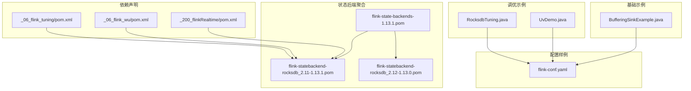
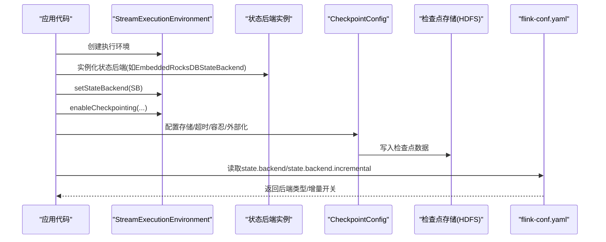
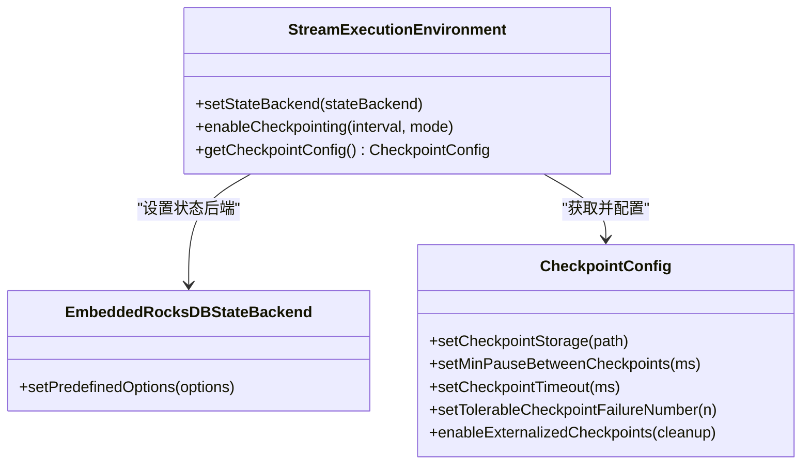
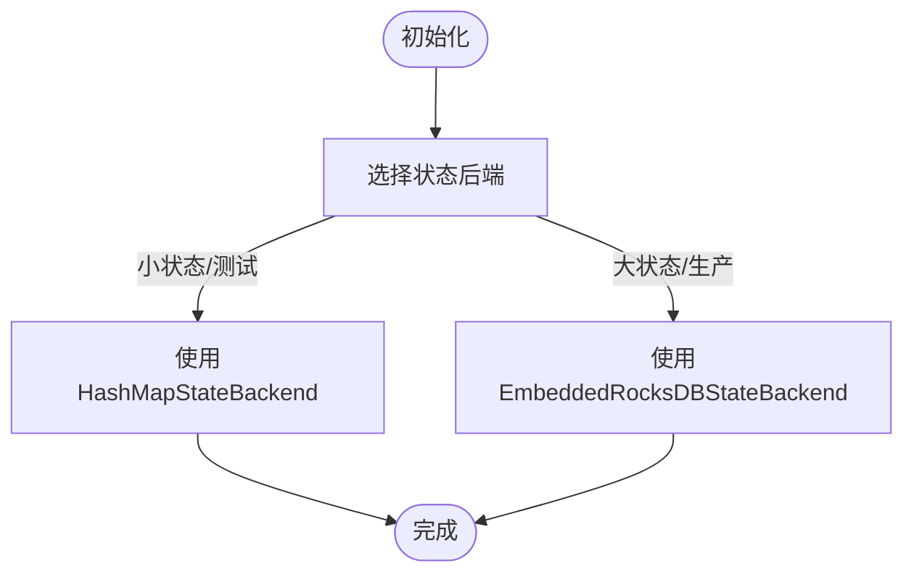
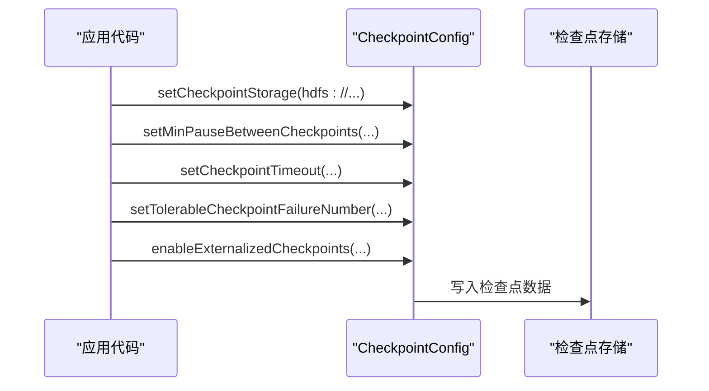
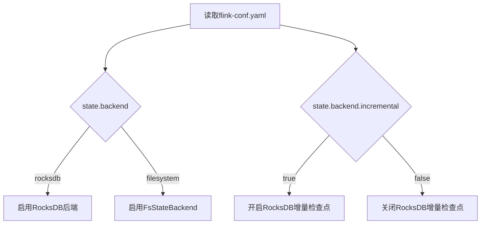
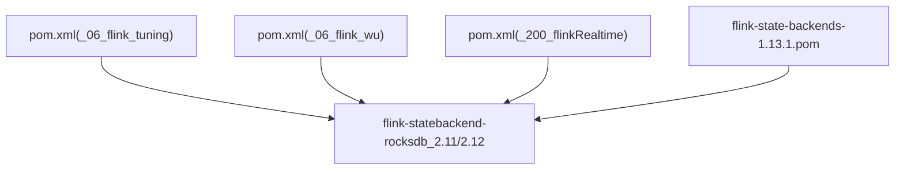

# 状态后端优化

<cite>
**本文引用的文件列表**
- [RocksdbTuning.java](file://_06_flink_tuning/src/main/java/com/atguigu/flink/tuning/RocksdbTuning.java)
- [UvDemo.java](file://_06_flink_tuning/src/main/java/com/atguigu/flink/tuning/UvDemo.java)
- [BufferingSinkExample.java](file://_06_flink_wu/src/main/java/com/atguigu/chatper09/BufferingSinkExample.java)
- [flink-conf.yaml](file://_500_flink-prome2022_demo/src/main/resources/flink-conf.yaml)
- [pom.xml（_06_flink_tuning）](file://_06_flink_tuning/pom.xml)
- [pom.xml（_06_flink_wu）](file://_06_flink_wu/pom.xml)
- [pom.xml（_200_flinkRealtime）](file://_200_flinkRealtime/pom.xml)
- [flink-state-backends-1.13.1.pom](file://org/apache/flink/flink-state-backends/1.13.1/flink-state-backends-1.13.1.pom)
- [flink-statebackend-rocksdb_2.11-1.13.1.pom](file://org/apache/flink/flink-statebackend-rocksdb_2.11/1.13.1/flink-statebackend-rocksdb_2.11-1.13.1.pom)
- [flink-statebackend-rocksdb_2.12-1.13.0.pom](file://org/apache/flink/flink-statebackend-rocksdb_2.12/1.13.0/flink-statebackend-rocksdb_2.12-1.13.0.pom)
</cite>

## 目录
1. [引言](#引言)
2. [项目结构](#项目结构)
3. [核心组件](#核心组件)
4. [架构总览](#架构总览)
5. [详细组件分析](#详细组件分析)
6. [依赖分析](#依赖分析)
7. [性能考量](#性能考量)
8. [故障排查指南](#故障排查指南)
9. [结论](#结论)
10. [附录](#附录)

## 引言
本技术文档围绕Flink状态后端的优化展开，系统性讲解MemoryStateBackend、FsStateBackend与RocksDBStateBackend三者的特性与适用场景，并重点给出RocksDB状态后端的深度优化配置策略，包括预定义选项、检查点存储、外部化检查点、增量检查点开关、以及与CheckpointConfig相关的参数调优。文档同时提供基于仓库现有示例的调优实践路径，帮助读者通过合理的状态后端配置提升作业的吞吐、稳定性与可运维性。

## 项目结构
本仓库中与状态后端优化直接相关的代码集中在以下模块：
- 调优示例：_06_flink_tuning 包含RocksDB嵌入式状态后端的使用示例与Checkpoint配置
- 基础示例：_06_flink_wu 包含启用检查点与外部化检查点的示例
- 配置样例：_500_flink-prome2022_demo 提供Flink配置文件，包含state.backend与state.backend.incremental等关键项
- 依赖声明：多个pom.xml中声明了flink-statebackend-rocksdb依赖
- 状态后端聚合工程：org/apache/flink/flink-state-backends系列pom用于组织RocksDB、堆内存与变更日志等后端模块

图表来源
- [RocksdbTuning.java](file://_06_flink_tuning/src/main/java/com/atguigu/flink/tuning/RocksdbTuning.java#L27-L44)
- [UvDemo.java](file://_06_flink_tuning/src/main/java/com/atguigu/flink/tuning/UvDemo.java#L37-L53)
- [BufferingSinkExample.java](file://_06_flink_wu/src/main/java/com/atguigu/chatper09/BufferingSinkExample.java#L33-L50)
- [flink-conf.yaml](file://_500_flink-prome2022_demo/src/main/resources/flink-conf.yaml#L108-L128)
- [pom.xml（_06_flink_tuning）](file://_06_flink_tuning/pom.xml#L119-L123)
- [pom.xml（_06_flink_wu）](file://_06_flink_wu/pom.xml#L65-L69)
- [pom.xml（_200_flinkRealtime）](file://_200_flinkRealtime/pom.xml#L177-L188)
- [flink-state-backends-1.13.1.pom](file://org/apache/flink/flink-state-backends/1.13.1/flink-state-backends-1.13.1.pom#L34-L43)
- [flink-statebackend-rocksdb_2.11-1.13.1.pom](file://org/apache/flink/flink-statebackend-rocksdb_2.11/1.13.1/flink-statebackend-rocksdb_2.11-1.13.1.pom#L1-L33)
- [flink-statebackend-rocksdb_2.12-1.13.0.pom](file://org/apache/flink/flink-statebackend-rocksdb_2.12/1.13.0/flink-statebackend-rocksdb_2.12-1.13.0.pom#L1-L33)

章节来源
- [RocksdbTuning.java](file://_06_flink_tuning/src/main/java/com/atguigu/flink/tuning/RocksdbTuning.java#L27-L44)
- [UvDemo.java](file://_06_flink_tuning/src/main/java/com/atguigu/flink/tuning/UvDemo.java#L37-L53)
- [BufferingSinkExample.java](file://_06_flink_wu/src/main/java/com/atguigu/chatper09/BufferingSinkExample.java#L33-L50)
- [flink-conf.yaml](file://_500_flink-prome2022_demo/src/main/resources/flink-conf.yaml#L108-L128)
- [pom.xml（_06_flink_tuning）](file://_06_flink_tuning/pom.xml#L119-L123)
- [pom.xml（_06_flink_wu）](file://_06_flink_wu/pom.xml#L65-L69)
- [pom.xml（_200_flinkRealtime）](file://_200_flinkRealtime/pom.xml#L177-L188)
- [flink-state-backends-1.13.1.pom](file://org/apache/flink/flink-state-backends/1.13.1/flink-state-backends-1.13.1.pom#L34-L43)
- [flink-statebackend-rocksdb_2.11-1.13.1.pom](file://org/apache/flink/flink-statebackend-rocksdb_2.11/1.13.1/flink-statebackend-rocksdb_2.11-1.13.1.pom#L1-L33)
- [flink-statebackend-rocksdb_2.12-1.13.0.pom](file://org/apache/flink/flink-statebackend-rocksdb_2.12/1.13.0/flink-statebackend-rocksdb_2.12-1.13.0.pom#L1-L33)

## 核心组件
- EmbeddedRocksDBStateBackend：嵌入式RocksDB状态后端，适合本地开发与测试；可通过预定义选项进行性能调优
- HashMapStateBackend：基于内存的HashMap实现，适合小状态或开发测试
- CheckpointConfig：统一管理检查点存储、超时、失败容忍、外部化清理策略等
- flink-conf.yaml：全局配置入口，包含state.backend与state.backend.incremental等关键项

章节来源
- [RocksdbTuning.java](file://_06_flink_tuning/src/main/java/com/atguigu/flink/tuning/RocksdbTuning.java#L33-L35)
- [UvDemo.java](file://_06_flink_tuning/src/main/java/com/atguigu/flink/tuning/UvDemo.java#L42-L43)
- [flink-conf.yaml](file://_500_flink-prome2022_demo/src/main/resources/flink-conf.yaml#L108-L128)

## 架构总览
下图展示了从应用代码到状态后端与配置的关键交互路径，以及RocksDB状态后端在不同场景下的部署方式。

图表来源
- [RocksdbTuning.java](file://_06_flink_tuning/src/main/java/com/atguigu/flink/tuning/RocksdbTuning.java#L27-L44)
- [UvDemo.java](file://_06_flink_tuning/src/main/java/com/atguigu/flink/tuning/UvDemo.java#L37-L53)
- [flink-conf.yaml](file://_500_flink-prome2022_demo/src/main/resources/flink-conf.yaml#L108-L128)

## 详细组件分析

### 组件A：RocksDB状态后端（EmbeddedRocksDBStateBackend）
- 特点
  - 嵌入式RocksDB，适合本地开发与测试
  - 支持预定义选项以适配不同硬件与工作负载
  - 与CheckpointConfig配合，支持外部化检查点与超时控制
- 关键配置要点
  - 在应用代码中实例化并设置到执行环境
  - 通过CheckpointConfig设置检查点存储目录、最小暂停时间、超时、失败容忍与外部化清理策略
  - 结合flink-conf.yaml中的state.backend与state.backend.incremental进行全局开关

图表来源
- [RocksdbTuning.java](file://_06_flink_tuning/src/main/java/com/atguigu/flink/tuning/RocksdbTuning.java#L27-L44)

章节来源
- [RocksdbTuning.java](file://_06_flink_tuning/src/main/java/com/atguigu/flink/tuning/RocksdbTuning.java#L27-L44)

### 组件B：HashMapStateBackend（内存状态后端）
- 特点
  - 基于内存的HashMap实现，适合小状态或开发测试
  - 不涉及磁盘I/O，开销低但受内存限制
- 适用场景
  - 小规模状态、快速验证逻辑
  - 本地开发与单元测试

图表来源
- [UvDemo.java](file://_06_flink_tuning/src/main/java/com/atguigu/flink/tuning/UvDemo.java#L42-L43)

章节来源
- [UvDemo.java](file://_06_flink_tuning/src/main/java/com/atguigu/flink/tuning/UvDemo.java#L42-L43)

### 组件C：CheckpointConfig与检查点策略
- 关键参数
  - 检查点存储：通过setCheckpointStorage指定HDFS等持久化位置
  - 最小暂停时间：避免频繁检查点导致的抖动
  - 超时：控制单次检查点完成时限
  - 失败容忍：允许一定数量的检查点失败
  - 外部化：保留取消作业时的检查点，便于恢复
- 示例路径
  - 设置检查点存储与外部化清理策略
  - 启用未对齐检查点（减少对齐等待）

图表来源
- [RocksdbTuning.java](file://_06_flink_tuning/src/main/java/com/atguigu/flink/tuning/RocksdbTuning.java#L38-L44)
- [BufferingSinkExample.java](file://_06_flink_wu/src/main/java/com/atguigu/chatper09/BufferingSinkExample.java#L33-L50)

章节来源
- [RocksdbTuning.java](file://_06_flink_tuning/src/main/java/com/atguigu/flink/tuning/RocksdbTuning.java#L38-L44)
- [BufferingSinkExample.java](file://_06_flink_wu/src/main/java/com/atguigu/chatper09/BufferingSinkExample.java#L33-L50)

### 组件D：全局配置（flink-conf.yaml）
- 关键项
  - state.backend：选择后端类型（如filesystem、rocksdb）
  - state.checkpoints.dir：默认检查点目录
  - state.backend.incremental：是否启用RocksDB增量检查点
- 作用
  - 作为全局开关与默认值，应用层可覆盖

图表来源
- [flink-conf.yaml](file://_500_flink-prome2022_demo/src/main/resources/flink-conf.yaml#L108-L128)

章节来源
- [flink-conf.yaml](file://_500_flink-prome2022_demo/src/main/resources/flink-conf.yaml#L108-L128)

## 依赖分析
- RocksDB后端依赖
  - _06_flink_tuning/pom.xml：声明flink-statebackend-rocksdb_${scala.binary.version}依赖
  - _06_flink_wu/pom.xml：同样声明对应版本的RocksDB后端依赖
  - _200_flinkRealtime/pom.xml：声明flink-statebackend-rocksdb_2.12依赖
- 状态后端聚合工程
  - flink-state-backends-1.13.1.pom：聚合flink-statebackend-rocksdb、heap-spillable、changelog等模块
  - flink-statebackend-rocksdb_*-1.13.*.pom：RocksDB后端模块的构建配置

图表来源
- [pom.xml（_06_flink_tuning）](file://_06_flink_tuning/pom.xml#L119-L123)
- [pom.xml（_06_flink_wu）](file://_06_flink_wu/pom.xml#L65-L69)
- [pom.xml（_200_flinkRealtime）](file://_200_flinkRealtime/pom.xml#L177-L188)
- [flink-state-backends-1.13.1.pom](file://org/apache/flink/flink-state-backends/1.13.1/flink-state-backends-1.13.1.pom#L34-L43)
- [flink-statebackend-rocksdb_2.11-1.13.1.pom](file://org/apache/flink/flink-statebackend-rocksdb_2.11/1.13.1/flink-statebackend-rocksdb_2.11-1.13.1.pom#L1-L33)
- [flink-statebackend-rocksdb_2.12-1.13.0.pom](file://org/apache/flink/flink-statebackend-rocksdb_2.12/1.13.0/flink-statebackend-rocksdb_2.12-1.13.0.pom#L1-L33)

章节来源
- [pom.xml（_06_flink_tuning）](file://_06_flink_tuning/pom.xml#L119-L123)
- [pom.xml（_06_flink_wu）](file://_06_flink_wu/pom.xml#L65-L69)
- [pom.xml（_200_flinkRealtime）](file://_200_flinkRealtime/pom.xml#L177-L188)
- [flink-state-backends-1.13.1.pom](file://org/apache/flink/flink-state-backends/1.13.1/flink-state-backends-1.13.1.pom#L34-L43)
- [flink-statebackend-rocksdb_2.11-1.13.1.pom](file://org/apache/flink/flink-statebackend-rocksdb_2.11/1.13.1/flink-statebackend-rocksdb_2.11-1.13.1.pom#L1-L33)
- [flink-statebackend-rocksdb_2.12-1.13.0.pom](file://org/apache/flink/flink-statebackend-rocksdb_2.12/1.13.0/flink-statebackend-rocksdb_2.12-1.13.0.pom#L1-L33)

## 性能考量
- 状态后端选择
  - 小状态/测试：优先使用HashMapStateBackend
  - 大状态/生产：优先使用EmbeddedRocksDBStateBackend
- RocksDB预定义选项
  - 可通过预定义选项适配不同硬件与工作负载，例如“高内存优化”等
- 检查点参数
  - 合理设置最小暂停时间、超时与失败容忍，避免频繁检查点导致的抖动
  - 启用外部化检查点，便于作业取消后的恢复
- 增量检查点
  - 在flink-conf.yaml中开启state.backend.incremental以启用RocksDB增量检查点
- 未对齐检查点
  - 在高延迟网络或写放大场景下，启用未对齐检查点可降低对齐等待

章节来源
- [RocksdbTuning.java](file://_06_flink_tuning/src/main/java/com/atguigu/flink/tuning/RocksdbTuning.java#L33-L35)
- [flink-conf.yaml](file://_500_flink-prome2022_demo/src/main/resources/flink-conf.yaml#L126-L128)
- [BufferingSinkExample.java](file://_06_flink_wu/src/main/java/com/atguigu/chatper09/BufferingSinkExample.java#L47-L49)

## 故障排查指南
- 检查点失败过多
  - 通过setTolerableCheckpointFailureNumber设置失败容忍阈值
  - 检查检查点存储目录权限与可用空间
- 检查点超时
  - 适当提高setCheckpointTimeout，避免因磁盘慢导致的超时
- 外部化检查点
  - 启用enableExternalizedCheckpoints，确保取消作业后仍可恢复
- 未对齐检查点
  - 在高写放大场景下启用未对齐检查点，减少对齐等待

章节来源
- [RocksdbTuning.java](file://_06_flink_tuning/src/main/java/com/atguigu/flink/tuning/RocksdbTuning.java#L38-L44)
- [BufferingSinkExample.java](file://_06_flink_wu/src/main/java/com/atguigu/chatper09/BufferingSinkExample.java#L33-L50)

## 结论
- 对于小状态与测试，优先使用HashMapStateBackend
- 对于大状态与生产，优先使用EmbeddedRocksDBStateBackend，并结合预定义选项与CheckpointConfig参数进行精细化调优
- 通过flink-conf.yaml统一开启RocksDB增量检查点，提升检查点效率
- 在复杂场景下启用未对齐检查点与外部化检查点，增强稳定性与可恢复性

## 附录
- 实践建议
  - 先在本地使用EmbeddedRocksDBStateBackend进行压测，再根据结果调整预定义选项
  - 在生产环境中，结合监控指标（如检查点耗时、失败率、磁盘I/O）持续迭代CheckpointConfig参数
  - 通过外部化检查点保障作业取消后的快速恢复