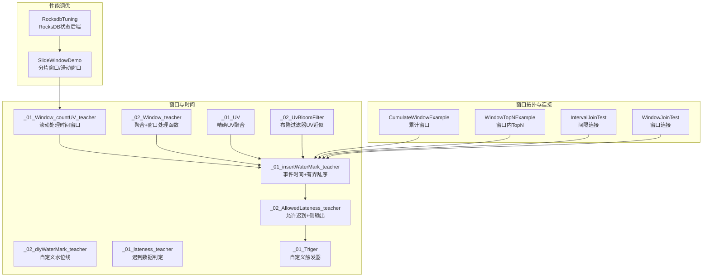
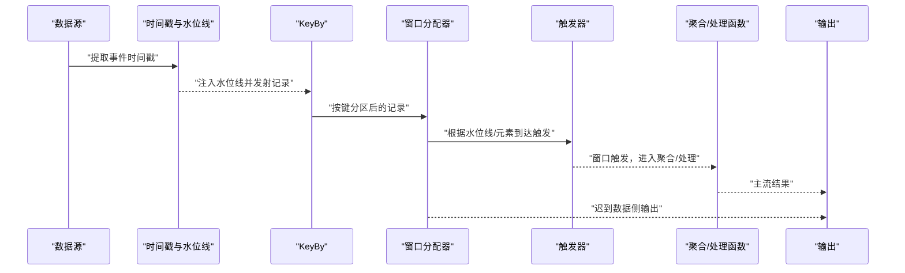
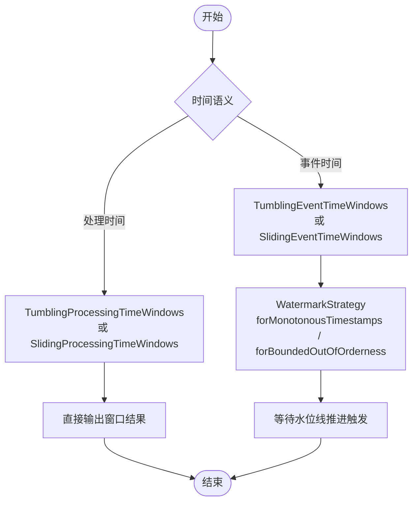
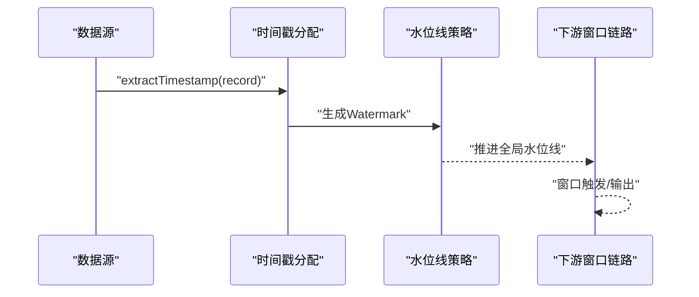
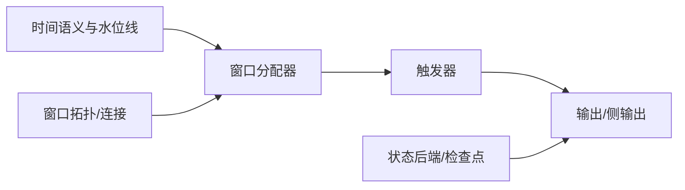

# 窗口与时间优化

<cite>
**本文引用的文件**
- [窗口创建源码分析.txt](file://_06_flink/窗口创建源码分析.txt)
- [SlideWindowDemo.java](file://_06_flink_tuning/src/main/java/com/atguigu/flink/tuning/SlideWindowDemo.java)
- [RocksdbTuning.java](file://_06_flink_tuning/src/main/java/com/atguigu/flink/tuning/RocksdbTuning.java)
- [_01_Window_countUV_teacher.java](file://_06_flink/src/main/java/_09_window/_01_Window_countUV_teacher.java)
- [_02_Window_teacher.java](file://_06_flink/src/main/java/_09_window/_02_Window_teacher.java)
- [_01_insertWaterMark_teacher.java](file://_06_flink/src/main/java/_10_waterMark/_01_insertWaterMark_teacher.java)
- [_02_diyWaterMark_teacher.java](file://_06_flink/src/main/java/_10_waterMark/_02_diyWaterMark_teacher.java)
- [_01_Triger.java](file://_06_flink/src/main/java/_16_triger/_01_Triger.java)
- [_01_UV.java](file://_06_flink/src/main/java/_17_UV/_01_UV.java)
- [_02_UvBloomFilter.java](file://_06_flink/src/main/java/_17_UV/_02_UvBloomFilter.java)
- [UvCountByWindowExample.java](file://_06_flink_wu/src/main/java/com/atguigu/chapter06/UvCountByWindowExample.java)
- [_01_lateness_teacher.java](file://_06_flink/src/main/java/_14_lateness/_01_lateness_teacher.java)
- [_02_AllowedLateness_teacher.java](file://_06_flink/src/main/java/_14_lateness/_02_AllowedLateness_teacher.java)
- [_02_AllowedLateness_teacher_my.java](file://_06_flink/src/main/java/_14_lateness/_02_AllowedLateness_teacher_my.java)
- [_04_Window_Aggrate_KeyedPF_teacher.java](file://_06_flink/src/main/java/_09_window/_05_Window_Aggrate_KeyedPF_teacher.java)
- [_03_WindowByKeyedProcessFunc_my.java](file://_06_flink/src/main/java/_09_window/_03_WindowByKeyedProcessFunc_my.java)
- [_03_WindowByKeyedProcessFunc_teacher.java](file://_06_flink/src/main/java/_09_window/_03_WindowByKeyedProcessFunc_teacher.java)
- [_01_Window_Aggregate_teacher.java](file://_06_flink_wu/src/main/java/com/atguigu/chapter11/_01_Window_Aggregate_teacher.java)
- [CumulateWindowExample.java](file://_06_flink_wu/src/main/java/com/atguigu/chapter11/CumulateWindowExample.java)
- [WindowTopNExample.java](file://_06_flink_wu/src/main/java/com/atguigu/chapter11/WindowTopNExample.java)
- [IntervalJoinTest.java](file://_06_flink_wu/src/main/java/com/atguigu/chapter08/IntervalJoinTest.java)
- [WindowJoinTest.java](file://_06_flink_wu/src/main/java/com/atguigu/chapter08/WindowJoinTest.java)
- [WindowAggregateTest.java](file://_06_flink_wu/src/main/java/com/atguigu/chapter06/WindowAggregateTest.java)
- [WindowReduceTest.java](file://_06_flink_wu/src/main/java/com/atguigu/chapter06/WindowReduceTest.java)
- [WatermarkTest.java](file://_06_flink_wu/src/main/java/com/atguigu/chapter06/WatermarkTest.java)
- [CustomWatermarkTest.java](file://_06_flink_wu/src/main/java/com/atguigu/chapter06/CustomWatermarkTest.java)
- [CustomWatermarkTest_m_0713.java](file://_06_flink_wu/src/main/java/com/atguigu/chapter06/CustomWatermarkTest_m_0713.java)
- [EmitWatermarkInSourceFunction.java](file://_06_flink_wu/src/main/java/com/atguigu/chapter06/EmitWatermarkInSourceFunction.java)
- [ProcessLateDataExample.java](file://_06_flink_wu/src/main/java/com/atguigu/chapter06/ProcessLateDataExample.java)
- [TriggerExample.java](file://_06_flink_wu/src/main/java/com/atguigu/chapter06/TriggerExample.java)
</cite>

## 目录
1. [引言](#引言)
2. [项目结构](#项目结构)
3. [核心组件](#核心组件)
4. [架构总览](#架构总览)
5. [详细组件分析](#详细组件分析)
6. [依赖关系分析](#依赖关系分析)
7. [性能考量](#性能考量)
8. [故障排查指南](#故障排查指南)
9. [结论](#结论)
10. [附录](#附录)

## 引言
本技术文档聚焦于Flink窗口与时间优化，系统梳理滚动窗口、滑动窗口、会话窗口、聚合窗口、触发器、水位线与迟到数据处理等关键主题。通过对仓库中示例代码的逐项解析，总结不同时间语义（事件时间、处理时间）的适用场景与性能权衡，给出窗口配置、水位线设置、状态清理与内存优化、延迟处理策略以及监控指标建议，帮助开发者在真实业务中落地可观察、可扩展、高性能的窗口化分析。

## 项目结构
围绕窗口与时间优化的相关代码主要分布在以下模块：
- 窗口基础与聚合：滚动/滑动窗口、窗口聚合、窗口处理函数
- 时间语义与水位线：事件时间、单调与有界无序、自定义水位线
- 迟到数据与侧输出：allowedLateness、sideOutputLateData
- 触发器：自定义触发策略
- 窗口拓扑与连接：窗口内TopN、窗口连接、间隔连接
- 性能调优：分片窗口、RocksDB状态后端、检查点配置

图表来源
- [_01_Window_countUV_teacher.java](file://_06_flink/src/main/java/_09_window/_01_Window_countUV_teacher.java#L1-L47)
- [_02_Window_teacher.java](file://_06_flink/src/main/java/_09_window/_02_Window_teacher.java#L1-L77)
- [_01_insertWaterMark_teacher.java](file://_06_flink/src/main/java/_10_waterMark/_01_insertWaterMark_teacher.java#L1-L78)
- [_02_diyWaterMark_teacher.java](file://_06_flink/src/main/java/_10_waterMark/_02_diyWaterMark_teacher.java#L1-L98)
- [_01_lateness_teacher.java](file://_06_flink/src/main/java/_14_lateness/_01_lateness_teacher.java#L1-L58)
- [_02_AllowedLateness_teacher.java](file://_06_flink/src/main/java/_14_lateness/_02_AllowedLateness_teacher.java#L53-L76)
- [_01_Triger.java](file://_06_flink/src/main/java/_16_triger/_01_Triger.java#L1-L91)
- [_01_UV.java](file://_06_flink/src/main/java/_17_UV/_01_UV.java#L1-L101)
- [_02_UvBloomFilter.java](file://_06_flink/src/main/java/_17_UV/_02_UvBloomFilter.java#L1-L123)
- [CumulateWindowExample.java](file://_06_flink_wu/src/main/java/com/atguigu/chapter11/CumulateWindowExample.java#L32-L60)
- [WindowTopNExample.java](file://_06_flink_wu/src/main/java/com/atguigu/chapter11/WindowTopNExample.java#L32-L60)
- [IntervalJoinTest.java](file://_06_flink_wu/src/main/java/com/atguigu/chapter08/IntervalJoinTest.java#L32-L55)
- [SlideWindowDemo.java](file://_06_flink_tuning/src/main/java/com/atguigu/flink/tuning/SlideWindowDemo.java#L1-L101)
- [RocksdbTuning.java](file://_06_flink_tuning/src/main/java/com/atguigu/flink/tuning/RocksdbTuning.java#L1-L76)

章节来源
- [SlideWindowDemo.java](file://_06_flink_tuning/src/main/java/com/atguigu/flink/tuning/SlideWindowDemo.java#L1-L101)
- [RocksdbTuning.java](file://_06_flink_tuning/src/main/java/com/atguigu/flink/tuning/RocksdbTuning.java#L1-L76)

## 核心组件
- 窗口分配器与时间语义
  - 处理时间：滚动/滑动处理时间窗口，适用于低延迟、对乱序不敏感的场景
  - 事件时间：滚动/滑动事件时间窗口，配合水位线保证结果稳定性
- 聚合与窗口处理函数
  - AggregateFunction + ProcessWindowFunction：先聚合再汇总，降低中间结果规模
  - ProcessWindowFunction：直接遍历窗口全量数据，适合复杂聚合或TopN
- 水位线与迟到数据
  - WatermarkStrategy.forMonotonousTimestamps / forBoundedOutOfOrderness
  - allowedLateness + sideOutputLateData，将超时迟到数据分流处理
- 触发器
  - 自定义Trigger：按元素到达即触发、按事件时间到达窗口末尾触发、或混合策略
- 状态与内存优化
  - HashMapStateBackend vs RocksDB，结合检查点配置与外部存储
  - 分片窗口/滑动窗口拆分，减少单分区状态规模

章节来源
- [_01_Window_countUV_teacher.java](file://_06_flink/src/main/java/_09_window/_01_Window_countUV_teacher.java#L1-L47)
- [_02_Window_teacher.java](file://_06_flink/src/main/java/_09_window/_02_Window_teacher.java#L1-L77)
- [_01_insertWaterMark_teacher.java](file://_06_flink/src/main/java/_10_waterMark/_01_insertWaterMark_teacher.java#L1-L78)
- [_02_diyWaterMark_teacher.java](file://_06_flink/src/main/java/_10_waterMark/_02_diyWaterMark_teacher.java#L1-L98)
- [_02_AllowedLateness_teacher.java](file://_06_flink/src/main/java/_14_lateness/_02_AllowedLateness_teacher.java#L53-L76)
- [_01_Triger.java](file://_06_flink/src/main/java/_16_triger/_01_Triger.java#L1-L91)
- [_01_UV.java](file://_06_flink/src/main/java/_17_UV/_01_UV.java#L1-L101)
- [_02_UvBloomFilter.java](file://_06_flink/src/main/java/_17_UV/_02_UvBloomFilter.java#L1-L123)
- [SlideWindowDemo.java](file://_06_flink_tuning/src/main/java/com/atguigu/flink/tuning/SlideWindowDemo.java#L1-L101)
- [RocksdbTuning.java](file://_06_flink_tuning/src/main/java/com/atguigu/flink/tuning/RocksdbTuning.java#L1-L76)

## 架构总览
下图展示了从数据源到窗口计算、水位线注入、迟到数据处理与输出的整体流程。

图表来源
- [_01_insertWaterMark_teacher.java](file://_06_flink/src/main/java/_10_waterMark/_01_insertWaterMark_teacher.java#L1-L78)
- [_02_diyWaterMark_teacher.java](file://_06_flink/src/main/java/_10_waterMark/_02_diyWaterMark_teacher.java#L1-L98)
- [_02_AllowedLateness_teacher.java](file://_06_flink/src/main/java/_14_lateness/_02_AllowedLateness_teacher.java#L53-L76)
- [_01_Triger.java](file://_06_flink/src/main/java/_16_triger/_01_Triger.java#L1-L91)
- [_02_Window_teacher.java](file://_06_flink/src/main/java/_09_window/_02_Window_teacher.java#L1-L77)

## 详细组件分析

### 滚动窗口与滑动窗口
- 滚动处理时间窗口：适用于低延迟、对乱序不敏感的场景；通过处理时间窗口快速得到结果
- 滚动事件时间窗口：基于事件时间与水位线，保证结果稳定；窗口划分算法以基准时间对齐
- 滑动事件时间窗口：通过更短步长获得更高频率的输出，适合实时报表与监控

图表来源
- [_01_Window_countUV_teacher.java](file://_06_flink/src/main/java/_09_window/_01_Window_countUV_teacher.java#L1-L47)
- [_02_Window_teacher.java](file://_06_flink/src/main/java/_09_window/_02_Window_teacher.java#L1-L77)
- [_01_insertWaterMark_teacher.java](file://_06_flink/src/main/java/_10_waterMark/_01_insertWaterMark_teacher.java#L1-L78)
- [窗口创建源码分析.txt](file://_06_flink/窗口创建源码分析.txt#L1-L21)

章节来源
- [_01_Window_countUV_teacher.java](file://_06_flink/src/main/java/_09_window/_01_Window_countUV_teacher.java#L1-L47)
- [_02_Window_teacher.java](file://_06_flink/src/main/java/_09_window/_02_Window_teacher.java#L1-L77)
- [_01_insertWaterMark_teacher.java](file://_06_flink/src/main/java/_10_waterMark/_01_insertWaterMark_teacher.java#L1-L78)
- [窗口创建源码分析.txt](file://_06_flink/窗口创建源码分析.txt#L1-L21)

### 时间语义选择与配置
- 事件时间（Event Time）
  - 适用：需要稳定、可重放的结果，容忍延迟但要求正确性
  - 配置：WatermarkStrategy.forMonotonousTimestamps 或 forBoundedOutOfOrderness，设置最大乱序容忍
  - 示例：事件时间窗口、水位线注入、窗口TopN、窗口连接
- 处理时间（Processing Time）
  - 适用：极低延迟场景，不要求全局一致性
  - 配置：TumblingProcessingTimeWindows / SlidingProcessingTimeWindows
  - 示例：滚动/滑动处理时间窗口

章节来源
- [_01_insertWaterMark_teacher.java](file://_06_flink/src/main/java/_10_waterMark/_01_insertWaterMark_teacher.java#L1-L78)
- [_02_diyWaterMark_teacher.java](file://_06_flink/src/main/java/_10_waterMark/_02_diyWaterMark_teacher.java#L1-L98)
- [WindowTopNExample.java](file://_06_flink_wu/src/main/java/com/atguigu/chapter11/WindowTopNExample.java#L32-L60)
- [CumulateWindowExample.java](file://_06_flink_wu/src/main/java/com/atguigu/chapter11/CumulateWindowExample.java#L32-L60)
- [_01_Window_countUV_teacher.java](file://_06_flink/src/main/java/_09_window/_01_Window_countUV_teacher.java#L1-L47)

### 水位线生成与管理
- 内置策略
  - 单调递增时间戳：forMonotonousTimestamps
  - 有界乱序：forBoundedOutOfOrderness(maxOutOfOrderness)
- 自定义水位线
  - 在数据源中 emitWatermark 或在流上 assignTimestampsAndWatermarks
  - 侧输出迟到数据：sideOutputLateData + allowedLateness

图表来源
- [_02_diyWaterMark_teacher.java](file://_06_flink/src/main/java/_10_waterMark/_02_diyWaterMark_teacher.java#L1-L98)
- [_01_lateness_teacher.java](file://_06_flink/src/main/java/_14_lateness/_01_lateness_teacher.java#L1-L58)
- [_02_AllowedLateness_teacher.java](file://_06_flink/src/main/java/_14_lateness/_02_AllowedLateness_teacher.java#L53-L76)

章节来源
- [_02_diyWaterMark_teacher.java](file://_06_flink/src/main/java/_10_waterMark/_02_diyWaterMark_teacher.java#L1-L98)
- [_01_lateness_teacher.java](file://_06_flink/src/main/java/_14_lateness/_01_lateness_teacher.java#L1-L58)
- [_02_AllowedLateness_teacher.java](file://_06_flink/src/main/java/_14_lateness/_02_AllowedLateness_teacher.java#L53-L76)

### 迟到数据与侧输出
- allowedLateness：允许窗口在关闭后继续接收迟到数据的时间窗
- sideOutputLateData：将超过窗口生命周期且仍归属该窗口的数据放入侧输出流
- 实践：在ProcessWindowFunction中区分首次触发与迟到更新，避免重复统计

章节来源
- [_02_AllowedLateness_teacher_my.java](file://_06_flink/src/main/java/_14_lateness/_02_AllowedLateness_teacher_my.java#L53-L76)
- [_04_Window_Aggrate_KeyedPF_teacher.java](file://_06_flink/src/main/java/_09_window/_05_Window_Aggrate_KeyedPF_teacher.java#L1-L200)
- [_03_WindowByKeyedProcessFunc_my.java](file://_06_flink/src/main/java/_09_window/_03_WindowByKeyedProcessFunc_my.java#L66-L112)
- [_03_WindowByKeyedProcessFunc_teacher.java](file://_06_flink/src/main/java/_09_window/_03_WindowByKeyedProcessFunc_teacher.java#L94-L107)

### 触发器（Trigger）
- 自定义触发策略：按元素到达触发、按事件时间到达窗口末尾触发、或组合策略
- 典型用法：高频刷新窗口结果，同时保留窗口关闭时的最终输出

章节来源
- [_01_Triger.java](file://_06_flink/src/main/java/_16_triger/_01_Triger.java#L1-L91)

### UV统计：精确与近似
- 精确UV：使用HashSet在窗口内去重，适合小数据量
- 近似UV：使用布隆过滤器，降低内存占用，允许误判

章节来源
- [_01_UV.java](file://_06_flink/src/main/java/_17_UV/_01_UV.java#L1-L101)
- [_02_UvBloomFilter.java](file://_06_flink/src/main/java/_17_UV/_02_UvBloomFilter.java#L1-L123)
- [UvCountByWindowExample.java](file://_06_flink_wu/src/main/java/com/atguigu/chapter06/UvCountByWindowExample.java#L1-L71)

### 窗口拓扑与连接
- 累计窗口：持续累积结果，适合趋势类指标
- 窗口内TopN：结合窗口处理函数实现
- 窗口连接/间隔连接：基于窗口或时间范围进行关联

章节来源
- [CumulateWindowExample.java](file://_06_flink_wu/src/main/java/com/atguigu/chapter11/CumulateWindowExample.java#L32-L60)
- [WindowTopNExample.java](file://_06_flink_wu/src/main/java/com/atguigu/chapter11/WindowTopNExample.java#L32-L60)
- [IntervalJoinTest.java](file://_06_flink_wu/src/main/java/com/atguigu/chapter08/IntervalJoinTest.java#L32-L55)
- [WindowJoinTest.java](file://_06_flink_wu/src/main/java/com/atguigu/chapter08/WindowJoinTest.java#L1-L200)

### 窗口优化案例与实践
- 分片窗口与滑动窗口拆分：通过windowAll + reduce + 分片聚合，降低单分区状态规模
- RocksDB状态后端：在高状态量场景下显著降低内存压力
- 聚合优先：优先使用AggregateFunction + ProcessWindowFunction，减少中间结果
- 触发器与输出：高频刷新与最终收敛结合，兼顾实时性与准确性

章节来源
- [SlideWindowDemo.java](file://_06_flink_tuning/src/main/java/com/atguigu/flink/tuning/SlideWindowDemo.java#L1-L101)
- [RocksdbTuning.java](file://_06_flink_tuning/src/main/java/com/atguigu/flink/tuning/RocksdbTuning.java#L1-L76)
- [_02_Window_teacher.java](file://_06_flink/src/main/java/_09_window/_02_Window_teacher.java#L1-L77)

## 依赖关系分析
- 窗口与时间依赖
  - 窗口分配器依赖于时间语义（事件/处理）与水位线策略
  - 触发器影响窗口触发时机与输出频率
  - 迟到数据策略决定侧输出与最终收敛行为
- 状态与后端
  - StateBackend（HashMap/RocksDB）与Checkpoint配置共同决定内存与持久化成本
- 窗口拓扑
  - 窗口内TopN与窗口连接对键分区与窗口对齐有较高要求

图表来源
- [_01_insertWaterMark_teacher.java](file://_06_flink/src/main/java/_10_waterMark/_01_insertWaterMark_teacher.java#L1-L78)
- [_01_Triger.java](file://_06_flink/src/main/java/_16_triger/_01_Triger.java#L1-L91)
- [SlideWindowDemo.java](file://_06_flink_tuning/src/main/java/com/atguigu/flink/tuning/SlideWindowDemo.java#L1-L101)
- [RocksdbTuning.java](file://_06_flink_tuning/src/main/java/com/atguigu/flink/tuning/RocksdbTuning.java#L1-L76)

## 性能考量
- 窗口粒度与频率
  - 事件时间窗口需平衡水位线推进速度与延迟容忍，避免过长水位线导致输出延迟
  - 滑动窗口步长越小，输出越频繁，但状态与触发开销越高
- 聚合优先与中间结果
  - 使用AggregateFunction减少中间结果规模，再由ProcessWindowFunction汇总
- 状态与内存
  - 高基数键空间大时，优先考虑RocksDB状态后端与外部检查点存储
  - 合理设置检查点间隔、超时与最小暂停，避免频繁快照造成抖动
- 并行与分区
  - KeyBy键设计直接影响状态规模与并行度收益
  - 分片窗口/滑动窗口拆分可降低单分区状态压力
- 触发与输出
  - 高频触发可提升感知速度，但增加触发与序列化成本；可采用“先高频刷新、后最终收敛”的策略

章节来源
- [SlideWindowDemo.java](file://_06_flink_tuning/src/main/java/com/atguigu/flink/tuning/SlideWindowDemo.java#L1-L101)
- [RocksdbTuning.java](file://_06_flink_tuning/src/main/java/com/atguigu/flink/tuning/RocksdbTuning.java#L1-L76)
- [_02_Window_teacher.java](file://_06_flink/src/main/java/_09_window/_02_Window_teacher.java#L1-L77)
- [_01_Triger.java](file://_06_flink/src/main/java/_16_triger/_01_Triger.java#L1-L91)

## 故障排查指南
- 水位线不前进
  - 检查时间戳提取逻辑与WatermarkStrategy配置
  - 确认数据源是否正确emitWatermark
- 窗口无输出或延迟过大
  - 校验事件时间与水位线推进节奏，调整最大乱序容忍
  - 检查触发器策略与窗口步长
- 迟到数据过多
  - 提升allowedLateness或优化上游乱序
  - 使用侧输出流监控迟到比例，评估阈值合理性
- 内存与状态异常
  - 切换至RocksDB状态后端，启用外部检查点存储
  - 优化键分区与聚合策略，减少状态规模

章节来源
- [_01_insertWaterMark_teacher.java](file://_06_flink/src/main/java/_10_waterMark/_01_insertWaterMark_teacher.java#L1-L78)
- [_02_diyWaterMark_teacher.java](file://_06_flink/src/main/java/_10_waterMark/_02_diyWaterMark_teacher.java#L1-L98)
- [_02_AllowedLateness_teacher_my.java](file://_06_flink/src/main/java/_14_lateness/_02_AllowedLateness_teacher_my.java#L53-L76)
- [RocksdbTuning.java](file://_06_flink_tuning/src/main/java/com/atguigu/flink/tuning/RocksdbTuning.java#L1-L76)

## 结论
通过合理选择时间语义、配置水位线与触发器、采用聚合优先策略与分片窗口拆分、并结合RocksDB状态后端与外部检查点存储，可以在保证结果正确性的前提下，显著提升窗口化分析的实时性与资源利用率。针对不同业务场景（如UV统计、TopN、窗口连接），应分别评估延迟容忍、内存占用与吞吐目标，动态调整窗口参数与状态策略。

## 附录
- 相关示例路径参考
  - 窗口与时间语义：[_01_Window_countUV_teacher.java](file://_06_flink/src/main/java/_09_window/_01_Window_countUV_teacher.java#L1-L47)，[_02_Window_teacher.java](file://_06_flink/src/main/java/_09_window/_02_Window_teacher.java#L1-L77)，[_01_insertWaterMark_teacher.java](file://_06_flink/src/main/java/_10_waterMark/_01_insertWaterMark_teacher.java#L1-L78)，[_02_diyWaterMark_teacher.java](file://_06_flink/src/main/java/_10_waterMark/_02_diyWaterMark_teacher.java#L1-L98)
  - 迟到与侧输出：[_01_lateness_teacher.java](file://_06_flink/src/main/java/_14_lateness/_01_lateness_teacher.java#L1-L58)，[_02_AllowedLateness_teacher.java](file://_06_flink/src/main/java/_14_lateness/_02_AllowedLateness_teacher.java#L53-L76)，[_02_AllowedLateness_teacher_my.java](file://_06_flink/src/main/java/_14_lateness/_02_AllowedLateness_teacher_my.java#L53-L76)
  - 触发器：[_01_Triger.java](file://_06_flink/src/main/java/_16_triger/_01_Triger.java#L1-L91)
  - UV统计：[_01_UV.java](file://_06_flink/src/main/java/_17_UV/_01_UV.java#L1-L101)，[_02_UvBloomFilter.java](file://_06_flink/src/main/java/_17_UV/_02_UvBloomFilter.java#L1-L123)，[UvCountByWindowExample.java](file://_06_flink_wu/src/main/java/com/atguigu/chapter06/UvCountByWindowExample.java#L1-L71)
  - 窗口拓扑与连接：[CumulateWindowExample.java](file://_06_flink_wu/src/main/java/com/atguigu/chapter11/CumulateWindowExample.java#L32-L60)，[WindowTopNExample.java](file://_06_flink_wu/src/main/java/com/atguigu/chapter11/WindowTopNExample.java#L32-L60)，[IntervalJoinTest.java](file://_06_flink_wu/src/main/java/com/atguigu/chapter08/IntervalJoinTest.java#L32-L55)，[WindowJoinTest.java](file://_06_flink_wu/src/main/java/com/atguigu/chapter08/WindowJoinTest.java#L1-L200)
  - 性能调优：[SlideWindowDemo.java](file://_06_flink_tuning/src/main/java/com/atguigu/flink/tuning/SlideWindowDemo.java#L1-L101)，[RocksdbTuning.java](file://_06_flink_tuning/src/main/java/com/atguigu/flink/tuning/RocksdbTuning.java#L1-L76)