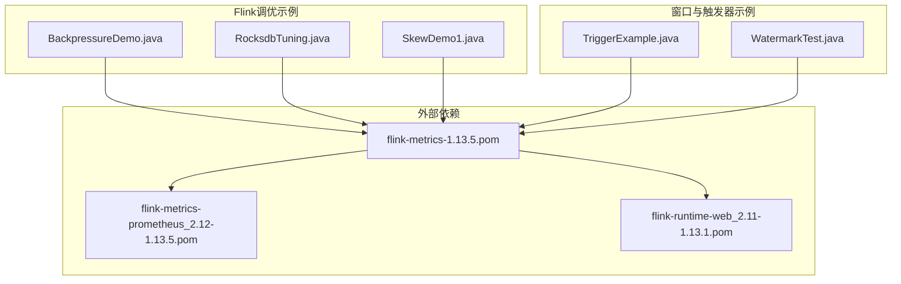
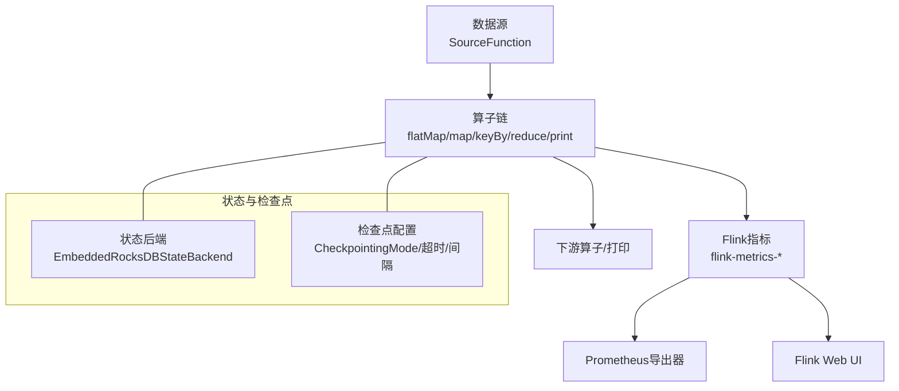
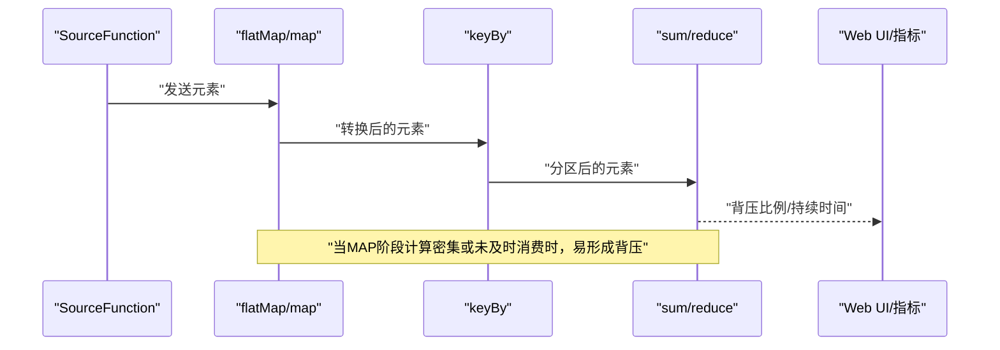
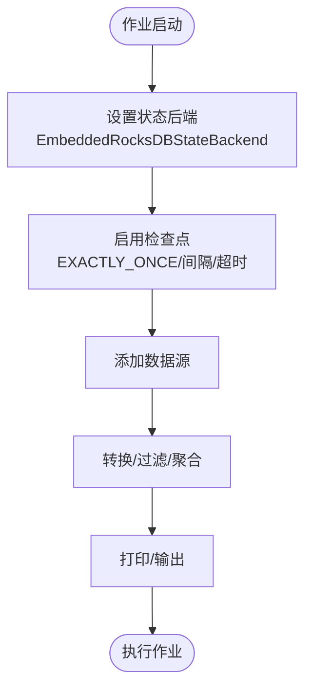
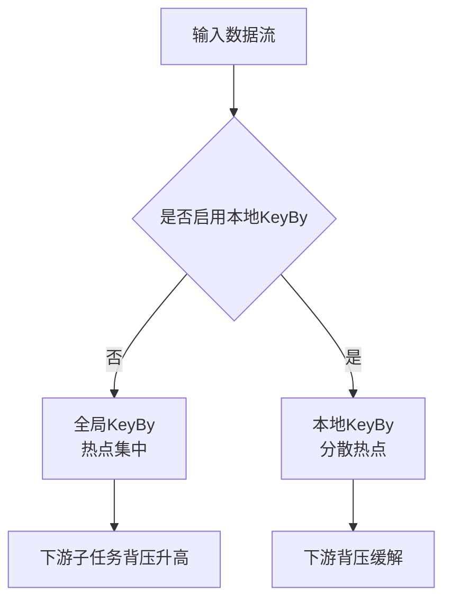
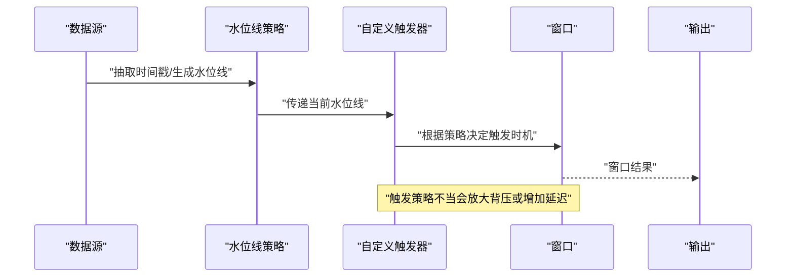
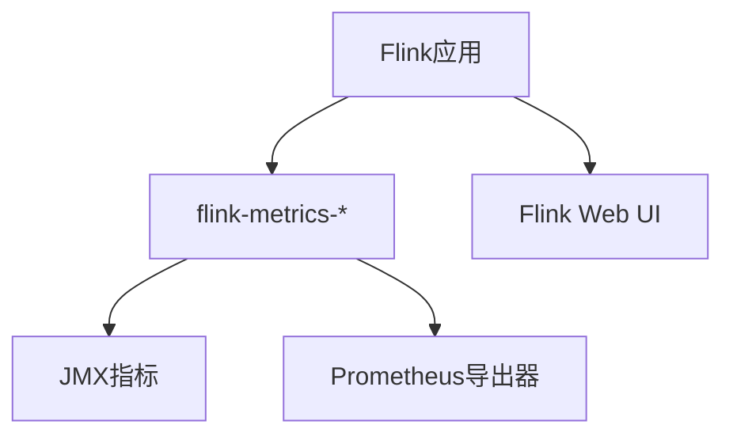

# 背压监控与诊断

<cite>
**本文引用的文件**
- [BackpressureDemo.java](file://_06_flink_tuning/src/main/java/com/atguigu/flink/tuning/BackpressureDemo.java)
- [RocksdbTuning.java](file://_06_flink_tuning/src/main/java/com/atguigu/flink/tuning/RocksdbTuning.java)
- [SkewDemo1.java](file://_06_flink_tuning/src/main/java/com/atguigu/flink/tuning/SkewDemo1.java)
- [TriggerExample.java](file://_06_flink_wu/src/main/java/com/atguigu/chapter06/TriggerExample.java)
- [WatermarkTest.java](file://_06_flink_wu/src/main/java/com/atguigu/chapter06/WatermarkTest.java)
- [flink-metrics-1.13.5.pom](file://org/apache/flink/flink-metrics/1.13.5/flink-metrics-1.13.5.pom)
- [flink-metrics-prometheus_2.12-1.13.5.pom](file://org/apache/flink/flink-metrics-prometheus_2.12/1.13.5/flink-metrics-prometheus_2.12-1.13.5.pom)
- [flink-runtime-web_2.11-1.13.1.pom](file://org/apache/flink/flink-runtime-web_2.11/1.13.1/flink-runtime-web_2.11-1.13.1.pom)
</cite>

## 目录
1. [引言](#引言)
2. [项目结构](#项目结构)
3. [核心组件](#核心组件)
4. [架构总览](#架构总览)
5. [详细组件分析](#详细组件分析)
6. [依赖关系分析](#依赖关系分析)
7. [性能考量](#性能考量)
8. [故障排查指南](#故障排查指南)
9. [结论](#结论)
10. [附录](#附录)

## 引言
本技术文档围绕Flink背压（Backpressure）的监控与诊断展开，目标是帮助开发者理解背压的成因、影响与表现形式，掌握基于Web界面、JMX与Prometheus等指标体系的监控方法，并结合仓库中的示例程序，给出可操作的诊断步骤与优化建议。文档同时覆盖慢算子识别、网络拥塞检测、磁盘I/O问题诊断等实战场景，帮助在生产环境中快速定位瓶颈并实施改进。

## 项目结构
本仓库中与背压监控与诊断直接相关的内容主要集中在以下模块：
- 调优示例：BackpressureDemo、RocksdbTuning、SkewDemo1
- 触发器与水位线示例：TriggerExample、WatermarkTest
- Flink指标与运行时Web依赖：flink-metrics、flink-metrics-prometheus、flink-runtime-web

下图展示了与背压监控相关的文件与外部依赖的关系：

图表来源
- [BackpressureDemo.java](file://_06_flink_tuning/src/main/java/com/atguigu/flink/tuning/BackpressureDemo.java#L1-L66)
- [RocksdbTuning.java](file://_06_flink_tuning/src/main/java/com/atguigu/flink/tuning/RocksdbTuning.java#L1-L76)
- [SkewDemo1.java](file://_06_flink_tuning/src/main/java/com/atguigu/flink/tuning/SkewDemo1.java#L1-L74)
- [TriggerExample.java](file://_06_flink_wu/src/main/java/com/atguigu/chapter06/TriggerExample.java#L1-L102)
- [WatermarkTest.java](file://_06_flink_wu/src/main/java/com/atguigu/chapter06/WatermarkTest.java#L1-L71)
- [flink-metrics-1.13.5.pom](file://org/apache/flink/flink-metrics/1.13.5/flink-metrics-1.13.5.pom#L1-L69)
- [flink-metrics-prometheus_2.12-1.13.5.pom](file://org/apache/flink/flink-metrics-prometheus_2.12/1.13.5/flink-metrics-prometheus_2.12-1.13.5.pom#L1-L42)
- [flink-runtime-web_2.11-1.13.1.pom](file://org/apache/flink/flink-runtime-web_2.11/1.13.1/flink-runtime-web_2.11-1.13.1.pom#L1-L214)

章节来源
- [BackpressureDemo.java](file://_06_flink_tuning/src/main/java/com/atguigu/flink/tuning/BackpressureDemo.java#L1-L66)
- [RocksdbTuning.java](file://_06_flink_tuning/src/main/java/com/atguigu/flink/tuning/RocksdbTuning.java#L1-L76)
- [SkewDemo1.java](file://_06_flink_tuning/src/main/java/com/atguigu/flink/tuning/SkewDemo1.java#L1-L74)
- [TriggerExample.java](file://_06_flink_wu/src/main/java/com/atguigu/chapter06/TriggerExample.java#L1-L102)
- [WatermarkTest.java](file://_06_flink_wu/src/main/java/com/atguigu/chapter06/WatermarkTest.java#L1-L71)
- [flink-metrics-1.13.5.pom](file://org/apache/flink/flink-metrics/1.13.5/flink-metrics-1.13.5.pom#L1-L69)
- [flink-metrics-prometheus_2.12-1.13.5.pom](file://org/apache/flink/flink-metrics-prometheus_2.12/1.13.5/flink-metrics-prometheus_2.12-1.13.5.pom#L1-L42)
- [flink-runtime-web_2.11-1.13.1.pom](file://org/apache/flink/flink-runtime-web_2.11/1.13.1/flink-runtime-web_2.11-1.13.1.pom#L1-L214)

## 核心组件
- 背压演示程序：通过构造高计算负载与禁用算子链，模拟背压现象，便于观察与验证监控手段的有效性。
- RocksDB状态后端与检查点配置：用于状态存储与一致性保障，间接影响背压表现（如状态膨胀导致的内存与磁盘压力）。
- 数据倾斜演示：通过本地KeyBy与全局KeyBy对比，展示倾斜对下游并行度利用与背压的影响。
- 触发器与水位线：通过自定义触发器与水位线策略，验证窗口触发时机与背压之间的关系。
- 指标与Web：通过Metrics模块与运行时Web界面，提供可视化监控入口；Prometheus适配模块支持外部指标采集。

章节来源
- [BackpressureDemo.java](file://_06_flink_tuning/src/main/java/com/atguigu/flink/tuning/BackpressureDemo.java#L1-L66)
- [RocksdbTuning.java](file://_06_flink_tuning/src/main/java/com/atguigu/flink/tuning/RocksdbTuning.java#L1-L76)
- [SkewDemo1.java](file://_06_flink_tuning/src/main/java/com/atguigu/flink/tuning/SkewDemo1.java#L1-L74)
- [TriggerExample.java](file://_06_flink_wu/src/main/java/com/atguigu/chapter06/TriggerExample.java#L1-L102)
- [WatermarkTest.java](file://_06_flink_wu/src/main/java/com/atguigu/chapter06/WatermarkTest.java#L1-L71)
- [flink-metrics-1.13.5.pom](file://org/apache/flink/flink-metrics/1.13.5/flink-metrics-1.13.5.pom#L1-L69)
- [flink-metrics-prometheus_2.12-1.13.5.pom](file://org/apache/flink/flink-metrics-prometheus_2.12/1.13.5/flink-metrics-prometheus_2.12-1.13.5.pom#L1-L42)
- [flink-runtime-web_2.11-1.13.1.pom](file://org/apache/flink/flink-runtime-web_2.11/1.13.1/flink-runtime-web_2.11-1.13.1.pom#L1-L214)

## 架构总览
下图展示了从数据源到算子再到监控系统的整体流程，以及背压可能发生的环节与观测点。

图表来源
- [BackpressureDemo.java](file://_06_flink_tuning/src/main/java/com/atguigu/flink/tuning/BackpressureDemo.java#L1-L66)
- [RocksdbTuning.java](file://_06_flink_tuning/src/main/java/com/atguigu/flink/tuning/RocksdbTuning.java#L1-L76)
- [flink-metrics-1.13.5.pom](file://org/apache/flink/flink-metrics/1.13.5/flink-metrics-1.13.5.pom#L1-L69)
- [flink-metrics-prometheus_2.12-1.13.5.pom](file://org/apache/flink/flink-metrics-prometheus_2.12/1.13.5/flink-metrics-prometheus_2.12-1.13.5.pom#L1-L42)
- [flink-runtime-web_2.11-1.13.1.pom](file://org/apache/flink/flink-runtime-web_2.11/1.13.1/flink-runtime-web_2.11-1.13.1.pom#L1-L214)

## 详细组件分析

### 背压演示程序（BackpressureDemo）
该程序通过禁用算子链并在中间算子引入高计算负载，使下游算子无法及时消费上游产生的数据，从而形成背压。典型特征包括：
- 上游算子吞吐远高于下游，缓冲区堆积
- Web界面显示某些并行子任务的背压比例升高
- 指标面板中记录到背压持续时间与比例

图表来源
- [BackpressureDemo.java](file://_06_flink_tuning/src/main/java/com/atguigu/flink/tuning/BackpressureDemo.java#L1-L66)

章节来源
- [BackpressureDemo.java](file://_06_flink_tuning/src/main/java/com/atguigu/flink/tuning/BackpressureDemo.java#L1-L66)

### RocksDB状态后端与检查点（RocksdbTuning）
该示例展示了如何启用嵌入式RocksDB状态后端与精确一次语义的检查点配置。其对背压的影响体现在：
- 状态膨胀会增加序列化/反序列化与磁盘I/O压力，可能导致算子处理延迟
- 合理的检查点间隔与超时有助于避免频繁快照造成CPU抖动
- 外部化检查点与存储路径配置影响恢复速度与稳定性

图表来源
- [RocksdbTuning.java](file://_06_flink_tuning/src/main/java/com/atguigu/flink/tuning/RocksdbTuning.java#L1-L76)

章节来源
- [RocksdbTuning.java](file://_06_flink_tuning/src/main/java/com/atguigu/flink/tuning/RocksdbTuning.java#L1-L76)

### 数据倾斜演示（SkewDemo1）
该示例通过两种KeyBy方式对比，展示倾斜对背压的影响：
- 全局KeyBy：所有键由单并行子任务处理，易形成热点，导致该子任务背压显著
- 本地KeyBy：通过预分区减少热点，提升整体并行度利用率，降低背压

图表来源
- [SkewDemo1.java](file://_06_flink_tuning/src/main/java/com/atguigu/flink/tuning/SkewDemo1.java#L1-L74)

章节来源
- [SkewDemo1.java](file://_06_flink_tuning/src/main/java/com/atguigu/flink/tuning/SkewDemo1.java#L1-L74)

### 触发器与水位线（TriggerExample、WatermarkTest）
这两个示例展示了窗口触发与水位线对背压的间接影响：
- 触发器：自定义触发策略会影响窗口关闭时机，过早或过晚触发可能导致缓冲区堆积或频繁触发带来的额外开销
- 水位线：乱序与延迟设置不当会导致窗口提前或延后关闭，进而影响下游消费节奏与背压表现

图表来源
- [TriggerExample.java](file://_06_flink_wu/src/main/java/com/atguigu/chapter06/TriggerExample.java#L1-L102)
- [WatermarkTest.java](file://_06_flink_wu/src/main/java/com/atguigu/chapter06/WatermarkTest.java#L1-L71)

章节来源
- [TriggerExample.java](file://_06_flink_wu/src/main/java/com/atguigu/chapter06/TriggerExample.java#L1-L102)
- [WatermarkTest.java](file://_06_flink_wu/src/main/java/com/atguigu/chapter06/WatermarkTest.java#L1-L71)

## 依赖关系分析
Flink指标与Web运行时依赖为背压监控提供了基础设施：
- flink-metrics：提供核心指标能力与多种导出器（JMX、Prometheus等）
- flink-metrics-prometheus：将Flink指标暴露给Prometheus抓取
- flink-runtime-web：提供Web UI，直观展示任务与子任务的背压状态

图表来源
- [flink-metrics-1.13.5.pom](file://org/apache/flink/flink-metrics/1.13.5/flink-metrics-1.13.5.pom#L1-L69)
- [flink-metrics-prometheus_2.12-1.13.5.pom](file://org/apache/flink/flink-metrics-prometheus_2.12/1.13.5/flink-metrics-prometheus_2.12-1.13.5.pom#L1-L42)
- [flink-runtime-web_2.11-1.13.1.pom](file://org/apache/flink/flink-runtime-web_2.11/1.13.1/flink-runtime-web_2.11-1.13.1.pom#L1-L214)

章节来源
- [flink-metrics-1.13.5.pom](file://org/apache/flink/flink-metrics/1.13.5/flink-metrics-1.13.5.pom#L1-L69)
- [flink-metrics-prometheus_2.12-1.13.5.pom](file://org/apache/flink/flink-metrics-prometheus_2.12/1.13.5/flink-metrics-prometheus_2.12-1.13.5.pom#L1-L42)
- [flink-runtime-web_2.11-1.13.1.pom](file://org/apache/flink/flink-runtime-web_2.11/1.13.1/flink-runtime-web_2.11-1.13.1.pom#L1-L214)

## 性能考量
- 禁用算子链：在调试阶段可禁用链式组合以隔离慢算子，但生产环境应按需开启以减少上下文切换。
- 并行度与分区：合理设置并行度与KeyBy策略，避免热点与倾斜。
- 状态与检查点：选择合适的状态后端与检查点参数，平衡吞吐与稳定性。
- 触发与水位线：根据业务乱序程度调整水位线延迟与触发策略，避免窗口过早或过晚关闭。
- 指标采集：启用JMX与Prometheus导出，建立告警阈值，提前发现背压苗头。

## 故障排查指南
- Web界面观察
  - 在Web UI中查看各并行子任务的背压比例与持续时间，定位背压最严重的算子。
  - 结合任务拓扑，确认是否存在单一子任务成为瓶颈。
- 指标分析
  - 通过JMX查看关键指标（如算子处理时间、缓冲区占用、反压比例）。
  - 使用Prometheus抓取指标并设置告警规则，实现自动化预警。
- 日志与火焰图
  - 在本地或集群中启用火焰图功能，定位CPU热点与阻塞点。
  - 结合日志中的异常堆栈，排查异常导致的处理停滞。
- 代码级诊断
  - 对疑似慢算子进行拆分或并行化改造，必要时引入缓存或批处理。
  - 针对磁盘I/O问题，评估状态后端与检查点配置，减少序列化与落盘频率。
  - 针对网络拥塞，检查上下游背压与反压比例，优化分区与并行度。

章节来源
- [BackpressureDemo.java](file://_06_flink_tuning/src/main/java/com/atguigu/flink/tuning/BackpressureDemo.java#L1-L66)
- [RocksdbTuning.java](file://_06_flink_tuning/src/main/java/com/atguigu/flink/tuning/RocksdbTuning.java#L1-L76)
- [SkewDemo1.java](file://_06_flink_tuning/src/main/java/com/atguigu/flink/tuning/SkewDemo1.java#L1-L74)
- [TriggerExample.java](file://_06_flink_wu/src/main/java/com/atguigu/chapter06/TriggerExample.java#L1-L102)
- [WatermarkTest.java](file://_06_flink_wu/src/main/java/com/atguigu/chapter06/WatermarkTest.java#L1-L71)
- [flink-metrics-1.13.5.pom](file://org/apache/flink/flink-metrics/1.13.5/flink-metrics-1.13.5.pom#L1-L69)
- [flink-metrics-prometheus_2.12-1.13.5.pom](file://org/apache/flink/flink-metrics-prometheus_2.12/1.13.5/flink-metrics-prometheus_2.12-1.13.5.pom#L1-L42)
- [flink-runtime-web_2.11-1.13.1.pom](file://org/apache/flink/flink-runtime-web_2.11/1.13.1/flink-runtime-web_2.11-1.13.1.pom#L1-L214)

## 结论
背压是流式系统中常见的性能瓶颈信号。通过合理的算子设计、并行度规划、状态与检查点配置，以及完善的监控与告警体系，可以有效降低背压风险并快速定位问题根因。本文结合仓库中的示例程序与外部依赖，给出了从概念到实操的完整路径，建议在开发与测试阶段即引入背压监控与诊断流程，确保生产环境的稳定与高效。

## 附录
- 参考文件清单
  - 背压演示：BackpressureDemo.java
  - 状态与检查点：RocksdbTuning.java
  - 数据倾斜：SkewDemo1.java
  - 触发器与水位线：TriggerExample.java、WatermarkTest.java
  - 指标与Web依赖：flink-metrics-1.13.5.pom、flink-metrics-prometheus_2.12-1.13.5.pom、flink-runtime-web_2.11-1.13.1.pom