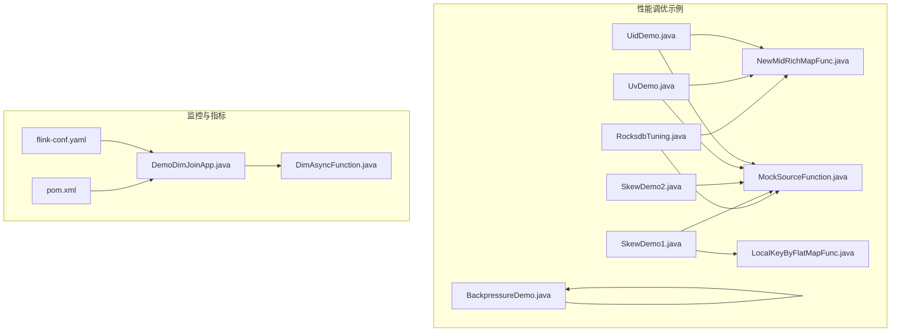
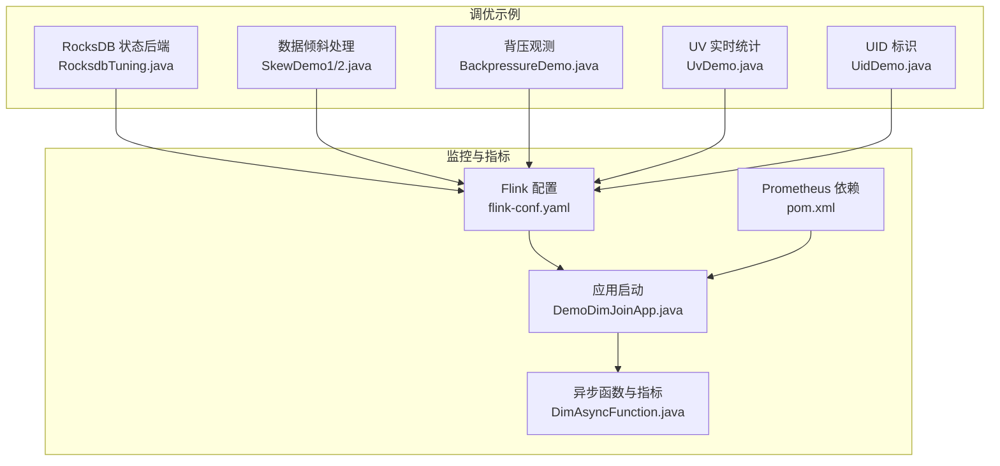
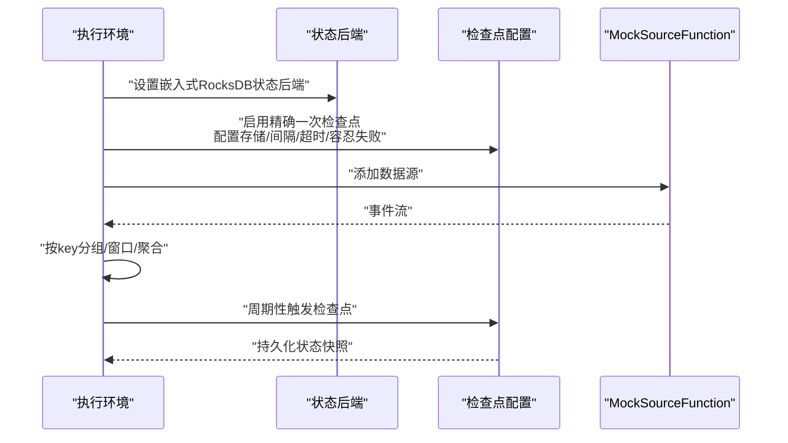
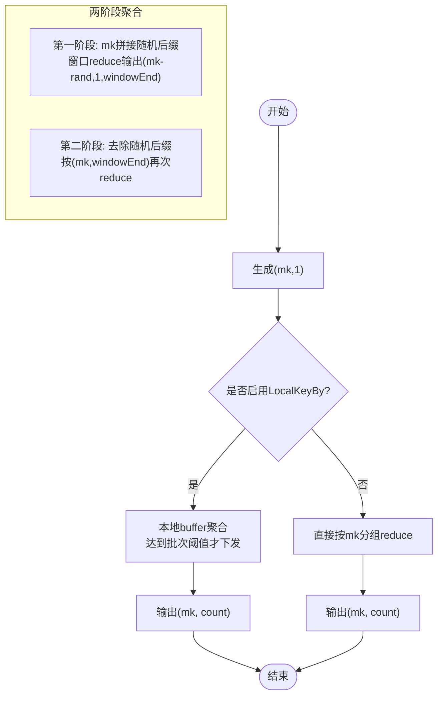
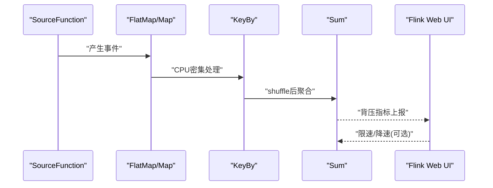
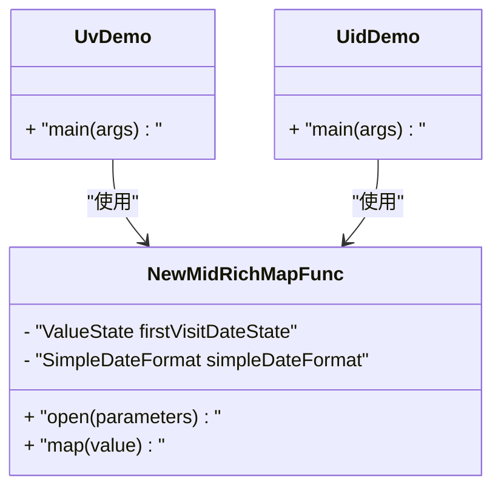
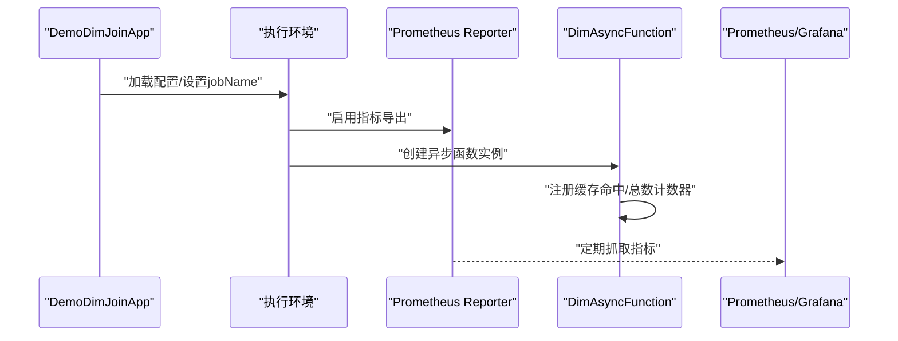
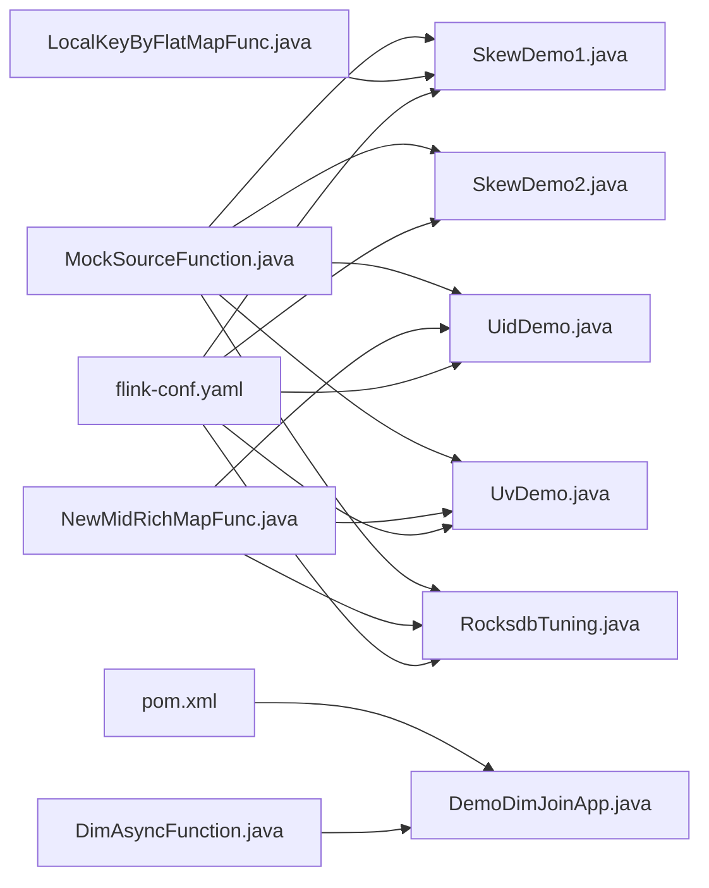

# 性能优化与调优

<cite>
**本文引用的文件**
- [RocksdbTuning.java](file://_06_flink_tuning/src/main/java/com/atguigu/flink/tuning/RocksdbTuning.java)
- [SkewDemo1.java](file://_06_flink_tuning/src/main/java/com/atguigu/flink/tuning/SkewDemo1.java)
- [SkewDemo2.java](file://_06_flink_tuning/src/main/java/com/atguigu/flink/tuning/SkewDemo2.java)
- [BackpressureDemo.java](file://_06_flink_tuning/src/main/java/com/atguigu/flink/tuning/BackpressureDemo.java)
- [UvDemo.java](file://_06_flink_tuning/src/main/java/com/atguigu/flink/tuning/UvDemo.java)
- [UidDemo.java](file://_06_flink_tuning/src/main/java/com/atguigu/flink/tuning/UidDemo.java)
- [LocalKeyByFlatMapFunc.java](file://_06_flink_tuning/src/main/java/com/atguigu/flink/tuning/function/LocalKeyByFlatMapFunc.java)
- [NewMidRichMapFunc.java](file://_06_flink_tuning/src/main/java/com/atguigu/flink/tuning/function/NewMidRichMapFunc.java)
- [MockSourceFunction.java](file://_06_flink_tuning/src/main/java/com/atguigu/flink/source/MockSourceFunction.java)
- [flink-conf.yaml](file://_500_flink-prome2022_demo/src/main/resources/flink-conf.yaml)
- [DemoDimJoinApp.java](file://_500_flink-prome2022_demo/src/main/java/com/atguigu/prome/app/DemoDimJoinApp.java)
- [DimAsyncFunction.java](file://_500_flink-prome2022_demo/src/main/java/com/atguigu/prome/func/DimAsyncFunction.java)
- [pom.xml](file://_500_flink-prome2022_demo/pom.xml)
</cite>

## 目录
1. [引言](#引言)
2. [项目结构](#项目结构)
3. [核心组件](#核心组件)
4. [架构总览](#架构总览)
5. [详细组件分析](#详细组件分析)
6. [依赖关系分析](#依赖关系分析)
7. [性能考虑](#性能考虑)
8. [故障排查指南](#故障排查指南)
9. [结论](#结论)
10. [附录](#附录)

## 引言
本技术文档聚焦于大数据系统中的性能优化与调优，特别针对 Apache Flink 流处理系统，系统性梳理内存管理、网络缓冲、状态后端配置、数据倾斜处理、并行度调优等关键主题，并结合仓库中的实际示例（RocksDB 状态后端、数据倾斜两阶段聚合、背压演示、指标采集与监控）给出可操作的实践建议与案例解析，帮助读者在生产环境中构建高性能、高可用的大数据应用。

## 项目结构
本仓库中与性能优化直接相关的内容主要集中在以下模块：
- flink-tuning 示例模块：包含 RocksDB 状态后端、数据倾斜处理、背压演示、UV 统计等演示程序，便于理解调优思路与落地方法。
- flink-prome2022_demo 监控模块：演示如何启用 Prometheus 指标导出，结合自定义指标实现业务侧监控。

图表来源
- [RocksdbTuning.java](file://_06_flink_tuning/src/main/java/com/atguigu/flink/tuning/RocksdbTuning.java#L1-L76)
- [SkewDemo1.java](file://_06_flink_tuning/src/main/java/com/atguigu/flink/tuning/SkewDemo1.java#L1-L74)
- [SkewDemo2.java](file://_06_flink_tuning/src/main/java/com/atguigu/flink/tuning/SkewDemo2.java#L1-L124)
- [BackpressureDemo.java](file://_06_flink_tuning/src/main/java/com/atguigu/flink/tuning/BackpressureDemo.java#L1-L66)
- [UvDemo.java](file://_06_flink_tuning/src/main/java/com/atguigu/flink/tuning/UvDemo.java#L1-L91)
- [UidDemo.java](file://_06_flink_tuning/src/main/java/com/atguigu/flink/tuning/UidDemo.java#L1-L74)
- [LocalKeyByFlatMapFunc.java](file://_06_flink_tuning/src/main/java/com/atguigu/flink/tuning/function/LocalKeyByFlatMapFunc.java#L1-L95)
- [NewMidRichMapFunc.java](file://_06_flink_tuning/src/main/java/com/atguigu/flink/tuning/function/NewMidRichMapFunc.java#L1-L49)
- [MockSourceFunction.java](file://_06_flink_tuning/src/main/java/com/atguigu/flink/source/MockSourceFunction.java#L67-L96)
- [flink-conf.yaml](file://_500_flink-prome2022_demo/src/main/resources/flink-conf.yaml#L91-L216)
- [DemoDimJoinApp.java](file://_500_flink-prome2022_demo/src/main/java/com/atguigu/prome/app/DemoDimJoinApp.java#L1-L28)
- [DimAsyncFunction.java](file://_500_flink-prome2022_demo/src/main/java/com/atguigu/prome/func/DimAsyncFunction.java#L1-L41)
- [pom.xml](file://_500_flink-prome2022_demo/pom.xml#L72-L112)

章节来源
- [RocksdbTuning.java](file://_06_flink_tuning/src/main/java/com/atguigu/flink/tuning/RocksdbTuning.java#L1-L76)
- [flink-conf.yaml](file://_500_flink-prome2022_demo/src/main/resources/flink-conf.yaml#L91-L216)

## 核心组件
- 状态后端与检查点配置：通过设置状态后端、检查点存储、超时与容忍失败次数等参数，保障状态一致性与恢复效率。
- 数据倾斜处理：提供 LocalKeyBy 本地聚合与两阶段聚合两种方案，降低热点键对下游造成的压力。
- 背压观测：通过构造 CPU 密集型或下游限速场景，直观观察背压指标，定位瓶颈环节。
- 指标采集与监控：启用 Prometheus 指标导出，结合自定义指标（如缓存命中）评估调优效果。

章节来源
- [SkewDemo1.java](file://_06_flink_tuning/src/main/java/com/atguigu/flink/tuning/SkewDemo1.java#L1-L74)
- [SkewDemo2.java](file://_06_flink_tuning/src/main/java/com/atguigu/flink/tuning/SkewDemo2.java#L1-L124)
- [BackpressureDemo.java](file://_06_flink_tuning/src/main/java/com/atguigu/flink/tuning/BackpressureDemo.java#L1-L66)
- [flink-conf.yaml](file://_500_flink-prome2022_demo/src/main/resources/flink-conf.yaml#L91-L216)

## 架构总览
下图展示了调优示例与监控模块的整体关系：调优示例负责在运行期通过状态后端、窗口与聚合策略等手段提升吞吐与稳定性；监控模块负责将运行指标暴露给 Prometheus，形成闭环。

图表来源
- [RocksdbTuning.java](file://_06_flink_tuning/src/main/java/com/atguigu/flink/tuning/RocksdbTuning.java#L1-L76)
- [SkewDemo1.java](file://_06_flink_tuning/src/main/java/com/atguigu/flink/tuning/SkewDemo1.java#L1-L74)
- [SkewDemo2.java](file://_06_flink_tuning/src/main/java/com/atguigu/flink/tuning/SkewDemo2.java#L1-L124)
- [BackpressureDemo.java](file://_06_flink_tuning/src/main/java/com/atguigu/flink/tuning/BackpressureDemo.java#L1-L66)
- [UvDemo.java](file://_06_flink_tuning/src/main/java/com/atguigu/flink/tuning/UvDemo.java#L1-L91)
- [UidDemo.java](file://_06_flink_tuning/src/main/java/com/atguigu/flink/tuning/UidDemo.java#L1-L74)
- [flink-conf.yaml](file://_500_flink-prome2022_demo/src/main/resources/flink-conf.yaml#L91-L216)
- [DemoDimJoinApp.java](file://_500_flink-prome2022_demo/src/main/java/com/atguigu/prome/app/DemoDimJoinApp.java#L1-L28)
- [DimAsyncFunction.java](file://_500_flink-prome2022_demo/src/main/java/com/atguigu/prome/func/DimAsyncFunction.java#L1-L41)
- [pom.xml](file://_500_flink-prome2022_demo/pom.xml#L72-L112)

## 详细组件分析

### 状态后端与检查点配置（RocksDB）
- 关键点
  - 使用嵌入式 RocksDB 作为状态后端，适合大状态场景。
  - 启用精确一次语义的检查点，配置检查点间隔、最小暂停、超时与外部化清理策略。
  - 可结合预定义选项优化磁盘/内存权衡（示例中预留了开关位置）。
- 典型收益
  - 大状态可落盘，降低内存峰值；检查点配置合理可减少恢复时间与抖动。
- 实践要点
  - 根据数据规模选择合适的 RocksDB 预设选项。
  - 检查点存储路径需具备高可靠与高吞吐能力（如 HDFS）。
  - 控制检查点频率与超时，避免频繁小检查点导致元数据压力过大。

图表来源
- [RocksdbTuning.java](file://_06_flink_tuning/src/main/java/com/atguigu/flink/tuning/RocksdbTuning.java#L1-L76)
- [MockSourceFunction.java](file://_06_flink_tuning/src/main/java/com/atguigu/flink/source/MockSourceFunction.java#L67-L96)

章节来源
- [RocksdbTuning.java](file://_06_flink_tuning/src/main/java/com/atguigu/flink/tuning/RocksdbTuning.java#L1-L76)

### 数据倾斜处理（LocalKeyBy 与两阶段聚合）
- LocalKeyBy 本地聚合
  - 在算子内部维护本地 buffer，达到批次阈值后再向下游发送，减少 shuffle 与热点 key 压力。
  - 通过 ListState 在检查点时持久化未提交的局部聚合结果，保证 exactly-once。
- 两阶段聚合
  - 第一阶段：对 key 拼接随机后缀进行分组与窗口聚合，输出带窗口结束时间标记的结果。
  - 第二阶段：去除随机后缀并按原 key+窗口结束时间再次聚合，得到最终结果。
- 效果
  - 显著缓解单 key 聚合热点，提升整体吞吐与稳定性。

图表来源
- [SkewDemo1.java](file://_06_flink_tuning/src/main/java/com/atguigu/flink/tuning/SkewDemo1.java#L1-L74)
- [SkewDemo2.java](file://_06_flink_tuning/src/main/java/com/atguigu/flink/tuning/SkewDemo2.java#L1-L124)
- [LocalKeyByFlatMapFunc.java](file://_06_flink_tuning/src/main/java/com/atguigu/flink/tuning/function/LocalKeyByFlatMapFunc.java#L1-L95)

章节来源
- [SkewDemo1.java](file://_06_flink_tuning/src/main/java/com/atguigu/flink/tuning/SkewDemo1.java#L1-L74)
- [SkewDemo2.java](file://_06_flink_tuning/src/main/java/com/atguigu/flink/tuning/SkewDemo2.java#L1-L124)
- [LocalKeyByFlatMapFunc.java](file://_06_flink_tuning/src/main/java/com/atguigu/flink/tuning/function/LocalKeyByFlatMapFunc.java#L1-L95)

### 背压监控与定位（BackpressureDemo）
- 背压含义：下游处理速度慢于上游，导致中间缓冲区积压，Task 线程被阻塞。
- 演示思路：构造 CPU 密集型 flatMap 或限制下游 sink，使背压现象明显可见。
- 观测入口：Flink Web UI 的背压指标区域，结合任务并行度与算子链路分析瓶颈。

图表来源
- [BackpressureDemo.java](file://_06_flink_tuning/src/main/java/com/atguigu/flink/tuning/BackpressureDemo.java#L1-L66)

章节来源
- [BackpressureDemo.java](file://_06_flink_tuning/src/main/java/com/atguigu/flink/tuning/BackpressureDemo.java#L1-L66)

### UV 实时统计与状态管理（UvDemo、UidDemo、NewMidRichMapFunc）
- 状态使用
  - 使用 ValueState 记录首次访问日期，修正“新用户”标记，避免错误去重。
  - 通过 RichFunction 生命周期 open 初始化状态描述符。
- 并行度与 UID
  - 为关键算子显式设置 uid 与名称，有助于在 Web UI 中准确定位与排障。
  - 对象重用开启可降低 GC 压力，提升吞吐。
- 实时 UV
  - 过滤页面事件后按 mid 去重，再做 reduce 统计。

图表来源
- [NewMidRichMapFunc.java](file://_06_flink_tuning/src/main/java/com/atguigu/flink/tuning/function/NewMidRichMapFunc.java#L1-L49)
- [UvDemo.java](file://_06_flink_tuning/src/main/java/com/atguigu/flink/tuning/UvDemo.java#L1-L91)
- [UidDemo.java](file://_06_flink_tuning/src/main/java/com/atguigu/flink/tuning/UidDemo.java#L1-L74)

章节来源
- [UvDemo.java](file://_06_flink_tuning/src/main/java/com/atguigu/flink/tuning/UvDemo.java#L1-L91)
- [UidDemo.java](file://_06_flink_tuning/src/main/java/com/atguigu/flink/tuning/UidDemo.java#L1-L74)
- [NewMidRichMapFunc.java](file://_06_flink_tuning/src/main/java/com/atguigu/flink/tuning/function/NewMidRichMapFunc.java#L1-L49)

### 指标采集与监控（Prometheus）
- 启用方式
  - 在应用启动时设置指标网关作业名，加载全局配置。
  - 引入 Prometheus Metrics 依赖，打包后由集群统一配置启用。
- 自定义指标
  - 在异步函数中注册缓存命中与总数计数器，便于评估关联查询命中率与延迟影响。
- 配置要点
  - flink-conf.yaml 中可配置高可用、网络内存比例等底层参数，间接影响指标上报稳定性。

图表来源
- [DemoDimJoinApp.java](file://_500_flink-prome2022_demo/src/main/java/com/atguigu/prome/app/DemoDimJoinApp.java#L1-L28)
- [DimAsyncFunction.java](file://_500_flink-prome2022_demo/src/main/java/com/atguigu/prome/func/DimAsyncFunction.java#L1-L41)
- [pom.xml](file://_500_flink-prome2022_demo/pom.xml#L72-L112)
- [flink-conf.yaml](file://_500_flink-prome2022_demo/src/main/resources/flink-conf.yaml#L91-L216)

章节来源
- [DemoDimJoinApp.java](file://_500_flink-prome2022_demo/src/main/java/com/atguigu/prome/app/DemoDimJoinApp.java#L1-L28)
- [DimAsyncFunction.java](file://_500_flink-prome2022_demo/src/main/java/com/atguigu/prome/func/DimAsyncFunction.java#L1-L41)
- [pom.xml](file://_500_flink-prome2022_demo/pom.xml#L72-L112)
- [flink-conf.yaml](file://_500_flink-prome2022_demo/src/main/resources/flink-conf.yaml#L91-L216)

## 依赖关系分析
- 组件耦合
  - 调优示例之间低耦合，通过共享的 MockSourceFunction 提供统一数据源。
  - 状态后端与检查点配置集中于各示例入口，便于横向对比不同策略。
- 外部依赖
  - 监控模块依赖 Prometheus Metrics 组件与 flink-conf.yaml 的指标导出配置。
- 循环依赖
  - 无循环依赖，职责清晰：示例负责运行期调优，监控负责指标采集。

图表来源
- [MockSourceFunction.java](file://_06_flink_tuning/src/main/java/com/atguigu/flink/source/MockSourceFunction.java#L67-L96)
- [RocksdbTuning.java](file://_06_flink_tuning/src/main/java/com/atguigu/flink/tuning/RocksdbTuning.java#L1-L76)
- [SkewDemo1.java](file://_06_flink_tuning/src/main/java/com/atguigu/flink/tuning/SkewDemo1.java#L1-L74)
- [SkewDemo2.java](file://_06_flink_tuning/src/main/java/com/atguigu/flink/tuning/SkewDemo2.java#L1-L124)
- [UvDemo.java](file://_06_flink_tuning/src/main/java/com/atguigu/flink/tuning/UvDemo.java#L1-L91)
- [UidDemo.java](file://_06_flink_tuning/src/main/java/com/atguigu/flink/tuning/UidDemo.java#L1-L74)
- [NewMidRichMapFunc.java](file://_06_flink_tuning/src/main/java/com/atguigu/flink/tuning/function/NewMidRichMapFunc.java#L1-L49)
- [LocalKeyByFlatMapFunc.java](file://_06_flink_tuning/src/main/java/com/atguigu/flink/tuning/function/LocalKeyByFlatMapFunc.java#L1-L95)
- [flink-conf.yaml](file://_500_flink-prome2022_demo/src/main/resources/flink-conf.yaml#L91-L216)
- [DemoDimJoinApp.java](file://_500_flink-prome2022_demo/src/main/java/com/atguigu/prome/app/DemoDimJoinApp.java#L1-L28)
- [DimAsyncFunction.java](file://_500_flink-prome2022_demo/src/main/java/com/atguigu/prome/func/DimAsyncFunction.java#L1-L41)
- [pom.xml](file://_500_flink-prome2022_demo/pom.xml#L72-L112)

章节来源
- [MockSourceFunction.java](file://_06_flink_tuning/src/main/java/com/atguigu/flink/source/MockSourceFunction.java#L67-L96)
- [flink-conf.yaml](file://_500_flink-prome2022_demo/src/main/resources/flink-conf.yaml#L91-L216)

## 性能考虑
- 内存管理
  - 合理设置网络内存比例与上下限，避免“网络缓冲不足”错误。
  - 对象重用开启可降低序列化与 GC 压力，适用于高吞吐场景。
- 网络优化
  - 保持合理的网络内存配额，避免因缓冲不足导致背压。
- 状态后端
  - 大状态优先选用 RocksDB，结合预设选项平衡磁盘与内存。
  - 检查点存储使用高吞吐/高可靠的分布式文件系统。
- 数据倾斜
  - 优先采用 LocalKeyBy 本地聚合；若仍存在热点，采用两阶段聚合。
  - 适当增大随机后缀基数与窗口长度，进一步打散热点。
- 并行度调优
  - 从背压与 CPU 利用率双维度评估，逐步提升并行度。
  - 为关键算子设置稳定 uid 与名称，便于定位与扩缩容。
- 指标与可观测性
  - 启用 Prometheus 指标导出，结合自定义指标评估调优效果。
  - 结合 Flink Web UI 的背压、吞吐、延迟等指标进行综合分析。

[本节为通用指导，不直接分析具体文件]

## 故障排查指南
- 背压异常
  - 现象：下游算子堆积，上游背压上升。
  - 排查：检查算子链路、并行度、下游 sink 速率、是否存在 CPU 密集步骤。
  - 参考：背压演示示例可快速复现与验证。
- 检查点失败
  - 现象：检查点超时或失败过多。
  - 排查：检查检查点存储可用性、超时时间、最小暂停间隔、容忍失败次数。
  - 参考：状态后端与检查点配置示例。
- 数据倾斜
  - 现象：个别 subtask 处理量远高于其他实例。
  - 排查：确认 key 分布、是否启用 LocalKeyBy/两阶段聚合。
  - 参考：倾斜处理示例。
- 状态异常
  - 现象：状态恢复失败或重复计算。
  - 排查：确认状态后端类型、状态 TTL、operator state 是否正确持久化。
  - 参考：状态函数与 UV 统计示例。

章节来源
- [BackpressureDemo.java](file://_06_flink_tuning/src/main/java/com/atguigu/flink/tuning/BackpressureDemo.java#L1-L66)
- [RocksdbTuning.java](file://_06_flink_tuning/src/main/java/com/atguigu/flink/tuning/RocksdbTuning.java#L1-L76)
- [SkewDemo1.java](file://_06_flink_tuning/src/main/java/com/atguigu/flink/tuning/SkewDemo1.java#L1-L74)
- [SkewDemo2.java](file://_06_flink_tuning/src/main/java/com/atguigu/flink/tuning/SkewDemo2.java#L1-L124)
- [UvDemo.java](file://_06_flink_tuning/src/main/java/com/atguigu/flink/tuning/UvDemo.java#L1-L91)
- [UidDemo.java](file://_06_flink_tuning/src/main/java/com/atguigu/flink/tuning/UidDemo.java#L1-L74)

## 结论
通过对状态后端、检查点、数据倾斜、背压与指标体系的系统化调优，可在 Flink 流处理中显著提升吞吐与稳定性。建议在生产环境中以“先观测、后调整”的原则，结合本仓库中的示例进行对比实验，逐步收敛到最优配置。

[本节为总结性内容，不直接分析具体文件]

## 附录
- 关键配置参考
  - 高可用与检查点相关配置位于 flink-conf.yaml。
  - Prometheus 指标导出依赖位于 pom.xml。
- 示例入口
  - 状态后端与检查点：RocksdbTuning.java
  - 数据倾斜：SkewDemo1.java、SkewDemo2.java
  - 背压：BackpressureDemo.java
  - UV 统计：UvDemo.java、UidDemo.java
  - 指标采集：DemoDimJoinApp.java、DimAsyncFunction.java

章节来源
- [flink-conf.yaml](file://_500_flink-prome2022_demo/src/main/resources/flink-conf.yaml#L91-L216)
- [pom.xml](file://_500_flink-prome2022_demo/pom.xml#L72-L112)
- [RocksdbTuning.java](file://_06_flink_tuning/src/main/java/com/atguigu/flink/tuning/RocksdbTuning.java#L1-L76)
- [SkewDemo1.java](file://_06_flink_tuning/src/main/java/com/atguigu/flink/tuning/SkewDemo1.java#L1-L74)
- [SkewDemo2.java](file://_06_flink_tuning/src/main/java/com/atguigu/flink/tuning/SkewDemo2.java#L1-L124)
- [BackpressureDemo.java](file://_06_flink_tuning/src/main/java/com/atguigu/flink/tuning/BackpressureDemo.java#L1-L66)
- [UvDemo.java](file://_06_flink_tuning/src/main/java/com/atguigu/flink/tuning/UvDemo.java#L1-L91)
- [UidDemo.java](file://_06_flink_tuning/src/main/java/com/atguigu/flink/tuning/UidDemo.java#L1-L74)
- [DemoDimJoinApp.java](file://_500_flink-prome2022_demo/src/main/java/com/atguigu/prome/app/DemoDimJoinApp.java#L1-L28)
- [DimAsyncFunction.java](file://_500_flink-prome2022_demo/src/main/java/com/atguigu/prome/func/DimAsyncFunction.java#L1-L41)