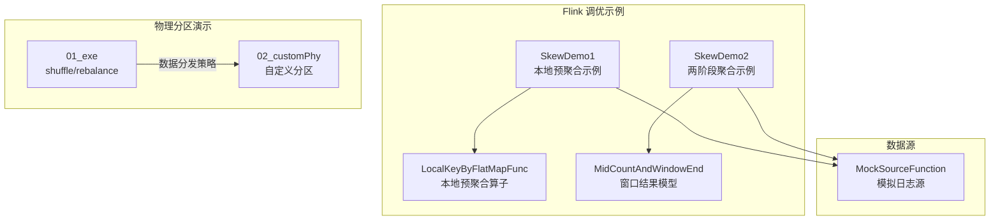
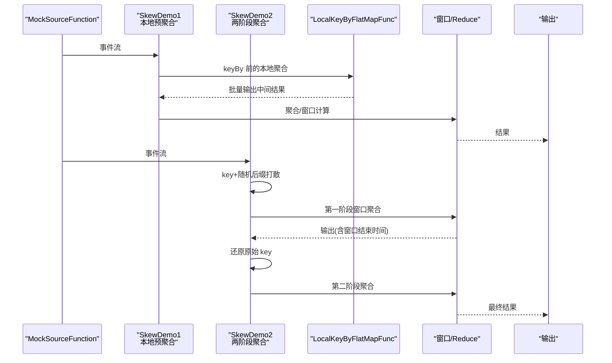
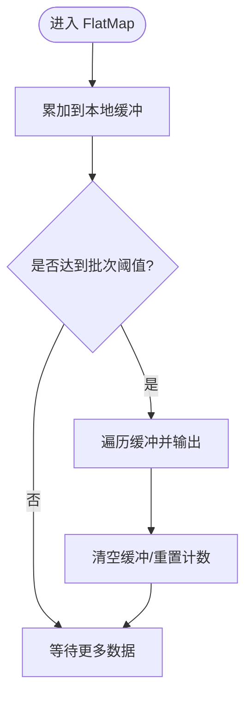
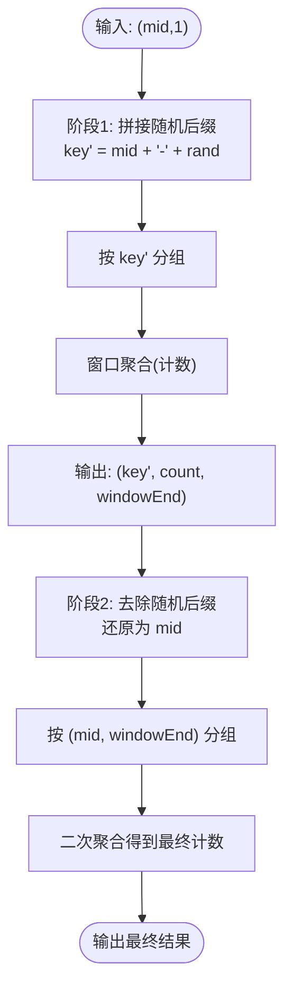
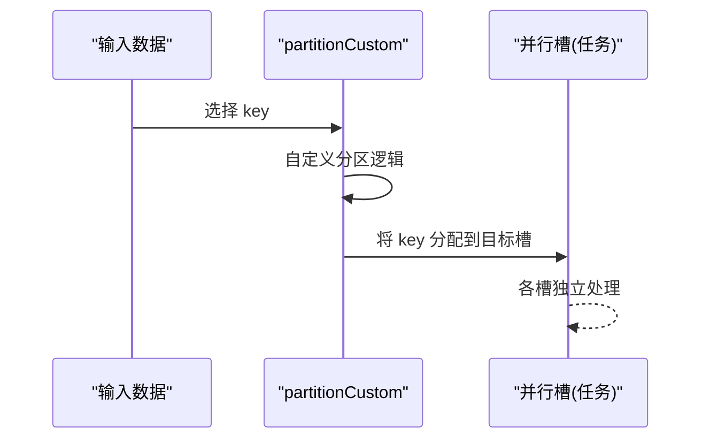
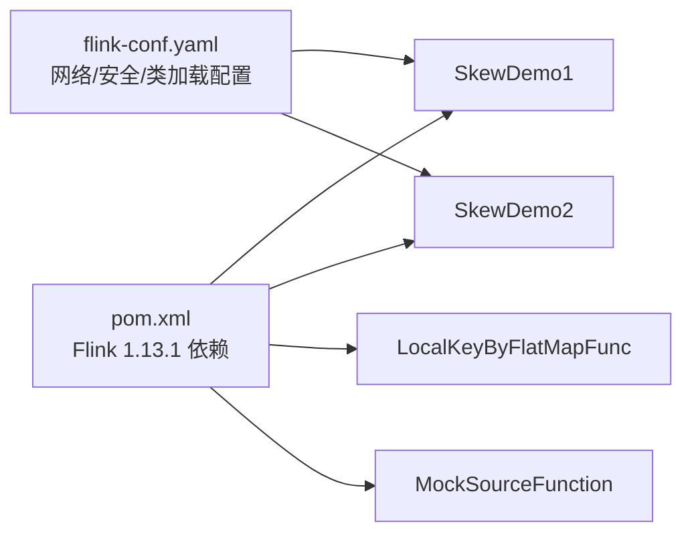

# 数据倾斜处理

<cite>
**本文引用的文件**
- [SkewDemo1.java](file://_06_flink_tuning/src/main/java/com/atguigu/flink/tuning/SkewDemo1.java)
- [SkewDemo2.java](file://_06_flink_tuning/src/main/java/com/atguigu/flink/tuning/SkewDemo2.java)
- [LocalKeyByFlatMapFunc.java](file://_06_flink_tuning/src/main/java/com/atguigu/flink/tuning/function/LocalKeyByFlatMapFunc.java)
- [MockSourceFunction.java](file://_06_flink\src\main\java\com\atguigu\flink\source\MockSourceFunction.java)
- [_01_exe.java](file://_06_flink\src\main\java\_07_Phy\_01_exe.java)
- [_02_customPhy.java](file://_06_flink\src\main\java\_07_Phy\_02_customPhy.java)
- [MidCountAndWindowEnd.java](file://_06_flink_tuning/src/main/java/com/atguigu/flink/tuning/bean/MidCountAndWindowEnd.java)
- [pom.xml](file://_06_flink_tuning/pom.xml)
- [flink-conf.yaml](file://_500_flink-prome2022_demo/src/main/resources/flink-conf.yaml)
</cite>

## 目录
1. [引言](#引言)
2. [项目结构](#项目结构)
3. [核心组件](#核心组件)
4. [架构总览](#架构总览)
5. [详细组件分析](#详细组件分析)
6. [依赖关系分析](#依赖关系分析)
7. [性能考量](#性能考量)
8. [故障排查指南](#故障排查指南)
9. [结论](#结论)
10. [附录](#附录)

## 引言
本技术文档围绕大数据系统中的“数据倾斜”问题展开，结合仓库内 Flink 示例工程，系统讲解倾斜的识别、分析与治理方法。内容涵盖倾斜成因、影响与危害、监控指标、诊断工具、处理流程以及可落地的最佳实践。文档同时给出基于重分区、采样分析、自定义分区器、两阶段聚合与本地预聚合等手段的实战案例，帮助开发者在真实项目中高效应对倾斜挑战。

## 项目结构
本仓库包含多个大数据教学与实战模块，其中与数据倾斜直接相关的核心示例位于 Flink 调优模块与物理分区演示模块：
- Flink 调优模块：提供倾斜检测与治理的端到端示例，包括本地预聚合、两阶段聚合、窗口化处理等。
- 物理分区演示模块：展示 shuffle、rebalance、自定义分区等底层数据分发策略，为理解倾斜成因与治理提供直观参考。

图表来源
- [SkewDemo1.java](file://_06_flink_tuning/src/main/java/com/atguigu/flink/tuning/SkewDemo1.java#L1-L74)
- [SkewDemo2.java](file://_06_flink_tuning/src/main/java/com/atguigu/flink/tuning/SkewDemo2.java#L1-L124)
- [LocalKeyByFlatMapFunc.java](file://_06_flink_tuning/src/main/java/com/atguigu/flink/tuning/function/LocalKeyByFlatMapFunc.java#L1-L95)
- [MockSourceFunction.java](file://_06_flink\src\main\java\com\atguigu\flink\source\MockSourceFunction.java#L1-L131)
- [_01_exe.java](file://_06_flink\src\main\java\_07_Phy\_01_exe.java#L1-L30)
- [_02_customPhy.java](file://_06_flink\src\main\java\_07_Phy\_02_customPhy.java#L1-L45)
- [MidCountAndWindowEnd.java](file://_06_flink_tuning/src/main/java/com/atguigu/flink/tuning/bean/MidCountAndWindowEnd.java#L1-L17)

章节来源
- [SkewDemo1.java](file://_06_flink_tuning/src/main/java/com/atguigu/flink/tuning/SkewDemo1.java#L1-L74)
- [SkewDemo2.java](file://_06_flink_tuning/src/main/java/com/atguigu/flink/tuning/SkewDemo2.java#L1-L124)
- [_01_exe.java](file://_06_flink\src\main\java\_07_Phy\_01_exe.java#L1-L30)
- [_02_customPhy.java](file://_06_flink\src\main\java\_07_Phy\_02_customPhy.java#L1-L45)

## 核心组件
- SkewDemo1：演示本地预聚合（Local Pre-aggregation）缓解 key 倾斜的方案，通过 RichFlatMap 在算子内部做本地缓冲与批量输出，减少热点 key 对下游算子的压力。
- SkewDemo2：演示两阶段聚合（Two-Phase Aggregation）缓解倾斜，先对 key 拼接随机后缀打散，窗口内局部聚合，再还原 key 并二次聚合，最终得到稳定吞吐。
- LocalKeyByFlatMapFunc：实现本地缓冲、批量化输出与状态快照恢复，保障 Exactly-once 语义。
- MockSourceFunction：模拟业务日志流，便于构造倾斜场景（如某些 mid 高频出现）。
- 物理分区示例：_01_exe 展示 shuffle/rebalance；_02_customPhy 展示自定义分区策略，帮助理解倾斜成因与治理方向。

章节来源
- [SkewDemo1.java](file://_06_flink_tuning/src/main/java/com/atguigu/flink/tuning/SkewDemo1.java#L1-L74)
- [SkewDemo2.java](file://_06_flink_tuning/src/main/java/com/atguigu/flink/tuning/SkewDemo2.java#L1-L124)
- [LocalKeyByFlatMapFunc.java](file://_06_flink_tuning/src/main/java/com/atguigu/flink/tuning/function/LocalKeyByFlatMapFunc.java#L1-L95)
- [MockSourceFunction.java](file://_06_flink\src\main\java\com\atguigu\flink\source\MockSourceFunction.java#L1-L131)
- [_01_exe.java](file://_06_flink\src\main\java\_07_Phy\_01_exe.java#L1-L30)
- [_02_customPhy.java](file://_06_flink\src\main\java\_07_Phy\_02_customPhy.java#L1-L45)

## 架构总览
下图展示了两条典型的数据倾斜治理路径：本地预聚合与两阶段聚合，并标注了关键组件与数据流转。

图表来源
- [SkewDemo1.java](file://_06_flink_tuning/src/main/java/com/atguigu/flink/tuning/SkewDemo1.java#L1-L74)
- [SkewDemo2.java](file://_06_flink_tuning/src/main/java/com/atguigu/flink/tuning/SkewDemo2.java#L1-L124)
- [LocalKeyByFlatMapFunc.java](file://_06_flink_tuning/src/main/java/com/atguigu/flink/tuning/function/LocalKeyByFlatMapFunc.java#L1-L95)
- [MockSourceFunction.java](file://_06_flink\src\main\java\com\atguigu\flink\source\MockSourceFunction.java#L1-L131)

## 详细组件分析

### 本地预聚合（Local Pre-aggregation）
- 设计思想：在 keyBy 之前，利用 RichFlatMap 在算子本地维护小批量缓冲，达到阈值后再统一输出，降低热点 key 的压力。
- 关键点：
  - 本地缓冲与批量化输出，减少下游 keyBy 的瞬时负载。
  - 通过快照状态保存缓冲，保证 Exactly-once。
  - 并行度变化时的状态合并逻辑，避免重复计数或丢失。
- 适用场景：热点 key 明显且窗口聚合成本高，但单 key 数据量可控。

图表来源
- [LocalKeyByFlatMapFunc.java](file://_06_flink_tuning/src/main/java/com/atguigu/flink/tuning/function/LocalKeyByFlatMapFunc.java#L1-L95)

章节来源
- [SkewDemo1.java](file://_06_flink_tuning/src/main/java/com/atguigu/flink/tuning/SkewDemo1.java#L1-L74)
- [LocalKeyByFlatMapFunc.java](file://_06_flink_tuning/src/main/java/com/atguigu/flink/tuning/function/LocalKeyByFlatMapFunc.java#L1-L95)

### 两阶段聚合（Two-Phase Aggregation）
- 设计思想：对热点 key 拼接随机后缀打散，先在窗口内做局部聚合，再还原 key 并二次聚合，从而分散热点。
- 关键点：
  - 第一阶段：key 拼接随机后缀，按新 key 分组并窗口聚合，输出包含窗口结束时间的结果。
  - 第二阶段：还原原始 key，按 (key, windowEnd) 再次分组并聚合，得到最终稳定结果。
  - 通过参数控制随机数粒度，平衡打散效果与二次聚合开销。
- 适用场景：强热点 key 且窗口聚合无法避免，需在不改变业务语义的前提下打散压力。

图表来源
- [SkewDemo2.java](file://_06_flink_tuning/src/main/java/com/atguigu/flink/tuning/SkewDemo2.java#L1-L124)
- [MidCountAndWindowEnd.java](file://_06_flink_tuning/src/main/java/com/atguigu/flink/tuning/bean/MidCountAndWindowEnd.java#L1-L17)

章节来源
- [SkewDemo2.java](file://_06_flink_tuning/src/main/java/com/atguigu/flink/tuning/SkewDemo2.java#L1-L124)
- [MidCountAndWindowEnd.java](file://_06_flink_tuning/src/main/java/com/atguigu/flink/tuning/bean/MidCountAndWindowEnd.java#L1-L17)

### 物理分区与自定义分区
- shuffle/rebalance：随机重分布，有助于缓解初始倾斜，但不改变 key 的分布规律。
- partitionCustom：允许根据业务规则自定义分区策略，将特定 key 固定分配到指定并行槽，或对热点 key 做差异化处理。
- 适用场景：热点 key 已知且可预测，可通过自定义分区策略引导数据分布。

图表来源
- [_01_exe.java](file://_06_flink\src\main\java\_07_Phy\_01_exe.java#L1-L30)
- [_02_customPhy.java](file://_06_flink\src\main\java\_07_Phy\_02_customPhy.java#L1-L45)

章节来源
- [_01_exe.java](file://_06_flink\src\main\java\_07_Phy\_01_exe.java#L1-L30)
- [_02_customPhy.java](file://_06_flink\src\main\java\_07_Phy\_02_customPhy.java#L1-L45)

### 数据源与倾斜构造
- MockSourceFunction：模拟业务日志流，可构造某些 mid 或事件类型高频出现的场景，用于验证倾斜治理策略的有效性。
- 建议：在测试环境中调整热点 key 的生成概率与数量，观察不同治理策略下的吞吐与延迟变化。

章节来源
- [MockSourceFunction.java](file://_06_flink\src\main\java\com\atguigu\flink\source\MockSourceFunction.java#L1-L131)

## 依赖关系分析
- 运行时依赖：示例工程基于 Flink 1.13.1，Streaming Java API 提供核心算子能力。
- 配置建议：网络内存、检查点存储、重启策略等可通过配置文件与代码共同控制，确保稳定性与可观测性。

图表来源
- [pom.xml](file://_06_flink_tuning/pom.xml#L1-L34)
- [flink-conf.yaml](file://_500_flink-prome2022_demo/src/main/resources/flink-conf.yaml#L188-L216)
- [SkewDemo1.java](file://_06_flink_tuning/src/main/java/com/atguigu/flink/tuning/SkewDemo1.java#L1-L74)
- [SkewDemo2.java](file://_06_flink_tuning/src/main/java/com/atguigu/flink/tuning/SkewDemo2.java#L1-L124)
- [LocalKeyByFlatMapFunc.java](file://_06_flink_tuning/src/main/java/com/atguigu/flink/tuning/function/LocalKeyByFlatMapFunc.java#L1-L95)
- [MockSourceFunction.java](file://_06_flink\src\main\java\com\atguigu\flink\source\MockSourceFunction.java#L1-L131)

章节来源
- [pom.xml](file://_06_flink_tuning/pom.xml#L1-L34)
- [flink-conf.yaml](file://_500_flink-prome2022_demo/src/main/resources/flink-conf.yaml#L188-L216)

## 性能考量
- 本地预聚合
  - 优点：显著降低热点 key 的下游压力，提升整体吞吐。
  - 注意：合理设置批次阈值，避免过大批次导致延迟上升；关注状态大小与快照开销。
- 两阶段聚合
  - 优点：对强热点 key 有明显缓解作用，适合窗口化统计。
  - 注意：随机后缀的粒度与二次聚合成本需权衡；窗口结束时间的传递需保持一致性。
- 物理分区
  - 优点：可在源头引导数据分布，减少后续算子压力。
  - 注意：自定义分区需保证数据正确性与一致性，避免引入新的热点。
- 窗口与背压
  - 建议开启检查点与合理的超时/间隔配置，避免长时间阻塞；必要时结合侧输出与容错策略。

## 故障排查指南
- 现象：个别算子吞吐骤降、延迟升高、检查点耗时异常。
  - 排查要点：确认是否存在强热点 key；评估是否启用本地预聚合或两阶段聚合；核对并行度与分区策略。
- 状态异常
  - 若并行度变更导致重复计数或数据丢失，检查本地缓冲状态的快照与恢复逻辑。
- 窗口结果异常
  - 若两阶段聚合结果不一致，重点核查随机后缀拼接与还原过程，以及窗口结束时间的传递。
- 监控与定位
  - 建议结合 Flink Web UI 的吞吐、延迟、检查点耗时、背压等指标进行定位；必要时开启更细粒度的日志与埋点。

章节来源
- [LocalKeyByFlatMapFunc.java](file://_06_flink_tuning/src/main/java/com/atguigu/flink/tuning/function/LocalKeyByFlatMapFunc.java#L1-L95)
- [SkewDemo2.java](file://_06_flink_tuning/src/main/java/com/atguigu/flink/tuning/SkewDemo2.java#L1-L124)

## 结论
数据倾斜是流式计算中的常见难题，需从“识别—分析—治理—监控—优化”的闭环入手。仓库中的示例提供了可直接复用的治理思路：本地预聚合与两阶段聚合分别适用于不同场景；物理分区策略可用于源头引导数据分布。结合稳定的检查点配置与可观测性指标，可在生产环境中持续降低倾斜风险，提升系统稳定性与吞吐表现。

## 附录
- 实战建议
  - 在开发环境构造倾斜场景，验证不同策略的效果与成本。
  - 对强热点 key 建立预警机制，提前介入治理。
  - 持续优化随机后缀粒度、窗口大小与并行度，寻找最优平衡点。
- 参考实现路径
  - 本地预聚合：[SkewDemo1.java](file://_06_flink_tuning/src/main/java/com/atguigu/flink/tuning/SkewDemo1.java#L1-L74)、[LocalKeyByFlatMapFunc.java](file://_06_flink_tuning/src/main/java/com/atguigu/flink/tuning/function/LocalKeyByFlatMapFunc.java#L1-L95)
  - 两阶段聚合：[SkewDemo2.java](file://_06_flink_tuning/src/main/java/com/atguigu/flink/tuning/SkewDemo2.java#L1-L124)、[MidCountAndWindowEnd.java](file://_06_flink_tuning/src/main/java/com/atguigu/flink/tuning/bean/MidCountAndWindowEnd.java#L1-L17)
  - 物理分区：[_01_exe.java](file://_06_flink\src\main\java\_07_Phy\_01_exe.java#L1-L30)、[_02_customPhy.java](file://_06_flink\src\main\java\_07_Phy\_02_customPhy.java#L1-L45)
  - 数据源：[MockSourceFunction.java](file://_06_flink\src\main\java\com\atguigu\flink\source\MockSourceFunction.java#L1-L131)