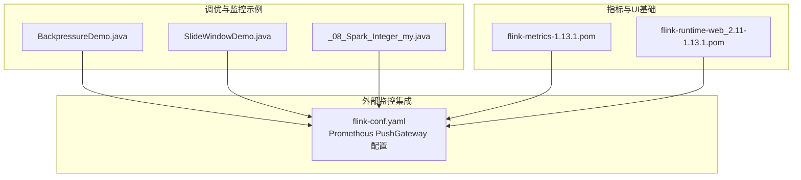
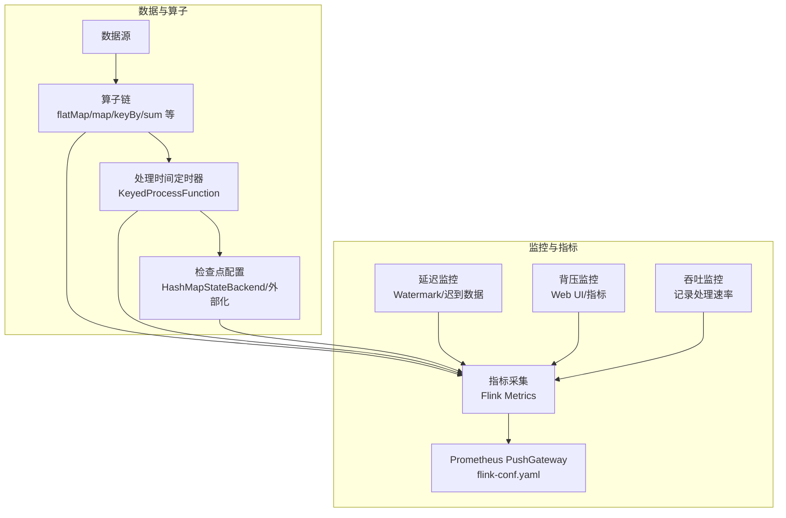
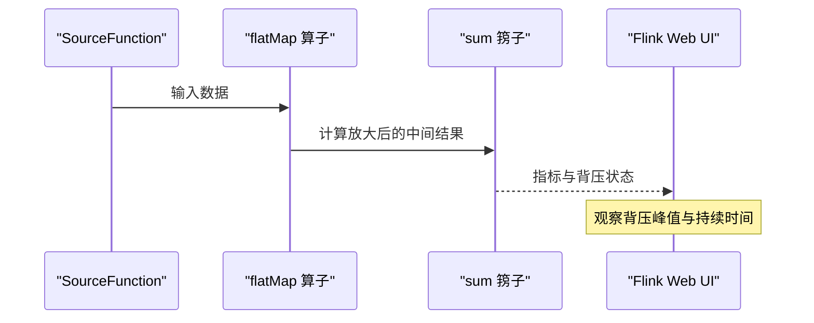
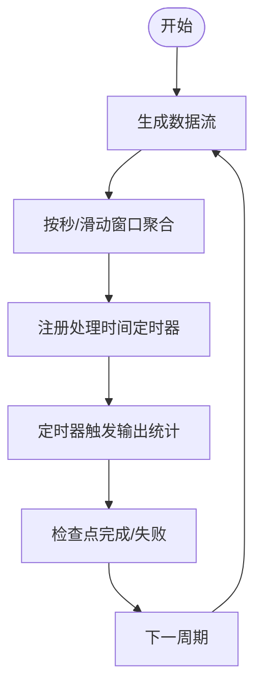
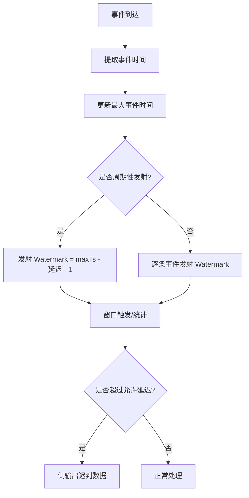
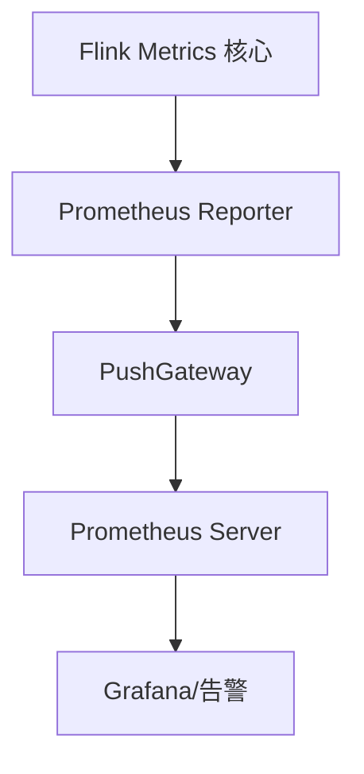
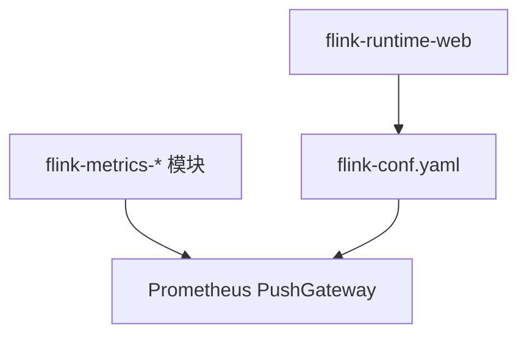

# 监控与指标分析

<cite>
**本文引用的文件**
- [BackpressureDemo.java](file://_06_flink_tuning/src/main/java/com/atguigu/flink/tuning/BackpressureDemo.java)
- [SlideWindowDemo.java](file://_06_flink_tuning/src/main/java/com/atguigu/flink/tuning/SlideWindowDemo.java)
- [flink调优.md](file://_06_flink_tuning/flink调优.md)
- [flink-conf.yaml](file://_500_flink-prome2022_demo/src/main/resources/flink-conf.yaml)
- [_08_Spark_Integer_my.java](file://_06_flink/src/main/java/_08_richFunction/_08_Spark_Integer_my.java)
- [WaterMark生成源码.txt](file://_06_flink/WaterMark生成源码.txt)
- [flink-metrics-1.13.1.pom](file://org/apache/flink/flink-metrics/1.13.1/flink-metrics-1.13.1.pom)
- [flink-runtime-web_2.11-1.13.1.pom](file://org/apache/flink/flink-runtime-web_2.11/1.13.1/flink-runtime-web_2.11-1.13.1.pom)
</cite>

## 目录
1. [引言](#引言)
2. [项目结构](#项目结构)
3. [核心组件](#核心组件)
4. [架构总览](#架构总览)
5. [详细组件分析](#详细组件分析)
6. [依赖关系分析](#依赖关系分析)
7. [性能考量](#性能考量)
8. [故障排查指南](#故障排查指南)
9. [结论](#结论)
10. [附录](#附录)

## 引言
本技术文档围绕大数据系统中的监控与指标分析展开，聚焦于 Apache Flink 流式计算场景下的监控体系建设与关键指标分析方法。文档以仓库中现有的 Flink 示例与配置为依据，系统讲解背压监控、吞吐量监控、延迟监控等指标的含义与分析路径，并提供基于 Flink Web UI、Metrics API 以及外部监控系统（如 Prometheus PushGateway）的集成实践。同时，结合实际示例展示如何通过指标分析定位性能瓶颈与异常，给出告警机制设置、性能基线建立与趋势分析的建议，帮助开发者构建完善的监控体系。

## 项目结构
本仓库包含多个与 Flink 相关的模块与示例，其中与监控与指标分析直接相关的内容主要集中在以下位置：
- 调优与背压演示：_06_flink_tuning 模块中的 BackpressureDemo 与 SlideWindowDemo，用于演示背压与窗口/检查点调优对监控指标的影响。
- 指标与外部系统集成：_500_flink-prome2022_demo 模块中的 flink-conf.yaml，展示了 Prometheus PushGateway 的集成配置。
- 定时器与状态驱动的统计输出：_06_flink 模块中的 _08_richFunction 示例，体现处理时间定时器与状态驱动的统计输出，便于理解延迟与吞吐的观测方式。
- 水位线与乱序处理：_06_flink 中的 WaterMark 生成与延迟处理示例，支撑延迟监控与迟到数据处理的指标分析。
- Flink 指标体系与 Web UI 依赖：org/apache/flink 下的 flink-metrics 与 flink-runtime-web POM 文件，为指标采集与 Web UI 提供基础能力。

**图示来源**
- [BackpressureDemo.java](file://_06_flink_tuning/src/main/java/com/atguigu/flink/tuning/BackpressureDemo.java#L1-L66)
- [SlideWindowDemo.java](file://_06_flink_tuning/src/main/java/com/atguigu/flink/tuning/SlideWindowDemo.java#L1-L101)
- [flink-conf.yaml](file://_500_flink-prome2022_demo/src/main/resources/flink-conf.yaml#L258-L268)
- [flink-metrics-1.13.1.pom](file://org/apache/flink/flink-metrics/1.13.1/flink-metrics-1.13.1.pom#L40-L50)
- [flink-runtime-web_2.11-1.13.1.pom](file://org/apache/flink/flink-runtime-web_2.11/1.13.1/flink-runtime-web_2.11-1.13.1.pom#L191-L214)

**章节来源**
- [BackpressureDemo.java](file://_06_flink_tuning/src/main/java/com/atguigu/flink/tuning/BackpressureDemo.java#L1-L66)
- [SlideWindowDemo.java](file://_06_flink_tuning/src/main/java/com/atguigu/flink/tuning/SlideWindowDemo.java#L1-L101)
- [flink-conf.yaml](file://_500_flink-prome2022_demo/src/main/resources/flink-conf.yaml#L258-L268)
- [flink-metrics-1.13.1.pom](file://org/apache/flink/flink-metrics/1.13.1/flink-metrics-1.13.1.pom#L40-L50)
- [flink-runtime-web_2.11-1.13.1.pom](file://org/apache/flink/flink-runtime-web_2.11/1.13.1/flink-runtime-web_2.11-1.13.1.pom#L191-L214)

## 核心组件
- 背压监控演示：通过刻意构造高计算负载的算子链，验证背压在 Web UI 与指标上的表现，辅助定位瓶颈阶段。
- 窗口与检查点调优：通过禁用算子链、启用检查点与外部化检查点等配置，观察对吞吐与延迟的影响。
- 处理时间定时器与状态统计：通过定时器周期性输出统计结果，支撑延迟与吞吐的观测与分析。
- Prometheus PushGateway 集成：通过 flink-conf.yaml 配置指标上报，实现与外部监控系统的对接。
- 水位线与乱序处理：通过 Watermark 生成策略与迟到数据侧输出，支撑延迟监控与异常识别。

**章节来源**
- [BackpressureDemo.java](file://_06_flink_tuning/src/main/java/com/atguigu/flink/tuning/BackpressureDemo.java#L1-L66)
- [SlideWindowDemo.java](file://_06_flink_tuning/src/main/java/com/atguigu/flink/tuning/SlideWindowDemo.java#L1-L101)
- [_08_Spark_Integer_my.java](file://_06_flink/src/main/java/_08_richFunction/_08_Spark_Integer_my.java#L1-L137)
- [flink-conf.yaml](file://_500_flink-prome2022_demo/src/main/resources/flink-conf.yaml#L258-L268)
- [WaterMark生成源码.txt](file://_06_flink/WaterMark生成源码.txt#L1-L31)

## 架构总览
下图展示了从数据源到算子、再到指标与外部监控系统的整体流程，以及背压、吞吐、延迟等关键指标在各环节的表现与观测点。

**图示来源**
- [BackpressureDemo.java](file://_06_flink_tuning/src/main/java/com/atguigu/flink/tuning/BackpressureDemo.java#L1-L66)
- [SlideWindowDemo.java](file://_06_flink_tuning/src/main/java/com/atguigu/flink/tuning/SlideWindowDemo.java#L1-L101)
- [_08_Spark_Integer_my.java](file://_06_flink/src/main/java/_08_richFunction/_08_Spark_Integer_my.java#L1-L137)
- [flink-conf.yaml](file://_500_flink-prome2022_demo/src/main/resources/flink-conf.yaml#L258-L268)

## 详细组件分析

### 背压监控：BackpressureDemo 分析
- 设计思路：通过禁用算子链并引入高计算复杂度的 flatMap 算子，模拟背压场景，验证背压在 Web UI 与指标上的表现。
- 关键观测点：
  - Web UI 中的背压指示与算子并行度、缓冲区使用率。
  - 指标层面的输入/输出缓冲区占用、网络 I/O 压力。
- 实践要点：
  - 在本地或集群环境中运行该示例，观察背压峰值与持续时间。
  - 结合检查点与状态后端配置，评估背压与状态恢复的关系。

**图示来源**
- [BackpressureDemo.java](file://_06_flink_tuning/src/main/java/com/atguigu/flink/tuning/BackpressureDemo.java#L1-L66)

**章节来源**
- [BackpressureDemo.java](file://_06_flink_tuning/src/main/java/com/atguigu/flink/tuning/BackpressureDemo.java#L1-L66)

### 吞吐量监控：SlideWindowDemo 与定时器统计
- 窗口与检查点调优：通过禁用算子链、启用精确一次语义的检查点、配置外部化检查点，观察对吞吐与稳定性的影响。
- 定时器统计：利用处理时间定时器周期性输出统计结果，支撑吞吐与延迟的观测。
- 关键观测点：
  - 每秒处理条数（TPS）、窗口聚合速率。
  - 检查点完成时间、失败次数与超时重试。
  - 定时器触发频率与下游消费能力。

**图示来源**
- [SlideWindowDemo.java](file://_06_flink_tuning/src/main/java/com/atguigu/flink/tuning/SlideWindowDemo.java#L1-L101)
- [_08_Spark_Integer_my.java](file://_06_flink/src/main/java/_08_richFunction/_08_Spark_Integer_my.java#L1-L137)

**章节来源**
- [SlideWindowDemo.java](file://_06_flink_tuning/src/main/java/com/atguigu/flink/tuning/SlideWindowDemo.java#L1-L101)
- [_08_Spark_Integer_my.java](file://_06_flink/src/main/java/_08_richFunction/_08_Spark_Integer_my.java#L1-L137)

### 延迟监控：水位线与迟到数据
- 水位线策略：支持单调递增与有界乱序两种策略，通过 Watermark 生成策略反映事件时间与处理时间的差距。
- 迟到数据处理：通过侧输出标签收集迟到数据，支撑延迟指标与异常识别。
- 关键观测点：
  - Watermark 推进速率与最大事件时间差。
  - 迟到数据比例与侧输出指标。
  - 允许延迟时间配置对延迟与吞吐的权衡。

**图示来源**
- [WaterMark生成源码.txt](file://_06_flink/WaterMark生成源码.txt#L1-L31)

**章节来源**
- [WaterMark生成源码.txt](file://_06_flink/WaterMark生成源码.txt#L1-L31)

### 指标体系与外部监控集成
- 指标模块：Flink Metrics 提供多种 Reporter（如 Prometheus、JMX、Graphite 等），便于统一采集与导出。
- Web UI 依赖：Flink Runtime Web 提供 Web UI 的运行时依赖，支持作业状态、任务槽、背压等可视化监控。
- Prometheus PushGateway 集成：通过 flink-conf.yaml 配置 Prometheus PushGateway 的地址、间隔与标签，实现指标推送与持久化。

**图示来源**
- [flink-metrics-1.13.1.pom](file://org/apache/flink/flink-metrics/1.13.1/flink-metrics-1.13.1.pom#L40-L50)
- [flink-runtime-web_2.11-1.13.1.pom](file://org/apache/flink/flink-runtime-web_2.11/1.13.1/flink-runtime-web_2.11-1.13.1.pom#L191-L214)
- [flink-conf.yaml](file://_500_flink-prome2022_demo/src/main/resources/flink-conf.yaml#L258-L268)

**章节来源**
- [flink-metrics-1.13.1.pom](file://org/apache/flink/flink-metrics/1.13.1/flink-metrics-1.13.1.pom#L40-L50)
- [flink-runtime-web_2.11-1.13.1.pom](file://org/apache/flink/flink-runtime-web_2.11/1.13.1/flink-runtime-web_2.11-1.13.1.pom#L191-L214)
- [flink-conf.yaml](file://_500_flink-prome2022_demo/src/main/resources/flink-conf.yaml#L258-L268)

## 依赖关系分析
- 指标模块依赖：flink-metrics-* 系列模块提供了多种指标采集后端，便于与外部监控系统对接。
- Web UI 依赖：flink-runtime-web 提供 Web UI 的运行时依赖，支持作业与任务的可视化监控。
- 配置依赖：Prometheus PushGateway 配置位于 flink-conf.yaml，影响指标上报行为与频率。

**图示来源**
- [flink-metrics-1.13.1.pom](file://org/apache/flink/flink-metrics/1.13.1/flink-metrics-1.13.1.pom#L40-L50)
- [flink-runtime-web_2.11-1.13.1.pom](file://org/apache/flink/flink-runtime-web_2.11/1.13.1/flink-runtime-web_2.11-1.13.1.pom#L191-L214)
- [flink-conf.yaml](file://_500_flink-prome2022_demo/src/main/resources/flink-conf.yaml#L258-L268)

**章节来源**
- [flink-metrics-1.13.1.pom](file://org/apache/flink/flink-metrics/1.13.1/flink-metrics-1.13.1.pom#L40-L50)
- [flink-runtime-web_2.11-1.13.1.pom](file://org/apache/flink/flink-runtime-web_2.11/1.13.1/flink-runtime-web_2.11-1.13.1.pom#L191-L214)
- [flink-conf.yaml](file://_500_flink-prome2022_demo/src/main/resources/flink-conf.yaml#L258-L268)

## 性能考量
- 背压定位：通过禁用算子链与引入高计算复杂度算子，快速识别瓶颈阶段；结合 Web UI 与指标，定位缓冲区与网络压力。
- 吞吐优化：合理设置检查点间隔与模式、启用外部化检查点、优化状态后端，平衡吞吐与一致性。
- 延迟控制：根据业务容忍度调整 Watermark 允许延迟时间，避免过度延迟导致窗口触发过晚；对迟到数据进行侧输出与专项处理。
- 指标采集：选择合适的指标后端（如 Prometheus PushGateway），设置合理的上报间隔与标签，确保指标可追踪与可告警。

[本节为通用指导，无需列出具体文件来源]

## 故障排查指南
- 背压异常：
  - 现象：下游算子缓冲区占用高、处理速率下降。
  - 排查：确认算子链是否存在计算密集型步骤；检查并行度与资源配额；观察 Web UI 背压指示。
  - 参考：BackpressureDemo 的算子链设计与禁用链式调优。
- 吞吐骤降：
  - 现象：TPS 明显下降，检查点耗时增加。
  - 排查：检查检查点配置（间隔、超时、外部化）与状态后端；评估下游写入性能。
  - 参考：SlideWindowDemo 的检查点与外部化配置。
- 延迟异常：
  - 现象：Watermark 推进缓慢，迟到数据比例升高。
  - 排查：调整允许延迟时间；检查数据源事件时间生成与水位线策略；关注侧输出指标。
  - 参考：WaterMark 生成策略与侧输出处理。
- 指标不可见：
  - 现象：Prometheus 无法抓取指标。
  - 排查：确认 flink-conf.yaml 中 PushGateway 地址、端口与上报间隔配置；验证网络连通性与权限。
  - 参考：Prometheus PushGateway 配置项。

**章节来源**
- [BackpressureDemo.java](file://_06_flink_tuning/src/main/java/com/atguigu/flink/tuning/BackpressureDemo.java#L1-L66)
- [SlideWindowDemo.java](file://_06_flink_tuning/src/main/java/com/atguigu/flink/tuning/SlideWindowDemo.java#L1-L101)
- [WaterMark生成源码.txt](file://_06_flink/WaterMark生成源码.txt#L1-L31)
- [flink-conf.yaml](file://_500_flink-prome2022_demo/src/main/resources/flink-conf.yaml#L258-L268)

## 结论
通过对仓库中现有示例与配置的系统梳理，本文件建立了以背压、吞吐、延迟为核心的监控与指标分析框架，并给出了基于 Flink Web UI、Metrics API 与 Prometheus PushGateway 的集成路径。结合实际示例，开发者可快速定位性能瓶颈、建立性能基线并进行趋势分析，最终形成完善的监控体系以保障生产环境的稳定运行。

[本节为总结性内容，无需列出具体文件来源]

## 附录
- 调优参考：仓库中的 flink调优.md 提供了资源与性能调优的思路，可作为进一步优化的参考。
- 指标后端：Flink Metrics 支持多种后端，可根据团队监控栈选择合适的 Reporter（如 Prometheus、JMX、Graphite 等）。

**章节来源**
- [flink调优.md](file://_06_flink_tuning/flink调优.md#L1-L10)
- [flink-metrics-1.13.1.pom](file://org/apache/flink/flink-metrics/1.13.1/flink-metrics-1.13.1.pom#L40-L50)