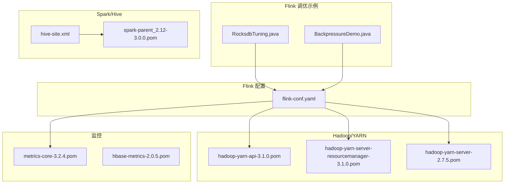
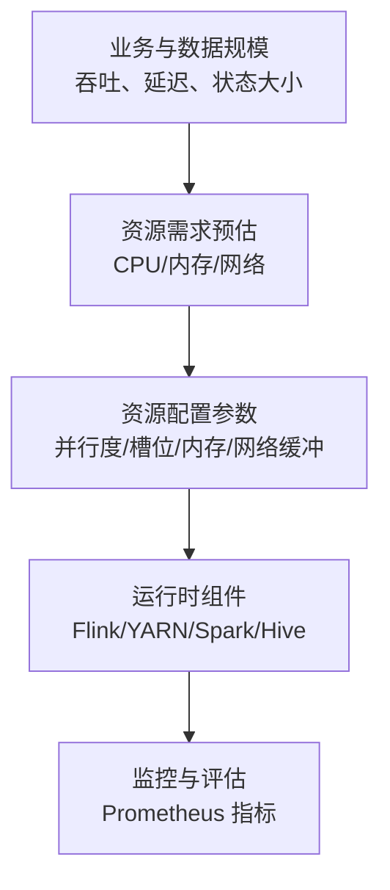
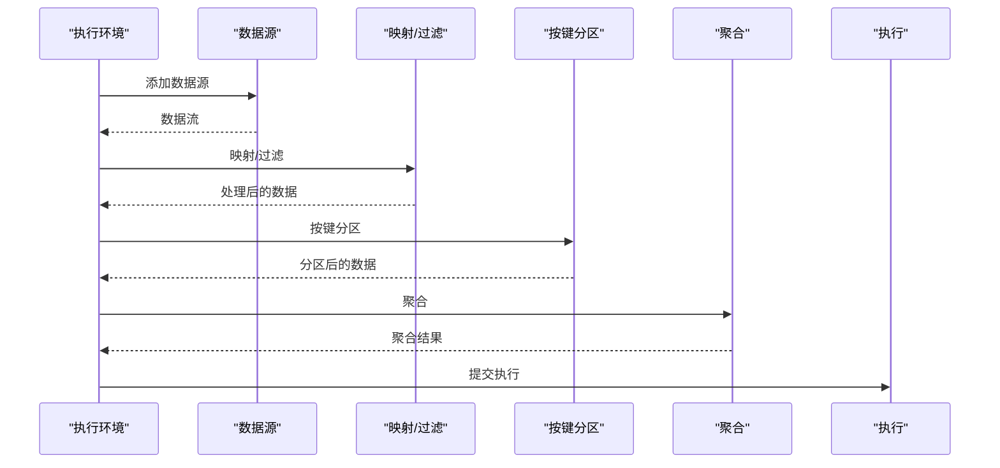
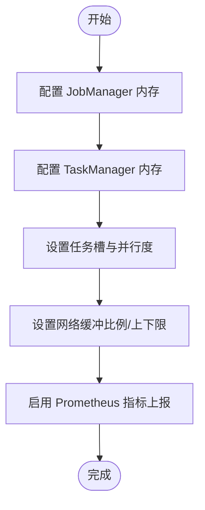
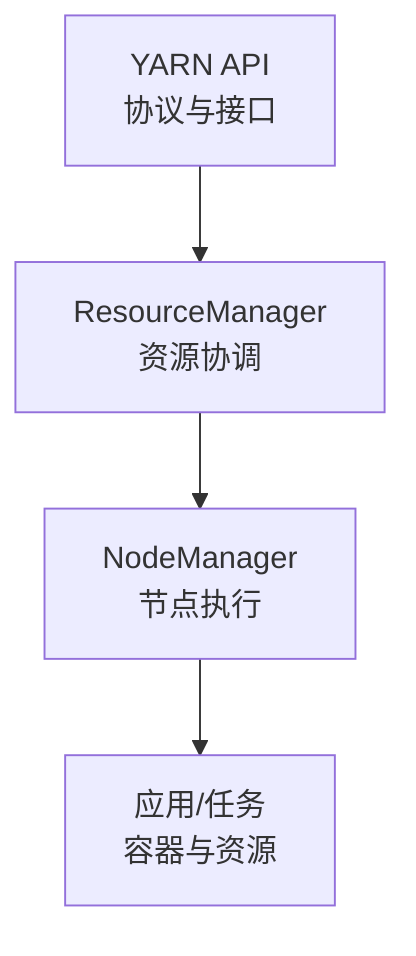
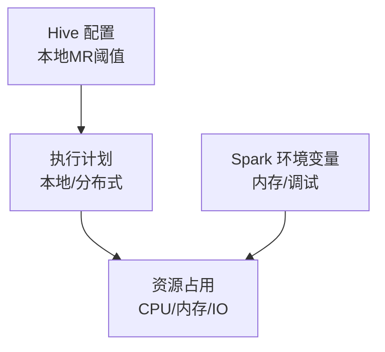
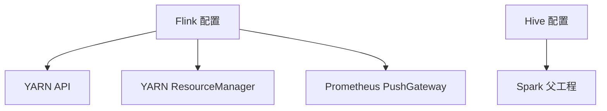

# 资源配置优化

<cite>
**本文引用的文件**
- [flink调优.md](file://_06_flink_tuning/flink调优.md)
- [RocksdbTuning.java](file://_06_flink_tuning/src/main/java/com/atguigu/flink/tuning/RocksdbTuning.java)
- [BackpressureDemo.java](file://_06_flink_tuning/src/main/java/com/atguigu/flink/tuning/BackpressureDemo.java)
- [flink-conf.yaml](file://_500_flink-prome2022_demo/src/main/resources/flink-conf.yaml)
- [hdfs-site.xml](file://_02_hadoop/HDFSClient/src/main/resources/hdfs-site.xml)
- [hive-site.xml](file://_04_sparkTest/src/main/resources/hive-site.xml)
- [flink-optimizer-1.17.2.pom](file://org/apache/flink/flink-optimizer/1.17.2/flink-optimizer-1.17.2.pom)
- [hadoop-yarn-api-3.1.0.pom](file://org/apache/hadoop/hadoop-yarn-api/3.1.0/hadoop-yarn-api-3.1.0.pom)
- [hadoop-yarn-server-resourcemanager-3.1.0.pom](file://org/apache/hadoop/hadoop-yarn-server-resourcemanager/3.1.0/hadoop-yarn-server-resourcemanager-3.1.0.pom)
- [hadoop-yarn-server-2.7.5.pom](file://org/apache/hadoop/hadoop-yarn-server/2.7.5/hadoop-yarn-server-2.7.5.pom)
- [metrics-core-3.2.4.pom](file://io/dropwizard/metrics/metrics-core/3.2.4/metrics-core-3.2.4.pom)
- [hbase-metrics-2.0.5.pom](file://org/apache/hbase/hbase-metrics/2.0.5/hbase-metrics-2.0.5.pom)
- [spark-parent_2.12-3.0.0.pom](file://org/apache/spark/spark-parent_2.12/3.0.0/spark-parent_2.12-3.0.0.pom)
</cite>

## 目录
1. [引言](#引言)
2. [项目结构](#项目结构)
3. [核心组件](#核心组件)
4. [架构总览](#架构总览)
5. [详细组件分析](#详细组件分析)
6. [依赖分析](#依赖分析)
7. [性能考量](#性能考量)
8. [故障排查指南](#故障排查指南)
9. [结论](#结论)
10. [附录](#附录)

## 引言
本技术文档围绕“资源配置优化”主题，聚焦于大数据系统中的资源规划与调优实践，涵盖 CPU、内存、网络带宽等硬件资源的合理分配策略；基于业务与数据规模进行资源需求预估，制定最优资源配置方案；提供资源监控与评估方法（含性能指标采集与分析）；并通过仓库中的实际示例（如 Flink、Hadoop、Spark、Hive、YARN、Prometheus 集成等）展示如何通过合理的资源分配提升系统整体性能，并在资源利用率、成本控制与性能之间取得平衡。

## 项目结构
该仓库包含多个大数据相关模块与示例，其中与资源配置优化直接相关的有：
- Flink 调优示例：包含 RocksDB 状态后端、检查点、背压演示等，用于理解内存与状态管理对资源的影响。
- Flink 配置样例：包含 JobManager/TaskManager 内存、网络缓冲、并行度、指标上报等配置项，可作为资源参数调优参考。
- Hadoop/YARN：包含 YARN API、ResourceManager 等模块的 POM 文件，体现资源调度与容器资源抽象。
- Spark/Hive：包含 Spark 父工程 POM 与 Hive 配置，体现批处理与元数据存储对资源占用的影响。
- Prometheus 集成：Flink 配置中启用 Prometheus PushGateway 报告器，便于采集与可视化资源与性能指标。

图表来源
- [RocksdbTuning.java](file://_06_flink_tuning/src/main/java/com/atguigu/flink/tuning/RocksdbTuning.java#L1-L76)
- [BackpressureDemo.java](file://_06_flink_tuning/src/main/java/com/atguigu/flink/tuning/BackpressureDemo.java#L1-L66)
- [flink-conf.yaml](file://_500_flink-prome2022_demo/src/main/resources/flink-conf.yaml#L26-L61)
- [hadoop-yarn-api-3.1.0.pom](file://org/apache/hadoop/hadoop-yarn-api/3.1.0/hadoop-yarn-api-3.1.0.pom#L89-L123)
- [hadoop-yarn-server-resourcemanager-3.1.0.pom](file://org/apache/hadoop/hadoop-yarn-server-resourcemanager/3.1.0/hadoop-yarn-server-resourcemanager-3.1.0.pom#L366-L403)
- [hadoop-yarn-server-2.7.5.pom](file://org/apache/hadoop/hadoop-yarn-server/2.7.5/hadoop-yarn-server-2.7.5.pom#L35-L46)
- [spark-parent_2.12-3.0.0.pom](file://org/apache/spark/spark-parent_2.12/3.0.0/spark-parent_2.12-3.0.0.pom#L2439-L3079)
- [hive-site.xml](file://_04_sparkTest/src/main/resources/hive-site.xml#L1-L96)
- [metrics-core-3.2.4.pom](file://io/dropwizard/metrics/metrics-core/3.2.4/metrics-core-3.2.4.pom#L1-L19)
- [hbase-metrics-2.0.5.pom](file://org/apache/hbase/hbase-metrics/2.0.5/hbase-metrics-2.0.5.pom#L129-L144)

章节来源
- [flink调优.md](file://_06_flink_tuning/flink调优.md#L1-L10)
- [flink-conf.yaml](file://_500_flink-prome2022_demo/src/main/resources/flink-conf.yaml#L26-L61)

## 核心组件
- Flink 调优示例
  - RocksDB 状态后端与检查点配置：通过状态后端与外部化检查点，影响内存与磁盘 IO 的资源占用与恢复性能。
  - 背压演示：通过人为制造计算瓶颈，模拟背压场景，帮助定位 CPU/线程与网络缓冲不足的问题。
- Flink 配置
  - JobManager/TaskManager 总内存与进程内存：决定 JVM 堆与元空间、开销的分配。
  - 任务槽与并行度：决定 CPU 并行粒度与资源切分。
  - 网络缓冲比例与上下限：决定网络栈可用内存范围，避免“网络缓冲不足”错误。
  - 指标上报（Prometheus PushGateway）：用于采集运行时指标，支撑资源监控与评估。
- Hadoop/YARN
  - YARN API 与 ResourceManager：体现资源申请、分配与回收的调度机制，是容器级资源抽象的基础。
- Spark/Hive
  - Spark 父工程 POM 中包含测试与运行时环境变量，体现内存与调试相关配置对资源占用的影响。
  - Hive 元数据与本地 MR 自动模式阈值：影响批处理任务的资源占用与执行路径选择。

章节来源
- [RocksdbTuning.java](file://_06_flink_tuning/src/main/java/com/atguigu/flink/tuning/RocksdbTuning.java#L1-L76)
- [BackpressureDemo.java](file://_06_flink_tuning/src/main/java/com/atguigu/flink/tuning/BackpressureDemo.java#L1-L66)
- [flink-conf.yaml](file://_500_flink-prome2022_demo/src/main/resources/flink-conf.yaml#L26-L61)
- [flink-conf.yaml](file://_500_flink-prome2022_demo/src/main/resources/flink-conf.yaml#L193-L200)
- [flink-conf.yaml](file://_500_flink-prome2022_demo/src/main/resources/flink-conf.yaml#L258-L269)
- [hadoop-yarn-api-3.1.0.pom](file://org/apache/hadoop/hadoop-yarn-api/3.1.0/hadoop-yarn-api-3.1.0.pom#L89-L123)
- [hadoop-yarn-server-resourcemanager-3.1.0.pom](file://org/apache/hadoop/hadoop-yarn-server-resourcemanager/3.1.0/hadoop-yarn-server-resourcemanager-3.1.0.pom#L366-L403)
- [spark-parent_2.12-3.0.0.pom](file://org/apache/spark/spark-parent_2.12/3.0.0/spark-parent_2.12-3.0.0.pom#L2439-L3079)
- [hive-site.xml](file://_04_sparkTest/src/main/resources/hive-site.xml#L74-L91)

## 架构总览
下图展示了从资源规划到运行时监控的整体架构：业务与数据规模驱动资源需求预估；通过 Flink/YARN/Spark/Hive 等组件的配置参数落地到容器与 JVM 层面；借助 Prometheus 指标体系实现资源与性能的持续观测与反馈。

图表来源
- [flink-conf.yaml](file://_500_flink-prome2022_demo/src/main/resources/flink-conf.yaml#L26-L61)
- [flink-conf.yaml](file://_500_flink-prome2022_demo/src/main/resources/flink-conf.yaml#L193-L200)
- [flink-conf.yaml](file://_500_flink-prome2022_demo/src/main/resources/flink-conf.yaml#L258-L269)
- [hadoop-yarn-api-3.1.0.pom](file://org/apache/hadoop/hadoop-yarn-api/3.1.0/hadoop-yarn-api-3.1.0.pom#L89-L123)
- [spark-parent_2.12-3.0.0.pom](file://org/apache/spark/spark-parent_2.12/3.0.0/spark-parent_2.12-3.0.0.pom#L2439-L3079)

## 详细组件分析

### Flink 调优组件分析
- RocksDB 状态后端与检查点
  - 通过状态后端与外部化检查点配置，影响内存与磁盘 IO 的资源占用与恢复性能，适合高状态、长窗口或强一致性的场景。
- 背压演示
  - 通过人为制造计算瓶颈，模拟背压场景，帮助定位 CPU/线程与网络缓冲不足的问题。

图表来源
- [RocksdbTuning.java](file://_06_flink_tuning/src/main/java/com/atguigu/flink/tuning/RocksdbTuning.java#L46-L71)
- [BackpressureDemo.java](file://_06_flink_tuning/src/main/java/com/atguigu/flink/tuning/BackpressureDemo.java#L24-L61)

章节来源
- [RocksdbTuning.java](file://_06_flink_tuning/src/main/java/com/atguigu/flink/tuning/RocksdbTuning.java#L1-L76)
- [BackpressureDemo.java](file://_06_flink_tuning/src/main/java/com/atguigu/flink/tuning/BackpressureDemo.java#L1-L66)

### Flink 配置参数与资源关系
- JobManager/TaskManager 总内存与进程内存
  - 决定 JVM 堆与元空间、开销的分配，直接影响 GC 压力与可用内存。
- 任务槽与并行度
  - 决定 CPU 并行粒度与资源切分，需结合核数与负载模型进行权衡。
- 网络缓冲比例与上下限
  - 决定网络栈可用内存范围，避免“网络缓冲不足”错误，适用于高吞吐网络传输场景。
- 指标上报（Prometheus PushGateway）
  - 用于采集运行时指标，支撑资源监控与评估。

图表来源
- [flink-conf.yaml](file://_500_flink-prome2022_demo/src/main/resources/flink-conf.yaml#L26-L61)
- [flink-conf.yaml](file://_500_flink-prome2022_demo/src/main/resources/flink-conf.yaml#L193-L200)
- [flink-conf.yaml](file://_500_flink-prome2022_demo/src/main/resources/flink-conf.yaml#L258-L269)

章节来源
- [flink-conf.yaml](file://_500_flink-prome2022_demo/src/main/resources/flink-conf.yaml#L26-L61)
- [flink-conf.yaml](file://_500_flink-prome2022_demo/src/main/resources/flink-conf.yaml#L193-L200)
- [flink-conf.yaml](file://_500_flink-prome2022_demo/src/main/resources/flink-conf.yaml#L258-L269)

### YARN 资源调度与容器抽象
- YARN API 与 ResourceManager
  - 体现资源申请、分配与回收的调度机制，是容器级资源抽象的基础。
- YARN Server 模块组织
  - 包含通用、节点管理器、资源管理器等模块，反映资源管理的层次化设计。

图表来源
- [hadoop-yarn-api-3.1.0.pom](file://org/apache/hadoop/hadoop-yarn-api/3.1.0/hadoop-yarn-api-3.1.0.pom#L89-L123)
- [hadoop-yarn-server-resourcemanager-3.1.0.pom](file://org/apache/hadoop/hadoop-yarn-server-resourcemanager/3.1.0/hadoop-yarn-server-resourcemanager-3.1.0.pom#L366-L403)
- [hadoop-yarn-server-2.7.5.pom](file://org/apache/hadoop/hadoop-yarn-server/2.7.5/hadoop-yarn-server-2.7.5.pom#L35-L46)

章节来源
- [hadoop-yarn-api-3.1.0.pom](file://org/apache/hadoop/hadoop-yarn-api/3.1.0/hadoop-yarn-api-3.1.0.pom#L89-L123)
- [hadoop-yarn-server-resourcemanager-3.1.0.pom](file://org/apache/hadoop/hadoop-yarn-server-resourcemanager/3.1.0/hadoop-yarn-server-resourcemanager-3.1.0.pom#L366-L403)
- [hadoop-yarn-server-2.7.5.pom](file://org/apache/hadoop/hadoop-yarn-server/2.7.5/hadoop-yarn-server-2.7.5.pom#L35-L46)

### Spark/Hive 资源占用与执行路径
- Spark 父工程 POM
  - 包含测试与运行时环境变量，体现内存与调试相关配置对资源占用的影响。
- Hive 元数据与本地 MR 自动模式阈值
  - 影响批处理任务的资源占用与执行路径选择（本地模式 vs 分布式 MR）。

图表来源
- [hive-site.xml](file://_04_sparkTest/src/main/resources/hive-site.xml#L74-L91)
- [spark-parent_2.12-3.0.0.pom](file://org/apache/spark/spark-parent_2.12/3.0.0/spark-parent_2.12-3.0.0.pom#L2439-L3079)

章节来源
- [hive-site.xml](file://_04_sparkTest/src/main/resources/hive-site.xml#L1-L96)
- [spark-parent_2.12-3.0.0.pom](file://org/apache/spark/spark-parent_2.12/3.0.0/spark-parent_2.12-3.0.0.pom#L2439-L3079)

### HBase/Metrics 资源监控基础
- DropWizard Metrics 与 HBase Metrics
  - 提供通用指标采集能力，可作为资源监控与评估的基础设施。

章节来源
- [metrics-core-3.2.4.pom](file://io/dropwizard/metrics/metrics-core/3.2.4/metrics-core-3.2.4.pom#L1-L19)
- [hbase-metrics-2.0.5.pom](file://org/apache/hbase/hbase-metrics/2.0.5/hbase-metrics-2.0.5.pom#L129-L144)

## 依赖分析
- 组件耦合与协作
  - Flink 配置依赖 YARN 资源管理（容器与槽位），并通过 Prometheus 指标进行运行时观测。
  - Spark/Hive 通过各自的配置与父工程 POM 影响资源占用与执行路径。
- 外部依赖与集成点
  - Prometheus PushGateway 作为指标上报通道，与 Flink 配置集成。
  - YARN API/ResourceManager 作为资源调度的核心模块。

图表来源
- [flink-conf.yaml](file://_500_flink-prome2022_demo/src/main/resources/flink-conf.yaml#L258-L269)
- [hadoop-yarn-api-3.1.0.pom](file://org/apache/hadoop/hadoop-yarn-api/3.1.0/hadoop-yarn-api-3.1.0.pom#L89-L123)
- [hadoop-yarn-server-resourcemanager-3.1.0.pom](file://org/apache/hadoop/hadoop-yarn-server-resourcemanager/3.1.0/hadoop-yarn-server-resourcemanager-3.1.0.pom#L366-L403)
- [hive-site.xml](file://_04_sparkTest/src/main/resources/hive-site.xml#L1-L96)
- [spark-parent_2.12-3.0.0.pom](file://org/apache/spark/spark-parent_2.12/3.0.0/spark-parent_2.12-3.0.0.pom#L2439-L3079)

章节来源
- [flink-conf.yaml](file://_500_flink-prome2022_demo/src/main/resources/flink-conf.yaml#L258-L269)
- [hadoop-yarn-api-3.1.0.pom](file://org/apache/hadoop/hadoop-yarn-api/3.1.0/hadoop-yarn-api-3.1.0.pom#L89-L123)
- [hadoop-yarn-server-resourcemanager-3.1.0.pom](file://org/apache/hadoop/hadoop-yarn-server-resourcemanager/3.1.0/hadoop-yarn-server-resourcemanager-3.1.0.pom#L366-L403)
- [hive-site.xml](file://_04_sparkTest/src/main/resources/hive-site.xml#L1-L96)
- [spark-parent_2.12-3.0.0.pom](file://org/apache/spark/spark-parent_2.12/3.0.0/spark-parent_2.12-3.0.0.pom#L2439-L3079)

## 性能考量
- 资源利用率优化
  - 合理设置任务槽与并行度，避免过度切分导致上下文切换与调度开销上升。
  - 控制网络缓冲比例与上下限，防止“网络缓冲不足”错误，同时避免过度预留造成浪费。
- 成本控制
  - 在满足 SLA 的前提下，尽量减少冗余内存与磁盘 IO，降低集群资源占用。
  - 结合本地 MR 与分布式 MR 的阈值，选择更经济的执行路径。
- 性能平衡
  - 通过 Prometheus 指标持续观测 CPU 使用率、GC 时间、背压、网络缓冲等关键指标，动态调整资源配置参数。

## 故障排查指南
- 背压问题
  - 通过背压演示程序定位瓶颈，结合任务槽与并行度调整，必要时增加 CPU 或网络缓冲。
- 网络缓冲不足
  - 检查网络缓冲比例与上下限配置，适当提高最小/最大值以适配高吞吐场景。
- 指标缺失或上报异常
  - 检查 Prometheus PushGateway 的地址、端口与间隔配置，确保网络连通与权限正确。

章节来源
- [BackpressureDemo.java](file://_06_flink_tuning/src/main/java/com/atguigu/flink/tuning/BackpressureDemo.java#L1-L66)
- [flink-conf.yaml](file://_500_flink-prome2022_demo/src/main/resources/flink-conf.yaml#L193-L200)
- [flink-conf.yaml](file://_500_flink-prome2022_demo/src/main/resources/flink-conf.yaml#L258-L269)

## 结论
通过对 Flink、YARN、Spark、Hive 等组件的配置与示例进行系统性分析，可以建立从“业务与数据规模”到“资源配置参数”再到“运行时监控”的完整闭环。实践中应以 Prometheus 指标为依据，持续观测 CPU、内存、网络与状态后端的资源占用，动态调整并行度、槽位、内存与网络缓冲等参数，在资源利用率、成本控制与性能之间取得最佳平衡。

## 附录
- 参考配置要点
  - JobManager/TaskManager 内存与进程内存
  - 任务槽与并行度
  - 网络缓冲比例与上下限
  - Prometheus 指标上报（PushGateway）

章节来源
- [flink-conf.yaml](file://_500_flink-prome2022_demo/src/main/resources/flink-conf.yaml#L26-L61)
- [flink-conf.yaml](file://_500_flink-prome2022_demo/src/main/resources/flink-conf.yaml#L193-L200)
- [flink-conf.yaml](file://_500_flink-prome2022_demo/src/main/resources/flink-conf.yaml#L258-L269)