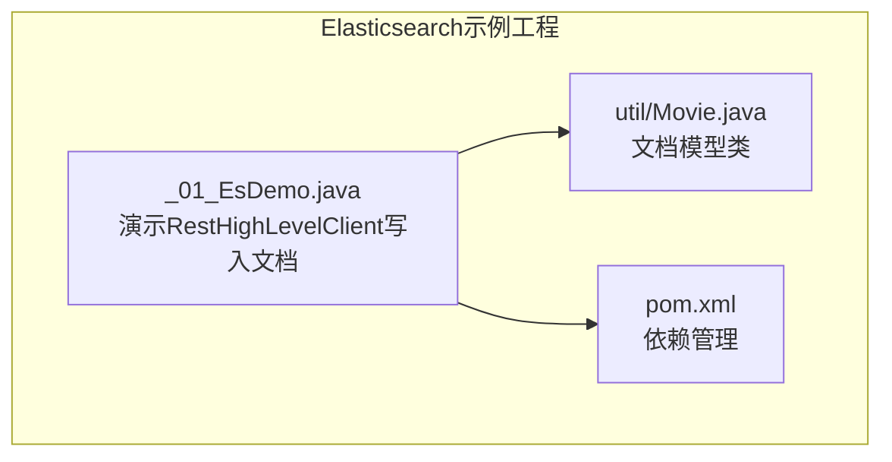
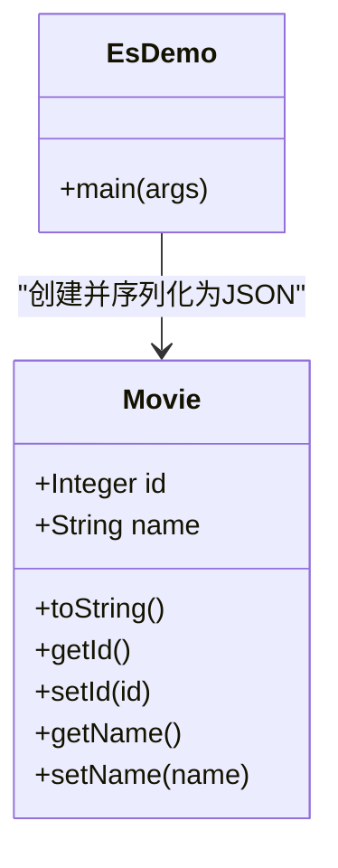
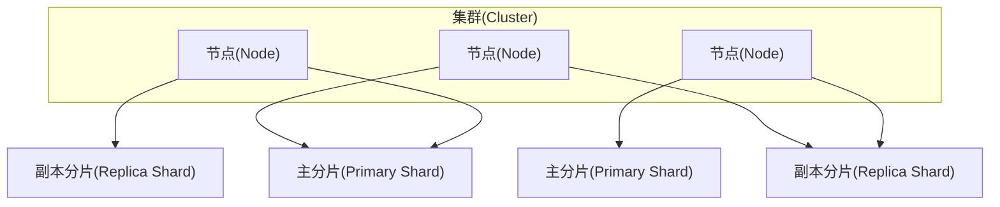
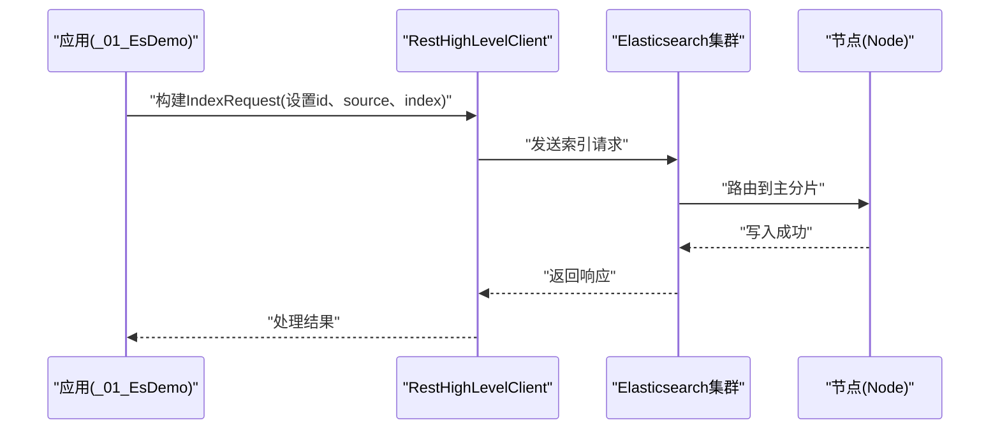
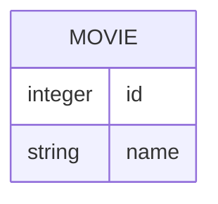
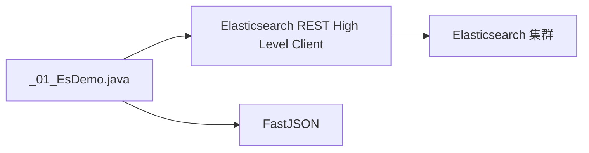

# Elasticsearch基础概念

<cite>
**本文引用的文件**
- [_01_EsDemo.java](file://_10_es/src/main/java/_01_EsDemo.java)
- [Movie.java](file://_10_es/src/main/java/util/Movie.java)
- [pom.xml](file://_10_es/pom.xml)
</cite>

## 目录
1. [简介](#简介)
2. [项目结构](#项目结构)
3. [核心组件](#核心组件)
4. [架构总览](#架构总览)
5. [详细组件分析](#详细组件分析)
6. [依赖分析](#依赖分析)
7. [性能考量](#性能考量)
8. [故障排查指南](#故障排查指南)
9. [结论](#结论)
10. [附录](#附录)

## 简介
本入门文档围绕Elasticsearch的基础概念展开，结合仓库中的Java示例，系统讲解以下主题：
- 集群(Cluster)、节点(Node)、索引(Index)、类型(Type)、文档(Document)、字段(Field)等核心术语
- 分布式架构原理：主分片与副本分片的作用机制
- 倒排索引的工作原理与优势，以及与传统关系型数据库的区别
- 通过Movie实体类展示文档的结构化存储方式
- Elasticsearch与其他搜索引擎的对比分析
- 基本安装配置与集群健康检查方法（基于示例代码的可操作步骤）

## 项目结构
该仓库包含一个最小化的Elasticsearch示例工程，演示如何通过Java客户端向Elasticsearch写入文档。关键文件如下：
- 示例入口类：_01_EsDemo.java
- 文档模型类：util/Movie.java
- 构建脚本：pom.xml

**图表来源**
- [_01_EsDemo.java](file://_10_es/src/main/java/_01_EsDemo.java#L1-L45)
- [Movie.java](file://_10_es/src/main/java/util/Movie.java#L1-L36)
- [pom.xml](file://_10_es/pom.xml)

**章节来源**
- [_01_EsDemo.java](file://_10_es/src/main/java/_01_EsDemo.java#L1-L45)
- [Movie.java](file://_10_es/src/main/java/util/Movie.java#L1-L36)
- [pom.xml](file://_10_es/pom.xml)

## 核心组件
本节以仓库中的代码为线索，解释Elasticsearch的核心术语与它们之间的关系。

- 集群(Cluster)：由一个或多个节点组成的服务集合，对外提供搜索与索引能力。示例中通过RestHighLevelClient连接到集群节点。
- 节点(Node)：集群中的单个实例。示例中通过HttpHost指向具体节点地址与端口。
- 索引(Index)：用于存储相关文档的逻辑命名空间，类似关系型数据库中的“表”。示例中通过IndexRequest设置索引名称。
- 类型(Type)：旧版本Elasticsearch中用于区分同一索引下不同类型的文档；新版本默认不再强制要求类型。示例未显式设置类型。
- 文档(Document)：索引的基本单元，通常以JSON格式存储。示例中将Movie对象序列化为JSON后写入。
- 字段(Field)：文档中的键值对。示例中Movie包含id与name两个字段。

**图表来源**
- [Movie.java](file://_10_es/src/main/java/util/Movie.java#L1-L36)
- [_01_EsDemo.java](file://_10_es/src/main/java/_01_EsDemo.java#L1-L45)

**章节来源**
- [_01_EsDemo.java](file://_10_es/src/main/java/_01_EsDemo.java#L1-L45)
- [Movie.java](file://_10_es/src/main/java/util/Movie.java#L1-L36)

## 架构总览
Elasticsearch采用分布式架构，典型部署包含多个节点，每个节点可承担多种角色（如主分片、副本分片）。主分片负责实际数据存储，副本分片提供高可用与读扩展。

说明：
- 主分片与副本分片分布在不同节点上，确保故障转移与读写扩展。
- 写入请求通常先写入主分片，再复制到副本分片。
- 读取请求可在主分片或任意副本分片执行，提升吞吐。

## 详细组件分析

### 写入流程（IndexRequest）
示例展示了通过RestHighLevelClient将文档写入Elasticsearch的完整过程。

要点：
- 设置文档id：保证幂等性，避免重复写入相同id的文档。
- 设置source：将对象序列化为JSON字符串，并声明内容类型。
- 设置index：指定目标索引名称。
- 返回响应：可用于判断写入是否成功。

**图表来源**
- [_01_EsDemo.java](file://_10_es/src/main/java/_01_EsDemo.java#L1-L45)

**章节来源**
- [_01_EsDemo.java](file://_10_es/src/main/java/_01_EsDemo.java#L1-L45)

### 文档模型（Movie）
Movie类体现了文档的结构化存储方式，包含id与name两个字段。在Elasticsearch中，这些字段会被映射为索引中的字段，支持全文检索、数值范围查询、聚合分析等。

**图表来源**
- [Movie.java](file://_10_es/src/main/java/util/Movie.java#L1-L36)

**章节来源**
- [Movie.java](file://_10_es/src/main/java/util/Movie.java#L1-L36)

### 倒排索引与关系型数据库对比
- 倒排索引：将词项映射到包含该词项的文档列表，适合全文检索与相关性评分。
- 关系型数据库：以行/列结构存储，擅长ACID事务与复杂关联查询，但在大规模全文检索与近实时分析方面不如倒排索引高效。

优势对比：
- 检索效率：倒排索引在关键词匹配与模糊检索上更高效。
- 扩展性：Elasticsearch天然分布式，易于水平扩展。
- 实时性：近实时索引与查询，适合日志分析、监控告警等场景。

## 依赖分析
示例工程通过Maven引入Elasticsearch客户端依赖，以便在Java应用中与Elasticsearch交互。

说明：
- RestHighLevelClient用于简化HTTP请求封装。
- FastJSON用于将对象序列化为JSON字符串。
- ES为远程集群服务端。

**图表来源**
- [_01_EsDemo.java](file://_10_es/src/main/java/_01_EsDemo.java#L1-L45)
- [pom.xml](file://_10_es/pom.xml)

**章节来源**
- [_01_EsDemo.java](file://_10_es/src/main/java/_01_EsDemo.java#L1-L45)
- [pom.xml](file://_10_es/pom.xml)

## 性能考量
- 分片策略：合理设置主分片数量与副本数量，平衡写入吞吐与查询并发。
- 文档建模：字段映射应与查询模式匹配，避免过多动态字段导致映射膨胀。
- 索引刷新间隔：根据写入频率调整refresh_interval，权衡写入延迟与可见性。
- 聚合与查询：尽量使用过滤条件减少扫描范围，避免全量扫描。

## 故障排查指南
- 连接失败：确认集群节点可达、端口开放、网络连通。
- 写入异常：检查IndexRequest参数（id、index、source），确保JSON格式正确。
- 响应校验：根据返回的IndexResponse判断写入状态，定位错误原因。
- 日志与监控：开启客户端与服务端日志，观察错误堆栈与慢查询记录。

**章节来源**
- [_01_EsDemo.java](file://_10_es/src/main/java/_01_EsDemo.java#L1-L45)

## 结论
通过本示例，读者可以理解Elasticsearch的核心术语、分布式架构与倒排索引的优势，并掌握如何在Java应用中使用REST客户端写入文档。结合合理的分片与映射策略，Elasticsearch能够胜任日志分析、搜索推荐、监控告警等大规模数据检索与分析场景。

## 附录
- 安装与配置（基于示例的可操作步骤）：
  - 启动Elasticsearch服务端（确保端口9200可用）。
  - 在示例中修改节点地址与端口，使其指向实际运行的集群节点。
  - 运行示例程序，观察写入结果与返回响应。
- 集群健康检查：
  - 通过客户端或命令行访问集群健康状态接口，确认主分片与副本分片分布正常。
  - 观察节点数量、分片状态与分配情况，排查未分配分片与节点离线问题。