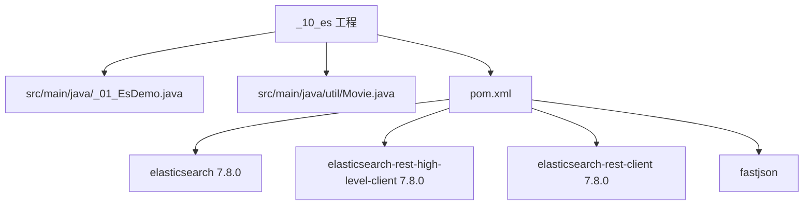
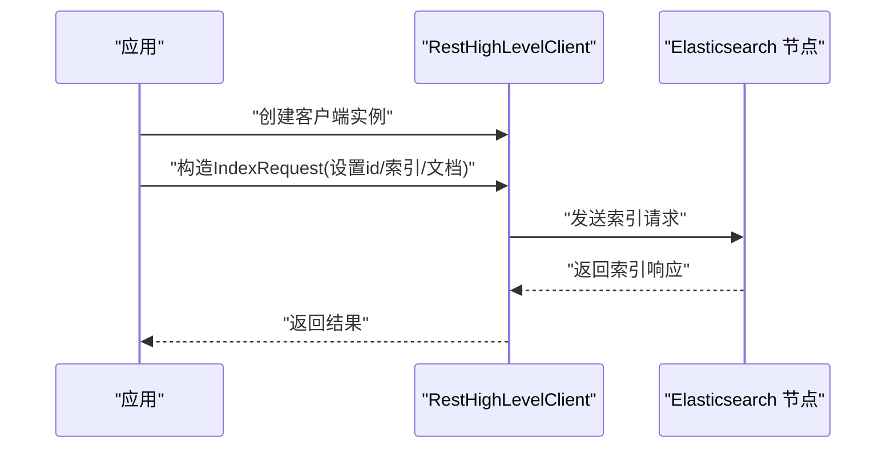
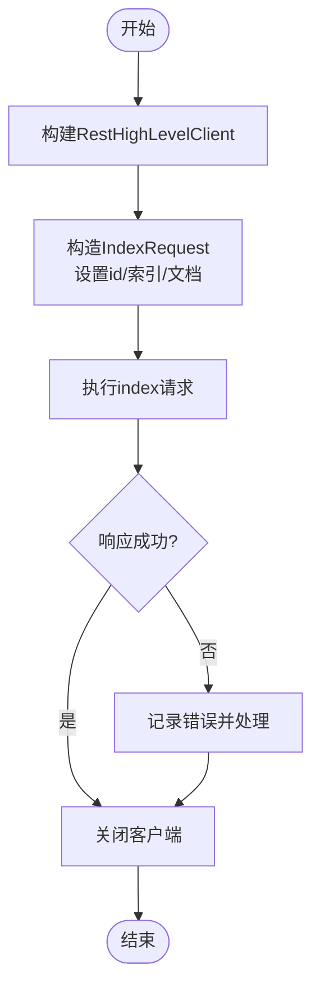
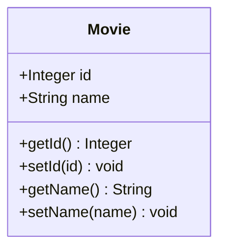
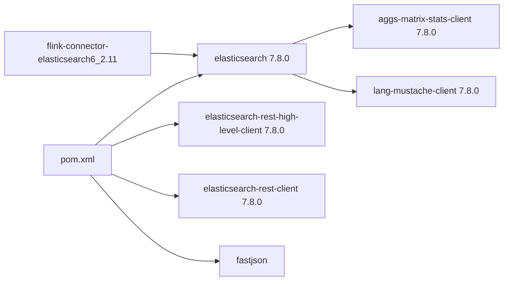
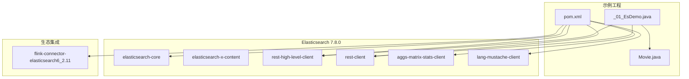

# Elasticsearch搜索引擎

<cite>
**本文引用的文件**
- [_01_EsDemo.java](file://_10_es/src/main/java/_01_EsDemo.java)
- [Movie.java](file://_10_es/src/main/java/util/Movie.java)
- [pom.xml](file://_10_es/pom.xml)
- [elasticsearch-rest-client-7.8.0.pom](file://org/elasticsearch/client/elasticsearch-rest-client/7.8.0/elasticsearch-rest-client-7.8.0.pom)
- [elasticsearch-rest-high-level-client-7.8.0.pom](file://org/elasticsearch/client/elasticsearch-rest-high-level-client/7.8.0/elasticsearch-rest-high-level-client-7.8.0.pom)
- [elasticsearch-7.8.0.pom](file://org/elasticsearch/elasticsearch/7.8.0/elasticsearch-7.8.0.pom)
- [elasticsearch-x-content-7.8.0.pom](file://org/elasticsearch/elasticsearch-x-content/7.8.0/elasticsearch-x-content-7.8.0.pom)
- [aggs-matrix-stats-client-7.8.0.pom](file://org/elasticsearch/plugin/aggs-matrix-stats-client/7.8.0/aggs-matrix-stats-client-7.8.0.pom)
- [lang-mustache-client-7.8.0.pom](file://org/elasticsearch/plugin/lang-mustache-client/7.8.0/lang-mustache-client-7.8.0.pom)
- [flink-connector-elasticsearch6_2.11-1.13.1.pom](file://org/apache/flink/flink-connector-elasticsearch6_2.11/1.13.1/flink-connector-elasticsearch6_2.11-1.13.1.pom)
</cite>

## 目录
1. [简介](#简介)
2. [项目结构](#项目结构)
3. [核心组件](#核心组件)
4. [架构总览](#架构总览)
5. [详细组件分析](#详细组件分析)
6. [依赖关系分析](#依赖关系分析)
7. [性能考虑](#性能考虑)
8. [故障排查指南](#故障排查指南)
9. [结论](#结论)
10. [附录](#附录)

## 简介
本文件围绕仓库中的Elasticsearch示例工程，系统梳理Elasticsearch作为分布式搜索与分析引擎的架构原理、核心概念（索引、映射、文档、倒排索引）与关键API使用方法，并结合示例代码路径给出可操作的实践指引。同时，基于仓库内依赖信息，说明与Kibana、Logstash、Flink等ELK生态组件的集成思路与版本对应关系，帮助读者在应用中完成从“写入文档”到“查询与聚合”的端到端落地。

## 项目结构
该工程位于 _10_es 目录，包含一个最小可用示例：通过RestHighLevelClient连接Elasticsearch，构造IndexRequest写入一条文档。示例依赖采用Elasticsearch 7.8.0版本的客户端与核心模块。

图表来源
- [_01_EsDemo.java](file://_10_es/src/main/java/_01_EsDemo.java#L1-L44)
- [Movie.java](file://_10_es/src/main/java/util/Movie.java#L1-L36)
- [pom.xml](file://_10_es/pom.xml#L1-L44)

章节来源
- file://_10_es/src/main/java/_01_EsDemo.java#L1-L44
- file://_10_es/src/main/java/util/Movie.java#L1-L36
- file://_10_es/pom.xml#L1-L44

## 核心组件
- 示例入口类：负责建立HTTP连接、构建RestHighLevelClient、构造IndexRequest并执行写入。
- 数据模型类：用于演示文档内容的序列化与写入。
- 依赖管理：集中声明Elasticsearch核心、REST客户端与JSON工具。

章节来源
- file://_10_es/src/main/java/_01_EsDemo.java#L1-L44
- file://_10_es/src/main/java/util/Movie.java#L1-L36
- file://_10_es/pom.xml#L1-L44

## 架构总览
下图展示了示例代码的运行时交互：客户端通过RestHighLevelClient向Elasticsearch节点发送请求，节点处理后返回响应。

图表来源
- [_01_EsDemo.java](file://_10_es/src/main/java/_01_EsDemo.java#L1-L44)

章节来源
- file://_10_es/src/main/java/_01_EsDemo.java#L1-L44

## 详细组件分析

### 组件A：文档写入流程（IndexRequest）
- 关键步骤
  - 连接配置：使用HttpHost指定主机与端口，通过RestClientBuilder构建客户端。
  - 文档准备：构造IndexRequest，设置文档id、目标索引名、文档内容（JSON）。
  - 执行写入：调用RestHighLevelClient.index执行请求。
  - 资源释放：关闭客户端连接。
- 复杂度与性能
  - 单次写入为O(1)，但涉及网络I/O与序列化开销；批量写入可显著提升吞吐。
- 错误处理
  - 建议捕获异常并记录错误上下文（如索引名、文档ID），必要时重试或降级。

图表来源
- [_01_EsDemo.java](file://_10_es/src/main/java/_01_EsDemo.java#L1-L44)

章节来源
- file://_10_es/src/main/java/_01_EsDemo.java#L1-L44

### 组件B：数据模型（Movie）
- 字段与用途
  - id：文档标识，示例中用于IndexRequest的id。
  - name：示例字段，用于演示文档内容。
- 序列化
  - 示例中使用JSON序列化后写入Elasticsearch。

图表来源
- [Movie.java](file://_10_es/src/main/java/util/Movie.java#L1-L36)

章节来源
- file://_10_es/src/main/java/util/Movie.java#L1-L36

### 组件C：依赖与版本
- 核心依赖
  - elasticsearch 7.8.0：服务端核心。
  - elasticsearch-rest-high-level-client 7.8.0：高层REST客户端。
  - elasticsearch-rest-client 7.8.0：底层REST客户端。
  - fastjson：JSON序列化工具。
- 插件与扩展
  - aggs-matrix-stats-client：矩阵统计聚合插件客户端。
  - lang-mustache-client：Mustache脚本插件客户端。
- 生态集成
  - flink-connector-elasticsearch6：Flink连接Elasticsearch 6.x的连接器。

图表来源
- [pom.xml](file://_10_es/pom.xml#L1-L44)
- [elasticsearch-rest-client-7.8.0.pom](file://org/elasticsearch/client/elasticsearch-rest-client/7.8.0/elasticsearch-rest-client-7.8.0.pom#L76-L106)
- [elasticsearch-rest-high-level-client-7.8.0.pom](file://org/elasticsearch/client/elasticsearch-rest-high-level-client/7.8.0/elasticsearch-rest-high-level-client-7.8.0.pom#L35-L59)
- [elasticsearch-7.8.0.pom](file://org/elasticsearch/elasticsearch/7.8.0/elasticsearch-7.8.0.pom#L303-L337)
- [elasticsearch-x-content-7.8.0.pom](file://org/elasticsearch/elasticsearch-x-content/7.8.0/elasticsearch-x-content-7.8.0.pom#L74-L100)
- [aggs-matrix-stats-client-7.8.0.pom](file://org/elasticsearch/plugin/aggs-matrix-stats-client/7.8.0/aggs-matrix-stats-client-7.8.0.pom#L1-L32)
- [lang-mustache-client-7.8.0.pom](file://org/elasticsearch/plugin/lang-mustache-client/7.8.0/lang-mustache-client-7.8.0.pom#L31-L46)
- [flink-connector-elasticsearch6_2.11-1.13.1.pom](file://org/apache/flink/flink-connector-elasticsearch6_2.11/1.13.1/flink-connector-elasticsearch6_2.11-1.13.1.pom#L184-L226)

章节来源
- file://_10_es/pom.xml#L1-L44
- file://org/elasticsearch/client/elasticsearch-rest-client/7.8.0/elasticsearch-rest-client-7.8.0.pom#L76-L106
- file://org/elasticsearch/client/elasticsearch-rest-high-level-client/7.8.0/elasticsearch-rest-high-level-client-7.8.0.pom#L35-L59
- file://org/elasticsearch/elasticsearch/7.8.0/elasticsearch-7.8.0.pom#L303-L337
- file://org/elasticsearch/elasticsearch-x-content/7.8.0/elasticsearch-x-content-7.8.0.pom#L74-L100
- file://org/elasticsearch/plugin/aggs-matrix-stats-client/7.8.0/aggs-matrix-stats-client-7.8.0.pom#L1-L32
- file://org/elasticsearch/plugin/lang-mustache-client/7.8.0/lang-mustache-client-7.8.0.pom#L31-L46
- file://org/apache/flink/flink-connector-elasticsearch6_2.11/1.13.1/flink-connector-elasticsearch6_2.11-1.13.1.pom#L184-L226

## 依赖关系分析
- 模块耦合
  - 示例代码仅依赖高层REST客户端与JSON工具，耦合度低，便于替换或升级。
- 外部依赖
  - Elasticsearch核心与客户端版本保持一致（7.8.0），确保API兼容。
  - 插件客户端用于扩展聚合与脚本能力，按需引入。
- 集成点
  - Flink连接器指向Elasticsearch 6.x，若服务端版本为7.x，需评估兼容性或选择对应版本的连接器。

图表来源
- [_01_EsDemo.java](file://_10_es/src/main/java/_01_EsDemo.java#L1-L44)
- [Movie.java](file://_10_es/src/main/java/util/Movie.java#L1-L36)
- [pom.xml](file://_10_es/pom.xml#L1-L44)
- [elasticsearch-rest-client-7.8.0.pom](file://org/elasticsearch/client/elasticsearch-rest-client/7.8.0/elasticsearch-rest-client-7.8.0.pom#L76-L106)
- [elasticsearch-rest-high-level-client-7.8.0.pom](file://org/elasticsearch/client/elasticsearch-rest-high-level-client/7.8.0/elasticsearch-rest-high-level-client-7.8.0.pom#L35-L59)
- [elasticsearch-7.8.0.pom](file://org/elasticsearch/elasticsearch/7.8.0/elasticsearch-7.8.0.pom#L303-L337)
- [elasticsearch-x-content-7.8.0.pom](file://org/elasticsearch/elasticsearch-x-content/7.8.0/elasticsearch-x-content-7.8.0.pom#L74-L100)
- [aggs-matrix-stats-client-7.8.0.pom](file://org/elasticsearch/plugin/aggs-matrix-stats-client/7.8.0/aggs-matrix-stats-client-7.8.0.pom#L1-L32)
- [lang-mustache-client-7.8.0.pom](file://org/elasticsearch/plugin/lang-mustache-client/7.8.0/lang-mustache-client-7.8.0.pom#L31-L46)
- [flink-connector-elasticsearch6_2.11-1.13.1.pom](file://org/apache/flink/flink-connector-elasticsearch6_2.11/1.13.1/flink-connector-elasticsearch6_2.11-1.13.1.pom#L184-L226)

章节来源
- file://_10_es/src/main/java/_01_EsDemo.java#L1-L44
- file://_10_es/src/main/java/util/Movie.java#L1-L36
- file://_10_es/pom.xml#L1-L44

## 性能考虑
- 写入优化
  - 使用批量写入（Bulk）提升吞吐，合理设置批大小与刷新间隔。
  - 控制文档大小与嵌套层级，避免过深映射导致写入延迟。
- 查询优化
  - 尽量使用精确匹配字段进行过滤，减少高基数字段的全文扫描。
  - 合理使用字段映射类型，避免动态映射带来的类型猜测开销。
- 集群调优
  - 分片与副本数量应与数据规模、查询负载相匹配，避免过多小分片造成元数据压力。
  - 启用合适的刷新与合并策略，平衡写入延迟与查询性能。
- 版本与兼容
  - 客户端与服务端版本保持一致，避免API不兼容导致的性能退化或异常。

[本节为通用指导，无需列出具体文件来源]

## 故障排查指南
- 常见问题
  - 连接失败：检查主机地址与端口、网络连通性、防火墙策略。
  - 文档写入异常：确认索引是否存在、映射是否允许写入、权限是否正确。
  - 查询无结果：核对字段类型与查询语法，确保分词器与查询方式匹配。
- 日志与监控
  - 结合应用日志与Elasticsearch访问日志定位问题。
  - 关注慢查询日志与线程池队列长度，识别热点节点。
- 依赖冲突
  - 若引入多个版本的客户端或插件，可能导致类加载冲突，建议统一版本管理。

[本节为通用指导，无需列出具体文件来源]

## 结论
本示例工程展示了Elasticsearch 7.8.0的最小写入流程，结合依赖文件可知其核心模块、REST客户端与JSON工具的版本关系。基于此，可在应用中逐步扩展至索引创建、映射定义、文档增删改查、查询DSL与聚合分析，并结合Flink等组件实现数据采集与实时分析。建议在生产环境中配套完善的索引策略、查询优化与集群调优方案，确保稳定与高性能。

[本节为总结性内容，无需列出具体文件来源]

## 附录

### API使用要点（基于示例路径）
- 建立客户端与连接
  - 参考路径：file://_10_es/src/main/java/_01_EsDemo.java#L16-L23
- 构造并执行写入请求
  - 参考路径：file://_10_es/src/main/java/_01_EsDemo.java#L24-L41
- 关闭客户端资源
  - 参考路径：file://_10_es/src/main/java/_01_EsDemo.java#L42-L43

### 与ELK生态的集成
- Kibana
  - 通过Kibana界面或API管理索引模板、仪表板与可视化，示例工程侧重数据写入，Kibana负责展示与分析。
- Logstash
  - 可通过Logstash采集日志并写入Elasticsearch，示例工程可作为下游数据接收方。
- Flink
  - 使用flink-connector-elasticsearch6_2.11连接器将流式数据写入Elasticsearch，注意与服务端版本的兼容性。

章节来源
- file://org/apache/flink/flink-connector-elasticsearch6_2.11/1.13.1/flink-connector-elasticsearch6_2.11-1.13.1.pom#L184-L226