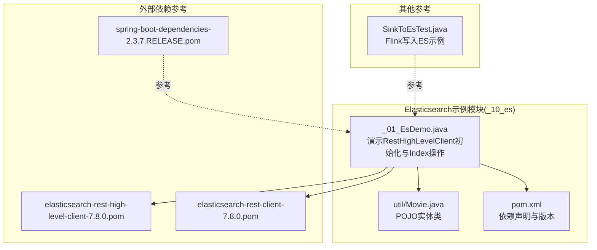
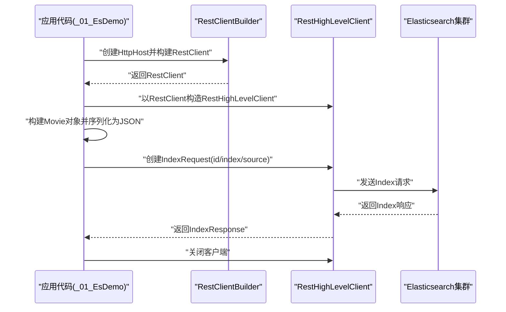
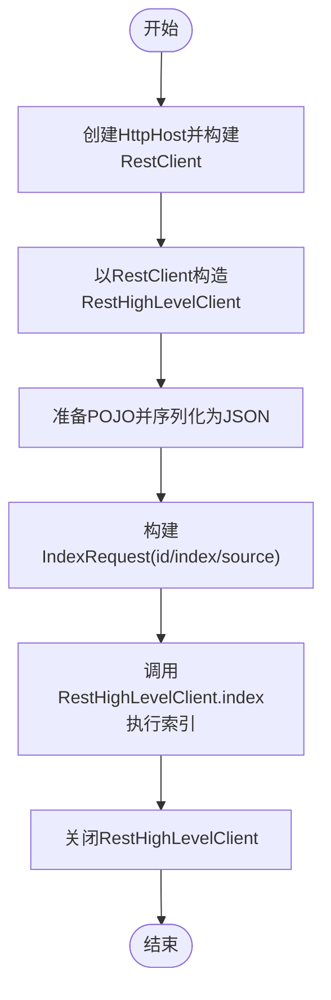
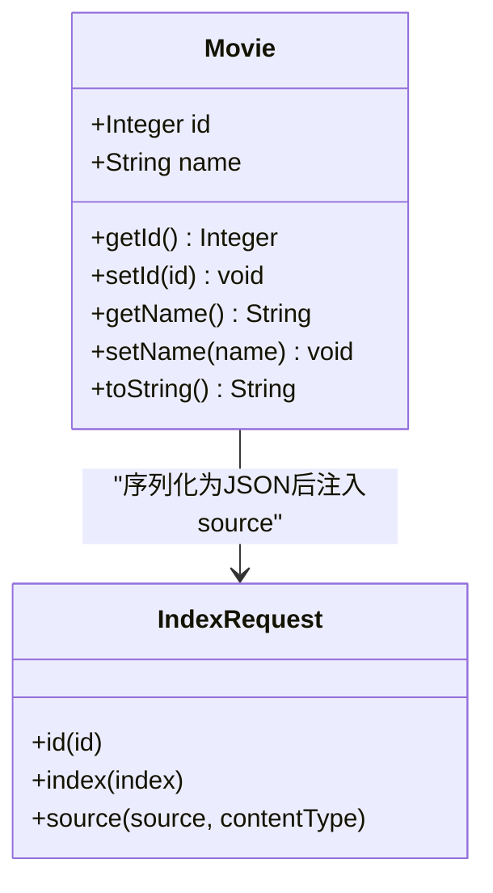
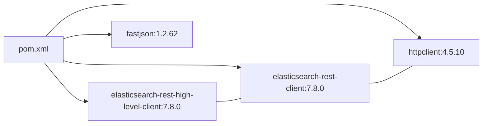

# Java集成与API使用

<cite>
**本文引用的文件**
- [_01_EsDemo.java](file://_10_es/src/main/java/_01_EsDemo.java)
- [Movie.java](file://_10_es/src/main/java/util/Movie.java)
- [pom.xml](file://_10_es/pom.xml)
- [SinkToEsTest.java](file://_06_flink_wu/src/main/java/com/atguigu/chapter05/SinkToEsTest.java)
- [elasticsearch-rest-high-level-client-7.8.0.pom](file://org/elasticsearch/client/elasticsearch-rest-high-level-client/7.8.0/elasticsearch-rest-high-level-client-7.8.0.pom)
- [elasticsearch-rest-client-7.8.0.pom](file://org/elasticsearch/client/elasticsearch-rest-client/7.8.0/elasticsearch-rest-client-7.8.0.pom)
- [spring-boot-dependencies-2.3.7.RELEASE.pom](file://org/springframework/boot/spring-boot-dependencies/2.3.7.RELEASE/spring-boot-dependencies-2.3.7.RELEASE.pom)
</cite>

## 目录
1. [简介](#简介)
2. [项目结构](#项目结构)
3. [核心组件](#核心组件)
4. [架构总览](#架构总览)
5. [详细组件分析](#详细组件分析)
6. [依赖关系分析](#依赖关系分析)
7. [性能考虑](#性能考虑)
8. [故障排查指南](#故障排查指南)
9. [结论](#结论)
10. [附录](#附录)

## 简介
本指南围绕Elasticsearch Java集成展开，重点基于仓库中的示例代码，系统讲解如何使用Elasticsearch Java High Level REST Client进行客户端初始化、连接配置、异常处理，以及实现文档的增删改查（Index、Get、Delete、Bulk）、搜索查询（Search）与聚合分析（Aggregations）。同时，结合Movie实体类展示POJO对象映射到Elasticsearch文档格式的方法，并给出批量操作、异步回调、线程安全与连接池配置、错误处理与重试策略、与Spring Boot集成方案及性能监控与调优建议。

## 项目结构
本仓库包含一个独立的Elasticsearch示例模块，核心文件如下：
- 示例应用：_01_EsDemo.java
- 实体类：util/Movie.java
- 依赖管理：pom.xml
- 其他参考：Flink向ES写入示例（SinkToEsTest.java），用于理解IndexRequest构建与写入流程
- 外部依赖参考：elasticsearch-rest-high-level-client与elasticsearch-rest-client的Maven POM，以及Spring Boot对ES客户端的依赖声明

**图表来源**
- [_01_EsDemo.java](file://_10_es/src/main/java/_01_EsDemo.java#L1-L45)
- [Movie.java](file://_10_es/src/main/java/util/Movie.java#L1-L36)
- [pom.xml](file://_10_es/pom.xml#L1-L44)
- [elasticsearch-rest-high-level-client-7.8.0.pom](file://org/elasticsearch/client/elasticsearch-rest-high-level-client/7.8.0/elasticsearch-rest-high-level-client-7.8.0.pom#L1-L59)
- [elasticsearch-rest-client-7.8.0.pom](file://org/elasticsearch/client/elasticsearch-rest-client/7.8.0/elasticsearch-rest-client-7.8.0.pom#L1-L106)
- [spring-boot-dependencies-2.3.7.RELEASE.pom](file://org/springframework/boot/spring-boot-dependencies/2.3.7.RELEASE/spring-boot-dependencies-2.3.7.RELEASE.pom#L638-L710)
- [SinkToEsTest.java](file://_06_flink_wu/src/main/java/com/atguigu/chapter05/SinkToEsTest.java#L1-L64)

**章节来源**
- [_01_EsDemo.java](file://_10_es/src/main/java/_01_EsDemo.java#L1-L45)
- [Movie.java](file://_10_es/src/main/java/util/Movie.java#L1-L36)
- [pom.xml](file://_10_es/pom.xml#L1-L44)

## 核心组件
- RestHighLevelClient：高层REST客户端，负责与Elasticsearch集群交互，支持Index、Get、Delete、Bulk、Search等操作。
- IndexRequest：封装索引请求，设置id、index名称与文档内容。
- Movie实体类：作为POJO，演示如何将其序列化为JSON并写入Elasticsearch。
- RestClientBuilder：用于构建HTTP客户端，配置主机地址与连接参数。
- RequestOptions：控制请求行为（如默认选项）。

关键要点
- 客户端初始化：通过RestClient.builder指定HttpHost，再构造RestHighLevelClient。
- 文档映射：将POJO转换为JSON字符串后注入IndexRequest.source，指定XContentType为JSON。
- 索引操作：IndexRequest设置id、index与source后，调用RestHighLevelClient.index执行写入。

**章节来源**
- [_01_EsDemo.java](file://_10_es/src/main/java/_01_EsDemo.java#L1-L45)
- [Movie.java](file://_10_es/src/main/java/util/Movie.java#L1-L36)

## 架构总览
下图展示了从应用到Elasticsearch的调用链路与数据流向：

**图表来源**
- [_01_EsDemo.java](file://_10_es/src/main/java/_01_EsDemo.java#L1-L45)

## 详细组件分析

### 组件A：RestHighLevelClient初始化与Index操作
- 初始化流程：通过RestClient.builder(HttpHost)创建底层HTTP客户端，再以该客户端构造RestHighLevelClient。
- IndexRequest构建：设置id、index与source（JSON字符串+XContentType）。
- 执行与收尾：调用RestHighLevelClient.index，最后关闭客户端释放资源。

**图表来源**
- [_01_EsDemo.java](file://_10_es/src/main/java/_01_EsDemo.java#L1-L45)
- [Movie.java](file://_10_es/src/main/java/util/Movie.java#L1-L36)

**章节来源**
- [_01_EsDemo.java](file://_10_es/src/main/java/_01_EsDemo.java#L1-L45)

### 组件B：POJO到Elasticsearch文档映射
- 使用FastJSON将Movie对象序列化为JSON字符串。
- 将JSON字符串与XContentType一起注入IndexRequest.source，完成文档映射。
- 注意：Elasticsearch 7.x中index别名与动态映射通常自动生效；若需显式类型，可参考Flink示例中type字段的设置方式（不同版本差异较大，应以实际ES版本为准）。

**图表来源**
- [Movie.java](file://_10_es/src/main/java/util/Movie.java#L1-L36)
- [_01_EsDemo.java](file://_10_es/src/main/java/_01_EsDemo.java#L1-L45)

**章节来源**
- [Movie.java](file://_10_es/src/main/java/util/Movie.java#L1-L36)
- [_01_EsDemo.java](file://_10_es/src/main/java/_01_EsDemo.java#L1-L45)

### 组件C：搜索查询与聚合分析（概念性说明）
- 搜索查询（Search）：通过SearchRequest构建查询DSL，使用RestHighLevelClient.search执行，返回SearchResponse，解析hits与_source。
- 聚合分析（Aggregations）：在SearchRequest中添加Aggregations定义，如terms、avg、date_histogram等，服务端聚合后返回聚合结果。
- 本仓库未包含具体Search与Aggregations示例代码，以上为通用流程说明。

[本节为概念性说明，不直接分析具体文件，故无“章节来源”]

### 组件D：批量操作（Bulk）最佳实践
- 批量索引：使用BulkRequest依次add IndexRequest，合理设置批量大小与并发度，避免单批过大导致内存压力。
- 批量更新：使用UpdateRequest加入BulkRequest，注意脚本或partial doc的幂等性。
- 批量删除：使用DeleteRequest加入BulkRequest。
- 错误处理：对BulkItemResponse逐项检查status与failure信息，失败项单独重试或记录到死信队列。
- 性能优化：批量提交前进行数据去重与合法性校验；根据集群负载调整批大小与刷新策略。

[本节为通用实践说明，不直接分析具体文件，故无“章节来源”]

### 组件E：异步操作与回调机制
- 异步API：RestHighLevelClient提供异步方法（如indexAsync），传入ActionListener回调，onResponse处理成功，onFailure处理异常。
- 回调设计：在回调中统一处理响应状态、耗时统计与异常上报，避免阻塞主线程。
- 适用场景：高并发写入、非阻塞I/O与事件驱动架构。

[本节为通用实践说明，不直接分析具体文件，故无“章节来源”]

### 组件F：线程安全与连接池配置
- 线程安全：RestHighLevelClient是线程安全的，可在多线程共享同一实例。
- 连接池：通过RestClientBuilder配置连接超时、socket超时、最大连接数、每路由最大连接数等参数，提升吞吐与稳定性。
- 资源管理：确保在应用关闭时调用client.close()释放连接池与线程资源。

[本节为通用实践说明，不直接分析具体文件，故无“章节来源”]

### 组件G：错误处理与重试机制
- 常见异常：连接超时、节点不可达、请求限流、映射冲突等。
- 重试策略：指数退避、抖动、最大重试次数；区分可重试异常与不可重试异常（如参数错误）。
- 监控与告警：记录异常堆栈、耗时分布、重试次数与失败率，接入APM或日志平台。

[本节为通用实践说明，不直接分析具体文件，故无“章节来源”]

### 组件H：与Spring Boot集成方案
- 依赖引入：在Spring Boot工程中引入elasticsearch-rest-high-level-client与rest-client依赖，版本与仓库中示例保持一致。
- 客户端Bean：通过@Bean定义RestHighLevelClient，注入HttpHost、连接池参数与超时配置。
- 配置类：使用@ConfigurationProperties或application.yml集中管理ES地址、索引名称、超时等参数。
- 使用方式：在Service层注入RestHighLevelClient，封装Index、Search、Bulk等操作，提供统一异常处理与重试。

参考依据
- Spring Boot依赖声明中包含elasticsearch-rest-client与elasticsearch-rest-high-level-client的依赖项，可据此在Spring Boot工程中引入。

**章节来源**
- [spring-boot-dependencies-2.3.7.RELEASE.pom](file://org/springframework/boot/spring-boot-dependencies/2.3.7.RELEASE/spring-boot-dependencies-2.3.7.RELEASE.pom#L638-L710)

## 依赖关系分析
- Elasticsearch版本：示例使用7.8.0，对应Rest High Level Client与Rest Client版本。
- 关键依赖：
  - elasticsearch-rest-high-level-client：高层API入口
  - elasticsearch-rest-client：底层HTTP客户端
  - httpclient：Apache HTTP组件
  - fastjson：JSON序列化工具

**图表来源**
- [pom.xml](file://_10_es/pom.xml#L1-L44)
- [elasticsearch-rest-high-level-client-7.8.0.pom](file://org/elasticsearch/client/elasticsearch-rest-high-level-client/7.8.0/elasticsearch-rest-high-level-client-7.8.0.pom#L1-L59)
- [elasticsearch-rest-client-7.8.0.pom](file://org/elasticsearch/client/elasticsearch-rest-client/7.8.0/elasticsearch-rest-client-7.8.0.pom#L1-L106)

**章节来源**
- [pom.xml](file://_10_es/pom.xml#L1-L44)
- [elasticsearch-rest-high-level-client-7.8.0.pom](file://org/elasticsearch/client/elasticsearch-rest-high-level-client/7.8.0/elasticsearch-rest-high-level-client-7.8.0.pom#L1-L59)
- [elasticsearch-rest-client-7.8.0.pom](file://org/elasticsearch/client/elasticsearch-rest-client/7.8.0/elasticsearch-rest-client-7.8.0.pom#L1-L106)

## 性能考虑
- 连接池与超时：合理设置连接数、超时时间，避免频繁创建/销毁连接。
- 批量写入：增大批量大小与批次数，减少网络往返；注意内存占用与延迟。
- 刷新策略：生产环境适当降低refresh为false，定期手动refresh或使用异步刷新。
- 映射设计：提前定义字段类型与分词器，避免运行时动态映射带来的开销。
- 查询优化：使用filter上下文、缓存常用地点查询、限制返回字段与数量。
- 监控指标：QPS、P99延迟、GC时间、连接池使用率、重试率与错误率。

[本节为通用指导，不直接分析具体文件，故无“章节来源”]

## 故障排查指南
- 连接失败：检查ES地址与端口、网络连通性、防火墙策略；确认RestClientBuilder配置正确。
- 序列化问题：确保POJO字段可被FastJSON序列化；必要时添加注解或自定义序列化策略。
- 类型不匹配：确认index名称与映射一致；不同版本ES对type要求不同，避免混用。
- 超时与限流：增大超时时间、降低并发或启用重试；关注集群健康状态与节点负载。
- 日志与追踪：开启客户端日志级别，记录请求与响应摘要；结合APM采集链路追踪信息。

[本节为通用指导，不直接分析具体文件，故无“章节来源”]

## 结论
本指南基于仓库中的示例，系统梳理了Elasticsearch Java集成的关键环节：客户端初始化、连接配置、POJO映射、Index写入流程，并补充了搜索查询、聚合分析、批量操作、异步回调、线程安全与连接池、错误处理与重试、Spring Boot集成以及性能监控与调优的实践建议。读者可据此快速搭建稳定高效的Java ES应用。

## 附录
- 参考示例：Flink向ES写入的IndexRequest构建方式，有助于理解请求体构造与索引命名规范。

**章节来源**
- [SinkToEsTest.java](file://_06_flink_wu/src/main/java/com/atguigu/chapter05/SinkToEsTest.java#L1-L64)