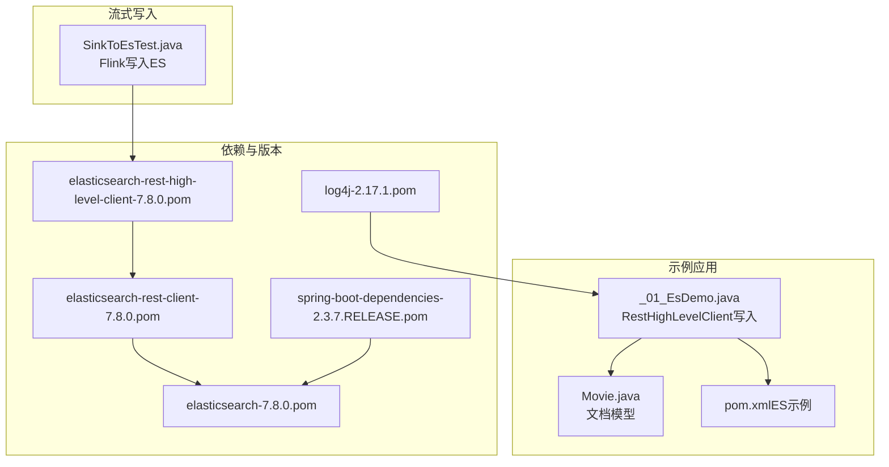
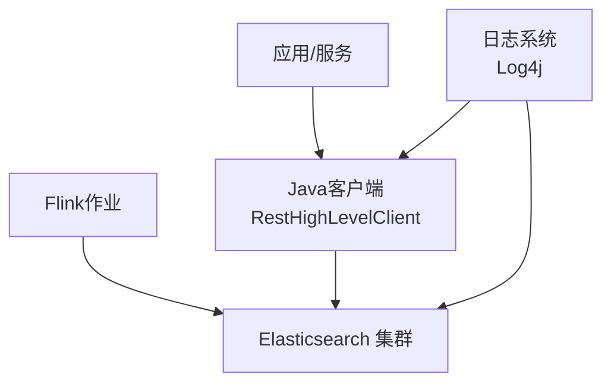
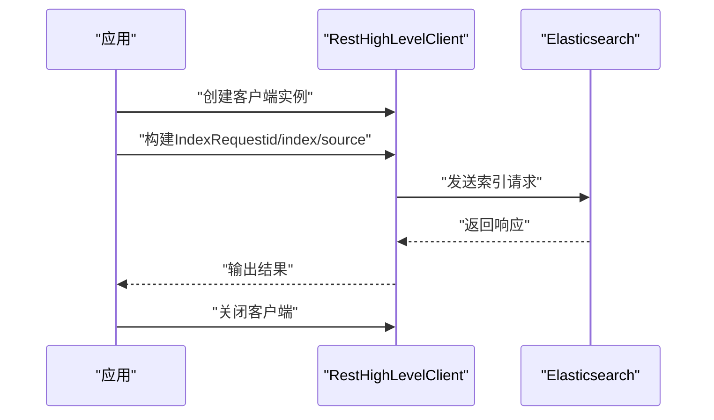
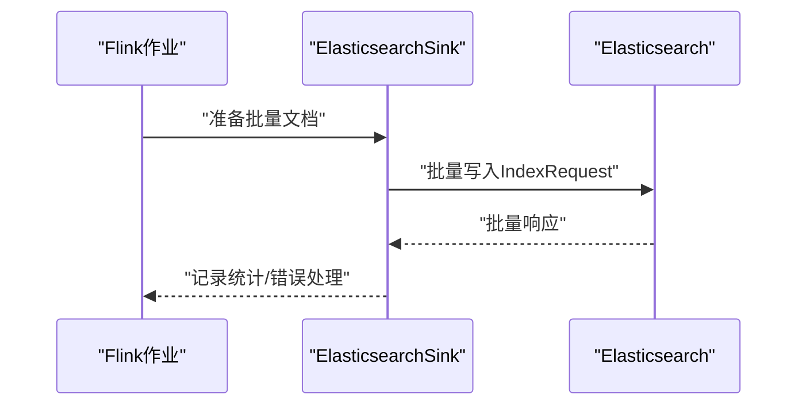
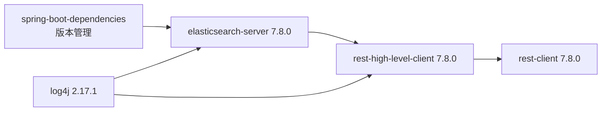
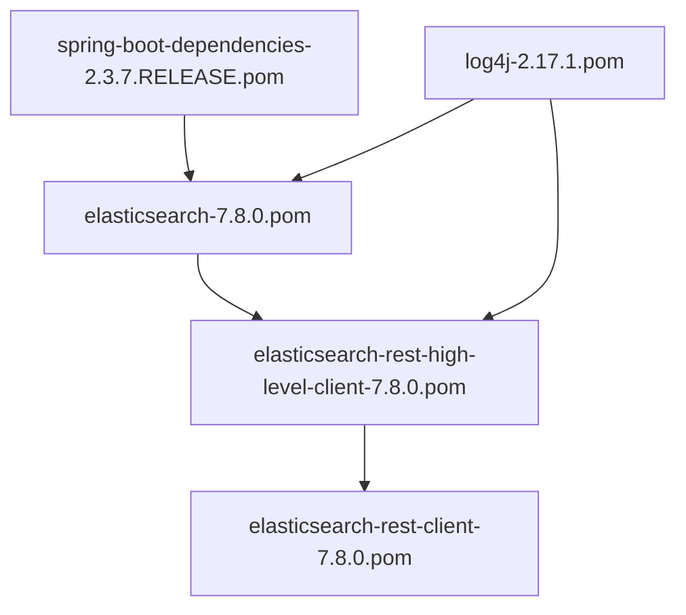

# 性能优化与监控

<cite>
**本文引用的文件**
- [_01_EsDemo.java](file://_10_es/src/main/java/_01_EsDemo.java)
- [Movie.java](file://_10_es/src/main/java/util/Movie.java)
- [pom.xml（ES示例）](file://_10_es/pom.xml)
- [SinkToEsTest.java](file://_06_flink_wu/src/main/java/com/atguigu/chapter05/SinkToEsTest.java)
- [flink调优.md](file://_06_flink_tuning/flink调优.md)
- [elasticsearch-7.8.0.pom](file://org/elasticsearch/elasticsearch/7.8.0/elasticsearch-7.8.0.pom)
- [elasticsearch-rest-high-level-client-7.8.0.pom](file://org/elasticsearch/client/elasticsearch-rest-high-level-client/7.8.0/elasticsearch-rest-high-level-client-7.8.0.pom)
- [elasticsearch-rest-client-7.8.0.pom](file://org/elasticsearch/client/elasticsearch-rest-client/7.8.0/elasticsearch-rest-client-7.8.0.pom)
- [log4j-2.17.1.pom](file://org/apache/logging/log4j/log4j/2.17.1/log4j-2.17.1.pom)
- [spring-boot-dependencies-2.3.7.RELEASE.pom](file://org/springframework/boot/spring-boot-dependencies/2.3.7.RELEASE/spring-boot-dependencies-2.3.7.RELEASE.pom)
</cite>

## 目录
1. [简介](#简介)
2. [项目结构](#项目结构)
3. [核心组件](#核心组件)
4. [架构总览](#架构总览)
5. [详细组件分析](#详细组件分析)
6. [依赖关系分析](#依赖关系分析)
7. [性能考虑](#性能考虑)
8. [故障排查指南](#故障排查指南)
9. [结论](#结论)
10. [附录](#附录)

## 简介
本运维文档围绕Elasticsearch在生产环境中的性能优化与监控展开，结合仓库中现有的Java客户端示例、Flink写入ES的测试代码以及相关依赖POM信息，系统性地给出索引阶段优化（映射、分片、刷新与合并）、查询阶段优化（查询缓存、请求缓存、查询重写）、集群监控与告警、容量规划与资源分配、故障诊断与排错、以及与ELK栈（Kibana、Logstash）的集成监控方案。文档同时提供可操作的优化建议与最佳实践，帮助读者在实际环境中稳定、高效地运行Elasticsearch。

## 项目结构
该仓库包含一个最小化的Elasticsearch Java客户端示例与一个通过Flink将数据写入Elasticsearch的示例，以及若干与Elasticsearch相关的Maven依赖POM文件。这些文件为理解客户端连接、写入流程、依赖版本与日志集成提供了基础素材。

**图示来源**
- [_01_EsDemo.java](file://_10_es/src/main/java/_01_EsDemo.java#L1-L45)
- [Movie.java](file://_10_es/src/main/java/util/Movie.java#L1-L36)
- [pom.xml（ES示例）](file://_10_es/pom.xml#L1-L44)
- [SinkToEsTest.java](file://_06_flink_wu/src/main/java/com/atguigu/chapter05/SinkToEsTest.java#L33-L63)
- [elasticsearch-rest-high-level-client-7.8.0.pom](file://org/elasticsearch/client/elasticsearch-rest-high-level-client/7.8.0/elasticsearch-rest-high-level-client-7.8.0.pom#L1-L59)
- [elasticsearch-rest-client-7.8.0.pom](file://org/elasticsearch/client/elasticsearch-rest-client/7.8.0/elasticsearch-rest-client-7.8.0.pom#L76-L106)
- [elasticsearch-7.8.0.pom](file://org/elasticsearch/elasticsearch/7.8.0/elasticsearch-7.8.0.pom#L303-L337)
- [log4j-2.17.1.pom](file://org/apache/logging/log4j/log4j/2.17.1/log4j-2.17.1.pom#L874-L912)
- [spring-boot-dependencies-2.3.7.RELEASE.pom](file://org/springframework/boot/spring-boot-dependencies/2.3.7.RELEASE/spring-boot-dependencies-2.3.7.RELEASE.pom#L638-L677)

**章节来源**
- [_01_EsDemo.java](file://_10_es/src/main/java/_01_EsDemo.java#L1-L45)
- [pom.xml（ES示例）](file://_10_es/pom.xml#L1-L44)
- [SinkToEsTest.java](file://_06_flink_wu/src/main/java/com/atguigu/chapter05/SinkToEsTest.java#L33-L63)

## 核心组件
- Java客户端示例：展示如何通过RestHighLevelClient建立连接并执行索引写入，便于理解客户端初始化、请求构建与关闭流程。
- 文档模型：用于构造写入的JSON内容，体现字段设计对映射优化的影响。
- 流式写入示例：展示从Flink到Elasticsearch的批量写入路径，有助于评估批量大小、刷新策略与错误处理。
- 依赖与版本：通过POM文件明确客户端、REST客户端与服务端版本关系，为兼容性与性能参数选择提供依据。

**章节来源**
- [_01_EsDemo.java](file://_10_es/src/main/java/_01_EsDemo.java#L1-L45)
- [Movie.java](file://_10_es/src/main/java/util/Movie.java#L1-L36)
- [pom.xml（ES示例）](file://_10_es/pom.xml#L1-L44)
- [SinkToEsTest.java](file://_06_flink_wu/src/main/java/com/atguigu/chapter05/SinkToEsTest.java#L33-L63)

## 架构总览
下图展示了从应用到Elasticsearch的典型写入链路，以及与日志系统的集成点，为后续的性能优化与监控提供上下文。

**图示来源**
- [_01_EsDemo.java](file://_10_es/src/main/java/_01_EsDemo.java#L1-L45)
- [SinkToEsTest.java](file://_06_flink_wu/src/main/java/com/atguigu/chapter05/SinkToEsTest.java#L33-L63)
- [log4j-2.17.1.pom](file://org/apache/logging/log4j/log4j/2.17.1/log4j-2.17.1.pom#L874-L912)

## 详细组件分析

### Java客户端写入流程分析
该流程体现了典型的索引写入步骤：主机配置、客户端构建、请求构造与执行、资源释放。

**图示来源**
- [_01_EsDemo.java](file://_10_es/src/main/java/_01_EsDemo.java#L16-L43)

**章节来源**
- [_01_EsDemo.java](file://_10_es/src/main/java/_01_EsDemo.java#L16-L43)

### Flink写入Elasticsearch流程分析
该流程展示了批/流式场景下的批量写入，强调批量大小、错误处理与类型定义的重要性。

**图示来源**
- [SinkToEsTest.java](file://_06_flink_wu/src/main/java/com/atguigu/chapter05/SinkToEsTest.java#L33-L63)

**章节来源**
- [SinkToEsTest.java](file://_06_flink_wu/src/main/java/com/atguigu/chapter05/SinkToEsTest.java#L33-L63)

### 依赖与版本关系分析
通过POM文件可以梳理客户端与服务端的版本对应关系，以及日志系统与Spring Boot依赖，为性能参数与兼容性提供参考。

**图示来源**
- [elasticsearch-7.8.0.pom](file://org/elasticsearch/elasticsearch/7.8.0/elasticsearch-7.8.0.pom#L303-L337)
- [elasticsearch-rest-high-level-client-7.8.0.pom](file://org/elasticsearch/client/elasticsearch-rest-high-level-client/7.8.0/elasticsearch-rest-high-level-client-7.8.0.pom#L1-L59)
- [elasticsearch-rest-client-7.8.0.pom](file://org/elasticsearch/client/elasticsearch-rest-client/7.8.0/elasticsearch-rest-client-7.8.0.pom#L76-L106)
- [log4j-2.17.1.pom](file://org/apache/logging/log4j/log4j/2.17.1/log4j-2.17.1.pom#L874-L912)
- [spring-boot-dependencies-2.3.7.RELEASE.pom](file://org/springframework/boot/spring-boot-dependencies/2.3.7.RELEASE/spring-boot-dependencies-2.3.7.RELEASE.pom#L638-L677)

**章节来源**
- [elasticsearch-7.8.0.pom](file://org/elasticsearch/elasticsearch/7.8.0/elasticsearch-7.8.0.pom#L303-L337)
- [elasticsearch-rest-high-level-client-7.8.0.pom](file://org/elasticsearch/client/elasticsearch-rest-high-level-client/7.8.0/elasticsearch-rest-high-level-client-7.8.0.pom#L1-L59)
- [elasticsearch-rest-client-7.8.0.pom](file://org/elasticsearch/client/elasticsearch-rest-client/7.8.0/elasticsearch-rest-client-7.8.0.pom#L76-L106)
- [log4j-2.17.1.pom](file://org/apache/logging/log4j/log4j/2.17.1/log4j-2.17.1.pom#L874-L912)
- [spring-boot-dependencies-2.3.7.RELEASE.pom](file://org/springframework/boot/spring-boot-dependencies/2.3.7.RELEASE/spring-boot-dependencies-2.3.7.RELEASE.pom#L638-L677)

## 依赖关系分析
- 版本一致性：客户端与服务端版本需匹配，避免不兼容导致的性能退化或异常。
- 日志系统：Log4j与Elasticsearch客户端存在直接依赖，日志级别与布局会影响写入开销与可观测性。
- Spring Boot依赖：统一版本管理有助于减少冲突，确保客户端与服务端版本一致。

**图示来源**
- [spring-boot-dependencies-2.3.7.RELEASE.pom](file://org/springframework/boot/spring-boot-dependencies/2.3.7.RELEASE/spring-boot-dependencies-2.3.7.RELEASE.pom#L638-L677)
- [elasticsearch-7.8.0.pom](file://org/elasticsearch/elasticsearch/7.8.0/elasticsearch-7.8.0.pom#L303-L337)
- [elasticsearch-rest-high-level-client-7.8.0.pom](file://org/elasticsearch/client/elasticsearch-rest-high-level-client/7.8.0/elasticsearch-rest-high-level-client-7.8.0.pom#L1-L59)
- [elasticsearch-rest-client-7.8.0.pom](file://org/elasticsearch/client/elasticsearch-rest-client/7.8.0/elasticsearch-rest-client-7.8.0.pom#L76-L106)
- [log4j-2.17.1.pom](file://org/apache/logging/log4j/log4j/2.17.1/log4j-2.17.1.pom#L874-L912)

**章节来源**
- [spring-boot-dependencies-2.3.7.RELEASE.pom](file://org/springframework/boot/spring-boot-dependencies/2.3.7.RELEASE/spring-boot-dependencies-2.3.7.RELEASE.pom#L638-L677)
- [elasticsearch-7.8.0.pom](file://org/elasticsearch/elasticsearch/7.8.0/elasticsearch-7.8.0.pom#L303-L337)
- [elasticsearch-rest-high-level-client-7.8.0.pom](file://org/elasticsearch/client/elasticsearch-rest-high-level-client/7.8.0/elasticsearch-rest-high-level-client-7.8.0.pom#L1-L59)
- [elasticsearch-rest-client-7.8.0.pom](file://org/elasticsearch/client/elasticsearch-rest-client/7.8.0/elasticsearch-rest-client-7.8.0.pom#L76-L106)
- [log4j-2.17.1.pom](file://org/apache/logging/log4j/log4j/2.17.1/log4j-2.17.1.pom#L874-L912)

## 性能考虑

### 索引阶段优化策略
- 映射优化
  - 字段类型选择：优先使用合适的数据类型以降低存储与查询成本；对只做聚合不存储的字段，避免存储开销。
  - keyword vs text：全文检索使用text，精确匹配与聚合使用keyword；避免在同一字段上过度使用两者。
  - dynamic mapping：谨慎开启dynamic，必要时固定mapping，减少映射更新带来的开销。
  - nested/flat：尽量扁平化结构，减少nested层级，降低查询与聚合复杂度。
- 分片配置
  - 初始分片数：根据预期数据量与节点数合理设置，避免过多小分片导致元数据压力。
  - 主分片与副本：副本用于高可用与查询扩展，但会增加写入放大；按查询负载权衡副本数量。
  - 分片大小：单分片目标容量约10–50GB，避免过大分片影响recovery与rebalancing。
- 刷新间隔（refresh_interval）
  - 写入密集场景适度放宽刷新间隔，减少段合并与可见性开销；对近实时需求高的场景再收紧。
- 合并策略（merge）
  - force_merge与merge policy：定期force_merge压缩段，降低查询时扫描段数；注意后台合并对IO的影响。
  - write_buffer_size：合理设置索引缓冲区，平衡吞吐与延迟。

### 查询阶段优化技巧
- 查询缓存（fielddata/query cache）
  - 对高基数字段启用fielddata需谨慎，建议使用doc_values替代；对频繁聚合的字段开启doc_values。
  - query cache适用于重复查询模式，但对高变异性查询效果有限。
- 请求缓存（request cache）
  - 对热点聚合与过滤查询启用请求缓存，显著降低重复计算；注意缓存失效策略与内存占用。
- 查询重写
  - 使用constant_score、indices query等重写策略减少评分计算；避免深度深的bool查询与无界查询。
  - 合理使用filter上下文，充分利用缓存与短路逻辑。

### 集群级监控与告警
- 节点健康与集群状态
  - 集群状态：观察主分片/副本分布、延迟任务、未分配分片。
  - 节点健康：CPU使用率、堆内存使用、GC频率与停顿时间、磁盘IO与空间。
- 性能指标
  - 写入：索引速率、刷新次数、合并速率、段数量。
  - 查询：查询QPS、慢查询、缓存命中率、段扫描量。
  - 存储：磁盘空间、段大小、合并I/O。
- 告警阈值建议
  - GC停顿>1s、堆使用>80%、分片未分配、合并队列积压、慢查询占比>1%等。

### 容量规划与资源分配
- CPU：写入密集场景优先保证IO与网络带宽；查询密集场景提升CPU核数与频率。
- 内存：堆大小不超过物理内存的50%，保留空间给OS页缓存；预留足够的线程栈与本地Caches。
- 磁盘：SSD优先；预留20%以上空间；监控inode与目录碎片。
- 网络：跨机房部署时关注延迟与丢包；写入批量与并发需与网络带宽匹配。

### 与ELK栈集成监控
- Kibana：通过内置监控面板与APM可视化索引与查询性能；自定义仪表板展示关键指标。
- Logstash：作为采集与预处理层，配合Elasticsearch进行日志聚合与分析；注意pipeline吞吐与队列长度。
- 日志系统：通过Log4j ECS布局输出结构化日志，便于在Kibana中快速检索与分析。

## 故障排查指南
- 慢查询分析
  - 使用search_profile与profile分析查询计划；定位高成本阶段（fetch、score、rewrite）。
  - 检查缓存命中率与请求缓存配置；优化查询重写与字段映射。
- 内存泄漏检测
  - 关注堆外内存（如MMapfs/PadMap）与fielddata使用；排查大聚合与长尾查询。
  - 结合GC日志与JVM工具定位不可达对象清理异常。
- 集群分区处理
  - 观察仲裁与主节点选举；临时分区时保持最小可用主分片集合，避免脑裂。
  - 分片重分配与恢复期间限制并发，防止雪崩效应。

## 结论
通过对仓库中Java客户端示例、Flink写入示例与相关依赖POM的分析，可以为Elasticsearch在生产环境中的性能优化与监控提供清晰的实施路径。结合索引与查询层面的优化策略、集群监控与告警体系、容量规划与资源分配原则，以及与ELK栈的集成方案，能够有效提升系统的稳定性与可维护性。

## 附录
- 参考实现位置
  - Java客户端写入：[_01_EsDemo.java](file://_10_es/src/main/java/_01_EsDemo.java#L16-L43)
  - 文档模型：[Movie.java](file://_10_es/src/main/java/util/Movie.java#L1-L36)
  - Flink写入ES：[SinkToEsTest.java](file://_06_flink_wu/src/main/java/com/atguigu/chapter05/SinkToEsTest.java#L33-L63)
  - 依赖与版本：[elasticsearch-rest-high-level-client-7.8.0.pom](file://org/elasticsearch/client/elasticsearch-rest-high-level-client/7.8.0/elasticsearch-rest-high-level-client-7.8.0.pom#L1-L59)、[elasticsearch-rest-client-7.8.0.pom](file://org/elasticsearch/client/elasticsearch-rest-client/7.8.0/elasticsearch-rest-client-7.8.0.pom#L76-L106)、[elasticsearch-7.8.0.pom](file://org/elasticsearch/elasticsearch/7.8.0/elasticsearch-7.8.0.pom#L303-L337)、[log4j-2.17.1.pom](file://org/apache/logging/log4j/log4j/2.17.1/log4j-2.17.1.pom#L874-L912)、[spring-boot-dependencies-2.3.7.RELEASE.pom](file://org/springframework/boot/spring-boot-dependencies/2.3.7.RELEASE/spring-boot-dependencies-2.3.7.RELEASE.pom#L638-L677)
- 生产最佳实践
  - 滚动升级：先升级协调节点，再升级数据节点；严格版本兼容与映射迁移。
  - 备份与恢复：基于快照仓库定期备份；验证恢复流程与RPO/RTO。
  - 灾难恢复：多数据中心部署与跨区域复制；制定分区与网络隔离预案。