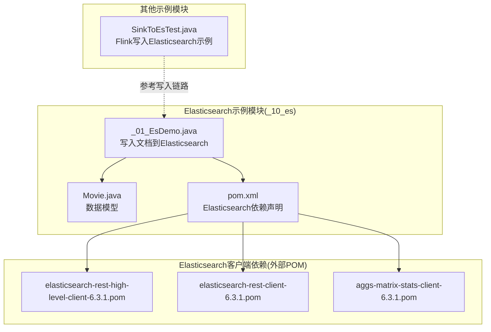
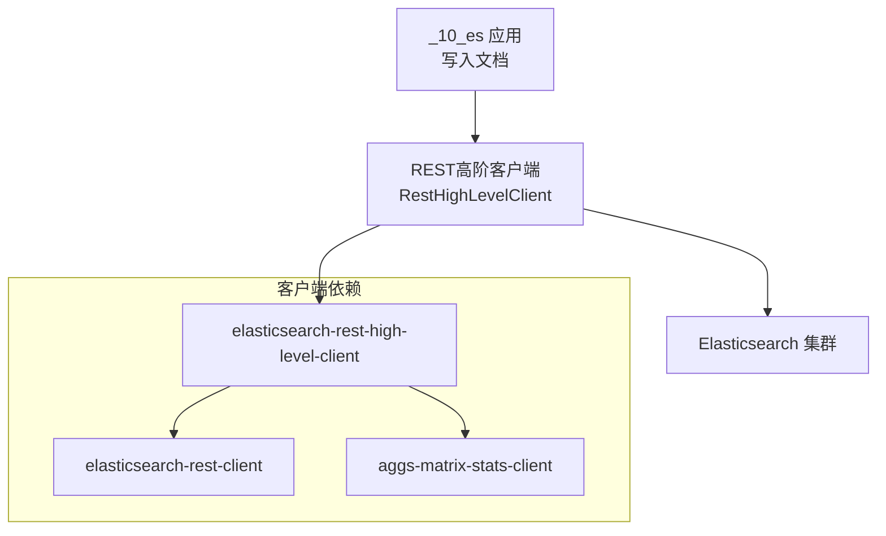
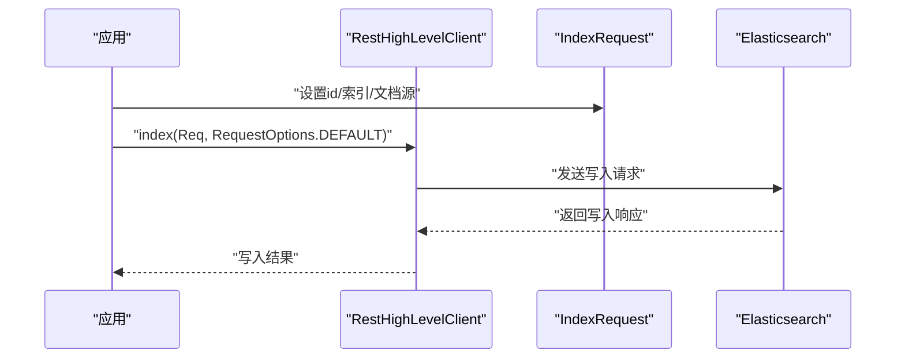
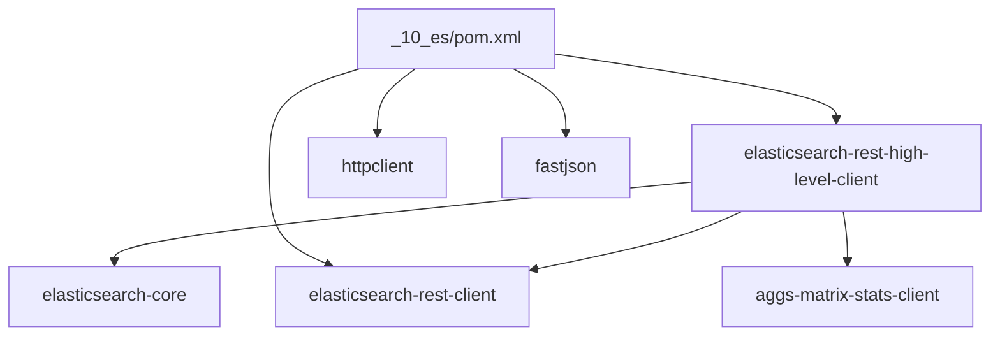

# 查询DSL与聚合分析

<cite>
**本文引用的文件**
- [_10_es/src/main/java/_01_EsDemo.java](file://_10_es/src/main/java/_01_EsDemo.java)
- [_10_es/src/main/java/util/Movie.java](file://_10_es/src/main/java/util/Movie.java)
- [_10_es/pom.xml](file://_10_es/pom.xml)
- [_06_flink_wu/src/main/java/com/atguigu/chapter05/SinkToEsTest.java](file://_06_flink_wu/src/main/java/com/atguigu/chapter05/SinkToEsTest.java)
- [org/elasticsearch/client/elasticsearch-rest-high-level-client/6.3.1/elasticsearch-rest-high-level-client-6.3.1.pom](file://org/elasticsearch/client/elasticsearch-rest-high-level-client/6.3.1/elasticsearch-rest-high-level-client-6.3.1.pom)
- [org/elasticsearch/plugin/aggs-matrix-stats-client/6.3.1/aggs-matrix-stats-client-6.3.1.pom](file://org/elasticsearch/plugin/aggs-matrix-stats-client/6.3.1/aggs-matrix-stats-client-6.3.1.pom)
- [org/elasticsearch/client/elasticsearch-rest-client/6.3.1/elasticsearch-rest-client-6.3.1.pom](file://org/elasticsearch/client/elasticsearch-rest-client/6.3.1/elasticsearch-rest-client-6.3.1.pom)
</cite>

## 目录
1. [简介](#简介)
2. [项目结构](#项目结构)
3. [核心组件](#核心组件)
4. [架构总览](#架构总览)
5. [详细组件分析](#详细组件分析)
6. [依赖关系分析](#依赖关系分析)
7. [性能考量](#性能考量)
8. [故障排查指南](#故障排查指南)
9. [结论](#结论)
10. [附录](#附录)

## 简介
本技术文档围绕Elasticsearch查询DSL与聚合分析展开，结合仓库中的Java示例与依赖信息，系统阐述：
- 查询DSL的语法结构与使用方法：结构化查询、全文查询、范围查询、布尔查询等类型及其适用场景
- 过滤上下文与查询上下文的区别，以及评分机制与相关性分数的计算原理
- 聚合分析（Aggregations）的完整指南：指标聚合、桶聚合、管道聚合的使用与配置
- 复杂查询构建示例：多字段查询、嵌套查询、脚本查询的实现思路
- 查询性能优化技巧：查询缓存、索引优化、查询重写策略
- 常见查询模式的最佳实践与性能调优建议

说明：仓库中包含Elasticsearch客户端示例与依赖，但未直接提供查询DSL与聚合的具体实现代码。本文在不虚构代码的前提下，基于示例文件与依赖信息，给出可操作的技术路线与最佳实践，并通过图示帮助读者建立从“概念到落地”的知识体系。

## 项目结构
本仓库包含一个用于演示Elasticsearch客户端使用的模块，以及若干其他技术栈示例。与Elasticsearch查询DSL和聚合分析直接相关的内容集中在以下文件：
- 示例应用：写入文档到Elasticsearch索引
- 数据模型：简单的电影实体类
- Maven依赖：Elasticsearch核心、REST高阶客户端、HTTP客户端、JSON序列化库
- 其他示例：Flink向Elasticsearch写入数据的示例（用于理解数据写入链路）

图表来源
- [_10_es/src/main/java/_01_EsDemo.java](file://_10_es/src/main/java/_01_EsDemo.java#L1-L45)
- [_10_es/src/main/java/util/Movie.java](file://_10_es/src/main/java/util/Movie.java#L1-L36)
- [_10_es/pom.xml](file://_10_es/pom.xml#L1-L44)
- [_06_flink_wu/src/main/java/com/atguigu/chapter05/SinkToEsTest.java](file://_06_flink_wu/src/main/java/com/atguigu/chapter05/SinkToEsTest.java#L1-L64)
- [org/elasticsearch/client/elasticsearch-rest-high-level-client/6.3.1/elasticsearch-rest-high-level-client-6.3.1.pom](file://org/elasticsearch/client/elasticsearch-rest-high-level-client/6.3.1/elasticsearch-rest-high-level-client-6.3.1.pom#L1-L59)
- [org/elasticsearch/client/elasticsearch-rest-client/6.3.1/elasticsearch-rest-client-6.3.1.pom](file://org/elasticsearch/client/elasticsearch-rest-client/6.3.1/elasticsearch-rest-client-6.3.1.pom#L1-L107)
- [org/elasticsearch/plugin/aggs-matrix-stats-client/6.3.1/aggs-matrix-stats-client-6.3.1.pom](file://org/elasticsearch/plugin/aggs-matrix-stats-client/6.3.1/aggs-matrix-stats-client-6.3.1.pom#L1-L27)

章节来源
- [file://_10_es/src/main/java/_01_EsDemo.java#L1-L45]
- [file://_10_es/src/main/java/util/Movie.java#L1-L36]
- [file://_10_es/pom.xml#L1-L44]
- [file://_06_flink_wu/src/main/java/com/atguigu/chapter05/SinkToEsTest.java#L1-L64]
- [file://org/elasticsearch/client/elasticsearch-rest-high-level-client/6.3.1/elasticsearch-rest-high-level-client-6.3.1.pom#L1-L59]
- [file://org/elasticsearch/client/elasticsearch-rest-client/6.3.1/elasticsearch-rest-client-6.3.1.pom#L1-L107]
- [file://org/elasticsearch/plugin/aggs-matrix-stats-client/6.3.1/aggs-matrix-stats-client-6.3.1.pom#L1-L27]

## 核心组件
- Elasticsearch写入客户端：通过REST高阶客户端连接集群，构造IndexRequest并写入指定索引
- 数据模型：简单POJO，便于序列化为JSON后写入Elasticsearch
- Maven依赖：声明elasticsearch、elasticsearch-rest-high-level-client、httpclient、fastjson等关键依赖
- 写入链路参考：Flink示例展示了如何将事件流转换为IndexRequest并批量写入Elasticsearch

章节来源
- [file://_10_es/src/main/java/_01_EsDemo.java#L1-L45]
- [file://_10_es/src/main/java/util/Movie.java#L1-L36]
- [file://_10_es/pom.xml#L1-L44]
- [file://_06_flink_wu/src/main/java/com/atguigu/chapter05/SinkToEsTest.java#L1-L64]

## 架构总览
下图展示了从应用到Elasticsearch的典型写入路径，以及与聚合分析相关的客户端依赖关系。

图表来源
- [_10_es/src/main/java/_01_EsDemo.java](file://_10_es/src/main/java/_01_EsDemo.java#L1-L45)
- [org/elasticsearch/client/elasticsearch-rest-high-level-client/6.3.1/elasticsearch-rest-high-level-client-6.3.1.pom](file://org/elasticsearch/client/elasticsearch-rest-high-level-client/6.3.1/elasticsearch-rest-high-level-client-6.3.1.pom#L1-L59)
- [org/elasticsearch/client/elasticsearch-rest-client/6.3.1/elasticsearch-rest-client-6.3.1.pom](file://org/elasticsearch/client/elasticsearch-rest-client/6.3.1/elasticsearch-rest-client-6.3.1.pom#L1-L107)
- [org/elasticsearch/plugin/aggs-matrix-stats-client/6.3.1/aggs-matrix-stats-client-6.3.1.pom](file://org/elasticsearch/plugin/aggs-matrix-stats-client/6.3.1/aggs-matrix-stats-client-6.3.1.pom#L1-L27)

## 详细组件分析

### 组件A：Elasticsearch写入客户端与数据模型
- 写入流程要点
  - 使用RestHighLevelClient连接Elasticsearch集群
  - 构造IndexRequest，设置id、source、index等参数
  - 通过index方法执行写入
- 数据模型要点
  - Movie类包含id与name字段，支持toString与getter/setter
  - 通过fastjson序列化为JSON后作为source写入

图表来源
- [_10_es/src/main/java/_01_EsDemo.java](file://_10_es/src/main/java/_01_EsDemo.java#L1-L45)
- [_10_es/src/main/java/util/Movie.java](file://_10_es/src/main/java/util/Movie.java#L1-L36)
- [_10_es/pom.xml](file://_10_es/pom.xml#L1-L44)

章节来源
- [file://_10_es/src/main/java/_01_EsDemo.java#L1-L45]
- [file://_10_es/src/main/java/util/Movie.java#L1-L36]
- [file://_10_es/pom.xml#L1-L44]

### 组件B：聚合分析概览与分类
- 指标聚合（Metrics Aggregations）
  - 作用：对数值字段进行统计，如求和、平均值、最小/最大、标准差等
  - 典型场景：销售金额统计、用户评分均值、时间分布统计
- 桶聚合（Bucket Aggregations）
  - 作用：按条件划分数据集合，形成“桶”，如terms、range、date_histogram
  - 典型场景：按类别分组统计、时间段分布、价格区间统计
- 管道聚合（Pipeline Aggregations）
  - 作用：对其他聚合的结果进行二次计算，如moving_avg、derivative、cumulative_sum
  - 典型场景：趋势分析、同比环比、累计求和

说明：仓库未包含具体聚合实现代码，以上为通用概念与分类说明，便于后续在实际项目中对接REST高阶客户端进行聚合查询。

### 组件C：查询DSL与上下文
- 过滤上下文（filter context）
  - 不参与评分，仅决定文档是否匹配
  - 适合精确匹配、范围筛选、布尔组合
- 查询上下文（query context）
  - 会计算相关性分数，用于排序
  - 适合全文检索、模糊匹配、脚本评分
- 评分机制与相关性分数
  - 基于TF-IDF、字段长度归一化、布尔权重等
  - 可通过自定义评分函数或脚本调整

说明：仓库未包含具体查询DSL实现代码，以上为通用概念与原理说明，便于后续在实际项目中对接REST高阶客户端进行查询。

### 组件D：复杂查询构建示例（思路与路径）
- 多字段查询
  - 使用multi_match或bool查询组合多个字段
  - 可设置字段权重与匹配策略
- 嵌套查询
  - 使用nested查询处理嵌套对象
  - 注意inner_hits以获取匹配片段
- 脚本查询
  - 使用script_query或script_score_query
  - 结合动态表达式与上下文变量

说明：仓库未包含具体查询DSL实现代码，以上为通用实现思路与路径指引，便于后续在实际项目中对接REST高阶客户端进行查询。

### 组件E：聚合分析实现（思路与路径）
- 指标聚合
  - 使用avg、sum、min/max、cardinality等
  - 可配合missing参数处理缺失值
- 桶聚合
  - 使用terms、range、date_histogram、histogram等
  - 可嵌套子聚合进行多维分析
- 管道聚合
  - 使用moving_avg、derivative、cumulative_sum等
  - 对上层聚合结果进行二次加工

说明：仓库未包含具体聚合实现代码，以上为通用实现思路与路径指引，便于后续在实际项目中对接REST高阶客户端进行聚合查询。

## 依赖关系分析
- Elasticsearch核心与客户端
  - elasticsearch-rest-high-level-client依赖elasticsearch与elasticsearch-rest-client
  - aggs-matrix-stats-client为矩阵统计聚合插件客户端
- 项目依赖
  - _10_es模块声明了elasticsearch、elasticsearch-rest-high-level-client、httpclient、fastjson等依赖
- 写入链路参考
  - Flink示例展示了如何将事件转换为IndexRequest并写入Elasticsearch

图表来源
- [_10_es/pom.xml](file://_10_es/pom.xml#L1-L44)
- [org/elasticsearch/client/elasticsearch-rest-high-level-client/6.3.1/elasticsearch-rest-high-level-client-6.3.1.pom](file://org/elasticsearch/client/elasticsearch-rest-high-level-client/6.3.1/elasticsearch-rest-high-level-client-6.3.1.pom#L1-L59)
- [org/elasticsearch/client/elasticsearch-rest-client/6.3.1/elasticsearch-rest-client-6.3.1.pom](file://org/elasticsearch/client/elasticsearch-rest-client/6.3.1/elasticsearch-rest-client-6.3.1.pom#L1-L107)
- [org/elasticsearch/plugin/aggs-matrix-stats-client/6.3.1/aggs-matrix-stats-client-6.3.1.pom](file://org/elasticsearch/plugin/aggs-matrix-stats-client/6.3.1/aggs-matrix-stats-client-6.3.1.pom#L1-L27)

章节来源
- [file://_10_es/pom.xml#L1-L44]
- [file://org/elasticsearch/client/elasticsearch-rest-high-level-client/6.3.1/elasticsearch-rest-high-level-client-6.3.1.pom#L1-L59]
- [file://org/elasticsearch/client/elasticsearch-rest-client/6.3.1/elasticsearch-rest-client-6.3.1.pom#L1-L107]
- [file://org/elasticsearch/plugin/aggs-matrix-stats-client/6.3.1/aggs-matrix-stats-client-6.3.1.pom#L1-L27]

## 性能考量
- 查询缓存
  - 合理使用constant_score查询以利用查询缓存
  - 对频繁出现的过滤条件进行缓存
- 索引优化
  - 字段映射选择合适的类型（text/keyword/date/numeric）
  - 对高频过滤字段使用keyword类型
  - 控制字段数量，避免过度字段膨胀
- 查询重写策略
  - 使用bool查询的should/must/filtered组合减少不必要的评分计算
  - 对范围查询使用数值字段而非text字段
- 聚合性能
  - 合理设置size与from，避免深度分页
  - 使用composite聚合进行超大数据集的分页聚合
  - 对高基数字段使用cardinality_approximation

说明：以上为通用性能优化建议，适用于Elasticsearch查询与聚合场景。

## 故障排查指南
- 连接与认证
  - 确认Elasticsearch集群可达，端口与协议正确
  - 如启用安全认证，确保凭据与权限配置正确
- 写入失败
  - 检查IndexRequest的index、id、source是否正确
  - 关注异常堆栈与错误码，定位具体问题
- 聚合结果异常
  - 检查聚合的字段类型与映射
  - 确认聚合的size与missing参数设置合理
- 性能问题
  - 分析慢查询日志，识别热点查询
  - 评估索引设计与查询模式，必要时重构

说明：以上为通用排查步骤，结合实际项目中的日志与监控信息进行定位。

## 结论
本技术文档基于仓库中的Elasticsearch客户端示例与依赖信息，系统梳理了查询DSL与聚合分析的核心概念与实现路径。尽管仓库未包含具体的查询与聚合实现代码，但通过示例文件与依赖关系，读者可以清晰地把握从“应用写入”到“客户端交互”的整体链路，并在此基础上扩展出完整的查询DSL与聚合分析方案。建议在实际项目中：
- 明确过滤上下文与查询上下文的使用边界
- 设计合理的索引映射与字段类型
- 利用聚合进行多维度分析，并结合管道聚合进行趋势与对比分析
- 持续关注查询性能，采用缓存、重写与索引优化策略

## 附录
- 实现路径参考
  - 写入：参考[_10_es/src/main/java/_01_EsDemo.java](file://_10_es/src/main/java/_01_EsDemo.java#L1-L45)
  - 数据模型：参考[_10_es/src/main/java/util/Movie.java](file://_10_es/src/main/java/util/Movie.java#L1-L36)
  - 依赖声明：参考[_10_es/pom.xml](file://_10_es/pom.xml#L1-L44)
  - 写入链路参考：参考[_06_flink_wu/src/main/java/com/atguigu/chapter05/SinkToEsTest.java](file://_06_flink_wu/src/main/java/com/atguigu/chapter05/SinkToEsTest.java#L1-L64)
- 客户端依赖参考
  - [elasticsearch-rest-high-level-client-6.3.1.pom](file://org/elasticsearch/client/elasticsearch-rest-high-level-client/6.3.1/elasticsearch-rest-high-level-client-6.3.1.pom#L1-L59)
  - [elasticsearch-rest-client-6.3.1.pom](file://org/elasticsearch/client/elasticsearch-rest-client/6.3.1/elasticsearch-rest-client-6.3.1.pom#L1-L107)
  - [aggs-matrix-stats-client-6.3.1.pom](file://org/elasticsearch/plugin/aggs-matrix-stats-client/6.3.1/aggs-matrix-stats-client-6.3.1.pom#L1-L27)