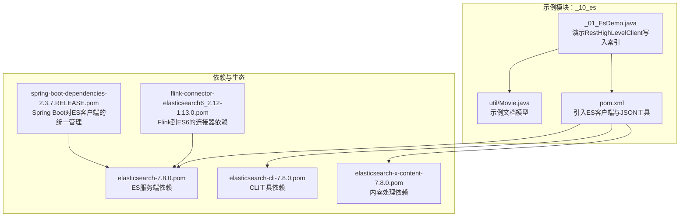
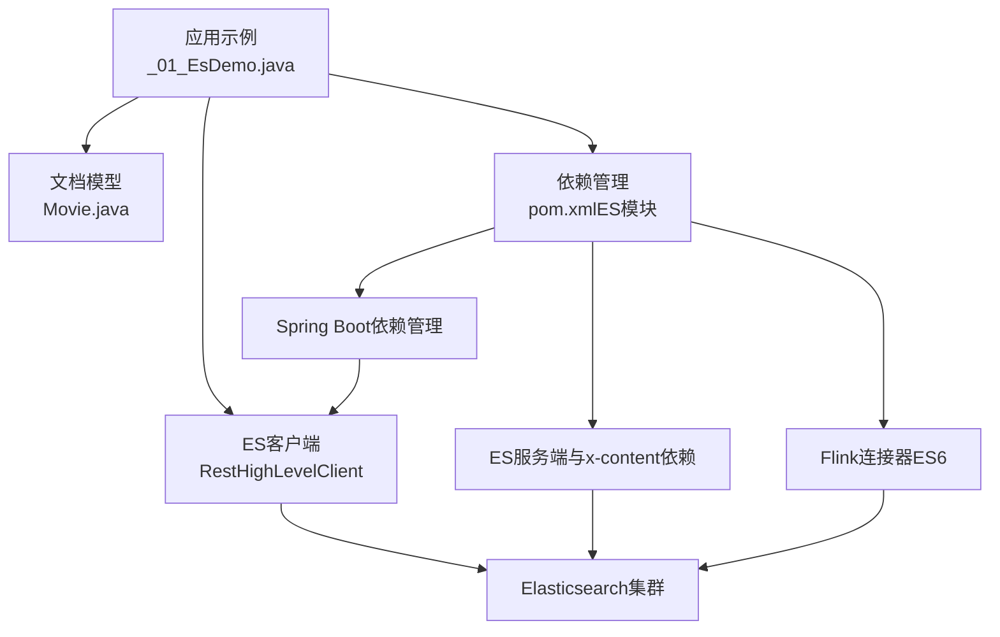
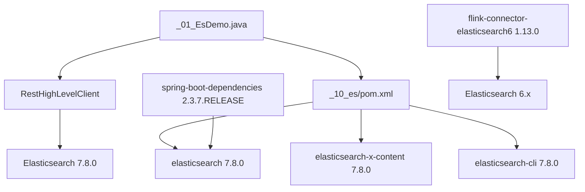

# 索引管理与配置

<cite>
**本文引用的文件**
- [_01_EsDemo.java](file://_10_es/src/main/java/_01_EsDemo.java)
- [Movie.java](file://_10_es/src/main/java/util/Movie.java)
- [pom.xml（ES模块）](file://_10_es/pom.xml)
- [elasticsearch-7.8.0.pom](file://org/elasticsearch/elasticsearch/7.8.0/elasticsearch-7.8.0.pom)
- [elasticsearch-cli-7.8.0.pom](file://org/elasticsearch/elasticsearch-cli/7.8.0/elasticsearch-cli-7.8.0.pom)
- [elasticsearch-x-content-7.8.0.pom](file://org/elasticsearch/elasticsearch-x-content/7.8.0/elasticsearch-x-content-7.8.0.pom)
- [spring-boot-dependencies-2.3.7.RELEASE.pom](file://org/springframework/boot/spring-boot-dependencies/2.3.7.RELEASE/spring-boot-dependencies-2.3.7.RELEASE.pom)
- [flink-connector-elasticsearch6_2.12-1.13.0.pom](file://org/apache/flink/flink-connector-elasticsearch6_2.12/1.13.0/flink-connector-elasticsearch6_2.12-1.13.0.pom)
</cite>

## 目录
1. [简介](#简介)
2. [项目结构](#项目结构)
3. [核心组件](#核心组件)
4. [架构总览](#架构总览)
5. [组件详解](#组件详解)
6. [依赖关系分析](#依赖关系分析)
7. [性能与优化](#性能与优化)
8. [故障排查指南](#故障排查指南)
9. [结论](#结论)
10. [附录](#附录)

## 简介
本技术文档围绕Elasticsearch索引管理进行系统化梳理，结合仓库中现有的Java示例与依赖配置，阐述索引的创建、删除、更新等基础操作；解释动态映射与静态映射的差异与适用场景；介绍索引模板（Index Template）在自动化索引管理中的作用与配置要点；说明分片与副本的配置策略及选择原则；讲解索引别名（Index Alias）在无缝切换与升级中的应用；给出索引生命周期管理（ILM）与热温冷分层存储的实践建议；最后总结索引优化最佳实践与监控、故障排查方法。

## 项目结构
该仓库包含一个用于演示Elasticsearch写入操作的最小示例模块，以及若干与Elasticsearch版本、客户端、Spring Boot集成和Flink连接器相关的依赖POM文件。下图展示了与索引管理相关的关键文件与模块关系：

图表来源
- [_01_EsDemo.java](file://_10_es/src/main/java/_01_EsDemo.java#L1-L45)
- [Movie.java](file://_10_es/src/main/java/util/Movie.java#L1-L36)
- [pom.xml（ES模块）](file://_10_es/pom.xml#L1-L44)
- [elasticsearch-7.8.0.pom](file://org/elasticsearch/elasticsearch/7.8.0/elasticsearch-7.8.0.pom#L303-L337)
- [elasticsearch-cli-7.8.0.pom](file://org/elasticsearch/elasticsearch-cli/7.8.0/elasticsearch-cli-7.8.0.pom#L1-L35)
- [elasticsearch-x-content-7.8.0.pom](file://org/elasticsearch/elasticsearch-x-content/7.8.0/elasticsearch-x-content-7.8.0.pom#L74-L100)
- [spring-boot-dependencies-2.3.7.RELEASE.pom](file://org/springframework/boot/spring-boot-dependencies/2.3.7.RELEASE/spring-boot-dependencies-2.3.7.RELEASE.pom#L650-L700)
- [flink-connector-elasticsearch6_2.12-1.13.0.pom](file://org/apache/flink/flink-connector-elasticsearch6_2.12/1.13.0/flink-connector-elasticsearch6_2.12-1.13.0.pom#L184-L226)

章节来源
- [pom.xml（ES模块）](file://_10_es/pom.xml#L1-L44)
- [_01_EsDemo.java](file://_10_es/src/main/java/_01_EsDemo.java#L1-L45)
- [Movie.java](file://_10_es/src/main/java/util/Movie.java#L1-L36)

## 核心组件
- 示例客户端与写入流程
  - 使用RestHighLevelClient建立连接，构造IndexRequest，设置文档ID、索引名称与JSON源数据，执行index请求完成写入。
  - 参考路径：[_01_EsDemo.java](file://_10_es/src/main/java/_01_EsDemo.java#L1-L45)
- 文档模型
  - 示例模型包含基础字段与构造函数，便于序列化为JSON后写入索引。
  - 参考路径：[Movie.java](file://_10_es/src/main/java/util/Movie.java#L1-L36)
- ES客户端与依赖
  - 模块pom引入elasticsearch与elasticsearch-rest-high-level-client，并包含JSON序列化工具依赖。
  - 参考路径：[pom.xml（ES模块）](file://_10_es/pom.xml#L1-L44)
- 生态依赖
  - Spring Boot对ES客户端版本进行统一管理；Flink连接器指向ES6；ES服务端与x-content等依赖由官方POM描述。
  - 参考路径：
    - [spring-boot-dependencies-2.3.7.RELEASE.pom](file://org/springframework/boot/spring-boot-dependencies/2.3.7.RELEASE/spring-boot-dependencies-2.3.7.RELEASE.pom#L650-L700)
    - [flink-connector-elasticsearch6_2.12-1.13.0.pom](file://org/apache/flink/flink-connector-elasticsearch6_2.12/1.13.0/flink-connector-elasticsearch6_2.12-1.13.0.pom#L184-L226)
    - [elasticsearch-7.8.0.pom](file://org/elasticsearch/elasticsearch/7.8.0/elasticsearch-7.8.0.pom#L303-L337)
    - [elasticsearch-x-content-7.8.0.pom](file://org/elasticsearch/elasticsearch-x-content/7.8.0/elasticsearch-x-content-7.8.0.pom#L74-L100)

章节来源
- [_01_EsDemo.java](file://_10_es/src/main/java/_01_EsDemo.java#L1-L45)
- [Movie.java](file://_10_es/src/main/java/util/Movie.java#L1-L36)
- [pom.xml（ES模块）](file://_10_es/pom.xml#L1-L44)
- [spring-boot-dependencies-2.3.7.RELEASE.pom](file://org/springframework/boot/spring-boot-dependencies/2.3.7.RELEASE/spring-boot-dependencies-2.3.7.RELEASE.pom#L650-L700)
- [flink-connector-elasticsearch6_2.12-1.13.0.pom](file://org/apache/flink/flink-connector-elasticsearch6_2.12/1.13.0/flink-connector-elasticsearch6_2.12-1.13.0.pom#L184-L226)
- [elasticsearch-7.8.0.pom](file://org/elasticsearch/elasticsearch/7.8.0/elasticsearch-7.8.0.pom#L303-L337)
- [elasticsearch-x-content-7.8.0.pom](file://org/elasticsearch/elasticsearch-x-content/7.8.0/elasticsearch-x-content-7.8.0.pom#L74-L100)

## 架构总览
下图展示从应用到Elasticsearch的典型索引写入链路，以及与生态组件的关系：

图表来源
- [_01_EsDemo.java](file://_10_es/src/main/java/_01_EsDemo.java#L1-L45)
- [Movie.java](file://_10_es/src/main/java/util/Movie.java#L1-L36)
- [pom.xml（ES模块）](file://_10_es/pom.xml#L1-L44)
- [spring-boot-dependencies-2.3.7.RELEASE.pom](file://org/springframework/boot/spring-boot-dependencies/2.3.7.RELEASE/spring-boot-dependencies-2.3.7.RELEASE.pom#L650-L700)
- [elasticsearch-7.8.0.pom](file://org/elasticsearch/elasticsearch/7.8.0/elasticsearch-7.8.0.pom#L303-L337)
- [flink-connector-elasticsearch6_2.12-1.13.0.pom](file://org/apache/flink/flink-connector-elasticsearch6_2.12/1.13.0/flink-connector-elasticsearch6_2.12-1.13.0.pom#L184-L226)

## 组件详解

### 基础索引操作（创建/删除/更新）
- 创建索引
  - 在写入前通常需要显式创建索引以定义映射与设置；可通过REST API或高级客户端进行。
  - 参考路径：[_01_EsDemo.java](file://_10_es/src/main/java/_01_EsDemo.java#L1-L45)
- 删除索引
  - 使用删除索引API清理不再使用的索引，注意备份与别名切换后再删除。
- 更新索引
  - 通过部分更新或重新索引（reindex）实现结构变更或数据迁移。

### 动态映射与静态映射
- 动态映射
  - ES根据新文档自动推断字段类型，适合快速迭代；但生产环境建议配合模板与严格策略。
- 静态映射
  - 显式定义字段类型、分词器、是否可查询等，确保一致性与性能可控。
- 实践建议
  - 对关键字段采用静态映射；对临时字段允许动态映射；定期审查与冻结旧索引映射。

### 索引模板（Index Template）
- 用途
  - 自动为符合命名规则的新索引注入默认设置与映射，实现“零样板”索引创建。
- 关键配置点
  - 模式匹配（如按日期滚动）、默认设置（如分片、副本、刷新间隔）、默认映射。
- 自动化管理
  - 将模板纳入基础设施即代码（IaC），随版本发布同步更新，避免手工遗漏。

### 分片与副本配置策略
- 分片数量
  - 选择原则：单分片目标容量约50GB~1TB；根据数据增长速率与查询并发度预估；避免过多分片导致管理开销与资源争用。
- 副本数
  - 选择原则：高可用性需求与读吞吐权衡；副本越多读扩展越好，但写放大与磁盘占用越高。
- 调整时机
  - 索引创建时确定；运行中优先扩副本，再视情况调整分片（需重新分片，成本较高）。

### 索引别名（Index Alias）
- 作用
  - 将逻辑名称绑定到一个或多个物理索引，实现无缝切换与滚动升级。
- 典型流程
  - 写入新索引 → 切换别名 → 关闭旧索引 → 后台重建或迁移。
- 注意事项
  - 别名指向多个索引时，查询需明确路由与时间范围；更新别名是原子操作。

### 索引生命周期管理（ILM）
- 热-温-冷分层
  - 热层：最新数据，保持高性能写入与高副本；温层：近期历史，降低副本、开启压缩；冷层：远期归档，只保留只读快照或极低副本。
- 滚动策略
  - 基于时间或大小滚动；滚动时利用别名切换，保证业务无感知。
- 自动化
  - 结合模板与ILM策略，实现从创建到归档的全生命周期自动化。

### 批量索引、刷新与合并调优
- 批量写入
  - 使用批量请求减少网络往返；合理设置批次大小与并发；监控写入延迟与失败重试。
- 刷新间隔
  - 默认1秒；对实时性要求高的场景可降低刷新间隔，但会增加WAL与合并压力。
- 合并策略
  - 控制段合并频率与大小阈值，平衡写放大与查询性能；对大字段或高基数字段谨慎启用实时聚合。

### 监控与故障排查
- 监控指标
  - 写入速率、文档大小、分片数量与分布、副本状态、磁盘使用率、段数量与大小、查询延迟、GC与线程池状态。
- 常见问题
  - 写入堆积：检查刷新间隔、批量大小、磁盘IO与网络；评估分片数量是否过少。
  - 查询慢：检查查询DSL、字段映射、分片分布不均、未命中缓存。
  - 磁盘爆满：启用ILM与压缩，清理旧索引或快照。
- 故障定位
  - 查看节点健康与集群状态；确认模板与映射是否一致；核对别名指向与滚动策略执行情况。

## 依赖关系分析
下图展示示例模块与ES生态之间的依赖关系，以及Spring Boot与Flink连接器对ES版本的约束：

图表来源
- [_01_EsDemo.java](file://_10_es/src/main/java/_01_EsDemo.java#L1-L45)
- [pom.xml（ES模块）](file://_10_es/pom.xml#L1-L44)
- [elasticsearch-7.8.0.pom](file://org/elasticsearch/elasticsearch/7.8.0/elasticsearch-7.8.0.pom#L303-L337)
- [elasticsearch-cli-7.8.0.pom](file://org/elasticsearch/elasticsearch-cli/7.8.0/elasticsearch-cli-7.8.0.pom#L1-L35)
- [elasticsearch-x-content-7.8.0.pom](file://org/elasticsearch/elasticsearch-x-content/7.8.0/elasticsearch-x-content-7.8.0.pom#L74-L100)
- [spring-boot-dependencies-2.3.7.RELEASE.pom](file://org/springframework/boot/spring-boot-dependencies/2.3.7.RELEASE/spring-boot-dependencies-2.3.7.RELEASE.pom#L650-L700)
- [flink-connector-elasticsearch6_2.12-1.13.0.pom](file://org/apache/flink/flink-connector-elasticsearch6_2.12/1.13.0/flink-connector-elasticsearch6_2.12-1.13.0.pom#L184-L226)

章节来源
- [pom.xml（ES模块）](file://_10_es/pom.xml#L1-L44)
- [spring-boot-dependencies-2.3.7.RELEASE.pom](file://org/springframework/boot/spring-boot-dependencies/2.3.7.RELEASE/spring-boot-dependencies-2.3.7.RELEASE.pom#L650-L700)
- [flink-connector-elasticsearch6_2.12-1.13.0.pom](file://org/apache/flink/flink-connector-elasticsearch6_2.12/1.13.0/flink-connector-elasticsearch6_2.12-1.13.0.pom#L184-L226)
- [elasticsearch-7.8.0.pom](file://org/elasticsearch/elasticsearch/7.8.0/elasticsearch-7.8.0.pom#L303-L337)
- [elasticsearch-x-content-7.8.0.pom](file://org/elasticsearch/elasticsearch-x-content/7.8.0/elasticsearch-x-content-7.8.0.pom#L74-L100)

## 性能与优化
- 写入优化
  - 合理批量大小与并发；启用刷新间隔调优；避免热点分片。
- 查询优化
  - 字段映射与分词器选择；路由与分片分布；缓存与查询DSL优化。
- 存储优化
  - ILM与压缩；冷热分层；定期检查与修复索引。
- 运行时调优
  - 监控线程池与GC；限制切分与合并并发；按需调整translog与refresh策略。

## 故障排查指南
- 写入异常
  - 检查索引映射冲突、模板未生效、磁盘空间不足、网络抖动。
- 查询异常
  - 排查字段类型不匹配、分片分布不均、路由键缺失。
- 升级与滚动
  - 确认模板与ILM策略、别名切换顺序、旧索引关闭与清理。
- 工具与日志
  - 使用ES内置监控与诊断命令；结合应用日志定位问题根因。

## 结论
通过对示例模块与生态依赖的梳理，可以将索引管理的关键环节串联起来：从客户端写入、模板与映射治理、分片副本策略、别名滚动升级，到ILM与性能优化、监控与故障排查。建议在生产环境中以模板驱动索引创建，以ILM实现生命周期自动化，以别名实现无缝切换，并持续监控与迭代调优。

## 附录
- 示例入口参考
  - 写入流程入口：[_01_EsDemo.java](file://_10_es/src/main/java/_01_EsDemo.java#L1-L45)
  - 文档模型：[Movie.java](file://_10_es/src/main/java/util/Movie.java#L1-L36)
- 依赖参考
  - ES客户端与服务端版本：[pom.xml（ES模块）](file://_10_es/pom.xml#L1-L44)、[elasticsearch-7.8.0.pom](file://org/elasticsearch/elasticsearch/7.8.0/elasticsearch-7.8.0.pom#L303-L337)
  - Spring Boot对ES客户端的统一管理：[spring-boot-dependencies-2.3.7.RELEASE.pom](file://org/springframework/boot/spring-boot-dependencies/2.3.7.RELEASE/spring-boot-dependencies-2.3.7.RELEASE.pom#L650-L700)
  - Flink连接器（ES6）：[flink-connector-elasticsearch6_2.12-1.13.0.pom](file://org/apache/flink/flink-connector-elasticsearch6_2.12/1.13.0/flink-connector-elasticsearch6_2.12-1.13.0.pom#L184-L226)