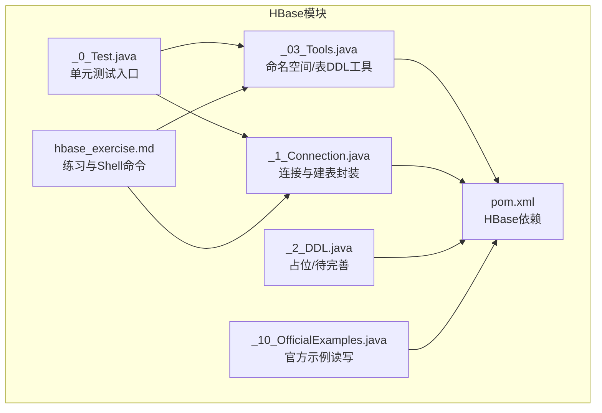
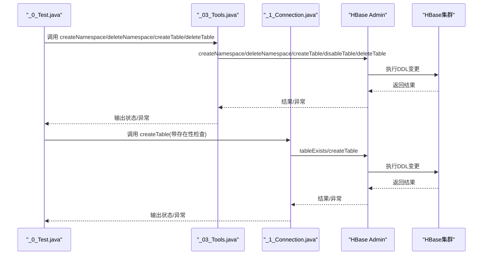
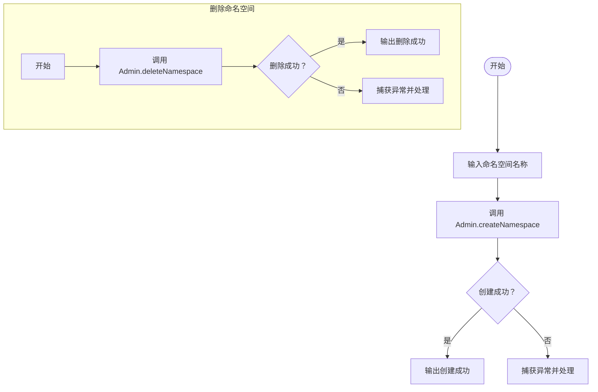
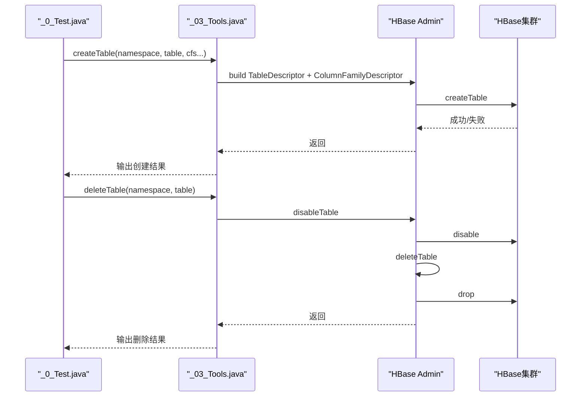
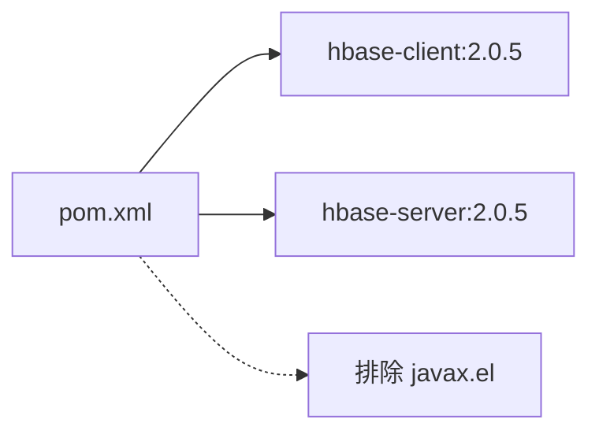

# HBase DDL操作

<cite>
**本文引用的文件**
- [_03_Tools.java](file://_08_hbase/src/main/java/_03_Tools.java)
- [_1_Connection.java](file://_08_hbase/src/main/java/_1_Connection.java)
- [_2_DDL.java](file://_08_hbase/src/main/java/_2_DDL.java)
- [_0_Test.java](file://_08_hbase/src/main/java/_0_Test.java)
- [_10_OfficialExamples.java](file://_08_hbase/src/main/java/_10_OfficialExamples.java)
- [hbase_exercise.md](file://_08_hbase/hbase_exercise.md)
- [pom.xml](file://_08_hbase/pom.xml)
</cite>

## 目录
1. [简介](#简介)
2. [项目结构](#项目结构)
3. [核心组件](#核心组件)
4. [架构总览](#架构总览)
5. [详细组件分析](#详细组件分析)
6. [依赖分析](#依赖分析)
7. [性能考量](#性能考量)
8. [故障排查指南](#故障排查指南)
9. [结论](#结论)
10. [附录](#附录)

## 简介
本文件围绕HBase DDL（数据定义语言）操作进行系统化技术文档整理，覆盖命名空间与表的创建、修改、删除等关键流程；解释表结构设计原则（行键、列族、版本控制）；给出Admin接口的使用要点与常见动态修改场景；并提供可直接定位到源码路径的示例参考，帮助读者快速落地实践。同时总结DDL操作注意事项、最佳实践与错误处理思路。

## 项目结构
该模块位于仓库的“_08_hbase”目录下，主要包含若干演示类与练习文档：
- DDL与命名空间操作：_03_Tools.java、_1_Connection.java、_2_DDL.java、_0_Test.java
- 官方示例（读写为主，便于理解连接与资源管理）：_10_OfficialExamples.java
- 练习文档：hbase_exercise.md（包含Shell命令与表设计要点）
- 依赖配置：pom.xml（HBase客户端与服务端依赖）

图表来源
- [_03_Tools.java](file://_08_hbase/src/main/java/_03_Tools.java#L1-L125)
- [_1_Connection.java](file://_08_hbase/src/main/java/_1_Connection.java#L1-L82)
- [_2_DDL.java](file://_08_hbase/src/main/java/_2_DDL.java#L1-L10)
- [_0_Test.java](file://_08_hbase/src/main/java/_0_Test.java#L1-L44)
- [_10_OfficialExamples.java](file://_08_hbase/src/main/java/_10_OfficialExamples.java#L1-L125)
- [hbase_exercise.md](file://_08_hbase/hbase_exercise.md#L1-L308)
- [pom.xml](file://_08_hbase/pom.xml#L1-L45)

章节来源
- [pom.xml](file://_08_hbase/pom.xml#L1-L45)

## 核心组件
- 命名空间与表DDL工具：_03_Tools.java 提供命名空间创建/删除、表创建/删除、数据插入等能力，是本模块DDL操作的主要实现载体。
- 连接与建表封装：_1_Connection.java 展示了连接建立、表存在性检查与建表流程，强调健壮性与资源管理。
- 单元测试入口：_0_Test.java 通过JUnit注解驱动各DDL场景测试，便于验证。
- 官方示例：_10_OfficialExamples.java 强调连接、Admin/Table生命周期管理，为DDL操作提供上下文。
- 练习文档：hbase_exercise.md 提供Shell命令与表设计要点，辅助理解DDL语义与最佳实践。

章节来源
- [_03_Tools.java](file://_08_hbase/src/main/java/_03_Tools.java#L1-L125)
- [_1_Connection.java](file://_08_hbase/src/main/java/_1_Connection.java#L1-L82)
- [_0_Test.java](file://_08_hbase/src/main/java/_0_Test.java#L1-L44)
- [_10_OfficialExamples.java](file://_08_hbase/src/main/java/_10_OfficialExamples.java#L1-L125)
- [hbase_exercise.md](file://_08_hbase/hbase_exercise.md#L1-L308)

## 架构总览
下图展示了DDL操作在代码中的调用链与职责划分：测试驱动调用工具类，工具类通过Admin/Connection执行DDL；官方示例强调连接与资源管理；练习文档提供Shell命令与设计原则。

图表来源
- [_0_Test.java](file://_08_hbase/src/main/java/_0_Test.java#L1-L44)
- [_03_Tools.java](file://_08_hbase/src/main/java/_03_Tools.java#L1-L125)
- [_1_Connection.java](file://_08_hbase/src/main/java/_1_Connection.java#L1-L82)

## 详细组件分析

### 命名空间管理
- 创建命名空间：_03_Tools.java 中提供 createNamespace 方法，通过 Admin.createNamespace(NamespaceDescriptor) 完成。
- 删除命名空间：_03_Tools.java 中提供 deleteNamespace 方法，要求命名空间为空（无表）方可删除。
- 测试入口：_0_Test.java 中包含 createNamespace 与 deleteNamespace 的测试用例。

图表来源
- [_03_Tools.java](file://_08_hbase/src/main/java/_03_Tools.java#L69-L87)
- [_0_Test.java](file://_08_hbase/src/main/java/_0_Test.java#L13-L33)

章节来源
- [_03_Tools.java](file://_08_hbase/src/main/java/_03_Tools.java#L69-L87)
- [_0_Test.java](file://_08_hbase/src/main/java/_0_Test.java#L13-L33)

### 表的创建与删除
- 创建表：_03_Tools.java 中 createTable 支持指定命名空间、表名与多个列族；通过 TableDescriptorBuilder 与 ColumnFamilyDescriptorBuilder 组装表描述符后调用 Admin.createTable。
- 删除表：_03_Tools.java 中 deleteTable 先禁用表再删除，并在完成后关闭 Admin 资源。
- 存在性检查与健壮性：_1_Connection.java 中在建表前先判断表是否存在，避免重复创建。
- 官方示例：_10_OfficialExamples.java 展示了连接与资源管理的最佳实践，为DDL操作提供上下文。

图表来源
- [_03_Tools.java](file://_08_hbase/src/main/java/_03_Tools.java#L48-L67)
- [_03_Tools.java](file://_08_hbase/src/main/java/_03_Tools.java#L34-L45)
- [_1_Connection.java](file://_08_hbase/src/main/java/_1_Connection.java#L33-L78)
- [_10_OfficialExamples.java](file://_08_hbase/src/main/java/_10_OfficialExamples.java#L21-L40)

章节来源
- [_03_Tools.java](file://_08_hbase/src/main/java/_03_Tools.java#L34-L67)
- [_1_Connection.java](file://_08_hbase/src/main/java/_1_Connection.java#L33-L78)
- [_10_OfficialExamples.java](file://_08_hbase/src/main/java/_10_OfficialExamples.java#L21-L40)
- [_0_Test.java](file://_08_hbase/src/main/java/_0_Test.java#L19-L28)

### 表结构设计原则
- 行键设计：练习文档提供了多种行键设计模式，包括按用户+时间、按时间+用户等，强调扫描范围与热点规避。
- 列族组织：建议按业务维度分列族，减少列族数量以降低开销；列族一旦确定应谨慎变更。
- 版本控制策略：通过VERSIONS参数控制列版本数，结合扫描与过滤策略提升查询效率。

章节来源
- [hbase_exercise.md](file://_08_hbase/hbase_exercise.md#L133-L193)

### DDL API使用要点
- Admin接口：用于命名空间与表级DDL操作（创建/删除/禁用/启用/修改表属性等）。
- 连接与资源管理：官方示例强调 Connection、Admin、Table 的生命周期管理，避免资源泄漏。
- 表描述符构建：通过 TableDescriptorBuilder 与 ColumnFamilyDescriptorBuilder 组装表结构与属性。

章节来源
- [_10_OfficialExamples.java](file://_08_hbase/src/main/java/_10_OfficialExamples.java#L21-L40)
- [_03_Tools.java](file://_08_hbase/src/main/java/_03_Tools.java#L48-L67)
- [_1_Connection.java](file://_08_hbase/src/main/java/_1_Connection.java#L53-L71)

### 动态修改表Schema（列族与属性）
- 添加列族：练习文档中的alter示例展示了向表添加新列族与修改列族属性的方式。
- 删除列族：alter支持删除列族，需确保表处于可用状态或先禁用。
- 修改表属性：如VERSIONS等，alter命令可更新列族属性。

章节来源
- [hbase_exercise.md](file://_08_hbase/hbase_exercise.md#L42-L48)

### 常见DDL操作场景（代码路径参考）
- 创建命名空间：参见[_03_Tools.java](file://_08_hbase/src/main/java/_03_Tools.java#L69-L77)
- 删除命名空间：参见[_03_Tools.java](file://_08_hbase/src/main/java/_03_Tools.java#L80-L87)
- 创建表（含列族）：参见[_03_Tools.java](file://_08_hbase/src/main/java/_03_Tools.java#L48-L67)、[_1_Connection.java](file://_08_hbase/src/main/java/_1_Connection.java#L53-L71)
- 删除表（禁用+删除）：参见[_03_Tools.java](file://_08_hbase/src/main/java/_03_Tools.java#L34-L45)
- 表存在性检查：参见[_1_Connection.java](file://_08_hbase/src/main/java/_1_Connection.java#L43-L51)
- 修改表属性（列族VERSIONS等）：参见[hbase_exercise.md](file://_08_hbase/hbase_exercise.md#L42-L48)

## 依赖分析
- HBase客户端与服务端依赖：pom.xml中引入hbase-client与hbase-server，版本为2.0.5，满足DDL与读写操作的基础能力。
- 排除项：排除了javax.el相关依赖，避免冲突。

图表来源
- [pom.xml](file://_08_hbase/pom.xml#L19-L41)

章节来源
- [pom.xml](file://_08_hbase/pom.xml#L19-L41)

## 性能考量
- 预分区与行键设计：练习文档建议根据业务访问模式设计行键，减少热点与跨区扫描。
- 列族数量控制：尽量合并相关业务到同一列族，避免过多列族带来的元数据与I/O开销。
- 版本控制：合理设置VERSIONS，避免过度保留历史版本导致存储膨胀与扫描成本上升。
- 连接与资源管理：官方示例强调连接复用与及时关闭Admin/Scanner等资源，降低GC压力与连接池耗尽风险。

章节来源
- [hbase_exercise.md](file://_08_hbase/hbase_exercise.md#L133-L193)
- [_10_OfficialExamples.java](file://_08_hbase/src/main/java/_10_OfficialExamples.java#L21-L40)

## 故障排查指南
- 命名空间删除失败：仅能删除空命名空间，需先迁移或删除其中的表。
- 表删除失败：需先禁用表再删除；确认表不存在或已禁用。
- 表已存在：建表前进行存在性检查，避免重复创建。
- 资源未关闭：Admin/Table/Scanner等需在finally或try-with-resources中关闭，防止连接泄漏。
- 权限不足：DDL操作通常需要管理员权限，确保连接具备相应权限。

章节来源
- [_03_Tools.java](file://_08_hbase/src/main/java/_03_Tools.java#L34-L45)
- [_1_Connection.java](file://_08_hbase/src/main/java/_1_Connection.java#L43-L51)
- [_10_OfficialExamples.java](file://_08_hbase/src/main/java/_10_OfficialExamples.java#L21-L40)

## 结论
本模块通过工具类与测试用例展示了HBase命名空间与表的DDL操作路径，结合官方示例与练习文档，形成了从连接管理、DDL执行到表设计与性能优化的完整知识闭环。建议在生产环境中严格遵循资源管理、权限控制与表设计规范，确保DDL操作的安全与高效。

## 附录
- Shell命令参考：练习文档中提供了命名空间与表DDL的Shell命令示例，便于对照理解DDL语义与行为。
- 代码路径参考：本文在各节末尾均标注了具体文件与行号，便于快速定位实现细节。

章节来源
- [hbase_exercise.md](file://_08_hbase/hbase_exercise.md#L1-L68)