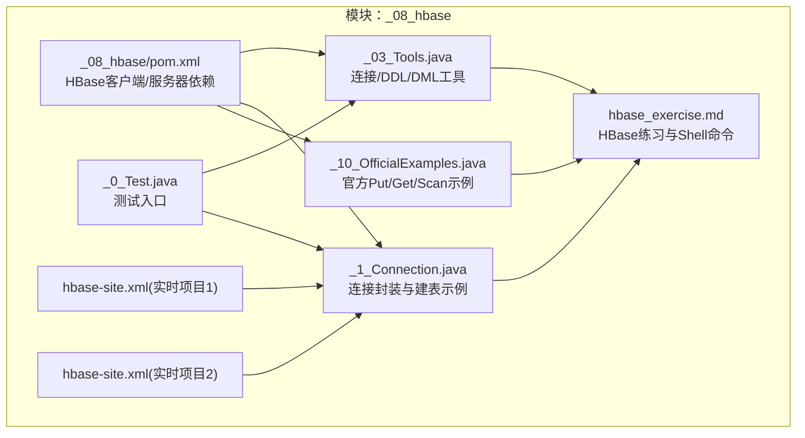
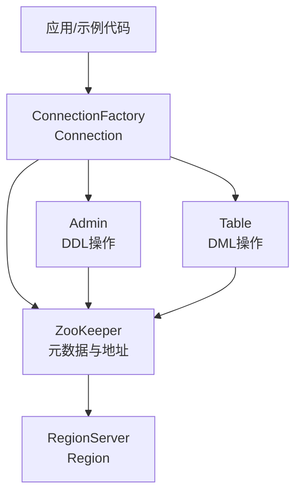
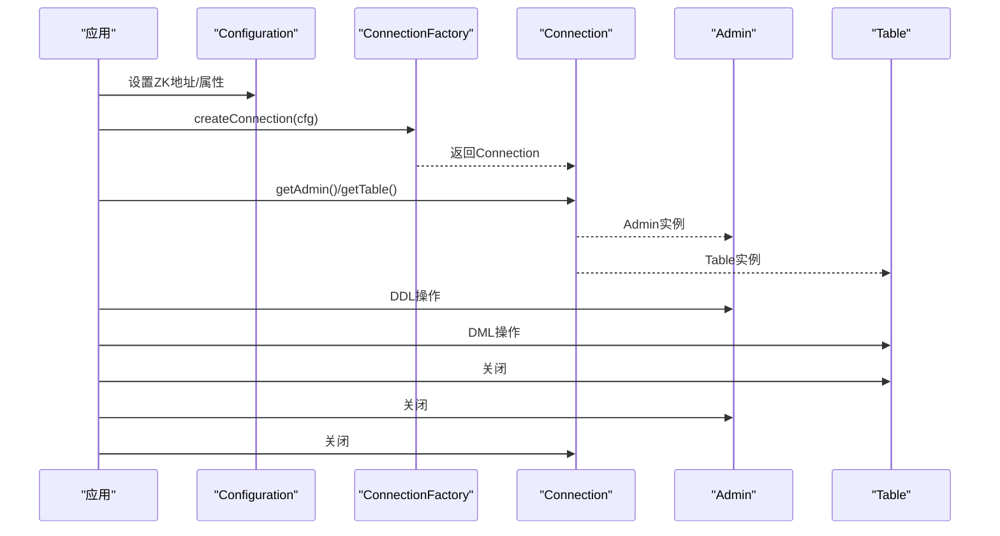
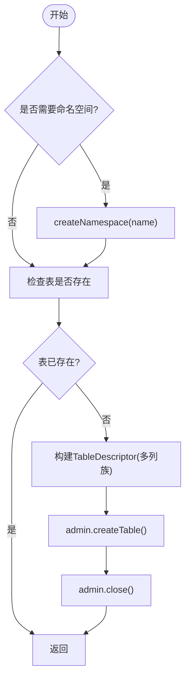
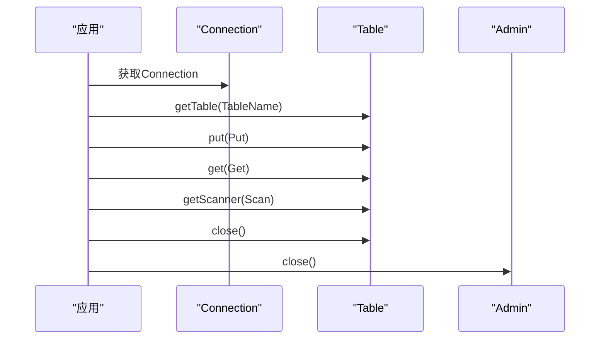
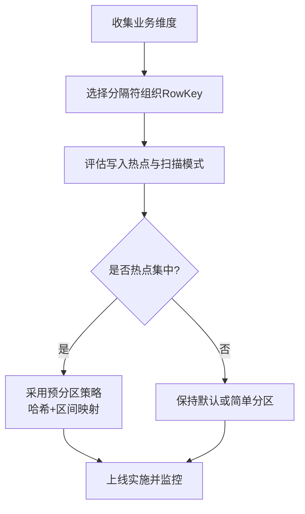
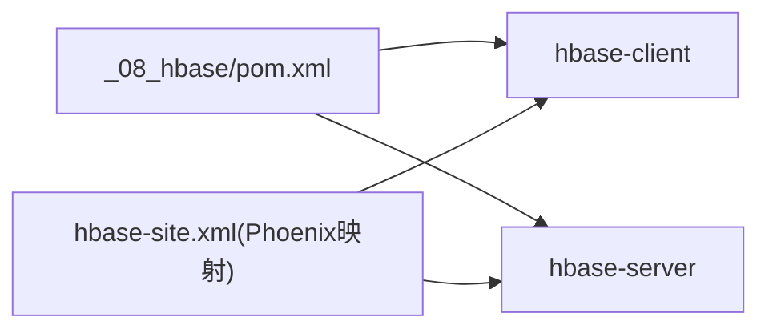

# HBase NoSQL存储

<cite>
**本文引用的文件**
- [_08_hbase/pom.xml](file://_08_hbase/pom.xml)
- [_08_hbase/src/main/java/_03_Tools.java](file://_08_hbase/src/main/java/_03_Tools.java)
- [_08_hbase/src/main/java/_1_Connection.java](file://_08_hbase/src/main/java/_1_Connection.java)
- [_08_hbase/src/main/java/_10_OfficialExamples.java](file://_08_hbase/src/main/java/_10_OfficialExamples.java)
- [_08_hbase/src/main/java/_0_Test.java](file://_08_hbase/src/main/java/_0_Test.java)
- [_08_hbase/hbase_exercise.md](file://_08_hbase/hbase_exercise.md)
- [_200_flinkRealtime/src/main/resources/hbase-site.xml](file://_200_flinkRealtime/src/main/resources/hbase-site.xml)
- [_200_flinkRealtime0106/src/main/resources/hbase-site.xml](file://_200_flinkRealtime0106/src/main/resources/hbase-site.xml)
</cite>

## 目录
1. [简介](#简介)
2. [项目结构](#项目结构)
3. [核心组件](#核心组件)
4. [架构总览](#架构总览)
5. [组件详解](#组件详解)
6. [依赖关系分析](#依赖关系分析)
7. [性能优化](#性能优化)
8. [故障排查指南](#故障排查指南)
9. [结论](#结论)
10. [附录](#附录)

## 简介
本技术文档围绕 HBase NoSQL 存储系统，结合仓库中的示例代码与练习文档，系统性阐述其架构与核心概念，覆盖命名空间与表的 DDL 操作、行键设计与列族组织、版本管理机制，以及数据读写 API（Put、Get、Scan、Delete）的使用方式。同时提供连接管理最佳实践、性能优化策略（预分区、压缩与缓存）、集群部署与监控维护要点，以及常见问题排查方法，帮助读者在大数据场景下高效、稳定地使用 HBase。

## 项目结构
该仓库的 HBase 示例位于 _08_hbase 模块，主要包含以下文件：
- 依赖配置：声明 HBase 客户端与服务器依赖
- 连接与 DDL 示例：封装连接获取、表与命名空间的创建与删除
- 官方示例：演示 Put、Get、Scan 的标准用法
- 测试入口：驱动上述示例运行
- 练习文档：涵盖 HBase Shell 的 DDL/DML、RowKey 设计、预分区、Phoenix 映射与索引等

**图表来源**
- [_08_hbase/pom.xml](file://_08_hbase/pom.xml#L1-L45)
- [_08_hbase/src/main/java/_03_Tools.java](file://_08_hbase/src/main/java/_03_Tools.java#L1-L125)
- [_08_hbase/src/main/java/_1_Connection.java](file://_08_hbase/src/main/java/_1_Connection.java#L1-L82)
- [_08_hbase/src/main/java/_10_OfficialExamples.java](file://_08_hbase/src/main/java/_10_OfficialExamples.java#L1-L125)
- [_08_hbase/src/main/java/_0_Test.java](file://_08_hbase/src/main/java/_0_Test.java#L1-L44)
- [_08_hbase/hbase_exercise.md](file://_08_hbase/hbase_exercise.md#L1-L308)
- [_200_flinkRealtime/src/main/resources/hbase-site.xml](file://_200_flinkRealtime/src/main/resources/hbase-site.xml#L1-L14)
- [_200_flinkRealtime0106/src/main/resources/hbase-site.xml](file://_200_flinkRealtime0106/src/main/resources/hbase-site.xml#L1-L13)

**章节来源**
- [_08_hbase/pom.xml](file://_08_hbase/pom.xml#L1-L45)
- [_08_hbase/hbase_exercise.md](file://_08_hbase/hbase_exercise.md#L1-L308)

## 核心组件
- 连接管理与配置
  - 通过 Configuration 设置 ZooKeeper 地址，使用 ConnectionFactory 创建连接；连接是重量级资源，应复用。
  - 提供 getConnection 静态方法统一获取连接，便于 DDL/DML 复用。
- DDL 操作
  - 命名空间：createNamespace、deleteNamespace
  - 表：createTable（支持多列族）、deleteTable（先禁用再删除）
- DML 操作
  - Put：按行键写入指定列族与列限定符的值
  - Get：按行键读取指定列或整行
  - Scan：范围扫描、按列过滤、版本控制
  - Delete：删除指定版本、整列或整列族
- RowKey 设计与预分区
  - 结合业务需求设计 RowKey，利用分隔符组织时间、地域、用户等维度
  - 预分区策略提升写入与扫描效率，避免热点

**章节来源**
- [_08_hbase/src/main/java/_1_Connection.java](file://_08_hbase/src/main/java/_1_Connection.java#L1-L82)
- [_08_hbase/src/main/java/_03_Tools.java](file://_08_hbase/src/main/java/_03_Tools.java#L1-L125)
- [_08_hbase/src/main/java/_10_OfficialExamples.java](file://_08_hbase/src/main/java/_10_OfficialExamples.java#L1-L125)
- [_08_hbase/hbase_exercise.md](file://_08_hbase/hbase_exercise.md#L133-L193)

## 架构总览
HBase 客户端通过 ZooKeeper 发现 RegionServer，使用 Table/RegionLocator 访问具体 Region。官方示例强调连接的重量级特性，建议长连接复用；而 DDL/DML 对象轻量，按需创建并在使用后关闭。

**图表来源**
- [_08_hbase/src/main/java/_10_OfficialExamples.java](file://_08_hbase/src/main/java/_10_OfficialExamples.java#L20-L50)

## 组件详解

### 连接与配置管理
- 配置项
  - hbase.zookeeper.quorum：ZooKeeper 集群地址
  - Phoenix 命名空间映射相关属性：启用命名空间映射与系统表映射
- 最佳实践
  - 复用 Connection，避免频繁创建销毁
  - 使用 try-with-resources 或 finally 确保关闭 Table/Admin
  - 在生产环境将配置放入 hbase-site.xml 并随应用打包

**图表来源**
- [_08_hbase/src/main/java/_10_OfficialExamples.java](file://_08_hbase/src/main/java/_10_OfficialExamples.java#L20-L120)
- [_08_hbase/src/main/java/_1_Connection.java](file://_08_hbase/src/main/java/_1_Connection.java#L1-L82)
- [_200_flinkRealtime/src/main/resources/hbase-site.xml](file://_200_flinkRealtime/src/main/resources/hbase-site.xml#L1-L14)
- [_200_flinkRealtime0106/src/main/resources/hbase-site.xml](file://_200_flinkRealtime0106/src/main/resources/hbase-site.xml#L1-L13)

**章节来源**
- [_08_hbase/src/main/java/_1_Connection.java](file://_08_hbase/src/main/java/_1_Connection.java#L1-L82)
- [_200_flinkRealtime/src/main/resources/hbase-site.xml](file://_200_flinkRealtime/src/main/resources/hbase-site.xml#L1-L14)
- [_200_flinkRealtime0106/src/main/resources/hbase-site.xml](file://_200_flinkRealtime0106/src/main/resources/hbase-site.xml#L1-L13)

### DDL 操作（命名空间与表）
- 命名空间
  - 创建：createNamespace
  - 删除：deleteNamespace（仅空命名空间）
- 表
  - 创建：createTable（支持多列族），先判断是否存在
  - 删除：deleteTable（先禁用再删除）

**图表来源**
- [_08_hbase/src/main/java/_03_Tools.java](file://_08_hbase/src/main/java/_03_Tools.java#L47-L67)

**章节来源**
- [_08_hbase/src/main/java/_03_Tools.java](file://_08_hbase/src/main/java/_03_Tools.java#L34-L67)

### DML 操作（Put/Get/Scan/Delete）
- Put：按行键写入指定列族与列限定符的值
- Get：按行键读取指定列或整行，可验证写入结果
- Scan：按列过滤、范围扫描、版本控制
- Delete：删除指定版本、整列或整列族

**图表来源**
- [_08_hbase/src/main/java/_10_OfficialExamples.java](file://_08_hbase/src/main/java/_10_OfficialExamples.java#L50-L120)

**章节来源**
- [_08_hbase/src/main/java/_10_OfficialExamples.java](file://_08_hbase/src/main/java/_10_OfficialExamples.java#L1-L125)

### RowKey 设计与预分区
- 设计原则
  - 业务维度组合（如用户、时间、地域），使用分隔符组织
  - 保证热点均匀分布，避免局部写入压力过大
- 预分区策略
  - 将固定时间段的数据映射到固定分区区间，减少全表扫描
  - 通过哈希与区间计算确定分区号，兼顾写入与查询

**图表来源**
- [_08_hbase/hbase_exercise.md](file://_08_hbase/hbase_exercise.md#L133-L193)

**章节来源**
- [_08_hbase/hbase_exercise.md](file://_08_hbase/hbase_exercise.md#L133-L193)

### Phoenix 映射与索引（扩展）
- 命名空间与 Schema 映射
  - 通过 hbase-site.xml 启用命名空间映射与系统表映射
- 全局索引与本地索引
  - 全局索引：独立索引表，按查询字段构建新 RowKey
  - 本地索引：将索引字段与原表 RowKey 拼接，存储在原表中
- 列编码与映射表
  - 可通过 COLUMN_ENCODED_BYTES 控制编码策略
  - 支持将 HBase 表映射为 Phoenix 表，便于 SQL 查询

**章节来源**
- [_200_flinkRealtime/src/main/resources/hbase-site.xml](file://_200_flinkRealtime/src/main/resources/hbase-site.xml#L1-L14)
- [_200_flinkRealtime0106/src/main/resources/hbase-site.xml](file://_200_flinkRealtime0106/src/main/resources/hbase-site.xml#L1-L13)
- [_08_hbase/hbase_exercise.md](file://_08_hbase/hbase_exercise.md#L195-L308)

## 依赖关系分析
- HBase 客户端与服务器依赖
  - hbase-client：客户端 API
  - hbase-server：服务端能力
- Phoenix 相关依赖
  - phoenix-core、phoenix-spark 等（仓库中存在对应版本构件）
- 项目间配置
  - hbase-site.xml 中的 Phoenix 映射属性在多个实时项目中复用

**图表来源**
- [_08_hbase/pom.xml](file://_08_hbase/pom.xml#L19-L41)
- [_200_flinkRealtime/src/main/resources/hbase-site.xml](file://_200_flinkRealtime/src/main/resources/hbase-site.xml#L1-L14)
- [_200_flinkRealtime0106/src/main/resources/hbase-site.xml](file://_200_flinkRealtime0106/src/main/resources/hbase-site.xml#L1-L13)

**章节来源**
- [_08_hbase/pom.xml](file://_08_hbase/pom.xml#L19-L41)
- [_200_flinkRealtime/src/main/resources/hbase-site.xml](file://_200_flinkRealtime/src/main/resources/hbase-site.xml#L1-L14)
- [_200_flinkRealtime0106/src/main/resources/hbase-site.xml](file://_200_flinkRealtime0106/src/main/resources/hbase-site.xml#L1-L13)

## 性能优化
- 写入与扫描优化
  - RowKey 设计：结合业务维度与访问模式，避免热点
  - 预分区：将固定时间/地域数据映射到固定分区区间
- 版本与压缩
  - 版本控制：根据业务保留必要版本数，减少存储与扫描开销
  - 压缩：选择合适的压缩算法（Snappy/LZ4 等），平衡 CPU 与带宽
- 缓存与批量
  - 合理使用批量写入与读取，降低 RPC 次数
  - 适当配置客户端缓存与批量大小
- 集群层面
  - Region 数量与大小：避免过大或过小导致的负载不均
  - 负载均衡与副本策略：确保跨 RegionServer 的均匀分布

[本节为通用指导，无需列出具体文件来源]

## 故障排查指南
- 连接失败
  - 检查 hbase.zookeeper.quorum 是否正确
  - 确认 hbase-site.xml 配置已随应用加载
- 表不存在或权限不足
  - 确认命名空间与表已创建
  - 检查管理员权限与表状态（启用/禁用）
- 写入异常
  - 校验 RowKey 设计是否合理
  - 检查列族与列限定符是否已在表结构中定义
- 读取性能差
  - 评估是否需要预分区与版本控制
  - 使用 Scan 的列过滤与版本参数减少无效数据传输
- Phoenix 映射问题
  - 确认 hbase-site.xml 中的命名空间映射属性已生效
  - 检查 Phoenix 与 HBase 的版本兼容性

**章节来源**
- [_08_hbase/src/main/java/_1_Connection.java](file://_08_hbase/src/main/java/_1_Connection.java#L1-L82)
- [_08_hbase/src/main/java/_03_Tools.java](file://_08_hbase/src/main/java/_03_Tools.java#L34-L67)
- [_08_hbase/hbase_exercise.md](file://_08_hbase/hbase_exercise.md#L1-L132)
- [_200_flinkRealtime/src/main/resources/hbase-site.xml](file://_200_flinkRealtime/src/main/resources/hbase-site.xml#L1-L14)
- [_200_flinkRealtime0106/src/main/resources/hbase-site.xml](file://_200_flinkRealtime0106/src/main/resources/hbase-site.xml#L1-L13)

## 结论
本仓库提供了 HBase 连接、DDL 与 DML 的基础实现与官方示例，配合练习文档中的 RowKey 设计与预分区策略，能够帮助开发者快速掌握 HBase 的核心使用方式。结合 Phoenix 映射与索引能力，可在大数据场景中实现更灵活的查询与运维。建议在生产环境中遵循连接复用、合理 RowKey 设计、版本与压缩配置、以及完善的监控与排障流程，以获得稳定高效的性能表现。

[本节为总结性内容，无需列出具体文件来源]

## 附录
- 常用操作路径参考
  - 连接与建表：[_1_Connection.java](file://_08_hbase/src/main/java/_1_Connection.java#L1-L82)
  - DDL 工具：[_03_Tools.java](file://_08_hbase/src/main/java/_03_Tools.java#L1-L125)
  - 官方示例（Put/Get/Scan）：[_10_OfficialExamples.java](file://_08_hbase/src/main/java/_10_OfficialExamples.java#L1-L125)
  - 测试入口：[_0_Test.java](file://_08_hbase/src/main/java/_0_Test.java#L1-L44)
  - HBase 练习与 Shell 命令：[_hbase_exercise.md](file://_08_hbase/hbase_exercise.md#L1-L308)
  - Phoenix 映射配置（项目1）：[_200_flinkRealtime/hbase-site.xml](file://_200_flinkRealtime/src/main/resources/hbase-site.xml#L1-L14)
  - Phoenix 映射配置（项目2）：[_200_flinkRealtime0106/hbase-site.xml](file://_200_flinkRealtime0106/src/main/resources/hbase-site.xml#L1-L13)

[本节为索引性内容，无需列出具体文件来源]