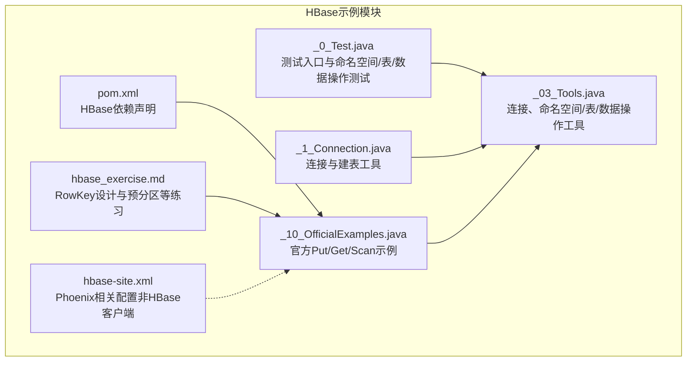
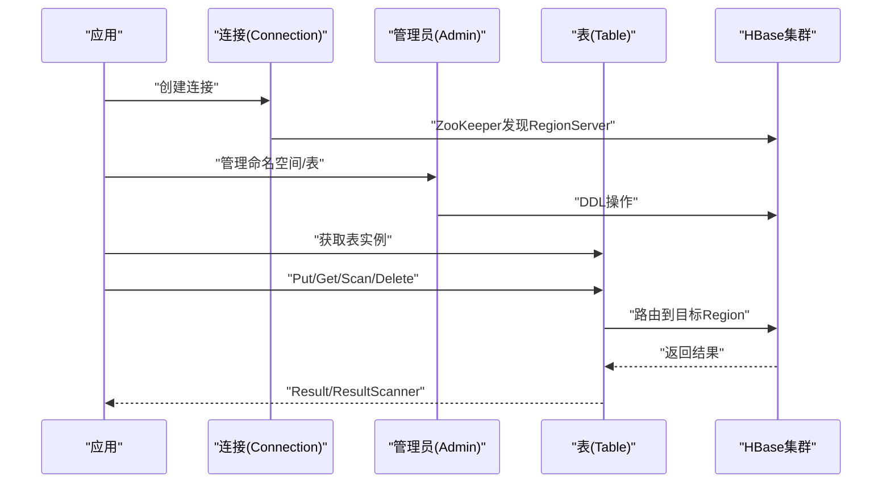
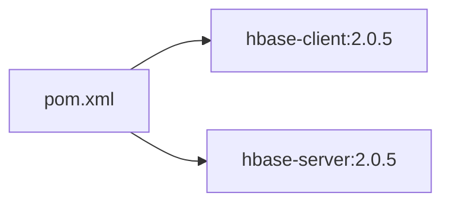

# HBase数据操作

<cite>
**本文引用的文件**
- [_08_hbase/src/main/java/_0_Test.java](file://_08_hbase/src/main/java/_0_Test.java)
- [_08_hbase/src/main/java/_1_Connection.java](file://_08_hbase/src/main/java/_1_Connection.java)
- [_08_hbase/src/main/java/_03_Tools.java](file://_08_hbase/src/main/java/_03_Tools.java)
- [_08_hbase/src/main/java/_10_OfficialExamples.java](file://_08_hbase/src/main/java/_10_OfficialExamples.java)
- [_08_hbase/hbase_exercise.md](file://_08_hbase/hbase_exercise.md)
- [_08_hbase/pom.xml](file://_08_hbase/pom.xml)
- [_200_flinkRealtime/src/main/resources/hbase-site.xml](file://_200_flinkRealtime/src/main/resources/hbase-site.xml)
</cite>

## 目录
1. [简介](#简介)
2. [项目结构](#项目结构)
3. [核心组件](#核心组件)
4. [架构总览](#架构总览)
5. [详细组件分析](#详细组件分析)
6. [依赖关系分析](#依赖关系分析)
7. [性能考量](#性能考量)
8. [故障排查指南](#故障排查指南)
9. [结论](#结论)
10. [附录](#附录)

## 简介
本技术文档围绕HBase数据操作展开，系统梳理Put、Get、Scan、Delete等核心API的使用方法，结合仓库中的示例代码，给出RowKey设计原则与最佳实践、版本管理机制、过滤器应用、性能优化策略、一致性与事务处理要点以及常见问题排查方案。文档同时提供可直接定位到源码位置的路径，便于读者对照学习与复用。

## 项目结构
该仓库包含HBase示例模块，主要涉及：
- 连接与DDL：连接建立、命名空间与表的创建/删除
- DML示例：Put、Get、Scan、Delete的官方示例
- RowKey设计与预分区：基于练习文档总结的最佳实践
- 依赖声明：HBase客户端与服务端依赖

图表来源
- [_08_hbase/src/main/java/_0_Test.java](file://_08_hbase/src/main/java/_0_Test.java#L1-L43)
- [_08_hbase/src/main/java/_1_Connection.java](file://_08_hbase/src/main/java/_1_Connection.java#L1-L82)
- [_08_hbase/src/main/java/_03_Tools.java](file://_08_hbase/src/main/java/_03_Tools.java#L1-L125)
- [_08_hbase/src/main/java/_10_OfficialExamples.java](file://_08_hbase/src/main/java/_10_OfficialExamples.java#L1-L125)
- [_08_hbase/hbase_exercise.md](file://_08_hbase/hbase_exercise.md#L1-L308)
- [_08_hbase/pom.xml](file://_08_hbase/pom.xml#L1-L45)
- [_200_flinkRealtime/src/main/resources/hbase-site.xml](file://_200_flinkRealtime/src/main/resources/hbase-site.xml#L1-L14)

章节来源
- [_08_hbase/src/main/java/_0_Test.java](file://_08_hbase/src/main/java/_0_Test.java#L1-L43)
- [_08_hbase/src/main/java/_1_Connection.java](file://_08_hbase/src/main/java/_1_Connection.java#L1-L82)
- [_08_hbase/src/main/java/_03_Tools.java](file://_08_hbase/src/main/java/_03_Tools.java#L1-L125)
- [_08_hbase/src/main/java/_10_OfficialExamples.java](file://_08_hbase/src/main/java/_10_OfficialExamples.java#L1-L125)
- [_08_hbase/hbase_exercise.md](file://_08_hbase/hbase_exercise.md#L1-L308)
- [_08_hbase/pom.xml](file://_08_hbase/pom.xml#L1-L45)
- [_200_flinkRealtime/src/main/resources/hbase-site.xml](file://_200_flinkRealtime/src/main/resources/hbase-site.xml#L1-L14)

## 核心组件
- 连接与配置
  - 通过配置对象设置ZooKeeper地址，创建连接；提供静态连接获取方法，便于复用
  - 参考路径：[连接与配置](file://_08_hbase/src/main/java/_1_Connection.java#L1-L30)
- 命名空间与表管理
  - 命名空间创建/删除、表创建/删除（禁用后删除）
  - 参考路径：[命名空间与表管理](file://_08_hbase/src/main/java/_03_Tools.java#L34-L86)
- 数据写入与读取
  - Put写入、Get读取、Scan扫描、Delete删除（官方示例）
  - 参考路径：[官方示例](file://_08_hbase/src/main/java/_10_OfficialExamples.java#L52-L114)
- RowKey设计与预分区
  - 基于业务场景设计RowKey，利用起止行键范围扫描实现高效查询
  - 参考路径：[RowKey设计与预分区](file://_08_hbase/hbase_exercise.md#L133-L193)

章节来源
- [_08_hbase/src/main/java/_1_Connection.java](file://_08_hbase/src/main/java/_1_Connection.java#L1-L30)
- [_08_hbase/src/main/java/_03_Tools.java](file://_08_hbase/src/main/java/_03_Tools.java#L34-L86)
- [_08_hbase/src/main/java/_10_OfficialExamples.java](file://_08_hbase/src/main/java/_10_OfficialExamples.java#L52-L114)
- [_08_hbase/hbase_exercise.md](file://_08_hbase/hbase_exercise.md#L133-L193)

## 架构总览
下图展示HBase客户端与集群交互的关键流程，包括连接建立、表访问、数据读写与扫描。

图表来源
- [_08_hbase/src/main/java/_10_OfficialExamples.java](file://_08_hbase/src/main/java/_10_OfficialExamples.java#L20-L120)
- [_08_hbase/src/main/java/_03_Tools.java](file://_08_hbase/src/main/java/_03_Tools.java#L34-L86)

## 详细组件分析

### 连接与配置
- 配置项
  - 设置ZooKeeper地址，用于客户端发现集群元信息
  - 参考路径：[配置ZooKeeper地址](file://_08_hbase/src/main/java/_1_Connection.java#L16-L18)
- 连接生命周期
  - 连接是重量级资源，应尽量复用；表、扫描器等轻量资源按需创建与关闭
  - 参考路径：[连接与资源管理](file://_08_hbase/src/main/java/_10_OfficialExamples.java#L32-L41)

章节来源
- [_08_hbase/src/main/java/_1_Connection.java](file://_08_hbase/src/main/java/_1_Connection.java#L16-L30)
- [_08_hbase/src/main/java/_10_OfficialExamples.java](file://_08_hbase/src/main/java/_10_OfficialExamples.java#L32-L41)

### 命名空间与表管理
- 命名空间
  - 创建/删除命名空间，支持属性设置
  - 参考路径：[命名空间管理](file://_08_hbase/src/main/java/_03_Tools.java#L69-L86)
- 表管理
  - 表存在性检查、列族描述构建、创建表、禁用后删除
  - 参考路径：[表管理](file://_08_hbase/src/main/java/_03_Tools.java#L48-L67)

章节来源
- [_08_hbase/src/main/java/_03_Tools.java](file://_08_hbase/src/main/java/_03_Tools.java#L48-L86)

### 数据写入（Put）
- 关键步骤
  - 构造Put并添加列族/列限定符/值
  - 调用Table.put提交
  - 可选：立即Get验证写入结果
- 示例路径
  - [Put写入与Get验证](file://_08_hbase/src/main/java/_03_Tools.java#L90-L119)
  - [官方Put示例](file://_08_hbase/src/main/java/_10_OfficialExamples.java#L52-L77)

章节来源
- [_08_hbase/src/main/java/_03_Tools.java](file://_08_hbase/src/main/java/_03_Tools.java#L90-L119)
- [_08_hbase/src/main/java/_10_OfficialExamples.java](file://_08_hbase/src/main/java/_10_OfficialExamples.java#L52-L77)

### 数据读取（Get）
- 关键步骤
  - 构造Get并设置RowKey
  - 调用Table.get获取Result
  - 从Result中提取列值或遍历Cell
- 示例路径
  - [Get读取与Cell遍历](file://_08_hbase/src/main/java/_03_Tools.java#L99-L116)
  - [官方Get示例](file://_08_hbase/src/main/java/_10_OfficialExamples.java#L81-L89)

章节来源
- [_08_hbase/src/main/java/_03_Tools.java](file://_08_hbase/src/main/java/_03_Tools.java#L99-L116)
- [_08_hbase/src/main/java/_10_OfficialExamples.java](file://_08_hbase/src/main/java/_10_OfficialExamples.java#L81-L89)

### 数据扫描（Scan）
- 关键步骤
  - 构造Scan并可选择列族/列限定符
  - 获取ResultScanner并迭代Result
  - 正确关闭scanner
- 示例路径
  - [官方Scan示例](file://_08_hbase/src/main/java/_10_OfficialExamples.java#L95-L114)

章节来源
- [_08_hbase/src/main/java/_10_OfficialExamples.java](file://_08_hbase/src/main/java/_10_OfficialExamples.java#L95-L114)

### 数据删除（Delete）
- 类型
  - 删除指定版本、删除列全部版本、删除列族
- 示例路径
  - [HBase Shell删除示例](file://_08_hbase/hbase_exercise.md#L120-L124)

章节来源
- [_08_hbase/hbase_exercise.md](file://_08_hbase/hbase_exercise.md#L120-L124)

### RowKey设计与最佳实践
- 设计原则
  - 业务相关性：RowKey应体现查询模式，如用户+时间
  - 均匀分布：避免热点，可采用分桶/预分区策略
  - 可扩展性：预留字段以便未来维度扩展
- 示例场景
  - 统计某用户某月消费：RowKey包含用户与时间前缀
  - 统计全站某月消费：RowKey包含时间前缀与用户
- 预分区
  - 基于哈希或时间区间划分固定分区段，提升并发与扫描效率
- 示例路径
  - [RowKey设计与预分区](file://_08_hbase/hbase_exercise.md#L133-L193)

章节来源
- [_08_hbase/hbase_exercise.md](file://_08_hbase/hbase_exercise.md#L133-L193)

### 版本管理与存储优化
- 版本控制
  - HBase Shell中可通过VERSIONS参数控制列族版本数
- 存储优化
  - 合理设置版本数，避免历史版本占用空间
- 示例路径
  - [版本控制与RAW扫描](file://_08_hbase/hbase_exercise.md#L31-L40)
  - [RAW与VERSIONS扫描](file://_08_hbase/hbase_exercise.md#L113-L113)

章节来源
- [_08_hbase/hbase_exercise.md](file://_08_hbase/hbase_exercise.md#L31-L40)
- [_08_hbase/hbase_exercise.md](file://_08_hbase/hbase_exercise.md#L113-L113)

### 过滤器使用（概念性说明）
- 列过滤器、行过滤器与自定义过滤器属于HBase高级特性，可在Scan阶段配合使用以减少网络传输与服务端计算开销
- 本仓库未直接提供过滤器示例代码，建议结合官方API与实际业务场景进行扩展

[本节为概念性说明，不直接分析具体文件，故无“章节来源”]

### 批量写入与预分区（概念性说明）
- 批量写入
  - 使用批量接口减少RPC次数，提高吞吐
- 预分区
  - 在建表时指定起止键与区域边界，避免初始热点
- 本仓库未直接提供批量写入与预分区示例，建议结合官方API与生产环境经验进行实践

[本节为概念性说明，不直接分析具体文件，故无“章节来源”]

## 依赖关系分析
- HBase客户端与服务端依赖
  - 客户端依赖：hbase-client
  - 服务端依赖：hbase-server
  - 版本：2.0.5
- 依赖路径
  - [HBase依赖声明](file://_08_hbase/pom.xml#L19-L41)

图表来源
- [_08_hbase/pom.xml](file://_08_hbase/pom.xml#L19-L41)

章节来源
- [_08_hbase/pom.xml](file://_08_hbase/pom.xml#L19-L41)

## 性能考量
- 连接复用
  - 连接是重量级资源，应全局复用，避免频繁创建销毁
  - 参考路径：[连接与资源管理](file://_08_hbase/src/main/java/_10_OfficialExamples.java#L32-L41)
- 扫描优化
  - 仅扫描必要列族/列限定符，减少网络与解析开销
  - 参考路径：[官方Scan示例](file://_08_hbase/src/main/java/_10_OfficialExamples.java#L95-L97)
- 版本控制
  - 合理设置VERSIONS，避免历史版本造成存储膨胀
  - 参考路径：[版本控制](file://_08_hbase/hbase_exercise.md#L31-L40)
- RowKey设计
  - 通过RowKey前缀与范围扫描实现高效查询，避免全表扫描
  - 参考路径：[RowKey设计](file://_08_hbase/hbase_exercise.md#L133-L193)

章节来源
- [_08_hbase/src/main/java/_10_OfficialExamples.java](file://_08_hbase/src/main/java/_10_OfficialExamples.java#L32-L41)
- [_08_hbase/src/main/java/_10_OfficialExamples.java](file://_08_hbase/src/main/java/_10_OfficialExamples.java#L95-L97)
- [_08_hbase/hbase_exercise.md](file://_08_hbase/hbase_exercise.md#L31-L40)
- [_08_hbase/hbase_exercise.md](file://_08_hbase/hbase_exercise.md#L133-L193)

## 故障排查指南
- 连接失败
  - 检查ZooKeeper地址是否正确
  - 参考路径：[ZooKeeper配置](file://_08_hbase/src/main/java/_1_Connection.java#L16-L18)
- 表不存在或权限不足
  - 确认命名空间与表已创建，必要时先执行DDL
  - 参考路径：[表管理](file://_08_hbase/src/main/java/_03_Tools.java#L48-L67)
- 写入后无法读取
  - 确认RowKey编码一致、列族/列限定符正确
  - 参考路径：[Put/Get示例](file://_08_hbase/src/main/java/_03_Tools.java#L90-L116)
- 扫描异常或性能差
  - 检查是否只扫描必要列，是否使用合适的RowKey前缀范围
  - 参考路径：[Scan示例](file://_08_hbase/src/main/java/_10_OfficialExamples.java#L95-L114)
  - 参考路径：[RowKey设计](file://_08_hbase/hbase_exercise.md#L133-L193)

章节来源
- [_08_hbase/src/main/java/_1_Connection.java](file://_08_hbase/src/main/java/_1_Connection.java#L16-L18)
- [_08_hbase/src/main/java/_03_Tools.java](file://_08_hbase/src/main/java/_03_Tools.java#L48-L67)
- [_08_hbase/src/main/java/_03_Tools.java](file://_08_hbase/src/main/java/_03_Tools.java#L90-L116)
- [_08_hbase/src/main/java/_10_OfficialExamples.java](file://_08_hbase/src/main/java/_10_OfficialExamples.java#L95-L114)
- [_08_hbase/hbase_exercise.md](file://_08_hbase/hbase_exercise.md#L133-L193)

## 结论
本仓库提供了HBase连接、DDL与DML的核心示例，结合练习文档中的RowKey设计与版本管理知识，能够帮助开发者快速掌握HBase数据操作的关键点。建议在生产环境中进一步完善批量写入、预分区、过滤器与一致性/事务处理策略，并持续关注连接复用与扫描优化以获得更佳性能。

[本节为总结性内容，不直接分析具体文件，故无“章节来源”]

## 附录
- 完整示例路径索引
  - Put/Get/Scan官方示例：[官方示例](file://_08_hbase/src/main/java/_10_OfficialExamples.java#L52-L114)
  - Put/Get/Cell遍历工具方法：[工具方法](file://_08_hbase/src/main/java/_03_Tools.java#L90-L116)
  - 命名空间/表管理工具方法：[工具方法](file://_08_hbase/src/main/java/_03_Tools.java#L34-L86)
  - RowKey设计与预分区：[练习文档](file://_08_hbase/hbase_exercise.md#L133-L193)
  - HBase依赖声明：[依赖声明](file://_08_hbase/pom.xml#L19-L41)

[本节为索引性内容，不直接分析具体文件，故无“章节来源”]