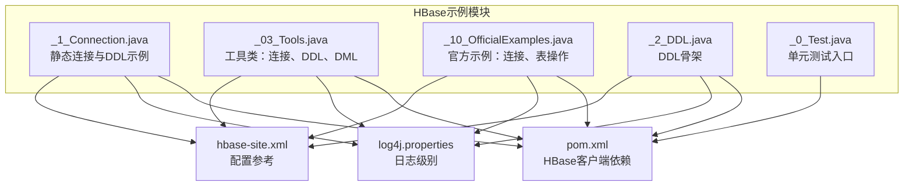
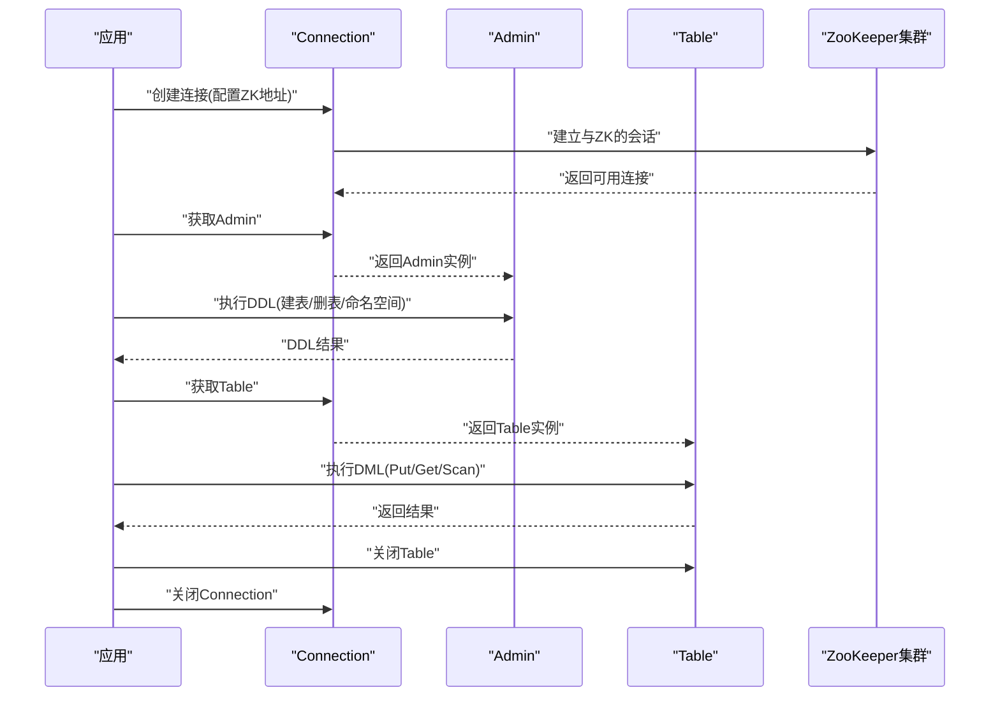
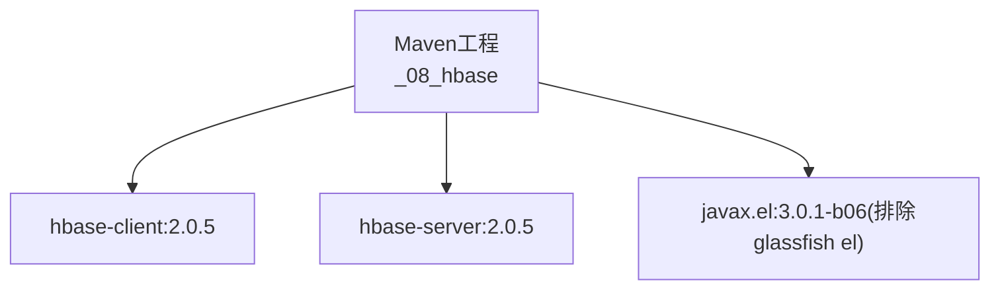

# HBase连接管理

<cite>
**本文引用的文件**
- [_1_Connection.java](file://_08_hbase/src/main/java/_1_Connection.java)
- [_03_Tools.java](file://_08_hbase/src/main/java/_03_Tools.java)
- [_10_OfficialExamples.java](file://_08_hbase/src/main/java/_10_OfficialExamples.java)
- [_0_Test.java](file://_08_hbase/src/main/java/_0_Test.java)
- [_2_DDL.java](file://_08_hbase/src/main/java/_2_DDL.java)
- [pom.xml](file://_08_hbase/pom.xml)
- [log4j.properties](file://_08_hbase/src/main/resources/log4j.properties)
- [hbase-site.xml](file://_200_flinkRealtime/src/main/resources/hbase-site.xml)
</cite>

## 目录
1. [简介](#简介)
2. [项目结构](#项目结构)
3. [核心组件](#核心组件)
4. [架构总览](#架构总览)
5. [详细组件分析](#详细组件分析)
6. [依赖关系分析](#依赖关系分析)
7. [性能考量](#性能考量)
8. [故障排查指南](#故障排查指南)
9. [结论](#结论)
10. [附录](#附录)

## 简介
本技术文档围绕HBase连接管理展开，系统阐述HBase客户端连接的建立、配置与管理机制，覆盖Connection接口使用、连接池配置、超时与重试策略、连接生命周期管理（创建、使用、关闭与资源清理）、Admin与Table对象的获取与管理、关键连接参数（ZooKeeper地址、端口、命名空间等）以及在不同业务场景下的最佳实践。同时提供异常处理与故障恢复策略，并给出性能优化建议（连接池大小、并发控制与资源限制）。

## 项目结构
该仓库中与HBase连接管理直接相关的模块位于“_08_hbase”目录，包含若干演示类与依赖配置：
- 连接与DDL示例：_1_Connection.java、_03_Tools.java、_10_OfficialExamples.java、_2_DDL.java
- 单元测试入口：_0_Test.java
- 依赖与打包：pom.xml
- 日志配置：log4j.properties
- 配置参考：hbase-site.xml（Phoenix相关）

图表来源
- [_1_Connection.java](file://_08_hbase/src/main/java/_1_Connection.java#L1-L82)
- [_03_Tools.java](file://_08_hbase/src/main/java/_03_Tools.java#L1-L125)
- [_10_OfficialExamples.java](file://_08_hbase/src/main/java/_10_OfficialExamples.java#L1-L125)
- [_2_DDL.java](file://_08_hbase/src/main/java/_2_DDL.java#L1-L10)
- [_0_Test.java](file://_08_hbase/src/main/java/_0_Test.java#L1-L44)
- [pom.xml](file://_08_hbase/pom.xml#L1-L45)
- [log4j.properties](file://_08_hbase/src/main/resources/log4j.properties#L1-L23)
- [hbase-site.xml](file://_200_flinkRealtime/src/main/resources/hbase-site.xml#L1-L14)

章节来源
- [pom.xml](file://_08_hbase/pom.xml#L1-L45)

## 核心组件
- 连接工厂与配置
  - 通过Configuration或HBaseConfiguration创建连接配置，设置ZooKeeper地址等关键参数。
  - 使用ConnectionFactory.createConnection(configuration)创建Connection实例。
- Admin与Table对象
  - 通过connection.getAdmin()获取Admin实例，用于DDL（建表、删表、命名空间管理等）。
  - 通过connection.getTable(TableName)获取Table实例，用于DML（Put、Get、Scan等）。
- 生命周期管理
  - Connection是重量级对象，应按应用生命周期复用；Table、Admin、RegionLocator等轻量对象按需创建并及时关闭。
- 工具与示例
  - 提供静态工具方法封装连接获取、DDL/DML操作，便于在不同场景快速使用。

章节来源
- [_1_Connection.java](file://_08_hbase/src/main/java/_1_Connection.java#L1-L82)
- [_03_Tools.java](file://_08_hbase/src/main/java/_03_Tools.java#L1-L125)
- [_10_OfficialExamples.java](file://_08_hbase/src/main/java/_10_OfficialExamples.java#L1-L125)

## 架构总览
HBase客户端架构围绕Connection为中心，Admin与Table作为其子资源被管理。典型调用链如下：

图表来源
- [_10_OfficialExamples.java](file://_08_hbase/src/main/java/_10_OfficialExamples.java#L20-L124)
- [_03_Tools.java](file://_08_hbase/src/main/java/_03_Tools.java#L1-L125)
- [_1_Connection.java](file://_08_hbase/src/main/java/_1_Connection.java#L1-L82)

## 详细组件分析

### 连接建立与配置
- 配置来源
  - 使用Configuration或HBaseConfiguration创建配置对象。
  - 关键参数：hbase.zookeeper.quorum（ZooKeeper主机列表），可扩展至hbase.client.operation.timeout、hbase.client.meta.operation.timeout、hbase.client.retries.number等。
- 连接创建
  - 通过ConnectionFactory.createConnection(configuration)创建Connection。
  - 官方示例强调Connection是重量级对象，应按应用生命周期复用。
- 连接池与线程模型
  - HBase客户端内部维护连接池与线程池，避免频繁创建销毁带来的开销。
  - 并发访问时，建议共享同一Connection，但每个线程独立获取Table实例。

章节来源
- [_10_OfficialExamples.java](file://_08_hbase/src/main/java/_10_OfficialExamples.java#L20-L60)
- [_1_Connection.java](file://_08_hbase/src/main/java/_1_Connection.java#L10-L24)
- [_03_Tools.java](file://_08_hbase/src/main/java/_03_Tools.java#L12-L31)

### Admin与Table对象管理
- Admin
  - 通过connection.getAdmin()获取，用于DDL操作（建表、删表、命名空间管理等）。
  - 使用完毕后应及时关闭，避免资源泄漏。
- Table
  - 通过connection.getTable(TableName)获取，用于DML操作（Put、Get、Scan）。
  - 每次使用后必须关闭，推荐使用try-with-resources确保释放。
- RegionLocator
  - 官方示例指出可通过Connection获取RegionLocator，用于定位Region位置。

章节来源
- [_10_OfficialExamples.java](file://_08_hbase/src/main/java/_10_OfficialExamples.java#L40-L124)
- [_03_Tools.java](file://_08_hbase/src/main/java/_03_Tools.java#L33-L125)
- [_1_Connection.java](file://_08_hbase/src/main/java/_1_Connection.java#L40-L78)

### 连接生命周期管理最佳实践
- 创建
  - 在应用启动阶段创建Connection，注入到全局或单例容器中。
  - 配置ZooKeeper地址、超时与重试参数，确保连接稳定。
- 使用
  - 复用Connection；每个线程/任务独立获取Table实例。
  - 对Admin与Table采用“按需创建、及时关闭”的原则。
- 关闭
  - 先关闭Table，再关闭Admin，最后关闭Connection。
  - 推荐使用try-with-resources或finally保证关闭。
- 资源清理
  - 避免持有过期或失效的连接引用；在应用停止或异常时统一回收。

章节来源
- [_10_OfficialExamples.java](file://_08_hbase/src/main/java/_10_OfficialExamples.java#L40-L124)
- [_03_Tools.java](file://_08_hbase/src/main/java/_03_Tools.java#L33-L125)

### 连接参数与配置项
- ZooKeeper地址
  - hbase.zookeeper.quorum：ZooKeeper主机列表，示例中使用逗号分隔的主机名。
- 超时与重试
  - hbase.client.operation.timeout：单次操作超时时间。
  - hbase.client.meta.operation.timeout：元数据操作超时时间。
  - hbase.client.retries.number：重试次数。
- 命名空间
  - 通过Admin.createNamespace/删除命名空间等API管理命名空间。
- 配置加载顺序
  - HBaseConfiguration.create()会从hbase-site.xml与hbase-default.xml加载默认配置，若CLASSPATH中存在则生效。

章节来源
- [_10_OfficialExamples.java](file://_08_hbase/src/main/java/_10_OfficialExamples.java#L20-L40)
- [_03_Tools.java](file://_08_hbase/src/main/java/_03_Tools.java#L69-L87)
- [hbase-site.xml](file://_200_flinkRealtime/src/main/resources/hbase-site.xml#L1-L14)

### 实际使用场景与示例路径
- 建表与命名空间管理
  - 示例路径：[_03_Tools.java](file://_08_hbase/src/main/java/_03_Tools.java#L47-L67)
  - 示例路径：[_03_Tools.java](file://_08_hbase/src/main/java/_03_Tools.java#L69-L77)
- 删除表与命名空间
  - 示例路径：[_03_Tools.java](file://_08_hbase/src/main/java/_03_Tools.java#L33-L45)
  - 示例路径：[_03_Tools.java](file://_08_hbase/src/main/java/_03_Tools.java#L80-L87)
- 插入与读取数据
  - 示例路径：[_03_Tools.java](file://_08_hbase/src/main/java/_03_Tools.java#L90-L119)
- 官方示例（Put/Get/Scan）
  - 示例路径：[_10_OfficialExamples.java](file://_08_hbase/src/main/java/_10_OfficialExamples.java#L40-L124)
- 测试入口
  - 示例路径：[_0_Test.java](file://_08_hbase/src/main/java/_0_Test.java#L12-L43)

章节来源
- [_03_Tools.java](file://_08_hbase/src/main/java/_03_Tools.java#L33-L125)
- [_10_OfficialExamples.java](file://_08_hbase/src/main/java/_10_OfficialExamples.java#L40-L124)
- [_0_Test.java](file://_08_hbase/src/main/java/_0_Test.java#L12-L43)

### 异常处理与故障恢复
- 常见异常
  - 连接失败：ZooKeeper不可达、网络异常、认证失败。
  - 表不存在：DDL检查表存在性后再操作。
  - 超时：适当增大operation.timeout与retries.number。
- 处理策略
  - 重试：对幂等操作（如Get、Scan）可增加重试次数；对写入操作谨慎重试。
  - 回退：连接失败时记录日志并回退到降级策略（如缓存或离线处理）。
  - 优雅关闭：捕获异常后仍确保Table/Admin/Connection的关闭。
- 日志级别
  - 当前日志配置为ERROR级别，便于生产环境减少噪声。

章节来源
- [_10_OfficialExamples.java](file://_08_hbase/src/main/java/_10_OfficialExamples.java#L40-L124)
- [log4j.properties](file://_08_hbase/src/main/resources/log4j.properties#L1-L23)

## 依赖关系分析
HBase客户端依赖主要由Maven引入，包含hbase-client与hbase-server，版本为2.0.5。

图表来源
- [pom.xml](file://_08_hbase/pom.xml#L19-L41)

章节来源
- [pom.xml](file://_08_hbase/pom.xml#L19-L41)

## 性能考量
- 连接池大小与并发
  - 复用Connection，避免每线程/每任务重复创建连接。
  - 控制并发访问Table的数量，避免过度竞争导致阻塞。
- 超时与重试
  - 合理设置operation.timeout与meta.operation.timeout，避免长尾延迟拖累整体吞吐。
  - 重试次数不宜过高，防止放大请求风暴。
- 资源限制
  - 及时关闭Table/Admin，防止连接泄露。
  - 控制批量写入（Put列表）大小，平衡吞吐与内存占用。
- 线程模型
  - 客户端内部线程池负责RPC调度，应用层避免阻塞I/O操作。

[本节为通用性能建议，不直接分析具体文件]

## 故障排查指南
- 连接失败
  - 检查hbase.zookeeper.quorum是否正确且可达。
  - 确认ZooKeeper服务状态与防火墙策略。
- 表操作异常
  - 使用Admin.tableExists()进行前置校验，避免重复建表或误删。
  - 对禁用/删除表流程，先disable再delete。
- 资源未关闭
  - 使用try-with-resources或finally确保关闭Table/Admin/Connection。
- 日志定位
  - 生产环境建议提升日志级别以便快速定位问题。

章节来源
- [_1_Connection.java](file://_08_hbase/src/main/java/_1_Connection.java#L33-L78)
- [_03_Tools.java](file://_08_hbase/src/main/java/_03_Tools.java#L33-L67)
- [_10_OfficialExamples.java](file://_08_hbase/src/main/java/_10_OfficialExamples.java#L40-L124)
- [log4j.properties](file://_08_hbase/src/main/resources/log4j.properties#L1-L23)

## 结论
HBase连接管理的关键在于：以Connection为中心进行生命周期管理，Admin与Table按需创建并及时关闭；通过合理配置ZooKeeper地址、超时与重试参数保障稳定性；在不同业务场景下遵循“连接复用、资源及时回收”的原则。结合官方示例与工具类封装，可在保证性能的同时提升开发效率与可维护性。

[本节为总结性内容，不直接分析具体文件]

## 附录
- 代码示例路径（仅列出路径，不展示具体代码）
  - 建表与命名空间管理：[_03_Tools.java](file://_08_hbase/src/main/java/_03_Tools.java#L47-L77)
  - 删除表与命名空间：[_03_Tools.java](file://_08_hbase/src/main/java/_03_Tools.java#L33-L45), [_03_Tools.java](file://_08_hbase/src/main/java/_03_Tools.java#L80-L87)
  - 插入与读取数据：[_03_Tools.java](file://_08_hbase/src/main/java/_03_Tools.java#L90-L119)
  - 官方示例（Put/Get/Scan）：[_10_OfficialExamples.java](file://_08_hbase/src/main/java/_10_OfficialExamples.java#L40-L124)
  - 测试入口：[_0_Test.java](file://_08_hbase/src/main/java/_0_Test.java#L12-L43)

[本节为附录性内容，不直接分析具体文件]