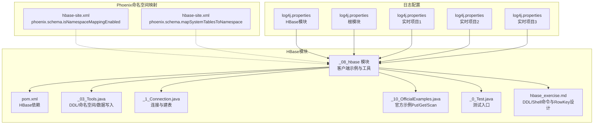
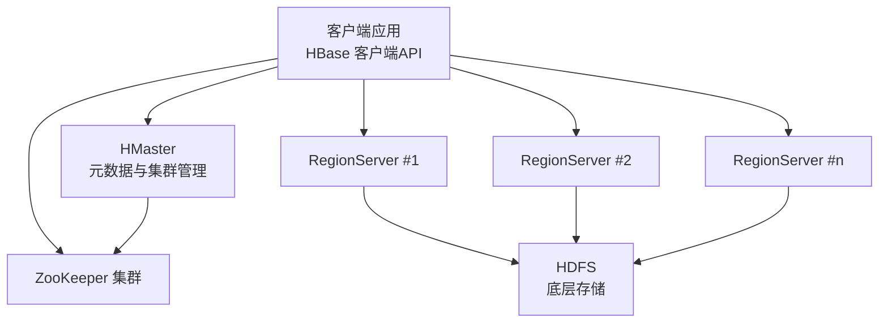
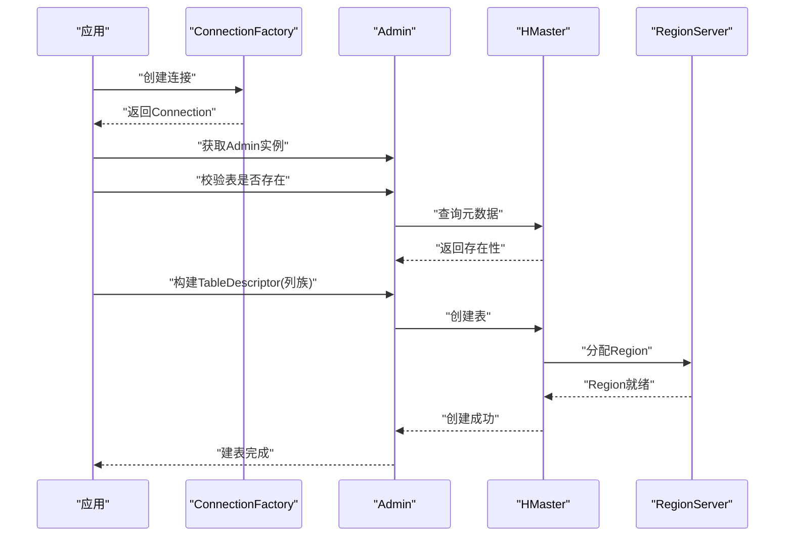
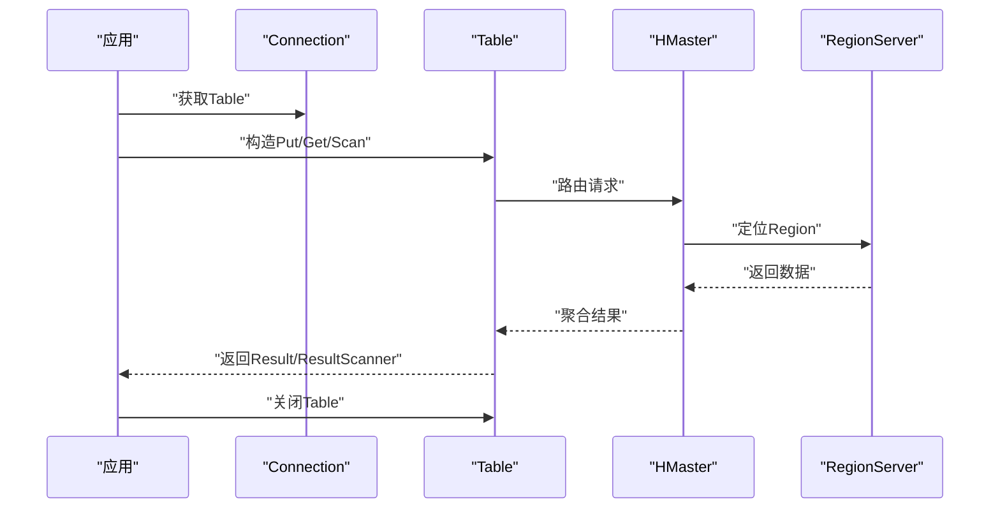
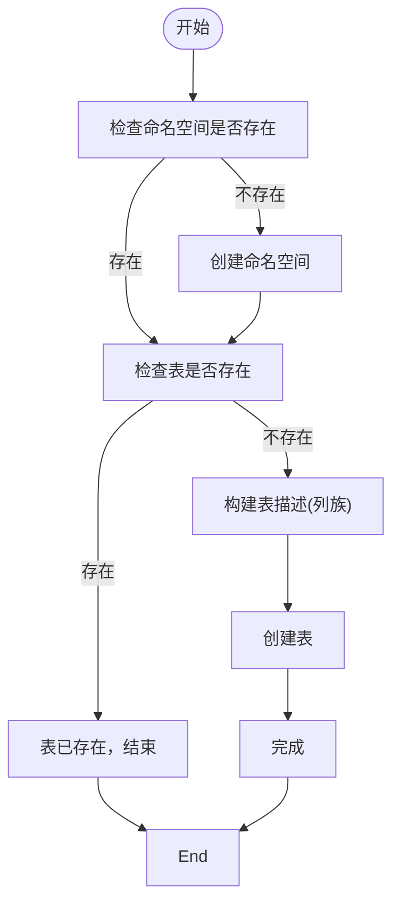
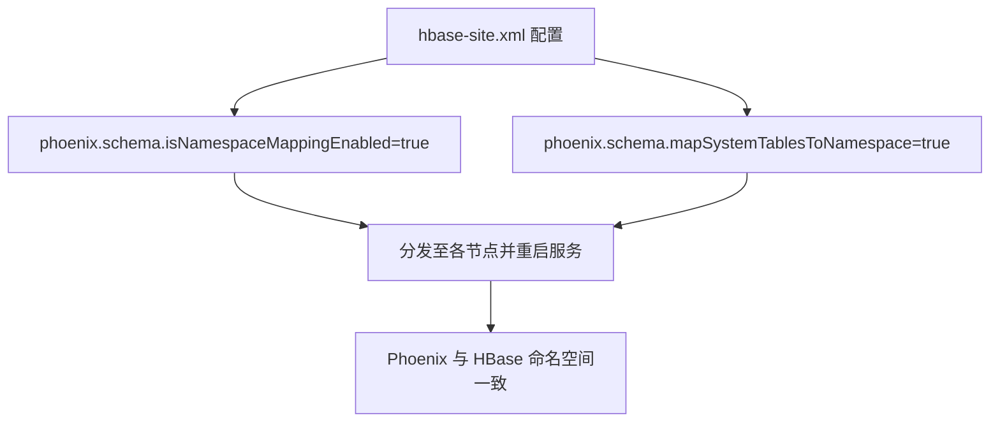
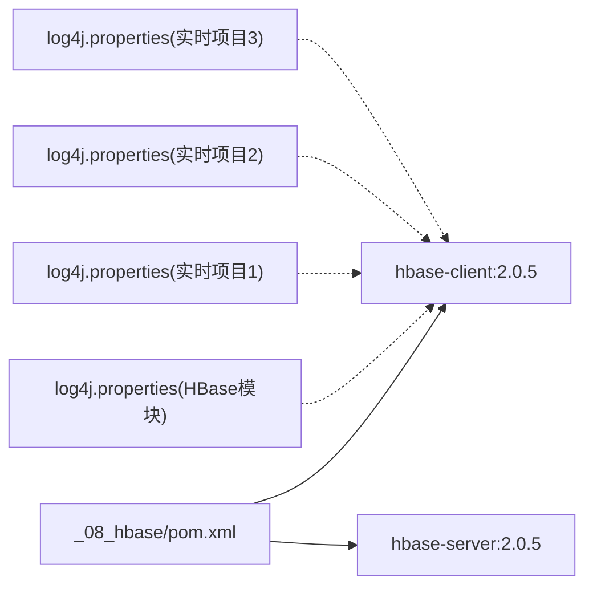

# HBase集群管理

<cite>
**本文引用的文件**   
- [_08_hbase/pom.xml](file://_08_hbase/pom.xml)
- [_08_hbase/src/main/java/_1_Connection.java](file://_08_hbase/src/main/java/_1_Connection.java)
- [_08_hbase/src/main/java/_03_Tools.java](file://_08_hbase/src/main/java/_03_Tools.java)
- [_08_hbase/src/main/java/_10_OfficialExamples.java](file://_08_hbase/src/main/java/_10_OfficialExamples.java)
- [_08_hbase/src/main/java/_0_Test.java](file://_08_hbase/src/main/java/_0_Test.java)
- [_08_hbase/hbase_exercise.md](file://_08_hbase/hbase_exercise.md)
- [_200_flinkRealtime/src/main/resources/hbase-site.xml](file://_200_flinkRealtime/src/main/resources/hbase-site.xml)
- [_200_flinkRealtime0106/src/main/resources/hbase-site.xml](file://_200_flinkRealtime0106/src/main/resources/hbase-site.xml)
- [_300_eduRealtime/src/main/resources/hbase-site.xml](file://_300_eduRealtime/src/main/resources/hbase-site.xml)
- [_02_hadoop/HDFSClient/src/main/resources/log4j.properties](file://_02_hadoop/HDFSClient/src/main/resources/log4j.properties)
- [_08_hbase/src/main/resources/log4j.properties](file://_08_hbase/src/main/resources/log4j.properties)
- [_200_flinkRealtime/src/main/resources/log4j.properties](file://_200_flinkRealtime/src/main/resources/log4j.properties)
- [_200_flinkRealtime0106/src/main/resources/log4j.properties](file://_200_flinkRealtime0106/src/main/resources/log4j.properties)
- [_300_eduRealtime/src/main/resources/log4j.properties](file://_300_eduRealtime/src/main/resources/log4j.properties)
</cite>

## 目录
1. [简介](#简介)
2. [项目结构](#项目结构)
3. [核心组件](#核心组件)
4. [架构总览](#架构总览)
5. [详细组件分析](#详细组件分析)
6. [依赖关系分析](#依赖关系分析)
7. [性能考量](#性能考量)
8. [故障排查指南](#故障排查指南)
9. [结论](#结论)
10. [附录](#附录)

## 简介
本技术文档围绕HBase集群管理展开，结合仓库中的HBase客户端示例、命名空间与表管理练习、Phoenix命名空间映射配置以及日志配置，系统梳理HBase部署架构、角色分工（HMaster与RegionServer）、配置参数、监控与维护、扩容缩容、日志与故障排查、备份恢复以及升级迁移注意事项。文档力求以循序渐进的方式呈现，既适合初学者快速上手，也为运维与开发人员提供深入参考。

## 项目结构
该仓库包含独立的HBase模块与多个实时项目资源，其中与HBase直接相关的内容集中在以下位置：
- HBase客户端示例与工具：_08_hbase 模块
- Phoenix命名空间映射配置：_200_flinkRealtime、_200_flinkRealtime0106、_300_eduRealtime 的 hbase-site.xml
- 日志配置：各模块的 log4j.properties

**图表来源**
- [_08_hbase/pom.xml](file://_08_hbase/pom.xml#L1-L45)
- [_08_hbase/src/main/java/_03_Tools.java](file://_08_hbase/src/main/java/_03_Tools.java#L1-L125)
- [_08_hbase/src/main/java/_1_Connection.java](file://_08_hbase/src/main/java/_1_Connection.java#L1-L82)
- [_08_hbase/src/main/java/_10_OfficialExamples.java](file://_08_hbase/src/main/java/_10_OfficialExamples.java#L1-L125)
- [_08_hbase/src/main/java/_0_Test.java](file://_08_hbase/src/main/java/_0_Test.java#L1-L43)
- [_08_hbase/hbase_exercise.md](file://_08_hbase/hbase_exercise.md#L1-L308)
- [_200_flinkRealtime/src/main/resources/hbase-site.xml](file://_200_flinkRealtime/src/main/resources/hbase-site.xml#L1-L14)
- [_200_flinkRealtime0106/src/main/resources/hbase-site.xml](file://_200_flinkRealtime0106/src/main/resources/hbase-site.xml#L1-L13)
- [_300_eduRealtime/src/main/resources/hbase-site.xml](file://_300_eduRealtime/src/main/resources/hbase-site.xml#L1-L13)
- [_02_hadoop/HDFSClient/src/main/resources/log4j.properties](file://_02_hadoop/HDFSClient/src/main/resources/log4j.properties#L1-L200)
- [_08_hbase/src/main/resources/log4j.properties](file://_08_hbase/src/main/resources/log4j.properties#L1-L200)
- [_200_flinkRealtime/src/main/resources/log4j.properties](file://_200_flinkRealtime/src/main/resources/log4j.properties#L1-L200)
- [_200_flinkRealtime0106/src/main/resources/log4j.properties](file://_200_flinkRealtime0106/src/main/resources/log4j.properties#L1-L200)
- [_300_eduRealtime/src/main/resources/log4j.properties](file://_300_eduRealtime/src/main/resources/log4j.properties#L1-L200)

**章节来源**
- [_08_hbase/pom.xml](file://_08_hbase/pom.xml#L1-L45)
- [_08_hbase/hbase_exercise.md](file://_08_hbase/hbase_exercise.md#L1-L308)

## 核心组件
- HBase客户端依赖与版本
  - 采用 HBase 客户端与服务器依赖，版本为 2.0.5，用于连接与管理集群。
- 连接与建表工具
  - 提供 ZooKeeper 地址配置与连接建立，封装建表、删表、命名空间管理、数据写入与读取等常用操作。
- 官方示例
  - 展示 Put/Get/Scan 的标准流程，强调连接复用与资源关闭的重要性。
- Phoenix 命名空间映射
  - 通过 hbase-site.xml 启用 Phoenix 与 HBase 命名空间映射，便于统一管理。
- 日志配置
  - 多模块共享 log4j.properties，便于集中化日志采集与问题定位。

**章节来源**
- [_08_hbase/pom.xml](file://_08_hbase/pom.xml#L1-L45)
- [_08_hbase/src/main/java/_1_Connection.java](file://_08_hbase/src/main/java/_1_Connection.java#L1-L82)
- [_08_hbase/src/main/java/_03_Tools.java](file://_08_hbase/src/main/java/_03_Tools.java#L1-L125)
- [_08_hbase/src/main/java/_10_OfficialExamples.java](file://_08_hbase/src/main/java/_10_OfficialExamples.java#L1-L125)
- [_200_flinkRealtime/src/main/resources/hbase-site.xml](file://_200_flinkRealtime/src/main/resources/hbase-site.xml#L1-L14)
- [_200_flinkRealtime0106/src/main/resources/hbase-site.xml](file://_200_flinkRealtime0106/src/main/resources/hbase-site.xml#L1-L13)
- [_300_eduRealtime/src/main/resources/hbase-site.xml](file://_300_eduRealtime/src/main/resources/hbase-site.xml#L1-L13)
- [_02_hadoop/HDFSClient/src/main/resources/log4j.properties](file://_02_hadoop/HDFSClient/src/main/resources/log4j.properties#L1-L200)
- [_08_hbase/src/main/resources/log4j.properties](file://_08_hbase/src/main/resources/log4j.properties#L1-L200)
- [_200_flinkRealtime/src/main/resources/log4j.properties](file://_200_flinkRealtime/src/main/resources/log4j.properties#L1-L200)
- [_200_flinkRealtime0106/src/main/resources/log4j.properties](file://_200_flinkRealtime0106/src/main/resources/log4j.properties#L1-L200)
- [_300_eduRealtime/src/main/resources/log4j.properties](file://_300_eduRealtime/src/main/resources/log4j.properties#L1-L200)

## 架构总览
HBase 集群由 HMaster 与多个 RegionServer 组成，ZooKeeper 负责协调与元数据管理。客户端通过 HBase 客户端 API 连接集群，执行 DDL/DML 操作；Phoenix 可选地启用命名空间映射以统一命名空间模型。

[此图为概念性架构图，不直接映射具体源文件，故无“图表来源”标注]

## 详细组件分析

### HBase 客户端连接与建表
- 连接建立
  - 通过配置 ZooKeeper 地址建立连接，支持复用连接以降低开销。
- 建表流程
  - 支持命名空间与表名组合，按列族构建表描述，最终创建表。
- 关闭与异常处理
  - 强调 Admin/Table/Scanner 等轻量级对象需及时关闭，避免资源泄漏。

**图表来源**
- [_08_hbase/src/main/java/_1_Connection.java](file://_08_hbase/src/main/java/_1_Connection.java#L1-L82)
- [_08_hbase/src/main/java/_03_Tools.java](file://_08_hbase/src/main/java/_03_Tools.java#L1-L125)

**章节来源**
- [_08_hbase/src/main/java/_1_Connection.java](file://_08_hbase/src/main/java/_1_Connection.java#L1-L82)
- [_08_hbase/src/main/java/_03_Tools.java](file://_08_hbase/src/main/java/_03_Tools.java#L1-L125)

### 数据写入与读取（Put/Get/Scan）
- 写入流程
  - 构造 Put 并添加列族与列限定符及值，提交到表。
- 读取流程
  - Get 用于单行读取，Scan 用于范围扫描，结果迭代输出。
- 资源管理
  - 明确 Scanner 与 Table 的关闭时机，避免资源泄露。

**图表来源**
- [_08_hbase/src/main/java/_10_OfficialExamples.java](file://_08_hbase/src/main/java/_10_OfficialExamples.java#L1-L125)

**章节来源**
- [_08_hbase/src/main/java/_10_OfficialExamples.java](file://_08_hbase/src/main/java/_10_OfficialExamples.java#L1-L125)

### 命名空间与表管理
- 命名空间
  - 支持创建、删除与描述命名空间；表名可带命名空间前缀。
- 表管理
  - 支持建表、禁用/启用、删除、查看表详情、查看 Regions 等。
- RowKey 设计
  - 结合业务场景设计 RowKey，支持预分区与时间维度组织，提升扫描效率。

**图表来源**
- [_08_hbase/src/main/java/_03_Tools.java](file://_08_hbase/src/main/java/_03_Tools.java#L1-L125)
- [_08_hbase/hbase_exercise.md](file://_08_hbase/hbase_exercise.md#L1-L200)

**章节来源**
- [_08_hbase/src/main/java/_03_Tools.java](file://_08_hbase/src/main/java/_03_Tools.java#L1-L125)
- [_08_hbase/hbase_exercise.md](file://_08_hbase/hbase_exercise.md#L1-L200)

### Phoenix 命名空间映射配置
- 配置项
  - 开启 Phoenix Schema 与 HBase 命名空间映射，以及系统表映射到命名空间。
- 生效方式
  - 在 hbase-site.xml 中配置，并在集群各节点同步生效。

**图表来源**
- [_200_flinkRealtime/src/main/resources/hbase-site.xml](file://_200_flinkRealtime/src/main/resources/hbase-site.xml#L1-L14)
- [_200_flinkRealtime0106/src/main/resources/hbase-site.xml](file://_200_flinkRealtime0106/src/main/resources/hbase-site.xml#L1-L13)
- [_300_eduRealtime/src/main/resources/hbase-site.xml](file://_300_eduRealtime/src/main/resources/hbase-site.xml#L1-L13)

**章节来源**
- [_200_flinkRealtime/src/main/resources/hbase-site.xml](file://_200_flinkRealtime/src/main/resources/hbase-site.xml#L1-L14)
- [_200_flinkRealtime0106/src/main/resources/hbase-site.xml](file://_200_flinkRealtime0106/src/main/resources/hbase-site.xml#L1-L13)
- [_300_eduRealtime/src/main/resources/hbase-site.xml](file://_300_eduRealtime/src/main/resources/hbase-site.xml#L1-L13)

## 依赖关系分析
- HBase 客户端依赖
  - 采用 HBase 客户端与服务器依赖，版本为 2.0.5，确保与 HDFS/ZooKeeper 协同工作。
- 模块耦合
  - HBase 模块与各实时项目共享日志配置，便于统一日志采集与问题定位。

**图表来源**
- [_08_hbase/pom.xml](file://_08_hbase/pom.xml#L1-L45)
- [_08_hbase/src/main/resources/log4j.properties](file://_08_hbase/src/main/resources/log4j.properties#L1-L200)
- [_200_flinkRealtime/src/main/resources/log4j.properties](file://_200_flinkRealtime/src/main/resources/log4j.properties#L1-L200)
- [_200_flinkRealtime0106/src/main/resources/log4j.properties](file://_200_flinkRealtime0106/src/main/resources/log4j.properties#L1-L200)
- [_300_eduRealtime/src/main/resources/log4j.properties](file://_300_eduRealtime/src/main/resources/log4j.properties#L1-L200)

**章节来源**
- [_08_hbase/pom.xml](file://_08_hbase/pom.xml#L1-L45)

## 性能考量
- 连接与资源管理
  - 连接是重量级对象，应复用；Table/Admin/Scanner 是轻量级对象，按需创建并及时关闭。
- RowKey 设计
  - 结合业务访问模式设计 RowKey，避免热点与冷热不均；必要时采用预分区策略。
- 版本与压缩
  - 合理设置列族版本数与压缩算法，平衡存储与查询性能。
- 磁盘与网络
  - 保证磁盘 IO 与网络带宽满足高并发读写需求；合理规划 HDFS 副本与网络拓扑。

[本节为通用性能指导，无需“章节来源”]

## 故障排查指南
- 常见问题定位
  - 通过统一的日志配置收集 HBase 客户端与各实时项目的日志，定位连接失败、权限不足、表不存在等问题。
- 连接与权限
  - 确认 ZooKeeper 地址正确、网络连通；检查 HBase 与 Phoenix 的命名空间映射配置是否一致。
- 表状态与数据
  - 使用禁用/启用、描述、查看 Regions 等命令确认表状态；通过 Get/Scan 验证数据读写。
- 资源清理
  - 确保 Scanner/Table/Admin 正确关闭，避免连接池耗尽或 RegionServer 资源占用。

**章节来源**
- [_08_hbase/src/main/java/_10_OfficialExamples.java](file://_08_hbase/src/main/java/_10_OfficialExamples.java#L1-L125)
- [_08_hbase/src/main/java/_03_Tools.java](file://_08_hbase/src/main/java/_03_Tools.java#L1-L125)
- [_08_hbase/hbase_exercise.md](file://_08_hbase/hbase_exercise.md#L1-L200)
- [_08_hbase/src/main/resources/log4j.properties](file://_08_hbase/src/main/resources/log4j.properties#L1-L200)
- [_200_flinkRealtime/src/main/resources/log4j.properties](file://_200_flinkRealtime/src/main/resources/log4j.properties#L1-L200)
- [_200_flinkRealtime0106/src/main/resources/log4j.properties](file://_200_flinkRealtime0106/src/main/resources/log4j.properties#L1-L200)
- [_300_eduRealtime/src/main/resources/log4j.properties](file://_300_eduRealtime/src/main/resources/log4j.properties#L1-L200)

## 结论
本仓库提供了 HBase 客户端连接、DDL/DML 操作、命名空间与表管理的基础能力，以及 Phoenix 命名空间映射配置与日志配置示例。结合这些材料，可以搭建起一套可运行的 HBase 集群管理实践框架。后续可在生产环境中进一步完善监控、备份恢复与升级迁移策略，并持续优化 RowKey 设计与资源配置。

[本节为总结性内容，无需“章节来源”]

## 附录

### HBase 配置参数与调优要点（基于仓库可见信息）
- 客户端连接
  - ZooKeeper 地址：用于建立与集群的连接。
- Phoenix 命名空间映射
  - 开启命名空间映射与系统表映射，确保与 HBase 命名空间一致。
- 日志级别
  - 通过 log4j.properties 统一设置日志级别与输出，便于问题定位。

**章节来源**
- [_08_hbase/src/main/java/_1_Connection.java](file://_08_hbase/src/main/java/_1_Connection.java#L1-L82)
- [_200_flinkRealtime/src/main/resources/hbase-site.xml](file://_200_flinkRealtime/src/main/resources/hbase-site.xml#L1-L14)
- [_08_hbase/src/main/resources/log4j.properties](file://_08_hbase/src/main/resources/log4j.properties#L1-L200)

### 集群监控与维护最佳实践（概念性建议）
- 健康检查
  - 定期检查 HMaster/RegionServer 状态、ZooKeeper 连接、表可用性与 Regions 分布。
- 性能指标
  - 关注读写延迟、QPS、Region 数量与大小、HDFS 使用率、GC 时间与频率。
- 故障诊断
  - 结合日志与指标进行根因分析，优先处理连接失败、热点 Region、磁盘与网络瓶颈。

[本节为通用指导，无需“章节来源”]

### 扩容与缩容（概念性建议）
- 扩容
  - 新增 RegionServer 节点，触发负载均衡与 Region 重分配；监控 Regions 迁移进度与集群整体延迟。
- 缩容
  - 先迁移 Region 至其他节点，再下线 RegionServer；确保无 Region 仍在目标节点上。

[本节为通用指导，无需“章节来源”]

### 备份与恢复（概念性建议）
- 备份策略
  - 基于快照与导出工具定期备份关键表；验证备份完整性与恢复路径。
- 恢复流程
  - 在隔离环境验证恢复；逐步回切并监控一致性与性能。

[本节为通用指导，无需“章节来源”]

### 升级与迁移（概念性建议）
- 升级
  - 制定灰度升级计划，先升级 HBase 客户端与 Phoenix（如启用映射），再升级集群组件。
- 迁移
  - 规划停机窗口，导出旧集群数据，导入新集群并验证一致性。

[本节为通用指导，无需“章节来源”]