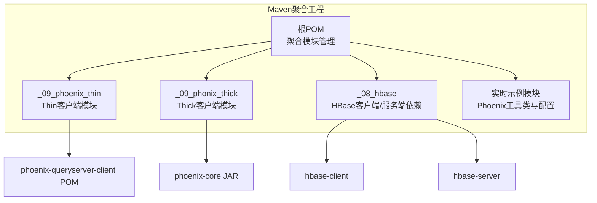
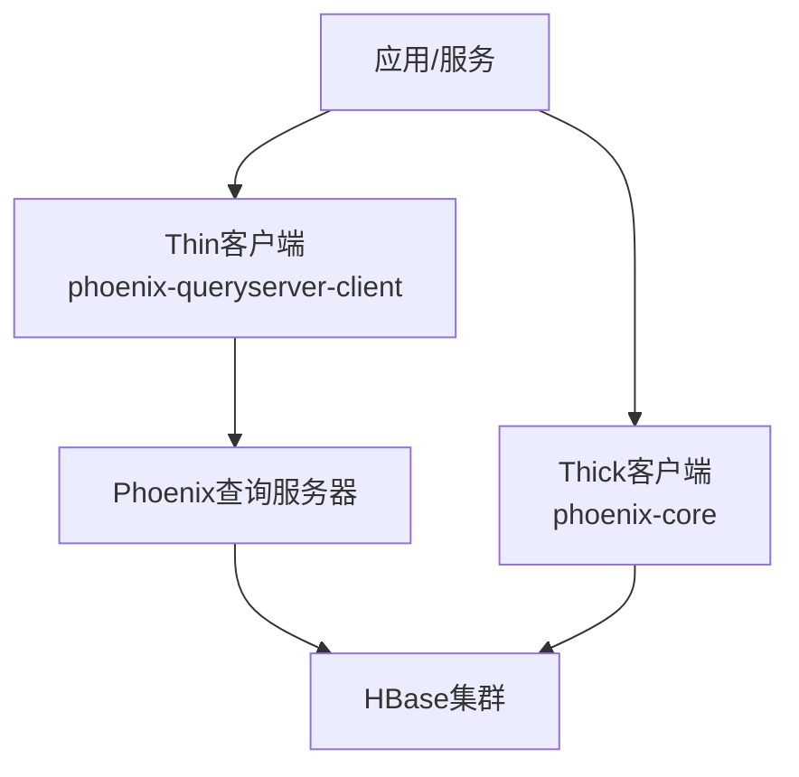
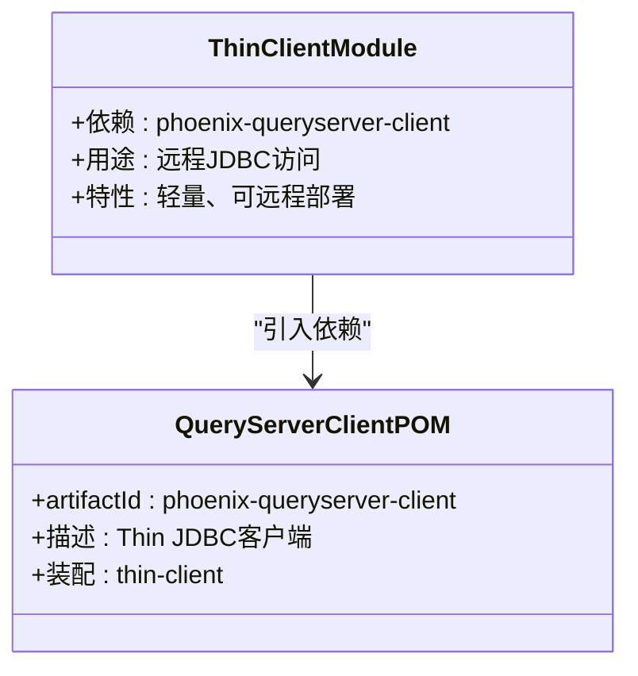
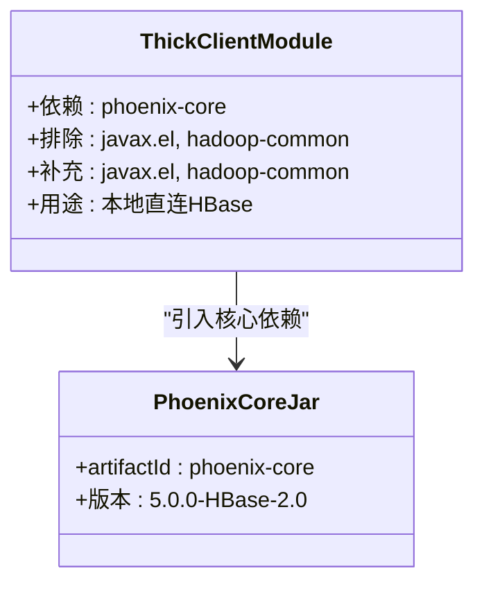
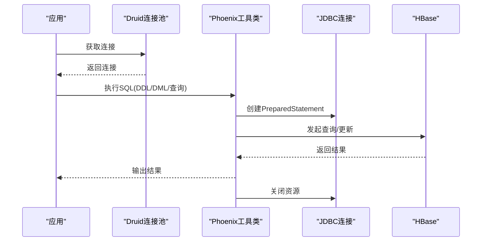
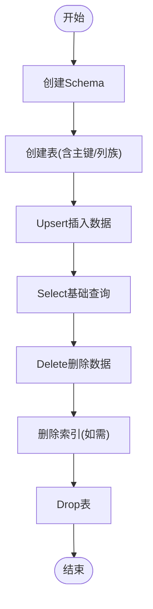
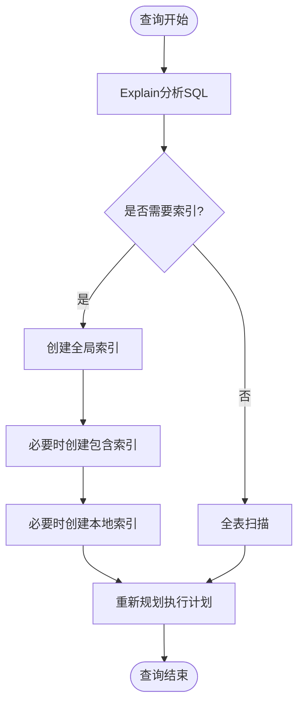
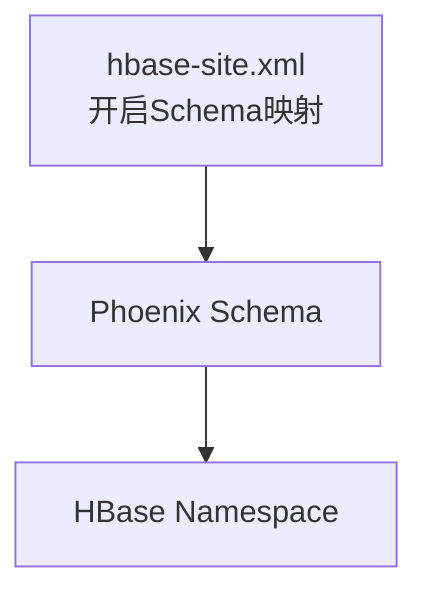
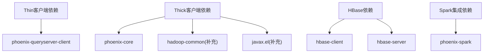

# Phoenix SQL查询引擎

<cite>
**本文引用的文件**
- [pom.xml](file://pom.xml)
- [_09_phoenix_thin/pom.xml](file://_09_phoenix_thin/pom.xml)
- [_09_phonix_thick/pom.xml](file://_09_phonix_thick/pom.xml)
- [org/apache/phoenix/phoenix-queryserver-client/5.0.0-HBase-2.0/phoenix-queryserver-client-5.0.0-HBase-2.0.pom](file://org/apache/phoenix/phoenix-queryserver-client/5.0.0-HBase-2.0/phoenix-queryserver-client-5.0.0-HBase-2.0.pom)
- [org/apache/phoenix/phoenix-core/5.0.0-HBase-2.0/phoenix-core-5.0.0-HBase-2.0.jar](file://org/apache/phoenix/phoenix-core/5.0.0-HBase-2.0/phoenix-core-5.0.0-HBase-2.0.jar)
- [org/apache/phoenix/phoenix-spark/5.0.0-HBase-2.0/phoenix-spark-5.0.0-HBase-2.0.pom](file://org/apache/phoenix/phoenix-spark/5.0.0-HBase-2.0/phoenix-spark-5.0.0-HBase-2.0.pom)
- [_08_hbase/pom.xml](file://_08_hbase/pom.xml)
- [_08_hbase/hbase_exercise.md](file://_08_hbase/hbase_exercise.md)
- [_200_flinkRealtime/src/main/resources/hbase-site.xml](file://_200_flinkRealtime/src/main/resources/hbase-site.xml)
- [_200_flinkRealtime0106/src/main/resources/hbase-site.xml](file://_200_flinkRealtime0106/src/main/resources/hbase-site.xml)
- [_200_flinkRealtime/src/main/java/com/atguigu/gmall/realtime/util/PhoenixUtil.java](file://_200_flinkRealtime/src/main/java/com/atguigu/gmall/realtime/util/PhoenixUtil.java)
- [_200_flinkRealtime/src/main/java/com/atguigu/gmall/realtime/util/DruidDSUtil.java](file://_200_flinkRealtime/src/main/java/com/atguigu/gmall/realtime/util/DruidDSUtil.java)
- [_200_flinkRealtime/src/main/java/com/atguigu/gmall/realtime/util/PhoenixUtil_m.java](file://_200_flinkRealtime/src/main/java/com/atguigu/gmall/realtime/util/PhoenixUtil_m.java)
- [_200_flinkRealtime/src/main/java/com/atguigu/gmall/realtime/util/DruidDSUtil_m.java](file://_200_flinkRealtime/src/main/java/com/atguigu/gmall/realtime/util/DruidDSUtil_m.java)
- [_300_eduRealtime/src/main/java/com/atguigu/gmall/realtime/util/MyPhoenixUtil.java](file://_300_eduRealtime/src/main/java/com/atguigu/gmall/realtime/util/MyPhoenixUtil.java)
- [_200_flinkRealtime/src/main/java/com/atguigu/gmall/realtime/util/DimUtil_m_0715.java](file://_200_flinkRealtime/src/main/java/com/atguigu/gmall/realtime/util/DimUtil_m_0715.java)
</cite>

## 目录
1. [简介](#简介)
2. [项目结构](#项目结构)
3. [核心组件](#核心组件)
4. [架构总览](#架构总览)
5. [详细组件分析](#详细组件分析)
6. [依赖分析](#依赖分析)
7. [性能考量](#性能考量)
8. [故障排查指南](#故障排查指南)
9. [结论](#结论)
10. [附录](#附录)

## 简介
本技术文档围绕Phoenix SQL查询引擎展开，系统阐述其在Hadoop生态中的定位与价值：以标准SQL接口访问HBase数据，提供Thick Client与Thin Client两种连接方式，并结合仓库中现有的依赖与示例，给出SQL语法支持要点、索引机制、查询优化与执行计划分析、连接配置与使用示例、性能优化策略、与HBase的集成模式及最佳实践，以及常见问题排查方法。

## 项目结构
该仓库包含Phoenix Thin与Thick客户端模块，以及HBase相关依赖与Phoenix使用示例。Phoenix Thin通过查询服务器客户端进行远程访问；Thick客户端直接引入Phoenix核心依赖，适合嵌入式或服务端直连场景。HBase模块提供HBase客户端与服务端依赖，配合Phoenix实现统一SQL访问。

图表来源
- [pom.xml](file://pom.xml#L14-L50)
- [_09_phoenix_thin/pom.xml](file://_09_phoenix_thin/pom.xml#L18-L26)
- [_09_phonix_thick/pom.xml](file://_09_phonix_thick/pom.xml#L19-L48)
- [_08_hbase/pom.xml](file://_08_hbase/pom.xml#L19-L41)
- [org/apache/phoenix/phoenix-queryserver-client/5.0.0-HBase-2.0/phoenix-queryserver-client-5.0.0-HBase-2.0.pom](file://org/apache/phoenix/phoenix-queryserver-client/5.0.0-HBase-2.0/phoenix-queryserver-client-5.0.0-HBase-2.0.pom#L23-L38)
- [org/apache/phoenix/phoenix-core/5.0.0-HBase-2.0/phoenix-core-5.0.0-HBase-2.0.jar](file://org/apache/phoenix/phoenix-core/5.0.0-HBase-2.0/phoenix-core-5.0.0-HBase-2.0.jar)

章节来源
- [pom.xml](file://pom.xml#L14-L50)

## 核心组件
- Thin客户端模块：引入phoenix-queryserver-client，用于通过查询服务器进行JDBC访问，适合分布式或跨进程场景。
- Thick客户端模块：引入phoenix-core，适合服务端直连HBase，具备更丰富的本地执行能力。
- HBase模块：提供HBase客户端与服务端依赖，支撑Phoenix对HBase的底层访问。
- 实时示例模块：包含Phoenix工具类与Druid连接池配置，演示JDBC访问HBase数据的典型用法。

章节来源
- [_09_phoenix_thin/pom.xml](file://_09_phoenix_thin/pom.xml#L18-L26)
- [_09_phonix_thick/pom.xml](file://_09_phonix_thick/pom.xml#L19-L48)
- [_08_hbase/pom.xml](file://_08_hbase/pom.xml#L19-L41)
- [_200_flinkRealtime/src/main/java/com/atguigu/gmall/realtime/util/PhoenixUtil.java](file://_200_flinkRealtime/src/main/java/com/atguigu/gmall/realtime/util/PhoenixUtil.java#L1-L49)
- [_200_flinkRealtime/src/main/java/com/atguigu/gmall/realtime/util/DruidDSUtil.java](file://_200_flinkRealtime/src/main/java/com/atguigu/gmall/realtime/util/DruidDSUtil.java#L1-L30)

## 架构总览
Phoenix在Hadoop生态中的角色是“SQL层”，向上提供标准SQL接口，向下与HBase交互。Thin客户端通过查询服务器进行远程访问，Thick客户端直接与HBase通信。仓库中提供了Thin与Thick两种接入路径，以及HBase依赖与Phoenix使用示例。

图表来源
- [_09_phoenix_thin/pom.xml](file://_09_phoenix_thin/pom.xml#L18-L26)
- [_09_phonix_thick/pom.xml](file://_09_phonix_thick/pom.xml#L19-L48)
- [org/apache/phoenix/phoenix-queryserver-client/5.0.0-HBase-2.0/phoenix-queryserver-client-5.0.0-HBase-2.0.pom](file://org/apache/phoenix/phoenix-queryserver-client/5.0.0-HBase-2.0/phoenix-queryserver-client-5.0.0-HBase-2.0.pom#L23-L38)

## 详细组件分析

### Thin客户端组件分析
Thin客户端通过phoenix-queryserver-client提供轻量级JDBC访问，适合跨进程或远程调用场景。其POM中明确声明为“Thin JDBC客户端”，并包含打包为Thin Client的装配配置。

图表来源
- [_09_phoenix_thin/pom.xml](file://_09_phoenix_thin/pom.xml#L18-L26)
- [org/apache/phoenix/phoenix-queryserver-client/5.0.0-HBase-2.0/phoenix-queryserver-client-5.0.0-HBase-2.0.pom](file://org/apache/phoenix/phoenix-queryserver-client/5.0.0-HBase-2.0/phoenix-queryserver-client-5.0.0-HBase-2.0.pom#L23-L38)

章节来源
- [_09_phoenix_thin/pom.xml](file://_09_phoenix_thin/pom.xml#L18-L26)
- [org/apache/phoenix/phoenix-queryserver-client/5.0.0-HBase-2.0/phoenix-queryserver-client-5.0.0-HBase-2.0.pom](file://org/apache/phoenix/phoenix-queryserver-client/5.0.0-HBase-2.0/phoenix-queryserver-client-5.0.0-HBase-2.0.pom#L23-L38)

### Thick客户端组件分析
Thick客户端通过phoenix-core直接与HBase交互，适合服务端直连场景。其POM中包含对javax.el与hadoop-common的显式排除与补充，确保运行环境兼容性。

图表来源
- [_09_phonix_thick/pom.xml](file://_09_phonix_thick/pom.xml#L19-L48)
- [org/apache/phoenix/phoenix-core/5.0.0-HBase-2.0/phoenix-core-5.0.0-HBase-2.0.jar](file://org/apache/phoenix/phoenix-core/5.0.0-HBase-2.0/phoenix-core-5.0.0-HBase-2.0.jar)

章节来源
- [_09_phonix_thick/pom.xml](file://_09_phonix_thick/pom.xml#L19-L48)
- [org/apache/phoenix/phoenix-core/5.0.0-HBase-2.0/phoenix-core-5.0.0-HBase-2.0.jar](file://org/apache/phoenix/phoenix-core/5.0.0-HBase-2.0/phoenix-core-5.0.0-HBase-2.0.jar)

### HBase集成与Phoenix使用示例
HBase模块提供客户端与服务端依赖，结合Phoenix工具类与Druid连接池，演示通过JDBC访问HBase数据的典型流程。

图表来源
- [_200_flinkRealtime/src/main/java/com/atguigu/gmall/realtime/util/PhoenixUtil.java](file://_200_flinkRealtime/src/main/java/com/atguigu/gmall/realtime/util/PhoenixUtil.java#L1-L49)
- [_200_flinkRealtime/src/main/java/com/atguigu/gmall/realtime/util/DruidDSUtil.java](file://_200_flinkRealtime/src/main/java/com/atguigu/gmall/realtime/util/DruidDSUtil.java#L1-L30)

章节来源
- [_200_flinkRealtime/src/main/java/com/atguigu/gmall/realtime/util/PhoenixUtil.java](file://_200_flinkRealtime/src/main/java/com/atguigu/gmall/realtime/util/PhoenixUtil.java#L1-L49)
- [_200_flinkRealtime/src/main/java/com/atguigu/gmall/realtime/util/DruidDSUtil.java](file://_200_flinkRealtime/src/main/java/com/atguigu/gmall/realtime/util/DruidDSUtil.java#L1-L30)
- [_300_eduRealtime/src/main/java/com/atguigu/gmall/realtime/util/MyPhoenixUtil.java](file://_300_eduRealtime/src/main/java/com/atguigu/gmall/realtime/util/MyPhoenixUtil.java#L1-L48)
- [_200_flinkRealtime/src/main/java/com/atguigu/gmall/realtime/util/PhoenixUtil_m.java](file://_200_flinkRealtime/src/main/java/com/atguigu/gmall/realtime/util/PhoenixUtil_m.java#L1-L50)
- [_200_flinkRealtime/src/main/java/com/atguigu/gmall/realtime/util/DruidDSUtil_m.java](file://_200_flinkRealtime/src/main/java/com/atguigu/gmall/realtime/util/DruidDSUtil_m.java#L1-L30)

### SQL语法支持与Phoenix Shell示例
仓库中的HBase练习文档提供了Phoenix Shell的典型SQL操作，包括Schema/表管理、Upsert/Select/Delete、索引创建与Explain分析等，体现了Phoenix对DDL、DML与查询的支持。

图表来源
- [_08_hbase/hbase_exercise.md](file://_08_hbase/hbase_exercise.md#L195-L229)

章节来源
- [_08_hbase/hbase_exercise.md](file://_08_hbase/hbase_exercise.md#L195-L229)

### 索引机制与查询优化
仓库中的HBase练习文档展示了全局索引、包含索引与本地索引的创建与使用，并通过Explain分析查询计划，体现Phoenix的索引与优化能力。

图表来源
- [_08_hbase/hbase_exercise.md](file://_08_hbase/hbase_exercise.md#L262-L308)

章节来源
- [_08_hbase/hbase_exercise.md](file://_08_hbase/hbase_exercise.md#L262-L308)

### Phoenix与HBase的集成模式
仓库中通过HBase配置文件启用Phoenix Schema与HBase Namespace映射，确保Phoenix Schema与HBase命名空间的一致性，便于统一管理与访问。

图表来源
- [_200_flinkRealtime/src/main/resources/hbase-site.xml](file://_200_flinkRealtime/src/main/resources/hbase-site.xml#L1-L14)
- [_200_flinkRealtime0106/src/main/resources/hbase-site.xml](file://_200_flinkRealtime0106/src/main/resources/hbase-site.xml#L1-L13)

章节来源
- [_200_flinkRealtime/src/main/resources/hbase-site.xml](file://_200_flinkRealtime/src/main/resources/hbase-site.xml#L1-L14)
- [_200_flinkRealtime0106/src/main/resources/hbase-site.xml](file://_200_flinkRealtime0106/src/main/resources/hbase-site.xml#L1-L13)

## 依赖分析
- Thin客户端依赖：phoenix-queryserver-client，强调Thin JDBC客户端特性。
- Thick客户端依赖：phoenix-core，并对javax.el与hadoop-common进行排除与补充，保证运行时兼容。
- HBase依赖：hbase-client与hbase-server，支撑Phoenix对HBase的访问。
- Spark集成：phoenix-spark，表明Phoenix可与Spark协同进行大规模数据处理。

图表来源
- [_09_phoenix_thin/pom.xml](file://_09_phoenix_thin/pom.xml#L18-L26)
- [_09_phonix_thick/pom.xml](file://_09_phonix_thick/pom.xml#L19-L48)
- [_08_hbase/pom.xml](file://_08_hbase/pom.xml#L19-L41)
- [org/apache/phoenix/phoenix-spark/5.0.0-HBase-2.0/phoenix-spark-5.0.0-HBase-2.0.pom](file://org/apache/phoenix/phoenix-spark/5.0.0-HBase-2.0/phoenix-spark-5.0.0-HBase-2.0.pom#L23-L38)

章节来源
- [_09_phoenix_thin/pom.xml](file://_09_phoenix_thin/pom.xml#L18-L26)
- [_09_phonix_thick/pom.xml](file://_09_phonix_thick/pom.xml#L19-L48)
- [_08_hbase/pom.xml](file://_08_hbase/pom.xml#L19-L41)
- [org/apache/phoenix/phoenix-spark/5.0.0-HBase-2.0/phoenix-spark-5.0.0-HBase-2.0.pom](file://org/apache/phoenix/phoenix-spark/5.0.0-HBase-2.0/phoenix-spark-5.0.0-HBase-2.0.pom#L23-L38)

## 性能考量
- 连接池优化：使用Druid连接池管理Phoenix/JDBC连接，合理设置初始大小、最大活跃数与最小空闲数，降低连接开销。
- 索引设计：根据查询模式创建全局/包含/本地索引，减少全表扫描；通过Explain分析执行计划，持续优化。
- RowKey设计：参考HBase练习文档中的RowKey设计思路，结合业务热点与扫描范围，提升顺序读取效率。
- 批量操作：在应用侧采用批量Upsert/批量查询策略，减少网络往返与事务开销。
- 集群与版本：Thin/Thick客户端均基于HBase 2.0+版本，确保与Phoenix 5.0.0-HBase-2.0兼容。

章节来源
- [_200_flinkRealtime/src/main/java/com/atguigu/gmall/realtime/util/DruidDSUtil.java](file://_200_flinkRealtime/src/main/java/com/atguigu/gmall/realtime/util/DruidDSUtil.java#L1-L30)
- [_200_flinkRealtime/src/main/java/com/atguigu/gmall/realtime/util/DruidDSUtil_m.java](file://_200_flinkRealtime/src/main/java/com/atguigu/gmall/realtime/util/DruidDSUtil_m.java#L1-L30)
- [_08_hbase/hbase_exercise.md](file://_08_hbase/hbase_exercise.md#L160-L194)

## 故障排查指南
- 连接失败：检查Phoenix JDBC URL与驱动配置，确认Druid连接池参数正确；核对HBase与Phoenix的hbase-site.xml配置，确保Schema映射已启用。
- 查询缓慢：使用Explain分析SQL执行计划，评估是否缺少索引或索引选择不当；必要时调整索引或RowKey设计。
- 资源未释放：确保在工具类中正确关闭PreparedStatement与Connection，避免连接泄漏。
- 版本不兼容：确认Thin/Thick客户端与HBase版本匹配，避免因依赖冲突导致运行异常。

章节来源
- [_200_flinkRealtime/src/main/java/com/atguigu/gmall/realtime/util/PhoenixUtil.java](file://_200_flinkRealtime/src/main/java/com/atguigu/gmall/realtime/util/PhoenixUtil.java#L1-L49)
- [_200_flinkRealtime/src/main/java/com/atguigu/gmall/realtime/util/PhoenixUtil_m.java](file://_200_flinkRealtime/src/main/java/com/atguigu/gmall/realtime/util/PhoenixUtil_m.java#L1-L50)
- [_300_eduRealtime/src/main/java/com/atguigu/gmall/realtime/util/MyPhoenixUtil.java](file://_300_eduRealtime/src/main/java/com/atguigu/gmall/realtime/util/MyPhoenixUtil.java#L1-L48)
- [_200_flinkRealtime/src/main/resources/hbase-site.xml](file://_200_flinkRealtime/src/main/resources/hbase-site.xml#L1-L14)
- [_200_flinkRealtime0106/src/main/resources/hbase-site.xml](file://_200_flinkRealtime0106/src/main/resources/hbase-site.xml#L1-L13)

## 结论
本仓库展示了Phoenix在Hadoop生态中的两种接入方式（Thin与Thick）、与HBase的集成配置以及通过JDBC访问数据的实践示例。结合HBase练习文档中的SQL与索引示例，可以系统理解Phoenix的SQL支持、索引机制与查询优化。在实际生产中，应重视连接池配置、索引设计与RowKey设计，以获得稳定且高性能的SQL访问体验。

## 附录
- Phoenix与HBase版本映射：Thin/Thick客户端均基于HBase 2.0+与Phoenix 5.0.0-HBase-2.0。
- Spark集成：phoenix-spark可用于与Spark协同进行大规模数据处理。
- 配置要点：启用phoenix.schema.isNamespaceMappingEnabled与phoenix.schema.mapSystemTablesToNamespace，确保Schema与Namespace一致。

章节来源
- [org/apache/phoenix/phoenix-spark/5.0.0-HBase-2.0/phoenix-spark-5.0.0-HBase-2.0.pom](file://org/apache/phoenix/phoenix-spark/5.0.0-HBase-2.0/phoenix-spark-5.0.0-HBase-2.0.pom#L23-L38)
- [_200_flinkRealtime/src/main/resources/hbase-site.xml](file://_200_flinkRealtime/src/main/resources/hbase-site.xml#L1-L14)
- [_200_flinkRealtime0106/src/main/resources/hbase-site.xml](file://_200_flinkRealtime0106/src/main/resources/hbase-site.xml#L1-L13)