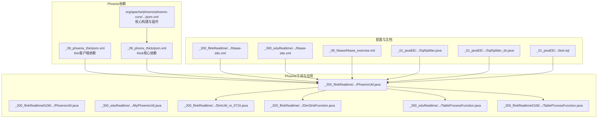
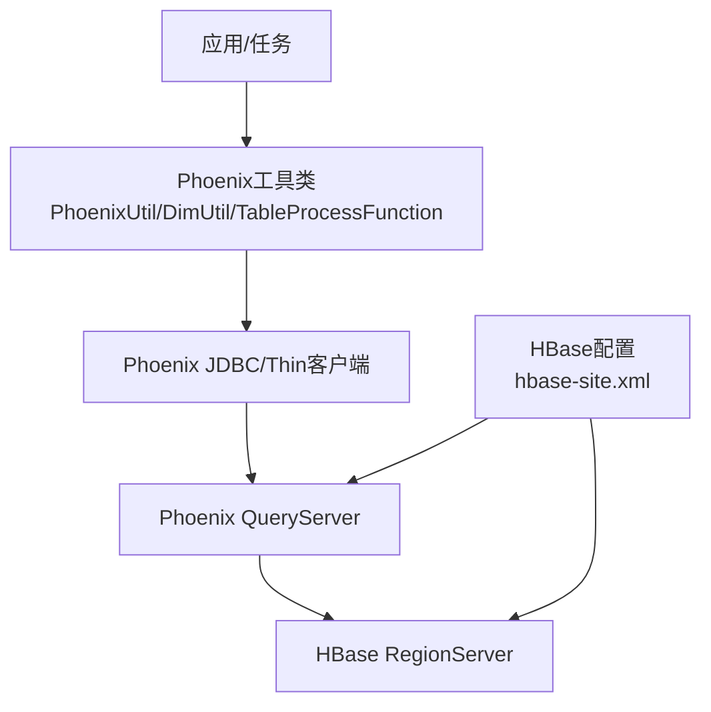
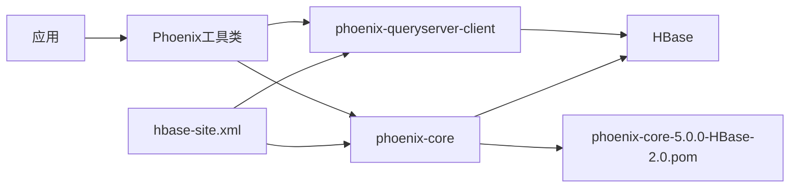

# Phoenix SQL语法支持

<cite>
**本文引用的文件**
- [phoenix-core-5.0.0-HBase-2.0.pom](file://org/apache/phoenix/phoenix-core/5.0.0-HBase-2.0/phoenix-core-5.0.0-HBase-2.0.pom)
- [phoenix-thin-pom.xml](file://_09_phoenix_thin/pom.xml)
- [phoenix-thick-pom.xml](file://_09_phonix_thick/pom.xml)
- [PhoenixUtil.java](file://_200_flinkRealtime/src/main/java/com/atguigu/gmall/realtime/util/PhoenixUtil.java)
- [PhoenixUtil_m.java](file://_200_flinkRealtime0106/src/main/java/com/atguigu/gmall/realtime/util/PhoenixUtil.java)
- [MyPhoenixUtil.java](file://_300_eduRealtime/src/main/java/com/atguigu/gmall/realtime/util/MyPhoenixUtil.java)
- [DimUtil_m_0715.java](file://_200_flinkRealtime/src/main/java/com/atguigu/gmall/realtime/util/DimUtil_m_0715.java)
- [DimSinkFunction.java](file://_200_flinkRealtime/src/main/java/com/atguigu/gmall/realtime/app/func/DimSinkFunction.java)
- [TableProcessFunction.java（edu版）](file://_300_eduRealtime/src/main/java/com/atguigu/gmall/realtime/app/func/TableProcessFunction.java)
- [TableProcessFunction.java（realtime版）](file://_200_flinkRealtime0106/src/main/java/com/atguigu/gmall/realtime/app/func/TableProcessFunction.java)
- [hbase-site.xml（realtime版）](file://_200_flinkRealtime/src/main/resources/hbase-site.xml)
- [hbase-site.xml（edu版）](file://_300_eduRealtime/src/main/resources/hbase-site.xml)
- [hbase_exercise.md](file://_08_hbase/hbase_exercise.md)
- [SqlSplitter.java](file://_01_javaEE/src/main/java/_14_File类与IO流/SqlSplitter.java)
- [SqlSplitter_ds.java](file://_01_javaEE/src/main/java/_14_File类与IO流/SqlSplitter_ds.java)
- [test.sql](file://_01_javaEE/src/main/resources/test.sql)
</cite>

## 目录
1. [简介](#简介)
2. [项目结构](#项目结构)
3. [核心组件](#核心组件)
4. [架构总览](#架构总览)
5. [详细组件分析](#详细组件分析)
6. [依赖关系分析](#依赖关系分析)
7. [性能考量](#性能考量)
8. [故障排查指南](#故障排查指南)
9. [结论](#结论)
10. [附录](#附录)

## 简介
本文件围绕仓库中与Phoenix相关的实现与示例，系统化梳理Phoenix SQL语法支持，覆盖DDL（数据定义语言）、DML（数据操作语言）与查询操作；解释Phoenix与标准SQL的差异与限制；阐述HBase数据模型映射；给出完整的SQL语法参考与最佳实践，并结合实际代码路径定位关键实现位置，便于读者快速定位与验证。

## 项目结构
该仓库包含Phoenix依赖声明、Phoenix工具类、Phoenix建表与Upsert写入示例、HBase命名空间与Phoenix Schema映射配置，以及Phoenix Shell语法与索引示例文档。下图展示与Phoenix SQL支持相关的关键模块与文件：

图表来源
- [phoenix-thin-pom.xml](file://_09_phoenix_thin/pom.xml#L1-L27)
- [phoenix-thick-pom.xml](file://_09_phonix_thick/pom.xml#L1-L51)
- [phoenix-core-5.0.0-HBase-2.0.pom](file://org/apache/phoenix/phoenix-core/5.0.0-HBase-2.0/phoenix-core-5.0.0-HBase-2.0.pom#L119-L188)
- [PhoenixUtil.java](file://_200_flinkRealtime/src/main/java/com/atguigu/gmall/realtime/util/PhoenixUtil.java#L1-L79)
- [PhoenixUtil_m.java](file://_200_flinkRealtime0106/src/main/java/com/atguigu/gmall/realtime/util/PhoenixUtil.java#L1-L84)
- [MyPhoenixUtil.java](file://_300_eduRealtime/src/main/java/com/atguigu/gmall/realtime/util/MyPhoenixUtil.java#L1-L80)
- [DimUtil_m_0715.java](file://_200_flinkRealtime/src/main/java/com/atguigu/gmall/realtime/util/DimUtil_m_0715.java#L125-L150)
- [DimSinkFunction.java](file://_200_flinkRealtime/src/main/java/com/atguigu/gmall/realtime/app/func/DimSinkFunction.java#L35-L64)
- [TableProcessFunction.java（edu版）](file://_300_eduRealtime/src/main/java/com/atguigu/gmall/realtime/app/func/TableProcessFunction.java#L127-L175)
- [TableProcessFunction.java（realtime版）](file://_200_flinkRealtime0106/src/main/java/com/atguigu/gmall/realtime/app/func/TableProcessFunction.java#L127-L175)
- [hbase-site.xml（realtime版）](file://_200_flinkRealtime/src/main/resources/hbase-site.xml#L1-L13)
- [hbase-site.xml（edu版）](file://_300_eduRealtime/src/main/resources/hbase-site.xml#L1-L12)
- [hbase_exercise.md](file://_08_hbase/hbase_exercise.md#L163-L308)
- [SqlSplitter.java](file://_01_javaEE/src/main/java/_14_File类与IO流/SqlSplitter.java#L72-L104)
- [SqlSplitter_ds.java](file://_01_javaEE/src/main/java/_14_File类与IO流/SqlSplitter_ds.java#L48-L148)
- [test.sql](file://_01_javaEE/src/main/resources/test.sql#L1-L8)

章节来源
- [phoenix-thin-pom.xml](file://_09_phoenix_thin/pom.xml#L1-L27)
- [phoenix-thick-pom.xml](file://_09_phonix_thick/pom.xml#L1-L51)
- [phoenix-core-5.0.0-HBase-2.0.pom](file://org/apache/phoenix/phoenix-core/5.0.0-HBase-2.0/phoenix-core-5.0.0-HBase-2.0.pom#L119-L188)
- [PhoenixUtil.java](file://_200_flinkRealtime/src/main/java/com/atguigu/gmall/realtime/util/PhoenixUtil.java#L1-L79)
- [hbase_exercise.md](file://_08_hbase/hbase_exercise.md#L163-L308)

## 核心组件
- Phoenix依赖层
  - Thin客户端：通过phoenix-queryserver-client提供远程查询能力，适合客户端直连QueryServer场景。
  - Thick核心：通过phoenix-core提供本地解析与执行能力，适合嵌入式或服务端集成。
- 工具类层
  - PhoenixUtil/PhoenixUtil_m/MyPhoenixUtil：封装JDBC执行DDL/DML与查询，统一资源释放。
  - DimUtil_m_0715：基于Schema与表名拼接查询SQL，演示Phoenix查询模式。
  - DimSinkFunction：拼接Upsert语句，演示Phoenix DML写入。
  - TableProcessFunction：动态拼接CREATE TABLE语句，演示Phoenix DDL。
- 配置与文档
  - hbase-site.xml：启用Phoenix Schema与HBase Namespace映射，确保SQL层Schema与HBase命名空间一致。
  - hbase_exercise.md：Phoenix Shell语法、Upsert、Delete、Drop、Index、Explain等示例与说明。
- SQL解析与拆分
  - SqlSplitter/SqlSplitter_ds：SQL语句切分与注释处理，辅助批量执行与脚本解析。
  - test.sql：Flink SQL Connector示例，体现Phoenix在流批一体化中的使用方式。

章节来源
- [phoenix-thin-pom.xml](file://_09_phoenix_thin/pom.xml#L1-L27)
- [phoenix-thick-pom.xml](file://_09_phonix_thick/pom.xml#L1-L51)
- [PhoenixUtil.java](file://_200_flinkRealtime/src/main/java/com/atguigu/gmall/realtime/util/PhoenixUtil.java#L1-L79)
- [PhoenixUtil_m.java](file://_200_flinkRealtime0106/src/main/java/com/atguigu/gmall/realtime/util/PhoenixUtil.java#L1-L84)
- [MyPhoenixUtil.java](file://_300_eduRealtime/src/main/java/com/atguigu/gmall/realtime/util/MyPhoenixUtil.java#L1-L80)
- [DimUtil_m_0715.java](file://_200_flinkRealtime/src/main/java/com/atguigu/gmall/realtime/util/DimUtil_m_0715.java#L125-L150)
- [DimSinkFunction.java](file://_200_flinkRealtime/src/main/java/com/atguigu/gmall/realtime/app/func/DimSinkFunction.java#L35-L64)
- [TableProcessFunction.java（edu版）](file://_300_eduRealtime/src/main/java/com/atguigu/gmall/realtime/app/func/TableProcessFunction.java#L127-L175)
- [TableProcessFunction.java（realtime版）](file://_200_flinkRealtime0106/src/main/java/com/atguigu/gmall/realtime/app/func/TableProcessFunction.java#L127-L175)
- [hbase-site.xml（realtime版）](file://_200_flinkRealtime/src/main/resources/hbase-site.xml#L1-L13)
- [hbase-site.xml（edu版）](file://_300_eduRealtime/src/main/resources/hbase-site.xml#L1-L12)
- [hbase_exercise.md](file://_08_hbase/hbase_exercise.md#L163-L308)
- [SqlSplitter.java](file://_01_javaEE/src/main/java/_14_File类与IO流/SqlSplitter.java#L72-L104)
- [SqlSplitter_ds.java](file://_01_javaEE/src/main/java/_14_File类与IO流/SqlSplitter_ds.java#L48-L148)
- [test.sql](file://_01_javaEE/src/main/resources/test.sql#L1-L8)

## 架构总览
Phoenix在本仓库中的角色是作为SQL访问HBase的桥梁，典型工作流如下：
- 应用通过Phoenix JDBC或Thin客户端连接Phoenix QueryServer。
- 使用Phoenix SQL执行DDL/DML/查询，Phoenix将SQL解析并映射到HBase RowKey与列族。
- 通过配置开启Schema与Namespace映射，保证逻辑Schema与物理命名空间一致。
- 工具类封装JDBC执行与资源管理，DimSinkFunction负责Upsert写入，TableProcessFunction负责动态建表。

图表来源
- [PhoenixUtil.java](file://_200_flinkRealtime/src/main/java/com/atguigu/gmall/realtime/util/PhoenixUtil.java#L1-L79)
- [phoenix-thin-pom.xml](file://_09_phoenix_thin/pom.xml#L1-L27)
- [hbase-site.xml（realtime版）](file://_200_flinkRealtime/src/main/resources/hbase-site.xml#L1-L13)

## 详细组件分析

### 组件A：Phoenix SQL语法与差异
- 支持的标准SQL元素
  - DDL：CREATE TABLE、DROP TABLE、CREATE INDEX、DROP INDEX、ALTER TABLE（部分支持，视版本而定）。
  - DML：INSERT（通过Upsert）、UPDATE（通过Upsert）、DELETE。
  - 查询：SELECT、聚合、连接、子查询（受限于执行计划与索引）。
- Phoenix特有语法与限制
  - Upsert：Phoenix推荐使用Upsert替代Insert/Update，具备幂等性与高效写入特性。
  - Schema与表名大小写：默认转大写，可通过双引号保留大小写。
  - 列族映射：Phoenix表字段映射到HBase列族与列名，支持显式列族声明。
  - 编码策略：可配置COLUMN_ENCODED_BYTES，影响RowKey编码与存储布局。
  - 索引：支持全局索引与本地索引，Explain用于分析执行计划。
- HBase数据模型映射
  - RowKey：主键列映射为RowKey前缀或完整RowKey，具体取决于表设计与编码策略。
  - 列族与列限定符：非主键列映射到列族与列限定符，支持多列族。
  - 命名空间映射：通过配置将Phoenix Schema映射到HBase Namespace，避免冲突。

章节来源
- [hbase_exercise.md](file://_08_hbase/hbase_exercise.md#L163-L308)
- [hbase-site.xml（realtime版）](file://_200_flinkRealtime/src/main/resources/hbase-site.xml#L1-L13)
- [hbase-site.xml（edu版）](file://_300_eduRealtime/src/main/resources/hbase-site.xml#L1-L12)

### 组件B：DDL操作（创建、变更、删除）
- CREATE TABLE
  - 示例：动态拼接建表语句，主键列声明primary key，其他列声明为varchar。
  - 路径参考：
    - [TableProcessFunction.java（edu版）](file://_300_eduRealtime/src/main/java/com/atguigu/gmall/realtime/app/func/TableProcessFunction.java#L127-L175)
    - [TableProcessFunction.java（realtime版）](file://_200_flinkRealtime0106/src/main/java/com/atguigu/gmall/realtime/app/func/TableProcessFunction.java#L127-L175)
- ALTER TABLE
  - 仓库未直接展示ALTER示例，通常用于添加列、修改列属性（受版本限制）。
- DROP TABLE
  - 仓库未直接展示DROP示例，但Phoenix Shell文档包含该语法。

章节来源
- [TableProcessFunction.java（edu版）](file://_300_eduRealtime/src/main/java/com/atguigu/gmall/realtime/app/func/TableProcessFunction.java#L127-L175)
- [TableProcessFunction.java（realtime版）](file://_200_flinkRealtime0106/src/main/java/com/atguigu/gmall/realtime/app/func/TableProcessFunction.java#L127-L175)
- [hbase_exercise.md](file://_08_hbase/hbase_exercise.md#L163-L308)

### 组件C：DML操作（插入、更新、删除）
- INSERT（推荐使用Upsert）
  - 示例：拼接Upsert语句，将JSON字段映射为列名与值。
  - 路径参考：
    - [DimSinkFunction.java](file://_200_flinkRealtime/src/main/java/com/atguigu/gmall/realtime/app/func/DimSinkFunction.java#L35-L64)
- UPDATE（通过Upsert）
  - 同Upsert写入，重复主键即更新。
- DELETE
  - 通过DELETE语句按条件删除行，仓库未直接展示DELETE示例，但Phoenix Shell文档包含该语法。

章节来源
- [DimSinkFunction.java](file://_200_flinkRealtime/src/main/java/com/atguigu/gmall/realtime/app/func/DimSinkFunction.java#L35-L64)
- [hbase_exercise.md](file://_08_hbase/hbase_exercise.md#L163-L308)

### 组件D：查询操作（简单、聚合、连接、子查询）
- 简单查询
  - 示例：按主键点查、范围扫描、全表扫描。
  - 路径参考：
    - [DimUtil_m_0715.java](file://_200_flinkRealtime/src/main/java/com/atguigu/gmall/realtime/util/DimUtil_m_0715.java#L125-L150)
- 聚合查询
  - 仓库未直接展示聚合示例，Phoenix支持COUNT、SUM等聚合函数。
- 连接查询
  - 仓库未直接展示JOIN示例，Phoenix支持内连接等（受限于执行计划与索引）。
- 子查询
  - 仓库未直接展示子查询示例，Phoenix支持子查询（受限于版本与执行计划）。
- 执行计划分析
  - 使用Explain分析全表扫描、点查、范围扫描等执行计划。

章节来源
- [DimUtil_m_0715.java](file://_200_flinkRealtime/src/main/java/com/atguigu/gmall/realtime/util/DimUtil_m_0715.java#L125-L150)
- [hbase_exercise.md](file://_08_hbase/hbase_exercise.md#L163-L308)

### 组件E：Phoenix特有扩展（Upsert、Explain Plan）
- Upsert
  - 通过Upsert实现插入与更新的统一，具备幂等性。
  - 路径参考：
    - [DimSinkFunction.java](file://_200_flinkRealtime/src/main/java/com/atguigu/gmall/realtime/app/func/DimSinkFunction.java#L35-L64)
- Explain Plan
  - 使用Explain分析SQL执行计划，指导索引设计与查询优化。
  - 路径参考：
    - [hbase_exercise.md](file://_08_hbase/hbase_exercise.md#L163-L308)

章节来源
- [DimSinkFunction.java](file://_200_flinkRealtime/src/main/java/com/atguigu/gmall/realtime/app/func/DimSinkFunction.java#L35-L64)
- [hbase_exercise.md](file://_08_hbase/hbase_exercise.md#L163-L308)

### 组件F：工具类与资源管理
- PhoenixUtil/PhoenixUtil_m/MyPhoenixUtil
  - 统一封装JDBC执行DDL/DML与查询，统一资源释放，避免泄漏。
  - 路径参考：
    - [PhoenixUtil.java](file://_200_flinkRealtime/src/main/java/com/atguigu/gmall/realtime/util/PhoenixUtil.java#L1-L79)
    - [PhoenixUtil_m.java](file://_200_flinkRealtime0106/src/main/java/com/atguigu/gmall/realtime/util/PhoenixUtil.java#L1-L84)
    - [MyPhoenixUtil.java](file://_300_eduRealtime/src/main/java/com/atguigu/gmall/realtime/util/MyPhoenixUtil.java#L1-L80)

章节来源
- [PhoenixUtil.java](file://_200_flinkRealtime/src/main/java/com/atguigu/gmall/realtime/util/PhoenixUtil.java#L1-L79)
- [PhoenixUtil_m.java](file://_200_flinkRealtime0106/src/main/java/com/atguigu/gmall/realtime/util/PhoenixUtil.java#L1-L84)
- [MyPhoenixUtil.java](file://_300_eduRealtime/src/main/java/com/atguigu/gmall/realtime/util/MyPhoenixUtil.java#L1-L80)

### 组件G：SQL解析与脚本拆分
- SqlSplitter/SqlSplitter_ds
  - 处理SQL语句切分、注释识别与引号匹配，辅助批量执行与脚本解析。
  - 路径参考：
    - [SqlSplitter.java](file://_01_javaEE/src/main/java/_14_File类与IO流/SqlSplitter.java#L72-L104)
    - [SqlSplitter_ds.java](file://_01_javaEE/src/main/java/_14_File类与IO流/SqlSplitter_ds.java#L48-L148)
- test.sql
  - Flink SQL Connector示例，体现Phoenix在流批一体化中的使用方式。
  - 路径参考：
    - [test.sql](file://_01_javaEE/src/main/resources/test.sql#L1-L8)

章节来源
- [SqlSplitter.java](file://_01_javaEE/src/main/java/_14_File类与IO流/SqlSplitter.java#L72-L104)
- [SqlSplitter_ds.java](file://_01_javaEE/src/main/java/_14_File类与IO流/SqlSplitter_ds.java#L48-L148)
- [test.sql](file://_01_javaEE/src/main/resources/test.sql#L1-L8)

## 依赖关系分析
- 依赖层次
  - 应用依赖Phoenix Thin客户端或Thick核心，通过JDBC访问Phoenix QueryServer或本地执行。
  - Phoenix核心构建使用ANTLR生成解析器，支持SQL语法解析。
- 配置耦合
  - HBase配置启用Phoenix Schema与Namespace映射，确保逻辑Schema与物理命名空间一致。
- 工具类耦合
  - 工具类对JDBC执行与资源管理进行抽象，降低上层业务对连接与事务的关注度。

图表来源
- [phoenix-thin-pom.xml](file://_09_phoenix_thin/pom.xml#L1-L27)
- [phoenix-thick-pom.xml](file://_09_phonix_thick/pom.xml#L1-L51)
- [phoenix-core-5.0.0-HBase-2.0.pom](file://org/apache/phoenix/phoenix-core/5.0.0-HBase-2.0/phoenix-core-5.0.0-HBase-2.0.pom#L119-L188)
- [hbase-site.xml（realtime版）](file://_200_flinkRealtime/src/main/resources/hbase-site.xml#L1-L13)

章节来源
- [phoenix-thin-pom.xml](file://_09_phoenix_thin/pom.xml#L1-L27)
- [phoenix-thick-pom.xml](file://_09_phonix_thick/pom.xml#L1-L51)
- [phoenix-core-5.0.0-HBase-2.0.pom](file://org/apache/phoenix/phoenix-core/5.0.0-HBase-2.0/phoenix-core-5.0.0-HBase-2.0.pom#L119-L188)
- [hbase-site.xml（realtime版）](file://_200_flinkRealtime/src/main/resources/hbase-site.xml#L1-L13)

## 性能考量
- 索引设计
  - 使用全局索引或本地索引提升WHERE过滤效率；通过Explain分析执行计划，避免全表扫描。
- RowKey设计
  - 主键列与编码策略影响数据分布与扫描性能；必要时调整COLUMN_ENCODED_BYTES与列族映射。
- 写入路径
  - 优先使用Upsert进行写入，减少重复主键的多次查找成本。
- 连接与资源
  - 使用连接池与统一资源释放，避免连接泄漏与上下文抖动。

章节来源
- [hbase_exercise.md](file://_08_hbase/hbase_exercise.md#L163-L308)
- [PhoenixUtil.java](file://_200_flinkRealtime/src/main/java/com/atguigu/gmall/realtime/util/PhoenixUtil.java#L1-L79)

## 故障排查指南
- 常见问题
  - Schema与Namespace不一致：检查hbase-site.xml配置项，确保开启Schema映射。
  - Upsert未生效：确认主键列是否正确、Upsert语句是否包含主键与目标列。
  - 查询性能差：使用Explain分析执行计划，评估是否需要新增索引或调整RowKey。
  - SQL脚本执行失败：使用SqlSplitter/SqlSplitter_ds进行语句切分与注释处理，排除语法错误。
- 定位手段
  - 通过工具类统一捕获异常并打印堆栈，结合日志定位问题。
  - 通过Phoenix Shell或QueryServer客户端单独执行可疑SQL，缩小问题范围。

章节来源
- [hbase-site.xml（realtime版）](file://_200_flinkRealtime/src/main/resources/hbase-site.xml#L1-L13)
- [hbase_exercise.md](file://_08_hbase/hbase_exercise.md#L163-L308)
- [SqlSplitter.java](file://_01_javaEE/src/main/java/_14_File类与IO流/SqlSplitter.java#L72-L104)
- [PhoenixUtil.java](file://_200_flinkRealtime/src/main/java/com/atguigu/gmall/realtime/util/PhoenixUtil.java#L1-L79)

## 结论
本仓库展示了Phoenix在实际工程中的典型用法：通过Thin/Thick客户端访问Phoenix，使用Upsert进行高效写入，通过工具类统一封装JDBC执行与资源管理，并借助Explain与索引设计优化查询性能。同时，通过配置Schema与Namespace映射，确保逻辑与物理命名一致。建议在生产环境中结合Explain持续优化执行计划，并规范Upsert写入与索引策略。

## 附录
- SQL语法参考（基于仓库示例与文档）
  - DDL
    - 创建表：参考动态建表拼接逻辑。
      - [TableProcessFunction.java（edu版）](file://_300_eduRealtime/src/main/java/com/atguigu/gmall/realtime/app/func/TableProcessFunction.java#L127-L175)
      - [TableProcessFunction.java（realtime版）](file://_200_flinkRealtime0106/src/main/java/com/atguigu/gmall/realtime/app/func/TableProcessFunction.java#L127-L175)
    - 删除表：Phoenix Shell文档包含该语法。
      - [hbase_exercise.md](file://_08_hbase/hbase_exercise.md#L163-L308)
  - DML
    - Upsert写入：参考Upsert语句拼接。
      - [DimSinkFunction.java](file://_200_flinkRealtime/src/main/java/com/atguigu/gmall/realtime/app/func/DimSinkFunction.java#L35-L64)
    - 删除：Phoenix Shell文档包含该语法。
      - [hbase_exercise.md](file://_08_hbase/hbase_exercise.md#L163-L308)
  - 查询
    - 点查/范围查/全表扫描：参考查询拼接与执行。
      - [DimUtil_m_0715.java](file://_200_flinkRealtime/src/main/java/com/atguigu/gmall/realtime/util/DimUtil_m_0715.java#L125-L150)
    - Explain执行计划：参考Phoenix Shell文档。
      - [hbase_exercise.md](file://_08_hbase/hbase_exercise.md#L163-L308)
- 依赖与构建
  - Thin客户端与Thick核心依赖声明。
    - [phoenix-thin-pom.xml](file://_09_phoenix_thin/pom.xml#L1-L27)
    - [phoenix-thick-pom.xml](file://_09_phonix_thick/pom.xml#L1-L51)
  - Phoenix核心构建与ANTLR插件。
    - [phoenix-core-5.0.0-HBase-2.0.pom](file://org/apache/phoenix/phoenix-core/5.0.0-HBase-2.0/phoenix-core-5.0.0-HBase-2.0.pom#L119-L188)
- 配置
  - Schema与Namespace映射。
    - [hbase-site.xml（realtime版）](file://_200_flinkRealtime/src/main/resources/hbase-site.xml#L1-L13)
    - [hbase-site.xml（edu版）](file://_300_eduRealtime/src/main/resources/hbase-site.xml#L1-L12)
- SQL解析
  - 语句切分与注释处理。
    - [SqlSplitter.java](file://_01_javaEE/src/main/java/_14_File类与IO流/SqlSplitter.java#L72-L104)
    - [SqlSplitter_ds.java](file://_01_javaEE/src/main/java/_14_File类与IO流/SqlSplitter_ds.java#L48-L148)
  - Flink SQL Connector示例。
    - [test.sql](file://_01_javaEE/src/main/resources/test.sql#L1-L8)