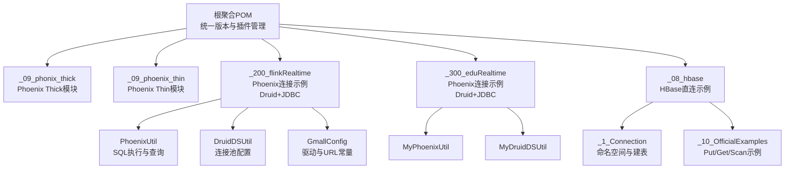
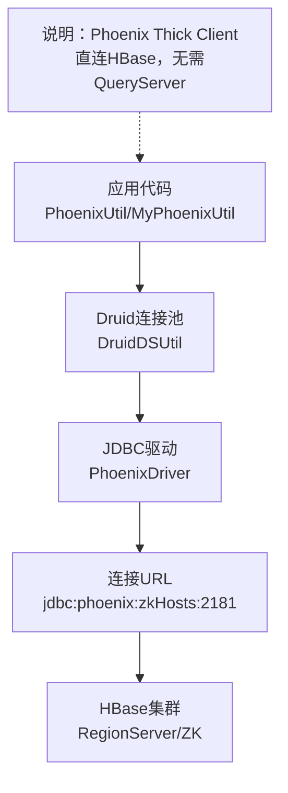
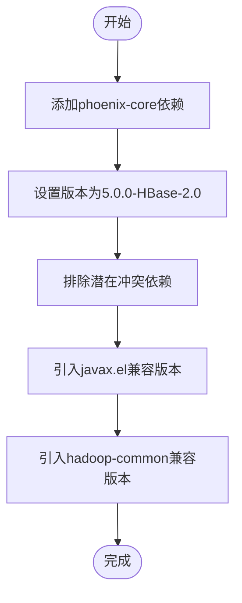
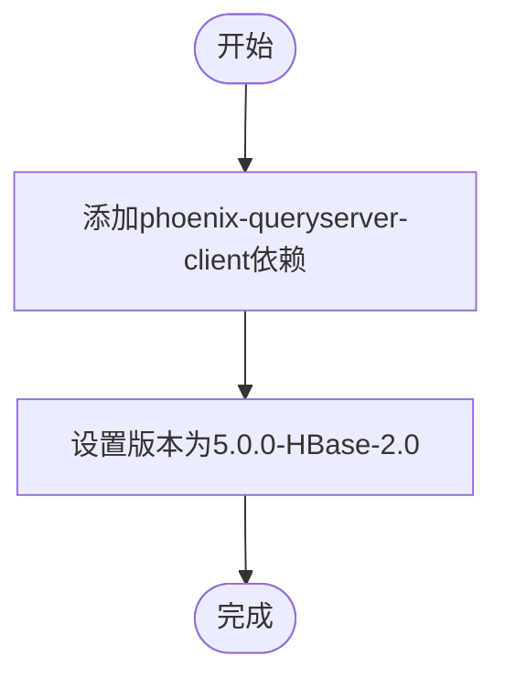
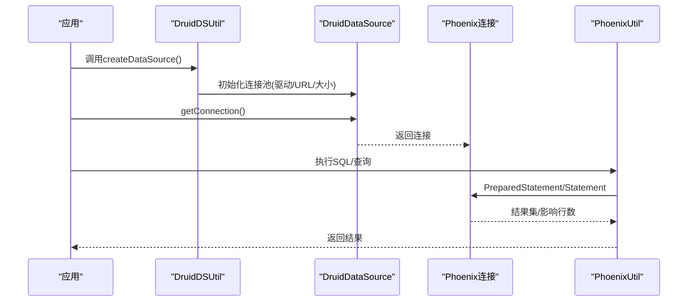
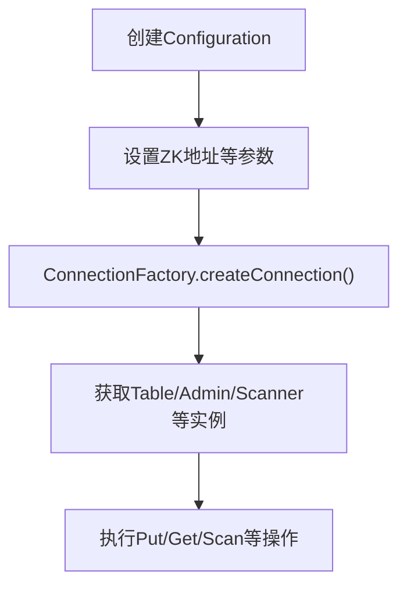
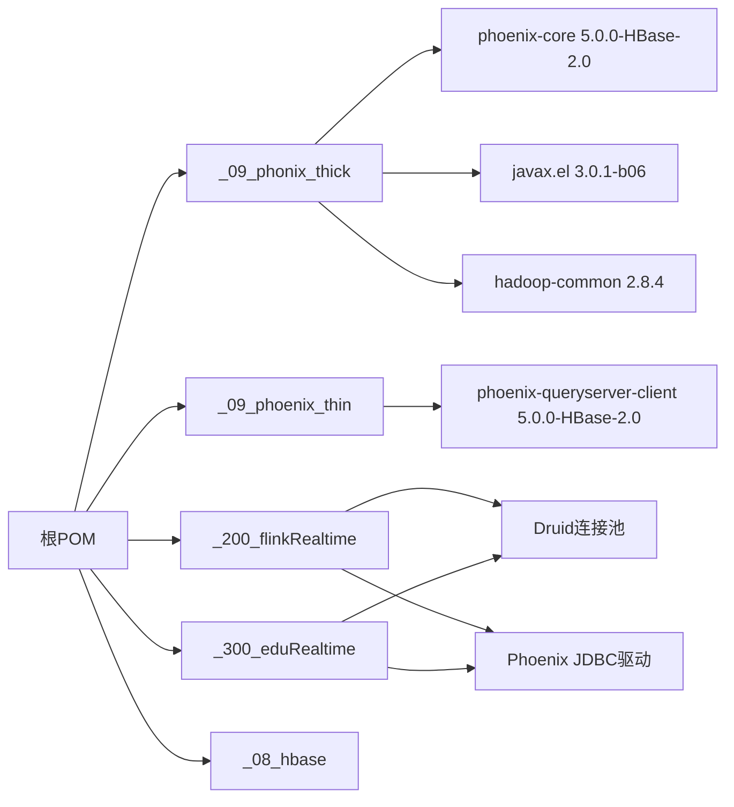

# Phoenix Thick Client连接

<cite>
**本文引用的文件**
- [根聚合POM](file://pom.xml)
- [Phoenix Thick模块POM](file://_09_phonix_thick/pom.xml)
- [Phoenix Thin模块POM](file://_09_phoenix_thin/pom.xml)
- [Phoenix连接工具类（Flink实时项目）](file://_200_flinkRealtime/src/main/java/com/atguigu/gmall/realtime/util/PhoenixUtil.java)
- [Druid连接池工具类（Flink实时项目）](file://_200_flinkRealtime/src/main/java/com/atguigu/gmall/realtime/util/DruidDSUtil.java)
- [Phoenix配置常量（Flink实时项目）](file://_200_flinkRealtime/src/main/java/com/atguigu/gmall/realtime/common/GmallConfig.java)
- [Phoenix连接工具类（Flink实时项目0106）](file://_200_flinkRealtime0106/src/main/java/com/atguigu/gmall/realtime/util/PhoenixUtil.java)
- [Phoenix连接工具类（Edu实时项目）](file://_300_eduRealtime/src/main/java/com/atguigu/gmall/realtime/util/MyPhoenixUtil.java)
- [HBase官方示例（连接与表操作）](file://_08_hbase/src/main/java/_10_OfficialExamples.java)
- [HBase连接工具类（命名空间与建表）](file://_08_hbase/src/main/java/_1_Connection.java)
</cite>

## 目录
1. [简介](#简介)
2. [项目结构](#项目结构)
3. [核心组件](#核心组件)
4. [架构总览](#架构总览)
5. [详细组件分析](#详细组件分析)
6. [依赖关系分析](#依赖关系分析)
7. [性能考虑](#性能考虑)
8. [故障排查指南](#故障排查指南)
9. [结论](#结论)
10. [附录](#附录)

## 简介
本技术文档围绕Phoenix Thick Client的连接方式进行系统化梳理，重点解释其“直连HBase”的架构特点、依赖配置与使用方法，并结合仓库中的实际示例，给出可复用的连接流程、配置参数与优化建议。同时对比Thin Client与Thick Client在架构与适用场景上的差异，帮助读者在不同业务需求下做出合理选型。

## 项目结构
该仓库采用Maven多模块组织，Phoenix Thick与Thin分别以独立模块存在；Phoenix连接示例位于大数据实战项目模块中，使用Druid连接池并通过JDBC直连Phoenix服务端（底层即HBase）。HBase相关示例展示了直接连接HBase集群的方式，便于理解Thick Client“直连HBase”的本质。

图表来源
- [根聚合POM](file://pom.xml#L1-L143)
- [Phoenix Thick模块POM](file://_09_phonix_thick/pom.xml#L1-L51)
- [Phoenix Thin模块POM](file://_09_phoenix_thin/pom.xml#L1-L27)
- [Phoenix连接工具类（Flink实时项目）](file://_200_flinkRealtime/src/main/java/com/atguigu/gmall/realtime/util/PhoenixUtil.java#L1-L117)
- [Druid连接池工具类（Flink实时项目）](file://_200_flinkRealtime/src/main/java/com/atguigu/gmall/realtime/util/DruidDSUtil.java#L1-L30)
- [Phoenix配置常量（Flink实时项目）](file://_200_flinkRealtime/src/main/java/com/atguigu/gmall/realtime/common/GmallConfig.java#L1-L16)
- [Phoenix连接工具类（Edu实时项目）](file://_300_eduRealtime/src/main/java/com/atguigu/gmall/realtime/util/MyPhoenixUtil.java#L1-L48)
- [HBase官方示例（连接与表操作）](file://_08_hbase/src/main/java/_10_OfficialExamples.java#L1-L125)
- [HBase连接工具类（命名空间与建表）](file://_08_hbase/src/main/java/_1_Connection.java#L1-L82)

章节来源
- [根聚合POM](file://pom.xml#L1-L143)
- [Phoenix Thick模块POM](file://_09_phonix_thick/pom.xml#L1-L51)
- [Phoenix Thin模块POM](file://_09_phoenix_thin/pom.xml#L1-L27)

## 核心组件
- Phoenix Thick模块：引入phoenix-core等核心依赖，强调“直连HBase”，适合对延迟敏感、需要本地解析与执行计划的应用。
- Phoenix Thin模块：引入phoenix-queryserver-client，通过QueryServer进行远程访问，适合跨语言或受限网络环境。
- 连接示例模块：使用Druid连接池与JDBC直连Phoenix，底层即HBase，体现Thick Client“直连HBase”的特性。
- HBase示例：展示ConnectionFactory直连HBase集群的典型流程，作为Thick Client架构的参考实现。

章节来源
- [Phoenix Thick模块POM](file://_09_phonix_thick/pom.xml#L1-L51)
- [Phoenix Thin模块POM](file://_09_phoenix_thin/pom.xml#L1-L27)
- [Phoenix连接工具类（Flink实时项目）](file://_200_flinkRealtime/src/main/java/com/atguigu/gmall/realtime/util/PhoenixUtil.java#L1-L117)
- [HBase官方示例（连接与表操作）](file://_08_hbase/src/main/java/_10_OfficialExamples.java#L1-L125)

## 架构总览
Phoenix Thick Client的架构要点：
- 直连模式：应用直接加载Phoenix客户端并连接到HBase集群，无需额外的QueryServer进程。
- 本地执行：SQL解析、计划生成与部分执行在客户端完成，减少网络往返。
- 依赖直连：通过JDBC URL指向ZooKeeper地址，底层由Phoenix驱动建立与HBase的连接。

图表来源
- [Phoenix连接工具类（Flink实时项目）](file://_200_flinkRealtime/src/main/java/com/atguigu/gmall/realtime/util/PhoenixUtil.java#L1-L117)
- [Druid连接池工具类（Flink实时项目）](file://_200_flinkRealtime/src/main/java/com/atguigu/gmall/realtime/util/DruidDSUtil.java#L1-L30)
- [Phoenix配置常量（Flink实时项目）](file://_200_flinkRealtime/src/main/java/com/atguigu/gmall/realtime/common/GmallConfig.java#L1-L16)
- [HBase官方示例（连接与表操作）](file://_08_hbase/src/main/java/_10_OfficialExamples.java#L1-L125)

## 详细组件分析

### 组件A：Phoenix Thick模块（依赖与版本）
- 依赖核心：phoenix-core，用于本地SQL解析与执行。
- 版本选择：与HBase 2.0配套的Phoenix 5.0.0版本，确保兼容性。
- 排除策略：显式排除某些冲突依赖后，手动引入兼容版本，保证运行稳定。

图表来源
- [Phoenix Thick模块POM](file://_09_phonix_thick/pom.xml#L1-L51)

章节来源
- [Phoenix Thick模块POM](file://_09_phonix_thick/pom.xml#L1-L51)

### 组件B：Phoenix Thin模块（依赖与版本）
- 依赖核心：phoenix-queryserver-client，用于Thin Client模式下的JDBC客户端。
- 版本选择：与Phoenix 5.0.0-HBase-2.0配套，确保与QueryServer兼容。

图表来源
- [Phoenix Thin模块POM](file://_09_phoenix_thin/pom.xml#L1-L27)

章节来源
- [Phoenix Thin模块POM](file://_09_phoenix_thin/pom.xml#L1-L27)

### 组件C：连接示例（Druid + JDBC + Phoenix）
- 连接池：DruidDSUtil负责创建连接池，设置驱动类名与Phoenix JDBC URL。
- 驱动与URL：GmallConfig集中维护Phoenix驱动与ZK地址构成的URL。
- 工具类：PhoenixUtil封装SQL执行与查询逻辑，支持DDL/DML与查询结果映射。

图表来源
- [Druid连接池工具类（Flink实时项目）](file://_200_flinkRealtime/src/main/java/com/atguigu/gmall/realtime/util/DruidDSUtil.java#L1-L30)
- [Phoenix连接工具类（Flink实时项目）](file://_200_flinkRealtime/src/main/java/com/atguigu/gmall/realtime/util/PhoenixUtil.java#L1-L117)
- [Phoenix配置常量（Flink实时项目）](file://_200_flinkRealtime/src/main/java/com/atguigu/gmall/realtime/common/GmallConfig.java#L1-L16)

章节来源
- [Phoenix连接工具类（Flink实时项目）](file://_200_flinkRealtime/src/main/java/com/atguigu/gmall/realtime/util/PhoenixUtil.java#L1-L117)
- [Druid连接池工具类（Flink实时项目）](file://_200_flinkRealtime/src/main/java/com/atguigu/gmall/realtime/util/DruidDSUtil.java#L1-L30)
- [Phoenix配置常量（Flink实时项目）](file://_200_flinkRealtime/src/main/java/com/atguigu/gmall/realtime/common/GmallConfig.java#L1-L16)

### 组件D：HBase直连示例（对比理解Thick Client）
- HBase官方示例展示了通过HBaseConfiguration与ConnectionFactory直连集群，体现“直连HBase”的典型流程。
- 与Phoenix Thick Client一致：均是应用直接连接HBase/ZK，不依赖中间层。

图表来源
- [HBase官方示例（连接与表操作）](file://_08_hbase/src/main/java/_10_OfficialExamples.java#L1-L125)

章节来源
- [HBase官方示例（连接与表操作）](file://_08_hbase/src/main/java/_10_OfficialExamples.java#L1-L125)

### 组件E：Thin Client与Thick Client对比
- Thick Client
  - 直连HBase，无QueryServer依赖，延迟更低，适合对性能敏感场景。
  - 需要本地加载Phoenix客户端与HBase依赖，部署需注意版本匹配。
- Thin Client
  - 通过QueryServer进行远程访问，跨语言/跨网段更友好。
  - 需要维护QueryServer可用性与网络连通性。

（本节为概念性对比，不直接分析具体文件）

## 依赖关系分析
- 版本统一：根POM集中管理各组件版本，确保模块间依赖一致性。
- 模块划分：Phoenix Thick/Thin独立模块，避免相互干扰；连接示例模块依赖Druid与Phoenix驱动。
- 运行时依赖：Thick模块引入phoenix-core及必要兼容依赖；Thin模块引入phoenix-queryserver-client。

图表来源
- [根聚合POM](file://pom.xml#L1-L143)
- [Phoenix Thick模块POM](file://_09_phonix_thick/pom.xml#L1-L51)
- [Phoenix Thin模块POM](file://_09_phoenix_thin/pom.xml#L1-L27)
- [Phoenix连接工具类（Flink实时项目）](file://_200_flinkRealtime/src/main/java/com/atguigu/gmall/realtime/util/PhoenixUtil.java#L1-L117)
- [Druid连接池工具类（Flink实时项目）](file://_200_flinkRealtime/src/main/java/com/atguigu/gmall/realtime/util/DruidDSUtil.java#L1-L30)

章节来源
- [根聚合POM](file://pom.xml#L1-L143)
- [Phoenix Thick模块POM](file://_09_phonix_thick/pom.xml#L1-L51)
- [Phoenix Thin模块POM](file://_09_phoenix_thin/pom.xml#L1-L27)

## 性能考虑
- 连接池参数
  - 初始连接数、最大活跃连接数、最小空闲连接数应根据并发与QPS评估设置，避免频繁创建销毁连接。
  - 可结合业务峰值与慢查询统计调整，确保连接池容量与回收策略平衡。
- SQL执行
  - 使用PreparedStatement减少编译开销；批量写入时合并提交，降低网络往返。
  - 合理使用索引与过滤条件，避免全表扫描。
- 网络与ZK
  - ZK地址与端口需稳定可达；网络抖动会影响连接稳定性。
- 版本匹配
  - Phoenix与HBase版本需严格匹配，避免因协议不一致导致的性能退化或异常。

（本节为通用性能建议，不直接分析具体文件）

## 故障排查指南
- 驱动与URL
  - 确认驱动类名与URL格式正确，ZK地址与端口可达。
- 连接池问题
  - 观察连接池状态与异常堆栈，检查最大连接数与超时设置是否合理。
- 资源释放
  - 确保PreparedStatement与ResultSet、Connection在finally中关闭，避免泄漏。
- HBase直连验证
  - 可参考HBase官方示例验证ZK与RegionServer连通性，再进行Phoenix连接测试。

章节来源
- [Phoenix连接工具类（Flink实时项目）](file://_200_flinkRealtime/src/main/java/com/atguigu/gmall/realtime/util/PhoenixUtil.java#L1-L117)
- [HBase官方示例（连接与表操作）](file://_08_hbase/src/main/java/_10_OfficialExamples.java#L1-L125)

## 结论
Phoenix Thick Client通过phoenix-core实现对HBase的直接连接，具备低延迟与高内聚的优势，适合对性能敏感且可接受本地依赖部署的场景。结合仓库中的Druid连接池与JDBC示例，可快速搭建稳定的直连方案。Thin Client则更适合跨语言与受限网络环境，二者在架构与部署上各有侧重，应按业务需求选择。

## 附录

### A. 依赖配置与版本选择
- Thick模块
  - phoenix-core：5.0.0-HBase-2.0
  - javax.el：3.0.1-b06
  - hadoop-common：2.8.4
- Thin模块
  - phoenix-queryserver-client：5.0.0-HBase-2.0

章节来源
- [Phoenix Thick模块POM](file://_09_phonix_thick/pom.xml#L1-L51)
- [Phoenix Thin模块POM](file://_09_phoenix_thin/pom.xml#L1-L27)

### B. 连接示例（路径指引）
- 驱动与URL常量
  - [Phoenix配置常量（Flink实时项目）](file://_200_flinkRealtime/src/main/java/com/atguigu/gmall/realtime/common/GmallConfig.java#L1-L16)
- 连接池
  - [Druid连接池工具类（Flink实时项目）](file://_200_flinkRealtime/src/main/java/com/atguigu/gmall/realtime/util/DruidDSUtil.java#L1-L30)
- SQL执行与查询
  - [Phoenix连接工具类（Flink实时项目）](file://_200_flinkRealtime/src/main/java/com/atguigu/gmall/realtime/util/PhoenixUtil.java#L1-L117)
  - [Phoenix连接工具类（Edu实时项目）](file://_300_eduRealtime/src/main/java/com/atguigu/gmall/realtime/util/MyPhoenixUtil.java#L1-L48)

### C. HBase直连参考
- 官方示例（Put/Get/Scan）
  - [HBase官方示例（连接与表操作）](file://_08_hbase/src/main/java/_10_OfficialExamples.java#L1-L125)
- 命名空间与建表
  - [_1_Connection（命名空间与建表）](file://_08_hbase/src/main/java/_1_Connection.java#L1-L82)