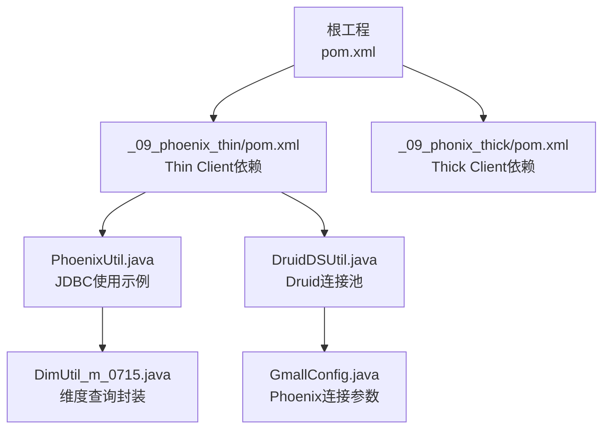
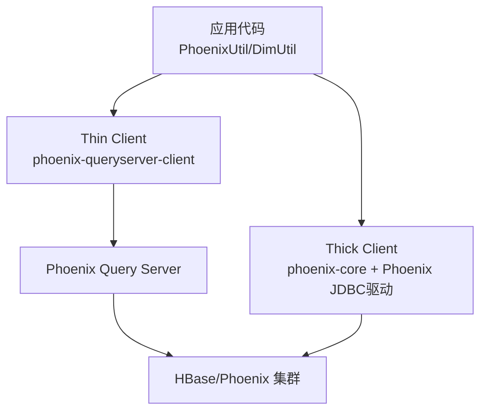
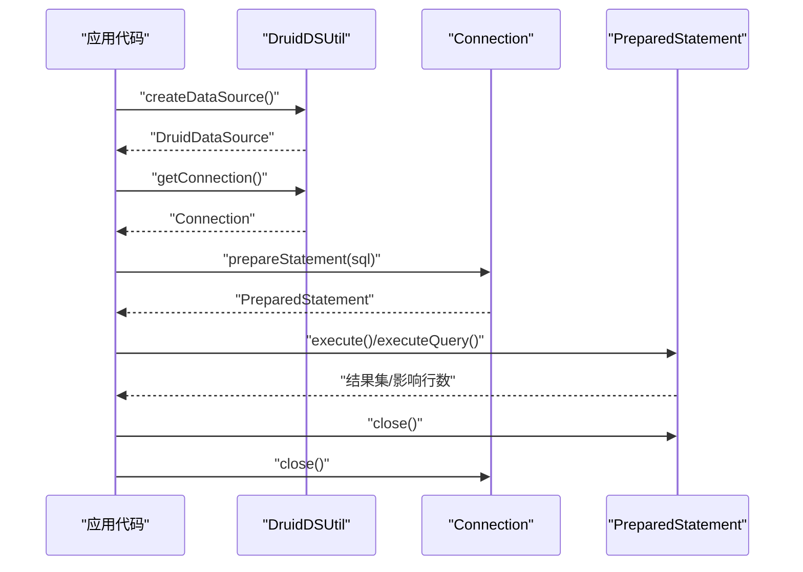
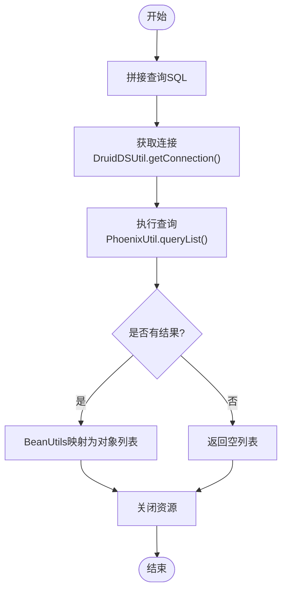
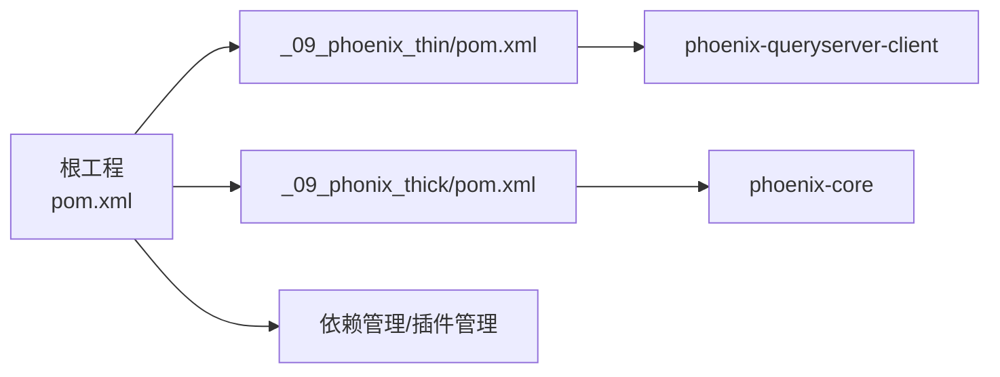

# Phoenix Thin Client连接

<cite>
**本文引用的文件**
- [pom.xml](file://pom.xml)
- [_09_phoenix_thin/pom.xml](file://_09_phoenix_thin/pom.xml)
- [_09_phonix_thick/pom.xml](file://_09_phonix_thick/pom.xml)
- [PhoenixUtil.java](file://_200_flinkRealtime/src/main/java/com/atguigu/gmall/realtime/util/PhoenixUtil.java)
- [DruidDSUtil.java](file://_200_flinkRealtime/src/main/java/com/atguigu/gmall/realtime/util/DruidDSUtil.java)
- [GmallConfig.java](file://_200_flinkRealtime/src/main/java/com/atguigu/gmall/realtime/common/GmallConfig.java)
- [DimUtil_m_0715.java](file://_200_flinkRealtime/src/main/java/com/atguigu/gmall/realtime/util/DimUtil_m_0715.java)
- [phoenix-queryserver-client-5.0.0-HBase-2.0.pom](file://org/apache/phoenix/phoenix-queryserver-client/5.0.0-HBase-2.0/phoenix-queryserver-client-5.0.0-HBase-2.0.pom)
- [phoenix-5.0.0-HBase-2.0.pom](file://org/apache/phoenix/phoenix/5.0.0-HBase-2.0/phoenix-5.0.0-HBase-2.0.pom)
</cite>

## 目录
1. [引言](#引言)
2. [项目结构](#项目结构)
3. [核心组件](#核心组件)
4. [架构总览](#架构总览)
5. [详细组件分析](#详细组件分析)
6. [依赖关系分析](#依赖关系分析)
7. [性能考量](#性能考量)
8. [故障排查指南](#故障排查指南)
9. [结论](#结论)
10. [附录](#附录)

## 引言
本技术文档围绕Phoenix Thin Client连接方式进行系统化说明，重点阐述Thin Client的工作原理、与传统JDBC Thick驱动的区别、phoenix-queryserver-client依赖的配置与使用、连接参数配置要点、适用场景与性能特征，以及与Thick Client的选择策略。文档同时提供基于仓库现有实现的连接示例路径与排障建议，帮助读者快速落地。

## 项目结构
该仓库包含Phoenix Thin与Thick两个子模块，分别演示Thin Client与Thick Client的依赖引入方式；同时提供Phoenix JDBC连接的通用实践（Druid连接池 + Phoenix JDBC驱动），便于理解Thin/Thick两种模式在应用侧的差异。

图表来源
- [pom.xml](file://pom.xml#L1-L143)
- [_09_phoenix_thin/pom.xml](file://_09_phoenix_thin/pom.xml#L1-L27)
- [_09_phonix_thick/pom.xml](file://_09_phonix_thick/pom.xml#L1-L51)
- [PhoenixUtil.java](file://_200_flinkRealtime/src/main/java/com/atguigu/gmall/realtime/util/PhoenixUtil.java#L1-L117)
- [DruidDSUtil.java](file://_200_flinkRealtime/src/main/java/com/atguigu/gmall/realtime/util/DruidDSUtil.java#L1-L52)
- [GmallConfig.java](file://_200_flinkRealtime/src/main/java/com/atguigu/gmall/realtime/common/GmallConfig.java#L1-L16)
- [DimUtil_m_0715.java](file://_200_flinkRealtime/src/main/java/com/atguigu/gmall/realtime/util/DimUtil_m_0715.java#L1-L185)

章节来源
- [pom.xml](file://pom.xml#L1-L143)
- [_09_phoenix_thin/pom.xml](file://_09_phoenix_thin/pom.xml#L1-L27)
- [_09_phonix_thick/pom.xml](file://_09_phonix_thick/pom.xml#L1-L51)

## 核心组件
- Thin Client依赖模块：通过phoenix-queryserver-client引入Thin客户端能力，适用于需要通过Phoenix Query Server进行远程访问的场景。
- Thick Client依赖模块：通过phoenix-core引入本地JDBC驱动，适合直接连接HBase/Phoenix环境的应用。
- JDBC使用示例：PhoenixUtil提供统一的SQL执行与查询封装；DruidDSUtil负责连接池配置；GmallConfig集中管理Phoenix驱动与URL等参数；DimUtil_m_0715展示了维度查询的组合逻辑（含Redis旁路缓存思路）。

章节来源
- [_09_phoenix_thin/pom.xml](file://_09_phoenix_thin/pom.xml#L1-L27)
- [_09_phonix_thick/pom.xml](file://_09_phonix_thick/pom.xml#L1-L51)
- [PhoenixUtil.java](file://_200_flinkRealtime/src/main/java/com/atguigu/gmall/realtime/util/PhoenixUtil.java#L1-L117)
- [DruidDSUtil.java](file://_200_flinkRealtime/src/main/java/com/atguigu/gmall/realtime/util/DruidDSUtil.java#L1-L52)
- [GmallConfig.java](file://_200_flinkRealtime/src/main/java/com/atguigu/gmall/realtime/common/GmallConfig.java#L1-L16)
- [DimUtil_m_0715.java](file://_200_flinkRealtime/src/main/java/com/atguigu/gmall/realtime/util/DimUtil_m_0715.java#L1-L185)

## 架构总览
Thin Client通过Phoenix Query Server进行远程SQL执行，避免直接依赖HBase客户端；Thick Client则直接使用Phoenix JDBC驱动连接HBase/Phoenix。下图展示两种模式在应用侧的差异：

图表来源
- [_09_phoenix_thin/pom.xml](file://_09_phoenix_thin/pom.xml#L1-L27)
- [_09_phonix_thick/pom.xml](file://_09_phonix_thick/pom.xml#L1-L51)
- [phoenix-queryserver-client-5.0.0-HBase-2.0.pom](file://org/apache/phoenix/phoenix-queryserver-client/5.0.0-HBase-2.0/phoenix-queryserver-client-5.0.0-HBase-2.0.pom#L1-L34)
- [phoenix-5.0.0-HBase-2.0.pom](file://org/apache/phoenix/phoenix/5.0.0-HBase-2.0/phoenix-5.0.0-HBase-2.0.pom#L536-L548)

## 详细组件分析

### Thin Client依赖与版本兼容性
- 依赖坐标与版本：phoenix-queryserver-client 5.0.0-HBase-2.0，与Phoenix主工程版本保持一致。
- 作用说明：Thin Client是面向Query Server的轻量JDBC客户端，适合跨网络、跨进程的远程访问场景。
- 版本兼容性：确保与Phoenix Query Server及HBase版本匹配，避免协议或驱动不兼容导致的连接失败。

章节来源
- [_09_phoenix_thin/pom.xml](file://_09_phoenix_thin/pom.xml#L1-L27)
- [phoenix-queryserver-client-5.0.0-HBase-2.0.pom](file://org/apache/phoenix/phoenix-queryserver-client/5.0.0-HBase-2.0/phoenix-queryserver-client-5.0.0-HBase-2.0.pom#L1-L34)
- [phoenix-5.0.0-HBase-2.0.pom](file://org/apache/phoenix/phoenix/5.0.0-HBase-2.0/phoenix-5.0.0-HBase-2.0.pom#L536-L548)

### Thick Client依赖与传统JDBC驱动
- 依赖坐标与版本：phoenix-core 5.0.0-HBase-2.0，并显式排除与Hadoop/EL冲突的传递依赖，再单独声明兼容版本。
- 作用说明：Thick Client直接使用Phoenix JDBC驱动，适合本地或内嵌场景，减少中间层开销。
- 注意事项：需保证Hadoop与EL版本与核心依赖兼容，避免运行期类冲突。

章节来源
- [_09_phonix_thick/pom.xml](file://_09_phonix_thick/pom.xml#L1-L51)

### JDBC连接参数与配置
- 驱动类：Phoenix JDBC驱动类名。
- 连接URL：包含ZooKeeper地址列表与端口。
- Schema：默认命名空间前缀。
- 连接池：Druid连接池参数（初始大小、最大活跃、最小空闲、等待时间、校验查询等）。

章节来源
- [GmallConfig.java](file://_200_flinkRealtime/src/main/java/com/atguigu/gmall/realtime/common/GmallConfig.java#L1-L16)
- [DruidDSUtil.java](file://_200_flinkRealtime/src/main/java/com/atguigu/gmall/realtime/util/DruidDSUtil.java#L1-L52)

### Thin Client连接建立流程（基于现有实现的映射）
尽管仓库未直接给出Thin Client的显式连接代码，但可依据以下步骤与现有JDBC使用模式进行映射：
1. 准备连接参数：驱动类名、连接URL（指向Phoenix Query Server）、Schema等。
2. 初始化连接池：复用Druid连接池配置，设置驱动类名与URL。
3. 获取连接：从连接池获取Connection。
4. 执行SQL：通过PreparedStatement执行DDL/DML或查询。
5. 资源释放：按顺序关闭ResultSet/Statement/Connection。

图表来源
- [DruidDSUtil.java](file://_200_flinkRealtime/src/main/java/com/atguigu/gmall/realtime/util/DruidDSUtil.java#L1-L52)
- [PhoenixUtil.java](file://_200_flinkRealtime/src/main/java/com/atguigu/gmall/realtime/util/PhoenixUtil.java#L1-L117)

### JDBC使用示例（仓库现有实现）
- 统一SQL执行：PhoenixUtil封装了执行DDL/DML的方法，包含资源清理逻辑。
- 查询封装：PhoenixUtil提供通用查询方法，支持将结果映射为指定类型列表。
- 维度查询：DimUtil_m_0715展示了维度查询的组合逻辑（SQL拼接、调用PhoenixUtil查询、Redis旁路缓存思路）。

图表来源
- [DimUtil_m_0715.java](file://_200_flinkRealtime/src/main/java/com/atguigu/gmall/realtime/util/DimUtil_m_0715.java#L1-L185)
- [PhoenixUtil.java](file://_200_flinkRealtime/src/main/java/com/atguigu/gmall/realtime/util/PhoenixUtil.java#L1-L117)
- [DruidDSUtil.java](file://_200_flinkRealtime/src/main/java/com/atguigu/gmall/realtime/util/DruidDSUtil.java#L1-L52)

章节来源
- [PhoenixUtil.java](file://_200_flinkRealtime/src/main/java/com/atguigu/gmall/realtime/util/PhoenixUtil.java#L1-L117)
- [DimUtil_m_0715.java](file://_200_flinkRealtime/src/main/java/com/atguigu/gmall/realtime/util/DimUtil_m_0715.java#L1-L185)

### Thin Client与Thick Client选择策略
- Thin Client优势
  - 无HBase客户端依赖，部署更灵活，适合跨网络访问。
  - 通过Query Server统一调度，便于横向扩展与负载均衡。
- Thick Client优势
  - 直连HBase/Phoenix，减少一层网络跳转，延迟更低。
  - 适合本地或内嵌场景，对中间层依赖要求较低。
- 选择建议
  - 远程/分布式应用优先Thin Client。
  - 低延迟、强耦合本地应用可考虑Thick Client。
  - 版本与集群稳定性：确保Thin/Thick与Query Server/HBase版本匹配。

章节来源
- [_09_phoenix_thin/pom.xml](file://_09_phoenix_thin/pom.xml#L1-L27)
- [_09_phonix_thick/pom.xml](file://_09_phonix_thick/pom.xml#L1-L51)
- [phoenix-queryserver-client-5.0.0-HBase-2.0.pom](file://org/apache/phoenix/phoenix-queryserver-client/5.0.0-HBase-2.0/phoenix-queryserver-client-5.0.0-HBase-2.0.pom#L1-L34)
- [phoenix-5.0.0-HBase-2.0.pom](file://org/apache/phoenix/phoenix/5.0.0-HBase-2.0/phoenix-5.0.0-HBase-2.0.pom#L536-L548)

## 依赖关系分析
Thin/Thick两模块均继承自根工程的统一版本管理与编译配置；Thin模块引入phoenix-queryserver-client，Thick模块引入phoenix-core并解决依赖冲突。

图表来源
- [pom.xml](file://pom.xml#L1-L143)
- [_09_phoenix_thin/pom.xml](file://_09_phoenix_thin/pom.xml#L1-L27)
- [_09_phonix_thick/pom.xml](file://_09_phonix_thick/pom.xml#L1-L51)

章节来源
- [pom.xml](file://pom.xml#L1-L143)
- [_09_phoenix_thin/pom.xml](file://_09_phoenix_thin/pom.xml#L1-L27)
- [_09_phonix_thick/pom.xml](file://_09_phonix_thick/pom.xml#L1-L51)

## 性能考量
- 连接池参数：合理设置初始大小、最大活跃、最小空闲与等待时间，避免连接争用与超时。
- 校验策略：启用空闲连接回收与验证查询，降低无效连接比例。
- 访问模式：批量查询与预编译语句可提升吞吐；避免长事务与大结果集。
- Thin vs Thick：Thin增加网络往返，Thick减少网络开销；根据延迟与吞吐目标权衡。

章节来源
- [DruidDSUtil.java](file://_200_flinkRealtime/src/main/java/com/atguigu/gmall/realtime/util/DruidDSUtil.java#L1-L52)
- [PhoenixUtil.java](file://_200_flinkRealtime/src/main/java/com/atguigu/gmall/realtime/util/PhoenixUtil.java#L1-L117)

## 故障排查指南
- 连接失败
  - 检查驱动类名与URL是否正确，确认ZooKeeper地址与端口可达。
  - 核对Thin/Thick版本与Query Server/HBase版本是否匹配。
- 超时与连接池耗尽
  - 调整最大活跃连接数与等待时间；检查是否存在未关闭的Statement/Connection。
- 查询异常
  - 使用统一的异常打印与资源清理逻辑，定位具体SQL与参数。
  - 对维度查询场景，确认Redis缓存命中与回源逻辑正常。

章节来源
- [GmallConfig.java](file://_200_flinkRealtime/src/main/java/com/atguigu/gmall/realtime/common/GmallConfig.java#L1-L16)
- [DruidDSUtil.java](file://_200_flinkRealtime/src/main/java/com/atguigu/gmall/realtime/util/DruidDSUtil.java#L1-L52)
- [PhoenixUtil.java](file://_200_flinkRealtime/src/main/java/com/atguigu/gmall/realtime/util/PhoenixUtil.java#L1-L117)
- [DimUtil_m_0715.java](file://_200_flinkRealtime/src/main/java/com/atguigu/gmall/realtime/util/DimUtil_m_0715.java#L1-L185)

## 结论
- Thin Client通过phoenix-queryserver-client以远程方式访问Phoenix Query Server，适合分布式与跨网络场景；Thick Client通过phoenix-core直连HBase/Phoenix，适合低延迟与本地场景。
- 仓库提供了完整的JDBC使用范式（连接池、SQL执行、查询封装与维度查询），可作为Thin/Thick模式下的参考实现。
- 正确配置连接参数与依赖版本、合理设置连接池参数、规范资源释放，是保障稳定性的关键。

## 附录
- Maven依赖配置要点
  - Thin Client：引入phoenix-queryserver-client并确保版本与Phoenix主工程一致。
  - Thick Client：引入phoenix-core并解决与Hadoop/EL的版本冲突。
- 连接参数清单
  - 驱动类名、连接URL（含ZooKeeper地址与端口）、Schema、连接池参数（初始大小、最大活跃、最小空闲、等待时间、校验查询）。

章节来源
- [_09_phoenix_thin/pom.xml](file://_09_phoenix_thin/pom.xml#L1-L27)
- [_09_phonix_thick/pom.xml](file://_09_phonix_thick/pom.xml#L1-L51)
- [GmallConfig.java](file://_200_flinkRealtime/src/main/java/com/atguigu/gmall/realtime/common/GmallConfig.java#L1-L16)
- [DruidDSUtil.java](file://_200_flinkRealtime/src/main/java/com/atguigu/gmall/realtime/util/DruidDSUtil.java#L1-L52)