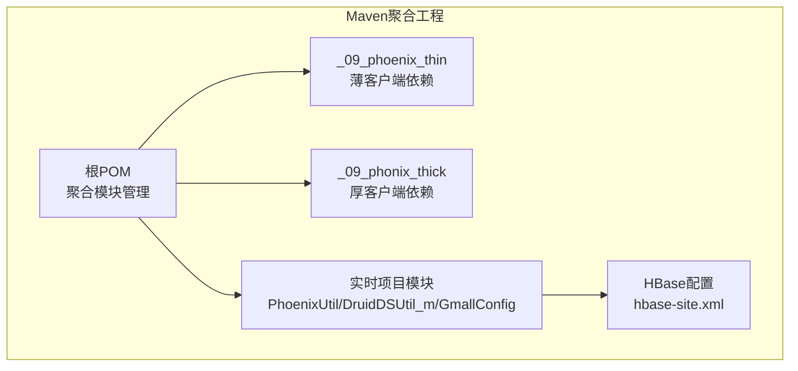
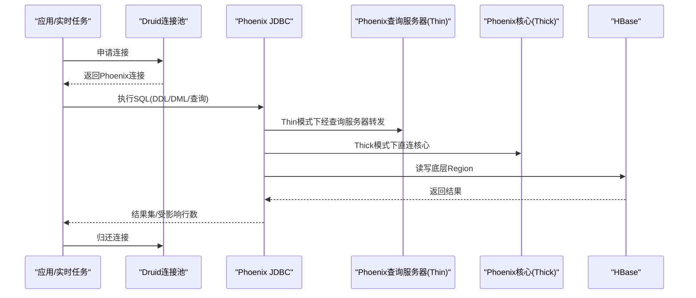
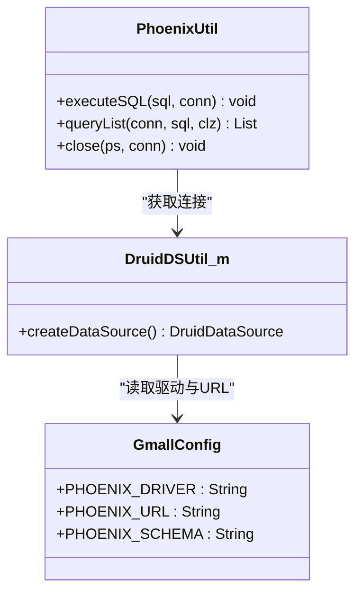
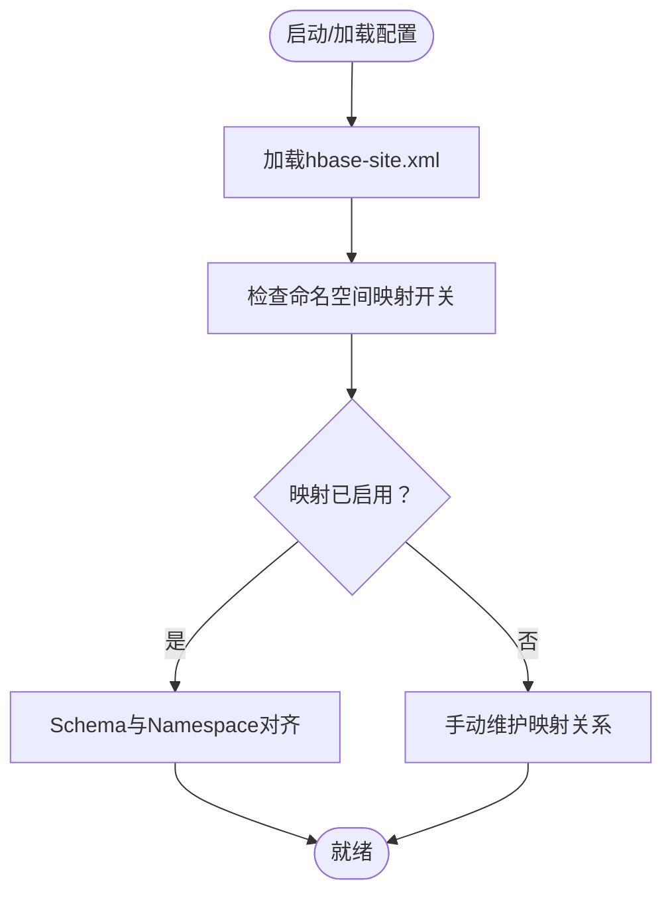
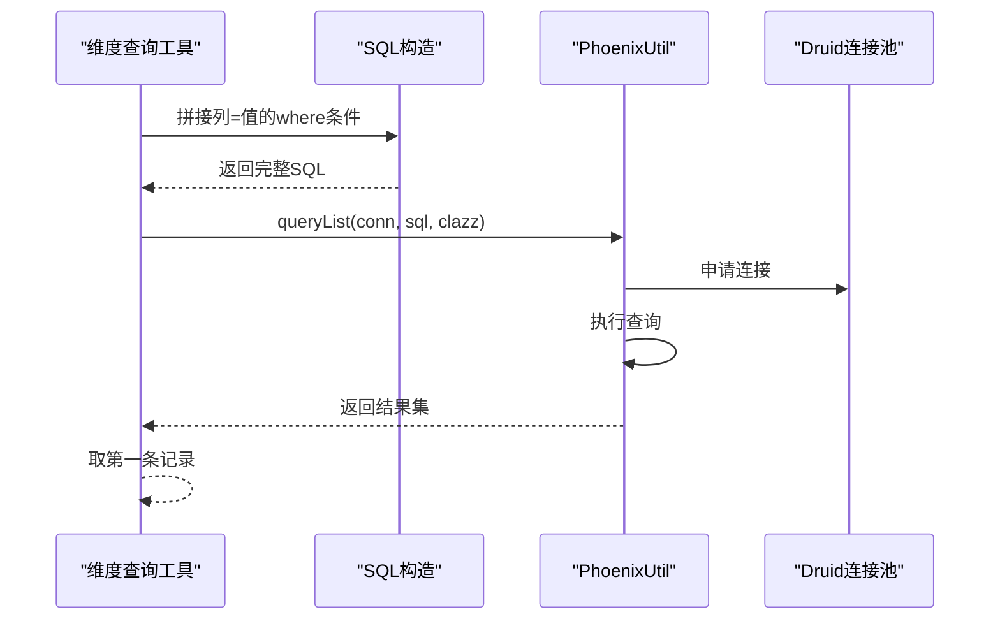
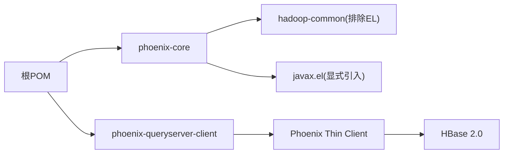

# Phoenix性能优化

<cite>
**本文引用的文件**
- [pom.xml](file://pom.xml)
- [_09_phoenix_thin/pom.xml](file://_09_phoenix_thin/pom.xml)
- [_09_phonix_thick/pom.xml](file://_09_phonix_thick/pom.xml)
- [phoenix-core-5.0.0-HBase-2.0.pom](file://org/apache/phoenix/phoenix-core/5.0.0-HBase-2.0/phoenix-core-5.0.0-HBase-2.0.pom)
- [phoenix-queryserver-client-5.0.0-HBase-2.0.pom](file://org/apache/phoenix/phoenix-queryserver-client/5.0.0-HBase-2.0/phoenix-queryserver-client-5.0.0-HBase-2.0.pom)
- [PhoenixUtil.java](file://_200_flinkRealtime/src/main/java/com/atguigu/gmall/realtime/util/PhoenixUtil.java)
- [DruidDSUtil_m.java](file://_200_flinkRealtime/src/main/java/com/atguigu/gmall/realtime/util/DruidDSUtil_m.java)
- [GmallConfig.java](file://_200_flinkRealtime/src/main/java/com/atguigu/gmall/realtime/common/GmallConfig.java)
- [hbase-site.xml](file://_200_flinkRealtime/src/main/resources/hbase-site.xml)
- [hbase-site.xml](file://_200_flinkRealtime0106/src/main/resources/hbase-site.xml)
- [hbase-site.xml](file://_300_eduRealtime/src/main/resources/hbase-site.xml)
- [DimUtil_m_0715.java](file://_200_flinkRealtime/src/main/java/com/atguigu/gmall/realtime/util/DimUtil_m_0715.java)
</cite>

## 目录
1. [简介](#简介)
2. [项目结构](#项目结构)
3. [核心组件](#核心组件)
4. [架构总览](#架构总览)
5. [详细组件分析](#详细组件分析)
6. [依赖关系分析](#依赖关系分析)
7. [性能考量](#性能考量)
8. [故障排查指南](#故障排查指南)
9. [结论](#结论)
10. [附录](#附录)

## 简介
本技术文档聚焦于Phoenix在生产环境中的性能优化实践，围绕查询优化策略（索引设计与使用）、执行计划分析（EXPLAIN）、批量操作（插入/更新/删除）最佳实践、连接池配置与管理、Phoenix与HBase集成优化（表设计、区域与数据分布）、监控与诊断工具使用，以及内存、网络与存储层面的优化建议展开。文档以仓库中实际存在的模块与配置为依据，结合可落地的工程实践，帮助读者快速定位瓶颈并实施优化。

## 项目结构
该仓库采用Maven多模块组织方式，Phoenix相关能力通过“薄客户端”与“厚客户端”两种形态引入，并在实时项目中通过Druid连接池与Phoenix JDBC进行交互；同时包含HBase命名空间映射配置，便于Phoenix Schema与HBase Namespace的对齐。

图示来源
- [pom.xml](file://pom.xml#L14-L50)
- [_09_phoenix_thin/pom.xml](file://_09_phoenix_thin/pom.xml#L1-L27)
- [_09_phonix_thick/pom.xml](file://_09_phonix_thick/pom.xml#L1-L51)
- [PhoenixUtil.java](file://_200_flinkRealtime/src/main/java/com/atguigu/gmall/realtime/util/PhoenixUtil.java#L1-L117)
- [DruidDSUtil_m.java](file://_200_flinkRealtime/src/main/java/com/atguigu/gmall/realtime/util/DruidDSUtil_m.java#L1-L53)
- [GmallConfig.java](file://_200_flinkRealtime/src/main/java/com/atguigu/gmall/realtime/common/GmallConfig.java#L1-L16)
- [hbase-site.xml](file://_200_flinkRealtime/src/main/resources/hbase-site.xml#L1-L14)

章节来源
- [pom.xml](file://pom.xml#L14-L50)

## 核心组件
- Phoenix薄客户端与厚客户端
  - 薄客户端：通过查询服务器客户端进行JDBC访问，适合对外服务或轻量接入。
  - 厚客户端：直接依赖核心库，适合需要更深度集成与自定义扩展的场景。
- 连接池与JDBC工具
  - 使用Druid作为Phoenix JDBC连接池，集中管理连接生命周期、空闲回收与验证策略。
  - PhoenixUtil封装了通用的DDL/DML执行与查询列表解析逻辑，统一资源关闭。
- 配置与命名空间映射
  - 通过HBase配置启用Phoenix Schema与HBase Namespace映射，确保Schema可见性与一致性。

章节来源
- [_09_phoenix_thin/pom.xml](file://_09_phoenix_thin/pom.xml#L1-L27)
- [_09_phonix_thick/pom.xml](file://_09_phonix_thick/pom.xml#L1-L51)
- [phoenix-core-5.0.0-HBase-2.0.pom](file://org/apache/phoenix/phoenix-core/5.0.0-HBase-2.0/phoenix-core-5.0.0-HBase-2.0.pom#L1-L160)
- [phoenix-queryserver-client-5.0.0-HBase-2.0.pom](file://org/apache/phoenix/phoenix-queryserver-client/5.0.0-HBase-2.0/phoenix-queryserver-client-5.0.0-HBase-2.0.pom#L1-L34)
- [DruidDSUtil_m.java](file://_200_flinkRealtime/src/main/java/com/atguigu/gmall/realtime/util/DruidDSUtil_m.java#L1-L53)
- [PhoenixUtil.java](file://_200_flinkRealtime/src/main/java/com/atguigu/gmall/realtime/util/PhoenixUtil.java#L1-L117)
- [GmallConfig.java](file://_200_flinkRealtime/src/main/java/com/atguigu/gmall/realtime/common/GmallConfig.java#L1-L16)
- [hbase-site.xml](file://_200_flinkRealtime/src/main/resources/hbase-site.xml#L1-L14)

## 架构总览
Phoenix在本项目中的典型调用链路如下：应用层通过Druid连接池获取Phoenix连接，执行SQL（DDL/DML/查询），并在实时任务中按需进行维度表查询与回写。

图示来源
- [DruidDSUtil_m.java](file://_200_flinkRealtime/src/main/java/com/atguigu/gmall/realtime/util/DruidDSUtil_m.java#L1-L53)
- [PhoenixUtil.java](file://_200_flinkRealtime/src/main/java/com/atguigu/gmall/realtime/util/PhoenixUtil.java#L1-L117)
- [_09_phoenix_thin/pom.xml](file://_09_phoenix_thin/pom.xml#L1-L27)
- [_09_phonix_thick/pom.xml](file://_09_phonix_thick/pom.xml#L1-L51)

## 详细组件分析

### 组件A：Phoenix连接池与JDBC工具
- 设计要点
  - 使用Druid集中管理Phoenix连接，设置初始连接数、最大活跃连接、最小空闲、等待超时与空闲回收周期。
  - 通过验证查询保持连接健康，避免借用/归还时做昂贵的校验，提升吞吐。
  - PhoenixUtil统一封装SQL执行与资源回收，降低泄漏风险。
- 性能影响
  - 合理的池大小与回收策略可显著降低连接建立开销与上下文切换。
  - 关闭策略应避免在借用/归还时进行复杂校验，减少RTT与CPU消耗。

图示来源
- [DruidDSUtil_m.java](file://_200_flinkRealtime/src/main/java/com/atguigu/gmall/realtime/util/DruidDSUtil_m.java#L1-L53)
- [PhoenixUtil.java](file://_200_flinkRealtime/src/main/java/com/atguigu/gmall/realtime/util/PhoenixUtil.java#L1-L117)
- [GmallConfig.java](file://_200_flinkRealtime/src/main/java/com/atguigu/gmall/realtime/common/GmallConfig.java#L1-L16)

章节来源
- [DruidDSUtil_m.java](file://_200_flinkRealtime/src/main/java/com/atguigu/gmall/realtime/util/DruidDSUtil_m.java#L1-L53)
- [PhoenixUtil.java](file://_200_flinkRealtime/src/main/java/com/atguigu/gmall/realtime/util/PhoenixUtil.java#L1-L117)
- [GmallConfig.java](file://_200_flinkRealtime/src/main/java/com/atguigu/gmall/realtime/common/GmallConfig.java#L1-L16)

### 组件B：Phoenix与HBase集成配置
- 设计要点
  - 启用Schema与Namespace映射，使Phoenix Schema与HBase Namespace一致，简化运维与权限模型。
  - 在多套环境中同步配置文件，确保各节点一致生效。
- 性能影响
  - 映射启用后，Phoenix可直接基于Namespace进行表发现与访问，减少跨层转换成本。

图示来源
- [hbase-site.xml](file://_200_flinkRealtime/src/main/resources/hbase-site.xml#L1-L14)
- [hbase-site.xml](file://_200_flinkRealtime0106/src/main/resources/hbase-site.xml#L1-L12)
- [hbase-site.xml](file://_300_eduRealtime/src/main/resources/hbase-site.xml#L1-L12)

章节来源
- [hbase-site.xml](file://_200_flinkRealtime/src/main/resources/hbase-site.xml#L1-L14)
- [hbase-site.xml](file://_200_flinkRealtime0106/src/main/resources/hbase-site.xml#L1-L12)
- [hbase-site.xml](file://_300_eduRealtime/src/main/resources/hbase-site.xml#L1-L12)

### 组件C：维度查询与SQL构造
- 设计要点
  - 将维度键值拼接为等值条件，构造精确查询，利于走主键或二级索引。
  - 通过PhoenixUtil统一执行查询，减少重复代码与资源泄漏风险。
- 性能影响
  - 等值过滤优于范围扫描，配合合适索引可显著降低扫描行数与RTT。

图示来源
- [DimUtil_m_0715.java](file://_200_flinkRealtime/src/main/java/com/atguigu/gmall/realtime/util/DimUtil_m_0715.java#L125-L150)
- [PhoenixUtil.java](file://_200_flinkRealtime/src/main/java/com/atguigu/gmall/realtime/util/PhoenixUtil.java#L58-L109)
- [DruidDSUtil_m.java](file://_200_flinkRealtime/src/main/java/com/atguigu/gmall/realtime/util/DruidDSUtil_m.java#L1-L53)

章节来源
- [DimUtil_m_0715.java](file://_200_flinkRealtime/src/main/java/com/atguigu/gmall/realtime/util/DimUtil_m_0715.java#L125-L150)
- [PhoenixUtil.java](file://_200_flinkRealtime/src/main/java/com/atguigu/gmall/realtime/util/PhoenixUtil.java#L58-L109)

## 依赖关系分析
- 模块依赖
  - 根POM聚合多个子模块，其中Phoenix薄/厚客户端分别以独立模块引入，便于按需选择。
- 第三方依赖
  - Phoenix核心与查询服务器客户端均明确版本，确保与HBase 2.0兼容。
  - Druid作为连接池，提供连接复用与健康检查能力。

图示来源
- [pom.xml](file://pom.xml#L14-L50)
- [_09_phoenix_thin/pom.xml](file://_09_phoenix_thin/pom.xml#L1-L27)
- [_09_phonix_thick/pom.xml](file://_09_phonix_thick/pom.xml#L1-L51)
- [phoenix-core-5.0.0-HBase-2.0.pom](file://org/apache/phoenix/phoenix-core/5.0.0-HBase-2.0/phoenix-core-5.0.0-HBase-2.0.pom#L1-L160)
- [phoenix-queryserver-client-5.0.0-HBase-2.0.pom](file://org/apache/phoenix/phoenix-queryserver-client/5.0.0-HBase-2.0/phoenix-queryserver-client-5.0.0-HBase-2.0.pom#L1-L34)

章节来源
- [pom.xml](file://pom.xml#L14-L50)
- [_09_phoenix_thin/pom.xml](file://_09_phoenix_thin/pom.xml#L1-L27)
- [_09_phonix_thick/pom.xml](file://_09_phonix_thick/pom.xml#L1-L51)
- [phoenix-core-5.0.0-HBase-2.0.pom](file://org/apache/phoenix/phoenix-core/5.0.0-HBase-2.0/phoenix-core-5.0.0-HBase-2.0.pom#L1-L160)
- [phoenix-queryserver-client-5.0.0-HBase-2.0.pom](file://org/apache/phoenix/phoenix-queryserver-client/5.0.0-HBase-2.0/phoenix-queryserver-client-5.0.0-HBase-2.0.pom#L1-L34)

## 性能考量
- 查询优化策略
  - 索引设计原则
    - 主键/唯一键优先：确保等值过滤命中主键，避免全表扫描。
    - 前缀匹配与覆盖索引：对高频过滤列建立二级索引，必要时使用覆盖索引减少回表。
    - 列族与顺序：热点列尽量前置，避免大字段参与排序/分组。
  - EXPLAIN分析方法
    - 使用EXPLAIN查看执行计划，关注是否发生全表扫描、是否使用了期望的索引、是否有多余的排序/连接步骤。
    - 结合EXPLAIN PLAN（如适用）对比不同谓词顺序与索引组合的效果。
- 批量操作最佳实践
  - 批量插入：使用批量提交与合适的批量大小，避免单条INSERT带来的网络与事务开销。
  - 批量更新/删除：尽量使用等值条件与批量写入接口，减少往返次数；必要时使用UPSERT SELECT或批量DDL。
- 连接池配置与管理
  - 连接数：根据并发请求峰值与HBase RegionServer承载能力设定最大活跃连接，避免过度竞争。
  - 超时配置：合理设置借用等待超时与空闲回收周期，平衡资源占用与延迟。
  - 资源回收：启用空闲连接回收与健康检查，定期剔除失效连接。
- Phoenix与HBase集成优化
  - 表设计：宽表拆分、列族分离、冷热数据分层；避免超大行键与超长列。
  - 区域分布：合理设置表预分区，避免热点Region；结合业务键模式选择合适的Salt/RowKey策略。
  - 数据分布：热点键去抖、写放大控制、合并策略与压缩参数调优。
- 监控与诊断
  - 连接池指标：活跃连接数、等待队列长度、借用/归还耗时、连接回收率。
  - Phoenix/HBase指标：RPC延迟、Region负载、扫描/过滤命中率、GC与堆外内存。
  - 诊断手段：慢查询日志、EXPLAIN输出、JVM与操作系统层面的火焰图/追踪。
- 内存、网络与存储优化
  - 内存：调整Phoenix与HBase的堆大小、Off-Heap缓存比例，避免频繁GC与内存溢出。
  - 网络：批量发送、压缩传输、合理的超时与重试策略。
  - 存储：段合并策略、压缩算法选择、磁盘IO调度优化。

## 故障排查指南
- 连接问题
  - 现象：借用连接超时、连接频繁断开。
  - 排查：检查池内最大活跃连接是否过低、等待超时是否合理、验证查询是否有效、确认HBase服务状态。
- 查询缓慢
  - 现象：慢查询增多、RTT偏高。
  - 排查：使用EXPLAIN核对执行路径，确认索引使用情况；检查是否存在全表扫描或不必要的排序/连接。
- 内存与GC问题
  - 现象：频繁Full GC、OOM。
  - 排查：检查Phoenix/HBase堆与Off-Heap配置，评估批量大小与序列化开销，优化对象生命周期。
- HBase热点与Region压力
  - 现象：个别Region负载过高、写入延迟飙升。
  - 排查：检查RowKey设计与预分区策略，确认是否存在写放大与合并风暴。

章节来源
- [DruidDSUtil_m.java](file://_200_flinkRealtime/src/main/java/com/atguigu/gmall/realtime/util/DruidDSUtil_m.java#L1-L53)
- [PhoenixUtil.java](file://_200_flinkRealtime/src/main/java/com/atguigu/gmall/realtime/util/PhoenixUtil.java#L1-L117)
- [hbase-site.xml](file://_200_flinkRealtime/src/main/resources/hbase-site.xml#L1-L14)

## 结论
通过薄/厚客户端的合理选型、Druid连接池的精细化配置、严格的索引与SQL设计、以及Phoenix与HBase的协同优化，可在大规模OLTP/OLAP场景中获得稳定且高效的查询与写入性能。结合EXPLAIN与监控体系，能够持续定位瓶颈并迭代优化。

## 附录
- 关键配置项参考
  - 连接池关键参数：初始大小、最大活跃、最小空闲、等待超时、空闲回收周期、验证查询。
  - HBase命名空间映射：Schema映射开关、系统表映射开关。
- 工程实践建议
  - 将连接池与Phoenix URL/驱动常量化管理，避免硬编码。
  - 统一SQL构造与资源回收逻辑，减少重复代码与风险点。
  - 在上线前进行压测与EXPLAIN回归，形成基线与阈值。