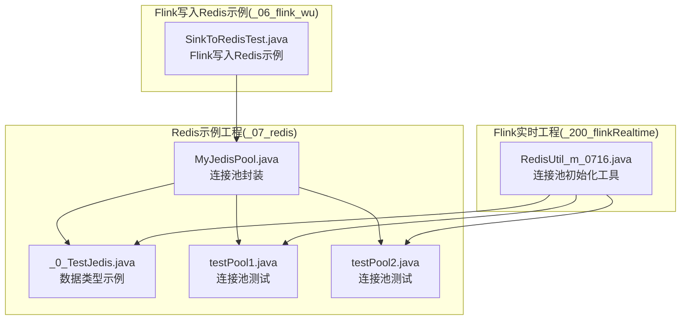
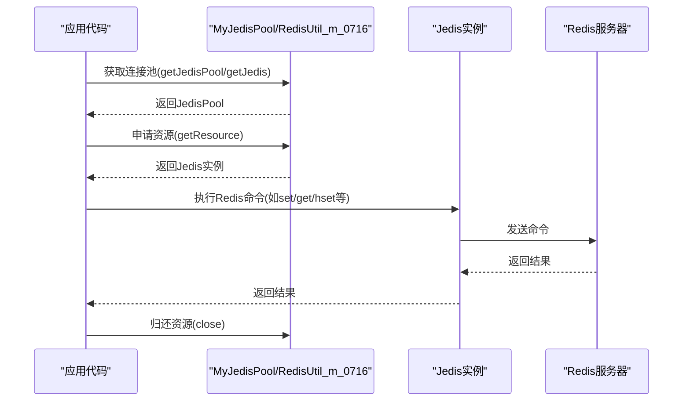
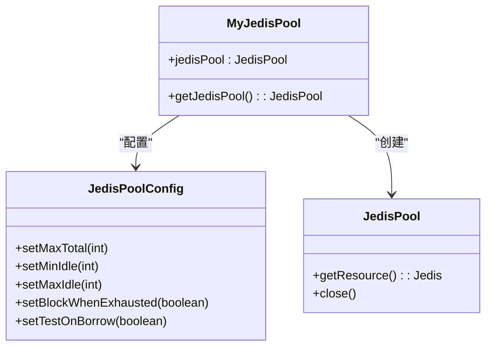
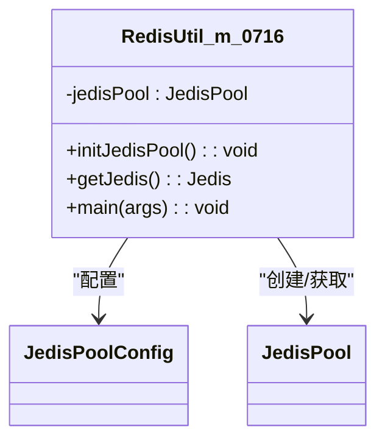
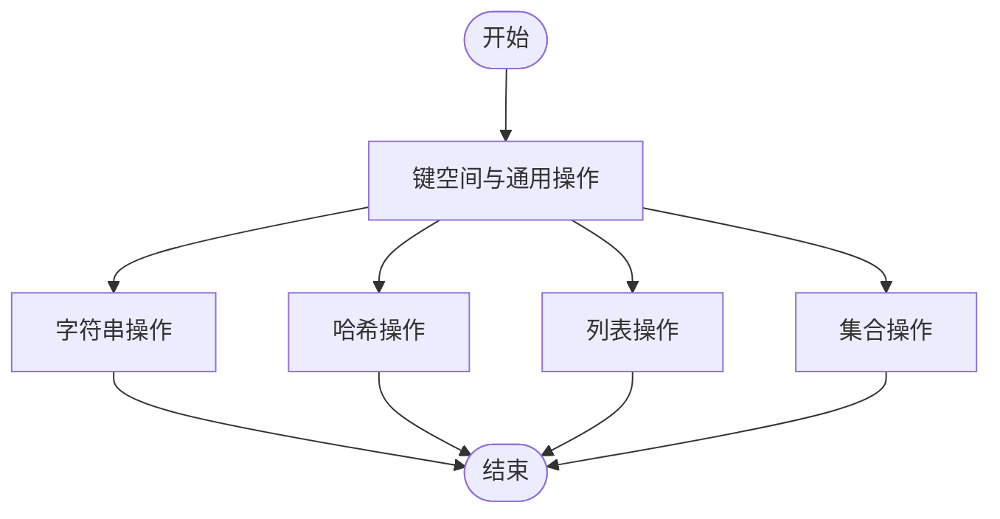
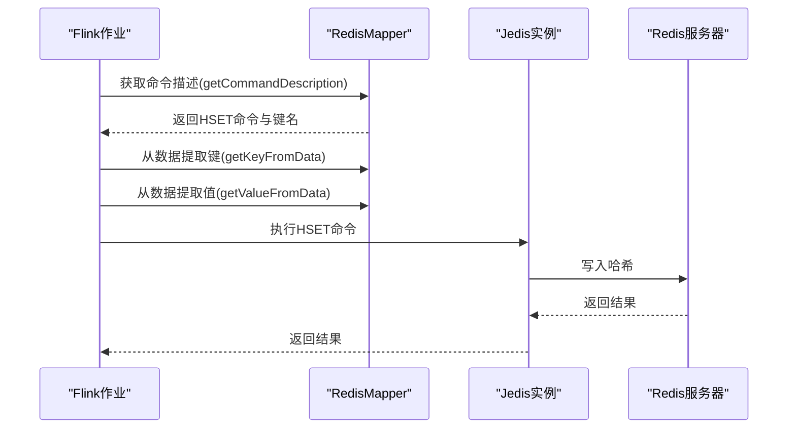
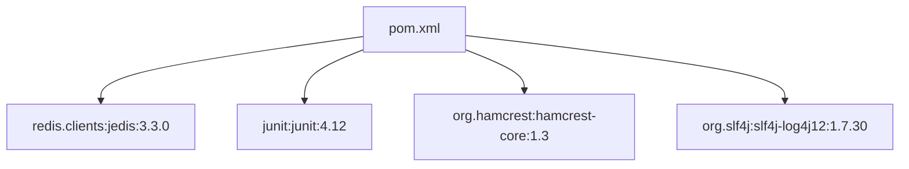

# Redis缓存系统

<cite>
**本文引用的文件**
- [MyJedisPool.java](file://_07_redis/src/main/java/MyJedisPool.java)
- [_0_TestJedis.java](file://_07_redis/src/main/java/_0_TestJedis.java)
- [testPool1.java](file://_07_redis/src/main/java/testPool1.java)
- [testPool2.java](file://_07_redis/src/main/java/testPool2.java)
- [RedisUtil_m_0716.java](file://_200_flinkRealtime/src/main/java/com/atguigu/gmall/realtime/util/RedisUtil_m_0716.java)
- [pom.xml](file://_07_redis/pom.xml)
- [SinkToRedisTest.java](file://_06_flink_wu/src/main/java/com/atguigu/chapter05/SinkToRedisTest.java)
</cite>

## 目录
1. [简介](#简介)
2. [项目结构](#项目结构)
3. [核心组件](#核心组件)
4. [架构总览](#架构总览)
5. [组件详解](#组件详解)
6. [依赖关系分析](#依赖关系分析)
7. [性能与优化](#性能与优化)
8. [故障排查指南](#故障排查指南)
9. [结论](#结论)
10. [附录](#附录)

## 简介
本技术文档围绕Redis缓存系统展开，结合仓库中的Jedis连接池实现与示例代码，系统讲解Redis作为高性能缓存的架构特性、数据结构与使用模式，并深入解析连接池管理机制（如MyJedisPool的实现原理、连接复用策略与资源管理）。文档同时提供API使用指南（字符串、哈希、列表、集合等），并给出在大数据应用中使用Redis进行缓存加速的实践建议，覆盖缓存策略、过期时间设置、持久化选项、性能优化、高可用部署（集群、主从复制、故障转移）等主题。

## 项目结构
该仓库中与Redis相关的核心模块位于“_07_redis”工程，包含连接池封装与多种数据类型操作示例；另有“_200_flinkRealtime”工程中的Redis工具类用于初始化连接池；以及“_06_flink_wu”工程中的Flink写入Redis示例。

图表来源
- [MyJedisPool.java](file://_07_redis/src/main/java/MyJedisPool.java#L1-L26)
- [_0_TestJedis.java](file://_07_redis/src/main/java/_0_TestJedis.java#L1-L272)
- [testPool1.java](file://_07_redis/src/main/java/testPool1.java#L1-L18)
- [testPool2.java](file://_07_redis/src/main/java/testPool2.java#L1-L18)
- [RedisUtil_m_0716.java](file://_200_flinkRealtime/src/main/java/com/atguigu/gmall/realtime/util/RedisUtil_m_0716.java#L1-L64)
- [SinkToRedisTest.java](file://_06_flink_wu/src/main/java/com/atguigu/chapter05/SinkToRedisTest.java#L32-L52)

章节来源
- [MyJedisPool.java](file://_07_redis/src/main/java/MyJedisPool.java#L1-L26)
- [_0_TestJedis.java](file://_07_redis/src/main/java/_0_TestJedis.java#L1-L272)
- [testPool1.java](file://_07_redis/src/main/java/testPool1.java#L1-L18)
- [testPool2.java](file://_07_redis/src/main/java/testPool2.java#L1-L18)
- [RedisUtil_m_0716.java](file://_200_flinkRealtime/src/main/java/com/atguigu/gmall/realtime/util/RedisUtil_m_0716.java#L1-L64)
- [SinkToRedisTest.java](file://_06_flink_wu/src/main/java/com/atguigu/chapter05/SinkToRedisTest.java#L32-L52)

## 核心组件
- 连接池封装：MyJedisPool提供静态单例JedisPool的懒加载与配置，便于全局复用。
- 数据类型示例：_0_TestJedis集中演示了键空间、字符串、哈希、列表、集合等常用操作。
- 连接池工具：RedisUtil_m_0716提供更完善的连接池初始化与获取逻辑，适合生产环境参考。
- 写入示例：SinkToRedisTest展示了Flink将事件写入Redis的典型流程。

章节来源
- [MyJedisPool.java](file://_07_redis/src/main/java/MyJedisPool.java#L1-L26)
- [_0_TestJedis.java](file://_07_redis/src/main/java/_0_TestJedis.java#L1-L272)
- [RedisUtil_m_0716.java](file://_200_flinkRealtime/src/main/java/com/atguigu/gmall/realtime/util/RedisUtil_m_0716.java#L1-L64)
- [SinkToRedisTest.java](file://_06_flink_wu/src/main/java/com/atguigu/chapter05/SinkToRedisTest.java#L32-L52)

## 架构总览
下图展示了应用通过连接池获取Jedis实例，执行Redis命令，以及与Flink写入流程的关系。

图表来源
- [MyJedisPool.java](file://_07_redis/src/main/java/MyJedisPool.java#L1-L26)
- [_0_TestJedis.java](file://_07_redis/src/main/java/_0_TestJedis.java#L1-L272)
- [RedisUtil_m_0716.java](file://_200_flinkRealtime/src/main/java/com/atguigu/gmall/realtime/util/RedisUtil_m_0716.java#L1-L64)
- [SinkToRedisTest.java](file://_06_flink_wu/src/main/java/com/atguigu/chapter05/SinkToRedisTest.java#L32-L52)

## 组件详解

### 连接池管理：MyJedisPool
- 设计要点
  - 懒汉式单例：首次使用时创建JedisPoolConfig与JedisPool，避免启动即占用资源。
  - 资源控制：setMaxTotal、setMinIdle、setMaxIdle用于限制连接总量与空闲数量，平衡性能与资源。
  - 行为策略：setBlockWhenExhausted(false)表示当连接耗尽时不阻塞；setTestOnBorrow(true)确保借出连接可用性。
  - 地址与端口：默认连接"hadoop102:6379"，可按需调整。
- 使用建议
  - 在生产环境中建议提升最大连接数与最小空闲数，并开启阻塞等待与超时控制。
  - 结合健康检查与异常重试策略，增强稳定性。

图表来源
- [MyJedisPool.java](file://_07_redis/src/main/java/MyJedisPool.java#L1-L26)

章节来源
- [MyJedisPool.java](file://_07_redis/src/main/java/MyJedisPool.java#L1-L26)

### 连接池工具：RedisUtil_m_0716
- 设计要点
  - 初始化方法initJedisPool集中配置连接池参数，支持更大规模并发。
  - getJedis方法在懒加载基础上提供获取Jedis实例的能力，便于统一管理。
  - 注释说明了连接池容量变化与等待队列的行为特征，有助于理解池内动态。
- 生产建议
  - 设置合理的最大等待时间与阻塞策略，避免请求长时间挂起。
  - 结合监控指标（活跃连接、等待队列长度、拒绝次数）持续优化配置。

图表来源
- [RedisUtil_m_0716.java](file://_200_flinkRealtime/src/main/java/com/atguigu/gmall/realtime/util/RedisUtil_m_0716.java#L1-L64)

章节来源
- [RedisUtil_m_0716.java](file://_200_flinkRealtime/src/main/java/com/atguigu/gmall/realtime/util/RedisUtil_m_0716.java#L1-L64)

### 数据类型与API使用指南
- 键空间与通用操作
  - 键空间：set、get、del、exists、type、dbSize、expire、ttl、keys等。
  - 字符串：append、strlen、setnx、incr/decr、msetnx、mget、getrange、setrange、getset等。
  - 哈希：hset、hmset、hget、hgetAll、hexists、hincrBy、hkeys、hvals等。
  - 列表：lpush/lpop、lindex、llen、linsert、lrem、lrange等。
  - 集合：sadd、smembers、sismember、scard、srem、spop、srandmember、sunionstore、sinterstore、sdiff等。
- 使用示例路径
  - 键空间与字符串操作示例：见[_0_TestJedis.java](file://_07_redis/src/main/java/_0_TestJedis.java#L1-L103)
  - 字符串扩展操作示例：见[_0_TestJedis.java](file://_07_redis/src/main/java/_0_TestJedis.java#L107-L119)
  - 列表操作示例：见[_0_TestJedis.java](file://_07_redis/src/main/java/_0_TestJedis.java#L122-L151)
  - 集合操作示例：见[_0_TestJedis.java](file://_07_redis/src/main/java/_0_TestJedis.java#L155-L200)
  - 哈希操作示例：见[_0_TestJedis.java](file://_07_redis/src/main/java/_0_TestJedis.java#L206-L239)
  - 连续申请资源导致异常的验证：见[_0_TestJedis.java](file://_07_redis/src/main/java/_0_TestJedis.java#L242-L272)、[testPool1.java](file://_07_redis/src/main/java/testPool1.java#L1-L18)、[testPool2.java](file://_07_redis/src/main/java/testPool2.java#L1-L18)

图表来源
- [_0_TestJedis.java](file://_07_redis/src/main/java/_0_TestJedis.java#L1-L272)

章节来源
- [_0_TestJedis.java](file://_07_redis/src/main/java/_0_TestJedis.java#L1-L272)
- [testPool1.java](file://_07_redis/src/main/java/testPool1.java#L1-L18)
- [testPool2.java](file://_07_redis/src/main/java/testPool2.java#L1-L18)

### Flink写入Redis示例
- 关键点
  - 使用RedisMapper定义命令类型与键值映射，将事件写入Redis哈希。
  - 通过Flink作业执行，实现流式数据的缓存写入。
- 示例路径
  - 见[SinkToRedisTest.java](file://_06_flink_wu/src/main/java/com/atguigu/chapter05/SinkToRedisTest.java#L32-L52)

图表来源
- [SinkToRedisTest.java](file://_06_flink_wu/src/main/java/com/atguigu/chapter05/SinkToRedisTest.java#L32-L52)

章节来源
- [SinkToRedisTest.java](file://_06_flink_wu/src/main/java/com/atguigu/chapter05/SinkToRedisTest.java#L32-L52)

## 依赖关系分析
- 依赖声明
  - Jedis客户端：用于与Redis交互。
  - 单元测试框架：JUnit与Hamcrest，用于测试。
  - 日志：SLF4J绑定Log4j12。
  - 其他数据库驱动：与Redis无直接关系，但体现工程多技术栈集成。
- 依赖路径
  - 见[pom.xml](file://_07_redis/pom.xml#L1-L56)

图表来源
- [pom.xml](file://_07_redis/pom.xml#L1-L56)

章节来源
- [pom.xml](file://_07_redis/pom.xml#L1-L56)

## 性能与优化
- 连接池优化
  - 合理设置最大连接数与最小空闲数，避免频繁创建销毁连接。
  - 开启阻塞等待与合理超时，防止请求堆积。
  - 借出连接时进行有效性校验，减少无效连接带来的失败重试。
- 缓存策略
  - LRU/LFU：可通过Redis配置项或外部策略实现，结合业务热点数据选择合适淘汰策略。
  - 过期时间：对不同业务设置合理的TTL，避免内存长期占用。
  - 持久化：RDB与AOF结合使用，权衡恢复速度与数据安全。
- 并发与网络
  - 减少跨网络调用次数，合并批量操作。
  - 使用Pipeline或事务减少RTT。
  - 控制单连接并发，避免阻塞其他请求。
- 大数据应用加速
  - 将热点数据预热至Redis，缩短响应时间。
  - 使用多级缓存（本地缓存+Redis）降低后端压力。
  - 对大字段采用压缩或拆分存储，降低带宽与内存占用。

[本节为通用性能建议，无需特定文件引用]

## 故障排查指南
- 连接池耗尽
  - 现象：申请连接时报错或长时间等待。
  - 排查：检查最大连接数、阻塞等待与超时配置；确认未发生资源泄漏。
  - 参考示例：连续申请两次资源导致异常的验证见[_0_TestJedis.java](file://_07_redis/src/main/java/_0_TestJedis.java#L242-L272)、[testPool1.java](file://_07_redis/src/main/java/testPool1.java#L1-L18)、[testPool2.java](file://_07_redis/src/main/java/testPool2.java#L1-L18)。
- 连接不可用
  - 现象：ping失败或读写异常。
  - 排查：检查Redis服务状态、网络连通性与防火墙规则；确认连接池配置的地址与端口正确。
- 资源未归还
  - 现象：连接泄漏导致池耗尽。
  - 排查：确保每次使用完Jedis后调用close归还资源；在异常分支也要保证归还。
- 配置不当
  - 现象：频繁创建销毁连接或等待队列过长。
  - 排查：根据并发峰值调整最大连接数与最小空闲数；启用阻塞等待与合理超时。

章节来源
- [_0_TestJedis.java](file://_07_redis/src/main/java/_0_TestJedis.java#L242-L272)
- [testPool1.java](file://_07_redis/src/main/java/testPool1.java#L1-L18)
- [testPool2.java](file://_07_redis/src/main/java/testPool2.java#L1-L18)

## 结论
本仓库提供了Redis连接池封装与丰富的数据类型操作示例，结合Flink写入Redis的实践，能够帮助开发者快速构建高性能缓存系统。通过合理的连接池配置、缓存策略与性能优化手段，可在大数据场景中显著提升响应速度与吞吐能力。生产环境中建议进一步完善监控、告警与故障演练，确保系统稳定运行。

[本节为总结性内容，无需特定文件引用]

## 附录
- 常用API路径索引
  - 键空间与字符串：见[_0_TestJedis.java](file://_07_redis/src/main/java/_0_TestJedis.java#L1-L103)
  - 字符串扩展：见[_0_TestJedis.java](file://_07_redis/src/main/java/_0_TestJedis.java#L107-L119)
  - 列表：见[_0_TestJedis.java](file://_07_redis/src/main/java/_0_TestJedis.java#L122-L151)
  - 集合：见[_0_TestJedis.java](file://_07_redis/src/main/java/_0_TestJedis.java#L155-L200)
  - 哈希：见[_0_TestJedis.java](file://_07_redis/src/main/java/_0_TestJedis.java#L206-L239)
  - 连接池封装：见[MyJedisPool.java](file://_07_redis/src/main/java/MyJedisPool.java#L1-L26)
  - 连接池工具：见[RedisUtil_m_0716.java](file://_200_flinkRealtime/src/main/java/com/atguigu/gmall/realtime/util/RedisUtil_m_0716.java#L1-L64)
  - Flink写入Redis：见[SinkToRedisTest.java](file://_06_flink_wu/src/main/java/com/atguigu/chapter05/SinkToRedisTest.java#L32-L52)

[本节为索引性内容，无需特定文件引用]