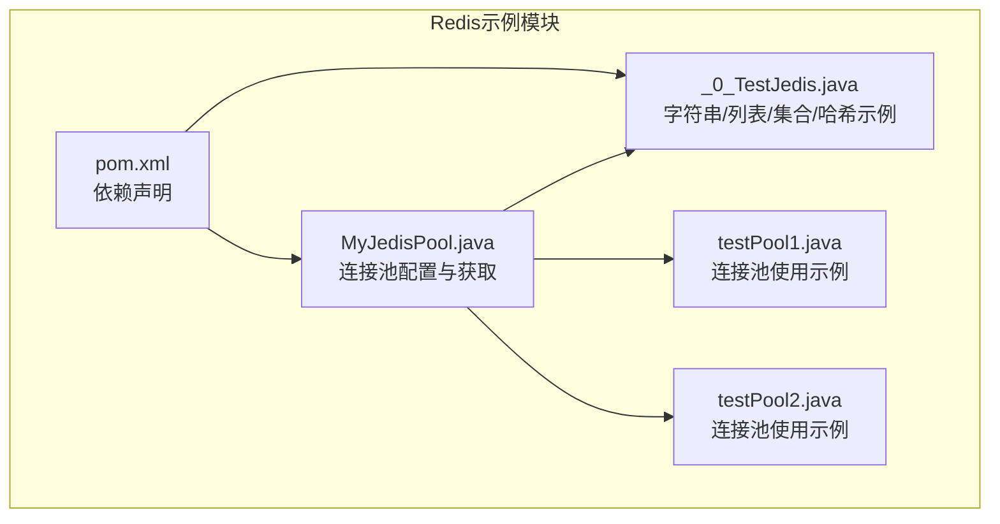
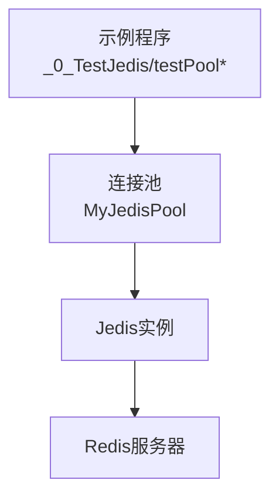
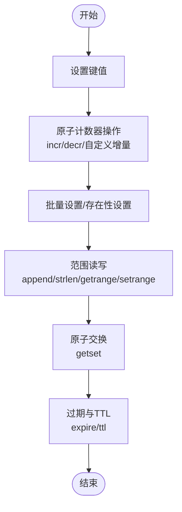
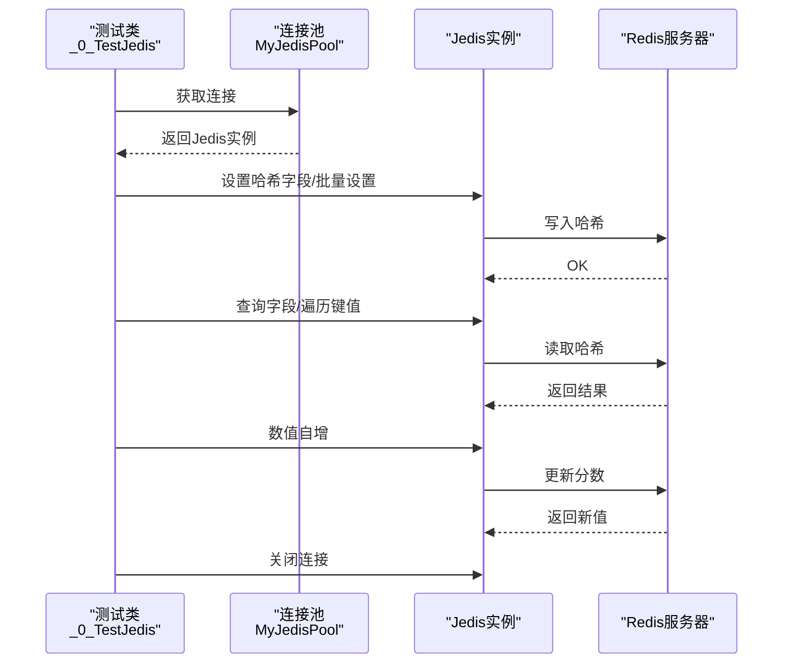
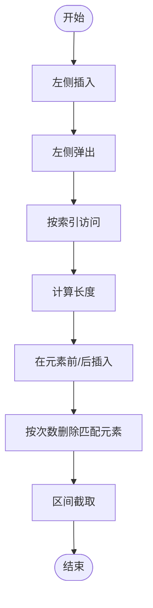
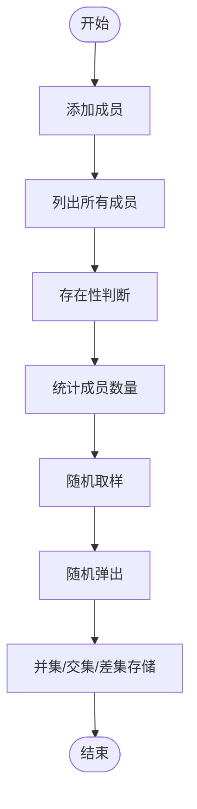
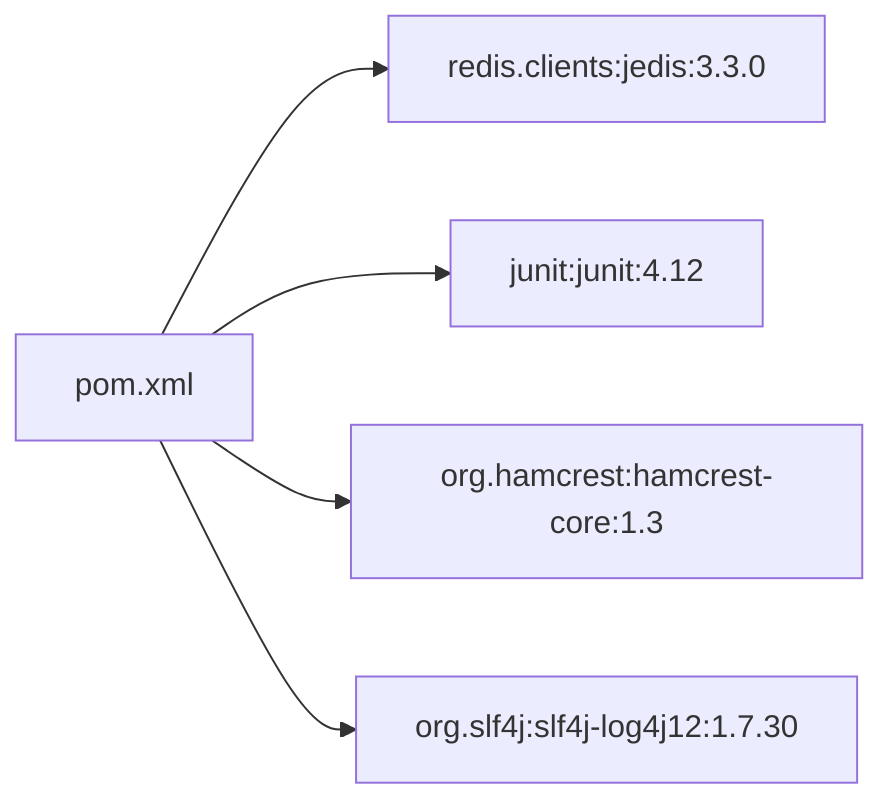

# 基础操作实践

<cite>
**本文引用的文件**
- [_0_TestJedis.java](file://_07_redis/src/main/java/_0_TestJedis.java)
- [MyJedisPool.java](file://_07_redis/src/main/java/MyJedisPool.java)
- [testPool1.java](file://_07_redis/src/main/java/testPool1.java)
- [testPool2.java](file://_07_redis/src/main/java/testPool2.java)
- [pom.xml](file://_07_redis/pom.xml)
</cite>

## 目录
1. [简介](#简介)
2. [项目结构](#项目结构)
3. [核心组件](#核心组件)
4. [架构总览](#架构总览)
5. [详细组件分析](#详细组件分析)
6. [依赖分析](#依赖分析)
7. [性能考虑](#性能考虑)
8. [故障排查指南](#故障排查指南)
9. [结论](#结论)
10. [附录](#附录)

## 简介
本指南围绕Redis五种基本数据类型（字符串、哈希、列表、集合、有序集合）的基础操作展开，结合仓库中的Jedis示例，系统讲解：
- 字符串：增删改查、原子计数器、批量写入、范围读写、原子交换等
- 哈希：字段增删改查、批量设置、数值自增、键值遍历
- 列表：两端插入与弹出、索引访问、区间截取、插入与删除
- 集合：成员添加与删除、存在性判断、随机取样、并交差运算
- 有序集合：分数管理、范围查询、排名与分数区间查询（概念性说明）
同时覆盖命令执行模式、性能特征、错误处理策略、事务与管道优化，以及在大数据场景下的典型用法（缓存穿透、热点数据、过期策略）。

## 项目结构
该模块专注于Redis客户端示例，采用Jedis作为连接与操作客户端，通过连接池统一管理资源，并提供若干测试方法演示不同数据类型的典型操作。

图表来源
- [MyJedisPool.java](file://_07_redis/src/main/java/MyJedisPool.java#L1-L27)
- [_0_TestJedis.java](file://_07_redis/src/main/java/_0_TestJedis.java#L1-L273)
- [testPool1.java](file://_07_redis/src/main/java/testPool1.java#L1-L19)
- [testPool2.java](file://_07_redis/src/main/java/testPool2.java#L1-L18)
- [pom.xml](file://_07_redis/pom.xml#L1-L56)

章节来源
- [MyJedisPool.java](file://_07_redis/src/main/java/MyJedisPool.java#L1-L27)
- [_0_TestJedis.java](file://_07_redis/src/main/java/_0_TestJedis.java#L1-L273)
- [testPool1.java](file://_07_redis/src/main/java/testPool1.java#L1-L19)
- [testPool2.java](file://_07_redis/src/main/java/testPool2.java#L1-L18)
- [pom.xml](file://_07_redis/pom.xml#L1-L56)

## 核心组件
- 连接池管理：集中配置最大连接数、空闲连接数、借还校验等参数，确保线程安全与资源复用。
- 字符串操作：set/get/del/exists/type/ttl/expire、append/strlen、setnx、incr/decr、mset/mget、getrange/setrange、getset。
- 哈希操作：hset/hmset/hgetall/hexists/hincrBy、hkeys/hvals。
- 列表操作：lpush/lpop、llen、lindex、linsert、lrem、lrange。
- 集合操作：sadd/smembers/sismember/scard/srem/spop/srandmember、sunionstore/sinterstore/sdiff。
- 事务与管道：通过Jedis的事务与管道能力实现批处理与原子性保障（概念性说明）。

章节来源
- [_0_TestJedis.java](file://_07_redis/src/main/java/_0_TestJedis.java#L1-L273)
- [MyJedisPool.java](file://_07_redis/src/main/java/MyJedisPool.java#L1-L27)

## 架构总览
下图展示了示例程序与Redis之间的交互关系，以及连接池在其中的作用。

图表来源
- [_0_TestJedis.java](file://_07_redis/src/main/java/_0_TestJedis.java#L1-L273)
- [MyJedisPool.java](file://_07_redis/src/main/java/MyJedisPool.java#L1-L27)

## 详细组件分析

### 字符串（String）操作
- 基本操作：设置、获取、删除、存在性检查、类型查询、数据库大小、TTL与过期设置。
- 原子计数器：自增/自减（需存储可解析为整数的字符串），支持带偏移量的增量。
- 批量操作：批量设置与存在性设置（原子性）、批量获取。
- 范围读写：追加、长度、范围读取、范围覆盖、原子交换。
- 实战要点：使用原子计数器时确保初始值为数字；批量写入建议使用mset/msetnx提升吞吐；注意TTL与过期策略配合使用。

图表来源
- [_0_TestJedis.java](file://_07_redis/src/main/java/_0_TestJedis.java#L1-L119)

章节来源
- [_0_TestJedis.java](file://_07_redis/src/main/java/_0_TestJedis.java#L1-L119)

### 哈希（Hash）操作
- 字段操作：单字段设置、批量设置、字段存在性检查、字段数值自增。
- 遍历与聚合：获取全部字段与值、键集合、值集合。
- 实战要点：适合存储对象属性；数值自增常用于统计类字段；批量设置适合一次性导入。

图表来源
- [_0_TestJedis.java](file://_07_redis/src/main/java/_0_TestJedis.java#L206-L239)
- [MyJedisPool.java](file://_07_redis/src/main/java/MyJedisPool.java#L1-L27)

章节来源
- [_0_TestJedis.java](file://_07_redis/src/main/java/_0_TestJedis.java#L206-L239)

### 列表（List）操作
- 两端操作：左侧/右侧插入、左侧/右侧弹出。
- 访问与截取：按索引访问、计算长度、区间截取。
- 插入与删除：在指定元素前/后插入、按次数删除匹配元素。
- 实战要点：适合队列/栈场景；lindex/lrange适合分页与快照；注意列表长度增长带来的内存压力。

图表来源
- [_0_TestJedis.java](file://_07_redis/src/main/java/_0_TestJedis.java#L122-L153)

章节来源
- [_0_TestJedis.java](file://_07_redis/src/main/java/_0_TestJedis.java#L122-L153)

### 集合（Set）操作
- 成员操作：添加、删除、存在性判断、随机弹出与随机取样。
- 计数与集合运算：成员数量、并集、交集、差集存储。
- 实战要点：天然去重；适合标签、去重统计；集合运算适合跨维度筛选。

图表来源
- [_0_TestJedis.java](file://_07_redis/src/main/java/_0_TestJedis.java#L155-L200)

章节来源
- [_0_TestJedis.java](file://_07_redis/src/main/java/_0_TestJedis.java#L155-L200)

### 有序集合（ZSet）操作（概念性说明）
- 分数与排名：为每个成员维护分数，支持按分数或字典序进行排名查询。
- 范围查询：按分数区间或排名区间查询成员集合。
- 实战要点：适合排行榜、时间序列、优先级队列等场景；注意分数设计与更新策略。

（本节为概念性说明，不直接对应具体源码）

## 依赖分析
- Jedis客户端：提供与Redis交互的API，包括连接池、命令执行、事务与管道等能力。
- 单元测试框架：JUnit用于组织测试用例，便于验证各数据类型的典型操作。
- 日志与监控：SLF4J绑定Log4j，便于输出运行日志与问题定位。

图表来源
- [pom.xml](file://_07_redis/pom.xml#L1-L56)

章节来源
- [pom.xml](file://_07_redis/pom.xml#L1-L56)

## 性能考虑
- 连接池配置
  - 最大连接数与最小空闲：根据并发请求峰值合理设置，避免频繁创建销毁连接。
  - 借还校验：开启borrow时校验连接可用性，降低异常连接导致的失败率。
  - 阻塞策略：根据业务容忍度选择阻塞或立即失败。
- 命令执行模式
  - 同步：命令逐一执行，简单直观，适合低延迟场景。
  - 异步：通过管道（Pipeline）合并请求，减少往返次数，显著提升吞吐。
- 批处理与原子性
  - 使用mset/mget、hmset、lpush/lpop等批量命令减少网络往返。
  - 事务（MULTI/EXEC）保证一组命令的原子性，适用于强一致性需求。
- 数据过期与内存
  - TTL与过期策略：对热点数据设置合理TTL，避免长期占用内存。
  - 缓存穿透防护：对不存在的键设置短TTL或布隆过滤器，减少后端压力。
  - 热点数据处理：对高QPS键进行分片或本地缓存降压。

（本节为通用指导，不直接对应具体源码）

## 故障排查指南
- 连接池相关
  - 连续多次借用同一连接未释放：示例中演示了连续申请两次资源会报错，应确保每次使用完及时关闭连接。
  - 连接不可用：开启borrow校验可提前发现失效连接。
- 命令执行异常
  - 类型不匹配：如对非字符串键执行字符串命令，需先确认键类型。
  - 键不存在：使用存在性检查或默认值策略避免空指针。
- 资源泄漏
  - 每次使用完成后务必关闭Jedis实例，避免连接池耗尽。

章节来源
- [_0_TestJedis.java](file://_07_redis/src/main/java/_0_TestJedis.java#L243-L273)
- [testPool1.java](file://_07_redis/src/main/java/testPool1.java#L1-L19)
- [testPool2.java](file://_07_redis/src/main/java/testPool2.java#L1-L18)
- [MyJedisPool.java](file://_07_redis/src/main/java/MyJedisPool.java#L1-L27)

## 结论
本指南基于仓库中的Jedis示例，系统梳理了Redis五种基本数据类型的典型操作与最佳实践，并结合连接池配置与命令执行模式，给出了性能优化与故障排查建议。实际工程中应结合业务场景选择合适的命令组合与执行策略，确保在高并发与大数据量下保持稳定与高效。

## 附录
- 示例入口与参考路径
  - 字符串与通用键操作：[_0_TestJedis.java](file://_07_redis/src/main/java/_0_TestJedis.java#L1-L119)
  - 列表操作：[_0_TestJedis.java](file://_07_redis/src/main/java/_0_TestJedis.java#L122-L153)
  - 集合操作：[_0_TestJedis.java](file://_07_redis/src/main/java/_0_TestJedis.java#L155-L200)
  - 哈希操作：[_0_TestJedis.java](file://_07_redis/src/main/java/_0_TestJedis.java#L206-L239)
  - 连接池配置：[MyJedisPool.java](file://_07_redis/src/main/java/MyJedisPool.java#L1-L27)
  - 连接池使用示例：[testPool1.java](file://_07_redis/src/main/java/testPool1.java#L1-L19)、[testPool2.java](file://_07_redis/src/main/java/testPool2.java#L1-L18)
  - 依赖声明：[pom.xml](file://_07_redis/pom.xml#L1-L56)