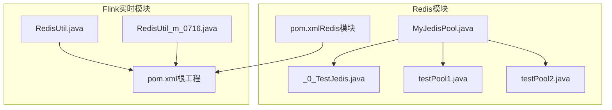
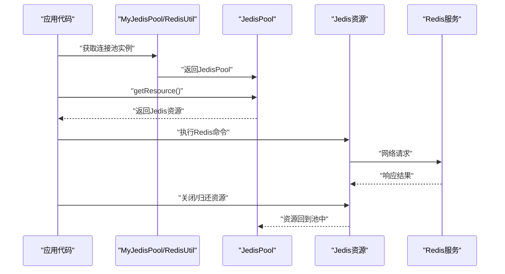
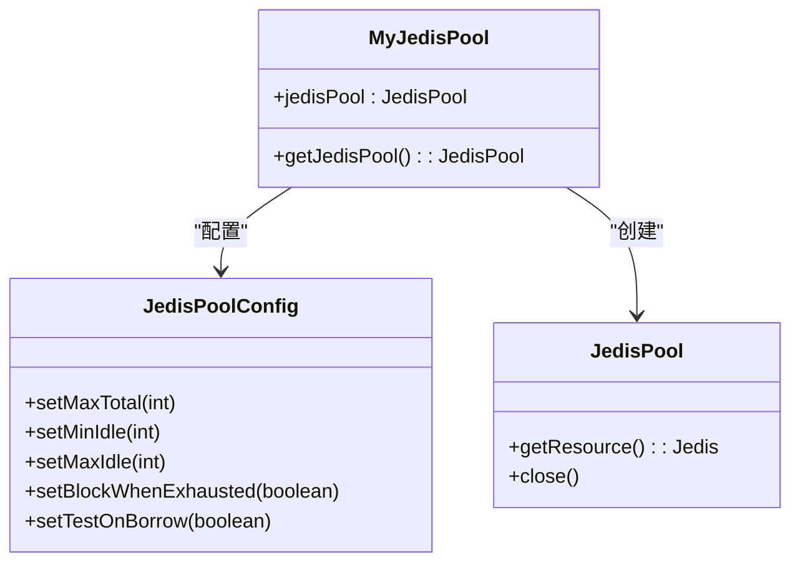
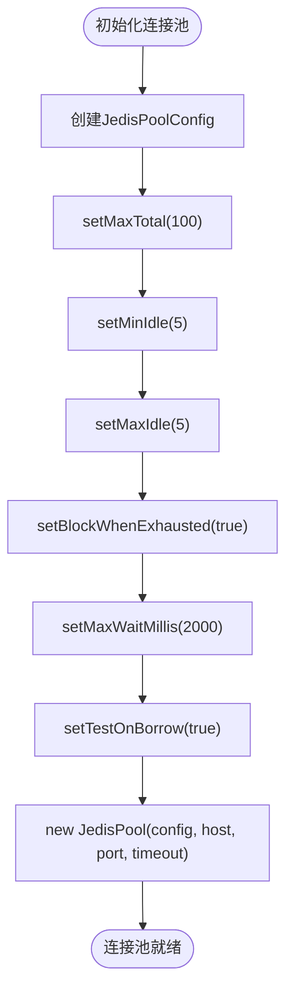
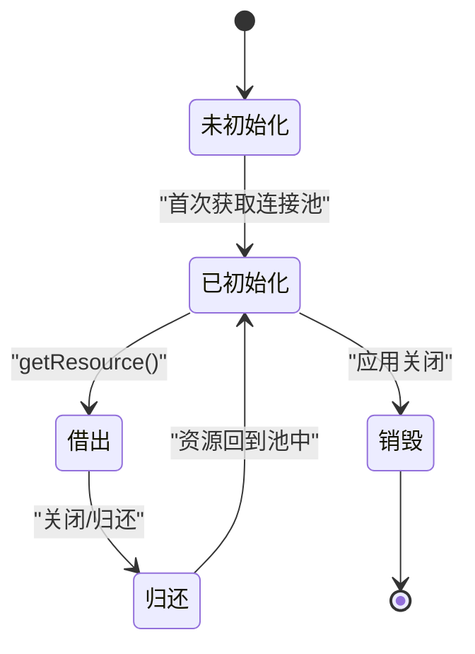
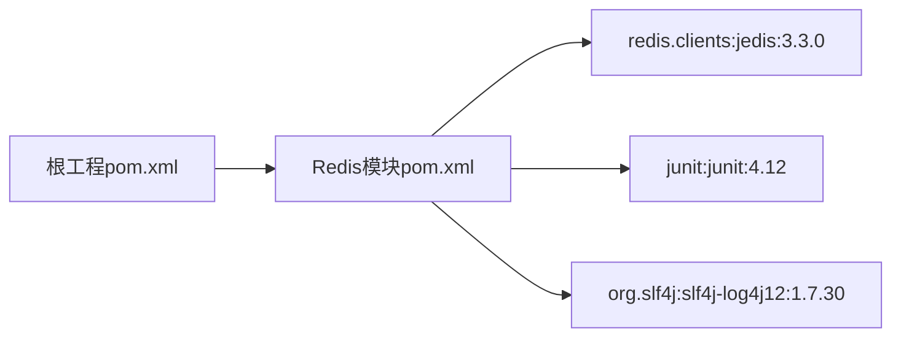

# 连接池管理

<cite>
**本文引用的文件**
- [MyJedisPool.java](file://_07_redis/src/main/java/MyJedisPool.java)
- [_0_TestJedis.java](file://_07_redis/src/main/java/_0_TestJedis.java)
- [testPool1.java](file://_07_redis/src/main/java/testPool1.java)
- [testPool2.java](file://_07_redis/src/main/java/testPool2.java)
- [RedisUtil.java](file://_200_flinkRealtime/src/main/java/com/atguigu/gmall/realtime/util/RedisUtil.java)
- [RedisUtil_m_0716.java](file://_200_flinkRealtime/src/main/java/com/atguigu/gmall/realtime/util/RedisUtil_m_0716.java)
- [pom.xml（Redis模块）](file://_07_redis/pom.xml)
- [pom.xml（根工程）](file://pom.xml)
</cite>

## 目录
1. [简介](#简介)
2. [项目结构](#项目结构)
3. [核心组件](#核心组件)
4. [架构总览](#架构总览)
5. [组件详解](#组件详解)
6. [依赖关系分析](#依赖关系分析)
7. [性能与调优](#性能与调优)
8. [故障排查指南](#故障排查指南)
9. [结论](#结论)
10. [附录：使用示例与最佳实践](#附录使用示例与最佳实践)

## 简介
本技术文档围绕Redis连接池管理展开，重点解析MyJedisPool类的设计与实现，系统阐述JedisPoolConfig关键参数（setMaxTotal、setMinIdle、setMaxIdle、setBlockWhenExhausted、setTestOnBorrow等）的作用与调优策略；并结合仓库中的示例代码，给出连接池生命周期管理、连接复用机制、资源回收策略、初始化最佳实践、高并发优化技巧、连接泄漏防护与异常处理策略，以及在Spring等框架中集成Redis连接池的思路与注意事项。

## 项目结构
本仓库包含多个子模块，Redis相关代码集中在“_07_redis”模块中，另有“_200_flinkRealtime”模块提供了更完整的连接池配置示例。核心文件如下：
- MyJedisPool.java：单例式Redis连接池工厂，演示最小化配置与懒加载
- _0_TestJedis.java：连接池使用与多种Redis命令示例，强调资源释放
- testPool1.java、testPool2.java：演示连续申请资源的行为与长时间持有连接
- RedisUtil.java、RedisUtil_m_0716.java：生产级连接池初始化示例，包含阻塞等待与最大等待时间
- pom.xml（Redis模块）：Jedis依赖与单元测试依赖
- pom.xml（根工程）：统一版本管理与构建配置

图表来源
- [MyJedisPool.java](file://_07_redis/src/main/java/MyJedisPool.java#L1-L26)
- [_0_TestJedis.java](file://_07_redis/src/main/java/_0_TestJedis.java#L1-L120)
- [testPool1.java](file://_07_redis/src/main/java/testPool1.java#L1-L18)
- [testPool2.java](file://_07_redis/src/main/java/testPool2.java#L1-L18)
- [RedisUtil.java](file://_200_flinkRealtime/src/main/java/com/atguigu/gmall/realtime/util/RedisUtil.java#L1-L39)
- [RedisUtil_m_0716.java](file://_200_flinkRealtime/src/main/java/com/atguigu/gmall/realtime/util/RedisUtil_m_0716.java#L1-L46)
- [pom.xml（Redis模块）](file://_07_redis/pom.xml#L1-L56)
- [pom.xml（根工程）](file://pom.xml#L1-L143)

章节来源
- [MyJedisPool.java](file://_07_redis/src/main/java/MyJedisPool.java#L1-L26)
- [_0_TestJedis.java](file://_07_redis/src/main/java/_0_TestJedis.java#L1-L120)
- [testPool1.java](file://_07_redis/src/main/java/testPool1.java#L1-L18)
- [testPool2.java](file://_07_redis/src/main/java/testPool2.java#L1-L18)
- [RedisUtil.java](file://_200_flinkRealtime/src/main/java/com/atguigu/gmall/realtime/util/RedisUtil.java#L1-L39)
- [RedisUtil_m_0716.java](file://_200_flinkRealtime/src/main/java/com/atguigu/gmall/realtime/util/RedisUtil_m_0716.java#L1-L46)
- [pom.xml（Redis模块）](file://_07_redis/pom.xml#L1-L56)
- [pom.xml（根工程）](file://pom.xml#L1-L143)

## 核心组件
- MyJedisPool：单例式连接池工厂，采用懒加载方式创建JedisPool，内部通过JedisPoolConfig设置连接池参数，并对外提供静态方法获取连接池实例。
- RedisUtil/RedisUtil_m_0716：生产级连接池初始化示例，包含阻塞等待、最大等待时间、最小空闲、最大空闲、借用校验等完整配置。
- 示例程序：_0_TestJedis、testPool1、testPool2演示了连接池的获取、使用与释放，强调资源关闭的重要性。

章节来源
- [MyJedisPool.java](file://_07_redis/src/main/java/MyJedisPool.java#L1-L26)
- [RedisUtil.java](file://_200_flinkRealtime/src/main/java/com/atguigu/gmall/realtime/util/RedisUtil.java#L1-L39)
- [RedisUtil_m_0716.java](file://_200_flinkRealtime/src/main/java/com/atguigu/gmall/realtime/util/RedisUtil_m_0716.java#L1-L46)
- [_0_TestJedis.java](file://_07_redis/src/main/java/_0_TestJedis.java#L1-L120)
- [testPool1.java](file://_07_redis/src/main/java/testPool1.java#L1-L18)
- [testPool2.java](file://_07_redis/src/main/java/testPool2.java#L1-L18)

## 架构总览
下图展示了连接池在应用中的典型交互路径：业务代码通过连接池工厂获取Jedis资源，执行Redis操作后归还资源；当连接池耗尽时，依据配置决定是否阻塞等待或抛出异常。

图表来源
- [MyJedisPool.java](file://_07_redis/src/main/java/MyJedisPool.java#L1-L26)
- [RedisUtil.java](file://_200_flinkRealtime/src/main/java/com/atguigu/gmall/realtime/util/RedisUtil.java#L1-L39)
- [_0_TestJedis.java](file://_07_redis/src/main/java/_0_TestJedis.java#L1-L120)

## 组件详解

### MyJedisPool设计与实现
- 单例与懒加载：首次访问时创建JedisPoolConfig与JedisPool，避免启动即占用资源。
- 关键参数：
  - setMaxTotal：最大连接数。仓库示例设为1，适合极小规模或演示场景。
  - setMinIdle：最小空闲连接数。示例设为1，确保随时可用，减少首次借用的等待。
  - setMaxIdle：最大空闲连接数。示例设为1，配合最小空闲，维持极小池容量。
  - setBlockWhenExhausted：连接耗尽时是否阻塞。示例为false，耗尽将直接失败。
  - setTestOnBorrow：从池中借出连接时是否进行有效性检测。示例为true，提升连接可靠性。
- 初始化：通过new JedisPool(config, host, port)完成连接池创建。

图表来源
- [MyJedisPool.java](file://_07_redis/src/main/java/MyJedisPool.java#L1-L26)

章节来源
- [MyJedisPool.java](file://_07_redis/src/main/java/MyJedisPool.java#L1-L26)

### 生产级连接池配置（RedisUtil/RedisUtil_m_0716）
- 更合理的参数组合：
  - setMaxTotal：100，满足一般高并发场景
  - setMinIdle：5，维持一定空闲连接，降低冷启动延迟
  - setMaxIdle：5，限制空闲连接上限，节省资源
  - setBlockWhenExhausted：true，连接耗尽时阻塞等待
  - setMaxWaitMillis：2000，设置最大等待时间，避免无限等待
  - setTestOnBorrow：true，确保借出连接可用性
- 初始化：new JedisPool(poolConfig, host, port, timeout)传入超时参数

图表来源
- [RedisUtil.java](file://_200_flinkRealtime/src/main/java/com/atguigu/gmall/realtime/util/RedisUtil.java#L1-L39)
- [RedisUtil_m_0716.java](file://_200_flinkRealtime/src/main/java/com/atguigu/gmall/realtime/util/RedisUtil_m_0716.java#L1-L46)

章节来源
- [RedisUtil.java](file://_200_flinkRealtime/src/main/java/com/atguigu/gmall/realtime/util/RedisUtil.java#L1-L39)
- [RedisUtil_m_0716.java](file://_200_flinkRealtime/src/main/java/com/atguigu/gmall/realtime/util/RedisUtil_m_0716.java#L1-L46)

### 连接池生命周期管理
- 创建：首次使用时由工厂创建JedisPool
- 使用：通过getResource()获取Jedis资源，执行命令
- 归还：使用完毕后必须关闭/归还资源，避免连接泄漏
- 关闭：应用退出时可调用close()销毁连接池

图表来源
- [MyJedisPool.java](file://_07_redis/src/main/java/MyJedisPool.java#L1-L26)
- [_0_TestJedis.java](file://_07_redis/src/main/java/_0_TestJedis.java#L1-L120)

章节来源
- [MyJedisPool.java](file://_07_redis/src/main/java/MyJedisPool.java#L1-L26)
- [_0_TestJedis.java](file://_07_redis/src/main/java/_0_TestJedis.java#L1-L120)

### 连接复用与资源回收
- 复用机制：JedisPool内部维护连接队列，借出后归还至空闲队列，供后续复用
- 回收策略：空闲连接超过最大空闲数时会被回收；连接耗尽且阻塞等待超时则拒绝
- 健康检查：setTestOnBorrow=true可在借出前验证连接可用性

章节来源
- [RedisUtil.java](file://_200_flinkRealtime/src/main/java/com/atguigu/gmall/realtime/util/RedisUtil.java#L1-L39)
- [RedisUtil_m_0716.java](file://_200_flinkRealtime/src/main/java/com/atguigu/gmall/realtime/util/RedisUtil_m_0716.java#L1-L46)

### 初始化最佳实践
- 连接数设置：根据QPS与RT估算峰值并发，预留一定冗余；示例中100较为合理
- 超时配置：设置合理的连接超时与最大等待时间，避免阻塞导致线程饥饿
- 健康检查：开启借用校验，降低因网络抖动导致的无效连接
- 空闲管理：min/max空闲保持平衡，既保证即时可用又避免资源浪费

章节来源
- [RedisUtil.java](file://_200_flinkRealtime/src/main/java/com/atguigu/gmall/realtime/util/RedisUtil.java#L1-L39)
- [RedisUtil_m_0716.java](file://_200_flinkRealtime/src/main/java/com/atguigu/gmall/realtime/util/RedisUtil_m_0716.java#L1-L46)

### 高并发优化与异常处理
- 连接泄漏防护：务必在finally块或try-with-resources中关闭Jedis资源
- 异常处理策略：捕获连接不可用、超时等异常，记录日志并重试或降级
- 并发控制：避免在同一连接上串行化大量任务，必要时拆分连接或使用管道
- 监控指标：关注连接池活跃数、空闲数、等待数、拒绝数等

章节来源
- [_0_TestJedis.java](file://_07_redis/src/main/java/_0_TestJedis.java#L1-L120)
- [testPool1.java](file://_07_redis/src/main/java/testPool1.java#L1-L18)
- [testPool2.java](file://_07_redis/src/main/java/testPool2.java#L1-L18)

## 依赖关系分析
- 依赖Jedis客户端：Redis模块pom中引入jedis依赖，版本为3.3.0
- 单元测试与日志：引入junit与slf4j-log4j12用于测试与日志输出
- 版本管理：根工程pom中定义了统一的依赖版本，便于维护

图表来源
- [pom.xml（Redis模块）](file://_07_redis/pom.xml#L1-L56)
- [pom.xml（根工程）](file://pom.xml#L1-L143)

章节来源
- [pom.xml（Redis模块）](file://_07_redis/pom.xml#L1-L56)
- [pom.xml（根工程）](file://pom.xml#L1-L143)

## 性能与调优
- 参数调优要点
  - setMaxTotal：按峰值并发与RT估算，避免过大造成资源浪费，过小导致阻塞
  - setMinIdle：维持热连接，降低首次借用延迟
  - setMaxIdle：限制空闲连接上限，防止过多空闲连接占用资源
  - setBlockWhenExhausted + setMaxWaitMillis：在高负载时启用阻塞等待，避免业务失败
  - setTestOnBorrow：开启可提升可靠性，但会增加每次借用的开销
- 监控与观测
  - 观察连接池状态：活跃连接数、空闲连接数、等待请求数、拒绝数
  - 结合业务QPS与RT评估是否需要调整参数
- Spring集成建议
  - 使用JedisConnectionFactory或LettuceConnectionFactory（取决于客户端选择）
  - 将连接池参数注入Bean，集中管理
  - 结合Spring Boot Actuator暴露健康检查端点，便于运维监控

[本节为通用性能指导，无需特定文件引用]

## 故障排查指南
- 连接耗尽与阻塞
  - 现象：请求被阻塞或直接失败
  - 排查：检查setMaxTotal与setMaxWaitMillis配置，确认是否存在连接泄漏
- 连接泄漏
  - 现象：活跃连接持续增长
  - 排查：确认所有Jedis资源均在finally或try-with-resources中关闭
- 借用校验失败
  - 现象：setTestOnBorrow=true时，借出失败
  - 排查：检查Redis服务状态、网络连通性与防火墙策略
- 超时问题
  - 现象：操作超时或等待超时
  - 排查：适当增大超时时间，检查Redis服务性能与网络延迟

章节来源
- [_0_TestJedis.java](file://_07_redis/src/main/java/_0_TestJedis.java#L1-L120)
- [testPool1.java](file://_07_redis/src/main/java/testPool1.java#L1-L18)
- [testPool2.java](file://_07_redis/src/main/java/testPool2.java#L1-L18)
- [RedisUtil.java](file://_200_flinkRealtime/src/main/java/com/atguigu/gmall/realtime/util/RedisUtil.java#L1-L39)
- [RedisUtil_m_0716.java](file://_200_flinkRealtime/src/main/java/com/atguigu/gmall/realtime/util/RedisUtil_m_0716.java#L1-L46)

## 结论
MyJedisPool与RedisUtil/RedisUtil_m_0716展示了从最小化配置到生产级配置的完整演进路径。通过合理设置连接池参数、严格遵循资源归还与关闭规范、结合阻塞等待与健康检查，可以在高并发场景下获得稳定可靠的Redis访问能力。在Spring等框架中，应将连接池参数集中化管理并通过健康检查与监控体系保障运行质量。

[本节为总结性内容，无需特定文件引用]

## 附录：使用示例与最佳实践

### 如何正确使用连接池进行Redis操作
- 获取资源：通过工厂方法获取JedisPool，再getResource()获取Jedis
- 执行命令：在try块中执行Redis操作
- 归还资源：使用finally或try-with-resources确保关闭Jedis
- 参考示例路径
  - [获取与使用Jedis资源](file://_07_redis/src/main/java/_0_TestJedis.java#L1-L120)
  - [长时间持有连接示例](file://_07_redis/src/main/java/testPool1.java#L1-L18)
  - [长时间持有连接示例（二）](file://_07_redis/src/main/java/testPool2.java#L1-L18)

章节来源
- [_0_TestJedis.java](file://_07_redis/src/main/java/_0_TestJedis.java#L1-L120)
- [testPool1.java](file://_07_redis/src/main/java/testPool1.java#L1-L18)
- [testPool2.java](file://_07_redis/src/main/java/testPool2.java#L1-L18)

### 在Spring等框架中集成Redis连接池
- Spring Boot集成思路
  - 选择Jedis或Lettuce客户端
  - 将连接池参数注入到连接工厂Bean
  - 配置连接超时、最大连接数、空闲连接等
  - 开启健康检查与监控端点
- 参考示例路径
  - [生产级连接池初始化示例](file://_200_flinkRealtime/src/main/java/com/atguigu/gmall/realtime/util/RedisUtil.java#L1-L39)
  - [带注释的生产级连接池初始化示例](file://_200_flinkRealtime/src/main/java/com/atguigu/gmall/realtime/util/RedisUtil_m_0716.java#L1-L46)

章节来源
- [RedisUtil.java](file://_200_flinkRealtime/src/main/java/com/atguigu/gmall/realtime/util/RedisUtil.java#L1-L39)
- [RedisUtil_m_0716.java](file://_200_flinkRealtime/src/main/java/com/atguigu/gmall/realtime/util/RedisUtil_m_0716.java#L1-L46)