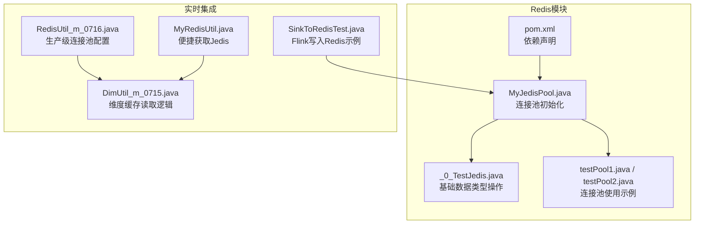
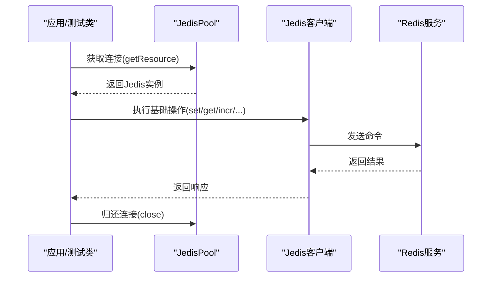
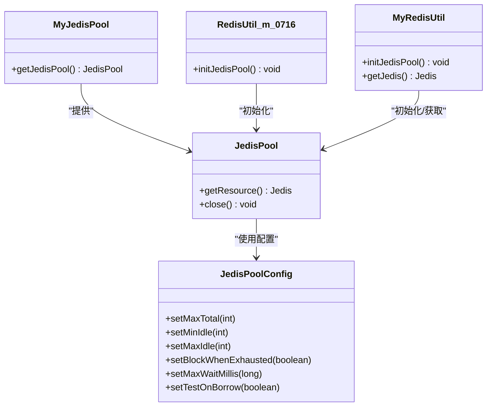
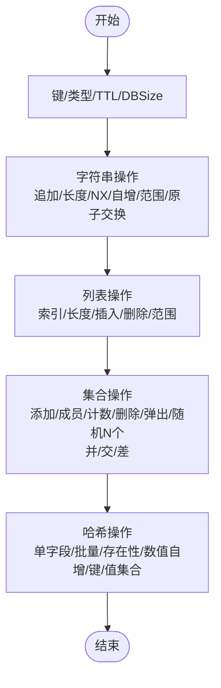
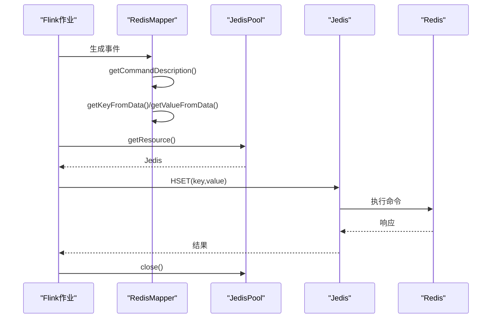
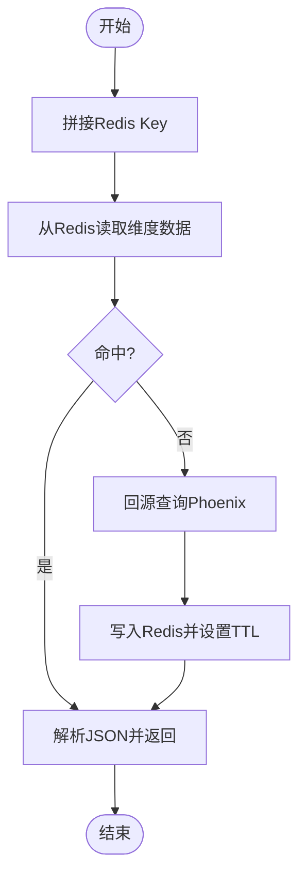
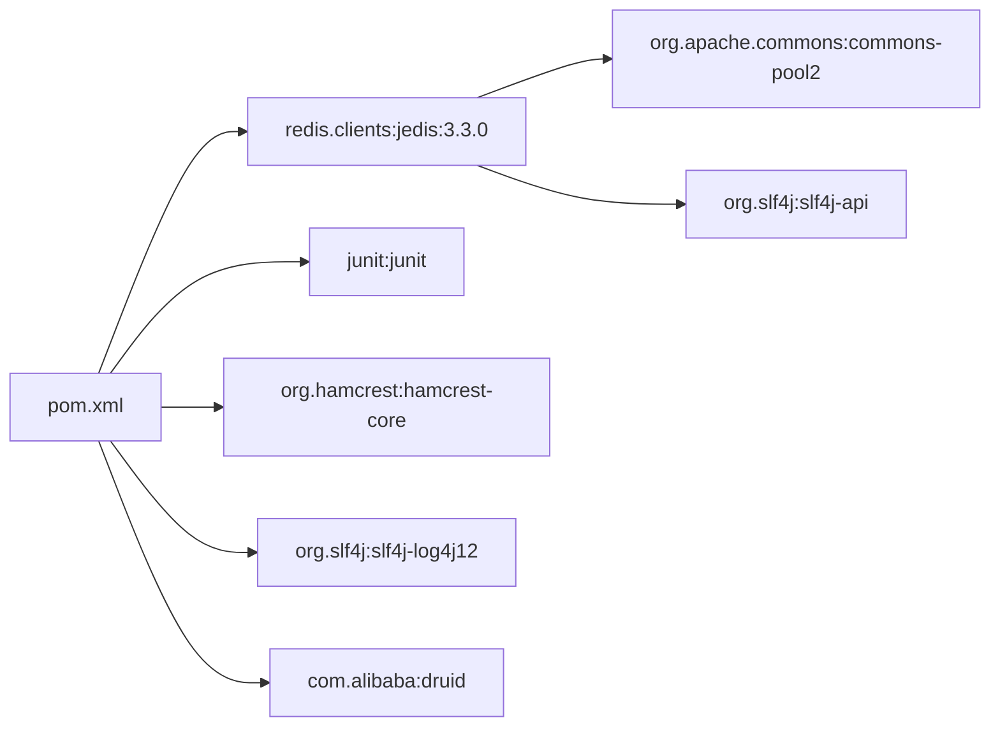

# 高级特性与优化

<cite>
**本文引用的文件**
- [MyJedisPool.java](file://_07_redis/src/main/java/MyJedisPool.java)
- [_0_TestJedis.java](file://_07_redis/src/main/java/_0_TestJedis.java)
- [testPool1.java](file://_07_redis/src/main/java/testPool1.java)
- [testPool2.java](file://_07_redis/src/main/java/testPool2.java)
- [pom.xml](file://_07_redis/pom.xml)
- [RedisUtil_m_0716.java](file://_200_flinkRealtime/src/main/java/com/atguigu/gmall/realtime/util/RedisUtil_m_0716.java)
- [MyRedisUtil.java](file://_300_eduRealtime/src/main/java/com/atguigu/gmall/realtime/util/MyRedisUtil.java)
- [DimUtil_m_0715.java](file://_200_flinkRealtime/src/main/java/com/atguigu/gmall/realtime/util/DimUtil_m_0715.java)
- [SinkToRedisTest.java](file://_06_flink_wu/src/main/java/com/atuigu/chapter05/SinkToRedisTest.java)
- [jedis-3.3.0.pom](file://redis/clients/jedis/3.3.0/jedis-3.3.0.pom)
</cite>

## 目录
1. [引言](#引言)
2. [项目结构](#项目结构)
3. [核心组件](#核心组件)
4. [架构总览](#架构总览)
5. [详细组件分析](#详细组件分析)
6. [依赖分析](#依赖分析)
7. [性能考虑](#性能考虑)
8. [故障排查指南](#故障排查指南)
9. [结论](#结论)
10. [附录](#附录)

## 引言
本技术文档聚焦于Redis在Java应用中的高级特性与性能优化实践，结合仓库中现有的Jedis连接池与基础操作示例，系统阐述以下主题：
- 高级特性：发布订阅、事务、Lua脚本、慢查询日志（概念性说明）
- 内存管理：内存碎片整理、内存淘汰策略、内存预警机制（概念性说明）
- 性能调优：网络优化、内存优化、持久化配置、集群部署策略（概念性说明）
- 高并发最佳实践：连接池配置、批量操作优化、数据分区策略（结合现有连接池配置）
- 监控与诊断：INFO/MEMORY命令与可视化工具（概念性说明）
- 故障排查：常见问题诊断、性能瓶颈定位、灾难恢复策略（概念性说明）

说明：当前仓库未包含Redis发布订阅、事务、Lua脚本与慢查询日志的具体实现示例；本文在这些章节提供通用的Redis高级特性与优化知识，帮助读者将这些能力与现有Jedis连接池实践相结合。

## 项目结构
该模块围绕Jedis客户端与连接池展开，包含连接池初始化、基础数据类型操作演示以及在Flink实时任务中的写入示例。

图示来源
- [MyJedisPool.java](file://_07_redis/src/main/java/MyJedisPool.java#L1-L27)
- [_0_TestJedis.java](file://_07_redis/src/main/java/_0_TestJedis.java#L1-L103)
- [testPool1.java](file://_07_redis/src/main/java/testPool1.java#L1-L19)
- [testPool2.java](file://_07_redis/src/main/java/testPool2.java#L1-L18)
- [pom.xml](file://_07_redis/pom.xml#L1-L56)
- [RedisUtil_m_0716.java](file://_200_flinkRealtime/src/main/java/com/atguigu/gmall/realtime/util/RedisUtil_m_0716.java#L1-L46)
- [MyRedisUtil.java](file://_300_eduRealtime/src/main/java/com/atguigu/gmall/realtime/util/MyRedisUtil.java#L1-L39)
- [DimUtil_m_0715.java](file://_200_flinkRealtime/src/main/java/com/atguigu/gmall/realtime/util/DimUtil_m_0715.java#L38-L91)
- [SinkToRedisTest.java](file://_06_flink_wu/src/main/java/com/atuigu/chapter05/SinkToRedisTest.java#L32-L52)

章节来源
- [MyJedisPool.java](file://_07_redis/src/main/java/MyJedisPool.java#L1-L27)
- [_0_TestJedis.java](file://_07_redis/src/main/java/_0_TestJedis.java#L1-L103)
- [testPool1.java](file://_07_redis/src/main/java/testPool1.java#L1-L19)
- [testPool2.java](file://_07_redis/src/main/java/testPool2.java#L1-L18)
- [pom.xml](file://_07_redis/pom.xml#L1-L56)

## 核心组件
- 连接池初始化与配置
  - 基础连接池：最大连接数、最小空闲、最大空闲、耗尽阻塞与借用校验等参数设置。
  - 生产级连接池：更严格的等待时间、空闲回收策略与超时设置。
- 基础数据类型操作
  - Key/Type/TTL/DBSize等元信息操作；字符串增删改查、自增自减、范围读写；列表索引/长度/插入/删除/范围；集合交并差与随机成员；哈希字段设置/批量设置/存在性检查/数值自增。
- 实时任务写入
  - Flink通过RedisMapper将事件写入Redis，采用HSET命令存储点击流数据。

章节来源
- [MyJedisPool.java](file://_07_redis/src/main/java/MyJedisPool.java#L1-L27)
- [RedisUtil_m_0716.java](file://_200_flinkRealtime/src/main/java/com/atguigu/gmall/realtime/util/RedisUtil_m_0716.java#L1-L46)
- [MyRedisUtil.java](file://_300_eduRealtime/src/main/java/com/atguigu/gmall/realtime/util/MyRedisUtil.java#L1-L39)
- [_0_TestJedis.java](file://_07_redis/src/main/java/_0_TestJedis.java#L1-L273)
- [SinkToRedisTest.java](file://_06_flink_wu/src/main/java/com/atuigu/chapter05/SinkToRedisTest.java#L32-L52)

## 架构总览
下图展示从应用到Redis的数据通路，包括连接池、基础操作与Flink写入路径。

图示来源
- [MyJedisPool.java](file://_07_redis/src/main/java/MyJedisPool.java#L1-L27)
- [_0_TestJedis.java](file://_07_redis/src/main/java/_0_TestJedis.java#L1-L103)

## 详细组件分析

### 组件A：连接池配置与使用
- 基础连接池
  - 最大连接数、最小/最大空闲、耗尽阻塞行为、借用校验等参数用于控制资源占用与可用性。
- 生产级连接池
  - 更高的最大连接数、等待超时、空闲回收与超时设置，适合高并发场景。
- 使用建议
  - 在应用启动阶段初始化连接池，避免运行期动态创建。
  - 正确归还连接，防止连接泄漏。

图示来源
- [MyJedisPool.java](file://_07_redis/src/main/java/MyJedisPool.java#L1-L27)
- [RedisUtil_m_0716.java](file://_200_flinkRealtime/src/main/java/com/atguigu/gmall/realtime/util/RedisUtil_m_0716.java#L1-L46)
- [MyRedisUtil.java](file://_300_eduRealtime/src/main/java/com/atguigu/gmall/realtime/util/MyRedisUtil.java#L1-L39)

章节来源
- [MyJedisPool.java](file://_07_redis/src/main/java/MyJedisPool.java#L1-L27)
- [RedisUtil_m_0716.java](file://_200_flinkRealtime/src/main/java/com/atguigu/gmall/realtime/util/RedisUtil_m_0716.java#L1-L46)
- [MyRedisUtil.java](file://_300_eduRealtime/src/main/java/com/atguigu/gmall/realtime/util/MyRedisUtil.java#L1-L39)

### 组件B：基础数据类型操作流程
- 关键字节操作：设置、过期、获取、删除、存在性、类型、库大小、TTL。
- 字符串操作：追加、长度、NX、自增/自减、批量设置/获取、范围读写、原子交换。
- 列表操作：索引、长度、插入、删除、范围。
- 集合操作：添加/成员检查/计数/删除/弹出/随机N个、并/交/差。
- 哈希操作：单字段设置、批量设置、存在性、数值自增、键/值集合。

图示来源
- [_0_TestJedis.java](file://_07_redis/src/main/java/_0_TestJedis.java#L1-L273)

章节来源
- [_0_TestJedis.java](file://_07_redis/src/main/java/_0_TestJedis.java#L1-L273)

### 组件C：Flink写入Redis序列
- Flink作业通过RedisMapper定义写入命令与键值映射，使用HSET将事件写入Redis。
- 该流程展示了批处理/流处理向Redis写入的典型模式。

图示来源
- [SinkToRedisTest.java](file://_06_flink_wu/src/main/java/com/atuigu/chapter05/SinkToRedisTest.java#L32-L52)
- [MyJedisPool.java](file://_07_redis/src/main/java/MyJedisPool.java#L1-L27)

章节来源
- [SinkToRedisTest.java](file://_06_flink_wu/src/main/java/com/atuigu/chapter05/SinkToRedisTest.java#L32-L52)
- [MyJedisPool.java](file://_07_redis/src/main/java/MyJedisPool.java#L1-L27)

### 组件D：维度缓存读取流程
- 通过构造维度表缓存Key，优先从Redis读取；若未命中，则回源查询Phoenix并写入Redis，同时设置TTL。
- 该流程体现了旁路缓存策略与失效控制。

图示来源
- [DimUtil_m_0715.java](file://_200_flinkRealtime/src/main/java/com/atguigu/gmall/realtime/util/DimUtil_m_0715.java#L38-L91)
- [MyRedisUtil.java](file://_300_eduRealtime/src/main/java/com/atguigu/gmall/realtime/util/MyRedisUtil.java#L1-L39)

章节来源
- [DimUtil_m_0715.java](file://_200_flinkRealtime/src/main/java/com/atguigu/gmall/realtime/util/DimUtil_m_0715.java#L38-L91)
- [MyRedisUtil.java](file://_300_eduRealtime/src/main/java/com/atguigu/gmall/realtime/util/MyRedisUtil.java#L1-L39)

## 依赖分析
- Jedis客户端版本与依赖
  - 当前模块使用Jedis 3.3.0，其依赖commons-pool2用于连接池管理，并引入SLF4J日志接口。
- Maven依赖
  - 模块pom声明了Jedis、JUnit、Hamcrest、Log4j与Druid等依赖，便于单元测试与日志输出。

图示来源
- [pom.xml](file://_07_redis/pom.xml#L1-L56)
- [jedis-3.3.0.pom](file://redis/clients/jedis/3.3.0/jedis-3.3.0.pom#L47-L93)

章节来源
- [pom.xml](file://_07_redis/pom.xml#L1-L56)
- [jedis-3.3.0.pom](file://redis/clients/jedis/3.3.0/jedis-3.3.0.pom#L47-L93)

## 性能考虑
- 连接池配置要点
  - 最大连接数与最小空闲：根据QPS与并发线程数设定，避免频繁创建销毁。
  - 耗尽阻塞与等待时间：在高负载时启用阻塞并设置合理等待上限，防止瞬时拥塞导致失败。
  - 借用校验：启用TestOnBorrow确保连接可用性。
  - 超时设置：为连接与命令设置合理超时，避免线程长时间阻塞。
- 批量操作优化
  - 使用mset/mget、pipeline等减少RTT与往返次数。
- 数据分区策略
  - 通过Key命名空间与哈希槽划分，配合集群部署提升扩展性。
- 网络与持久化
  - TCP优化、内核参数调优；RDB/AOF策略选择与重写时机控制。
- 内存管理与淘汰
  - volatile-lru/allkeys-lru等策略按业务特征选择；内存碎片整理与预警阈值设置。
- 监控与诊断
  - INFO/MEMORY命令观测内存与性能指标；RedisInsight等可视化工具辅助定位问题。

说明：以上为通用Redis性能优化建议，可与现有连接池配置与基础操作示例结合落地。

## 故障排查指南
- 连接池相关
  - 连接耗尽：检查最大连接数、等待时间与借用校验；确认未遗漏归还连接。
  - 连接不可用：启用TestOnBorrow并缩短等待时间，快速失败并重试。
- 命令超时
  - 设置合理的命令超时，避免长时间阻塞导致线程池紧张。
- 缓存穿透/击穿/雪崩
  - 旁路缓存+短TTL+互斥更新；对热点Key设置保护与降级策略。
- 慢查询定位
  - 开启慢查询日志，结合采样与告警定位慢命令与热点Key。
- 灾难恢复
  - 定期备份与演练；在集群/哨兵环境下确保故障切换与数据一致性。

说明：以上为通用故障排查思路，可结合实际监控与日志体系实施。

## 结论
本仓库展示了基于Jedis的连接池初始化与基础数据类型操作，为后续引入Redis高级特性（发布订阅、事务、Lua脚本、慢查询日志）与深度性能优化提供了良好基础。建议在现有连接池配置之上，逐步引入批量操作、旁路缓存与集群部署策略，并完善监控与故障预案，以支撑高并发与大规模场景。

## 附录
- 关键实现位置参考
  - 连接池初始化与配置：[MyJedisPool.java](file://_07_redis/src/main/java/MyJedisPool.java#L1-L27)、[RedisUtil_m_0716.java](file://_200_flinkRealtime/src/main/java/com/atguigu/gmall/realtime/util/RedisUtil_m_0716.java#L1-L46)、[MyRedisUtil.java](file://_300_eduRealtime/src/main/java/com/atguigu/gmall/realtime/util/MyRedisUtil.java#L1-L39)
  - 基础数据类型操作：[_0_TestJedis.java](file://_07_redis/src/main/java/_0_TestJedis.java#L1-L273)
  - Flink写入Redis：[SinkToRedisTest.java](file://_06_flink_wu/src/main/java/com/atuigu/chapter05/SinkToRedisTest.java#L32-L52)
  - 维度缓存读取：[DimUtil_m_0715.java](file://_200_flinkRealtime/src/main/java/com/atguigu/gmall/realtime/util/DimUtil_m_0715.java#L38-L91)
  - 依赖与版本：[pom.xml](file://_07_redis/pom.xml#L1-L56)、[jedis-3.3.0.pom](file://redis/clients/jedis/3.3.0/jedis-3.3.0.pom#L47-L93)