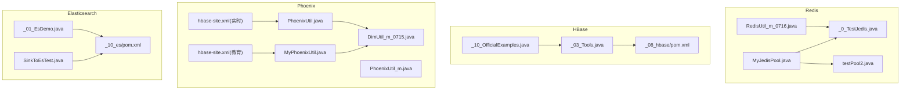
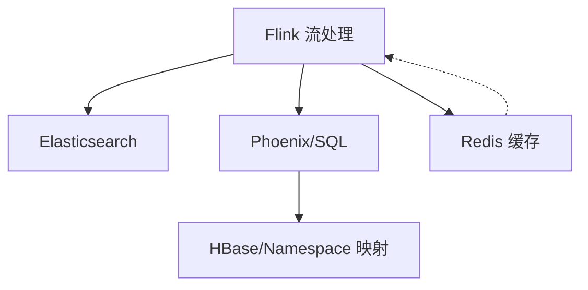
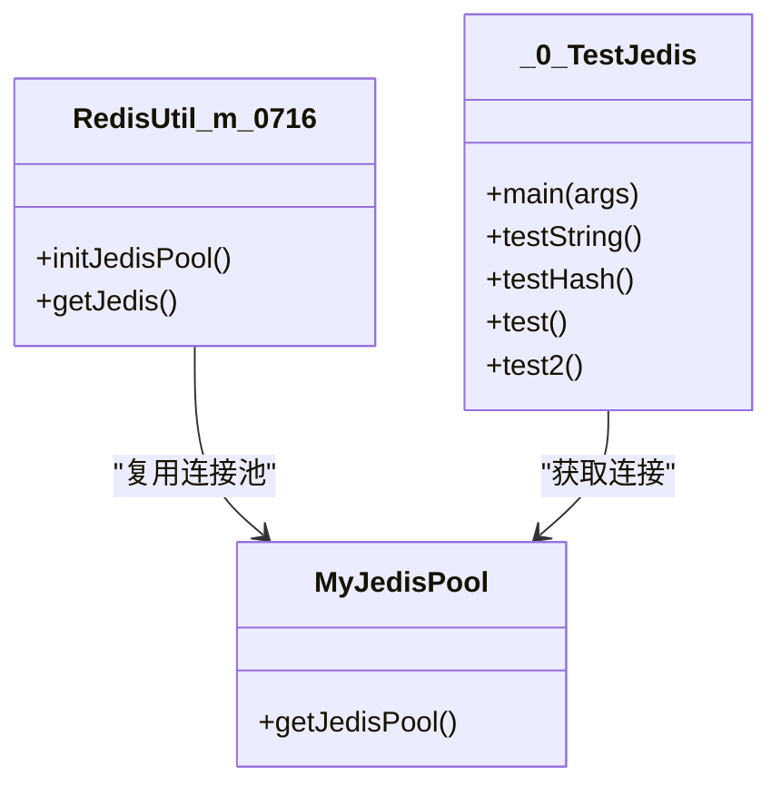
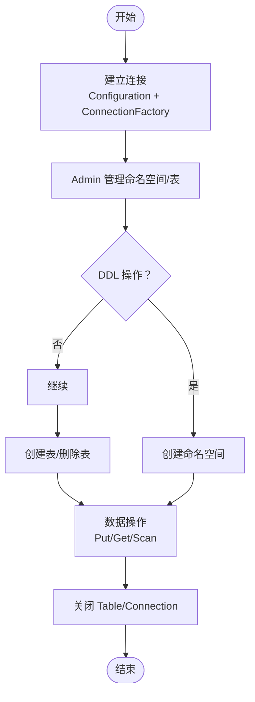
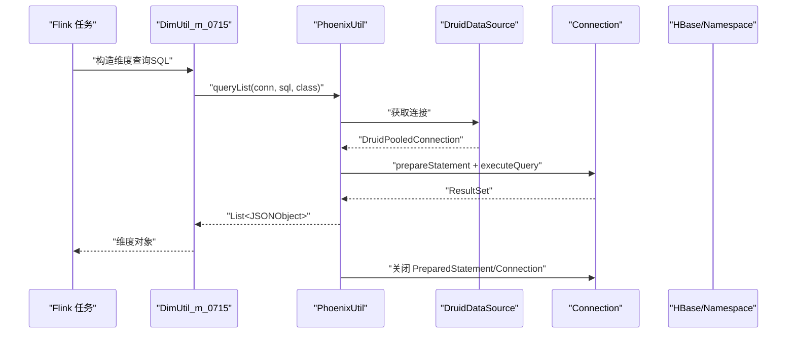
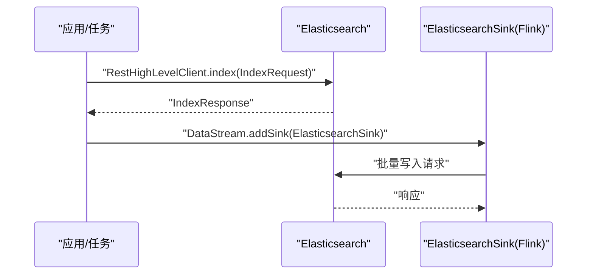
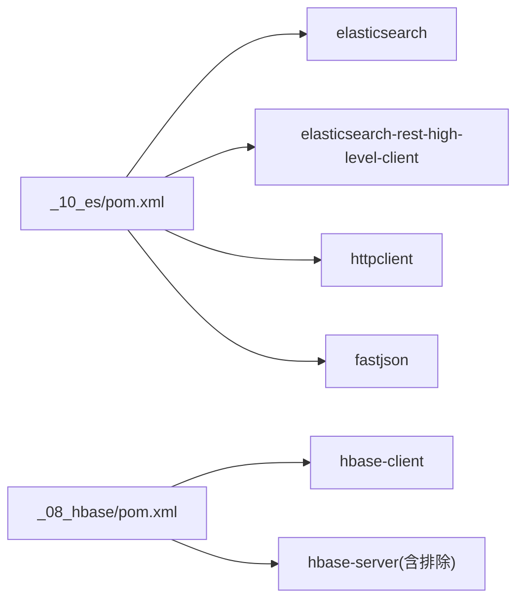

# 数据库集成

<cite>
**本文引用的文件**
- [Redis 工具类（实时项目）](file://_200_flinkRealtime/src/main/java/com/atguigu/gmall/realtime/util/RedisUtil_m_0716.java)
- [Redis 连接池工具类](file://_07_redis/src/main/java/MyJedisPool.java)
- [Redis 使用示例（单元测试）](file://_07_redis/src/main/java/_0_TestJedis.java)
- [Redis 连接池测试（命令行）](file://_07_redis/src/main/java/testPool2.java)
- [HBase 官方示例](file://_08_hbase/src/main/java/_10_OfficialExamples.java)
- [HBase 工具类（DDL/增删改查）](file://_08_hbase/src/main/java/_03_Tools.java)
- [Phoenix 工具类（实时项目）](file://_200_flinkRealtime/src/main/java/com/atguigu/gmall/realtime/util/PhoenixUtil.java)
- [Phoenix 工具类（教育项目）](file://_300_eduRealtime/src/main/java/com/atguigu/gmall/realtime/util/MyPhoenixUtil.java)
- [Phoenix 维度查询工具（实时项目）](file://_200_flinkRealtime/src/main/java/com/atguigu/gmall/realtime/util/DimUtil_m_0715.java)
- [Phoenix 连接工具类（实时项目）](file://_200_flinkRealtime/src/main/java/com/atguigu/gmall/realtime/util/PhoenixUtil_m.java)
- [Phoenix HBase 映射配置（实时项目）](file://_200_flinkRealtime/src/main/resources/hbase-site.xml)
- [Phoenix HBase 映射配置（教育项目）](file://_300_eduRealtime/src/main/resources/hbase-site.xml)
- [Elasticsearch 示例](file://_10_es/src/main/java/_01_EsDemo.java)
- [Elasticsearch Flink 写入示例](file://_06_flink_wu/src/main/java/com/atguigu/chapter05/SinkToEsTest.java)
- [Elasticsearch Maven 依赖](file://_10_es/pom.xml)
- [HBase Maven 依赖](file://_08_hbase/pom.xml)
</cite>

## 目录
1. [引言](#引言)
2. [项目结构](#项目结构)
3. [核心组件](#核心组件)
4. [架构总览](#架构总览)
5. [详细组件分析](#详细组件分析)
6. [依赖关系分析](#依赖关系分析)
7. [性能考量](#性能考量)
8. [故障排查指南](#故障排查指南)
9. [结论](#结论)
10. [附录](#附录)

## 引言
本文件围绕数据库与存储系统的集成方案，系统梳理并总结仓库中现有的 Redis 缓存、HBase NoSQL 存储、Elasticsearch 搜索引擎与 Phoenix SQL 查询引擎的实现与使用方式。文档从架构、组件、数据流、处理逻辑、集成点、错误处理与性能优化等方面展开，帮助开发者在大数据应用场景下做出合理选型与实施。

## 项目结构
本仓库按功能模块组织，数据库与存储相关代码主要分布在以下模块：
- Redis：连接池与示例使用
- HBase：官方示例、工具类（DDL/增删改查）
- Phoenix：工具类与配置（HBase/Namespace 映射）
- Elasticsearch：REST 客户端示例与 Flink 写入示例

图表来源
- [Redis 工具类（实时项目）](file://_200_flinkRealtime/src/main/java/com/atguigu/gmall/realtime/util/RedisUtil_m_0716.java#L1-L64)
- [Redis 连接池工具类](file://_07_redis/src/main/java/MyJedisPool.java#L1-L27)
- [Redis 使用示例（单元测试）](file://_07_redis/src/main/java/_0_TestJedis.java#L1-L273)
- [Redis 连接池测试（命令行）](file://_07_redis/src/main/java/testPool2.java#L1-L17)
- [HBase 官方示例](file://_08_hbase/src/main/java/_10_OfficialExamples.java#L1-L125)
- [HBase 工具类（DDL/增删改查）](file://_08_hbase/src/main/java/_03_Tools.java#L1-L125)
- [Phoenix 工具类（实时项目）](file://_200_flinkRealtime/src/main/java/com/atguigu/gmall/realtime/util/PhoenixUtil.java#L44-L79)
- [Phoenix 工具类（教育项目）](file://_300_eduRealtime/src/main/java/com/atguigu/gmall/realtime/util/MyPhoenixUtil.java#L1-L116)
- [Phoenix 维度查询工具（实时项目）](file://_200_flinkRealtime/src/main/java/com/atguigu/gmall/realtime/util/DimUtil_m_0715.java#L125-L150)
- [Phoenix HBase 映射配置（实时项目）](file://_200_flinkRealtime/src/main/resources/hbase-site.xml#L1-L14)
- [Phoenix HBase 映射配置（教育项目）](file://_300_eduRealtime/src/main/resources/hbase-site.xml#L1-L14)
- [Elasticsearch 示例](file://_10_es/src/main/java/_01_EsDemo.java#L1-L45)
- [Elasticsearch Flink 写入示例](file://_06_flink_wu/src/main/java/com/atguigu/chapter05/SinkToEsTest.java#L1-L63)
- [HBase Maven 依赖](file://_08_hbase/pom.xml#L1-L45)
- [Elasticsearch Maven 依赖](file://_10_es/pom.xml#L1-L44)

章节来源
- [Redis 工具类（实时项目）](file://_200_flinkRealtime/src/main/java/com/atguigu/gmall/realtime/util/RedisUtil_m_0716.java#L1-L64)
- [HBase 官方示例](file://_08_hbase/src/main/java/_10_OfficialExamples.java#L1-L125)
- [Phoenix 工具类（实时项目）](file://_200_flinkRealtime/src/main/java/com/atguigu/gmall/realtime/util/PhoenixUtil.java#L44-L79)
- [Elasticsearch 示例](file://_10_es/src/main/java/_01_EsDemo.java#L1-L45)

## 核心组件
- Redis 连接池与工具类：提供连接池初始化、获取 Jedis 客户端、常用键值操作演示。
- HBase 客户端与工具类：提供连接建立、命名空间与表管理、Put/Get/Scan 的典型用法。
- Phoenix 工具类：封装 SQL 执行与查询结果映射；结合维度查询工具完成维度表查询。
- Elasticsearch 客户端与 Flink 写入：提供 REST 客户端写入示例与 Flink ES Sink 示例。

章节来源
- [Redis 连接池工具类](file://_07_redis/src/main/java/MyJedisPool.java#L1-L27)
- [Redis 使用示例（单元测试）](file://_07_redis/src/main/java/_0_TestJedis.java#L1-L273)
- [HBase 工具类（DDL/增删改查）](file://_08_hbase/src/main/java/_03_Tools.java#L1-L125)
- [Phoenix 工具类（实时项目）](file://_200_flinkRealtime/src/main/java/com/atguigu/gmall/realtime/util/PhoenixUtil.java#L44-L79)
- [Phoenix 工具类（教育项目）](file://_300_eduRealtime/src/main/java/com/atguigu/gmall/realtime/util/MyPhoenixUtil.java#L1-L116)
- [Phoenix 维度查询工具（实时项目）](file://_200_flinkRealtime/src/main/java/com/atguigu/gmall/realtime/util/DimUtil_m_0715.java#L125-L150)
- [Elasticsearch 示例](file://_10_es/src/main/java/_01_EsDemo.java#L1-L45)

## 架构总览
整体架构围绕“流式计算 + 多存储”的思路展开：
- 流处理（如 Flink）通过 ES Sink 将事件写入 Elasticsearch，支撑实时检索与分析。
- 维度数据通过 Phoenix 访问 HBase/Namespace 映射的表，实现低延迟维度关联。
- 缓存层采用 Redis，承载高频读取与会话状态等。

图表来源
- [Elasticsearch Flink 写入示例](file://_06_flink_wu/src/main/java/com/atguigu/chapter05/SinkToEsTest.java#L1-L63)
- [Phoenix 维度查询工具（实时项目）](file://_200_flinkRealtime/src/main/java/com/atguigu/gmall/realtime/util/DimUtil_m_0715.java#L125-L150)
- [Phoenix HBase 映射配置（实时项目）](file://_200_flinkRealtime/src/main/resources/hbase-site.xml#L1-L14)

## 详细组件分析

### Redis 集成与缓存策略
- 连接池配置要点：最大连接数、最小空闲、阻塞等待、借用校验等参数直接影响吞吐与稳定性。
- 使用模式：通过连接池获取 Jedis 资源，执行键值操作；注意资源关闭与并发安全。
- 缓存策略建议：
  - 读多写少场景：热点键设置 TTL，配合预热与降级。
  - 写多场景：批量写入、管道化、异步刷新，避免阻塞主线程。
  - 一致性：写后失效或延时双删，结合业务重试与幂等设计。

图表来源
- [Redis 工具类（实时项目）](file://_200_flinkRealtime/src/main/java/com/atguigu/gmall/realtime/util/RedisUtil_m_0716.java#L1-L64)
- [Redis 连接池工具类](file://_07_redis/src/main/java/MyJedisPool.java#L1-L27)
- [Redis 使用示例（单元测试）](file://_07_redis/src/main/java/_0_TestJedis.java#L1-L273)

章节来源
- [Redis 工具类（实时项目）](file://_200_flinkRealtime/src/main/java/com/atguigu/gmall/realtime/util/RedisUtil_m_0716.java#L1-L64)
- [Redis 连接池工具类](file://_07_redis/src/main/java/MyJedisPool.java#L1-L27)
- [Redis 使用示例（单元测试）](file://_07_redis/src/main/java/_0_TestJedis.java#L1-L273)
- [Redis 连接池测试（命令行）](file://_07_redis/src/main/java/testPool2.java#L1-L17)

### HBase 集成与数据模型
- 连接与配置：通过 Configuration 指定 ZooKeeper 地址，ConnectionFactory 建立连接。
- DDL/数据操作：命名空间创建、表创建、Put/Get/Scan 的标准流程；注意资源关闭。
- 最佳实践：
  - 合理设计 RowKey 与列族，避免热点写入。
  - 批量写入与扫描，减少网络往返。
  - 使用 ResultScanner 时务必 finally 关闭。

图表来源
- [HBase 官方示例](file://_08_hbase/src/main/java/_10_OfficialExamples.java#L1-L125)
- [HBase 工具类（DDL/增删改查）](file://_08_hbase/src/main/java/_03_Tools.java#L1-L125)

章节来源
- [HBase 官方示例](file://_08_hbase/src/main/java/_10_OfficialExamples.java#L1-L125)
- [HBase 工具类（DDL/增删改查）](file://_08_hbase/src/main/java/_03_Tools.java#L1-L125)

### Phoenix SQL 查询与维度关联
- SQL 执行与查询：提供 execute 与 queryList 方法，支持将结果映射为对象列表。
- 维度查询：根据维度键拼接查询条件，调用 PhoenixUtil 执行查询，返回 JSON 结果。
- HBase/Namespace 映射：通过 hbase-site.xml 开启 phoenix.schema.isNamespaceMappingEnabled 与 mapSystemTablesToNamespace，使 Phoenix Schema 与 HBase Namespace 对齐。

图表来源
- [Phoenix 维度查询工具（实时项目）](file://_200_flinkRealtime/src/main/java/com/atguigu/gmall/realtime/util/DimUtil_m_0715.java#L125-L150)
- [Phoenix 工具类（实时项目）](file://_200_flinkRealtime/src/main/java/com/atguigu/gmall/realtime/util/PhoenixUtil.java#L44-L79)
- [Phoenix HBase 映射配置（实时项目）](file://_200_flinkRealtime/src/main/resources/hbase-site.xml#L1-L14)

章节来源
- [Phoenix 工具类（实时项目）](file://_200_flinkRealtime/src/main/java/com/atguigu/gmall/realtime/util/PhoenixUtil.java#L44-L79)
- [Phoenix 工具类（教育项目）](file://_300_eduRealtime/src/main/java/com/atguigu/gmall/realtime/util/MyPhoenixUtil.java#L1-L116)
- [Phoenix 维度查询工具（实时项目）](file://_200_flinkRealtime/src/main/java/com/atguigu/gmall/realtime/util/DimUtil_m_0715.java#L125-L150)
- [Phoenix HBase 映射配置（实时项目）](file://_200_flinkRealtime/src/main/resources/hbase-site.xml#L1-L14)
- [Phoenix HBase 映射配置（教育项目）](file://_300_eduRealtime/src/main/resources/hbase-site.xml#L1-L14)

### Elasticsearch 集成与写入流程
- REST 客户端：通过 RestClientBuilder 构建 RestHighLevelClient，发送 IndexRequest 写入文档。
- Flink 写入：使用 ElasticsearchSink 将流数据批量写入 ES，指定 HttpHost 列表与索引名。

图表来源
- [Elasticsearch 示例](file://_10_es/src/main/java/_01_EsDemo.java#L1-L45)
- [Elasticsearch Flink 写入示例](file://_06_flink_wu/src/main/java/com/atguigu/chapter05/SinkToEsTest.java#L1-L63)

章节来源
- [Elasticsearch 示例](file://_10_es/src/main/java/_01_EsDemo.java#L1-L45)
- [Elasticsearch Flink 写入示例](file://_06_flink_wu/src/main/java/com/atguigu/chapter05/SinkToEsTest.java#L1-L63)

## 依赖关系分析
- Elasticsearch 依赖：elasticsearch、elasticsearch-rest-high-level-client、httpclient、fastjson。
- HBase 依赖：hbase-client、hbase-server（含排除项）。

图表来源
- [Elasticsearch Maven 依赖](file://_10_es/pom.xml#L1-L44)
- [HBase Maven 依赖](file://_08_hbase/pom.xml#L1-L45)

章节来源
- [Elasticsearch Maven 依赖](file://_10_es/pom.xml#L1-L44)
- [HBase Maven 依赖](file://_08_hbase/pom.xml#L1-L45)

## 性能考量
- Redis
  - 连接池参数：合理设置最大连接、空闲阈值与阻塞等待时间，避免抖动。
  - 操作模式：批量写入、管道化、长连接复用；避免频繁创建销毁。
  - 缓存命中率：热点键预热、TTL 策略、淘汰策略（LRU/LFU）。
- HBase
  - RowKey 设计：全局有序 vs 分布式散列，平衡读写与热点。
  - 批量接口：批量 Put/Get/Scan，减少 RPC 次数。
  - Region 规模：控制表大小与 Region 数量，避免过大过小。
- Phoenix
  - 语句执行：尽量使用预编译与参数化；避免全表扫描。
  - 连接池：DruidDataSource 提升连接复用效率。
  - 映射配置：启用 HBase/Namespace 映射，简化 Schema 管理。
- Elasticsearch
  - 写入批大小：调整 bulk 批量大小与刷新间隔，权衡延迟与吞吐。
  - 索引设计：合理分片与副本，冷热分层，禁用动态映射风险字段。
  - Flink 写入：设置合适的并发与重试策略，避免背压。

## 故障排查指南
- Redis
  - 连接池耗尽：检查最大连接与等待时间，确认资源未泄漏。
  - 资源未关闭：确保每次使用后关闭 Jedis/事务。
  - 并发问题：避免同一连接被多线程共享，使用连接池。
- HBase
  - 连接失败：核对 ZooKeeper 地址与网络连通性。
  - 表不存在/权限不足：确认命名空间与表已创建且具备权限。
  - 资源泄漏：确保 Table/ResultScanner/Admin 在 finally 中关闭。
- Phoenix
  - 连接异常：检查 DataSource 初始化与连接池配置。
  - 查询无结果：核对维度键与 SQL 条件，确认映射配置生效。
- Elasticsearch
  - 写入失败：检查节点健康、磁盘水位与索引映射。
  - Flink 写入背压：降低并发、增大批大小或提升下游性能。

章节来源
- [Redis 使用示例（单元测试）](file://_07_redis/src/main/java/_0_TestJedis.java#L1-L273)
- [HBase 官方示例](file://_08_hbase/src/main/java/_10_OfficialExamples.java#L1-L125)
- [Phoenix 工具类（实时项目）](file://_200_flinkRealtime/src/main/java/com/atguigu/gmall/realtime/util/PhoenixUtil.java#L44-L79)
- [Elasticsearch 示例](file://_10_es/src/main/java/_01_EsDemo.java#L1-L45)

## 结论
本仓库提供了 Redis、HBase、Phoenix 与 Elasticsearch 的基础集成样例与工具类，覆盖连接池、DDL/数据操作、SQL 查询与写入流程。在实际生产中，应结合业务特征完善缓存策略、数据模型设计、连接池参数与写入批处理策略，以获得稳定与高性能的数据集成能力。

## 附录
- 代码片段路径（不含具体代码内容）
  - Redis 连接池初始化与获取：[Redis 工具类（实时项目）](file://_200_flinkRealtime/src/main/java/com/atguigu/gmall/realtime/util/RedisUtil_m_0716.java#L1-L64)
  - Redis 基础操作示例：[Redis 使用示例（单元测试）](file://_07_redis/src/main/java/_0_TestJedis.java#L1-L273)
  - HBase 连接与典型操作：[HBase 官方示例](file://_08_hbase/src/main/java/_10_OfficialExamples.java#L1-L125)
  - HBase DDL/增删改查工具：[HBase 工具类（DDL/增删改查）](file://_08_hbase/src/main/java/_03_Tools.java#L1-L125)
  - Phoenix SQL 执行与查询：[Phoenix 工具类（实时项目）](file://_200_flinkRealtime/src/main/java/com/atguigu/gmall/realtime/util/PhoenixUtil.java#L44-L79)
  - Phoenix 维度查询流程：[Phoenix 维度查询工具（实时项目）](file://_200_flinkRealtime/src/main/java/com/atguigu/gmall/realtime/util/DimUtil_m_0715.java#L125-L150)
  - Phoenix HBase 映射配置：[Phoenix HBase 映射配置（实时项目）](file://_200_flinkRealtime/src/main/resources/hbase-site.xml#L1-L14)
  - Elasticsearch 写入示例：[Elasticsearch 示例](file://_10_es/src/main/java/_01_EsDemo.java#L1-L45)
  - Flink 写入 ES 示例：[Elasticsearch Flink 写入示例](file://_06_flink_wu/src/main/java/com/atguigu/chapter05/SinkToEsTest.java#L1-L63)