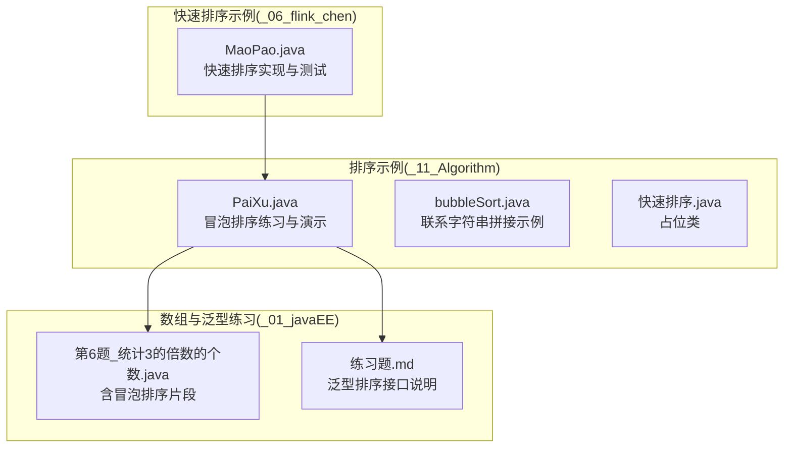
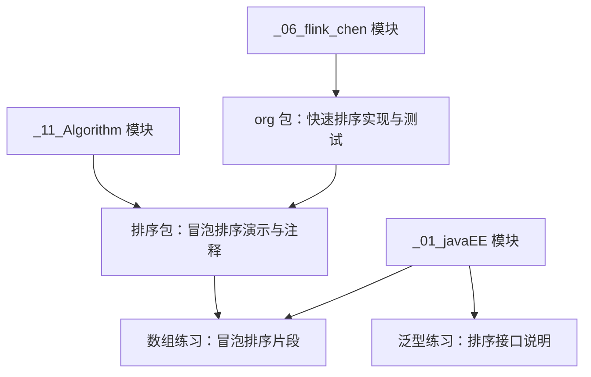
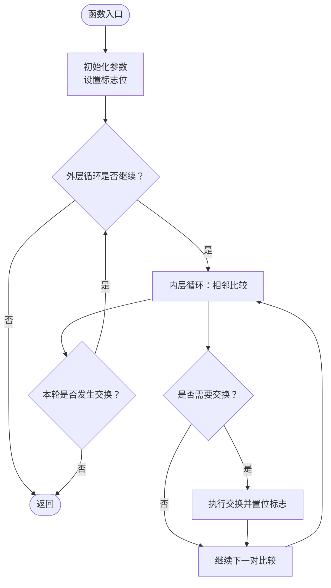
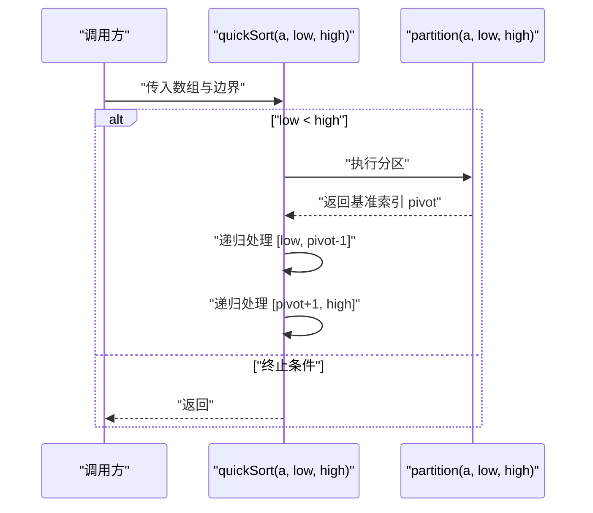
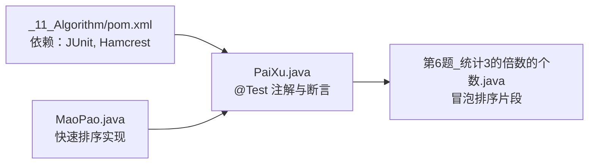

# 排序算法

<cite>
**本文引用的文件**
- [PaiXu.java](file://_11_Algorithm/src/main/java/_50_算法/_01_排序/PaiXu.java)
- [bubbleSort.java](file://_11_Algorithm/src/main/java/_50_算法/_01_排序/bubbleSort.java)
- [快速排序.java](file://_11_Algorithm/src/main/java/_50_算法/_01_排序/快速排序.java)
- [MaoPao.java](file://_06_flink_chen/src/main/java/org/MaoPao.java)
- [_11_Algorithm/pom.xml](file://_11_Algorithm/pom.xml)
- [第6题_统计3的倍数的个数.java](file://_01_javaEE/src/main/java/_04_数组/一维数组基本算法/第6题_统计3的倍数的个数.java)
- [练习题.md](file://_01_javaEE/src/main/java/_12_泛型/练习题.md)
</cite>

## 目录
1. [引言](#引言)
2. [项目结构](#项目结构)
3. [核心组件](#核心组件)
4. [架构总览](#架构总览)
5. [详细组件分析](#详细组件分析)
6. [依赖分析](#依赖分析)
7. [性能考量](#性能考量)
8. [故障排查指南](#故障排查指南)
9. [结论](#结论)
10. [附录](#附录)

## 引言
本技术文档围绕仓库中的排序算法实现进行系统化梳理，重点覆盖冒泡排序、快速排序、选择排序与插入排序等经典算法。通过对现有代码的逐行解读，结合时间/空间复杂度分析、稳定性与原地排序特性说明，以及典型使用场景与优化建议，帮助读者在理解算法原理的同时，掌握如何在实际工程中做出合适的排序算法选择。

## 项目结构
排序算法相关代码主要位于以下位置：
- 排序示例与练习：_11_Algorithm 模块下的排序包
- 快速排序示例：_06_flink_chen 模块下的 org 包
- 与排序相关的数组练习：_01_javaEE 模块下的数组与泛型练习

图表来源
- [PaiXu.java](file://_11_Algorithm/src/main/java/_50_算法/_01_排序/PaiXu.java#L1-L223)
- [bubbleSort.java](file://_11_Algorithm/src/main/java/_50_算法/_01_排序/bubbleSort.java#L1-L19)
- [快速排序.java](file://_11_Algorithm/src/main/java/_50_算法/_01_排序/快速排序.java#L1-L11)
- [MaoPao.java](file://_06_flink_chen/src/main/java/org/MaoPao.java#L1-L41)
- [第6题_统计3的倍数的个数.java](file://_01_javaEE/src/main/java/_04_数组/一维数组基本算法/第6题_统计3的倍数的个数.java#L1-L43)
- [练习题.md](file://_01_javaEE/src/main/java/_12_泛型/练习题.md#L72-L104)

章节来源
- [PaiXu.java](file://_11_Algorithm/src/main/java/_50_算法/_01_排序/PaiXu.java#L1-L223)
- [_11_Algorithm/pom.xml](file://_11_Algorithm/pom.xml#L1-L32)

## 核心组件
- 冒泡排序实现与演示：在 PaiXu.java 中提供了多个冒泡排序变体与注释说明，涵盖基础版本、带提前终止的优化版本，以及用于演示的多组测试方法。
- 快速排序实现与演示：在 MaoPao.java 中提供了快速排序的分治实现与 partition 步骤，便于理解快速排序的核心思想。
- 选择排序与插入排序：在 PaiXu.java 的注释中明确提及“可使用冒泡排序或直接选择排序”，表明选择排序作为替代方案的存在；插入排序相关内容可在数组练习中找到其在排序过程中的应用片段。
- 泛型排序接口：练习题.md 中明确了使用冒泡排序实现泛型数组的排序接口，体现排序算法在通用容器中的复用能力。

章节来源
- [PaiXu.java](file://_11_Algorithm/src/main/java/_50_算法/_01_排序/PaiXu.java#L1-L223)
- [MaoPao.java](file://_06_flink_chen/src/main/java/org/MaoPao.java#L1-L41)
- [练习题.md](file://_01_javaEE/src/main/java/_12_泛型/练习题.md#L72-L104)

## 架构总览
从模块视角看，排序算法示例分布在两个模块中：
- 算法练习模块：集中展示冒泡排序与相关数组练习，便于学习与验证。
- 快速排序示例模块：提供快速排序的实现与测试入口，便于理解分治策略。

图表来源
- [PaiXu.java](file://_11_Algorithm/src/main/java/_50_算法/_01_排序/PaiXu.java#L1-L223)
- [MaoPao.java](file://_06_flink_chen/src/main/java/org/MaoPao.java#L1-L41)
- [第6题_统计3的倍数的个数.java](file://_01_javaEE/src/main/java/_04_数组/一维数组基本算法/第6题_统计3的倍数的个数.java#L1-L43)
- [练习题.md](file://_01_javaEE/src/main/java/_12_泛型/练习题.md#L72-L104)

## 详细组件分析

### 冒泡排序分析
冒泡排序通过相邻元素的两两比较与交换，逐步将较大（或较小）的元素“冒泡”到数组的一端。仓库中的实现体现了以下关键点：
- 外层循环控制比较轮数，通常为 n-1 轮。
- 内层循环负责相邻元素比较，每轮结束后最值到达最终位置，因此比较范围逐步缩小。
- 优化策略：引入布尔标志位检测某一轮是否发生交换，若未发生交换则提前结束，显著提升已有序或接近有序数据的性能。

图表来源
- [PaiXu.java](file://_11_Algorithm/src/main/java/_50_算法/_01_排序/PaiXu.java#L13-L186)
- [第6题_统计3的倍数的个数.java](file://_01_javaEE/src/main/java/_04_数组/一维数组基本算法/第6题_统计3的倍数的个数.java#L23-L37)

章节来源
- [PaiXu.java](file://_11_Algorithm/src/main/java/_50_算法/_01_排序/PaiXu.java#L13-L186)
- [第6题_统计3的倍数的个数.java](file://_01_javaEE/src/main/java/_04_数组/一维数组基本算法/第6题_统计3的倍数的个数.java#L23-L37)

### 快速排序分析
快速排序采用分治策略，通过选取基准元素将数组划分为小于与大于基准的两部分，再递归处理子数组。仓库中的实现展示了核心流程：
- 递归终止条件：low < high。
- 分区操作：从两端向中间扫描，将小于/大于基准的元素交换至正确侧，最终将基准放置到正确位置。
- 递归处理：对基准两侧子区间分别进行快速排序。

图表来源
- [MaoPao.java](file://_06_flink_chen/src/main/java/org/MaoPao.java#L9-L22)
- [MaoPao.java](file://_06_flink_chen/src/main/java/org/MaoPao.java#L24-L38)

章节来源
- [MaoPao.java](file://_06_flink_chen/src/main/java/org/MaoPao.java#L9-L22)
- [MaoPao.java](file://_06_flink_chen/src/main/java/org/MaoPao.java#L24-L38)

### 选择排序与插入排序
- 选择排序：在每一轮从未排序部分选择最小（或最大）元素放入已排序部分的末尾。仓库注释中明确指出“可使用冒泡排序或直接选择排序”，表明选择排序作为替代方案存在。
- 插入排序：将元素插入到已排序序列的正确位置。仓库中的数组练习片段展示了排序过程中相邻元素的比较与交换，这与插入排序的思路一致。

章节来源
- [PaiXu.java](file://_11_Algorithm/src/main/java/_50_算法/_01_排序/PaiXu.java#L188-L191)
- [第6题_统计3的倍数的个数.java](file://_01_javaEE/src/main/java/_04_数组/一维数组基本算法/第6题_统计3的倍数的个数.java#L23-L37)

### 泛型排序接口与冒泡排序
练习题.md 明确要求使用冒泡排序实现泛型数组的排序接口，体现排序算法在通用容器中的复用能力。该接口支持自然排序与自定义比较器两种形式，便于在不同业务场景中灵活使用。

章节来源
- [练习题.md](file://_01_javaEE/src/main/java/_12_泛型/练习题.md#L72-L104)

## 依赖分析
- 模块依赖：_11_Algorithm 模块引入 JUnit 与 Hamcrest，用于单元测试与断言，便于验证排序算法的正确性。
- 文件间耦合：MaoPao.java 与 PaiXu.java 在概念上相互关联（均涉及排序），但文件间无直接 import 关系；数组练习文件与排序实现共享“冒泡排序”这一通用思想。

图表来源
- [_11_Algorithm/pom.xml](file://_11_Algorithm/pom.xml#L18-L28)
- [PaiXu.java](file://_11_Algorithm/src/main/java/_50_算法/_01_排序/PaiXu.java#L1-L223)
- [第6题_统计3的倍数的个数.java](file://_01_javaEE/src/main/java/_04_数组/一维数组基本算法/第6题_统计3的倍数的个数.java#L1-L43)
- [MaoPao.java](file://_06_flink_chen/src/main/java/org/MaoPao.java#L1-L41)

章节来源
- [_11_Algorithm/pom.xml](file://_11_Algorithm/pom.xml#L18-L28)
- [PaiXu.java](file://_11_Algorithm/src/main/java/_50_算法/_01_排序/PaiXu.java#L1-L223)
- [第6题_统计3的倍数的个数.java](file://_01_javaEE/src/main/java/_04_数组/一维数组基本算法/第6题_统计3的倍数的个数.java#L1-L43)
- [MaoPao.java](file://_06_flink_chen/src/main/java/org/MaoPao.java#L1-L41)

## 性能考量
- 时间复杂度
  - 冒泡排序：平均/最坏 O(n^2)，最好 O(n)（开启提前终止优化）。
  - 快速排序：平均 O(n log n)，最坏 O(n^2)（当分区极不平衡时）。
  - 选择排序：稳定 O(n^2)，无论数据分布。
  - 插入排序：平均/最坏 O(n^2)，最好 O(n)（接近有序时表现优异）。
- 空间复杂度
  - 冒泡排序、选择排序、插入排序均为原地排序，空间复杂度 O(1)。
  - 快速排序递归深度平均 O(log n)，最坏 O(n)，空间复杂度 O(log n) 或 O(n)（取决于实现细节）。
- 稳定性
  - 冒泡排序、插入排序为稳定排序。
  - 快速排序、选择排序为不稳定排序。
- 适用场景
  - 小规模或基本有序数据：插入排序、冒泡排序（优化版）。
  - 一般规模数据：快速排序（注意避免最坏情况）。
  - 需要稳定性的场景：优先选择冒泡排序或插入排序。
  - 对内存敏感且需原地排序：选择排序或插入排序。

## 故障排查指南
- 冒泡排序未提前终止
  - 现象：即使数组已有序，仍继续多轮比较。
  - 排查：检查是否在每轮结束后检测标志位并据此决定是否退出。
  - 参考路径：[PaiXu.java](file://_11_Algorithm/src/main/java/_50_算法/_01_排序/PaiXu.java#L52-L74)
- 快速排序栈溢出或超时
  - 现象：极端逆序或重复元素过多导致递归过深。
  - 排查：确认递归终止条件与分区逻辑；必要时引入随机化基准或迭代实现。
  - 参考路径：[MaoPao.java](file://_06_flink_chen/src/main/java/org/MaoPao.java#L16-L22)
- 分区边界错误
  - 现象：基准元素未放置到正确位置，导致递归区间错误。
  - 排查：核对双指针扫描与赋值顺序，确保最后将基准放回正确位置。
  - 参考路径：[MaoPao.java](file://_06_flink_chen/src/main/java/org/MaoPao.java#L24-L38)
- 泛型排序接口未按预期工作
  - 现象：使用自定义比较器时排序结果异常。
  - 排查：确认比较器返回值约定与泛型类型匹配，确保冒泡排序内部比较逻辑正确。
  - 参考路径：[练习题.md](file://_01_javaEE/src/main/java/_12_泛型/练习题.md#L72-L104)

章节来源
- [PaiXu.java](file://_11_Algorithm/src/main/java/_50_算法/_01_排序/PaiXu.java#L52-L74)
- [MaoPao.java](file://_06_flink_chen/src/main/java/org/MaoPao.java#L16-L38)
- [练习题.md](file://_01_javaEE/src/main/java/_12_泛型/练习题.md#L72-L104)

## 结论
仓库中的排序实现以冒泡排序为主，辅以快速排序示例与数组练习片段，形成了从基础到进阶的学习路径。通过理解冒泡排序的优化策略、快速排序的分治思想，以及在泛型环境下的排序接口设计，开发者可以在不同场景中做出更合理的算法选择。建议在生产环境中优先考虑快速排序（配合随机化与尾递归优化），同时根据稳定性与内存约束选择插入排序或冒泡排序。

## 附录
- 代码片段路径参考
  - 冒泡排序基础与优化：[PaiXu.java](file://_11_Algorithm/src/main/java/_50_算法/_01_排序/PaiXu.java#L13-L186)
  - 快速排序实现与测试：[MaoPao.java](file://_06_flink_chen/src/main/java/org/MaoPao.java#L9-L38)
  - 选择排序提示与插入排序片段：[PaiXu.java](file://_11_Algorithm/src/main/java/_50_算法/_01_排序/PaiXu.java#L188-L191), [第6题_统计3的倍数的个数.java](file://_01_javaEE/src/main/java/_04_数组/一维数组基本算法/第6题_统计3的倍数的个数.java#L23-L37)
  - 泛型排序接口说明：[练习题.md](file://_01_javaEE/src/main/java/_12_泛型/练习题.md#L72-L104)