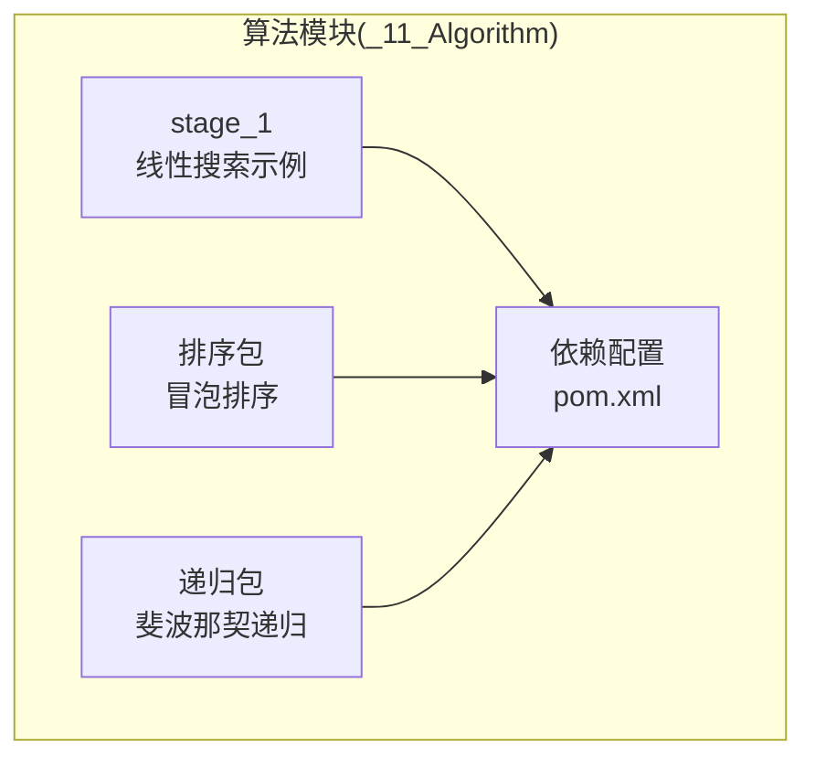
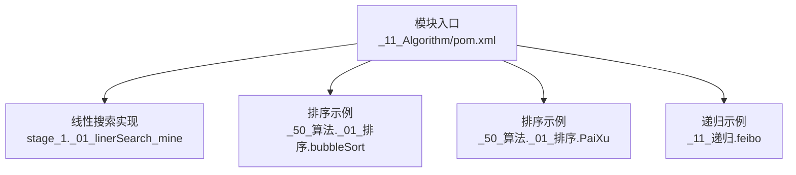
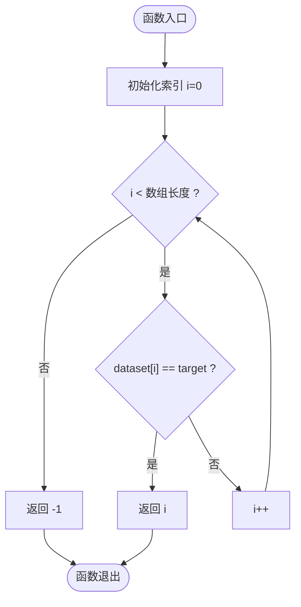
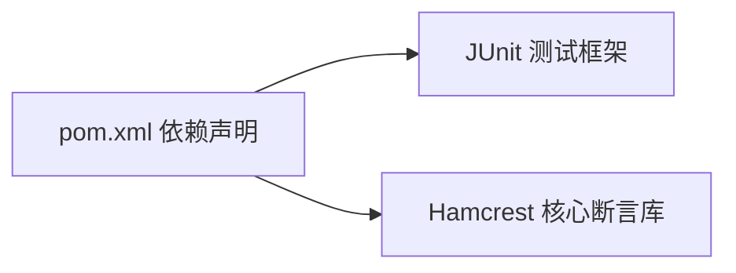

# 搜索算法

<cite>
**本文引用的文件**
- [_01_linerSearch_mine.java](file://_11_Algorithm/src/main/java/stage_1/_01_linerSearch_mine.java)
- [bubbleSort.java](file://_11_Algorithm/src/main/java/_50_算法/_01_排序/bubbleSort.java)
- [PaiXu.java](file://_11_Algorithm/src/main/java/_50_算法/_01_排序/PaiXu.java)
- [feibo.java](file://_11_Algorithm/src/main/java/_11_递归/feibo.java)
- [pom.xml](file://_11_Algorithm/pom.xml)
</cite>

## 目录
1. [简介](#简介)
2. [项目结构](#项目结构)
3. [核心组件](#核心组件)
4. [架构总览](#架构总览)
5. [详细组件分析](#详细组件分析)
6. [依赖分析](#依赖分析)
7. [性能考量](#性能考量)
8. [故障排查指南](#故障排查指南)
9. [结论](#结论)
10. [附录](#附录)

## 简介
本技术指南围绕“搜索算法”主题，聚焦两类经典算法：线性搜索与二分搜索。文档从实现原理、时间/空间复杂度、边界条件处理、适用场景与选择策略等方面进行系统讲解，并结合仓库中现有的线性搜索实现示例，给出可操作的实践建议与优化思路。由于当前仓库未包含二分搜索的具体实现，本文将以线性搜索为核心，辅以二分搜索的理论与实践建议，帮助开发者在不同数据特征与性能要求下做出合理选择。

## 项目结构
本仓库与“搜索算法”相关的代码位于算法模块中，主要包含：
- 线性搜索示例：stage_1 包下的线性搜索实现
- 排序相关示例：排序包中的冒泡排序与递归示例（用于理解数据有序性与递归思想）

图表来源
- [_01_linerSearch_mine.java](file://_11_Algorithm/src/main/java/stage_1/_01_linerSearch_mine.java#L1-L22)
- [bubbleSort.java](file://_11_Algorithm/src/main/java/_50_算法/_01_排序/bubbleSort.java#L1-L20)
- [PaiXu.java](file://_11_Algorithm/src/main/java/_50_算法/_01_排序/PaiXu.java#L1-L224)
- [feibo.java](file://_11_Algorithm/src/main/java/_11_递归/feibo.java#L1-L61)
- [pom.xml](file://_11_Algorithm/pom.xml#L1-L31)

章节来源
- [pom.xml](file://_11_Algorithm/pom.xml#L1-L31)

## 核心组件
- 线性搜索实现：位于 stage_1 包，提供一个静态方法，按顺序遍历数组，匹配目标值即返回索引，否则返回-1。该实现具备良好的边界条件处理（空数组、单元素、未命中等情况）。
- 排序与递归示例：排序包中的冒泡排序与递归包中的斐波那契递归，有助于理解数据有序性对搜索效率的影响以及递归思想在算法中的应用。

章节来源
- [_01_linerSearch_mine.java](file://_11_Algorithm/src/main/java/stage_1/_01_linerSearch_mine.java#L1-L22)
- [bubbleSort.java](file://_11_Algorithm/src/main/java/_50_算法/_01_排序/bubbleSort.java#L1-L20)
- [PaiXu.java](file://_11_Algorithm/src/main/java/_50_算法/_01_排序/PaiXu.java#L1-L224)
- [feibo.java](file://_11_Algorithm/src/main/java/_11_递归/feibo.java#L1-L61)

## 架构总览
以下图展示了“线性搜索示例”在算法模块中的位置与依赖关系：

图表来源
- [pom.xml](file://_11_Algorithm/pom.xml#L1-L31)
- [_01_linerSearch_mine.java](file://_11_Algorithm/src/main/java/stage_1/_01_linerSearch_mine.java#L1-L22)
- [bubbleSort.java](file://_11_Algorithm/src/main/java/_50_算法/_01_排序/bubbleSort.java#L1-L20)
- [PaiXu.java](file://_11_Algorithm/src/main/java/_50_算法/_01_排序/PaiXu.java#L1-L224)
- [feibo.java](file://_11_Algorithm/src/main/java/_11_递归/feibo.java#L1-L61)

## 详细组件分析

### 组件A：线性搜索实现
- 作用：在无序或未排序数组中查找目标值，返回其索引；若不存在返回-1。
- 关键点：
  - 遍历顺序：从索引0到n-1逐项比较。
  - 命中即返回，具有早期退出特性。
  - 边界处理：空数组或越界访问由语言层保证；未命中返回约定值-1。
- 时间复杂度：O(n)
- 空间复杂度：O(1)
- 适用场景：数据量较小、数据未排序、或仅需一次性查找。

图表来源
- [_01_linerSearch_mine.java](file://_11_Algorithm/src/main/java/stage_1/_01_linerSearch_mine.java#L1-L22)

章节来源
- [_01_linerSearch_mine.java](file://_11_Algorithm/src/main/java/stage_1/_01_linerSearch_mine.java#L1-L22)

### 组件B：二分搜索（概念与实践建议）
- 适用前提：数据必须已排序（升序或降序），且支持随机访问（如数组）。
- 基本思想：每次比较中间元素，根据比较结果缩小搜索区间至左半或右半，直至命中或区间为空。
- 时间复杂度：O(log n)
- 空间复杂度：迭代实现 O(1)，递归实现 O(log n)（栈深）
- 实践建议：
  - 在数据规模较大且频繁查询时优先考虑二分搜索。
  - 若数据频繁插入/删除导致维护成本高，则权衡是否采用平衡树或跳表等结构。
  - 注意整数溢出与边界计算，推荐使用 left + (right - left)/2 计算中点，避免 (left + right)/2 溢出风险。

说明：当前仓库未包含二分搜索的具体实现，以上为通用指导与最佳实践建议。

### 组件C：排序与递归示例（辅助理解）
- 冒泡排序：演示数组元素两两比较与交换，体现“有序性”对搜索效率的重要性。
- 斐波那契递归：演示递归思想与边界条件，有助于理解递归在算法中的应用。

章节来源
- [bubbleSort.java](file://_11_Algorithm/src/main/java/_50_算法/_01_排序/bubbleSort.java#L1-L20)
- [PaiXu.java](file://_11_Algorithm/src/main/java/_50_算法/_01_排序/PaiXu.java#L1-L224)
- [feibo.java](file://_11_Algorithm/src/main/java/_11_递归/feibo.java#L1-L61)

## 依赖分析
- 模块依赖：算法模块通过 Maven 管理依赖，包含 JUnit 与 Hamcrest 测试依赖，便于编写与运行单元测试。
- 组件耦合：线性搜索实现为独立工具方法，不依赖外部模块；排序与递归示例亦为独立示例，便于学习与复用。

图表来源
- [pom.xml](file://_11_Algorithm/pom.xml#L1-L31)

章节来源
- [pom.xml](file://_11_Algorithm/pom.xml#L1-L31)

## 性能考量
- 线性搜索
  - 优点：实现简单、无需数据有序、稳定。
  - 缺点：n 较大时效率较低。
  - 优化方向：缓存热点数据、批量查找时使用布隆过滤器预筛、或转换为二分搜索（若允许排序）。
- 二分搜索
  - 优点：对大规模有序数据查询效率高。
  - 缺点：需要维护有序性，插入/删除成本较高。
  - 优化方向：使用平衡树或跳表保持动态有序；注意中点计算与边界处理，避免整数溢出与死循环。

## 故障排查指南
- 未命中返回值
  - 线性搜索：未命中返回约定值-1，调用方需显式判断并处理。
- 空数组或越界
  - 线性搜索：循环条件确保不会越界；若传入 null 或非法索引，需在外层进行防御性校验。
- 二分搜索常见问题
  - 中点计算：优先使用 left + (right - left)/2，避免 left + right 溢出。
  - 边界更新：while 条件与边界更新需一致，防止死循环或遗漏。
  - 数据有序性：若数据未排序，先排序再二分，或改用线性搜索。

章节来源
- [_01_linerSearch_mine.java](file://_11_Algorithm/src/main/java/stage_1/_01_linerSearch_mine.java#L1-L22)

## 结论
- 当数据未排序或规模较小，线性搜索是简单可靠的首选。
- 当数据规模大且查询频繁，优先考虑二分搜索；若需要频繁维护有序性，可评估平衡树或跳表等结构。
- 在工程实践中，应结合业务场景、数据特征与性能指标，综合选择与优化搜索策略。

## 附录
- 代码片段路径参考
  - 线性搜索实现：[_01_linerSearch_mine.java](file://_11_Algorithm/src/main/java/stage_1/_01_linerSearch_mine.java#L1-L22)
  - 排序示例：[bubbleSort.java](file://_11_Algorithm/src/main/java/_50_算法/_01_排序/bubbleSort.java#L1-L20)、[PaiXu.java](file://_11_Algorithm/src/main/java/_50_算法/_01_排序/PaiXu.java#L1-L224)
  - 递归示例：[feibo.java](file://_11_Algorithm/src/main/java/_11_递归/feibo.java#L1-L61)
  - 模块依赖：[pom.xml](file://_11_Algorithm/pom.xml#L1-L31)