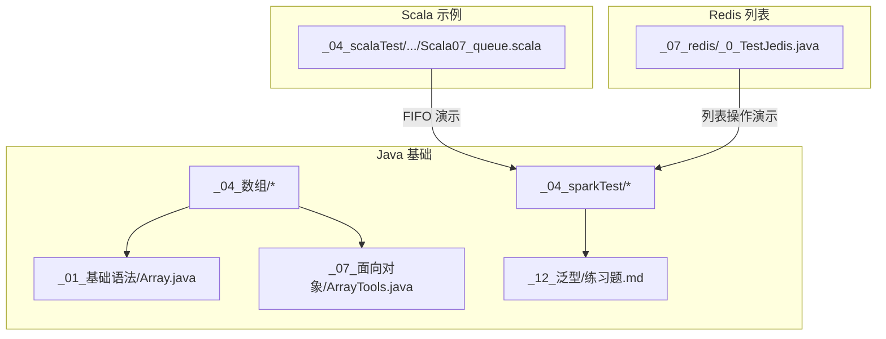
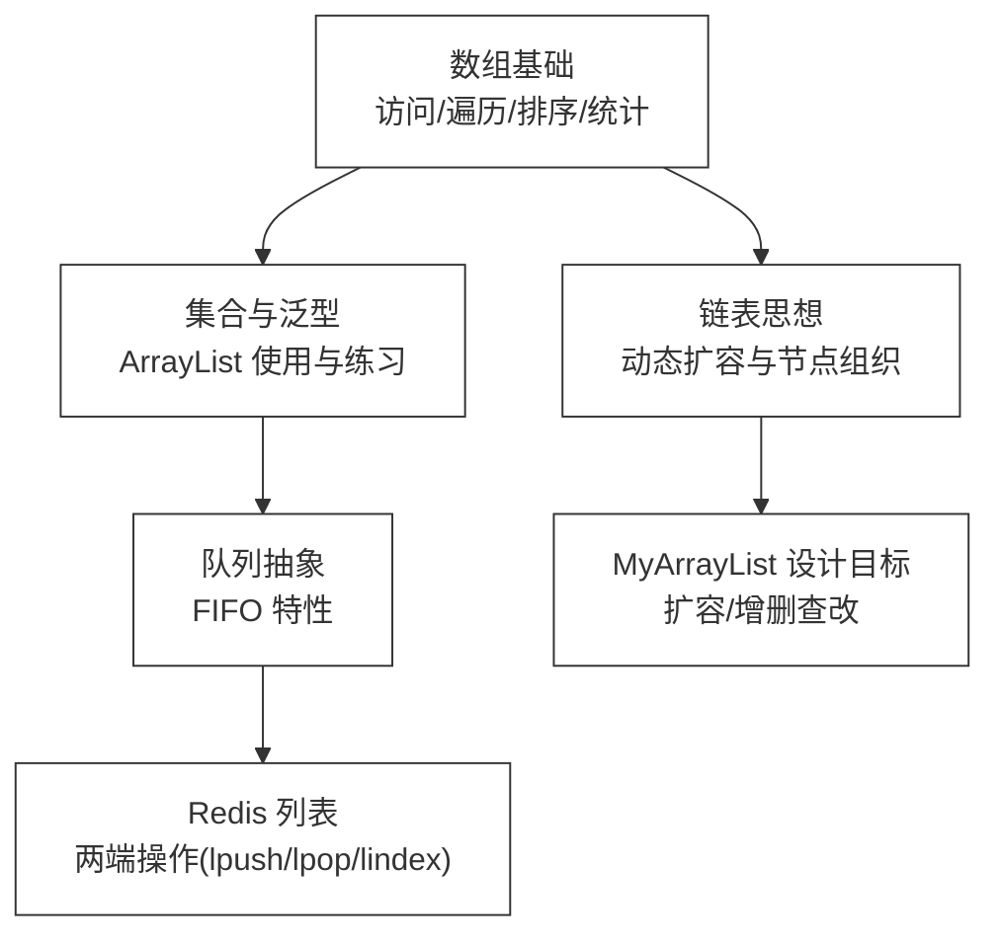
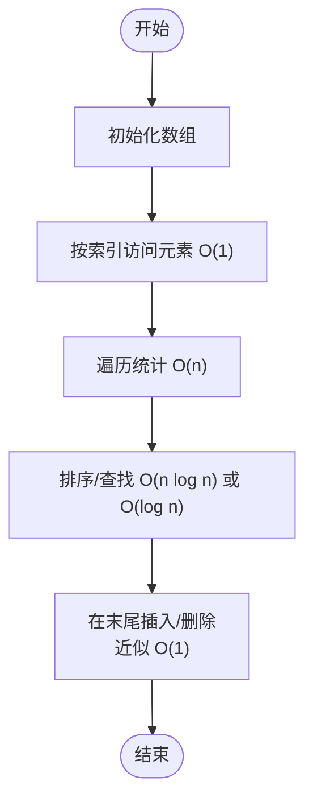
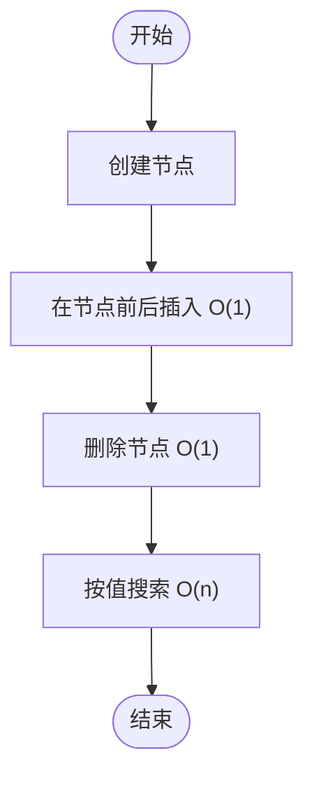
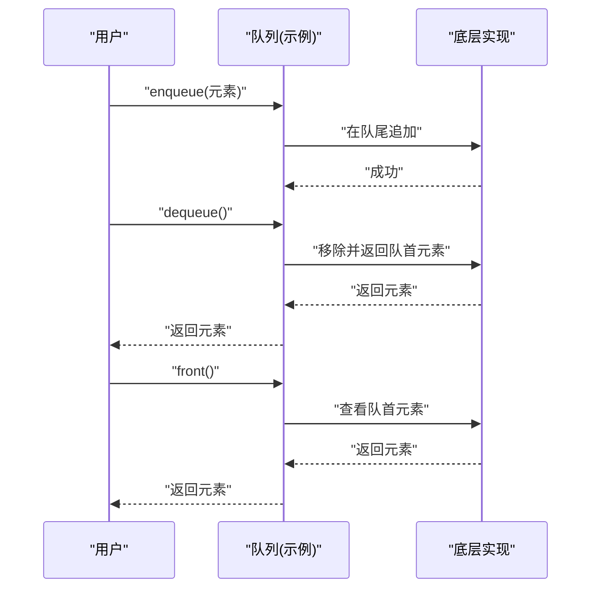
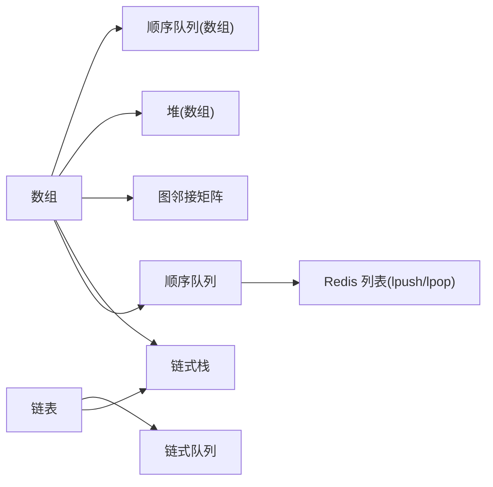

# 数据结构基础

<cite>
**本文引用的文件**
- [Array.java](file://_01_javaEE/src/main/java/_01_基础语法/Array.java)
- [ArrayTools.java](file://_01_javaEE/src/main/java/_07_面向对象/ArrayTools.java)
- [练习题.md](file://_01_javaEE/src/main/java/_12_泛型/练习题.md)
- [TestList.java](file://_04_sparkTest/src/main/java/com/atguigu/bigdata/spark/test/TestList.java)
- [Scala07_queue.scala](file://_04_scalaTest/src/main/scala/com/atguigu/scala/chapter07/Scala07_queue.scala)
- [_0_TestJedis.java](file://_07_redis/src/main/java/_0_TestJedis.java)
- [第6题_统计3的倍数的个数.java](file://_01_javaEE/src/main/java/_04_数组/一维数组基本算法/第6题_统计3的倍数的个数.java)
- [字母.java](file://_01_javaEE/src/main/java/_04_数组/一维数组基本使用/字母.java)
- [杨辉三角.java](file://_01_javaEE/src/main/java/_04_二维数组/杨辉三角.java)
</cite>

## 目录
1. [引言](#引言)
2. [项目结构](#项目结构)
3. [核心组件](#核心组件)
4. [架构总览](#架构总览)
5. [详细组件分析](#详细组件分析)
6. [依赖关系分析](#依赖关系分析)
7. [性能考量](#性能考量)
8. [故障排查指南](#故障排查指南)
9. [结论](#结论)
10. [附录](#附录)

## 引言
本入门文档围绕数据结构基础展开，系统讲解数组、链表、栈、队列等核心数据结构的概念、实现原理、时间/空间复杂度特征与典型应用场景。文档以仓库中的Java与Scala示例为依据，结合练习题与测试代码，帮助初学者建立从理论到实践的完整认知路径，并提供可操作的学习建议与案例。

## 项目结构
本仓库包含大量Java与Scala示例，涵盖数组、集合、泛型、队列等主题。与“数据结构基础”最相关的模块包括：
- 数组与基本算法：一维数组、二维数组、排序与统计
- 集合与泛型：ArrayList使用、泛型工具与练习
- 队列：Scala可变队列与Redis列表操作演示

**图表来源**
- [Array.java](file://_01_javaEE/src/main/java/_01_基础语法/Array.java#L1-L23)
- [ArrayTools.java](file://_01_javaEE/src/main/java/_07_面向对象/ArrayTools.java#L1-L57)
- [练习题.md](file://_01_javaEE/src/main/java/_12_泛型/练习题.md#L1-L147)
- [TestList.java](file://_04_sparkTest/src/main/java/com/atguigu/bigdata/spark/test/TestList.java#L1-L15)
- [Scala07_queue.scala](file://_04_scalaTest/src/main/scala/com/atguigu/scala/chapter07/Scala07_queue.scala#L1-L29)
- [_0_TestJedis.java](file://_07_redis/src/main/java/_0_TestJedis.java#L118-L150)

**章节来源**
- [Array.java](file://_01_javaEE/src/main/java/_01_基础语法/Array.java#L1-L23)
- [ArrayTools.java](file://_01_javaEE/src/main/java/_07_面向对象/ArrayTools.java#L1-L57)
- [练习题.md](file://_01_javaEE/src/main/java/_12_泛型/练习题.md#L1-L147)
- [TestList.java](file://_04_sparkTest/src/main/java/com/atguigu/bigdata/spark/test/TestList.java#L1-L15)
- [Scala07_queue.scala](file://_04_scalaTest/src/main/scala/com/atguigu/scala/chapter07/Scala07_queue.scala#L1-L29)
- [_0_TestJedis.java](file://_07_redis/src/main/java/_0_TestJedis.java#L118-L150)

## 核心组件
本节聚焦四类基础数据结构：数组、链表、栈、队列。为避免直接粘贴代码，我们将通过“代码片段路径”指引读者定位到仓库中的实现与示例。

- 数组（Array）
  - 基本操作：访问、遍历、统计、排序
  - 复杂度：随机访问 O(1)，插入/删除（非末尾）平均 O(n)
  - 示例参考：
    - [第6题_统计3的倍数的个数.java](file://_01_javaEE/src/main/java/_04_数组/一维数组基本算法/第6题_统计3的倍数的个数.java#L1-L44)
    - [字母.java](file://_01_javaEE/src/main/java/_04_数组/一维数组基本使用/字母.java#L1-L30)
    - [杨辉三角.java](file://_01_javaEE/src/main/java/_04_二维数组/杨辉三角.java#L1-L43)

- 链表（LinkedList）
  - 特性：节点与指针，动态长度，插入/删除高效 O(1)（已知节点）
  - 实现形态：单向/双向链表
  - 示例参考：仓库未直接给出Java链表实现；可参考以下练习题与集合使用作为替代理解
    - [练习题.md](file://_01_javaEE/src/main/java/_12_泛型/练习题.md#L1-L147) 中的“MyArrayList<T>”设计目标体现了链表思想（动态扩容、按需增长）

- 栈（Stack）
  - 特性：LIFO（后进先出），常见操作 push/pop/peek/top
  - 实现形态：顺序栈（数组）、链式栈（链表）
  - 示例参考：仓库未直接给出显式栈实现；可结合队列与集合的使用模式理解栈的逻辑

- 队列（Queue）
  - 特性：FIFO（先进先出），常见操作 enqueue/dequeue/peek/front/rear
  - 实现形态：顺序队列（数组环形缓冲）、链式队列
  - 示例参考：
    - [Scala07_queue.scala](file://_04_scalaTest/src/main/scala/com/atguigu/scala/chapter07/Scala07_queue.scala#L1-L29) 展示了Scala可变队列的入队与出队
    - [TestList.java](file://_04_sparkTest/src/main/java/com/atguigu/bigdata/spark/test/TestList.java#L1-L15) 展示了Java集合的使用，便于理解队列抽象
    - [_0_TestJedis.java](file://_07_redis/src/main/java/_0_TestJedis.java#L118-L150) 展示了Redis列表的 lpush/lpop/lindex 等操作，体现队列的两端操作特性

**章节来源**
- [第6题_统计3的倍数的个数.java](file://_01_javaEE/src/main/java/_04_数组/一维数组基本算法/第6题_统计3的倍数的个数.java#L1-L44)
- [字母.java](file://_01_javaEE/src/main/java/_04_数组/一维数组基本使用/字母.java#L1-L30)
- [杨辉三角.java](file://_01_javaEE/src/main/java/_04_二维数组/杨辉三角.java#L1-L43)
- [练习题.md](file://_01_javaEE/src/main/java/_12_泛型/练习题.md#L120-L147)
- [Scala07_queue.scala](file://_04_scalaTest/src/main/scala/com/atguigu/scala/chapter07/Scala07_queue.scala#L1-L29)
- [TestList.java](file://_04_sparkTest/src/main/java/com/atguigu/bigdata/spark/test/TestList.java#L1-L15)
- [_0_TestJedis.java](file://_07_redis/src/main/java/_0_TestJedis.java#L118-L150)

## 架构总览
下图从“学习路径”的角度展示从数组到集合再到队列的演进关系，帮助初学者逐步建立数据结构知识体系。

[此图为概念性示意，不对应具体源码文件，故无“图表来源”标注]

## 详细组件分析

### 数组（Array）分析
- 核心能力
  - 随机访问：通过索引直接定位元素，时间复杂度 O(1)
  - 遍历与统计：线性扫描，时间复杂度 O(n)
  - 排序与查找：可基于比较或哈希策略优化
- 复杂度概览
  - 访问：O(1)
  - 搜索：无序 O(n)，有序 O(log n)
  - 插入/删除（非末尾）：O(n)
  - 空间：O(n)
- 代码片段路径
  - [第6题_统计3的倍数的个数.java](file://_01_javaEE/src/main/java/_04_数组/一维数组基本算法/第6题_统计3的倍数的个数.java#L1-L44)
  - [字母.java](file://_01_javaEE/src/main/java/_04_数组/一维数组基本使用/字母.java#L1-L30)
  - [杨辉三角.java](file://_01_javaEE/src/main/java/_04_二维数组/杨辉三角.java#L1-L43)

**章节来源**
- [第6题_统计3的倍数的个数.java](file://_01_javaEE/src/main/java/_04_数组/一维数组基本算法/第6题_统计3的倍数的个数.java#L1-L44)
- [字母.java](file://_01_javaEE/src/main/java/_04_数组/一维数组基本使用/字母.java#L1-L30)
- [杨辉三角.java](file://_01_javaEE/src/main/java/_04_二维数组/杨辉三角.java#L1-L43)

### 链表（LinkedList）分析
- 核心能力
  - 动态长度，节点通过指针连接
  - 在已知节点前后插入/删除的时间复杂度为 O(1)
- 复杂度概览
  - 访问：O(n)
  - 搜索：O(n)
  - 插入/删除：O(1)（已知节点）
  - 空间：O(n)（额外指针开销）
- 代码片段路径
  - [练习题.md](file://_01_javaEE/src/main/java/_12_泛型/练习题.md#L120-L147) 中的“MyArrayList<T>”设计目标体现了链表思想（动态扩容、按需增长）

**章节来源**
- [练习题.md](file://_01_javaEE/src/main/java/_12_泛型/练习题.md#L120-L147)

### 栈（Stack）分析
- 核心能力
  - LIFO（后进先出）：push、pop、peek/top
  - 应用：表达式求值、括号匹配、回溯算法
- 复杂度概览
  - 入栈/出栈/查看栈顶：O(1)
  - 空间：O(n)
- 代码片段路径
  - 本仓库未直接给出显式栈实现；可结合队列与集合的使用模式理解栈的逻辑

[本节为概念性说明，未直接分析具体文件，故无“章节来源”与“图表来源”]

### 队列（Queue）分析
- 核心能力
  - FIFO（先进先出）：enqueue、dequeue、front/rear
  - 应用：广度优先搜索、任务调度、缓冲区
- 复杂度概览
  - 入队/出队/查看队首：O(1)
  - 空间：O(n)
- 代码片段路径
  - [Scala07_queue.scala](file://_04_scalaTest/src/main/scala/com/atguigu/scala/chapter07/Scala07_queue.scala#L1-L29) 展示了Scala可变队列的入队与出队
  - [TestList.java](file://_04_sparkTest/src/main/java/com/atguigu/bigdata/spark/test/TestList.java#L1-L15) 展示了Java集合的使用
  - [_0_TestJedis.java](file://_07_redis/src/main/java/_0_TestJedis.java#L118-L150) 展示了Redis列表的 lpush/lpop/lindex 等操作，体现队列的两端操作特性

**图表来源**
- [Scala07_queue.scala](file://_04_scalaTest/src/main/scala/com/atguigu/scala/chapter07/Scala07_queue.scala#L1-L29)
- [TestList.java](file://_04_sparkTest/src/main/java/com/atguigu/bigdata/spark/test/TestList.java#L1-L15)
- [_0_TestJedis.java](file://_07_redis/src/main/java/_0_TestJedis.java#L118-L150)

**章节来源**
- [Scala07_queue.scala](file://_04_scalaTest/src/main/scala/com/atguigu/scala/chapter07/Scala07_queue.scala#L1-L29)
- [TestList.java](file://_04_sparkTest/src/main/java/com/atguigu/bigdata/spark/test/TestList.java#L1-L15)
- [_0_TestJedis.java](file://_07_redis/src/main/java/_0_TestJedis.java#L118-L150)

## 依赖关系分析
- 概念依赖
  - 数组是其他结构的基础（例如顺序队列、堆、图的邻接矩阵）
  - 链表与数组在“动态扩容/插入删除效率”上形成互补
  - 栈与队列是更高级的抽象，常以内存中的数组或链表作为底层实现
- 代码映射
  - 数组示例与工具类展示了访问、遍历、统计、排序等通用能力
  - 练习题中的“MyArrayList<T>”目标体现了链表思想（动态扩容）
  - 队列示例分别来自Scala集合与Redis列表操作

[此图为概念性示意，不对应具体源码文件，故无“图表来源”标注]

**章节来源**
- [ArrayTools.java](file://_01_javaEE/src/main/java/_07_面向对象/ArrayTools.java#L1-L57)
- [练习题.md](file://_01_javaEE/src/main/java/_12_泛型/练习题.md#L120-L147)
- [_0_TestJedis.java](file://_07_redis/src/main/java/_0_TestJedis.java#L118-L150)

## 性能考量
- 时间复杂度
  - 数组：随机访问 O(1)，插入/删除（非末尾）O(n)
  - 链表：插入/删除 O(1)，访问/搜索 O(n)
  - 栈/队列：入栈/出栈/入队/出队均摊 O(1)
- 空间复杂度
  - 数组：O(n)
  - 链表：O(n)（额外指针）
  - 栈/队列：O(n)
- 实践建议
  - 频繁随机访问选数组；频繁中间插入/删除选链表
  - 需要LIFO/FIFO语义时，优先考虑栈/队列抽象
  - 对于固定容量且尾部操作频繁的场景，顺序队列更高效

[本节为通用指导，不直接分析具体文件，故无“章节来源”]

## 故障排查指南
- 数组越界
  - 现象：访问索引超出范围导致异常
  - 排查：检查数组长度与索引边界
  - 参考路径：[第6题_统计3的倍数的个数.java](file://_01_javaEE/src/main/java/_04_数组/一维数组基本算法/第6题_统计3的倍数的个数.java#L1-L44)
- 队列空/满
  - 现象：出队时报空队列错误；顺序队列未处理环形边界
  - 排查：确认队列状态与容量；实现时注意“队空/队满”判定
  - 参考路径：[Scala07_queue.scala](file://_04_scalaTest/src/main/scala/com/atguigu/scala/chapter07/Scala07_queue.scala#L1-L29)
- 集合误用
  - 现象：未指定泛型导致编译警告或运行时异常
  - 排查：统一使用带泛型的集合类型
  - 参考路径：[TestList.java](file://_04_sparkTest/src/main/java/com/atguigu/bigdata/spark/test/TestList.java#L1-L15)
- Redis 列表操作
  - 现象：lindex/linsert/lrem 等参数顺序或位置不当
  - 排查：对照Redis命令文档，确保参数顺序与行为一致
  - 参考路径：[_0_TestJedis.java](file://_07_redis/src/main/java/_0_TestJedis.java#L118-L150)

**章节来源**
- [第6题_统计3的倍数的个数.java](file://_01_javaEE/src/main/java/_04_数组/一维数组基本算法/第6题_统计3的倍数的个数.java#L1-L44)
- [Scala07_queue.scala](file://_04_scalaTest/src/main/scala/com/atguigu/scala/chapter07/Scala07_queue.scala#L1-L29)
- [TestList.java](file://_04_sparkTest/src/main/java/com/atguigu/bigdata/spark/test/TestList.java#L1-L15)
- [_0_TestJedis.java](file://_07_redis/src/main/java/_0_TestJedis.java#L118-L150)

## 结论
通过对仓库中数组、集合、队列与Redis列表示例的梳理，我们建立了从基础数组到队列抽象的整体认知。初学者应先掌握数组的随机访问与线性扫描，再过渡到链表的动态组织与栈/队列的抽象语义。在实际工程中，应根据“访问/插入/删除”的频率与分布选择合适的数据结构，并重视边界条件与复杂度权衡。

[本节为总结性内容，不直接分析具体文件，故无“章节来源”]

## 附录
- 学习路径建议
  - 第一步：数组基础（访问、遍历、统计、排序）
    - 参考：[字母.java](file://_01_javaEE/src/main/java/_04_数组/一维数组基本使用/字母.java#L1-L30)、[第6题_统计3的倍数的个数.java](file://_01_javaEE/src/main/java/_04_数组/一维数组基本算法/第6题_统计3的倍数的个数.java#L1-L44)
  - 第二步：集合与泛型（ArrayList使用、泛型工具）
    - 参考：[TestList.java](file://_04_sparkTest/src/main/java/com/atguigu/bigdata/spark/test/TestList.java#L1-L15)、[练习题.md](file://_01_javaEE/src/main/java/_12_泛型/练习题.md#L1-L147)
  - 第三步：队列与栈（FIFO/LIFO抽象）
    - 参考：[Scala07_queue.scala](file://_04_scalaTest/src/main/scala/com/atguigu/scala/chapter07/Scala07_queue.scala#L1-L29)
  - 第四步：扩展实践（Redis列表）
    - 参考：[_0_TestJedis.java](file://_07_redis/src/main/java/_0_TestJedis.java#L118-L150)

**章节来源**
- [字母.java](file://_01_javaEE/src/main/java/_04_数组/一维数组基本使用/字母.java#L1-L30)
- [第6题_统计3的倍数的个数.java](file://_01_javaEE/src/main/java/_04_数组/一维数组基本算法/第6题_统计3的倍数的个数.java#L1-L44)
- [TestList.java](file://_04_sparkTest/src/main/java/com/atguigu/bigdata/spark/test/TestList.java#L1-L15)
- [练习题.md](file://_01_javaEE/src/main/java/_12_泛型/练习题.md#L1-L147)
- [Scala07_queue.scala](file://_04_scalaTest/src/main/scala/com/atguigu/scala/chapter07/Scala07_queue.scala#L1-L29)
- [_0_TestJedis.java](file://_07_redis/src/main/java/_0_TestJedis.java#L118-L150)